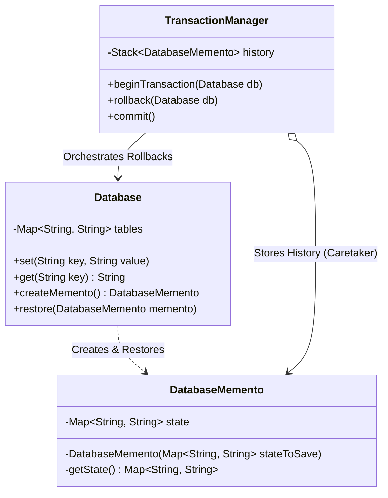

# 39. Memento Design Pattern

> 💡 **Quick Revision Anchor**: A comprehensive, interview-focused guide to the Memento Design Pattern faithfully derived from the complete lecture transcript. Resolves the **Encapsulation Paradox** by capturing and externalizing an object's internal snapshot without exposing private state fields. Deconstructs the three foundational participants: **Originator** (creator and consumer of snapshots), **Memento** (immutable state container), and **Caretaker** (lifecycle manager and history stack). Grounded in the lecture's canonical **Database Transaction Management System** (`BEGIN TRANSACTION`, `COMMIT`, `ROLLBACK`) and contrasts Memento's declarative snapshot restoration with Command Pattern's imperative undo execution.

---

## 1. Context & Motivation: The Encapsulation Paradox

Imagine building a **Database Transaction Management System** or a **Text Editor**:
- When a transaction begins (`BEGIN TRANSACTION`), we must record a checkpoint.
- If intermediate SQL updates fail due to a constraint violation or server crash, we must execute a `ROLLBACK` to restore tables to their original state.

### The Encapsulation Problem:
- To save an object's state from outside, you would have to expose all its private fields through public getters.
- This leaks private implementation details and breaks encapsulation.
- If another class mutates this snapshot, the checkpoint is corrupted.

### The Memento Solution:
Split the responsibility into 3 distinct roles:
1. **Originator**: The object whose state needs saving (`Database`). Creates snapshots and restores from them.
2. **Memento**: The immutable state container (`DatabaseMemento`). Holds the internal state snapshot.
3. **Caretaker**: Manages the lifecycle of snapshots (`TransactionManager`). Stores mementos on an undo stack, but **never inspects, reads, or modifies** their contents!

---

## 2. Architecture & Class Diagram



---

## 3. Production Java Implementation: Database Transaction Rollback

### Step 1: Memento (Immutable State Snapshot)
```java
import java.util.Collections;
import java.util.HashMap;
import java.util.Map;

// Memento: Immutable snapshot of the database state
public class DatabaseMemento {
    private final Map<String, String> stateSnapshot;

    // Package-private constructor: Only the Originator (Database) can instantiate
    DatabaseMemento(Map<String, String> currentState) {
        // Deep copy of state map to ensure isolation
        this.stateSnapshot = Collections.unmodifiableMap(new HashMap<>(currentState));
    }

    // Package-private getter: Caretaker cannot access or modify this
    Map<String, String> getSavedState() {
        return stateSnapshot;
    }
}
```

### Step 2: Originator (Database Table)
```java
import java.util.HashMap;
import java.util.Map;

// Originator: Contains current working state
public class Database {
    private Map<String, String> tableData = new HashMap<>();

    public void insert(String key, String value) {
        tableData.put(key, value);
        System.out.println("[Database] Updated: " + key + " = " + value);
    }

    public String select(String key) {
        return tableData.get(key);
    }

    public void printState() {
        System.out.println("[Database State] " + tableData);
    }

    // Creates snapshot checkpoint
    public DatabaseMemento createMemento() {
        System.out.println("[Database] Checkpoint snapshot created.");
        return new DatabaseMemento(this.tableData);
    }

    // Restores state from snapshot
    public void restore(DatabaseMemento memento) {
        if (memento == null) {
            System.err.println("[Database] Rollback aborted: Memento is null.");
            return;
        }
        this.tableData = new HashMap<>(memento.getSavedState());
        System.out.println("[Database] Rollback completed: Restored state from checkpoint.");
    }
}
```

### Step 3: Caretaker (TransactionManager)
```java
import java.util.ArrayDeque;
import java.util.Deque;

// Caretaker: Manages transaction checkpoints on an Undo Stack
public class TransactionManager {
    private final Deque<DatabaseMemento> checkpointStack = new ArrayDeque<>();

    public void beginTransaction(Database db) {
        System.out.println("\n>>> [TransactionManager] BEGIN TRANSACTION");
        // Push checkpoint memento
        checkpointStack.push(db.createMemento());
    }

    public void commit() {
        if (checkpointStack.isEmpty()) {
            System.err.println("[TransactionManager] Error: No active transaction to commit.");
            return;
        }
        checkpointStack.pop(); // Discard savepoint (committed permanently)
        System.out.println(">>> [TransactionManager] COMMIT SUCCESSFUL (Checkpoints flushed).\n");
    }

    public void rollback(Database db) {
        if (checkpointStack.isEmpty()) {
            System.err.println("[TransactionManager] Error: No active checkpoint to rollback.");
            return;
        }
        System.out.println("\n⚠️  [TransactionManager] Exception occurred! Initiating ROLLBACK...");
        DatabaseMemento previousState = checkpointStack.pop();
        db.restore(previousState);
        System.out.println(">>> [TransactionManager] ROLLBACK FINISHED.\n");
    }
}
```

### Step 4: Test Driver & Execution
```java
public class Main {
    public static void main(String[] args) {
        Database db = new Database();
        TransactionManager txManager = new TransactionManager();

        // Initial Data
        db.insert("user:101:balance", "5000");
        db.insert("user:102:balance", "2000");
        db.printState();

        // Transaction 1: Successful Money Transfer
        txManager.beginTransaction(db);
        db.insert("user:101:balance", "4000"); // -1000 from 101
        db.insert("user:102:balance", "3000"); // +1000 to 102
        txManager.commit();
        db.printState();

        // Transaction 2: Failed Transfer with Automatic Rollback
        txManager.beginTransaction(db);
        db.insert("user:101:balance", "2500"); // Deducted
        
        // Simulating unexpected crash / bank network failure
        System.out.println("[Bank API] Network timeout during credit!");
        txManager.rollback(db); // Restores to previous committed state

        // Verify state after rollback
        db.printState();
    }
}
```

---

## 4. Execution Trace

```text
[Database] Updated: user:101:balance = 5000
[Database] Updated: user:102:balance = 2000
[Database State] {user:101:balance=5000, user:102:balance=2000}

>>> [TransactionManager] BEGIN TRANSACTION
[Database] Checkpoint snapshot created.
[Database] Updated: user:101:balance = 4000
[Database] Updated: user:102:balance = 3000
>>> [TransactionManager] COMMIT SUCCESSFUL (Checkpoints flushed).

[Database State] {user:101:balance=4000, user:102:balance=3000}

>>> [TransactionManager] BEGIN TRANSACTION
[Database] Checkpoint snapshot created.
[Database] Updated: user:101:balance = 2500
[Bank API] Network timeout during credit!

⚠️  [TransactionManager] Exception occurred! Initiating ROLLBACK...
[Database] Rollback completed: Restored state from checkpoint.
>>> [TransactionManager] ROLLBACK FINISHED.

[Database State] {user:101:balance=4000, user:102:balance=3000}
```

---

## 5. Command Pattern vs. Memento Pattern for Undo

| Feature | Command Pattern (with Undo) | Memento Pattern |
| :--- | :--- | :--- |
| **Undo Strategy** | Executes the **inverse operation** (e.g. `add(5)` reversed via `subtract(5)`). | Replaces the current state with a **serialized snapshot**. |
| **Memory Cost** | Low (only stores action parameters). | Can be high if snapshots clone large state objects repeatedly. |
| **Complexity** | High for complex non-invertible operations (e.g. random numbers, non-linear transforms). | Very simple: just restore the captured state snapshot. |
| **Best Practice** | Combine both: Command pattern triggers execution and holds a Memento snapshot for instant rollback! |
