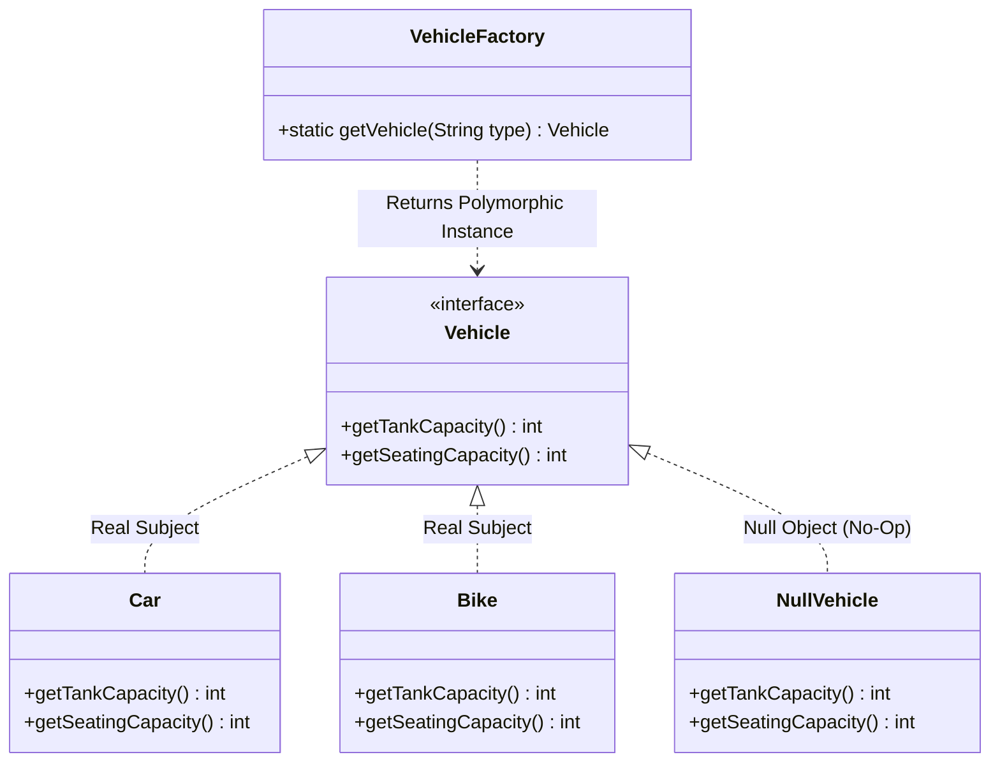

# 40. Null Object Pattern & LLD Anti-Patterns

> 💡 **Quick Revision Anchor**: A comprehensive, interview-focused guide to the Null Object Pattern and LLD Anti-Patterns faithfully derived from the complete concluding lecture transcript. Demonstrates how replacing fragile `null` references with polymorphic "do-nothing" no-op objects (`NullVehicle`, `NullLogger`) eliminates defensive `if (obj != null)` guard boilerplate and inoculates systems against Sir Tony Hoare's infamous "Billion-Dollar Mistake" (`NullPointerException`). Concludes with the instructor's crucial synthesis on avoiding classic architectural anti-patterns: Over-Engineering, God Objects, and Premature Optimization.

---

## 1. Context & The "Billion Dollar Mistake"

In 1965, Sir Tony Hoare invented the `null` pointer reference, later terming it his *"billion-dollar mistake"* due to countless software crashes and vulnerabilities caused by `NullPointerException` (NPE).

### The Anti-Pattern: Defensive Null Checking
Without the Null Object Pattern, client code becomes cluttered with defensive guard clauses:
```java
Vehicle vehicle = VehicleFactory.getVehicle("FERRARI");

// Defensive boilerplate repeated across thousands of call sites:
if (vehicle != null) {
    System.out.println("Tank Capacity: " + vehicle.getTankCapacity());
    System.out.println("Seating Capacity: " + vehicle.getSeatingCapacity());
} else {
    System.out.println("Tank Capacity: 0");
    System.out.println("Seating Capacity: 0");
}
```
**Why this is dangerous:**
- If even one developer forgets a `null` check, the entire thread or microservice crashes with an unhandled runtime exception.
- Pollutes domain logic with defensive conditional branching, violating Clean Code principles.

---

## 2. Null Object Architecture & UML



### Key Concept: Replace Conditionals with Polymorphism
Both `Car` and `NullVehicle` fulfill the `Vehicle` interface contract.
- The client treats `NullVehicle` as a completely ordinary `Vehicle`.
- Calls to `vehicle.getTankCapacity()` execute safely without needing any `if` statements!

---

## 3. Production Java Implementation: Vehicle Factory

### Step 1: Interface & Real Objects
```java
public interface Vehicle {
    int getTankCapacity();
    int getSeatingCapacity();
}

public class Car implements Vehicle {
    @Override
    public int getTankCapacity() {
        return 50; // Liters
    }

    @Override
    public int getSeatingCapacity() {
        return 5;
    }
}

public class Bike implements Vehicle {
    @Override
    public int getTankCapacity() {
        return 12; // Liters
    }

    @Override
    public int getSeatingCapacity() {
        return 2;
    }
}
```

### Step 2: The Null Object
```java
// Null Object: Encapsulates neutral/default behavior
public class NullVehicle implements Vehicle {
    @Override
    public int getTankCapacity() {
        return 0; // Default safe value
    }

    @Override
    public int getSeatingCapacity() {
        return 0; // Default safe value
    }
}
```

### Step 3: Factory Returning Null Object
```java
public class VehicleFactory {
    public static Vehicle getVehicle(String vehicleType) {
        if ("CAR".equalsIgnoreCase(vehicleType)) {
            return new Car();
        } else if ("BIKE".equalsIgnoreCase(vehicleType)) {
            return new Bike();
        }
        // Instead of returning null -> Return Null Object!
        return new NullVehicle();
    }
}
```

### Step 4: Client Driver (Zero Null Checks!)
```java
public class Main {
    public static void main(String[] args) {
        // Querying known types
        Vehicle v1 = VehicleFactory.getVehicle("CAR");
        Vehicle v2 = VehicleFactory.getVehicle("BIKE");

        // Querying non-existent type (returns NullVehicle safely)
        Vehicle v3 = VehicleFactory.getVehicle("AIRPLANE");

        System.out.println("=== Clean Polymorphic Execution (Zero NPE Risk) ===");
        printVehicleSpecs("Car", v1);
        printVehicleSpecs("Bike", v2);
        printVehicleSpecs("Unknown Airplane", v3);
    }

    private static void printVehicleSpecs(String label, Vehicle vehicle) {
        // NOTICE: Zero "if (vehicle != null)" checks needed!
        System.out.println("• " + label + " -> Seating: " + vehicle.getSeatingCapacity() 
                           + " seats | Fuel Tank: " + vehicle.getTankCapacity() + "L");
    }
}
```

---

## 4. Execution Output

```text
=== Clean Polymorphic Execution (Zero NPE Risk) ===
• Car -> Seating: 5 seats | Fuel Tank: 50L
• Bike -> Seating: 2 seats | Fuel Tank: 12L
• Unknown Airplane -> Seating: 0 seats | Fuel Tank: 0L
```

---

## 5. Other Classical Examples

### Example 1: No-Op Logger
```java
public interface Logger {
    void log(String message);
}

public class ConsoleLogger implements Logger {
    public void log(String message) { System.out.println("[LOG] " + message); }
}

public class NoOpLogger implements Logger {
    public void log(String message) {
        // Do nothing! Disables logging without NullPointerExceptions
    }
}
```

### Example 2: Java Optional (Modern Standard)
In modern Java 8+, `java.util.Optional<T>` serves a similar purpose:
```java
Optional<Vehicle> opt = Optional.ofNullable(findVehicle());
int capacity = opt.map(Vehicle::getSeatingCapacity).orElse(0);
```

---

## 6. LLD Architecture Masterclass: Common Anti-Patterns

The lecture concludes with a review of critical architectural Anti-Patterns to avoid in System Design interviews:

| Anti-Pattern | Description | How to Fix It |
| :--- | :--- | :--- |
| **God Object** | A single massive class that knows too much and does too much (violating SRP). | Decompose into distinct managers and use **Facade** strictly for lightweight delegation, never heavy business logic. |
| **Yo-Yo Problem** | Extremely deep inheritance trees where understanding code requires scrolling up and down across 10 classes. | Prefer **Composition over Inheritance** (Strategy, Bridge). |
| **Lava Flow** | Dead or obsolete code left behind from abandoned architectural migrations. | Apply continuous automated refactoring and static code analysis (SonarQube). |
| **Spaghetti Code** | Tangled dependencies with circular references and no clear boundaries. | Enforce layered architecture (Controller $\rightarrow$ Service $\rightarrow$ Repository) with strict dependency rules. |
| **Billion-Dollar Mistake** | Proliferation of unchecked `null` references leading to cascading crashes. | Use the **Null Object Pattern** or `Optional<T>`. |
