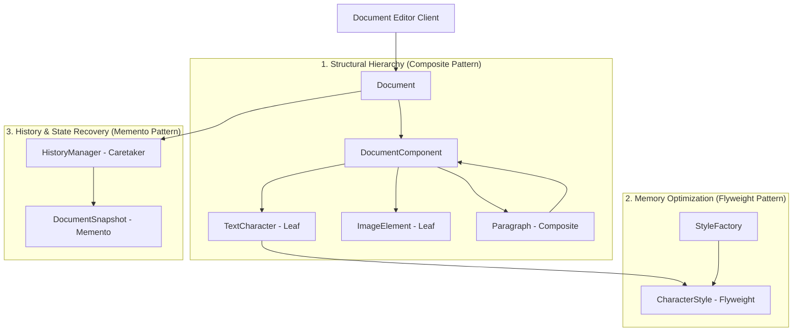
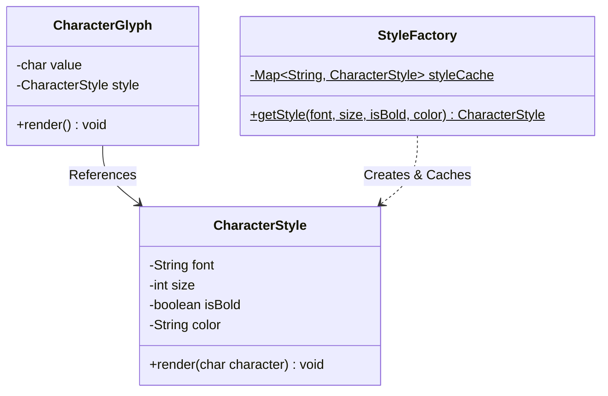

# 07. Build Google Docs — Document Editor LLD

> 💡 **Quick Revision Anchor**: A comprehensive machine-coding case study synthesizing **3 core structural & behavioral patterns**:
> - **Composite Pattern**: Hierarchical document structure (Document $\rightarrow$ Paragraph $\rightarrow$ Text / Image / Table).
> - **Flyweight Pattern**: Character font/styling memory optimization (millions of glyphs share intrinsic style state).
> - **Memento Pattern**: Multi-level Undo & Redo state snapshot restoration.

---

## 1. Problem Statement & Requirements

Design a rich text document editor (Google Docs / Microsoft Word clone) capable of creating documents, adding text with complex formatting, organizing hierarchical content, rendering to multiple output formats, and supporting limitless undo/redo operations.

### Functional Requirements:
1. **Hierarchical Content Creation**: Support paragraphs, plain text, formatted characters, images, and tables.
2. **Formatting & Styling**: Text can be styled (Font family, font size, bold, italic, color).
3. **Memory Optimization**: Storing millions of characters must not exhaust JVM heap memory.
4. **Undo & Redo (History)**: Users can undo typing/formatting edits and redo previously undone actions.
5. **Multi-Format Exporting / Rendering**: Export the document content to Plain Text, HTML, and Markdown.

### Non-Functional Requirements:
- **Extensibility**: Adding new document elements (e.g. Code Snippet, Math LaTeX block) should require zero changes to existing document rendering logic.
- **Low Latency**: Keystroke-level updates must execute in $O(1)$ time.

---

## 2. Architectural Architecture & Design Patterns Map



---

## 3. Applying the Flyweight Pattern for Character Glyphs

### The Memory Explosion Problem:
A standard 50-page Google Doc contains approximately $150,000$ characters.
- If each character object independently stores:
  `char value (2 bytes)` + `String fontName (30 bytes)` + `int fontSize (4 bytes)` + `boolean isBold (1 byte)` + `String color (10 bytes)` + `Object header (16 bytes)` $\approx 80\text{ bytes per character}$.
- For 100 concurrent users with 50-page docs:
  $$100 \times 150,000 \times 80\text{ bytes} \approx 1.2\text{ GB of heap memory just for character styling!}$$

### The Flyweight Solution:
Split character state into:
1. **Intrinsic State (Shared, Immutable)**: Font family, font size, bold, italic, color. Managed by a central `StyleFactory`.
2. **Extrinsic State (Unique per instance)**: The character value itself (`char c`) and its position in the document.



---

## 4. Production-Ready Java Implementation

### Step 1: Character Style Flyweight & Factory
```java
import java.util.*;

// Intrinsic State: Immutable & Shared
public final class CharacterStyle {
    private final String font;
    private final int size;
    private final boolean isBold;
    private final String color;

    public CharacterStyle(String font, int size, boolean isBold, String color) {
        this.font = font;
        this.size = size;
        this.isBold = isBold;
        this.color = color;
    }

    public void render(char c) {
        // Formatted glyph representation
        String boldWrapper = isBold ? "**" + c + "**" : String.valueOf(c);
        System.out.print(boldWrapper);
    }

    @Override
    public boolean equals(Object o) {
        if (this == o) return true;
        if (!(o instanceof CharacterStyle)) return false;
        CharacterStyle that = (CharacterStyle) o;
        return size == that.size && isBold == that.isBold &&
               Objects.equals(font, that.font) && Objects.equals(color, that.color);
    }

    @Override
    public int hashCode() {
        return Objects.hash(font, size, isBold, color);
    }
}

// Flyweight Factory with Cache
public class StyleFactory {
    private static final Map<String, CharacterStyle> cache = new HashMap<>();

    public static CharacterStyle getStyle(String font, int size, boolean isBold, String color) {
        String key = font + "_" + size + "_" + (isBold ? "B" : "R") + "_" + color;
        return cache.computeIfAbsent(key, k -> new CharacterStyle(font, size, isBold, color));
    }
}
```

---

### Step 2: Composite Pattern (Document Hierarchy)
```java
// Component Interface
public interface DocumentComponent {
    void render();
    String toPlainText();
}

// Leaf 1: Individual Character Glyph
public class CharacterGlyph implements DocumentComponent {
    private final char character;
    private final CharacterStyle style;

    public CharacterGlyph(char character, CharacterStyle style) {
        this.character = character;
        this.style = style;
    }

    @Override
    public void render() {
        style.render(character);
    }

    @Override
    public String toPlainText() {
        return String.valueOf(character);
    }
}

// Composite: Paragraph containing multiple document elements
public class Paragraph implements DocumentComponent {
    private final List<DocumentComponent> children = new ArrayList<>();

    public void add(DocumentComponent component) {
        children.add(component);
    }

    public void remove(DocumentComponent component) {
        children.remove(component);
    }

    @Override
    public void render() {
        System.out.println(); // Start new paragraph line
        for (DocumentComponent child : children) {
            child.render();
        }
    }

    @Override
    public String toPlainText() {
        StringBuilder sb = new StringBuilder("\n");
        for (DocumentComponent child : children) {
            sb.append(child.toPlainText());
        }
        return sb.toString();
    }
}
```

---

### Step 3: Memento Pattern (Undo / Redo Mechanism)
```java
// Memento: Immutable snapshot of document state
public final class DocumentSnapshot {
    private final String contentState;

    public DocumentSnapshot(String contentState) {
        this.contentState = contentState;
    }

    public String getContentState() {
        return contentState;
    }
}

// Originator: The Document being edited
public class Document {
    private StringBuilder content = new StringBuilder();

    public void write(String text) {
        content.append(text);
    }

    public String getContent() {
        return content.toString();
    }

    public DocumentSnapshot createSnapshot() {
        return new DocumentSnapshot(content.toString());
    }

    public void restore(DocumentSnapshot snapshot) {
        this.content = new StringBuilder(snapshot.getContentState());
    }
}

// Caretaker: Manages undo and redo stacks
public class HistoryManager {
    private final Deque<DocumentSnapshot> undoStack = new ArrayDeque<>();
    private final Deque<DocumentSnapshot> redoStack = new ArrayDeque<>();

    public void saveState(Document doc) {
        undoStack.push(doc.createSnapshot());
        redoStack.clear(); // Clear redo on fresh edit
    }

    public void undo(Document doc) {
        if (undoStack.isEmpty()) {
            System.out.println("⚠️ Nothing to undo!");
            return;
        }
        redoStack.push(doc.createSnapshot());
        DocumentSnapshot previousState = undoStack.pop();
        doc.restore(previousState);
        System.out.println("↩️ Undo performed.");
    }

    public void redo(Document doc) {
        if (redoStack.isEmpty()) {
            System.out.println("⚠️ Nothing to redo!");
            return;
        }
        undoStack.push(doc.createSnapshot());
        DocumentSnapshot nextState = redoStack.pop();
        doc.restore(nextState);
        System.out.println("↪️ Redo performed.");
    }
}
```

---

### Step 4: Verification & Client Driver
```java
public class GoogleDocsApp {
    public static void main(String[] args) {
        Document doc = new Document();
        HistoryManager history = new HistoryManager();

        // 1. Initial typing
        history.saveState(doc);
        doc.write("Hello World. ");
        System.out.println("Doc: " + doc.getContent());

        // 2. Add second sentence
        history.saveState(doc);
        doc.write("This is Google Docs LLD.");
        System.out.println("Doc: " + doc.getContent());

        // 3. Perform Undo
        history.undo(doc);
        System.out.println("After Undo: " + doc.getContent());

        // 4. Perform Redo
        history.redo(doc);
        System.out.println("After Redo: " + doc.getContent());
    }
}
```

---

## 5. Summary & Key Interview Takeaways

1. **Composite Pattern**: Allows uniform treatment of nested document trees (Character $\rightarrow$ Word $\rightarrow$ Line $\rightarrow$ Paragraph $\rightarrow$ Section $\rightarrow$ Document).
2. **Flyweight Pattern**: Essential for document editors to prevent memory exhaustion by sharing immutable font, size, and styling metadata across hundreds of thousands of individual character glyphs.
3. **Memento Pattern**: Decouples the document state encapsulation from the history tracking logic (Caretaker). The caretaker stores snapshots without needing to know internal document storage representation.
