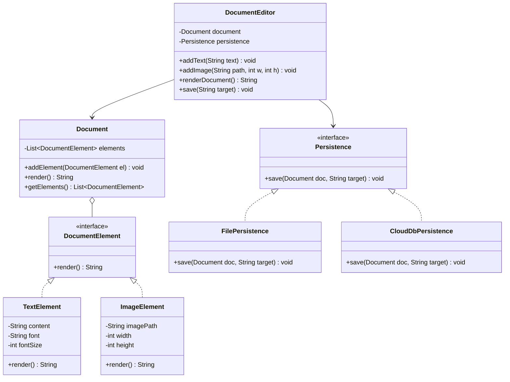

# 07. Build Google Docs — Document Editor LLD

> 💡 **Quick Revision Anchor**: `DocumentElement Composite, Controller Delegation, Persistence Strategy`

---

## 1. Problem Statement & Functional Requirements

Design a **Document Editor** (inspired by Google Docs or MS Word) that allows users to create, compose, render, and persist rich documents containing varied media.

### Functional Requirements:
1. **Multi-Media Content Elements**: Support arbitrary document elements (Text, Images, Paragraphs, Tables).
2. **Dynamic Rendering**: Render the complete document preserving sequence and styling.
3. **Flexible Storage / Export**: Ability to save to local file systems, cloud databases (MongoDB/S3), or export to formats like PDF.
4. **Extensibility**: Adding a new element type (e.g., CodeBlock, Video Embed) or a new persistence target must not break existing editor code.

---

## 2. Architectural Design & Class Decomposition



---

## 3. Implementation Code Walkthrough (Java)

### 1. Document Elements (Composite Hierarchy)
```java
// Common interface for anything that can be rendered inside a document
public interface DocumentElement {
    String render();
}

public class TextElement implements DocumentElement {
    private final String text;
    private final boolean isBold;

    public TextElement(String text, boolean isBold) {
        this.text = text;
        this.isBold = isBold;
    }

    @Override
    public String render() {
        return isBold ? "**" + text + "**" : text;
    }
}

public class ImageElement implements DocumentElement {
    private final String imagePath;
    private final int width;
    private final int height;

    public ImageElement(String imagePath, int width, int height) {
        this.imagePath = imagePath;
        this.width = width;
        this.height = height;
    }

    @Override
    public String render() {
        return "";
    }
}
```

### 2. Document Aggregate
```java
public class Document {
    private final List<DocumentElement> elements = new ArrayList<>();

    public void addElement(DocumentElement element) {
        elements.add(element);
    }

    public String render() {
        StringBuilder sb = new StringBuilder();
        for (DocumentElement el : elements) {
            sb.append(el.render()).append("\n");
        }
        return sb.toString();
    }

    public List<DocumentElement> getElements() {
        return Collections.unmodifiableList(elements);
    }
}
```

### 3. Persistence Strategy
```java
public interface DocumentPersistence {
    void save(Document document, String destination);
}

public class FileStoragePersistence implements DocumentPersistence {
    @Override
    public void save(Document document, String filePath) {
        System.out.println("Writing rendered content to local disk at: " + filePath);
    }
}

public class CloudStoragePersistence implements DocumentPersistence {
    @Override
    public void save(Document document, String s3Uri) {
        System.out.println("Uploading document JSON payload to AWS S3 bucket: " + s3Uri);
    }
}
```

### 4. Document Editor Facade / Controller
```java
public class DocumentEditor {
    private final Document document;
    private final DocumentPersistence persistence;

    public DocumentEditor(DocumentPersistence persistence) {
        this.document = new Document();
        this.persistence = persistence;
    }

    public void addText(String text, boolean isBold) {
        document.addElement(new TextElement(text, isBold));
    }

    public void addImage(String path, int width, int height) {
        document.addElement(new ImageElement(path, width, height));
    }

    public String renderDocument() {
        return document.render();
    }

    public void save(String destination) {
        persistence.save(document, destination);
    }
}
```

---

## 4. Key Design Patterns Applied

| Pattern | Where Used | Problem Solved |
| :--- | :--- | :--- |
| **Composite Pattern** | `DocumentElement` interface implemented by `TextElement`, `ImageElement`, etc. | Treats leaf elements and complex container elements uniformly during rendering. |
| **Strategy Pattern** | `DocumentPersistence` (`FileStorage`, `CloudStorage`) | Decouples document editing logic from storage mechanism. Storage can be swapped dynamically. |
| **Facade Pattern** | `DocumentEditor` | Hides underlying complexity of document assembly and persistence behind a clean, intuitive client API. |
| **Command Pattern (Extension)** | Undo / Redo operations | Encapsulates keystroke additions/deletions as executable command objects with `undo()`. |

---

## 5. Machine Coding Interview Follow-ups

1. **How to implement Undo/Redo?**
   - Maintain two stacks: `Stack<Command> undoStack` and `Stack<Command> redoStack`.
   - Each operation (`AddElementCommand`, `DeleteElementCommand`) implements `execute()` and `unexecute()`.
2. **How to support character-by-character styling efficiently without wasting memory?**
   - Apply the **Flyweight Pattern**: Share intrinsic character glyph definitions and keep only extrinsic formatting properties (cursor position, bold flag) per character.
