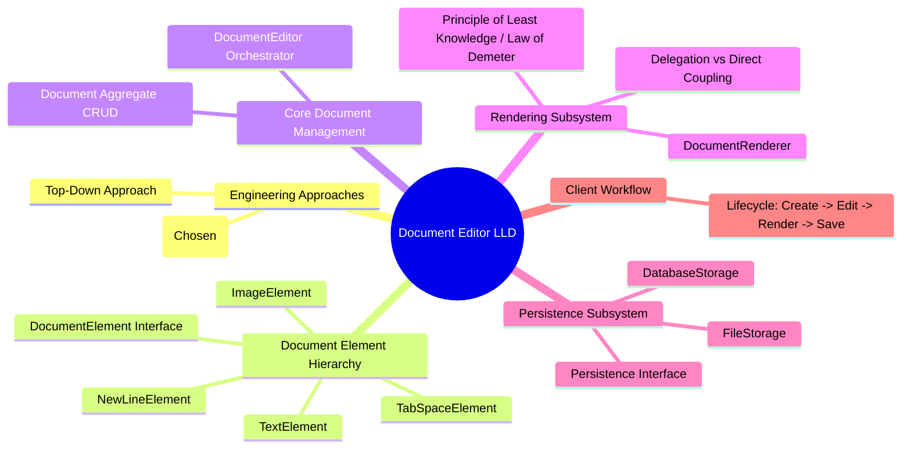
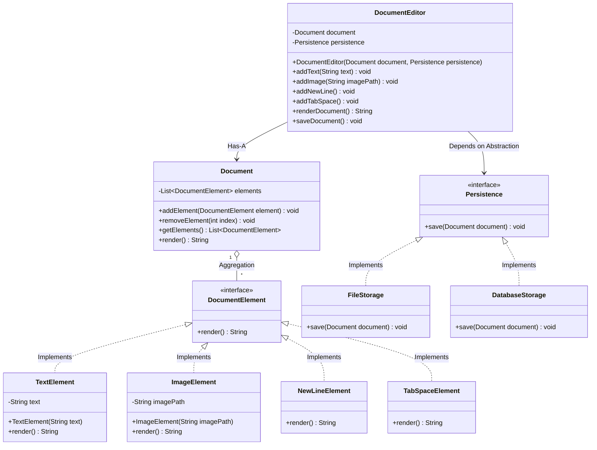
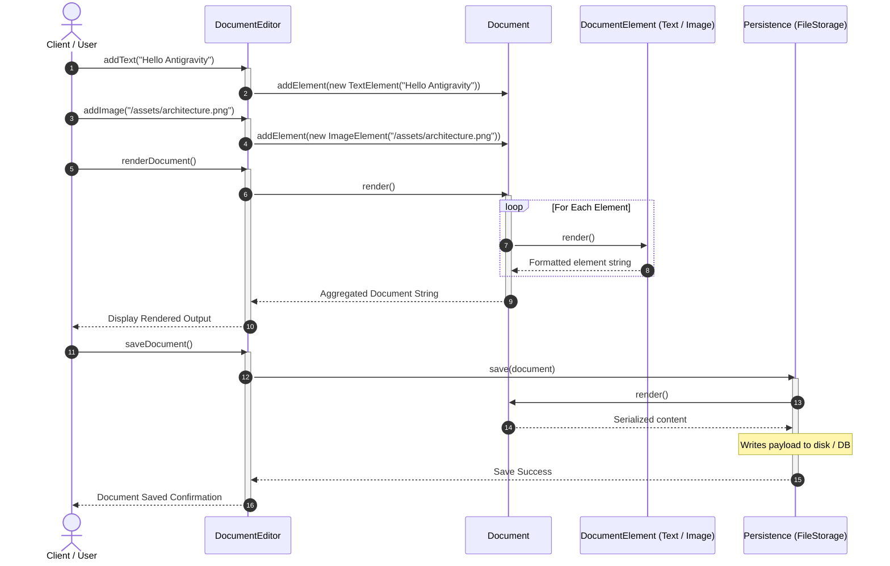

# 07. Build Google Docs — Document Editor LLD

> 💡 **Quick Revision Anchor**: A comprehensive, interview-focused Low-Level Design (LLD) case study designing a rich Document Editor (Google Docs clone) faithfully derived from the complete lecture transcript. Features a **Bottom-Up Design approach**, decomposing heterogeneous document elements into a polymorphic `DocumentElement` hierarchy (`TextElement`, `ImageElement`, `NewLineElement`, `TabSpaceElement`), a clean `Document` aggregate holding element streams, an isolated `DocumentRenderer`, and an extensible `Persistence` subsystem (`FileStorage`, `DatabaseStorage`). Thoroughly analyzes the classic interview trade-off between **Single Responsibility Principle (SRP)** and the **Law of Demeter (Principle of Least Knowledge)** when decoupling document rendering and persistence.

---

## 1. Problem Statement

Design a scalable, production-grade Document Editor (akin to Google Docs or a rich text editor) supporting heterogeneous document content:
- **Rich Document Elements**: Text, Images, Newlines, Tab Spaces, and future elements (Tables, Videos, Fonts, Bold/Italic formatting).
- **Core Operations**: Adding, editing, rendering formatted document output, and persisting documents to different storage engines (File System, Relational/NoSQL Database).
- **Extensible Architecture**: Following OOP and SOLID principles (Single Responsibility, Open/Closed, Dependency Inversion).
- **Architectural Trade-offs**: Navigating the tension between SRP and the **Principle of Least Knowledge (Law of Demeter)** during document rendering and client interaction.



---

## 2. Functional & Non-Functional Requirements

### Functional Requirements
1. **Diverse Element Support**: Support text content, image paths, whitespace formatting (newlines, tabs), and allow future elements without altering core code.
2. **Document Orchestration**: Provide an editor interface allowing users to compose documents with sequential elements.
3. **Formatted Rendering**: Render the complete document into an appropriate representation (string/markdown).
4. **Multi-Target Persistence**: Support saving documents to the local file system or a persistent database.

### Non-Functional Requirements
1. **Extensibility (OCP)**: Adding new elements (e.g. `TableElement`, `BoldElement`) must require zero modifications to existing classes.
2. **Decoupled Architecture (DIP & SRP)**: High-level document policies must not depend on concrete storage drivers. Rendering logic must be cleanly isolated from document storage.
3. **Clarity over Framework Bloat**: Pure, interview-ready Java without unnecessary external dependencies.

---

## 3. Engineering Approaches: Top-Down vs. Bottom-Up

When approaching a system design problem in an LLD interview, there are two primary methodologies:

```text
  ┌─────────────────────────────────┐       ┌─────────────────────────────────┐
  │        Top-Down Approach        │       │       Bottom-Up Approach        │
  ├─────────────────────────────────┤       ├─────────────────────────────────┤
  │ 1. Start with high-level system │       │ 1. Start by identifying the     │
  │    orchestrator (DocumentEditor)│       │    atomic elements (Text, Image)│
  │ 2. Decompose into components    │       │ 2. Build domain contracts       │
  │ 3. Define leaf entities last    │       │    (DocumentElement)            │
  │                                 │       │ 3. Compose leaf elements into   │
  │                                 │       │    aggregates (Document)        │
  │                                 │       │ 4. Build high-level services    │
  │                                 │       │    (DocumentEditor, Storage)    │
  └─────────────────────────────────┘       └─────────────────────────────────┘
```

- **Bottom-Up Approach (Adopted Here)**:
  - First, identify the atomic building blocks: `TextElement`, `ImageElement`, `NewLineElement`, and `TabSpaceElement`.
  - Next, define the contract abstraction: `DocumentElement`.
  - Then, assemble them into the composite container: `Document`.
  - Finally, build orchestrators, renderers, and storage adapters around the domain core.
  - This is the standard, developer-favored approach in LLD interviews because it prevents premature architectural assumptions.

---

## 4. Architectural Evolution: From Naive to SOLID

### Initial Naive Design & Flaws
In a naive monolithic design:
- A single `DocumentEditor` class maintains a `List<String> elements` where text and image paths are intermixed as raw strings.
- `renderDocument()` uses `if-else` string parsing to guess whether an item is text or an image.
- Storage code (`saveToFile()`, `saveToDb()`) is hard-coded directly into the editor.

**Fatal Flaws**:
1. **Breaks SRP**: `DocumentEditor` handles element storage, rendering, formatting, and file I/O simultaneously.
2. **Breaks OCP**: Adding tables or videos requires modifying the `if-else` rendering chain in `DocumentEditor`.
3. **Breaks DIP**: High-level editing depends directly on low-level file write routines.

---

### Step-by-Step Refactoring Evolution

```text
Step 1: Polymorphic Elements
  Extract interface DocumentElement with method String render().
  Concrete classes: TextElement, ImageElement, NewLineElement, TabSpaceElement.
  Document now holds List<DocumentElement>. Adding new elements requires ZERO changes to existing classes (OCP).

Step 2: Aggregate & CRUD Isolation
  Create Document class to hold and manage List<DocumentElement>.
  Document provides addElement(), removeElement(), and getElements().

Step 3: Storage Abstraction (DIP)
  Create Persistence interface with void save(Document doc).
  Implement FileStorage and DatabaseStorage independently.

Step 4: Rendering & Law of Demeter Trade-off
  Debate: Should Document render itself, or should a dedicated DocumentRenderer handle it?
  - If Document renders itself: Document delegates to its elements (clean Law of Demeter, but Document has multiple responsibilities).
  - If DocumentRenderer renders it: DocumentRenderer fetches elements via doc.getElements() and renders them (SRP clean, but talks to a "friend of a friend", creating slight Demeter tension).
```

---

## 5. Architectural Diagram & Class Hierarchy



---

## 6. Sequence Diagram: Document Creation, Rendering & Persistence



---

## 7. Complete Java Implementation

```java
import java.util.*;

// ============================================================================
// 1. DOMAIN LAYER: DOCUMENT ELEMENT CONTRACT & ATOMIC CONCRETIONS
// ============================================================================

/**
 * Common abstraction for every renderable unit within the document.
 */
public interface DocumentElement {
    String render();
}

/**
 * Atomic text element storing raw string characters.
 */
public class TextElement implements DocumentElement {
    private final String text;

    public TextElement(String text) {
        this.text = Objects.requireNonNull(text, "Text cannot be null");
    }

    @Override
    public String render() {
        return text;
    }
}

/**
 * Image element storing the file path or URI of the image asset.
 */
public class ImageElement implements DocumentElement {
    private final String imagePath;

    public ImageElement(String imagePath) {
        this.imagePath = Objects.requireNonNull(imagePath, "Image path cannot be null");
    }

    @Override
    public String render() {
        return "[Image: " + imagePath + "]";
    }
}

/**
 * Whitespace element representing a line break.
 */
public class NewLineElement implements DocumentElement {
    @Override
    public String render() {
        return "\n";
    }
}

/**
 * Whitespace element representing an indentation tab space.
 */
public class TabSpaceElement implements DocumentElement {
    @Override
    public String render() {
        return "\t";
    }
}

// ============================================================================
// 2. AGGREGATE ROOT: DOCUMENT
// ============================================================================

/**
 * Aggregate container holding the ordered list of document elements.
 * Manages basic CRUD operations and coordinates polymorphic rendering.
 */
public class Document {
    private final List<DocumentElement> elements = new ArrayList<>();

    public void addElement(DocumentElement element) {
        elements.add(Objects.requireNonNull(element, "Element cannot be null"));
    }

    public void removeElement(int index) {
        if (index >= 0 && index < elements.size()) {
            elements.remove(index);
        } else {
            throw new IndexOutOfBoundsException("Invalid element index: " + index);
        }
    }

    public List<DocumentElement> getElements() {
        return Collections.unmodifiableList(elements);
    }

    /**
     * Polymorphically renders the entire document by delegating to its elements.
     * Complies with the Principle of Least Knowledge / Law of Demeter.
     */
    public String render() {
        StringBuilder sb = new StringBuilder();
        for (DocumentElement element : elements) {
            sb.append(element.render());
        }
        return sb.toString();
    }
}

// ============================================================================
// 3. PERSISTENCE SUBSYSTEM (DEPENDENCY INVERSION PRINCIPLE)
// ============================================================================

/**
 * High-level persistence contract. Both business orchestrators and 
 * concrete storage drivers depend on this interface.
 */
public interface Persistence {
    void save(Document document);
}

/**
 * File storage persistence driver.
 */
public class FileStorage implements Persistence {
    private final String destinationPath;

    public FileStorage(String destinationPath) {
        this.destinationPath = destinationPath;
    }

    @Override
    public void save(Document document) {
        System.out.println("💾 [FileStorage] Writing document to file at: " + destinationPath);
        System.out.println("--------------------------------------------------");
        System.out.println(document.render());
        System.out.println("--------------------------------------------------");
        System.out.println("💾 [FileStorage] File write completed successfully.");
    }
}

/**
 * Database storage persistence driver.
 */
public class DatabaseStorage implements Persistence {
    private final String connectionString;

    public DatabaseStorage(String connectionString) {
        this.connectionString = connectionString;
    }

    @Override
    public void save(Document document) {
        System.out.println("🗄️ [DatabaseStorage] Connecting to database: " + connectionString);
        System.out.println("🗄️ [DatabaseStorage] Executing INSERT INTO documents VALUES (...)");
        System.out.println("Payload: " + document.render());
        System.out.println("🗄️ [DatabaseStorage] Record persisted successfully.");
    }
}

// ============================================================================
// 4. HIGH-LEVEL ORCHESTRATOR: DOCUMENT EDITOR
// ============================================================================

/**
 * The user-facing application orchestrator.
 * Delegates document modification to Document and persistence to Persistence.
 */
public class DocumentEditor {
    private final Document document;
    private Persistence persistence;

    public DocumentEditor(Document document, Persistence persistence) {
        this.document = Objects.requireNonNull(document, "Document cannot be null");
        this.persistence = Objects.requireNonNull(persistence, "Persistence cannot be null");
    }

    public void setPersistence(Persistence persistence) {
        this.persistence = Objects.requireNonNull(persistence, "Persistence cannot be null");
    }

    public void addText(String text) {
        document.addElement(new TextElement(text));
    }

    public void addImage(String path) {
        document.addElement(new ImageElement(path));
    }

    public void addNewLine() {
        document.addElement(new NewLineElement());
    }

    public void addTabSpace() {
        document.addElement(new TabSpaceElement());
    }

    public String renderDocument() {
        return document.render();
    }

    public void saveDocument() {
        persistence.save(document);
    }
}

// ============================================================================
// 5. DRIVER DEMONSTRATION
// ============================================================================
public class DocumentEditorDemo {
    public static void main(String[] args) {
        System.out.println("==================================================");
        System.out.println("    GOOGLE DOCS / DOCUMENT EDITOR LLD DEMO       ");
        System.out.println("==================================================\n");

        Document doc = new Document();
        Persistence filePersistence = new FileStorage("/var/data/my_document.txt");
        DocumentEditor editor = new DocumentEditor(doc, filePersistence);

        // 1. Compose Document Elements
        editor.addText("System Architecture Overview");
        editor.addNewLine();
        editor.addTabSpace();
        editor.addText("Author: Rohit Gowda");
        editor.addNewLine();
        editor.addTabSpace();
        editor.addText("Figure 1: High-Level Architecture Diagram below:");
        editor.addNewLine();
        editor.addImage("https://cdn.example.com/arch_diagram.png");
        editor.addNewLine();
        editor.addText("End of Document.");

        // 2. Render Document Output
        System.out.println("📄 [RENDERED DOCUMENT VIEW]");
        System.out.println(editor.renderDocument());
        System.out.println();

        // 3. Persist to File Storage
        editor.saveDocument();
        System.out.println();

        // 4. Swap Storage dynamically to Database (DIP in action)
        Persistence dbPersistence = new DatabaseStorage("jdbc:postgresql://localhost:5432/docs_db");
        editor.setPersistence(dbPersistence);
        editor.saveDocument();
    }
}
```

---

## 8. Deep Dive: Principle of Least Knowledge (Law of Demeter)

An advanced architectural dilemma explored in this system design is the **Principle of Least Knowledge (Law of Demeter)**:

> *"Only talk to your immediate friends. Do not talk to strangers or friends of friends."*

```text
                                  ❌ Law of Demeter Violation
┌──────────────────┐           ┌──────────────────┐           ┌──────────────────┐
│ DocumentRenderer │ ────────> │     Document     │ ────────> │ DocumentElement  │
└──────────────────┘           └──────────────────┘           └──────────────────┘
  Calls: doc.getElements().get(i).render()
  (DocumentRenderer reaches through Document to talk directly to its child elements!)

                                 ✅ Law of Demeter Compliant
┌──────────────────┐           ┌──────────────────┐           ┌──────────────────┐
│ DocumentRenderer │ ────────> │     Document     │           │ DocumentElement  │
└──────────────────┘           └────────┬─────────┘           └──────────────────┘
  Calls: doc.render()                   │                              ▲
                                        └──────────────────────────────┘
                                          Document calls its own immediate friends!
```

### The Architectural Trade-Off
1. **Option A (Pure SRP via `DocumentRenderer`)**:
   - Create a dedicated `DocumentRenderer` class so `Document` only holds data.
   - *Problem*: `DocumentRenderer` must fetch the list of elements from `Document` and call `render()` on each element. It interacts with the internal children of `Document`, coupling the renderer tightly to the internal element structure.
2. **Option B (Demeter Compliance via Delegation)**:
   - `Document` provides its own `render()` method that loops through its internal collection and delegates to each child's `render()`.
   - `DocumentEditor` calls `document.render()`.
   - *Advantage*: Zero leakage of internal collection structures; fully compliant with the Law of Demeter.
   - *Trade-off*: `Document` assumes both state management and formatting coordination.

In software engineering interviews, discussing this trade-off explicitly demonstrates deep architectural maturity.

---

## 9. Interview Questions & Critical Discussion Points

1. **Why use Bottom-Up instead of Top-Down for this problem?**
   - *Answer*: Bottom-Up allows us to define the polymorphic behaviors of atomic elements (`TextElement`, `ImageElement`) first. Once their contracts are established, composing them into higher-level aggregates (`Document`) and services (`DocumentEditor`) is trivial and avoids rework.
2. **How does this design satisfy the Open/Closed Principle (OCP)?**
   - *Answer*: If we introduce a `TableElement` or `VideoElement`, we create a new class implementing `DocumentElement`. Not a single line of `Document`, `DocumentEditor`, or `FileStorage` needs to be edited.
3. **How does Dependency Inversion (DIP) protect the editor from storage changes?**
   - *Answer*: `DocumentEditor` depends on the `Persistence` interface. Swapping from local disk to AWS S3 or PostgreSQL requires passing a different implementation without recompiling business logic.
4. **How would you support Undo / Redo in this editor?**
   - *Answer*: By introducing the **Command Pattern** (encapsulating each insert/delete operation into reversible command objects with `execute()` and `unexecute()`) or the **Memento Pattern** (saving snapshot states of the `Document` on an undo stack).

---

## 10. Quick Revision

### Core Idea
A clean, extensible document editor built using bottom-up decomposition: atomic polymorphic elements (`DocumentElement`), an aggregate container (`Document`), an abstracted storage layer (`Persistence`), and a top-level orchestrator (`DocumentEditor`).

### Remember
- **Bottom-Up Approach**: Model atomic elements (`TextElement`, `ImageElement`) first, then aggregate into `Document`, then build high-level services.
- **Law of Demeter**: Objects should only invoke methods on immediate collaborators (`Document.render()`), avoiding chain calls through nested object graphs (`doc.getElements().get(0).render()`).
- **DIP in Persistence**: Decouple file system and database drivers behind a common `Persistence` interface.

### Java Implementation Idea
Model polymorphic elements with `DocumentElement`, aggregate them into `Document` with `List<DocumentElement>`, and inject `Persistence` into `DocumentEditor` via constructor injection.

### Most Important Interview Point
Highlight the design tension between SRP and the Law of Demeter when deciding whether `Document` or an external `DocumentRenderer` should coordinate element rendering.

### Common Trap
Hardcoding `if (element.getType() == TEXT)` string switches in the editor instead of delegating to polymorphic `render()` methods on `DocumentElement`.
