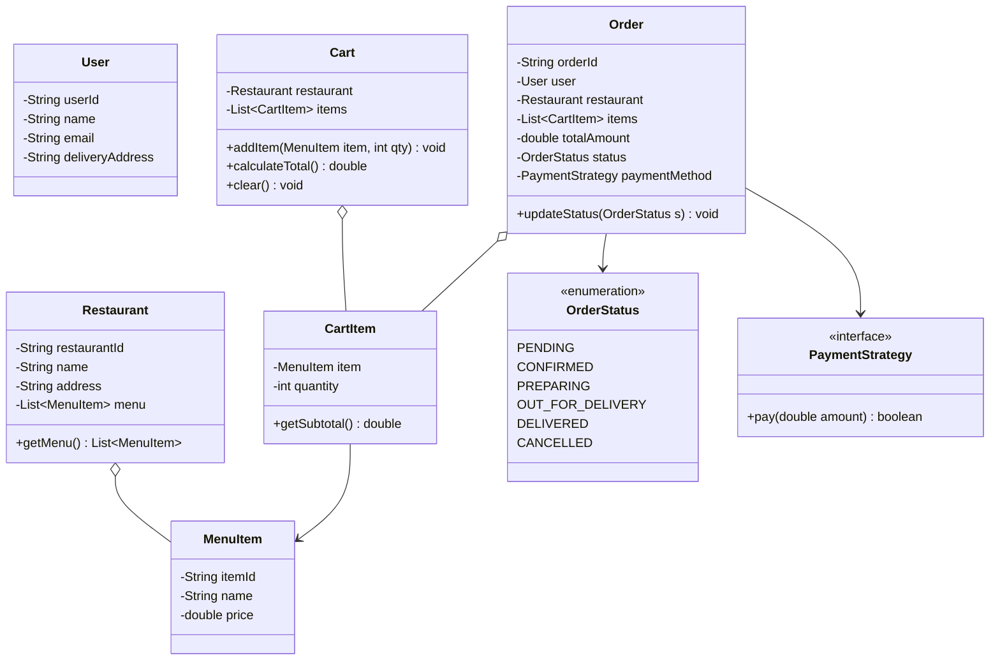

# 11. Build Zomato / Swiggy — Food Delivery App LLD

> 💡 **Quick Revision Anchor**: `Cart to Order Pipeline, Payment Strategy, Order Status Lifecycle`

---

## 1. Problem Scope & Functional Requirements

Design a **Low-Level Architecture for an online Food Delivery Platform** (like Zomato or Swiggy) capable of handling millions of hungry users, restaurant partners, and delivery workflows.

### Functional Requirements:
1. **User & Restaurant Directory**: Search restaurants, browse menus, and view item details.
2. **Cart Management**: Add/remove menu items, compute subtotal, apply taxes and delivery fees.
3. **Order Placement**: Convert Cart into an active `Order` with unique ID and timestamps.
4. **Flexible Payments**: Support interchangeable payment methods (UPI, Credit Card, Cash on Delivery) via **Strategy Pattern**.
5. **Order Lifecycle State Machine**: Track status (`PLACED`, `ACCEPTED`, `PREPARING`, `DISPATCHED`, `DELIVERED`, `CANCELLED`).
6. **Notification Hooks**: Dispatch notifications to user and restaurant on status transitions.

---

## 2. Domain Entity & Class Architecture



---

## 3. Java Implementation Walkthrough

### 1. Domain Entities: Restaurant, Item, Cart
```java
public record MenuItem(String id, String name, double price) {}

public class Restaurant {
    private final String id;
    private final String name;
    private final List<MenuItem> menu = new ArrayList<>();

    public Restaurant(String id, String name) {
        this.id = id;
        this.name = name;
    }

    public void addMenuItem(MenuItem item) { menu.add(item); }
    public List<MenuItem> getMenu() { return Collections.unmodifiableList(menu); }
    public String getName() { return name; }
}

public class CartItem {
    private final MenuItem item;
    private int quantity;

    public CartItem(MenuItem item, int quantity) {
        this.item = item;
        this.quantity = quantity;
    }

    public double getSubtotal() { return item.price() * quantity; }
    public MenuItem getItem() { return item; }
    public int getQuantity() { return quantity; }
    public void increment(int qty) { this.quantity += qty; }
}

public class Cart {
    private final Restaurant restaurant;
    private final List<CartItem> items = new ArrayList<>();

    public Cart(Restaurant restaurant) {
        this.restaurant = restaurant;
    }

    public void addItem(MenuItem item, int qty) {
        for (CartItem ci : items) {
            if (ci.getItem().id().equals(item.id())) {
                ci.increment(qty);
                return;
            }
        }
        items.add(new CartItem(item, qty));
    }

    public double calculateTotal() {
        return items.stream().mapToDouble(CartItem::getSubtotal).sum();
    }

    public List<CartItem> getItems() { return Collections.unmodifiableList(items); }
    public Restaurant getRestaurant() { return restaurant; }
}
```

### 2. Payment Strategy
```java
public interface PaymentStrategy {
    boolean pay(double amount);
}

public class UpiPaymentStrategy implements PaymentStrategy {
    private final String upiId;

    public UpiPaymentStrategy(String upiId) { this.upiId = upiId; }

    @Override
    public boolean pay(double amount) {
        System.out.println("Initiating ₹" + amount + " UPI transfer to VPA: " + upiId);
        return true; // Simulate gateway success
    }
}

public class CashOnDeliveryStrategy implements PaymentStrategy {
    @Override
    public boolean pay(double amount) {
        System.out.println("Order flagged for Cash On Delivery: ₹" + amount + " to be collected upon drop-off.");
        return true;
    }
}
```

### 3. Order Aggregate & State Machine
```java
public enum OrderStatus {
    CREATED, PAID, ACCEPTED, PREPARING, OUT_FOR_DELIVERY, DELIVERED, CANCELLED
}

public class Order {
    private final String orderId;
    private final String userId;
    private final Restaurant restaurant;
    private final List<CartItem> items;
    private final double totalAmount;
    private OrderStatus status;

    public Order(String orderId, String userId, Cart cart) {
        this.orderId = orderId;
        this.userId = userId;
        this.restaurant = cart.getRestaurant();
        this.items = new ArrayList<>(cart.getItems());
        this.totalAmount = cart.calculateTotal();
        this.status = OrderStatus.CREATED;
    }

    public boolean processPayment(PaymentStrategy paymentStrategy) {
        if (paymentStrategy.pay(totalAmount)) {
            this.status = OrderStatus.PAID;
            return true;
        }
        this.status = OrderStatus.CANCELLED;
        return false;
    }

    public void updateStatus(OrderStatus newStatus) {
        this.status = newStatus;
        System.out.println("Order [" + orderId + "] status changed to: " + newStatus);
    }
}
```

### 4. Food Delivery Service (Orchestrator Facade)
```java
public class FoodDeliveryService {
    private final Map<String, Restaurant> restaurantDirectory = new HashMap<>();

    public void registerRestaurant(Restaurant r) {
        restaurantDirectory.put(r.getName(), r);
    }

    public Order checkout(String userId, Cart cart, PaymentStrategy paymentMethod) {
        String orderId = "ORD-" + UUID.randomUUID().toString().substring(0, 8);
        Order order = new Order(orderId, userId, cart);
        
        if (order.processPayment(paymentMethod)) {
            order.updateStatus(OrderStatus.ACCEPTED);
            System.out.println("Notification sent to " + cart.getRestaurant().getName() + " to prepare food.");
        }
        return order;
    }
}
```

---

## 4. Design Patterns Applied

| Pattern | Where Used | Value Delivered |
| :--- | :--- | :--- |
| **Strategy Pattern** | `PaymentStrategy` (UPI, Cards, COD) | Eliminates conditional switch-cases when adding new payment options (e.g. Wallets). |
| **State Pattern** | `OrderStatus` Lifecycle | Enforces valid status transitions (e.g., cannot transition directly from `CANCELLED` to `DELIVERED`). |
| **Facade Pattern** | `FoodDeliveryService` | High-level orchestrator coordinating search, checkout, payment, and notifications. |
| **Observer Pattern (Extension)**| `OrderTracker` | Notifies customer mobile app and delivery driver when status becomes `PREPARING` or `OUT_FOR_DELIVERY`. |

---

## 5. Key Edge Cases & Interview Traps

1. **Items from Multiple Restaurants in One Cart**:
   - In real-world Swiggy/Zomato, a user cannot mix items from two different restaurants in the same cart without explicit warning.
   - Guard check: If `cart.getRestaurant() != selectedItem.restaurant`, throw `ConflictingRestaurantException` or prompt user to clear previous cart.
2. **Item Out-of-Stock during Checkout**:
   - Validate stock availability right before processing payment, not just when adding to cart.
