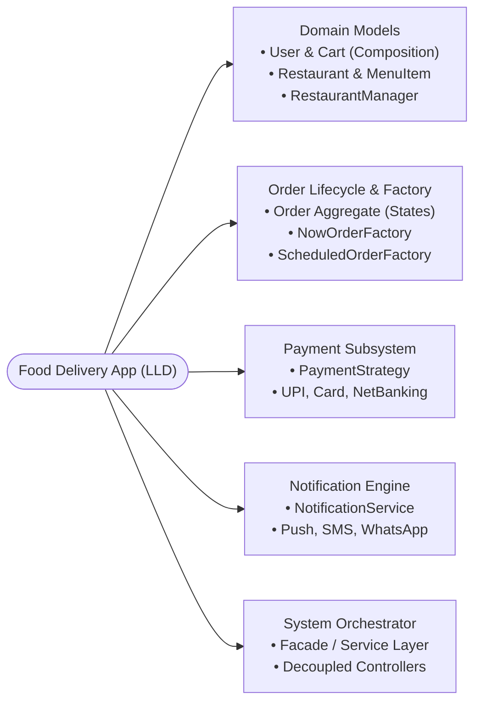
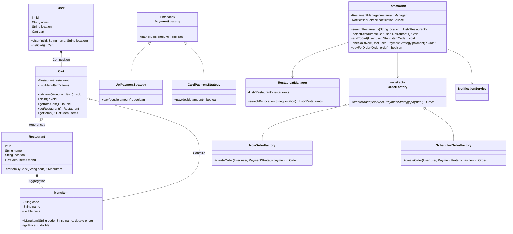
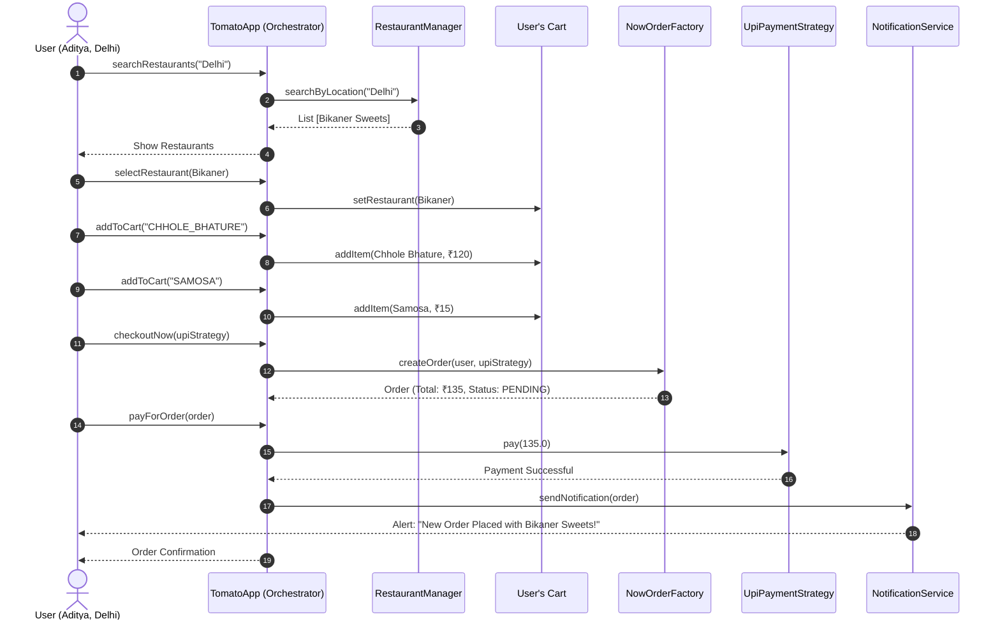

# 11. Build Zomato Food Delivery App LLD ("Tomato App")

> 💡 **Quick Revision Anchor**: A comprehensive, interview-ready Low-Level Design (LLD) case study designing a production-grade Food Delivery System (Zomato / Swiggy clone, dubbed "Tomato App") faithfully derived from the complete lecture transcript. Demonstrates a **Bottom-Up Design approach**, integrating multiple GoF patterns: **Factory Method** (`OrderFactory`, `NowOrderFactory`, `ScheduledOrderFactory`) for immediate vs advance order lifecycles, **Strategy Pattern** for pluggable checkout payments (`PaymentStrategy`), **Singleton Pattern** for `RestaurantManager` catalog caching, and a lightweight **Notification Engine**. Analyzes the architectural trade-off of a centralized `TomatoApp` Orchestrator (Facade) versus decentralized REST microservices.

---

## 1. Problem Statement

Design a production-grade Low-Level Object-Oriented system for an online food delivery application (modeled after **Zomato / Swiggy**, named **Tomato** in the lecture). The system models the end-to-end customer journey:
- **Location-Based Restaurant Search**: Finding nearby restaurants based on user geolocation.
- **Cart & Menu Management**: Browsing dishes (e.g. Chhole Bhature, Samosa), managing single-restaurant shopping carts.
- **Order Creation & Factories**: Immediate delivery orders vs. Future scheduled delivery orders via **Factory Method** (`NowOrderFactory`, `ScheduledOrderFactory`).
- **Pluggable Payment Processing**: Encapsulating checkout transactions through the **Strategy Pattern** (UPI, Credit/Debit Card, NetBanking).
- **Notification Subsystem**: Dispatching order placement alerts to users.
- **System Orchestration**: Evaluating the architectural role and trade-offs of the top-level **`TomatoApp` Orchestrator (Facade)** versus modern decentralized API controller/service layers.



---

## 2. Requirements & Scope Management

### Functional Requirements
1. **User Management**: Model user accounts with unique IDs, names, and geographic locations (e.g. Delhi).
2. **Restaurant Discovery**: Search restaurants filtering by city/location.
3. **Menu & Cart Management**: View restaurant menus; add/remove items to cart; enforce single-restaurant cart constraints and calculate bill totals.
4. **Order Placement & Scheduling**: Support ordering food now or scheduling an order for later via `OrderFactory`.
5. **Payment Processing**: Execute transactions via pluggable payment mechanisms (UPI, Card, NetBanking).
6. **Order Notification**: Send confirmation alerts upon successful payment.

### Non-Functional Requirements
1. **Extensibility**: Adding new payment gateways or order types must not break existing order processing.
2. **Cohesion**: Clear separation between domain models (entities), managers (in-memory repositories), factories, and services.
3. **Interview Scope Realism**: In a 45-60 minute interview, candidates cannot build the entire real-world Zomato. Focus on the end-to-end "Happy Flow" with pristine UML contracts, patterns, and architectural trade-off analysis.

---

## 3. Architecture & Package Structure

The system is organized into clean domain layers following the **Bottom-Up** design methodology:

```text
com.tomato.app
├── models/             -> User, Cart, Restaurant, MenuItem, Order, OrderType, OrderStatus
├── managers/           -> RestaurantManager, OrderManager (stateful repositories)
├── factories/          -> OrderFactory, NowOrderFactory, ScheduledOrderFactory
├── strategies/         -> PaymentStrategy, UpiPaymentStrategy, CardPaymentStrategy, NetBankingStrategy
├── services/           -> NotificationService
├── utils/              -> TimeUtils
└── TomatoApp.java      -> Top-level facade / orchestrator
```

---

## 4. Class Diagram



---

## 5. End-to-End Happy Flow: Sequence Diagram



---

## 6. Complete Java Implementation

```java
import java.time.LocalDateTime;
import java.time.format.DateTimeFormatter;
import java.util.*;

// ============================================================================
// 1. MODELS LAYER
// ============================================================================

public class MenuItem {
    private final String code;
    private final String name;
    private final double price;

    public MenuItem(String code, String name, double price) {
        this.code = code;
        this.name = name;
        this.price = price;
    }

    public String getCode() { return code; }
    public String getName() { return name; }
    public double getPrice() { return price; }

    @Override
    public String toString() {
        return name + " (₹" + price + ")";
    }
}

public class Restaurant {
    private final int id;
    private final String name;
    private final String location;
    private final List<MenuItem> menu = new ArrayList<>();

    public Restaurant(int id, String name, String location) {
        this.id = id;
        this.name = name;
        this.location = location;
    }

    public void addMenuItem(MenuItem item) {
        menu.add(item);
    }

    public MenuItem findItemByCode(String code) {
        return menu.stream()
                .filter(item -> item.getCode().equalsIgnoreCase(code))
                .findFirst()
                .orElse(null);
    }

    public int getId() { return id; }
    public String getName() { return name; }
    public String getLocation() { return location; }
    public List<MenuItem> getMenu() { return Collections.unmodifiableList(menu); }
}

public class Cart {
    private Restaurant restaurant;
    private final List<MenuItem> items = new ArrayList<>();

    public void setRestaurant(Restaurant restaurant) {
        if (this.restaurant != null && this.restaurant.getId() != restaurant.getId()) {
            items.clear(); // Reset cart if ordering from a different restaurant
            System.out.println("⚠️ Switched restaurant! Previous cart items cleared.");
        }
        this.restaurant = restaurant;
    }

    public void addItem(MenuItem item) {
        if (restaurant == null) throw new IllegalStateException("Select a restaurant first!");
        items.add(item);
    }

    public void clear() {
        items.clear();
        restaurant = null;
    }

    public double getTotalCost() {
        return items.stream().mapToDouble(MenuItem::getPrice).sum();
    }

    public Restaurant getRestaurant() { return restaurant; }
    public List<MenuItem> getItems() { return Collections.unmodifiableList(items); }
}

public class User {
    private final int id;
    private final String name;
    private final String location;
    private final Cart cart;

    public User(int id, String name, String location) {
        this.id = id;
        this.name = name;
        this.location = location;
        this.cart = new Cart(); // Cart has a strict composition relationship with User
    }

    public int getId() { return id; }
    public String getName() { return name; }
    public String getLocation() { return location; }
    public Cart getCart() { return cart; }
}

public enum OrderStatus {
    PENDING_PAYMENT,
    PAID,
    PREPARING,
    OUT_FOR_DELIVERY,
    DELIVERED,
    CANCELLED
}

public enum OrderType {
    DELIVERY_NOW,
    SCHEDULED
}

public class Order {
    private final String orderId;
    private final User user;
    private final Restaurant restaurant;
    private final List<MenuItem> items;
    private final double totalAmount;
    private final PaymentStrategy paymentStrategy;
    private final OrderType orderType;
    private final LocalDateTime scheduledTime;
    private OrderStatus status;

    public Order(String orderId, User user, Restaurant restaurant, List<MenuItem> items,
                 double totalAmount, PaymentStrategy paymentStrategy, OrderType orderType,
                 LocalDateTime scheduledTime) {
        this.orderId = orderId;
        this.user = user;
        this.restaurant = restaurant;
        this.items = new ArrayList<>(items);
        this.totalAmount = totalAmount;
        this.paymentStrategy = paymentStrategy;
        this.orderType = orderType;
        this.scheduledTime = scheduledTime;
        this.status = OrderStatus.PENDING_PAYMENT;
    }

    public boolean processPayment() {
        if (paymentStrategy.pay(totalAmount)) {
            this.status = OrderStatus.PAID;
            return true;
        }
        return false;
    }

    public String getOrderId() { return orderId; }
    public User getUser() { return user; }
    public Restaurant getRestaurant() { return restaurant; }
    public List<MenuItem> getItems() { return Collections.unmodifiableList(items); }
    public double getTotalAmount() { return totalAmount; }
    public OrderStatus getStatus() { return status; }
    public LocalDateTime getScheduledTime() { return scheduledTime; }
}

// ============================================================================
// 2. STRATEGIES LAYER: PAYMENT STRATEGY PATTERN
// ============================================================================

public interface PaymentStrategy {
    boolean pay(double amount);
}

public class UpiPaymentStrategy implements PaymentStrategy {
    private final String upiId;

    public UpiPaymentStrategy(String upiId) {
        this.upiId = upiId;
    }

    @Override
    public boolean pay(double amount) {
        System.out.println("📱 [UPI] Authenticating VPA: " + upiId + " for amount ₹" + amount);
        System.out.println("✅ [UPI] Payment of ₹" + amount + " successful!");
        return true;
    }
}

public class CardPaymentStrategy implements PaymentStrategy {
    private final String cardNumber;

    public CardPaymentStrategy(String cardNumber) {
        this.cardNumber = cardNumber;
    }

    @Override
    public boolean pay(double amount) {
        System.out.println("💳 [Card] Charging card ending in " + cardNumber.substring(cardNumber.length() - 4) + " for ₹" + amount);
        System.out.println("✅ [Card] Transaction approved!");
        return true;
    }
}

// ============================================================================
// 3. FACTORIES LAYER: ORDER FACTORY METHOD PATTERN
// ============================================================================

public abstract class OrderFactory {
    public abstract Order createOrder(User user, PaymentStrategy paymentStrategy);
}

public class NowOrderFactory extends OrderFactory {
    @Override
    public Order createOrder(User user, PaymentStrategy paymentStrategy) {
        Cart cart = user.getCart();
        String orderId = "ORD-" + UUID.randomUUID().toString().substring(0, 8).toUpperCase();
        return new Order(orderId, user, cart.getRestaurant(), cart.getItems(),
                cart.getTotalCost(), paymentStrategy, OrderType.DELIVERY_NOW, LocalDateTime.now());
    }
}

public class ScheduledOrderFactory extends OrderFactory {
    private final LocalDateTime deliveryTime;

    public ScheduledOrderFactory(LocalDateTime deliveryTime) {
        this.deliveryTime = deliveryTime;
    }

    @Override
    public Order createOrder(User user, PaymentStrategy paymentStrategy) {
        Cart cart = user.getCart();
        String orderId = "SCHED-" + UUID.randomUUID().toString().substring(0, 8).toUpperCase();
        return new Order(orderId, user, cart.getRestaurant(), cart.getItems(),
                cart.getTotalCost(), paymentStrategy, OrderType.SCHEDULED, deliveryTime);
    }
}

// ============================================================================
// 4. MANAGERS & SERVICES LAYER
// ============================================================================

public class RestaurantManager {
    private final List<Restaurant> restaurants = new ArrayList<>();

    public void addRestaurant(Restaurant restaurant) {
        restaurants.add(restaurant);
    }

    public List<Restaurant> searchByLocation(String location) {
        List<Restaurant> matches = new ArrayList<>();
        for (Restaurant r : restaurants) {
            if (r.getLocation().equalsIgnoreCase(location)) {
                matches.add(r);
            }
        }
        return matches;
    }
}

public class NotificationService {
    public void sendOrderConfirmation(Order order) {
        DateTimeFormatter dtf = DateTimeFormatter.ofPattern("yyyy-MM-dd HH:mm:ss");
        System.out.println("\n🔔 [Notification Service] Alert to Customer: " + order.getUser().getName());
        System.out.println("==================================================");
        System.out.println("Order ID        : " + order.getOrderId());
        System.out.println("Restaurant      : " + order.getRestaurant().getName());
        System.out.println("Items Ordered   : " + order.getItems());
        System.out.println("Total Paid      : ₹" + order.getTotalAmount());
        System.out.println("Delivery Slot   : " + order.getScheduledTime().format(dtf));
        System.out.println("Status          : " + order.getStatus());
        System.out.println("==================================================\n");
    }
}

// ============================================================================
// 5. ORCHESTRATOR / FACADE: TOMATO APP
// ============================================================================

public class TomatoApp {
    private final RestaurantManager restaurantManager = new RestaurantManager();
    private final NotificationService notificationService = new NotificationService();

    public void registerRestaurant(Restaurant restaurant) {
        restaurantManager.addRestaurant(restaurant);
    }

    public List<Restaurant> searchRestaurants(String location) {
        return restaurantManager.searchByLocation(location);
    }

    public void selectRestaurant(User user, Restaurant restaurant) {
        user.getCart().setRestaurant(restaurant);
    }

    public void addToCart(User user, String itemCode) {
        Cart cart = user.getCart();
        if (cart.getRestaurant() == null) {
            throw new IllegalStateException("Please select a restaurant first!");
        }
        MenuItem item = cart.getRestaurant().findItemByCode(itemCode);
        if (item != null) {
            cart.addItem(item);
            System.out.println("🛒 Added " + item.getName() + " to " + user.getName() + "'s cart.");
        } else {
            System.out.println("❌ Item code not found in restaurant menu!");
        }
    }

    public Order checkoutNow(User user, PaymentStrategy paymentStrategy) {
        OrderFactory factory = new NowOrderFactory();
        return factory.createOrder(user, paymentStrategy);
    }

    public boolean payForOrder(Order order) {
        boolean success = order.processPayment();
        if (success) {
            notificationService.sendOrderConfirmation(order);
            order.getUser().getCart().clear(); // Clear cart after successful checkout
        }
        return success;
    }
}

// ============================================================================
// 6. DRIVER DEMO (HAPPY FLOW)
// ============================================================================

public class TomatoFoodAppDemo {
    public static void main(String[] args) {
        System.out.println("==================================================");
        System.out.println("       WELCOME TO TOMATO FOOD DELIVERY APP        ");
        System.out.println("==================================================\n");

        TomatoApp tomato = new TomatoApp();

        // 1. Setup Restaurant & Menu
        Restaurant bikaner = new Restaurant(501, "Bikaner Sweets", "Delhi");
        bikaner.addMenuItem(new MenuItem("CHHOLE_BHATURE", "Chole Bhature", 120.0));
        bikaner.addMenuItem(new MenuItem("SAMOSA", "Crispy Samosa", 15.0));
        bikaner.addMenuItem(new MenuItem("GULAB_JAMUN", "Gulab Jamun (2 pcs)", 50.0));
        tomato.registerRestaurant(bikaner);

        // 2. Customer Arrives
        User aditya = new User(1001, "Aditya", "Delhi");
        System.out.println("👤 User " + aditya.getName() + " logged in from " + aditya.getLocation() + ".\n");

        // 3. Search & Select Restaurant
        System.out.println("🔍 Searching restaurants in Delhi...");
        List<Restaurant> found = tomato.searchRestaurants("Delhi");
        if (found.isEmpty()) {
            System.out.println("No restaurants found!");
            return;
        }
        Restaurant selected = found.get(0);
        System.out.println("🍴 Selected Restaurant: " + selected.getName() + "\n");
        tomato.selectRestaurant(aditya, selected);

        // 4. Add items to cart
        tomato.addToCart(aditya, "CHHOLE_BHATURE");
        tomato.addToCart(aditya, "SAMOSA");
        System.out.println("Total Cart Value: ₹" + aditya.getCart().getTotalCost() + "\n");

        // 5. Checkout with UPI Strategy
        PaymentStrategy upi = new UpiPaymentStrategy("aditya@okaxis");
        Order order = tomato.checkoutNow(aditya, upi);
        System.out.println("📄 Order created with ID: " + order.getOrderId() + ". Processing payment...");

        // 6. Execute Payment & Trigger Notifications
        tomato.payForOrder(order);
    }
}
```

---

## 7. Deep Dive: Architectural Critique & Modern Decoupling

A critical architectural interview discussion highlighted in the lecture:

### The `TomatoApp` Orchestrator (Facade) Trade-Off
In the design above, `TomatoApp` acts as a **Facade / Orchestrator**:
- **Advantage**: Provides a single, unified entry point for client frontends, shielding them from knowing about `RestaurantManager`, `OrderFactory`, `Cart`, or `NotificationService`.
- **Trade-off & Critique**: `TomatoApp` knows about almost every subsystem in the application, creating high cognitive coupling and technically stretching the **Single Responsibility Principle** and **Principle of Least Knowledge (Law of Demeter)**.

```text
               Centralized Facade                  Modern Decoupled Architecture
        ┌───────────────────────────────┐        ┌───────────────────────────────┐
        │          TomatoApp            │        │        API Gateway            │
        │   (Central Orchestrator)      │        └───────┬───────────────┬───────┘
        └───────┬───────────────┬───────┘                │               │
                │               │                        ▼               ▼
                ▼               ▼                ┌──────────────┐ ┌──────────────┐
         ┌─────────────┐ ┌─────────────┐         │RestaurantCtrl│ │ OrderCtrl    │
         │RestaurantMgr│ │OrderFactory │         └──────┬───────┘ └──────┬───────┘
         └─────────────┘ └─────────────┘                ▼                ▼
                                                 ┌──────────────┐ ┌──────────────┐
                                                 │RestaurantSvc │ │ OrderSvc     │
                                                 └──────────────┘ └──────────────┘
```

### Modern Production Architecture (Spring Boot / Distributed Services)
In real-world enterprise engineering:
1. **Controller Layer (REST APIs)**:
   - `GET /api/v1/restaurants?location=delhi` $\rightarrow$ Handled by `RestaurantController`.
   - `POST /api/v1/orders` $\rightarrow$ Handled by `OrderController`.
2. **Service Layer**:
   - `RestaurantService` queries databases, indexes geolocation coordinates, and manages menus.
   - `OrderService` coordinates payment gateways and dispatches asynchronous event messages to Apache Kafka or RabbitMQ.
3. **Event-Driven Notifications**:
   - `OrderPlacedEvent` is published to an event bus; independent notification microservices consume the event and send multi-channel push, SMS, and WhatsApp alerts without coupling to the order service.

---

## 8. Interview Questions & Key Discussion Points

1. **Why use Factory Method for Order creation (`NowOrderFactory` vs `ScheduledOrderFactory`)?**
   - *Answer*: Immediate orders calculate their delivery timestamp as `LocalDateTime.now()`, whereas scheduled orders validate future delivery windows and require different slot assignment logic. Encapsulating this inside distinct factory subclasses isolates order initialization logic and satisfies the Open/Closed Principle.
2. **How does the Cart enforce single-restaurant ordering?**
   - *Answer*: `Cart.setRestaurant()` checks if the new restaurant ID matches the current restaurant ID. If a user attempts to add items from a different restaurant, the cart clears previous items or prompts the user with a confirmation warning before switching.
3. **What happens if you only pass `User` to `createOrder()`?**
   - *Answer*: Since `User` has a `Cart`, and `Cart` has `Restaurant` and `MenuItem` list, passing `User` is sufficient to extract all order details. However, passing parameters explicitly can make factories independent of the `User` aggregate structure. Both approaches reflect valid architectural trade-offs between coupling and parameter brevity.

---

## 9. Quick Revision

### Core Idea
A complete food delivery low-level system ("Tomato") built bottom-up: models (`User`, `Cart`, `Restaurant`, `MenuItem`), `RestaurantManager` for geographic discovery, `PaymentStrategy` for swappable checkouts, `OrderFactory` for immediate vs scheduled deliveries, and `TomatoApp` as the client-facing orchestrator.

### Remember
- **Bottom-Up**: Build atomic domain models first (`MenuItem` $\rightarrow$ `Restaurant` $\rightarrow$ `Cart` $\rightarrow$ `User`), then add services and orchestrators.
- **Cart Composition**: `User` **HAS-A** `Cart` (one-to-one strict lifecycle ownership).
- **Payment Strategy**: Decouples payment engines (`UPI`, `Card`) from order execution.

### Java Implementation Idea
Model domain classes cleanly, implement `OrderFactory` with `NowOrderFactory` and `ScheduledOrderFactory`, and use `PaymentStrategy` interface with `pay(double amount)` returning a boolean status.

### Most Important Interview Point
Discuss the evolution from a monolithic orchestrator class (`TomatoApp`) to modern separated Controller/Service REST architecture and event-driven notifications.

### Common Trap
Mixing cart items from multiple restaurants without validation. Always enforce single-restaurant integrity when adding items to the cart.
