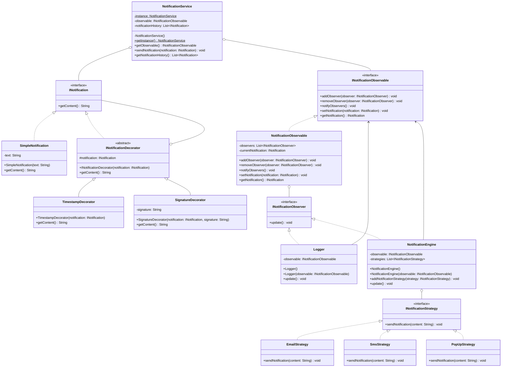
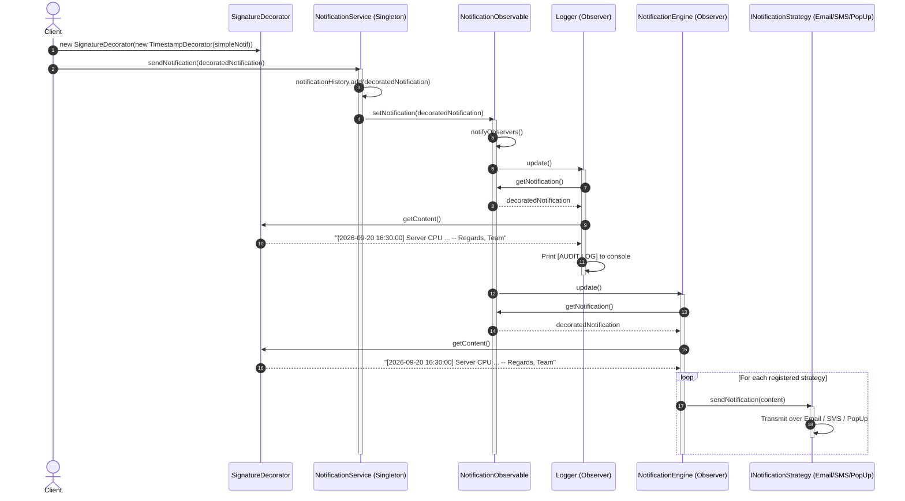

# 14. Build Your Own Notification Engine LLD

> 💡 **Quick Revision Anchor**: A comprehensive, interview-focused Low-Level Design (LLD) case study building an enterprise-grade Notification Engine faithfully derived from the complete lecture transcript. Demonstrates how to elegantly harmonize four core GoF design patterns in a single production system: **Decorator Pattern** for dynamic message enrichment (`TimestampDecorator`, `SignatureDecorator`), **Strategy Pattern** for multi-channel dispatch (`EmailStrategy`, `SmsStrategy`, `PopupStrategy`), **Observer Pattern** for decoupled event broadcasting to listeners and audit loggers, and **Singleton Pattern** for centralizing the `NotificationService` orchestrator and notification history.

---

## 1. Problem Statement & Requirements

In modern software systems, a **Notification Engine** is a critical subsystem responsible for alerting users and client systems about domain events (e.g., OTPs, transactional updates, marketing promos, order status). Often, developers treat notification services as a generic black box or third-party call without understanding their internal architecture.

In this Low-Level Design session, the goal is to build an extensible, plug-and-play notification engine that coordinates multiple design patterns to meet key business and architectural requirements.

### Key Requirements (Instructor's Specification)
1. **Plug-and-Play Integration**:
   - Client applications should be able to integrate the notification service with minimal code changes and zero exposure to internal plumbing (such as observable setup or observer registrations).
2. **Multi-Channel & Highly Extensible Delivery (Strategy Pattern)**:
   - Must support multiple notification channels: **Email**, **SMS**, and **PopUp** notifications.
   - Adding a new channel (e.g., WhatsApp, Slack, Push) in the future must not modify existing dispatch logic (Open/Closed Principle).
   - A single notification trigger may need to be broadcast across multiple channels simultaneously (one-to-many channel dispatch).
3. **Dynamic Content Enrichment (Decorator Pattern)**:
   - Notifications must be dynamically enrichable at runtime with extra metadata such as a **Timestamp** and a **Company Signature** without altering base notification classes or causing subclass explosion.
4. **Decoupled Event Broadcasting & Logging (Observer Pattern)**:
   - Dispatching a notification must notify all interested internal listeners (e.g., `Logger` for audit logs and `NotificationEngine` for channel delivery) without tight coupling.
5. **Notification History & Singleton Orchestration (Singleton Pattern)**:
   - Maintain a centralized audit log/history of all dispatched notifications across the application lifecycle.
   - The central orchestrator (`NotificationService`) must be a **Singleton** so that all system modules share the same history and observable state.

---

## 2. Multi-Pattern Architecture & Design Rationale

To fulfill the requirements cleanly, we synthesize four foundational design patterns:

```
+-------------------------------------------------------------------------------+
|                             CLIENT APPLICATION                                |
+-------------------------------------------------------------------------------+
                                      |
                                      | 1. Creates & decorates notification
                                      v
       +------------------------------------------------------------------+
       |             DECORATOR PATTERN (Notification Content)             |
       |                                                                  |
       |  Base Notification -> TimestampDecorator -> SignatureDecorator   |
       +------------------------------------------------------------------+
                                      |
                                      | 2. sendNotification(notification)
                                      v
       +------------------------------------------------------------------+
       |             SINGLETON PATTERN (NotificationService)              |
       |                                                                  |
       |  - Maintains notification history (List<INotification>)          |
       |  - Acts as Bridge to NotificationObservable                      |
       +------------------------------------------------------------------+
                                      |
                                      | 3. Triggers notifyObservers()
                                      v
       +------------------------------------------------------------------+
       |             OBSERVER PATTERN (Event Notification)                |
       |                                                                  |
       |      NotificationObservable (Subject)                            |
       |               |                                                  |
       |               +----------------------+                           |
       |               |                      |                           |
       |               v                      v                           |
       |        Logger (Observer)      NotificationEngine (Observer)      |
       +--------------------------------------|---------------------------+
                                              |
                                              | 4. Iterates through strategies
                                              v
       +------------------------------------------------------------------+
       |             STRATEGY PATTERN (Dispatch Channels)                 |
       |                                                                  |
       |     NotificationEngine HAS-A List<INotificationStrategy>         |
       |               |                                                  |
       |               +--------------+---------------+                   |
       |               |              |               |                   |
       |               v              v               v                   |
       |         EmailStrategy   SmsStrategy     PopUpStrategy            |
       +------------------------------------------------------------------+
```

### Why Each Pattern Was Chosen:
1. **Decorator Pattern**: Content enrichment is dynamic and combinatorial. If an email needs a signature, an SMS needs a timestamp, and an audit push needs both, inheritance would require $2^N$ classes (`NotificationWithTime`, `NotificationWithSig`, `NotificationWithTimeAndSig`, etc.). Decorators wrap content recursively with zero code duplication.
2. **Observer Pattern**: Delivery and logging are separate concerns. When a notification event occurs, the system must notify both the audit log and the channel dispatch engine. Using Observer decouples the event producer from arbitrary consumers.
3. **Strategy Pattern**: The exact mechanism to transmit characters over the wire (SMTP for Email, SMPP/HTTP for SMS, WebSocket for PopUp) varies independently. Encapsulating each channel behind `INotificationStrategy` satisfies SRP and OCP. Moreover, maintaining a `List<INotificationStrategy>` allows a one-to-many broadcast per notification.
4. **Singleton Pattern**: The `NotificationService` stores the authoritative in-memory dispatch history and owns the central observable. Having multiple service instances would cause split history and disconnected observer registries.

---

## 3. Class Diagram



---

## 4. Complete Java Implementation

Here is the complete, self-contained Java implementation illustrating all 4 design patterns working in concert.

### 4.1 Notification Content & Decorators (Decorator Pattern)

```java
package com.coderarmy.notification;

// 1. Component Interface
public interface INotification {
    String getContent();
}
```

```java
package com.coderarmy.notification;

// 2. Concrete Component
public class SimpleNotification implements INotification {
    private final String text;

    public SimpleNotification(String text) {
        this.text = text;
    }

    @Override
    public String getContent() {
        return text;
    }
}
```

```java
package com.coderarmy.notification;

// 3. Abstract Decorator (IS-A and HAS-A INotification)
public abstract class INotificationDecorator implements INotification {
    protected final INotification notification;

    public INotificationDecorator(INotification notification) {
        this.notification = notification;
    }

    @Override
    public String getContent() {
        return notification.getContent();
    }
}
```

```java
package com.coderarmy.notification;

import java.time.LocalDateTime;
import java.time.format.DateTimeFormatter;

// 4. Concrete Decorators
public class TimestampDecorator extends INotificationDecorator {
    private static final DateTimeFormatter FORMATTER = 
            DateTimeFormatter.ofPattern("yyyy-MM-dd HH:mm:ss");

    public TimestampDecorator(INotification notification) {
        super(notification);
    }

    @Override
    public String getContent() {
        String timestamp = LocalDateTime.now().format(FORMATTER);
        return "[" + timestamp + "] " + super.getContent();
    }
}
```

```java
package com.coderarmy.notification;

public class SignatureDecorator extends INotificationDecorator {
    private final String signature;

    public SignatureDecorator(INotification notification, String signature) {
        super(notification);
        this.signature = signature;
    }

    @Override
    public String getContent() {
        return super.getContent() + "\n-- Regards, " + signature;
    }
}
```

---

### 4.2 Dispatch Channels (Strategy Pattern)

```java
package com.coderarmy.notification;

// Strategy Interface
public interface INotificationStrategy {
    void sendNotification(String content);
}
```

```java
package com.coderarmy.notification;

// Concrete Strategy: Email
public class EmailStrategy implements INotificationStrategy {
    @Override
    public void sendNotification(String content) {
        System.out.println("[EMAIL SENT] Dispatching to SMTP Server:\n" + content);
        System.out.println("--------------------------------------------------");
    }
}
```

```java
package com.coderarmy.notification;

// Concrete Strategy: SMS
public class SmsStrategy implements INotificationStrategy {
    @Override
    public void sendNotification(String content) {
        System.out.println("[SMS SENT] Dispatching via Telephony Gateway:\n" + content);
        System.out.println("--------------------------------------------------");
    }
}
```

```java
package com.coderarmy.notification;

// Concrete Strategy: In-App PopUp
public class PopUpStrategy implements INotificationStrategy {
    @Override
    public void sendNotification(String content) {
        System.out.println("[POP-UP RENDERED] Showing UI Toast/Modal:\n" + content);
        System.out.println("--------------------------------------------------");
    }
}
```

---

### 4.3 Event Publishing & Listeners (Observer Pattern)

```java
package com.coderarmy.notification;

// Observer Interface
public interface INotificationObserver {
    void update();
}
```

```java
package com.coderarmy.notification;

// Observable Interface
public interface INotificationObservable {
    void addObserver(INotificationObserver observer);
    void removeObserver(INotificationObserver observer);
    void notifyObservers();
    void setNotification(INotification notification);
    INotification getNotification();
}
```

```java
package com.coderarmy.notification;

import java.util.ArrayList;
import java.util.List;

// Concrete Observable Subject
public class NotificationObservable implements INotificationObservable {
    private final List<INotificationObserver> observers = new ArrayList<>();
    private INotification currentNotification;

    @Override
    public void addObserver(INotificationObserver observer) {
        if (!observers.contains(observer)) {
            observers.add(observer);
        }
    }

    @Override
    public void removeObserver(INotificationObserver observer) {
        observers.remove(observer);
    }

    @Override
    public void notifyObservers() {
        for (INotificationObserver observer : observers) {
            observer.update();
        }
    }

    @Override
    public void setNotification(INotification notification) {
        this.currentNotification = notification;
        notifyObservers(); // Automatically notify observers on state change
    }

    @Override
    public INotification getNotification() {
        return currentNotification;
    }
}
```

```java
package com.coderarmy.notification;

// Concrete Observer 1: Logger (Auditing)
public class Logger implements INotificationObserver {
    private final INotificationObservable observable;

    // Self-registering constructor for Plug-and-Play integration
    public Logger() {
        this.observable = NotificationService.getInstance().getObservable();
        this.observable.addObserver(this);
    }

    public Logger(INotificationObservable observable) {
        this.observable = observable;
        this.observable.addObserver(this);
    }

    @Override
    public void update() {
        INotification notification = observable.getNotification();
        if (notification != null) {
            System.out.println("[AUDIT LOG] Logged notification event: " 
                    + notification.getContent().replace("\n", " "));
        }
    }
}
```

```java
package com.coderarmy.notification;

import java.util.ArrayList;
import java.util.List;

// Concrete Observer 2: NotificationEngine (Multi-Strategy Dispatcher)
public class NotificationEngine implements INotificationObserver {
    private final INotificationObservable observable;
    private final List<INotificationStrategy> strategies = new ArrayList<>();

    // Self-registering constructor for Plug-and-Play integration
    public NotificationEngine() {
        this.observable = NotificationService.getInstance().getObservable();
        this.observable.addObserver(this);
    }

    public NotificationEngine(INotificationObservable observable) {
        this.observable = observable;
        this.observable.addObserver(this);
    }

    public void addNotificationStrategy(INotificationStrategy strategy) {
        this.strategies.add(strategy);
    }

    @Override
    public void update() {
        INotification notification = observable.getNotification();
        if (notification == null) return;

        String content = notification.getContent();
        // One-to-many broadcast across all registered channels
        for (INotificationStrategy strategy : strategies) {
            strategy.sendNotification(content);
        }
    }
}
```

---

### 4.4 Central Orchestrator & Singleton Facade

```java
package com.coderarmy.notification;

import java.util.ArrayList;
import java.util.Collections;
import java.util.List;

// Central Singleton Service
public class NotificationService {
    private static NotificationService instance;
    private final INotificationObservable observable;
    private final List<INotification> notificationHistory;

    private NotificationService() {
        this.observable = new NotificationObservable();
        this.notificationHistory = new ArrayList<>();
    }

    public static synchronized NotificationService getInstance() {
        if (instance == null) {
            instance = new NotificationService();
        }
        return instance;
    }

    public INotificationObservable getObservable() {
        return observable;
    }

    // Main entry point for clients
    public void sendNotification(INotification notification) {
        // 1. Maintain in-memory history
        notificationHistory.add(notification);

        // 2. Publish event to observable -> triggers Logger & NotificationEngine
        observable.setNotification(notification);
    }

    public List<INotification> getNotificationHistory() {
        return Collections.unmodifiableList(notificationHistory);
    }
}
```

---

### 4.5 Plug-and-Play Client Demonstration

Notice how simple and clean the client code is. The client does **not** need to manually wire up observers, subjects, or listeners. The self-registering constructors hook directly into the `NotificationService` singleton.

```java
package com.coderarmy.notification;

public class Main {
    public static void main(String[] args) {
        System.out.println("=== INITIALIZING NOTIFICATION SUBSYSTEM ===");

        // 1. Get the singleton NotificationService
        NotificationService service = NotificationService.getInstance();

        // 2. Instantiate observers (they self-register with the service's observable)
        Logger logger = new Logger();
        NotificationEngine engine = new NotificationEngine();

        // 3. Configure desired dispatch channels into the engine (Strategy)
        engine.addNotificationStrategy(new EmailStrategy());
        engine.addNotificationStrategy(new SmsStrategy());
        engine.addNotificationStrategy(new PopUpStrategy());

        System.out.println("\n=== SCENARIO 1: SIMPLE NOTIFICATION ===");
        INotification simpleNotice = new SimpleNotification("Your OTP for transaction #9482 is 439012.");
        service.sendNotification(simpleNotice);

        System.out.println("\n=== SCENARIO 2: DECORATED NOTIFICATION (TIMESTAMP + SIGNATURE) ===");
        INotification decoratedNotice = new SimpleNotification("Server CPU utilization exceeded 92%. Immediate action required.");
        
        // Wrap dynamically using Decorator pattern
        decoratedNotice = new TimestampDecorator(decoratedNotice);
        decoratedNotice = new SignatureDecorator(decoratedNotice, "Coder Army Ops Team");

        service.sendNotification(decoratedNotice);

        System.out.println("\n=== AUDIT: TOTAL DISPATCHED NOTIFICATIONS ===");
        System.out.println("Total stored in history: " + service.getNotificationHistory().size());
    }
}
```

---

## 5. Execution Flow & Sequence Diagram

The following sequence diagram tracks the entire execution path when a decorated notification is dispatched:



---

## 6. Architectural Nuances & Interview Deep Dive

### 6.1 Why `NotificationEngine` Uses a List of Strategies Instead of a Single Strategy
- **Standard Strategy Pattern**: Usually models an **exclusive choice** at runtime (e.g., either pay via UPI OR Card OR NetBanking).
- **Notification Variant**: In real-world notification engines, an alert often needs **multi-channel fan-out** (e.g., send OTP on SMS *and* Email *and* display a UI Pop-up).
- By maintaining `List<INotificationStrategy>` inside `NotificationEngine`, the engine achieves a clean 1-to-many broadcast while keeping each delivery algorithm isolated in its own SRP-compliant class.

### 6.2 Self-Registration vs Explicit Registration (Plug-and-Play Trade-off)
In the lecture, the instructor demonstrated how moving registration into the `Logger` and `NotificationEngine` constructors creates a true plug-and-play architecture:
```java
// Client code doesn't need to know about observables or lists:
Logger logger = new Logger(); // Hooked in automatically!
```
- **Benefit**: Zero boilerplate in client application setup.
- **Testing Consideration**: In unit tests, you can still provide an overloaded constructor `Logger(INotificationObservable observable)` to inject mocks without touching the global singleton.

### 6.3 Thread-Safety and Distributed Scaling (LLD to HLD Bridge)
- In high-throughput systems, calling `sendNotification()` synchronously will block the caller while looping through slow third-party network calls (SMTP, Twilio API).
- **Concurrency Improvement**: In an interview, explain that the `notifyObservers()` step or the `strategy.sendNotification()` calls can be offloaded to a thread pool (`ExecutorService`) or an asynchronous message queue (Kafka / SQS / RabbitMQ).
- **Defensive Copying**: When iterating through `observers` or `strategies`, using a thread-safe collection (e.g., `CopyOnWriteArrayList`) prevents `ConcurrentModificationException` if observers are registered or removed dynamically while notifications are in flight.

---

## Quick Revision

### Core Idea
A clean **Notification Engine** coordinates 4 classic patterns:
1. **Decorator**: Dynamically enriches notification message text (timestamps, signatures, headers) without class explosion.
2. **Observer**: Decouples the notification trigger from subscribers (`Logger` for audit logs, `NotificationEngine` for dispatch).
3. **Strategy**: Encapsulates specific transmission protocols (`EmailStrategy`, `SmsStrategy`, `PopUpStrategy`) with support for multi-channel broadcast via `List<INotificationStrategy>`.
4. **Singleton**: Provides a centralized `NotificationService` coordinating global dispatch history and the shared observable.

### Remember
- **Decorator Rule**: The decorator must both implement `INotification` (IS-A) and wrap `INotification` (HAS-A) to enable arbitrary recursive nesting.
- **Observer Pull Model**: Observers receive `update()` and pull the latest `INotification` from the observable subject via `observable.getNotification()`.
- **Plug-and-Play Trick**: Having observers fetch the observable from `NotificationService.getInstance()` inside their constructors abstracts registration complexity away from the client.

### Java Implementation Idea
```java
// Content Layer (Decorator)
INotification n = new SignatureDecorator(new TimestampDecorator(new SimpleNotification("Alert!")), "Ops");

// Dispatch Layer (Singleton Facade + Observer + Strategy)
NotificationService service = NotificationService.getInstance();
NotificationEngine engine = new NotificationEngine(); // Self-registers as observer
engine.addNotificationStrategy(new EmailStrategy());
engine.addNotificationStrategy(new SmsStrategy());

service.sendNotification(n); // Dispatches to history, logger, email, and SMS
```

### Most Important Interview Point
Highlight why you modified the traditional Strategy Pattern: Standard Strategy replaces one algorithm with another (1-to-1). In a notification system, an alert often requires **multi-channel broadcasting** (1-to-many), so `NotificationEngine` holds a `List<INotificationStrategy>` and loops through them upon receiving an update.

### Common Trap
Do not couple the `NotificationObservable` directly to `EmailStrategy` or `SmsStrategy`. The observable only knows about `INotificationObserver`. `NotificationEngine` is the bridge: it acts as an **Observer** to the service and as a **Context** to the strategies. Keep content decoration, event observation, and channel delivery strictly separated into their own abstractions.
