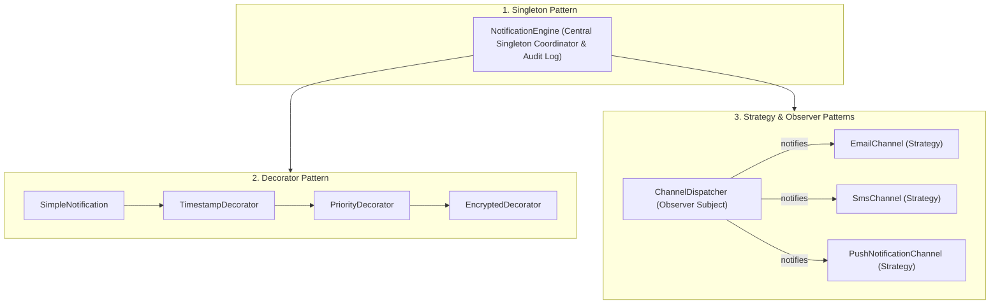

# 14. Build Your Own Notification Engine LLD

> 💡 **Quick Revision Anchor**: `Notification Decorator, Channel Strategy, Pub-Sub Dispatcher, Singleton Engine`

---

## 1. Problem Scope & Functional Requirements

Design an enterprise-grade **Notification Engine** (similar to systems powering Uber, Swiggy, or Amazon) that supports multi-channel message delivery, priority tagging, message formatting, and delivery tracking.

### Functional Requirements:
1. **Multi-Channel Dispatch**: Support Email, SMS, WhatsApp, and Mobile Push Notifications.
2. **Dynamic Notification Features**: Support dynamic decoration (e.g., adding Timestamps, Priority Tags, Encryption, Signature).
3. **Extensibility**: Adding a new channel (e.g., Slack or Discord) should not alter existing dispatching code.
4. **History & Audit Logging**: Centralized record of all dispatched notifications.

---

## 2. Architecture & Design Patterns Integration

This system elegantly harmonizes **four core GoF design patterns**:



---

## 3. Java Implementation Walkthrough

### 1. Notification Content & Decorator Hierarchy
```java
public interface INotification {
    String getContent();
    String getRecipient();
}

public class SimpleNotification implements INotification {
    private final String recipient;
    private final String message;

    public SimpleNotification(String recipient, String message) {
        this.recipient = recipient;
        this.message = message;
    }

    @Override
    public String getContent() { return message; }

    @Override
    public String getRecipient() { return recipient; }
}

// Abstract Decorator
public abstract class NotificationDecorator implements INotification {
    protected final INotification wrappedNotification;

    public NotificationDecorator(INotification notification) {
        this.wrappedNotification = notification;
    }

    @Override
    public String getRecipient() { return wrappedNotification.getRecipient(); }
}

// Concrete Decorator: Timestamp
public class TimestampDecorator extends NotificationDecorator {
    public TimestampDecorator(INotification notification) {
        super(notification);
    }

    @Override
    public String getContent() {
        return "[" + Instant.now().toString() + "] " + wrappedNotification.getContent();
    }
}

// Concrete Decorator: High Priority Urgent Tag
public class PriorityDecorator extends NotificationDecorator {
    private final String priorityLevel;

    public PriorityDecorator(INotification notification, String priorityLevel) {
        super(notification);
        this.priorityLevel = priorityLevel;
    }

    @Override
    public String getContent() {
        return "🚨 [PRIORITY: " + priorityLevel + "] " + wrappedNotification.getContent();
    }
}
```

### 2. Channel Strategy (The Observers)
```java
public interface NotificationChannel {
    void send(INotification notification);
    String getChannelName();
}

public class EmailChannel implements NotificationChannel {
    @Override
    public void send(INotification notification) {
        System.out.println("📧 [Email Gateway] To: " + notification.getRecipient() 
            + " | Body: " + notification.getContent());
    }

    @Override
    public String getChannelName() { return "EMAIL"; }
}

public class SmsChannel implements NotificationChannel {
    @Override
    public void send(INotification notification) {
        System.out.println("📱 [SMS Gateway via Twilio] To: " + notification.getRecipient() 
            + " | Body: " + notification.getContent());
    }

    @Override
    public String getChannelName() { return "SMS"; }
}
```

### 3. Notification Engine (Singleton Coordinator)
```java
public class NotificationEngine {
    private static volatile NotificationEngine instance;
    private final List<NotificationChannel> channels = new CopyOnWriteArrayList<>();
    private final List<INotification> historyLog = new ArrayList<>();

    private NotificationEngine() {}

    public static NotificationEngine getInstance() {
        if (instance == null) {
            synchronized (NotificationEngine.class) {
                if (instance == null) {
                    instance = new NotificationEngine();
                }
            }
        }
        return instance;
    }

    public void registerChannel(NotificationChannel channel) {
        channels.add(channel);
    }

    public synchronized void dispatch(INotification notification) {
        historyLog.add(notification); // Audit logging
        
        System.out.println("\n--- Initiating Notification Dispatch ---");
        for (NotificationChannel channel : channels) {
            channel.send(notification);
        }
    }

    public List<INotification> getHistoryLog() {
        return Collections.unmodifiableList(historyLog);
    }
}
```

### 4. Client Simulation
```java
public class Main {
    public static void main(String[] args) {
        NotificationEngine engine = NotificationEngine.getInstance();

        // Register active dispatch channels
        engine.registerChannel(new EmailChannel());
        engine.registerChannel(new SmsChannel());

        // 1. Create base notification
        INotification notification = new SimpleNotification("+919902634351", "Your OTP is 748291. Do not share.");

        // 2. Dynamically decorate with timestamp & urgent priority
        notification = new TimestampDecorator(notification);
        notification = new PriorityDecorator(notification, "HIGH");

        // 3. Dispatch across all registered channels
        engine.dispatch(notification);
    }
}
```

#### Output:
```text
--- Initiating Notification Dispatch ---
📧 [Email Gateway] To: +919902634351 | Body: 🚨 [PRIORITY: HIGH] [2026-09-20T14:52:00Z] Your OTP is 748291. Do not share.
📱 [SMS Gateway via Twilio] To: +919902634351 | Body: 🚨 [PRIORITY: HIGH] [2026-09-20T14:52:00Z] Your OTP is 748291. Do not share.
```

---

## 4. Key Design Patterns Summary

| Pattern | Role in Notification Engine |
| :--- | :--- |
| **Singleton Pattern** | `NotificationEngine` provides a single instance managing history and channel registry. |
| **Decorator Pattern** | Attaches timestamps, priority flags, and encryption without creating subclass permutations. |
| **Strategy Pattern** | `NotificationChannel` encapsulates vendor-specific API implementations (Twilio, SendGrid, FCM). |
| **Observer Pattern** | Multiple channels subscribe to the engine to broadcast notifications simultaneously. |
