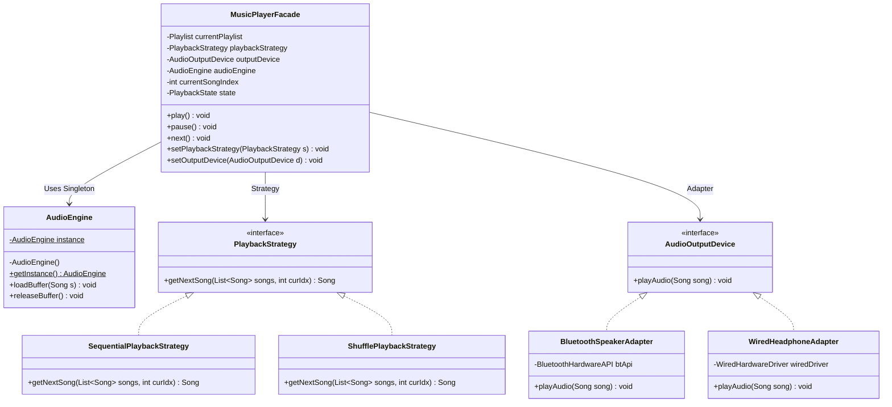
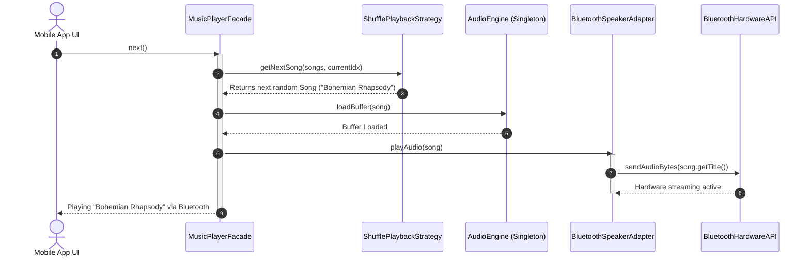

# 18. Build Spotify / Music Player App LLD

## 1. Problem Statement

Design a robust, extensible, and modular Low-Level Object-Oriented system for a music streaming application (such as Spotify or Apple Music). The system must handle song libraries, playlists, audio playback controls, interchangeable playback modes (sequential, shuffle, repeat), multiple hardware audio output devices, and provide a unified client interface.

---

## 2. Functional Requirements

1. **Song & Playlist Management**: Create playlists, add/remove songs with metadata (title, artist, duration).
2. **Playback Controls**: Play, pause, resume, stop, and skip to the next or previous track.
3. **Playback Strategies**: Support sequential playback, random shuffle, and repeat playlist modes.
4. **Audio Output Device Integration**: Route audio seamlessly through diverse hardware (Bluetooth speakers, wired headphones, TV cast) without coupling core logic to vendor drivers.
5. **Unified Client Interface**: Expose a clean, cohesive façade for mobile and desktop applications.

---

## 3. Non-Functional Requirements

- **Single Audio Engine**: Ensure only one audio playback engine manages physical sound card hardware at any given moment (preventing audio overlap).
- **Extensibility (OCP)**: Adding new playback modes or new audio output hardware requires zero changes to the core player engine.
- **Low Latency**: Track switching and playback control operations must execute with minimal latency.

---

## 4. Assumptions

- Songs are represented as audio files with duration metadata.
- Third-party hardware APIs for Bluetooth and wired drivers are simulated via adapter contracts.

---

## 5. Core Entities

- `Song`: Encapsulates song ID, title, artist, and duration.
- `Playlist`: Encapsulates a named collection of songs.
- `AudioEngine`: Singleton hardware buffer manager communicating with the physical sound card.
- `PlaybackStrategy`: Strategy interface for playlist traversal.
- `SequentialPlaybackStrategy`, `ShufflePlaybackStrategy`: Concrete playback strategies.
- `AudioOutputDevice`: Adapter interface for physical audio hardware.
- `BluetoothSpeakerAdapter`, `WiredHeadphoneAdapter`: Concrete hardware adapters.
- `MusicPlayerFacade`: Unified façade orchestrating playback, playlists, and device management.

---

## 6. Responsibilities

- `MusicPlayerFacade`: High-level entry point coordinating playlists, strategies, and output devices.
- `AudioEngine`: Low-level singleton managing audio streaming buffers.
- `PlaybackStrategy`: Determines the next song index based on the chosen algorithm.
- `AudioOutputDevice`: Translates standard play requests into vendor-specific hardware drivers.

---

## 7. Relationships

- `Playlist` **HAS-A** collection of `Song` (Aggregation).
- `MusicPlayerFacade` **HAS-A** `AudioEngine` (Singleton), `PlaybackStrategy` (Strategy), and `AudioOutputDevice` (Adapter).
- `BluetoothSpeakerAdapter` **IMPLEMENTS** `AudioOutputDevice` and **WRAPS** `BluetoothHardwareAPI`.

---

## 8. Interfaces

```java
public interface PlaybackStrategy {
    Song getNextSong(List<Song> songs, int currentIndex);
}

public interface AudioOutputDevice {
    void playAudio(Song song);
}
```

---

## 9. Important Enums

```java
public enum PlaybackState {
    PLAYING,
    PAUSED,
    STOPPED
}

public enum DeviceType {
    BLUETOOTH,
    WIRED,
    AIRPLAY
}
```

---

## 10. Design Patterns

1. **Singleton Pattern**: Ensures a single `AudioEngine` manages hardware sound buffers.
2. **Strategy Pattern**: Encapsulates interchangeable playback modes (`Sequential`, `Shuffle`).
3. **Adapter Pattern**: Bridges third-party hardware APIs (`BluetoothAPI`, `WiredDriver`) to the standard `AudioOutputDevice` interface.
4. **Factory Pattern**: Centralizes creation of audio output device adapters.
5. **Facade Pattern**: `MusicPlayerFacade` exposes an intuitive, unified client API.

---

## 11. Class Diagram



---

## 12. Important Runtime Flows

1. **Track Playback**: User triggers `play()` $\rightarrow$ Façade checks state $\rightarrow$ `AudioEngine` loads audio buffer $\rightarrow$ `AudioOutputDevice` outputs audio.
2. **Skip to Next Track**: User calls `next()` $\rightarrow$ Façade queries `PlaybackStrategy.getNextSong()` $\rightarrow$ Updates current index $\rightarrow$ Routes new song to output device.
3. **Switch Audio Output**: User connects Bluetooth $\rightarrow$ Façade switches active `AudioOutputDevice` to `BluetoothSpeakerAdapter` without interrupting playlist state.

---

## 13. Sequence Diagram



---

## 14. Java Implementation

```java
import java.util.*;

// ==========================================
// 1. DOMAIN MODELS & ENUMS
// ==========================================
public enum PlaybackState { PLAYING, PAUSED, STOPPED }

public class Song {
    private final String id;
    private final String title;
    private final String artist;
    private final int durationSeconds;

    public Song(String id, String title, String artist, int durationSeconds) {
        this.id = Objects.requireNonNull(id);
        this.title = Objects.requireNonNull(title);
        this.artist = Objects.requireNonNull(artist);
        this.durationSeconds = durationSeconds;
    }

    public String getTitle() { return title; }
    public String getArtist() { return artist; }
    public int getDurationSeconds() { return durationSeconds; }
}

public class Playlist {
    private final String name;
    private final List<Song> songs = new ArrayList<>();

    public Playlist(String name) { this.name = name; }
    public void addSong(Song song) { if (song != null) songs.add(song); }
    public List<Song> getSongs() { return Collections.unmodifiableList(songs); }
    public String getName() { return name; }
}

// ==========================================
// 2. SINGLETON AUDIO ENGINE (Hardware Buffer)
// ==========================================
public class AudioEngine {
    private static volatile AudioEngine instance;
    private AudioEngine() {}

    public static AudioEngine getInstance() {
        if (instance == null) {
            synchronized (AudioEngine.class) {
                if (instance == null) {
                    instance = new AudioEngine();
                }
            }
        }
        return instance;
    }

    public void loadBuffer(Song song) {
        System.out.println("🎛️ [AudioEngine] Loaded sound buffer for: " + song.getTitle());
    }

    public void releaseBuffer() {
        System.out.println("🎛️ [AudioEngine] Sound buffer released.");
    }
}

// ==========================================
// 3. STRATEGY PATTERN (Playback Algorithms)
// ==========================================
public interface PlaybackStrategy {
    Song getNextSong(List<Song> songs, int currentIndex);
}

public class SequentialPlaybackStrategy implements PlaybackStrategy {
    @Override
    public Song getNextSong(List<Song> songs, int currentIndex) {
        if (songs.isEmpty()) return null;
        int nextIndex = (currentIndex + 1) % songs.size();
        return songs.get(nextIndex);
    }
}

public class ShufflePlaybackStrategy implements PlaybackStrategy {
    private final Random random = new Random();

    @Override
    public Song getNextSong(List<Song> songs, int currentIndex) {
        if (songs.isEmpty()) return null;
        int randomIndex = random.nextInt(songs.size());
        return songs.get(randomIndex);
    }
}

// ==========================================
// 4. ADAPTER PATTERN (Hardware Audio Output)
// ==========================================
public interface AudioOutputDevice {
    void playAudio(Song song);
}

// Simulated incompatible 3rd-party vendor SDKs
class BluetoothHardwareAPI {
    public void streamToSpeaker(String trackName) {
        System.out.println("📶 [Bluetooth API] Streaming audio packets to wireless speaker: " + trackName);
    }
}

class WiredHardwareDriver {
    public void sendPcmAudio(String trackName) {
        System.out.println("🎧 [Wired Driver] Outputting analog 3.5mm jack signal: " + trackName);
    }
}

// Adapters
public class BluetoothSpeakerAdapter implements AudioOutputDevice {
    private final BluetoothHardwareAPI btApi = new BluetoothHardwareAPI();

    @Override
    public void playAudio(Song song) {
        btApi.streamToSpeaker(song.getTitle() + " by " + song.getArtist());
    }
}

public class WiredHeadphoneAdapter implements AudioOutputDevice {
    private final WiredHardwareDriver driver = new WiredHardwareDriver();

    @Override
    public void playAudio(Song song) {
        driver.sendPcmAudio(song.getTitle() + " by " + song.getArtist());
    }
}

// ==========================================
// 5. UNIFIED CLIENT FAÇADE
// ==========================================
public class MusicPlayerFacade {
    private final AudioEngine audioEngine;
    private Playlist playlist;
    private PlaybackStrategy playbackStrategy;
    private AudioOutputDevice outputDevice;
    private int currentSongIndex = -1;
    private PlaybackState state = PlaybackState.STOPPED;

    public MusicPlayerFacade(Playlist playlist, PlaybackStrategy strategy, AudioOutputDevice device) {
        this.audioEngine = AudioEngine.getInstance();
        this.playlist = Objects.requireNonNull(playlist);
        this.playbackStrategy = Objects.requireNonNull(strategy);
        this.outputDevice = Objects.requireNonNull(device);
    }

    public void play() {
        if (playlist.getSongs().isEmpty()) return;
        if (currentSongIndex == -1) currentSongIndex = 0;

        Song currentSong = playlist.getSongs().get(currentSongIndex);
        audioEngine.loadBuffer(currentSong);
        outputDevice.playAudio(currentSong);
        state = PlaybackState.PLAYING;
    }

    public void next() {
        Song nextSong = playbackStrategy.getNextSong(playlist.getSongs(), currentSongIndex);
        if (nextSong != null) {
            currentSongIndex = playlist.getSongs().indexOf(nextSong);
            audioEngine.loadBuffer(nextSong);
            outputDevice.playAudio(nextSong);
            state = PlaybackState.PLAYING;
        }
    }

    public void pause() {
        state = PlaybackState.PAUSED;
        System.out.println("⏸️ [Playback] Paused.");
    }

    public void setPlaybackStrategy(PlaybackStrategy strategy) {
        this.playbackStrategy = Objects.requireNonNull(strategy);
        System.out.println("🔀 Playback mode changed.");
    }

    public void setOutputDevice(AudioOutputDevice device) {
        this.outputDevice = Objects.requireNonNull(device);
        System.out.println("🔊 Audio output device switched.");
    }
}
```

---

## 15. Edge Cases

- **Empty Playlist**: Calling `play()` or `next()` on an empty playlist returns gracefully without throwing `IndexOutOfBoundsException`.
- **Single-Song Playlist with Shuffle**: In a 1-song playlist, `ShufflePlaybackStrategy` safely repeats the same song.

---

## 16. Concurrency Considerations

- Playback state transitions (`play()`, `pause()`, `next()`) must be thread-safe if triggered concurrently by UI threads, Bluetooth headphone hardware buttons, and lock-screen media controls.

---

## 17. Extensibility

- **New Audio Output**: Adding support for **Sonos Wi-Fi Casting** requires creating `SonosCastAdapter implements AudioOutputDevice` without editing `MusicPlayerFacade`.

---

## 18. Trade-offs

- **Memory Buffering vs Streaming**: Loading whole song buffers into heap memory crashes mobile devices; production implementations stream chunks via ring buffers.

---

## 19. Interview Questions

1. **How do 5 design patterns coordinate in Spotify LLD?**
   - *Answer*: Singleton manages the single physical `AudioEngine`; Strategy manages interchangeable playback modes (Shuffle vs Sequential); Adapter bridges third-party audio drivers (Bluetooth, Wired); Factory instantiates device adapters; Facade unifies operations into a simple client API.
2. **Why is the AudioEngine implemented as a Singleton?**
   - *Answer*: To prevent multiple audio hardware controllers from operating simultaneously, which would cause overlapping, cacophonous audio streams.
3. **How does the Adapter pattern protect the application from third-party driver changes?**
   - *Answer*: By wrapping vendor SDKs inside adapters, any breaking vendor changes are contained strictly within the adapter class, leaving playback and playlist services untouched.

---

## 20. Quick Revision

### Core Idea
> Spotify LLD orchestrates 5 design patterns: Singleton (Audio Engine), Strategy (Playback Modes), Adapter (Output Devices), Factory (Device Creation), and Facade (Client API).

### Remember
- AudioEngine is a Singleton to prevent overlapping sound card access.
- Strategy allows dynamic switching between Sequential and Shuffle modes.
- Adapter isolates third-party Bluetooth and wired hardware SDKs.

### Java Implementation Idea
> Implement `AudioEngine.getInstance()`, `PlaybackStrategy` (Sequential/Shuffle), `AudioOutputDevice` adapters, and coordinate them inside `MusicPlayerFacade`.

### Most Important Interview Point
> Articulate how all 5 patterns interact harmoniously to provide a clean, extensible media player architecture.

### Common Trap
> Do not couple playback algorithms directly inside the `Playlist` class; extract them into independent strategies.
