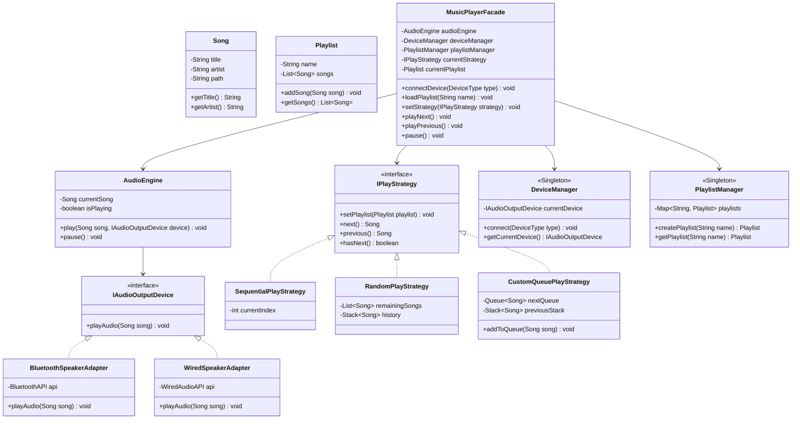

# 18. Build Spotify / Music Player App — LLD Case Study

> 💡 **Quick Revision Anchor**
> - **Domain:** Music Streaming & Player Application (Spotify / Apple Music LLD)
> - **Key Architectural Patterns:**
>   - **Facade Pattern:** `MusicPlayerFacade` acts as the single unified interface shielding clients from complex audio engine, device orchestration, and playlist state.
>   - **Adapter Pattern:** Adapts various third-party audio hardware APIs (Bluetooth, Wired headphones) to a unified `IAudioOutputDevice` interface.
>   - **Factory Pattern:** `DeviceFactory` encapsulates concrete device instantiation based on `DeviceType`.
>   - **Strategy Pattern:** `IPlayStrategy` provides interchangeable playback algorithms (`SequentialPlayStrategy`, `RandomPlayStrategy`, `CustomQueuePlayStrategy`).
>   - **Singleton Pattern:** Manages centralized registries via `DeviceManager` and `PlaylistManager`.

---

## 1. Problem Statement & Requirements

We are designing the Low-Level Architecture for a Music Player Application (such as Spotify, Apple Music, or an integrated device audio player).

### Functional Requirements:
1. **Song Playback:** Play and pause individual songs.
2. **Audio Hardware Support:** Support multiple audio output devices seamlessly (Internal Speaker, Bluetooth Speaker, Wired Headphones, etc.).
3. **Playlists:**
   - Create playlists and add songs to them.
   - Load and switch active playlists.
4. **Playback Modes (Strategies):**
   - **Sequential Playback:** Play songs in standard playlist order (1st, 2nd, 3rd, ...), supporting Next and Previous.
   - **Random / Shuffle Playback:** Randomly select unplayed tracks until the playlist is exhausted; support moving back through playback history.
   - **Custom Queue Playback:** Allow the user to manually append tracks into a dynamic "play next" queue.
5. **Single Entry Point (App Orchestrator):** A clean, intuitive client-facing application interface that prevents client code from wrestling with internal engines, audio drivers, and queues.

---

## 2. Core Entities & Design Breakdown (Bottom-Up Approach)

We design the system using a **bottom-up approach**, starting with core domain entities and escalating to orchestration.

```
       +--------------------------------------------------------+
       |                     MusicPlayerApp                     | (Client Entry Point)
       +--------------------------------------------------------+
                                   |
                                   ▼
       +--------------------------------------------------------+
       |                   MusicPlayerFacade                    | (Unified Facade)
       +--------------------------------------------------------+
           /                    |                    \
          ▼                     ▼                     ▼
+-------------------+ +-------------------+ +-------------------+
|   DeviceManager   | |   PlaylistManager | |    AudioEngine    |
|    (Singleton)    | |    (Singleton)    | | (Core Controller) |
+-------------------+ +-------------------+ +-------------------+
          |                     |                     |
          ▼                     ▼                     ▼
    DeviceFactory           Playlist           IAudioOutputDevice
          |                     |              (Bluetooth/Wired)
  IAudioOutputDevice      IPlayStrategy
  (Adapters)             (Seq/Random/Q)
```

---

## 3. Architecture & Class Diagram



---

## 4. Java Implementation

### Step 1: Core Domain Entities & Device Enums
```java
public class Song {
    private final String title;
    private final String artist;
    private final String path;

    public Song(String title, String artist, String path) {
        this.title = title;
        this.artist = artist;
        this.path = path;
    }

    public String getTitle() { return title; }
    public String getArtist() { return artist; }

    @Override
    public String toString() {
        return "'" + title + "' by " + artist;
    }
}

public enum DeviceType {
    BLUETOOTH, WIRED, HEADPHONES
}
```

---

### Step 2: Output Hardware Abstraction (Adapter Pattern)
```java
// Target interface for all audio output devices
public interface IAudioOutputDevice {
    void playAudio(Song song);
}

// Simulated 3rd-party Bluetooth driver API
class BluetoothAPI {
    public void streamBluetoothSound(String trackPath) {
        System.out.println("[Bluetooth Stream] Transmitting audio packets from: " + trackPath);
    }
}

// Adapter for Bluetooth hardware
public class BluetoothSpeakerAdapter implements IAudioOutputDevice {
    private final BluetoothAPI api = new BluetoothAPI();

    @Override
    public void playAudio(Song song) {
        System.out.println("Output -> Bluetooth Speaker: Playing " + song);
        api.streamBluetoothSound(song.getTitle());
    }
}

// Adapter for Wired connection
public class WiredSpeakerAdapter implements IAudioOutputDevice {
    @Override
    public void playAudio(Song song) {
        System.out.println("Output -> 3.5mm Aux / Wired Headphones: Playing " + song);
    }
}
```

---

### Step 3: Hardware Factory & Device Manager (Factory + Singleton)
```java
public class DeviceFactory {
    public static IAudioOutputDevice createDevice(DeviceType type) {
        return switch (type) {
            case BLUETOOTH -> new BluetoothSpeakerAdapter();
            case WIRED, HEADPHONES -> new WiredSpeakerAdapter();
        };
    }
}

// Singleton Device Manager
public class DeviceManager {
    private static DeviceManager instance;
    private IAudioOutputDevice currentDevice;

    private DeviceManager() {}

    public static synchronized DeviceManager getInstance() {
        if (instance == null) {
            instance = new DeviceManager();
        }
        return instance;
    }

    public void connect(DeviceType type) {
        this.currentDevice = DeviceFactory.createDevice(type);
        System.out.println("Device connected: " + type);
    }

    public IAudioOutputDevice getCurrentDevice() {
        if (currentDevice == null) {
            // Default fallback
            currentDevice = new WiredSpeakerAdapter();
        }
        return currentDevice;
    }
}
```

---

### Step 4: Core Audio Engine
```java
public class AudioEngine {
    private Song currentSong;
    private boolean isPlaying = false;

    public void play(Song song, IAudioOutputDevice device) {
        this.currentSong = song;
        this.isPlaying = true;
        device.playAudio(song);
    }

    public void pause() {
        if (isPlaying && currentSong != null) {
            System.out.println("AudioEngine: Paused " + currentSong);
            isPlaying = false;
        } else {
            System.out.println("AudioEngine: No active song to pause.");
        }
    }

    public Song getCurrentSong() { return currentSong; }
    public boolean isPlaying() { return isPlaying; }
}
```

---

### Step 5: Playlist & Playback Strategies (Strategy Pattern)
```java
import java.util.*;

public class Playlist {
    private final String name;
    private final List<Song> songs = new ArrayList<>();

    public Playlist(String name) { this.name = name; }

    public void addSong(Song song) { songs.add(song); }
    public String getName() { return name; }
    public List<Song> getSongs() { return songs; }
}

// Strategy Interface
public interface IPlayStrategy {
    void setPlaylist(Playlist playlist);
    Song next();
    Song previous();
    boolean hasNext();
}

// 1. Sequential Playback Strategy
public class SequentialPlayStrategy implements IPlayStrategy {
    private Playlist playlist;
    private int currentIndex = -1;

    @Override
    public void setPlaylist(Playlist playlist) {
        this.playlist = playlist;
        this.currentIndex = -1;
    }

    @Override
    public Song next() {
        if (!hasNext()) return null;
        currentIndex++;
        return playlist.getSongs().get(currentIndex);
    }

    @Override
    public Song previous() {
        if (currentIndex > 0) {
            currentIndex--;
            return playlist.getSongs().get(currentIndex);
        }
        return null;
    }

    @Override
    public boolean hasNext() {
        return playlist != null && currentIndex + 1 < playlist.getSongs().size();
    }
}

// 2. Random / Shuffle Strategy with History Stack
public class RandomPlayStrategy implements IPlayStrategy {
    private final List<Song> remainingSongs = new ArrayList<>();
    private final Stack<Song> history = new Stack<>();
    private final Random random = new Random();

    @Override
    public void setPlaylist(Playlist playlist) {
        remainingSongs.clear();
        history.clear();
        if (playlist != null) {
            remainingSongs.addAll(playlist.getSongs());
        }
    }

    @Override
    public Song next() {
        if (remainingSongs.isEmpty()) return null;
        int randomIndex = random.nextInt(remainingSongs.size());
        Song chosen = remainingSongs.remove(randomIndex);
        history.push(chosen);
        return chosen;
    }

    @Override
    public Song previous() {
        if (history.size() > 1) {
            remainingSongs.add(history.pop()); // Return current to pool
            return history.peek();             // Return previous
        }
        return null;
    }

    @Override
    public boolean hasNext() {
        return !remainingSongs.isEmpty();
    }
}

// 3. Custom Queue Strategy
public class CustomQueuePlayStrategy implements IPlayStrategy {
    private final Queue<Song> nextQueue = new LinkedList<>();
    private final Stack<Song> history = new Stack<>();

    @Override
    public void setPlaylist(Playlist playlist) {
        nextQueue.clear();
        history.clear();
        if (playlist != null) {
            nextQueue.addAll(playlist.getSongs());
        }
    }

    public void addToNext(Song song) {
        nextQueue.add(song);
        System.out.println("Added to queue: " + song.getTitle());
    }

    @Override
    public Song next() {
        if (nextQueue.isEmpty()) return null;
        Song next = nextQueue.poll();
        history.push(next);
        return next;
    }

    @Override
    public Song previous() {
        if (history.size() > 1) {
            return history.pop();
        }
        return null;
    }

    @Override
    public boolean hasNext() {
        return !nextQueue.isEmpty();
    }
}
```

---

### Step 6: Playlist Manager (Singleton Pattern)
```java
public class PlaylistManager {
    private static PlaylistManager instance;
    private final Map<String, Playlist> playlists = new HashMap<>();

    private PlaylistManager() {}

    public static synchronized PlaylistManager getInstance() {
        if (instance == null) instance = new PlaylistManager();
        return instance;
    }

    public Playlist createPlaylist(String name) {
        Playlist pl = new Playlist(name);
        playlists.put(name, pl);
        return pl;
    }

    public Playlist getPlaylist(String name) {
        return playlists.get(name);
    }
}
```

---

### Step 7: The Unified Facade (`MusicPlayerFacade`)
```java
public class MusicPlayerFacade {
    private final AudioEngine audioEngine;
    private final DeviceManager deviceManager;
    private final PlaylistManager playlistManager;
    private IPlayStrategy playStrategy;
    private Playlist currentPlaylist;

    public MusicPlayerFacade() {
        this.audioEngine = new AudioEngine();
        this.deviceManager = DeviceManager.getInstance();
        this.playlistManager = PlaylistManager.getInstance();
        this.playStrategy = new SequentialPlayStrategy(); // Default strategy
    }

    public void connectAudioDevice(DeviceType type) {
        deviceManager.connect(type);
    }

    public void createPlaylist(String name) {
        playlistManager.createPlaylist(name);
    }

    public void addSongToPlaylist(String playlistName, Song song) {
        Playlist pl = playlistManager.getPlaylist(playlistName);
        if (pl != null) pl.addSong(song);
    }

    public void loadPlaylist(String name) {
        this.currentPlaylist = playlistManager.getPlaylist(name);
        playStrategy.setPlaylist(currentPlaylist);
        System.out.println("Loaded playlist: " + name);
    }

    public void setPlayStrategy(IPlayStrategy strategy) {
        this.playStrategy = strategy;
        this.playStrategy.setPlaylist(currentPlaylist);
        System.out.println("Playback strategy switched to: " + strategy.getClass().getSimpleName());
    }

    public void playNext() {
        if (playStrategy == null || !playStrategy.hasNext()) {
            System.out.println("Playlist finished / No next track.");
            return;
        }
        Song song = playStrategy.next();
        audioEngine.play(song, deviceManager.getCurrentDevice());
    }

    public void playPrevious() {
        if (playStrategy == null) return;
        Song prev = playStrategy.previous();
        if (prev != null) {
            audioEngine.play(prev, deviceManager.getCurrentDevice());
        } else {
            System.out.println("No previous track available.");
        }
    }

    public void pause() {
        audioEngine.pause();
    }
}
```

---

### Step 8: Client Application Orchestration
```java
public class MusicPlayerApp {
    public static void main(String[] args) {
        MusicPlayerFacade app = new MusicPlayerFacade();

        // 1. Connect output device
        app.connectAudioDevice(DeviceType.BLUETOOTH);

        // 2. Build songs and playlist
        app.createPlaylist("Bollywood Hits");
        app.addSongToPlaylist("Bollywood Hits", new Song("Chaiyya Chaiyya", "Sukhwinder Singh", "/music/chaiyya.mp3"));
        app.addSongToPlaylist("Bollywood Hits", new Song("Tum Hi Ho", "Arijit Singh", "/music/tum_hi_ho.mp3"));
        app.addSongToPlaylist("Bollywood Hits", new Song("Jai Ho", "A.R. Rahman", "/music/jai_ho.mp3"));

        // 3. Load playlist and play sequentially
        app.loadPlaylist("Bollywood Hits");
        System.out.println("\n--- Playing Sequential Tracks ---");
        app.playNext(); // Chaiyya Chaiyya
        app.playNext(); // Tum Hi Ho

        // 4. Pause playback
        app.pause();

        // 5. Switch to Shuffle / Random Strategy
        System.out.println("\n--- Switching to Shuffle Strategy ---");
        app.setPlayStrategy(new RandomPlayStrategy());
        app.playNext();

        // 6. Navigate back
        System.out.println("\n--- Play Previous Track ---");
        app.playPrevious();
    }
}
```

---

## 5. Summary of Design Patterns Applied

| Pattern | Where Used in Spotify Case Study | Purpose |
| :--- | :--- | :--- |
| **Facade Pattern** | `MusicPlayerFacade` | Simplifies the entire subsystem (AudioEngine, DeviceManager, PlaylistManager, Strategies) behind unified methods (`playNext()`, `loadPlaylist()`). |
| **Adapter Pattern** | `BluetoothSpeakerAdapter`, `WiredSpeakerAdapter` | Converts proprietary third-party audio hardware APIs to `IAudioOutputDevice`. |
| **Factory Pattern** | `DeviceFactory` | Centralizes creation of audio output adapters by `DeviceType`. |
| **Strategy Pattern** | `SequentialPlayStrategy`, `RandomPlayStrategy`, `CustomQueuePlayStrategy` | Encapsulates distinct playback ordering algorithms, swappable at runtime. |
| **Singleton Pattern** | `DeviceManager`, `PlaylistManager` | Centralizes hardware connection state and playlist storage across the app. |

---

## 6. Interview Perspective & Follow-Up Questions

- **Q: How would you support physical media buttons (Play, Pause, Skip) on a dedicated hardware player?**
  *A: Introduce the **Command Pattern**. Create `PlayCommand`, `PauseCommand`, and `SkipCommand` objects that encapsulate calls to `MusicPlayerFacade`. Physical button presses trigger the command.*
- **Q: How would you update a UI / Lock Screen notification when the track changes?**
  *A: Apply the **Observer Pattern**. `AudioEngine` acts as Subject and emits `trackChanged(Song song)` events to UI observers (`LockScreenWidget`, `NowPlayingScreen`).*
- **Q: How to handle infinite repeating playlists?**
  *A: Implement a `RepeatAllStrategy` or `RepeatOneStrategy` extending `IPlayStrategy` where `hasNext()` always returns `true` and resets index to 0 upon reaching the end.*
