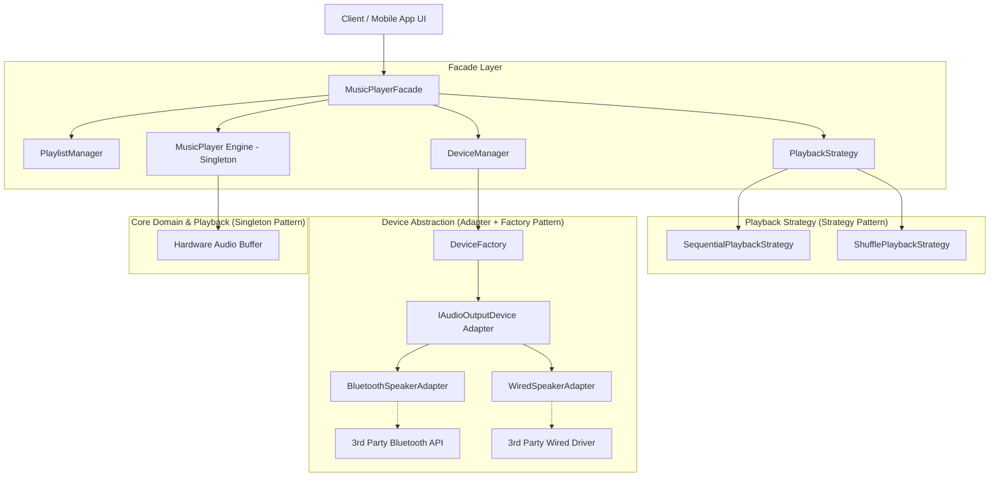
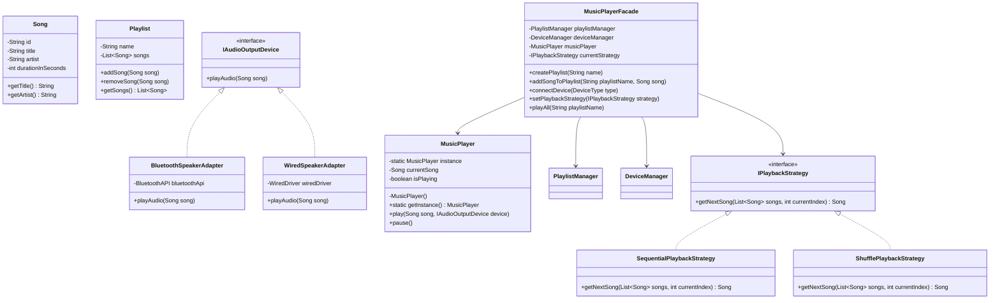

# 18. Build Spotify / Music Player App LLD

> 💡 **Quick Revision Anchor**: A comprehensive machine-coding case study orchestrating **5 core design patterns**: **Singleton** (Audio Engine), **Strategy** (Playback modes: Sequential/Shuffle), **Adapter** (Audio output devices: Bluetooth/Wired), **Factory** (Device creation), and **Facade** (Unified client interface).

---

## 1. Problem Statement & Requirements

Design a modular, extensible music player system (Spotify/Apple Music clone) capable of managing songs, playlists, audio playback controls, flexible playback algorithms, and diverse hardware output devices.

### Functional Requirements:
1. **Song & Library Management**: Represent individual songs with metadata (title, artist, duration).
2. **Playlist Operations**: Create playlists, add songs, remove songs, and retrieve songs.
3. **Playback Control**: Play individual song, pause, resume, stop.
4. **Playback Modes (Algorithms)**: Play all songs in a playlist sequentially, randomly (shuffle), or repeat.
5. **Output Device Integration**: Play sound through diverse audio hardware (Bluetooth speaker, wired headphones, TV cast) without coupling core logic to vendor drivers.
6. **Unified Client API**: Expose a clean, cohesive facade for client/UI interaction.

### Non-Functional Requirements:
- **Extensibility (Open/Closed Principle)**: Adding new playback strategies or new output hardware requires zero changes to existing playback logic.
- **Single Source of Truth**: Only one audio playback engine must manage sound hardware at any given moment.

---

## 2. Design Patterns Architecture Map



---

## 3. Class Diagram & Relationships



---

## 4. Production Java Implementation

### Step 1: Domain Models (Song & Playlist)
```java
import java.util.*;

public class Song {
    private final String id;
    private final String title;
    private final String artist;
    private final int durationInSeconds;

    public Song(String id, String title, String artist, int durationInSeconds) {
        this.id = id;
        this.title = title;
        this.artist = artist;
        this.durationInSeconds = durationInSeconds;
    }

    public String getId() { return id; }
    public String getTitle() { return title; }
    public String getArtist() { return artist; }
    public int getDurationInSeconds() { return durationInSeconds; }

    @Override
    public String toString() {
        return "'" + title + "' by " + artist + " (" + durationInSeconds + "s)";
    }
}

public class Playlist {
    private final String name;
    private final List<Song> songs = new ArrayList<>();

    public Playlist(String name) {
        this.name = name;
    }

    public String getName() { return name; }
    public void addSong(Song song) { songs.add(song); }
    public void removeSong(Song song) { songs.remove(song); }
    public List<Song> getSongs() { return Collections.unmodifiableList(songs); }
}
```

### Step 2: Strategy Pattern (Playback Modes)
```java
public interface IPlaybackStrategy {
    List<Song> generatePlayQueue(List<Song> originalSongs);
}

public class SequentialPlaybackStrategy implements IPlaybackStrategy {
    @Override
    public List<Song> generatePlayQueue(List<Song> originalSongs) {
        // Preserves exact list ordering
        return new ArrayList<>(originalSongs);
    }
}

public class ShufflePlaybackStrategy implements IPlaybackStrategy {
    @Override
    public List<Song> generatePlayQueue(List<Song> originalSongs) {
        List<Song> shuffled = new ArrayList<>(originalSongs);
        Collections.shuffle(shuffled);
        return shuffled;
    }
}
```

### Step 3: Adapter & Factory Pattern (Audio Output Devices)
```java
// Target Interface for output devices
public interface IAudioOutputDevice {
    void playAudio(Song song);
}

// Incompatible 3rd party Bluetooth SDK
class ThirdPartyBluetoothAPI {
    public void streamBluetoothSound(String trackName, String bitRate) {
        System.out.println("[Bluetooth Speaker 3rd-Party] Streaming Bluetooth packets for: " 
                           + trackName + " at " + bitRate);
    }
}

// Incompatible 3rd party Wired DAC driver
class ThirdPartyWiredDriver {
    public void outputDacSignal(String songTitle) {
        System.out.println("[Wired 3.5mm DAC] Converting analog output for: " + songTitle);
    }
}

// Adapter 1: Bluetooth
public class BluetoothSpeakerAdapter implements IAudioOutputDevice {
    private final ThirdPartyBluetoothAPI btApi = new ThirdPartyBluetoothAPI();

    @Override
    public void playAudio(Song song) {
        btApi.streamBluetoothSound(song.getTitle(), "320kbps");
    }
}

// Adapter 2: Wired Speaker
public class WiredSpeakerAdapter implements IAudioOutputDevice {
    private final ThirdPartyWiredDriver wiredDriver = new ThirdPartyWiredDriver();

    @Override
    public void playAudio(Song song) {
        wiredDriver.outputDacSignal(song.getTitle());
    }
}

public enum DeviceType {
    BLUETOOTH,
    WIRED
}

// Factory Pattern: Encapsulates adapter creation
public class DeviceFactory {
    public static IAudioOutputDevice createDevice(DeviceType type) {
        switch (type) {
            case BLUETOOTH:
                return new BluetoothSpeakerAdapter();
            case WIRED:
                return new WiredSpeakerAdapter();
            default:
                throw new IllegalArgumentException("Unsupported device type: " + type);
        }
    }
}
```

### Step 4: Managers & Core Singleton Engine
```java
// PlaylistManager handles playlist collection
public class PlaylistManager {
    private final Map<String, Playlist> playlists = new HashMap<>();

    public void createPlaylist(String name) {
        playlists.putIfAbsent(name, new Playlist(name));
    }

    public void addSongToPlaylist(String playlistName, Song song) {
        Playlist pl = playlists.get(playlistName);
        if (pl != null) {
            pl.addSong(song);
        } else {
            System.err.println("Playlist not found: " + playlistName);
        }
    }

    public Playlist getPlaylist(String name) {
        return playlists.get(name);
    }
}

// DeviceManager tracks currently connected hardware
public class DeviceManager {
    private IAudioOutputDevice currentDevice;

    public void connectDevice(DeviceType type) {
        this.currentDevice = DeviceFactory.createDevice(type);
        System.out.println("[DeviceManager] Connected device: " + type);
    }

    public IAudioOutputDevice getCurrentDevice() {
        if (currentDevice == null) {
            // Default to wired
            currentDevice = new WiredSpeakerAdapter();
        }
        return currentDevice;
    }
}

// Singleton Audio Playback Engine
public class MusicPlayer {
    private static volatile MusicPlayer instance;
    private Song currentSong;
    private boolean isPlaying = false;

    private MusicPlayer() {}

    public static MusicPlayer getInstance() {
        if (instance == null) {
            synchronized (MusicPlayer.class) {
                if (instance == null) {
                    instance = new MusicPlayer();
                }
            }
        }
        return instance;
    }

    public void play(Song song, IAudioOutputDevice outputDevice) {
        this.currentSong = song;
        this.isPlaying = true;
        System.out.println("\n[MusicPlayer Engine] Playing: " + song);
        outputDevice.playAudio(song);
    }

    public void pause() {
        if (isPlaying && currentSong != null) {
            this.isPlaying = false;
            System.out.println("[MusicPlayer Engine] Paused: " + currentSong.getTitle());
        }
    }

    public void stop() {
        this.isPlaying = false;
        this.currentSong = null;
        System.out.println("[MusicPlayer Engine] Playback stopped.");
    }
}
```

### Step 5: The Facade (SpotifyApp / MusicPlayerFacade)
```java
public class SpotifyAppFacade {
    private final PlaylistManager playlistManager = new PlaylistManager();
    private final DeviceManager deviceManager = new DeviceManager();
    private final MusicPlayer player = MusicPlayer.getInstance();
    private IPlaybackStrategy playbackStrategy = new SequentialPlaybackStrategy();

    public void createPlaylist(String name) {
        playlistManager.createPlaylist(name);
        System.out.println("[Spotify] Created playlist: " + name);
    }

    public void addSongToPlaylist(String name, Song song) {
        playlistManager.addSongToPlaylist(name, song);
    }

    public void setPlaybackStrategy(IPlaybackStrategy strategy) {
        this.playbackStrategy = strategy;
        System.out.println("[Spotify] Playback mode updated.");
    }

    public void connectOutputDevice(DeviceType type) {
        deviceManager.connectDevice(type);
    }

    public void playSong(Song song) {
        player.play(song, deviceManager.getCurrentDevice());
    }

    public void playPlaylist(String playlistName) {
        Playlist playlist = playlistManager.getPlaylist(playlistName);
        if (playlist == null || playlist.getSongs().isEmpty()) {
            System.out.println("[Spotify] Playlist empty or not found: " + playlistName);
            return;
        }

        System.out.println("\n--- [Spotify] Starting Playlist: " + playlistName + " ---");
        List<Song> queue = playbackStrategy.generatePlayQueue(playlist.getSongs());
        for (Song s : queue) {
            player.play(s, deviceManager.getCurrentDevice());
        }
        System.out.println("--- [Spotify] Finished Playlist: " + playlistName + " ---\n");
    }

    public void pause() {
        player.pause();
    }
}
```

### Step 6: Driver Execution
```java
public class Main {
    public static void main(String[] args) {
        SpotifyAppFacade spotify = new SpotifyAppFacade();

        // 1. Setup songs
        Song s1 = new Song("S1", "Bohemian Rhapsody", "Queen", 354);
        Song s2 = new Song("S2", "Hotel California", "Eagles", 390);
        Song s3 = new Song("S3", "Starboy", "The Weeknd", 230);

        // 2. Playlist creation
        spotify.createPlaylist("Classic Rock & Pop");
        spotify.addSongToPlaylist("Classic Rock & Pop", s1);
        spotify.addSongToPlaylist("Classic Rock & Pop", s2);
        spotify.addSongToPlaylist("Classic Rock & Pop", s3);

        // 3. Connect Bluetooth Device
        spotify.connectOutputDevice(DeviceType.BLUETOOTH);

        // 4. Sequential Playback
        System.out.println("\n>>> TEST 1: SEQUENTIAL PLAYBACK");
        spotify.setPlaybackStrategy(new SequentialPlaybackStrategy());
        spotify.playPlaylist("Classic Rock & Pop");

        // 5. Connect Wired & Shuffle Playback
        System.out.println("\n>>> TEST 2: SHUFFLE PLAYBACK ON WIRED SPEAKER");
        spotify.connectOutputDevice(DeviceType.WIRED);
        spotify.setPlaybackStrategy(new ShufflePlaybackStrategy());
        spotify.playPlaylist("Classic Rock & Pop");
    }
}
```

---

## 5. Machine Coding Interview Evaluation Checklist

| Criteria | How We Addressed It |
| :--- | :--- |
| **Separation of Concerns** | Strategy handles ordering, Adapter handles vendor drivers, Singleton handles playback hardware state, Facade coordinates UI. |
| **Extensibility (OCP)** | Adding a SmartTV output or repeat-one strategy requires writing a new class without modifying existing components. |
| **Encapsulation** | Playlists expose unmodifiable lists, preventing external collections tampering. |
| **Thread-Safety** | Double-checked locking with `volatile` prevents multi-threaded corruption of the sound engine. |
