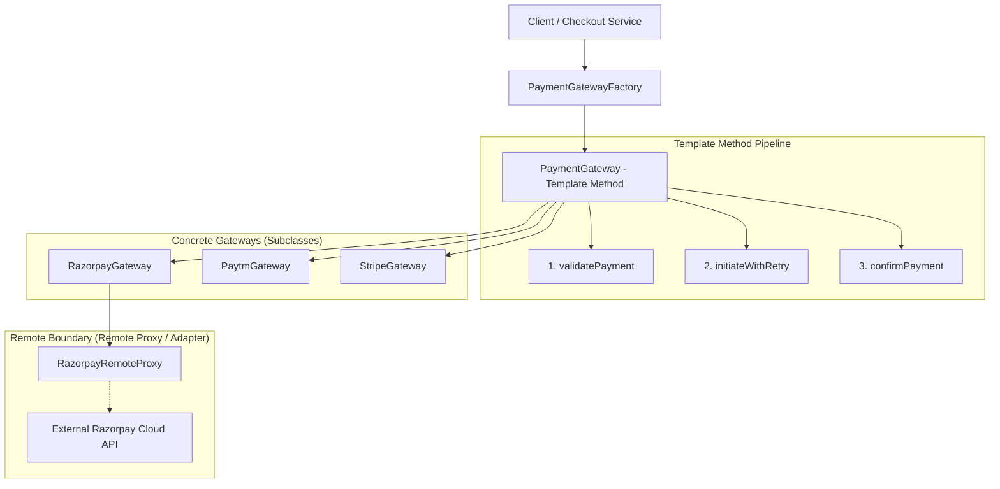
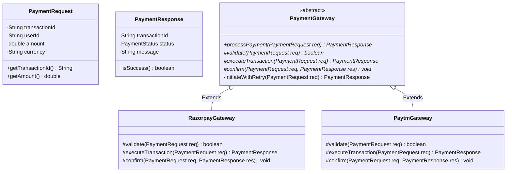

# 23. Build Payment Gateway System LLD

> 💡 **Quick Revision Anchor**: A mission-critical financial system LLD combining the **Template Method Pattern** (enforcing the invariant *Validate -> Initiate -> Confirm* transaction lifecycle), **Strategy/Factory** (dynamic gateway routing between Razorpay, Paytm, Stripe), **Retry Mechanisms** for transient network failures, and **Remote Proxy** abstraction.

---

## 1. Problem Statement & Requirements

Design a robust, extensible payment gateway routing engine capable of safely processing financial transactions across multiple banking and 3rd-party payment aggregators.

### Functional Requirements:
1. **Multi-Gateway Support**: Support multiple vendors (e.g., Razorpay, Paytm, Stripe) with uniform processing.
2. **Invariant Transaction Lifecycle**: Every payment **must** strictly execute 3 phases:
   - **Phase 1: Validation**: Verify parameters, currency compatibility, and account integrity.
   - **Phase 2: Initiation**: Dispatch payment payload to the external provider.
   - **Phase 3: Confirmation**: Verify transaction receipt, capture funds, and log audit trails.
3. **Resilience & Retry Mechanism**: Transient network failures must trigger automatic retries (up to $N$ attempts) before declaring failure.
4. **Pluggability**: Adding a new provider must never modify existing gateway execution pipelines.

---

## 2. Architecture & Design Patterns Map



---

## 3. Class Diagram & Relationships



---

## 4. Production Java Implementation

### Step 1: Request & Response Domain Models
```java
import java.time.Instant;

public enum PaymentStatus {
    SUCCESS,
    FAILED,
    PENDING
}

public class PaymentRequest {
    private final String transactionId;
    private final String userId;
    private final double amount;
    private final String currency;

    public PaymentRequest(String transactionId, String userId, double amount, String currency) {
        this.transactionId = transactionId;
        this.userId = userId;
        this.amount = amount;
        this.currency = currency;
    }

    public String getTransactionId() { return transactionId; }
    public String getUserId() { return userId; }
    public double getAmount() { return amount; }
    public String getCurrency() { return currency; }
}

public class PaymentResponse {
    private final String transactionId;
    private final PaymentStatus status;
    private final String message;
    private final Instant timestamp;

    public PaymentResponse(String transactionId, PaymentStatus status, String message) {
        this.transactionId = transactionId;
        this.status = status;
        this.message = message;
        this.timestamp = Instant.now();
    }

    public String getTransactionId() { return transactionId; }
    public PaymentStatus getStatus() { return status; }
    public String getMessage() { return message; }
    public boolean isSuccess() { return status == PaymentStatus.SUCCESS; }

    @Override
    public String toString() {
        return "PaymentResponse{id='" + transactionId + "', status=" + status + ", msg='" + message + "'}";
    }
}
```

### Step 2: Base Gateway with Template Method & Retry
```java
public abstract class PaymentGateway {
    private static final int MAX_RETRIES = 3;

    // 1. Template Method: Sealed workflow for processing any payment
    public final PaymentResponse processPayment(PaymentRequest request) {
        System.out.println("\n[Gateway] === Initiating Transaction: " + request.getTransactionId() + " ===");

        // Step 1: Validation
        if (!validate(request)) {
            System.err.println("[Gateway] Validation failed for transaction: " + request.getTransactionId());
            return new PaymentResponse(request.getTransactionId(), PaymentStatus.FAILED, "Validation check failed.");
        }

        // Step 2: Initiation with Automatic Retry
        PaymentResponse response = executeWithRetry(request);

        // Step 3: Confirmation / Post-processing
        confirm(request, response);

        System.out.println("[Gateway] === Completed Transaction: " + request.getTransactionId() + " ===\n");
        return response;
    }

    // Step 2 Orchestrator: Retry handling for transient external network failures
    private PaymentResponse executeWithRetry(PaymentRequest request) {
        int attempts = 0;
        while (attempts < MAX_RETRIES) {
            attempts++;
            try {
                System.out.println("[Gateway] Dispatching attempt " + attempts + " of " + MAX_RETRIES + "...");
                PaymentResponse response = executeTransaction(request);
                if (response.isSuccess()) {
                    return response;
                }
            } catch (Exception e) {
                System.err.println("[Gateway] Network error on attempt " + attempts + ": " + e.getMessage());
            }
        }
        return new PaymentResponse(request.getTransactionId(), PaymentStatus.FAILED, 
                                   "Exhausted all " + MAX_RETRIES + " transaction retry attempts.");
    }

    // Primitive operations to be specialized by specific gateways
    protected abstract boolean validate(PaymentRequest request);
    protected abstract PaymentResponse executeTransaction(PaymentRequest request) throws Exception;
    protected abstract void confirm(PaymentRequest request, PaymentResponse response);
}
```

### Step 3: Concrete Gateways (Razorpay & Paytm)
```java
// Razorpay Implementation
public class RazorpayGateway extends PaymentGateway {

    @Override
    protected boolean validate(PaymentRequest request) {
        System.out.println("[Razorpay] Validating minimum balance and KYC for user: " + request.getUserId());
        return request.getAmount() > 0 && "INR".equalsIgnoreCase(request.getCurrency());
    }

    @Override
    protected PaymentResponse executeTransaction(PaymentRequest request) throws Exception {
        System.out.println("[Razorpay] Calling Razorpay HTTPS API via Remote Proxy for ₹" + request.getAmount());
        // Simulating external bank call
        return new PaymentResponse(request.getTransactionId(), PaymentStatus.SUCCESS, "Razorpay payment authorized successfully.");
    }

    @Override
    protected void confirm(PaymentRequest request, PaymentResponse response) {
        if (response.isSuccess()) {
            System.out.println("[Razorpay] Transaction confirmed: Captured funds & generated webhook.");
        } else {
            System.out.println("[Razorpay] Transaction failed: Releasing pending holds.");
        }
    }
}

// Paytm Implementation (Simulating intermittent network retry demonstration)
public class PaytmGateway extends PaymentGateway {
    private int simulatedAttempts = 0;

    @Override
    protected boolean validate(PaymentRequest request) {
        System.out.println("[Paytm] Checking Paytm wallet limit & UPI handles...");
        return request.getAmount() <= 100000; // Paytm single txn limit
    }

    @Override
    protected PaymentResponse executeTransaction(PaymentRequest request) throws Exception {
        simulatedAttempts++;
        if (simulatedAttempts < 2) {
            // Simulate transient gateway timeout on first try
            throw new java.net.SocketTimeoutException("Paytm payment server handshake timed out.");
        }
        return new PaymentResponse(request.getTransactionId(), PaymentStatus.SUCCESS, "Paytm UPI debit settled.");
    }

    @Override
    protected void confirm(PaymentRequest request, PaymentResponse response) {
        System.out.println("[Paytm] Audit ledger updated. SMS receipt dispatched to user.");
    }
}
```

### Step 4: Gateway Factory & Test Driver
```java
public class PaymentGatewayFactory {
    public static PaymentGateway getGateway(String provider) {
        if ("RAZORPAY".equalsIgnoreCase(provider)) {
            return new RazorpayGateway();
        } else if ("PAYTM".equalsIgnoreCase(provider)) {
            return new PaytmGateway();
        }
        throw new IllegalArgumentException("Unknown payment provider: " + provider);
    }
}

public class Main {
    public static void main(String[] args) {
        // 1. Process standard transaction via Razorpay
        PaymentGateway razorpay = PaymentGatewayFactory.getGateway("RAZORPAY");
        PaymentRequest req1 = new PaymentRequest("TXN_1001", "USER_ALICE", 2499.00, "INR");
        PaymentResponse res1 = razorpay.processPayment(req1);
        System.out.println("Result 1: " + res1);

        // 2. Process transaction via Paytm (Demonstrating automatic retry on transient failure)
        PaymentGateway paytm = PaymentGatewayFactory.getGateway("PAYTM");
        PaymentRequest req2 = new PaymentRequest("TXN_1002", "USER_BOB", 850.00, "INR");
        PaymentResponse res2 = paytm.processPayment(req2);
        System.out.println("Result 2: " + res2);
    }
}
```

---

## 5. Execution Output

```text
[Gateway] === Initiating Transaction: TXN_1001 ===
[Razorpay] Validating minimum balance and KYC for user: USER_ALICE
[Gateway] Dispatching attempt 1 of 3...
[Razorpay] Calling Razorpay HTTPS API via Remote Proxy for ₹2499.0
[Razorpay] Transaction confirmed: Captured funds & generated webhook.
[Gateway] === Completed Transaction: TXN_1001 ===
Result 1: PaymentResponse{id='TXN_1001', status=SUCCESS, msg='Razorpay payment authorized successfully.'}

[Gateway] === Initiating Transaction: TXN_1002 ===
[Paytm] Checking Paytm wallet limit & UPI handles...
[Gateway] Dispatching attempt 1 of 3...
[Gateway] Network error on attempt 1: Paytm payment server handshake timed out.
[Gateway] Dispatching attempt 2 of 3...
[Paytm] Audit ledger updated. SMS receipt dispatched to user.
[Gateway] === Completed Transaction: TXN_1002 ===
Result 2: PaymentResponse{id='TXN_1002', status=SUCCESS, msg='Paytm UPI debit settled.'}
```

---

## 6. Real-World Architecture & Interview Considerations

1. **Idempotency**:
   - In distributed payments, retrying a request might charge the user twice if the previous request reached the bank but the response was lost.
   - **Solution**: Pass an **Idempotency-Key** (`transactionId`) in the HTTP headers to external gateways so duplicate dispatches simply return the existing settled state.
2. **Reconciliation & Webhooks**:
   - Financial systems don't rely solely on synchronous HTTP calls. If a transaction stays in `PENDING`, asynchronous webhooks and nightly reconciliation cron jobs settle disputed states.
