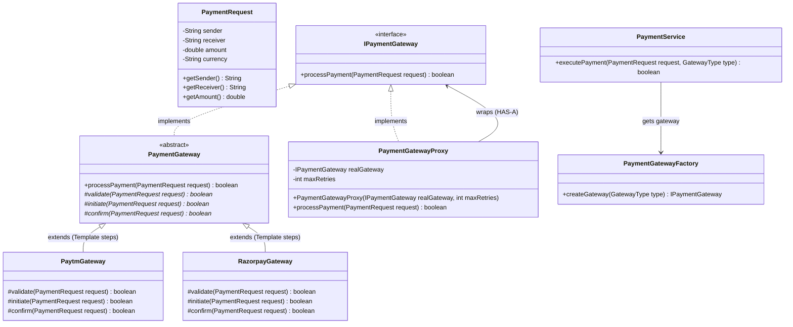

# 23. Build Payment Gateway System — LLD Case Study

> 💡 **Quick Revision Anchor**
> - **Domain:** Payment Processing Engine (Razorpay / Paytm / Stripe LLD)
> - **Key Architectural Patterns:**
>   - **Template Method Pattern:** Enforces an immutable payment execution lifecycle: `validate()` ➔ `initiate()` ➔ `confirm()`.
>   - **Proxy Pattern:** Wraps payment gateways to add **Retry Logic** and **Audit Logging** without polluting core gateway classes.
>   - **Factory Pattern:** `PaymentGatewayFactory` instantiates concrete gateway implementations (`RazorpayGateway`, `PaytmGateway`).
>   - **Strategy / Polymorphism:** Interchangeable gateway execution decoupled from the caller.

---

## 1. Problem Statement & Requirements

Modern digital products must process payments across multiple third-party financial institutions and aggregators (e.g., Razorpay, Paytm, Stripe, Bank APIs).

### Functional Requirements:
1. **Process Transactions:** Accept a `PaymentRequest` containing sender, receiver, amount, and currency, and return a transaction status.
2. **Support Multiple Gateways:** Allow seamless routing to different payment providers (Paytm, Razorpay).
3. **Structured Execution Lifecycle:** Every gateway must execute steps in an exact sequence:
   - Step 1: **Validate** account status and balance constraints.
   - Step 2: **Initiate** the external banking API call.
   - Step 3: **Confirm** settlement and finalize transaction state.
4. **Resilience & Fault Tolerance:** Banking networks encounter intermittent network timeouts. The system must automatically retry failed attempts before declaring failure.
5. **Audit Logging:** Maintain transparent records of each transaction attempt.

---

## 2. Design Evolution & Architecture

### What is a "Gateway" in Low-Level Design?
In High-Level Design (HLD), an "API Gateway" is an infrastructure reverse-proxy (like Kong or AWS API Gateway). 
In **Low-Level Design (LLD)**, a **Gateway** is a boundary abstraction layer. It separates our application domain logic from the untrusted external world (HTTP calls, bank mainframes, third-party SDKs).

```
   [Application Domain]                     [Gateway Layer]               [External World]
┌─────────────────────────┐             ┌─────────────────────┐         ┌──────────────────┐
│     PaymentService      │ ──────────▶ │   IPaymentGateway   │ ──────▶ │   Bank Servers   │
│ (Core Business Rules)   │             │  (Template + Proxy) │  HTTP   │ (Paytm/Razorpay) │
└─────────────────────────┘             └─────────────────────┘         └──────────────────┘
```

### Pattern Synergy:
1. **Template Method (`PaymentGateway`):** Fixes the standard order: `validate()` ➔ `initiate()` ➔ `confirm()`. Concrete gateways override provider-specific communication logic.
2. **Proxy Pattern (`PaymentGatewayProxy`):** Controls access to the real gateway. Implements the **Retry Loop** and **Audit Logging** so that individual gateways remain clean and focused solely on banking communication (SRP).
3. **Factory (`PaymentGatewayFactory`):** Encapsulates runtime gateway instantiation.

---

## 3. Architecture & Class Diagram



---

## 4. Java Implementation

### Step 1: Payment Request Model & Enums
```java
public class PaymentRequest {
    private final String sender;
    private final String receiver;
    private final double amount;
    private final String currency;

    public PaymentRequest(String sender, String receiver, double amount, String currency) {
        this.sender = sender;
        this.receiver = receiver;
        this.amount = amount;
        this.currency = currency;
    }

    public String getSender() { return sender; }
    public String getReceiver() { return receiver; }
    public double getAmount() { return amount; }
    public String getCurrency() { return currency; }

    @Override
    public String toString() {
        return "[" + sender + " -> " + receiver + " : " + amount + " " + currency + "]";
    }
}

public enum GatewayType {
    PAYTM, RAZORPAY
}
```

---

### Step 2: Base Gateway Interface & Template Method
```java
public interface IPaymentGateway {
    boolean processPayment(PaymentRequest request);
}

// Abstract Template Method implementation
public abstract class PaymentGateway implements IPaymentGateway {

    // The Template Method: enforces the three-step lifecycle
    @Override
    public final boolean processPayment(PaymentRequest request) {
        if (!validate(request)) {
            System.out.println("  ❌ Validation failed for " + request);
            return false;
        }
        if (!initiate(request)) {
            System.out.println("  ❌ Banking network initiation failed for " + request);
            return false;
        }
        if (!confirm(request)) {
            System.out.println("  ❌ Settlement confirmation failed for " + request);
            return false;
        }
        System.out.println("  ✅ Payment settled successfully!");
        return true;
    }

    protected abstract boolean validate(PaymentRequest request);
    protected abstract boolean initiate(PaymentRequest request);
    protected abstract boolean confirm(PaymentRequest request);
}
```

---

### Step 3: Concrete Gateways (Paytm & Razorpay)
```java
import java.util.Random;

public class PaytmGateway extends PaymentGateway {
    private final Random random = new Random();

    @Override
    protected boolean validate(PaymentRequest request) {
        System.out.println("  [Paytm] Validating Paytm wallet & UPI ID for " + request.getSender());
        return request.getAmount() > 0;
    }

    @Override
    protected boolean initiate(PaymentRequest request) {
        System.out.println("  [Paytm] Calling Paytm Bank Core Switch...");
        // Simulate occasional network flakiness (70% success rate)
        return random.nextInt(10) >= 3;
    }

    @Override
    protected boolean confirm(PaymentRequest request) {
        System.out.println("  [Paytm] Ledger transaction confirmed on Paytm network.");
        return true;
    }
}

public class RazorpayGateway extends PaymentGateway {
    private final Random random = new Random();

    @Override
    protected boolean validate(PaymentRequest request) {
        System.out.println("  [Razorpay] Checking 3DSecure tokens & merchant credentials.");
        return request.getAmount() > 0;
    }

    @Override
    protected boolean initiate(PaymentRequest request) {
        System.out.println("  [Razorpay] Dispatching payment token to Visa/Mastercard network...");
        // 80% success rate
        return random.nextInt(10) >= 2;
    }

    @Override
    protected boolean confirm(PaymentRequest request) {
        System.out.println("  [Razorpay] Webhook received: Payment captured.");
        return true;
    }
}
```

---

### Step 4: Resilience Proxy (Retry & Audit Logging)
```java
// Proxy Pattern: adds automatic retry loops and logging around any gateway
public class PaymentGatewayProxy implements IPaymentGateway {
    private final IPaymentGateway realGateway;
    private final int maxRetries;

    public PaymentGatewayProxy(IPaymentGateway realGateway, int maxRetries) {
        this.realGateway = realGateway;
        this.maxRetries = maxRetries;
    }

    @Override
    public boolean processPayment(PaymentRequest request) {
        System.out.println("\n[Audit Proxy] Initiating transaction attempt for: " + request);

        int attempts = 0;
        while (attempts < maxRetries) {
            attempts++;
            System.out.println("[Audit Proxy] Attempt #" + attempts + " out of " + maxRetries + "...");
            
            boolean success = realGateway.processPayment(request);
            if (success) {
                System.out.println("[Audit Proxy] Transaction succeeded on attempt #" + attempts);
                return true;
            }

            System.out.println("[Audit Proxy] Attempt #" + attempts + " failed.");
            if (attempts < maxRetries) {
                try {
                    // Short backoff delay
                    Thread.sleep(500);
                } catch (InterruptedException ignored) {}
            }
        }

        System.out.println("❌ [Audit Proxy] All " + maxRetries + " attempts exhausted. Transaction Marked FAILED.");
        return false;
    }
}
```

---

### Step 5: Gateway Factory
```java
public class PaymentGatewayFactory {
    public static IPaymentGateway createGateway(GatewayType type) {
        IPaymentGateway rawGateway = switch (type) {
            case PAYTM -> new PaytmGateway();
            case RAZORPAY -> new RazorpayGateway();
        };

        // Automatically wrap in resilience proxy (Max 3 retries)
        return new PaymentGatewayProxy(rawGateway, 3);
    }
}
```

---

### Step 6: Orchestrator Service & Client Demonstration
```java
public class PaymentService {
    public boolean executePayment(PaymentRequest request, GatewayType gatewayType) {
        IPaymentGateway gateway = PaymentGatewayFactory.createGateway(gatewayType);
        return gateway.processPayment(request);
    }
}

public class Main {
    public static void main(String[] args) {
        PaymentService paymentService = new PaymentService();

        PaymentRequest request1 = new PaymentRequest("Aditya", "Shubham", 1000.0, "INR");

        // 1. Process via Paytm
        System.out.println("=== Processing Transaction via Paytm ===");
        paymentService.executePayment(request1, GatewayType.PAYTM);

        // 2. Process via Razorpay
        System.out.println("\n=== Processing Transaction via Razorpay ===");
        paymentService.executePayment(request1, GatewayType.RAZORPAY);
    }
}
```

---

## 5. Homework & Real-World Extensions: Retry Strategies

### Linear Retry vs. Exponential Backoff
In the lecture, the instructor assigns an extension: moving from basic linear retries to **Exponential Backoff**:
- **Linear Retry:** Waits a fixed duration between attempts ($500\text{ms}, 500\text{ms}, 500\text{ms}$). If downstream bank servers are experiencing high traffic, continuing to hammer them at fixed intervals worsens congestion (the "Thundering Herd" problem).
- **Exponential Backoff:** Doubles the delay after every failed attempt ($1\text{s}, 2\text{s}, 4\text{s}, 8\text{s} \dots$) and adds random jitter (e.g. $\pm 200\text{ms}$). This gives banking databases time to recover from temporary outages.

---

## 6. Design Patterns Summary

| Pattern | Component | Responsibility |
| :--- | :--- | :--- |
| **Template Method** | `PaymentGateway` | Fixes the immutable validation ➔ initiation ➔ confirmation sequence. |
| **Proxy Pattern** | `PaymentGatewayProxy` | Intercepts requests to inject resilience (Retries) and telemetry (Audit logs) without altering core gateways. |
| **Factory Pattern** | `PaymentGatewayFactory` | Centralizes object creation and wire-up of proxies and concrete gateways. |
| **Strategy Pattern** | `IPaymentGateway` | Lets the client treat all payment processors polymorphically. |

---

## 7. Interview Perspective

- **Q: Why use a Proxy for Retries instead of embedding the `while` loop inside the gateway?**
  *A: Adheres strictly to the **Single Responsibility Principle (SRP)**. `RazorpayGateway` should only care about talking to Razorpay's API. Resilience policies (retries, timeouts, circuit breakers) belong in a separate layer that can be applied uniformly to any gateway.*
- **Q: How does Template Method prevent skipped validations in payment processing?**
  *A: By declaring `processPayment()` as `final` in the abstract class, subclasses cannot bypass the `validate()` check or flip the execution order.*
- **Q: How would you handle idempotency in real-world payment gateways?**
  *A: Pass a unique `Idempotency-Key` (UUID) with each `PaymentRequest`. If a retry occurs after a network timeout where the bank actually deducted funds, the bank recognizes the key and returns the existing result instead of debiting twice.*
