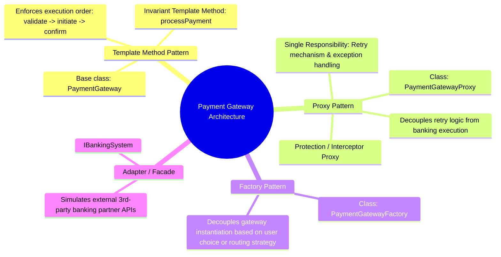
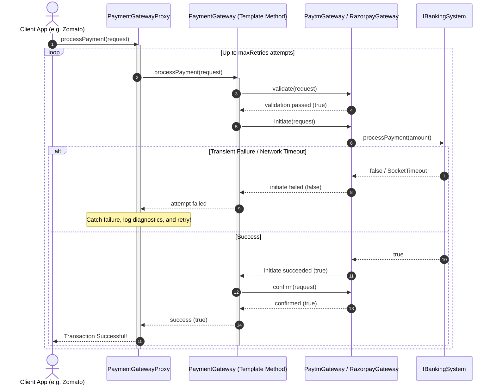
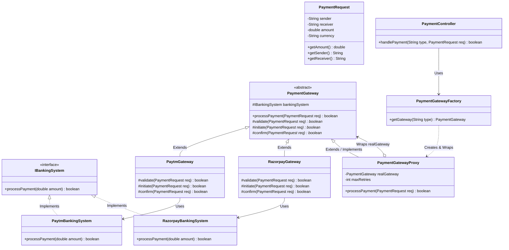
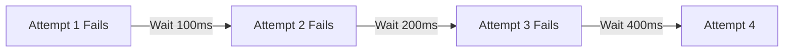

# 23. Build Payment Gateway System LLD

> 💡 **Quick Revision Anchor**: A mission-critical financial system LLD that seamlessly coordinates three GoF patterns: **Template Method Pattern** (enforcing the invariant sequence: *Validate $\to$ Initiate $\to$ Confirm* across different banking partners), **Proxy Pattern** (`PaymentGatewayProxy` intercepting calls to handle *fault-tolerant Retries, Error Logging, and Circuit Breaking*), and **Factory Pattern** (dynamically provisioning *Paytm*, *Razorpay*, or *Stripe* pipelines).

---

## 1. Problem Statement & Functional Requirements

The goal is to design a plug-and-play **Payment Gateway Routing Engine** that any client application (e.g., Zomato, Swiggy, Amazon) can integrate as a single entry point to process payments safely across diverse third-party financial providers.

```mermaid
flowchart LR
    ClientApp([Client App<br/>Zomato / Amazon]) -->|PaymentRequest| Controller["PaymentController / Engine"]
    Controller --> Factory["PaymentGatewayFactory"]
    Factory --> Proxy["PaymentGatewayProxy<br/>(Retry & Logging Proxy)"]
    Proxy --> Template["PaymentGateway<br/>(Template Method)"]
    Template --> RealGW["PaytmGateway / RazorpayGateway"]
    RealGW --> Banking["IBankingSystem<br/>(Paytm / Razorpay Banking Backend)"]

    style ClientApp fill:#e1f5fe,stroke:#0288d1,stroke-width:2px
    style Proxy fill:#fff3e0,stroke:#f57c00,stroke-width:2px
    style Template fill:#e8f8f5,stroke:#26a69a,stroke-width:2px
    style RealGW fill:#f3e5f5,stroke:#8e24aa,stroke-width:2px
```



### Functional Requirements (Taught in Lecture):
1. **Multi-Provider Support**: Pluggable integration with multiple aggregators/gateways (e.g., Paytm, Razorpay, Google Pay, Stripe).
2. **Open-Closed Extensibility (OCP)**: New gateways must be seamlessly added in the future without modifying core business orchestration.
3. **Standard Invariant Payment Lifecycle**: Regardless of which third-party provider processes the transaction, every payment must strictly execute three ordered phases:
   $$\text{Validate} \longrightarrow \text{Initiate} \longrightarrow \text{Confirm}$$
4. **Resilience & Automatic Retry Mechanism**: Financial network calls and banking APIs are inherently prone to transient timeouts or temporary drops. The system must automatically retry failed transactions up to a configurable threshold before declaring failure.
5. **Error Logging & Audit Trails**: Comprehensive diagnostics on failed attempts with clear reason codes.

### Non-Functional Requirements:
- **Plug-and-Play Single Entry Point**: A simplified client-facing API that completely hides internal networking, banking APIs, and retry loops.
- **High Availability & Fault Tolerance**: Isolated failure boundaries so that an outage in one provider (e.g., Paytm) does not compromise other gateways (e.g., Razorpay).

---

## 2. Architectural Design Patterns Overview

The lecture masterfully coordinates three core design patterns to solve this problem cleanly:



---

## 3. The 3-Phase Invariant Lifecycle (Template Method)

Why is the Template Method essential here?
- If every gateway subclass were free to define its own flow, one developer might forget validation, while another might trigger confirmation before initiation completes.
- In `PaymentGateway`, `processPayment(PaymentRequest request)` is declared `final`:
  ```java
  public final boolean processPayment(PaymentRequest request) {
      if (!validate(request)) return false;
      if (!initiate(request)) return false;
      return confirm(request);
  }
  ```
- Subclasses (`PaytmGateway`, `RazorpayGateway`) implement `validate()`, `initiate()`, and `confirm()`, but **cannot alter the execution order**.



---

## 4. Class Diagram & System Architecture



---

## 5. Complete, Compilable Java Implementation

Below is the complete, self-contained Java implementation faithfully capturing the lecture's architecture and design patterns.

```java
package com.designpatterns.casestudy.paymentgateway;

import java.util.Random;

// ============================================================================
// 1. DOMAIN MODELS
// ============================================================================

class PaymentRequest {
    private final String sender;
    private final String receiver;
    private final double amount;
    private final String currency;

    public PaymentRequest(String sender, String receiver, double amount, String currency) {
        this.sender = sender;
        this.receiver = receiver;
        this.amount = amount;
        this.currency = currency;
    }

    public String getSender() { return sender; }
    public String getReceiver() { return receiver; }
    public double getAmount() { return amount; }
    public String getCurrency() { return currency; }

    @Override
    public String toString() {
        return "PaymentRequest[" + sender + " -> " + receiver + ", " + currency + " " + amount + "]";
    }
}

// ============================================================================
// 2. EXTERNAL BANKING SYSTEMS (3RD-PARTY AGGREGATORS / ADAPTER TARGETS)
// ============================================================================

interface IBankingSystem {
    boolean processPayment(double amount);
}

class PaytmBankingSystem implements IBankingSystem {
    private final Random random = new Random();

    @Override
    public boolean processPayment(double amount) {
        System.out.println("    [Paytm Banking Engine] Calling Paytm UPI core servers for ₹" + amount + "...");
        // Simulate real-world 70% success rate / transient network glitch
        boolean success = random.nextInt(100) < 70;
        if (!success) {
            System.err.println("    [Paytm Banking Engine] Transient Network Timeout from NPCI Switch!");
        }
        return success;
    }
}

class RazorpayBankingSystem implements IBankingSystem {
    private final Random random = new Random();

    @Override
    public boolean processPayment(double amount) {
        System.out.println("    [Razorpay Banking Engine] Connecting to Razorpay Card/Netbanking network for ₹" + amount + "...");
        // Simulate 80% success rate
        boolean success = random.nextInt(100) < 80;
        if (!success) {
            System.err.println("    [Razorpay Banking Engine] Bank Gateway handshake dropped!");
        }
        return success;
    }
}

// ============================================================================
// 3. TEMPLATE METHOD PATTERN: BASE PAYMENT GATEWAY
// ============================================================================

abstract class PaymentGateway {
    protected IBankingSystem bankingSystem;

    public PaymentGateway(IBankingSystem bankingSystem) {
        this.bankingSystem = bankingSystem;
    }

    /**
     * The invariant Template Method: Enforces Validate -> Initiate -> Confirm.
     */
    public boolean processPayment(PaymentRequest request) {
        System.out.println("  [Step 1: Validation] Validating transaction parameters...");
        if (!validate(request)) {
            System.err.println("  [Validation Failed] Request validation rejected!");
            return false;
        }

        System.out.println("  [Step 2: Initiation] Initiating transfer with banking network...");
        if (!initiate(request)) {
            System.err.println("  [Initiation Failed] Banking provider could not process payment.");
            return false;
        }

        System.out.println("  [Step 3: Confirmation] Confirming transaction & settling ledger...");
        return confirm(request);
    }

    protected abstract boolean validate(PaymentRequest request);
    protected abstract boolean initiate(PaymentRequest request);
    protected abstract boolean confirm(PaymentRequest request);
}

// ============================================================================
// 4. CONCRETE GATEWAYS (PAYTM & RAZORPAY)
// ============================================================================

class PaytmGateway extends PaymentGateway {
    public PaytmGateway() {
        super(new PaytmBankingSystem());
    }

    @Override
    protected boolean validate(PaymentRequest request) {
        // Paytm validation: Positive amount, INR currency, sender phone/wallet registered
        return request.getAmount() > 0 && "INR".equalsIgnoreCase(request.getCurrency());
    }

    @Override
    protected boolean initiate(PaymentRequest request) {
        return bankingSystem.processPayment(request.getAmount());
    }

    @Override
    protected boolean confirm(PaymentRequest request) {
        System.out.println("  [Paytm] SMS notification sent to sender " + request.getSender() 
                           + " and receiver " + request.getReceiver());
        return true;
    }
}

class RazorpayGateway extends PaymentGateway {
    public RazorpayGateway() {
        super(new RazorpayBankingSystem());
    }

    @Override
    protected boolean validate(PaymentRequest request) {
        // Razorpay validation: Supports multi-currency, limit check
        return request.getAmount() > 0 && request.getAmount() <= 500000;
    }

    @Override
    protected boolean initiate(PaymentRequest request) {
        return bankingSystem.processPayment(request.getAmount());
    }

    @Override
    protected boolean confirm(PaymentRequest request) {
        System.out.println("  [Razorpay] Webhook triggered. Captured funds & updated merchant audit logs.");
        return true;
    }
}

// ============================================================================
// 5. PROXY PATTERN: RETRY MECHANISM & FAULT TOLERANCE PROXY
// ============================================================================

class PaymentGatewayProxy extends PaymentGateway {
    private final PaymentGateway realGateway;
    private final int maxRetries;

    public PaymentGatewayProxy(PaymentGateway realGateway, int maxRetries) {
        super(null); // The proxy delegates to realGateway; no direct banking system needed
        this.realGateway = realGateway;
        this.maxRetries = maxRetries;
    }

    @Override
    public boolean processPayment(PaymentRequest request) {
        System.out.println("\n[PaymentGatewayProxy] Intercepting request for: " + request);
        int attempts = 0;

        while (attempts < maxRetries) {
            attempts++;
            System.out.println("[PaymentGatewayProxy] Executing attempt " + attempts + " of " + maxRetries + "...");
            
            try {
                boolean success = realGateway.processPayment(request);
                if (success) {
                    System.out.println("[PaymentGatewayProxy] Transaction succeeded on attempt " + attempts + "!");
                    return true;
                }
            } catch (Exception e) {
                System.err.println("[PaymentGatewayProxy] Exception caught on attempt " + attempts + ": " + e.getMessage());
            }

            System.out.println("[PaymentGatewayProxy] Attempt " + attempts + " failed. Initiating retry...");
        }

        System.err.println("[PaymentGatewayProxy] All " + maxRetries + " retry attempts exhausted. Transaction DECLINED!");
        return false;
    }

    @Override protected boolean validate(PaymentRequest req) { return false; }
    @Override protected boolean initiate(PaymentRequest req) { return false; }
    @Override protected boolean confirm(PaymentRequest req) { return false; }
}

// ============================================================================
// 6. FACTORY PATTERN & CONTROLLER
// ============================================================================

enum GatewayType {
    PAYTM,
    RAZORPAY
}

class PaymentGatewayFactory {
    public static PaymentGateway getGateway(GatewayType type, int retryCount) {
        PaymentGateway realGateway;
        switch (type) {
            case PAYTM:
                realGateway = new PaytmGateway();
                break;
            case RAZORPAY:
                realGateway = new RazorpayGateway();
                break;
            default:
                throw new IllegalArgumentException("Unsupported Gateway Type: " + type);
        }

        // Always return the protected proxy wrapper
        return new PaymentGatewayProxy(realGateway, retryCount);
    }
}

class PaymentController {
    public boolean checkout(GatewayType preferredGateway, PaymentRequest request) {
        System.out.println("===============================================================");
        System.out.println(">>> CHECKOUT INITIATED via " + preferredGateway);
        System.out.println("===============================================================");
        PaymentGateway gateway = PaymentGatewayFactory.getGateway(preferredGateway, 3);
        boolean result = gateway.processPayment(request);
        System.out.println(">>> CHECKOUT RESULT: " + (result ? "SUCCESSFUL" : "FAILED"));
        return result;
    }
}

// ============================================================================
// 7. MAIN DEMONSTRATION DRIVER
// ============================================================================

public class PaymentGatewayDemo {
    public static void main(String[] args) {
        PaymentController controller = new PaymentController();

        PaymentRequest order1 = new PaymentRequest("Rohit (User_99)", "Zomato Restaurant Partner", 850.00, "INR");
        controller.checkout(GatewayType.PAYTM, order1);

        PaymentRequest order2 = new PaymentRequest("Aditya (User_42)", "Amazon Seller Hub", 4200.00, "INR");
        controller.checkout(GatewayType.RAZORPAY, order2);
    }
}
```

---

## 6. Advanced Lecture Extensions & Homework

In the concluding section of the video, the instructor tasks students with integrating two advanced real-world capabilities:

### Extension 1: Scalable Retry Mechanism (Exponential Backoff)
Instead of immediate linear retries, enterprise gateways implement **Exponential Backoff with Jitter** to prevent overwhelming recovering banking servers:
$$\text{Delay}(n) = \text{InitialDelay} \times 2^{n-1} + \text{random\_jitter}$$



### Extension 2: Recurring / Subscription Billing
For platforms like YouTube Premium, Netflix, or Spotify, transactions occur on a recurring schedule without interactive user PIN entry:
- Leverage the **Template Method Pattern**:
  - `validateSubscriptionMandate()`: Verifies pre-authorized e-mandate registration with the bank.
  - `initiateRecurringDebit()`: Dispatches standing instructions payload.
  - `confirmAndExtendSubscription()`: Updates the user's subscription renewal date.

---

## 7. Crucial Financial Interview Considerations

1. **Idempotency Keys**:
   - What happens if a network timeout occurs after money is deducted from the customer's bank account, but before the gateway receives the confirmation response?
   - **Remedy**: Every `PaymentRequest` must carry a unique `idempotencyKey` (UUID). The banking system caches responses for keys; if a retried request carries the same key, the bank returns the existing settled state rather than charging the card twice.
2. **Two-Phase Commit vs Webhook Settlement**:
   - Synchronous HTTP responses can time out. Real gateways mark transactions as `PENDING` and rely on asynchronous **Webhooks** from banking switches for eventual consistency.

---

## Quick Revision

### Core Idea
A plug-and-play financial routing engine coordinating **Template Method** (invariant lifecycle: Validate $\to$ Initiate $\to$ Confirm), **Proxy** (transparent retry mechanism and error handling), and **Factory** (vendor abstraction).

### Remember
- **Template Method**: `PaymentGateway.processPayment()` defines the invariant 3-step sequence; child gateways implement vendor-specific logic.
- **Proxy**: `PaymentGatewayProxy` wraps concrete gateways to run the retry loop and exception trapping, adhering to SRP.
- **Factory**: `PaymentGatewayFactory` instantiates the appropriate gateway and returns it pre-wrapped in the proxy.

### Java Implementation Idea
```java
abstract class PaymentGateway {
    public final boolean processPayment(Request req) {
        return validate(req) && initiate(req) && confirm(req);
    }
    protected abstract boolean validate(Request req);
    protected abstract boolean initiate(Request req);
    protected abstract boolean confirm(Request req);
}
```

### Most Important Interview Point
**Why decouple the Retry Logic into a Proxy instead of placing it inside the Template Method?**
To strictly follow the **Single Responsibility Principle (SRP)**. The gateway subclass or template method is solely responsible for executing the banking transaction lifecycle. Managing retry attempts, backoff intervals, and fault recovery is an orthogonal concern handled cleanly by the `PaymentGatewayProxy`.

### Common Trap
Retrying financial transactions without **Idempotency Keys**. Blindly executing a retry loop on timeout errors can double-charge customers if the initial debit succeeded but only the return acknowledgment packet was dropped.
