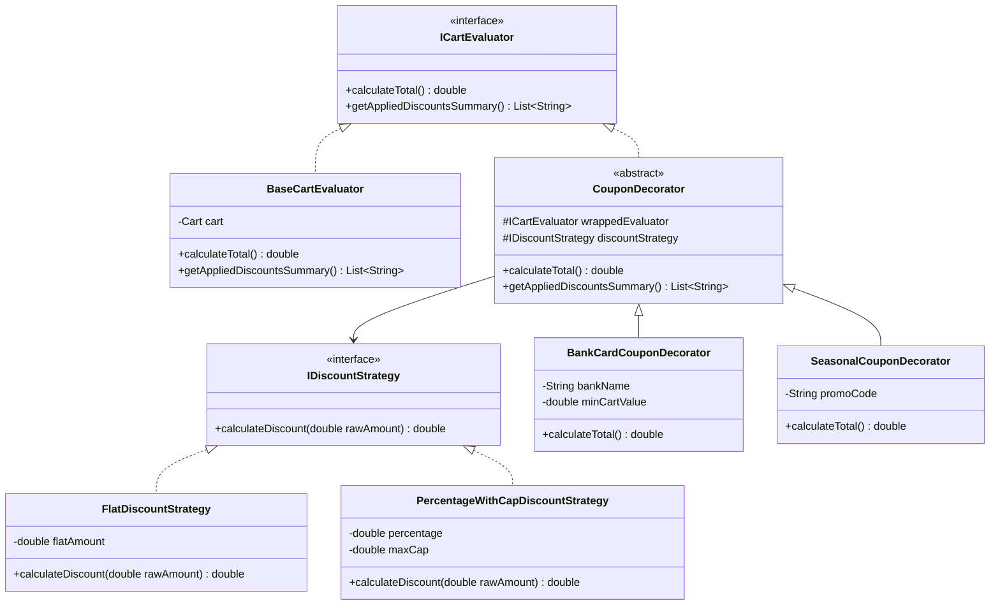

# 24. Build Discount Coupon Engine LLD

> 💡 **Quick Revision Anchor**: An enterprise e-commerce promotion engine combining the **Strategy Pattern** (dynamic computation algorithms: Flat, Percentage, Capped) and the **Decorator Pattern** (stacking multiple independent coupons such as Banking, Seasonal, and Loyalty offers onto a cart).

---

## 1. Problem Statement & Requirements

Design an extensible Discount & Coupon Evaluation Engine for e-commerce platforms (like Zepto, Swiggy, Amazon) that supports dynamic discount calculations and coupon stacking rules.

### Functional Requirements:
1. **Diverse Discount Algorithms**:
   - **Flat Discount**: e.g., Flat ₹100 off.
   - **Percentage Discount**: e.g., 20% off entire order.
   - **Percentage with Cap**: e.g., 50% off up to a maximum of ₹120.
2. **Multi-level Application**:
   - **Cart-Level Coupons**: Applies to the aggregate cart total.
   - **Product / Category Coupons**: Applies only to specific product categories (e.g., Electronics, Groceries).
3. **Coupon Stacking (Decorator Pattern)**:
   - Allow chaining multiple valid promotions (e.g., a *Seasonal Sale 10%* + *HDFC Bank Card 5%* + *Loyalty Member Free Delivery*).
   - Enforce stacking restrictions (some coupons cannot be combined with others).
4. **Validation Rules**:
   - Minimum cart value threshold (e.g., valid only on orders above ₹499).
   - User loyalty status verification.

---

## 2. Architecture & Design Patterns Map

```mermaid
graph TD
    Client[Cart / Checkout Service] --> Cart[Cart]
    
    subgraph "Strategy Pattern (Discount Calculation)"
        Strat[IDiscountStrategy]
        Strat --> Flat[FlatDiscountStrategy]
        Strat --> Perc[PercentageDiscountStrategy]
        Strat --> Cap[PercentageWithCapDiscountStrategy]
    end

    subgraph "Decorator Pattern (Coupon Stacking)"
        BaseComp[ICartPriceEvaluator]
        BaseComp --> CoreCart[BaseCartEvaluator]
        BaseComp --> CouponDec[CouponDecorator]
        CouponDec --> Bank[BankCardCouponDecorator]
        CouponDec --> Seasonal[SeasonalCouponDecorator]
        CouponDec --> Loyalty[LoyaltyCouponDecorator]
    end

    CouponDec --> Strat : Uses Strategy to Compute Discount
```

---

## 3. Class Diagram



---

## 4. Production Java Implementation

### Step 1: Strategy Pattern (Discount Algorithms)
```java
public interface IDiscountStrategy {
    double calculateDiscount(double currentAmount);
}

// Flat ₹X discount
public class FlatDiscountStrategy implements IDiscountStrategy {
    private final double flatAmount;

    public FlatDiscountStrategy(double flatAmount) {
        this.flatAmount = flatAmount;
    }

    @Override
    public double calculateDiscount(double currentAmount) {
        return Math.min(flatAmount, currentAmount); // Do not let total drop below zero
    }
}

// Percentage discount with an upper cap (e.g., 50% off up to ₹120)
public class PercentageWithCapDiscountStrategy implements IDiscountStrategy {
    private final double percentage;
    private final double maxCap;

    public PercentageWithCapDiscountStrategy(double percentage, double maxCap) {
        this.percentage = percentage;
        this.maxCap = maxCap;
    }

    @Override
    public double calculateDiscount(double currentAmount) {
        double rawDiscount = currentAmount * (percentage / 100.0);
        return Math.min(rawDiscount, maxCap);
    }
}
```

### Step 2: Domain Models (Product & Cart)
```java
import java.util.*;

public class Product {
    private final String id;
    private final String name;
    private final double price;
    private final String category;

    public Product(String id, String name, double price, String category) {
        this.id = id;
        this.name = name;
        this.price = price;
        this.category = category;
    }

    public double getPrice() { return price; }
    public String getName() { return name; }
}

public class CartItem {
    private final Product product;
    private final int quantity;

    public CartItem(Product product, int quantity) {
        this.product = product;
        this.quantity = quantity;
    }

    public double getSubtotal() {
        return product.getPrice() * quantity;
    }
}

public class Cart {
    private final List<CartItem> items = new ArrayList<>();
    private final boolean isLoyaltyUser;

    public Cart(boolean isLoyaltyUser) {
        this.isLoyaltyUser = isLoyaltyUser;
    }

    public void addItem(Product product, int quantity) {
        items.add(new CartItem(product, quantity));
    }

    public double getRawTotal() {
        return items.stream().mapToDouble(CartItem::getSubtotal).sum();
    }

    public boolean isLoyaltyUser() { return isLoyaltyUser; }
}
```

### Step 3: Decorator Pattern (Stacking Coupons)
```java
// Component Interface
public interface ICartEvaluator {
    double calculateTotal();
    List<String> getAppliedDiscountsSummary();
}

// Concrete Base Component
public class BaseCartEvaluator implements ICartEvaluator {
    private final Cart cart;

    public BaseCartEvaluator(Cart cart) {
        this.cart = cart;
    }

    @Override
    public double calculateTotal() {
        return cart.getRawTotal();
    }

    @Override
    public List<String> getAppliedDiscountsSummary() {
        List<String> summary = new ArrayList<>();
        summary.add("Base Cart Items Total: ₹" + cart.getRawTotal());
        return summary;
    }
}

// Base Coupon Decorator
public abstract class CouponDecorator implements ICartEvaluator {
    protected final ICartEvaluator wrapped;
    protected final IDiscountStrategy discountStrategy;
    protected final String couponCode;

    public CouponDecorator(ICartEvaluator wrapped, IDiscountStrategy discountStrategy, String couponCode) {
        this.wrapped = wrapped;
        this.discountStrategy = discountStrategy;
        this.couponCode = couponCode;
    }
}

// Concrete Decorator 1: Seasonal / Festive Coupon
public class SeasonalCouponDecorator extends CouponDecorator {
    public SeasonalCouponDecorator(ICartEvaluator wrapped, IDiscountStrategy discountStrategy, String code) {
        super(wrapped, discountStrategy, code);
    }

    @Override
    public double calculateTotal() {
        double currentTotal = wrapped.calculateTotal();
        double discount = discountStrategy.calculateDiscount(currentTotal);
        return Math.max(0.0, currentTotal - discount);
    }

    @Override
    public List<String> getAppliedDiscountsSummary() {
        List<String> summary = wrapped.getAppliedDiscountsSummary();
        double currentTotal = wrapped.calculateTotal();
        double discount = discountStrategy.calculateDiscount(currentTotal);
        summary.add("Applied [" + couponCode + "] Promo: -₹" + discount);
        return summary;
    }
}

// Concrete Decorator 2: Bank Card Offer (Requires min cart threshold)
public class BankCardCouponDecorator extends CouponDecorator {
    private final double minThreshold;
    private final String bankName;

    public BankCardCouponDecorator(ICartEvaluator wrapped, IDiscountStrategy strategy, String bankName, double minThreshold) {
        super(wrapped, strategy, bankName + "_CARD_OFFER");
        this.bankName = bankName;
        this.minThreshold = minThreshold;
    }

    @Override
    public double calculateTotal() {
        double currentTotal = wrapped.calculateTotal();
        if (currentTotal >= minThreshold) {
            double discount = discountStrategy.calculateDiscount(currentTotal);
            return Math.max(0.0, currentTotal - discount);
        }
        return currentTotal; // Condition not met: no discount applied
    }

    @Override
    public List<String> getAppliedDiscountsSummary() {
        List<String> summary = wrapped.getAppliedDiscountsSummary();
        double currentTotal = wrapped.calculateTotal();
        if (currentTotal >= minThreshold) {
            double discount = discountStrategy.calculateDiscount(currentTotal);
            summary.add("Applied " + bankName + " Instant Discount: -₹" + discount);
        } else {
            summary.add("Skipped " + bankName + " Offer (Min cart value ₹" + minThreshold + " required)");
        }
        return summary;
    }
}
```

### Step 4: Client Driver & Verification
```java
public class Main {
    public static void main(String[] args) {
        // 1. Build a Shopping Cart
        Cart cart = new Cart(true);
        cart.addItem(new Product("P1", "Wireless Earbuds", 1499.0, "Electronics"), 1);
        cart.addItem(new Product("P2", "Cold Brew Coffee", 250.0, "Beverages"), 2); // 500.0
        // Raw Total = 1499 + 500 = ₹1999.0

        // 2. Base Evaluator
        ICartEvaluator evaluator = new BaseCartEvaluator(cart);

        // 3. Stack Seasonal Offer: 10% off up to ₹100 (Capped Strategy)
        evaluator = new SeasonalCouponDecorator(
            evaluator,
            new PercentageWithCapDiscountStrategy(10.0, 100.0),
            "FESTIVE10"
        );

        // 4. Stack Bank Card Offer: Flat ₹150 off on orders >= ₹1000
        evaluator = new BankCardCouponDecorator(
            evaluator,
            new FlatDiscountStrategy(150.0),
            "HDFC_CREDIT",
            1000.0
        );

        // 5. Compute and Print Final Summary
        System.out.println("=== FINAL ORDER BILLING BREAKDOWN ===");
        for (String line : evaluator.getAppliedDiscountsSummary()) {
            System.out.println(" • " + line);
        }
        System.out.println("-------------------------------------");
        System.out.println(" Final Payable Amount: ₹" + evaluator.calculateTotal());
    }
}
```

---

## 5. Execution Output

```text
=== FINAL ORDER BILLING BREAKDOWN ===
 • Base Cart Items Total: ₹1999.0
 • Applied [FESTIVE10] Promo: -₹100.0
 • Applied HDFC_CREDIT Instant Discount: -₹150.0
-------------------------------------
 Final Payable Amount: ₹1749.0
```

---

## 6. Interview Best Practices & Edge Cases

1. **Order of Stacking**:
   - Applying a **Percentage Discount** before a **Flat Discount** yields a different final price than applying Flat first.
   - *Best Practice*: Enterprise engines sort applicable coupons by precedence rules (e.g., Brand/Seller specific first, Cart-wide percentage second, Bank payment discount last).
2. **Floor at Zero**:
   - Discount calculations must never produce a negative total (`Math.max(0.0, price - discount)`).
3. **Mutual Exclusivity**:
   - In real-world systems, non-stackable coupons use a validation guard (`if (!coupon.isStackable()) throw new IncompatibleCouponException()`).
