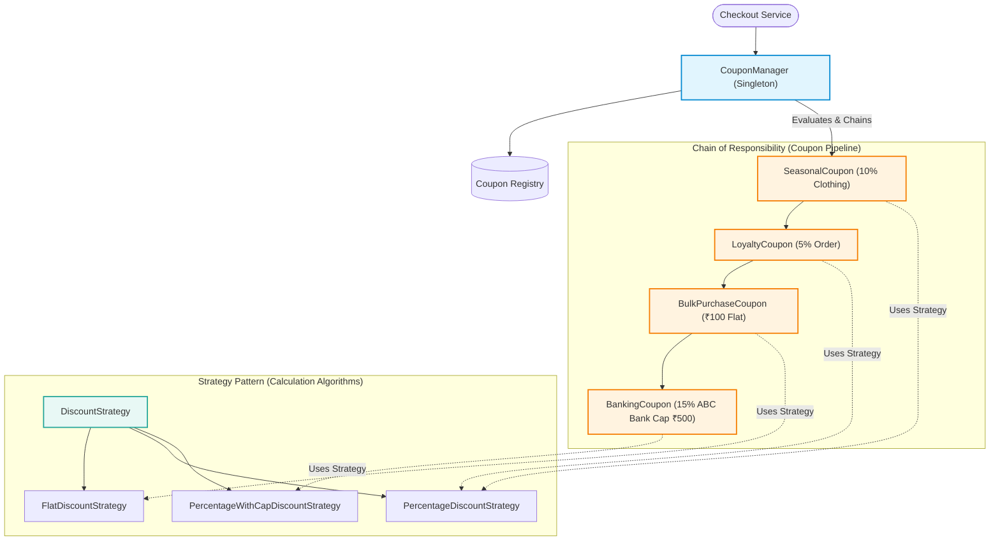
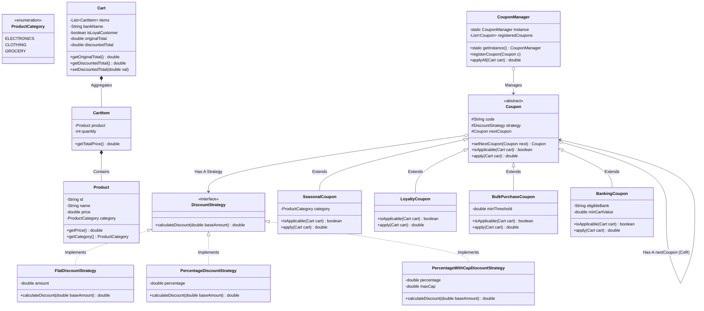

# 24. Build Discount Coupon Engine LLD

> 💡 **Quick Revision Anchor**: A comprehensive e-commerce promotional pricing engine combining three GoF design patterns: **Strategy Pattern** (interchangeable discount calculation algorithms: *Flat*, *Percentage*, *Percentage with Cap*), **Chain of Responsibility Pattern** (sequential chaining and stacking of multiple coupons: *Seasonal*, *Loyalty*, *Bulk Purchase*, *Banking Card*), and **Singleton Pattern** (`CouponManager` as the central thread-safe registry and evaluation orchestrator).

---

## 1. Problem Statement & Business Requirements

Modern e-commerce and quick-commerce platforms (e.g., Zepto, Blinkit, Swiggy, Zomato, Amazon) allow customers to apply promotional discount codes during checkout. Building an enterprise-grade coupon engine requires solving several complex architectural challenges:

### Functional Requirements:
1. **Multi-level Discount Scope**:
   - **Cart-Level Discounts**: Applied across the entire aggregate cart order (e.g., Flat ₹100 off on orders $> ₹1,000$).
   - **Product / Category-Level Discounts**: Applied only to eligible item categories (e.g., 10% off on Clothing items).
2. **Pluggable Discount Computation Strategies (Strategy Pattern)**:
   - **Flat Discount**: Deducts a fixed currency amount (e.g., ₹100 off).
   - **Percentage Discount**: Deducts a percentage of eligible value (e.g., 10% off).
   - **Percentage with Maximum Cap**: Deducts a percentage up to a maximum monetary threshold (e.g., 15% off up to ₹500 max discount).
3. **Coupon Stacking & Applicability (Chain of Responsibility Pattern)**:
   - Customers may be entitled to multiple simultaneous offers (e.g., a *Seasonal Category Offer* + a *Customer Loyalty Offer* + a *Bulk Purchase Offer* + an *ABC Bank Card Offer*).
   - The engine must sequentially evaluate applicability criteria (minimum cart value, eligible bank, active loyalty tier) and chain the discounts cleanly.
4. **Centralized Promotion Management (Singleton Pattern)**:
   - A single `CouponManager` registers promotions, filters applicable coupons for a given cart, and executes the discount application pipeline.

---

## 2. Core Architectural Design Patterns



---

## 3. Mathematical Evaluation Model

Let the shopping cart contain $N$ items. The original cart value is:
$$\text{Original Total} = \sum_{i=1}^{N} (\text{item}_i.\text{price} \times \text{item}_i.\text{quantity})$$

When coupons $C_1, C_2, \dots, C_k$ are chained:
1. **Eligible Base Amount**: Each coupon inspects whether it applies to specific categories (e.g. `CLOTHING`) or the running total.
2. **Discount Computation**:
   $$\text{Discount}_{\text{Flat}} = D$$
   $$\text{Discount}_{\text{Percentage}} = \text{Base} \times \left(\frac{P}{100}\right)$$
   $$\text{Discount}_{\text{Capped}} = \min\left(\text{Base} \times \left(\frac{P}{100}\right), \text{MaxCap}\right)$$
3. **Sequential Settling**:
   $$\text{Final Cart Total} = \max\left(0, \text{Original Total} - \sum_{j=1}^{k} \text{Discount}(C_j)\right)$$

---

## 4. Class Diagram & System Architecture



---

## 5. Complete, Compilable Java Implementation

Below is the complete, production-grade Java code directly matching the lecture's implementation and execution flow.

```java
package com.designpatterns.casestudy.coupon;

import java.util.ArrayList;
import java.util.List;

// ============================================================================
// 1. DOMAIN MODELS: PRODUCT, CATEGORY, CART
// ============================================================================

enum ProductCategory {
    ELECTRONICS,
    CLOTHING,
    GROCERY
}

class Product {
    private final String id;
    private final String name;
    private final double price;
    private final ProductCategory category;

    public Product(String id, String name, double price, ProductCategory category) {
        this.id = id;
        this.name = name;
        this.price = price;
        this.category = category;
    }

    public String getName() { return name; }
    public double getPrice() { return price; }
    public ProductCategory getCategory() { return category; }
}

class CartItem {
    private final Product product;
    private final int quantity;

    public CartItem(Product product, int quantity) {
        this.product = product;
        this.quantity = quantity;
    }

    public Product getProduct() { return product; }
    public int getQuantity() { return quantity; }
    public double getTotalPrice() { return product.getPrice() * quantity; }
}

class Cart {
    private final List<CartItem> items = new ArrayList<>();
    private String bankName;
    private boolean isLoyalCustomer;
    private double originalTotal;
    private double discountedTotal;

    public void addItem(Product product, int quantity) {
        items.add(new CartItem(product, quantity));
        recalculateTotals();
    }

    private void recalculateTotals() {
        double sum = 0.0;
        for (CartItem item : items) {
            sum += item.getTotalPrice();
        }
        this.originalTotal = sum;
        this.discountedTotal = sum;
    }

    public List<CartItem> getItems() { return items; }
    public String getBankName() { return bankName; }
    public void setBankName(String bankName) { this.bankName = bankName; }
    public boolean isLoyalCustomer() { return isLoyalCustomer; }
    public void setLoyalCustomer(boolean loyal) { this.isLoyalCustomer = loyal; }
    public double getOriginalTotal() { return originalTotal; }
    public double getDiscountedTotal() { return discountedTotal; }
    public void setDiscountedTotal(double val) { this.discountedTotal = val; }
}

// ============================================================================
// 2. STRATEGY PATTERN: DISCOUNT CALCULATION ALGORITHMS
// ============================================================================

interface DiscountStrategy {
    double calculateDiscount(double baseAmount);
}

class FlatDiscountStrategy implements DiscountStrategy {
    private final double flatAmount;

    public FlatDiscountStrategy(double flatAmount) {
        this.flatAmount = flatAmount;
    }

    @Override
    public double calculateDiscount(double baseAmount) {
        return Math.min(flatAmount, baseAmount);
    }
}

class PercentageDiscountStrategy implements DiscountStrategy {
    private final double percentage;

    public PercentageDiscountStrategy(double percentage) {
        this.percentage = percentage;
    }

    @Override
    public double calculateDiscount(double baseAmount) {
        return baseAmount * (percentage / 100.0);
    }
}

class PercentageWithCapDiscountStrategy implements DiscountStrategy {
    private final double percentage;
    private final double maxCap;

    public PercentageWithCapDiscountStrategy(double percentage, double maxCap) {
        this.percentage = percentage;
        this.maxCap = maxCap;
    }

    @Override
    public double calculateDiscount(double baseAmount) {
        double rawDiscount = baseAmount * (percentage / 100.0);
        return Math.min(rawDiscount, maxCap);
    }
}

// ============================================================================
// 3. CHAIN OF RESPONSIBILITY PATTERN: COUPON HIERARCHY
// ============================================================================

abstract class Coupon {
    protected final String code;
    protected final String description;
    protected final DiscountStrategy strategy;
    protected Coupon nextCoupon;

    public Coupon(String code, String description, DiscountStrategy strategy) {
        this.code = code;
        this.description = description;
        this.strategy = strategy;
    }

    public Coupon setNextCoupon(Coupon nextCoupon) {
        this.nextCoupon = nextCoupon;
        return nextCoupon;
    }

    public String getCode() { return code; }
    public String getDescription() { return description; }

    public abstract boolean isApplicable(Cart cart);
    public abstract double calculateCouponDiscount(Cart cart);

    /**
     * Chained application method: Applies current coupon discount (if valid)
     * and forwards remaining cart balance down the chain.
     */
    public void applyChain(Cart cart) {
        if (isApplicable(cart)) {
            double discount = calculateCouponDiscount(cart);
            double newTotal = Math.max(0, cart.getDiscountedTotal() - discount);
            cart.setDiscountedTotal(newTotal);
            System.out.printf("  [Applied: %s] %s -> Discount: ₹%.2f | Running Cart: ₹%.2f\n", 
                              code, description, discount, newTotal);
        } else {
            System.out.println("  [Skipped: " + code + "] Criteria not met for current cart.");
        }

        if (nextCoupon != null) {
            nextCoupon.applyChain(cart);
        }
    }
}

// Concrete Coupon 1: Seasonal category-specific offer
class SeasonalCoupon extends Coupon {
    private final ProductCategory targetCategory;

    public SeasonalCoupon(String code, String desc, double percentage, ProductCategory category) {
        super(code, desc, new PercentageDiscountStrategy(percentage));
        this.targetCategory = category;
    }

    @Override
    public boolean isApplicable(Cart cart) {
        for (CartItem item : cart.getItems()) {
            if (item.getProduct().getCategory() == targetCategory) return true;
        }
        return false;
    }

    @Override
    public double calculateCouponDiscount(Cart cart) {
        double categoryTotal = 0.0;
        for (CartItem item : cart.getItems()) {
            if (item.getProduct().getCategory() == targetCategory) {
                categoryTotal += item.getTotalPrice();
            }
        }
        return strategy.calculateDiscount(categoryTotal);
    }
}

// Concrete Coupon 2: Loyalty offer for premium members
class LoyaltyCoupon extends Coupon {
    public LoyaltyCoupon(String code, String desc, double percentage) {
        super(code, desc, new PercentageDiscountStrategy(percentage));
    }

    @Override
    public boolean isApplicable(Cart cart) {
        return cart.isLoyalCustomer();
    }

    @Override
    public double calculateCouponDiscount(Cart cart) {
        return strategy.calculateDiscount(cart.getDiscountedTotal());
    }
}

// Concrete Coupon 3: Bulk purchase order threshold
class BulkPurchaseCoupon extends Coupon {
    private final double minOrderValue;

    public BulkPurchaseCoupon(String code, String desc, double flatOff, double minOrderValue) {
        super(code, desc, new FlatDiscountStrategy(flatOff));
        this.minOrderValue = minOrderValue;
    }

    @Override
    public boolean isApplicable(Cart cart) {
        return cart.getOriginalTotal() >= minOrderValue;
    }

    @Override
    public double calculateCouponDiscount(Cart cart) {
        return strategy.calculateDiscount(cart.getDiscountedTotal());
    }
}

// Concrete Coupon 4: Bank partnership coupon with capped percentage
class BankingCoupon extends Coupon {
    private final String eligibleBank;
    private final double minOrderValue;

    public BankingCoupon(String code, String desc, String bank, double percentage, double maxCap, double minOrder) {
        super(code, desc, new PercentageWithCapDiscountStrategy(percentage, maxCap));
        this.eligibleBank = bank;
        this.minOrderValue = minOrder;
    }

    @Override
    public boolean isApplicable(Cart cart) {
        return eligibleBank.equalsIgnoreCase(cart.getBankName()) 
               && cart.getOriginalTotal() >= minOrderValue;
    }

    @Override
    public double calculateCouponDiscount(Cart cart) {
        return strategy.calculateDiscount(cart.getDiscountedTotal());
    }
}

// ============================================================================
// 4. SINGLETON PATTERN: COUPON MANAGER & EVALUATOR
// ============================================================================

class CouponManager {
    private static volatile CouponManager instance;
    private final List<Coupon> registeredCoupons = new ArrayList<>();

    private CouponManager() {}

    public static CouponManager getInstance() {
        if (instance == null) {
            synchronized (CouponManager.class) {
                if (instance == null) {
                    instance = new CouponManager();
                }
            }
        }
        return instance;
    }

    public void registerCoupon(Coupon coupon) {
        registeredCoupons.add(coupon);
    }

    public List<Coupon> getApplicableCoupons(Cart cart) {
        List<Coupon> applicable = new ArrayList<>();
        for (Coupon c : registeredCoupons) {
            if (c.isApplicable(cart)) {
                applicable.add(c);
            }
        }
        return applicable;
    }

    /**
     * Chains all applicable coupons and applies them sequentially.
     */
    public void applyAll(Cart cart) {
        List<Coupon> applicable = getApplicableCoupons(cart);
        if (applicable.isEmpty()) {
            System.out.println("No applicable coupons found for this cart.");
            return;
        }

        // Dynamically wire the Chain of Responsibility
        Coupon head = applicable.get(0);
        Coupon current = head;
        for (int i = 1; i < applicable.size(); i++) {
            current = current.setNextCoupon(applicable.get(i));
        }

        // Execute the entire chain
        head.applyChain(cart);
    }
}

// ============================================================================
// 5. MAIN DEMONSTRATION DRIVER (MATCHING LECTURE VALUES)
// ============================================================================

public class CouponEngineDemo {
    public static void main(String[] args) {
        // Setup Catalog Products
        Product jacket = new Product("P1", "Designer Winter Jacket", 3000.0, ProductCategory.CLOTHING);
        Product laptop = new Product("P2", "Gaming Laptop", 20000.0, ProductCategory.ELECTRONICS);
        Product oliveOil = new Product("P3", "Extra Virgin Olive Oil", 2000.0, ProductCategory.GROCERY);

        // Build Shopping Cart: Total = 3000 + 20000 + 2000 = ₹25,000
        Cart cart = new Cart();
        cart.addItem(jacket, 1);
        cart.addItem(laptop, 1);
        cart.addItem(oliveOil, 1);
        cart.setBankName("ABC_BANK");
        cart.setLoyalCustomer(true);

        System.out.println("===============================================================");
        System.out.println("ORIGINAL CART VALUE: ₹" + cart.getOriginalTotal());
        System.out.println("===============================================================");

        // Setup Promotions inside CouponManager Singleton
        CouponManager manager = CouponManager.getInstance();

        Coupon seasonal = new SeasonalCoupon("SEASON10", "10% Off on Clothing Items", 10.0, ProductCategory.CLOTHING);
        Coupon loyalty = new LoyaltyCoupon("LOYAL5", "5% Off for Loyal Gold Members", 5.0);
        Coupon bulk = new BulkPurchaseCoupon("BULK100", "Flat ₹100 Off on Orders >= ₹1,000", 100.0, 1000.0);
        Coupon bank = new BankingCoupon("ABCBANK15", "15% Off with ABC Bank (Max ₹500, Min ₹2,000)", 
                                        "ABC_BANK", 15.0, 500.0, 2000.0);

        manager.registerCoupon(seasonal);
        manager.registerCoupon(loyalty);
        manager.registerCoupon(bulk);
        manager.registerCoupon(bank);

        System.out.println("\n--- Applicable Coupons Identified for Cart ---");
        List<Coupon> eligible = manager.getApplicableCoupons(cart);
        for (Coupon c : eligible) {
            System.out.println(" • " + c.getCode() + ": " + c.getDescription());
        }

        System.out.println("\n--- Executing Coupon Stacking Pipeline ---");
        manager.applyAll(cart);

        System.out.println("\n===============================================================");
        System.out.printf("FINAL SETTLED CART TOTAL: ₹%.2f (Total Saved: ₹%.2f)\n", 
                          cart.getDiscountedTotal(), 
                          (cart.getOriginalTotal() - cart.getDiscountedTotal()));
        System.out.println("===============================================================");
    }
}
```

---

## 6. Execution Output

```text
===============================================================
ORIGINAL CART VALUE: ₹25000.0
===============================================================

--- Applicable Coupons Identified for Cart ---
 • SEASON10: 10% Off on Clothing Items
 • LOYAL5: 5% Off for Loyal Gold Members
 • BULK100: Flat ₹100 Off on Orders >= ₹1,000
 • ABCBANK15: 15% Off with ABC Bank (Max ₹500, Min ₹2,000)

--- Executing Coupon Stacking Pipeline ---
  [Applied: SEASON10] 10% Off on Clothing Items -> Discount: ₹300.00 | Running Cart: ₹24700.00
  [Applied: LOYAL5] 5% Off for Loyal Gold Members -> Discount: ₹1235.00 | Running Cart: ₹23465.00
  [Applied: BULK100] Flat ₹100 Off on Orders >= ₹1,000 -> Discount: ₹100.00 | Running Cart: ₹23365.00
  [Applied: ABCBANK15] 15% Off with ABC Bank (Max ₹500, Min ₹2,000) -> Discount: ₹500.00 | Running Cart: ₹22865.00

===============================================================
FINAL SETTLED CART TOTAL: ₹22865.00 (Total Saved: ₹2135.00)
===============================================================
```

---

## Quick Revision

### Core Idea
A modular promotional discount engine coordinating **Strategy Pattern** (interchangeable calculation formulas: Flat, %, Capped), **Chain of Responsibility** (sequential coupon stacking pipeline), and **Singleton** (`CouponManager` central registry).

### Remember
- **Category vs Cart Scope**: Coupons like `SeasonalCoupon` apply solely to targeted items (`ProductCategory.CLOTHING`), while `LoyaltyCoupon` and `BankingCoupon` evaluate against the running order balance.
- **Dynamic Chain Wiring**: `CouponManager` queries applicable coupons first, links them dynamically via `setNextCoupon()`, and triggers `head.applyChain(cart)`.

### Java Implementation Idea
```java
abstract class Coupon {
    protected DiscountStrategy strategy;
    protected Coupon nextCoupon;
    public abstract boolean isApplicable(Cart cart);
    public abstract double calculateCouponDiscount(Cart cart);
    public void applyChain(Cart cart) {
        if (isApplicable(cart)) {
            cart.setDiscountedTotal(cart.getDiscountedTotal() - calculateCouponDiscount(cart));
        }
        if (nextCoupon != null) nextCoupon.applyChain(cart);
    }
}
```

### Most Important Interview Point
**Why combine Strategy and Chain of Responsibility?**
- **Strategy** cleanly isolates the mathematical formula (`Flat`, `Percentage`, `Capped`) so adding a new formula doesn't touch coupon business rules.
- **Chain of Responsibility** allows composing and stacking any arbitrary permutation of active coupons at runtime without rigid inheritance hierarchies.

### Common Trap
Applying percentage discounts to the original price repeatedly during cascading coupon applications without updating the running discounted base. In enterprise checkout systems, discounts can compound or apply on net running totals depending on commercial terms.
