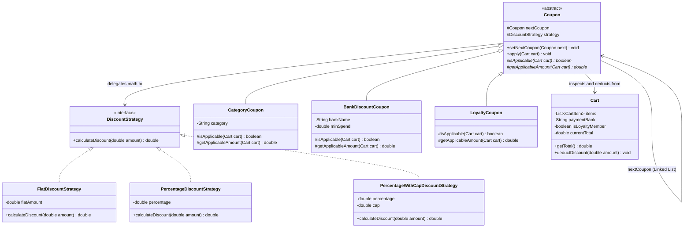

# 24. Build Discount Coupon Engine — LLD Case Study

> 💡 **Quick Revision Anchor**
> - **Domain:** E-Commerce / Quick-Commerce Discount & Promotion Engine (Zepto / Blinkit / Amazon LLD)
> - **Key Architectural Patterns:**
>   - **Strategy Pattern:** Decouples pure mathematical discount computation (`FlatDiscount`, `PercentageDiscount`, `PercentageWithCapDiscount`) from coupon business logic.
>   - **Chain of Responsibility Pattern:** Connects multiple eligible coupons into a linked chain (`Coupon` ➔ `nextCoupon`) to handle stacking and sequential deduction.
>   - **Singleton Pattern:** `CouponManager` serves as the centralized registry for configuring and executing the active coupon chain.

---

## 1. Problem Statement & Requirements

In modern e-commerce systems (like Amazon, Zepto, or Blinkit), calculating the final payable cart amount involves complex, multi-layered promotional rules:

### Functional Requirements:
1. **Diverse Discount Math:**
   - **Flat Off:** Deducts a fixed currency amount (e.g., flat ₹100 off).
   - **Percentage Off:** Deducts a percentage of the total (e.g., 10% off).
   - **Percentage Off with Cap:** Deducts a percentage up to a maximum threshold (e.g., 50% off up to ₹150).
2. **Conditional Applicability Rules:**
   - **Category-specific discounts:** Only applies to items in specific categories (e.g., "Clothing").
   - **Bank / Payment method offers:** Requires a minimum spend and specific bank card (e.g., "10% off with HDFC Card on orders above ₹1500").
   - **Customer Loyalty discounts:** Available only to premium / loyalty club members.
   - **Bulk purchase thresholds:** Applies only when cart total exceeds a certain value.
3. **Coupon Stacking (Sequential Application):**
   - Multiple eligible coupons can be applied one after another in a well-defined pipeline.
4. **Extensibility (OCP):**
   - Marketing teams launch new coupon rules daily. Adding a new coupon must require zero changes to the core cart calculation engine.

---

## 2. Design Evolution: Combining Strategy & Chain of Responsibility

A naive implementation mixes business conditions, mathematics, and cart manipulation inside nested `if-else` blocks in the `Cart` class.

### The Decoupled Architecture:
We separate two distinct concerns:
1. **How is the discount calculated?** ➔ **Strategy Pattern** (`DiscountStrategy`). Pure math, unaware of banks or cart items.
2. **When and how is a coupon applied and stacked?** ➔ **Chain of Responsibility Pattern** (`Coupon` base handler). Checks `isApplicable(Cart)`, computes discount via strategy, deducts from cart, and passes to `nextCoupon`.

```
[Cart Total: ₹25,000]
         │
         ▼
┌─────────────────────────┐  Category Discount (10% on Clothing)
│     CategoryCoupon      │  ➔ Deducts ₹200
└────────────┬────────────┘
             │ Remaining: ₹24,800
             ▼
┌─────────────────────────┐  Loyalty Coupon (Flat ₹500 for Members)
│      LoyaltyCoupon      │  ➔ Deducts ₹500
└────────────┬────────────┘
             │ Remaining: ₹24,300
             ▼
┌─────────────────────────┐  Bank Coupon (10% up to ₹1000 on HDFC)
│     BankDiscountCoupon  │  ➔ Deducts ₹1000
└─────────────────────────┘
             │
             ▼
[Final Payable: ₹23,300]
```

---

## 3. Architecture & Class Diagram



---

## 4. Java Implementation

### Step 1: Cart & Domain Models
```java
import java.util.ArrayList;
import java.util.List;

public class Product {
    private final String name;
    private final String category;
    private final double price;

    public Product(String name, String category, double price) {
        this.name = name;
        this.category = category;
        this.price = price;
    }

    public String getName() { return name; }
    public String getCategory() { return category; }
    public double getPrice() { return price; }
}

public class CartItem {
    private final Product product;
    private final int quantity;

    public CartItem(Product product, int quantity) {
        this.product = product;
        this.quantity = quantity;
    }

    public Product getProduct() { return product; }
    public int getQuantity() { return quantity; }
    public double getSubtotal() { return product.getPrice() * quantity; }
}

public class Cart {
    private final List<CartItem> items = new ArrayList<>();
    private String paymentBank;
    private boolean isLoyaltyMember;
    private double currentTotal;

    public void addItem(Product product, int quantity) {
        CartItem item = new CartItem(product, quantity);
        items.add(item);
        currentTotal += item.getSubtotal();
    }

    public double getCategoryTotal(String category) {
        double total = 0;
        for (CartItem item : items) {
            if (item.getProduct().getCategory().equalsIgnoreCase(category)) {
                total += item.getSubtotal();
            }
        }
        return total;
    }

    public void deductDiscount(double amount) {
        this.currentTotal = Math.max(0, this.currentTotal - amount);
    }

    public List<CartItem> getItems() { return items; }
    public double getCurrentTotal() { return currentTotal; }
    public String getPaymentBank() { return paymentBank; }
    public void setPaymentBank(String bank) { this.paymentBank = bank; }
    public boolean isLoyaltyMember() { return isLoyaltyMember; }
    public void setLoyaltyMember(boolean loyaltyMember) { this.isLoyaltyMember = loyaltyMember; }
}
```

---

### Step 2: Discount Math Algorithms (Strategy Pattern)
```java
// Strategy Interface
public interface DiscountStrategy {
    double calculateDiscount(double amount);
}

// 1. Flat Discount: e.g. Flat ₹100 Off
public class FlatDiscountStrategy implements DiscountStrategy {
    private final double flatAmount;

    public FlatDiscountStrategy(double flatAmount) {
        this.flatAmount = flatAmount;
    }

    @Override
    public double calculateDiscount(double amount) {
        return Math.min(amount, flatAmount);
    }
}

// 2. Percentage Discount: e.g. 10% Off
public class PercentageDiscountStrategy implements DiscountStrategy {
    private final double percentage;

    public PercentageDiscountStrategy(double percentage) {
        this.percentage = percentage;
    }

    @Override
    public double calculateDiscount(double amount) {
        return (amount * percentage) / 100.0;
    }
}

// 3. Percentage Discount with Cap: e.g. 50% Off up to ₹150
public class PercentageWithCapDiscountStrategy implements DiscountStrategy {
    private final double percentage;
    private final double cap;

    public PercentageWithCapDiscountStrategy(double percentage, double cap) {
        this.percentage = percentage;
        this.cap = cap;
    }

    @Override
    public double calculateDiscount(double amount) {
        double rawDiscount = (amount * percentage) / 100.0;
        return Math.min(rawDiscount, cap);
    }
}
```

---

### Step 3: Base Coupon Handler (Chain of Responsibility Pattern)
```java
public abstract class Coupon {
    protected Coupon nextCoupon;
    protected final DiscountStrategy strategy;
    protected final String couponName;

    public Coupon(String couponName, DiscountStrategy strategy) {
        this.couponName = couponName;
        this.strategy = strategy;
    }

    public void setNextCoupon(Coupon nextCoupon) {
        this.nextCoupon = nextCoupon;
    }

    // Template method for chain execution
    public void apply(Cart cart) {
        if (isApplicable(cart)) {
            double baseAmount = getApplicableAmount(cart);
            double discount = strategy.calculateDiscount(baseAmount);
            cart.deductDiscount(discount);
            System.out.println("  [Applied] " + couponName + ": -₹" + discount + " | New Total: ₹" + cart.getCurrentTotal());
        } else {
            System.out.println("  [Skipped] " + couponName + ": Conditions not met.");
        }

        // Pass to next coupon in the chain
        if (nextCoupon != null) {
            nextCoupon.apply(cart);
        }
    }

    protected abstract boolean isApplicable(Cart cart);
    protected abstract double getApplicableAmount(Cart cart);
}
```

---

### Step 4: Concrete Coupon Handlers
```java
// 1. Category Coupon: Applies discount only on specified item category
public class CategoryCoupon extends Coupon {
    private final String category;

    public CategoryCoupon(String couponName, String category, DiscountStrategy strategy) {
        super(couponName, strategy);
        this.category = category;
    }

    @Override
    protected boolean isApplicable(Cart cart) {
        return cart.getCategoryTotal(category) > 0;
    }

    @Override
    protected double getApplicableAmount(Cart cart) {
        return cart.getCategoryTotal(category);
    }
}

// 2. Bank Offer Coupon: Minimum spend + matching bank card
public class BankDiscountCoupon extends Coupon {
    private final String bankName;
    private final double minSpend;

    public BankDiscountCoupon(String couponName, String bankName, double minSpend, DiscountStrategy strategy) {
        super(couponName, strategy);
        this.bankName = bankName;
        this.minSpend = minSpend;
    }

    @Override
    protected boolean isApplicable(Cart cart) {
        return bankName.equalsIgnoreCase(cart.getPaymentBank()) && cart.getCurrentTotal() >= minSpend;
    }

    @Override
    protected double getApplicableAmount(Cart cart) {
        return cart.getCurrentTotal();
    }
}

// 3. Loyalty Member Coupon: Available exclusively to loyalty subscribers
public class LoyaltyCoupon extends Coupon {
    private final double minOrderValue;

    public LoyaltyCoupon(String couponName, double minOrderValue, DiscountStrategy strategy) {
        super(couponName, strategy);
        this.minOrderValue = minOrderValue;
    }

    @Override
    protected boolean isApplicable(Cart cart) {
        return cart.isLoyaltyMember() && cart.getCurrentTotal() >= minOrderValue;
    }

    @Override
    protected double getApplicableAmount(Cart cart) {
        return cart.getCurrentTotal();
    }
}
```

---

### Step 5: Centralized Coupon Manager (Singleton Pattern)
```java
public class CouponManager {
    private static CouponManager instance;
    private Coupon head;

    private CouponManager() {}

    public static synchronized CouponManager getInstance() {
        if (instance == null) instance = new CouponManager();
        return instance;
    }

    public void registerCoupon(Coupon coupon) {
        if (head == null) {
            head = coupon;
        } else {
            Coupon current = head;
            while (current.nextCoupon != null) {
                current = current.nextCoupon;
            }
            current.setNextCoupon(coupon);
        }
    }

    public void applyAllCoupons(Cart cart) {
        if (head != null) {
            head.apply(cart);
        }
    }

    public void clearCoupons() {
        head = null;
    }
}
```

---

### Step 6: Client Application & Demonstration
```java
public class Main {
    public static void main(String[] args) {
        // 1. Build Cart
        Cart cart = new Cart();
        Product shirt = new Product("Linen Shirt", "Clothing", 1000.0);
        Product jeans = new Product("Denim Jeans", "Clothing", 2000.0);
        Product headphones = new Product("Sony Headphones", "Electronics", 20000.0);

        cart.addItem(shirt, 1);       // 1000
        cart.addItem(jeans, 1);       // 2000
        cart.addItem(headphones, 1);  // 20000 -> Total = 23,000

        cart.setPaymentBank("HDFC");
        cart.setLoyaltyMember(true);

        System.out.println("Original Cart Total: ₹" + cart.getCurrentTotal());

        // 2. Configure Coupons via CouponManager
        CouponManager manager = CouponManager.getInstance();
        manager.clearCoupons();

        // Coupon 1: 10% off on Clothing
        manager.registerCoupon(new CategoryCoupon("CLOTHING10", "Clothing", new PercentageDiscountStrategy(10.0)));

        // Coupon 2: Flat ₹500 off for Loyalty Members on orders above ₹5000
        manager.registerCoupon(new LoyaltyCoupon("LOYALTY500", 5000.0, new FlatDiscountStrategy(500.0)));

        // Coupon 3: HDFC Bank 10% off with max cap of ₹1000 on min spend ₹10000
        manager.registerCoupon(new BankDiscountCoupon("HDFC10", "HDFC", 10000.0, 
                new PercentageWithCapDiscountStrategy(10.0, 1000.0)));

        // 3. Execute Coupon Chain
        System.out.println("\n=== Applying Stacking Coupons ===");
        manager.applyAllCoupons(cart);

        System.out.println("\nFinal Payable Amount: ₹" + cart.getCurrentTotal());
    }
}
```

### Execution Output:
```text
Original Cart Total: ₹23000.0

=== Applying Stacking Coupons ===
  [Applied] CLOTHING10: -₹300.0 | New Total: ₹22700.0
  [Applied] LOYALTY500: -₹500.0 | New Total: ₹22200.0
  [Applied] HDFC10: -₹1000.0 | New Total: ₹21200.0

Final Payable Amount: ₹21200.0
```

---

## 5. Architectural Discussion: Chain of Responsibility vs. Decorator

In the lecture, the instructor notes that both **Chain of Responsibility** and **Decorator** can process stacked calculations. Why choose Chain of Responsibility here?
- **Decorator** is optimal when modifying an object's behavior transparently through recursive wrapping (e.g. `cart = new CouponDecorator(cart)`).
- **Chain of Responsibility** is superior here because:
  1. Each coupon evaluates distinct external eligibility predicates (`isApplicable`).
  2. A coupon can silently bypass itself and immediately forward to `next` if criteria aren't met.
  3. Marketing pipelines frequently require dynamic re-ordering of priority (e.g., Bank offers before Store credits).

---

## 6. Interview Perspective

- **Q: How does combining Strategy with Chain of Responsibility uphold OCP?**
  *A: Strategy allows adding new mathematical formulas (e.g., "Buy 2 Get 1 Free") without touching coupon classes. Chain of Responsibility allows adding new coupon qualification rules (e.g., "First-Time User Coupon") without modifying the cart or manager.*
- **Q: How would you prevent a coupon from reducing the cart below zero?**
  *A: In `Cart.deductDiscount()`, clamp the calculation via `Math.max(0, currentTotal - amount)`.*
- **Q: How to handle mutually exclusive coupons (non-stackable)?**
  *A: Add a flag `canStack()` on `Coupon`. In the handler loop, if a non-stackable coupon is applied, terminate the chain or reset previously deducted discounts based on business rules.*

---

## 7. Quick Revision

```text
Problem: Multi-rule discounts with distinct math and conditional applicability.
Solution: Strategy Pattern encapsulates math formulas (Flat, %, % with cap).
Chain of Responsibility links coupon rules into a pipeline (Category, Bank, Loyalty).
Benefit: Highly modular, zero if-else clutter, OCP-compliant.
```
