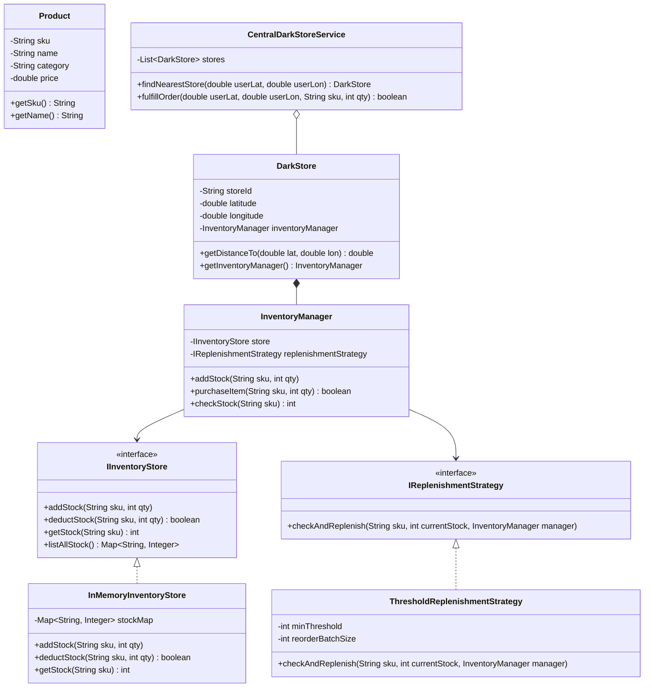

# 26. Build Zepto — Dark Store Inventory Management LLD

> 💡 **Quick Revision Anchor**: A hyper-local quick-commerce inventory architecture (Zepto/Blinkit) featuring **decentralized inventory managers** (avoiding the naive Singleton trap), **Strategy Pattern** for stock replenishment algorithms (Threshold vs. Scheduled), and **geo-location dark store routing** with fallback fulfillment.

---

## 1. Problem Statement & Functional Requirements

Design a hyper-local inventory management system powering 10-minute grocery delivery across micro-fulfillment centers (**Dark Stores**).

### Functional Requirements:
1. **Catalog & SKU Tracking**: Maintain products categorized into groceries, electronics, dairy, etc.
2. **Per-Store Isolated Inventory**: Each Dark Store maintains its own stock levels, aisle locations, and replenishment pipelines.
3. **Automated Replenishment (Strategy Pattern)**:
   - *Threshold-Based*: When stock of an SKU drops below $K$, trigger emergency supplier order.
   - *Scheduled-Based*: Fixed batch restock every morning or weekly cycle.
4. **Geo-Routing to Nearest Dark Store**: Given user GPS coordinates, find the closest active dark store servicing that pin code.
5. **Stock Validation & Fallback Fulfillment**: If an item is out of stock in the primary dark store, fail gracefully or route to a secondary neighboring dark store.

---

## 2. Key Architecture Decision: Why `InventoryManager` is NOT a Singleton

> ⚠️ **Common Interview Anti-Pattern**: Blindly declaring every `Manager` class as a `Singleton`.
>
> In a multi-store quick commerce network:
> - If `InventoryManager` were a global Singleton, it would become a massive bottleneck holding state for hundreds of stores across all cities.
> - **Correct Decision**: Each `DarkStore` owns its own dedicated `InventoryManager` instance.
> - A central coordinator (`CentralDarkStoreService`) holds a registry of stores and orchestrates geo-discovery.

---

## 3. Class Diagram & Architecture



---

## 4. Production Java Implementation

### Step 1: Product & Inventory Storage Abstraction
```java
import java.util.*;
import java.util.concurrent.ConcurrentHashMap;

public class Product {
    private final String sku;
    private final String name;
    private final String category;
    private final double price;

    public Product(String sku, String name, String category, double price) {
        this.sku = sku;
        this.name = name;
        this.category = category;
        this.price = price;
    }

    public String getSku() { return sku; }
    public String getName() { return name; }
    public double getPrice() { return price; }
}

public interface IInventoryStore {
    void addStock(String sku, int quantity);
    boolean deductStock(String sku, int quantity);
    int getStock(String sku);
    Map<String, Integer> listStock();
}

public class InMemoryInventoryStore implements IInventoryStore {
    // Thread-safe map for high concurrency inventory updates
    private final Map<String, Integer> stockMap = new ConcurrentHashMap<>();

    @Override
    public void addStock(String sku, int quantity) {
        stockMap.merge(sku, quantity, Integer::sum);
    }

    @Override
    public synchronized boolean deductStock(String sku, int quantity) {
        int current = stockMap.getOrDefault(sku, 0);
        if (current >= quantity) {
            stockMap.put(sku, current - quantity);
            return true;
        }
        return false;
    }

    @Override
    public int getStock(String sku) {
        return stockMap.getOrDefault(sku, 0);
    }

    @Override
    public Map<String, Integer> listStock() {
        return Collections.unmodifiableMap(stockMap);
    }
}
```

### Step 2: Strategy Pattern (Stock Replenishment)
```java
public interface IReplenishmentStrategy {
    void checkAndReplenish(String sku, int currentStock, InventoryManager manager);
}

// Automatically triggers reorder when stock drops below critical threshold
public class ThresholdReplenishmentStrategy implements IReplenishmentStrategy {
    private final int threshold;
    private final int reorderAmount;

    public ThresholdReplenishmentStrategy(int threshold, int reorderAmount) {
        this.threshold = threshold;
        this.reorderAmount = reorderAmount;
    }

    @Override
    public void checkAndReplenish(String sku, int currentStock, InventoryManager manager) {
        if (currentStock <= threshold) {
            System.out.println("[Replenishment Alert] Stock for SKU: " + sku + " dropped to " 
                               + currentStock + " (<= threshold " + threshold + "). Auto-restocking +" + reorderAmount);
            manager.addStock(sku, reorderAmount);
        }
    }
}
```

### Step 3: Local Inventory Manager (Store-Specific)
```java
public class InventoryManager {
    private final IInventoryStore store;
    private final IReplenishmentStrategy replenishmentStrategy;

    public InventoryManager(IInventoryStore store, IReplenishmentStrategy replenishmentStrategy) {
        this.store = store;
        this.replenishmentStrategy = replenishmentStrategy;
    }

    public void addStock(String sku, int qty) {
        store.addStock(sku, qty);
        System.out.println("[InventoryManager] Added " + qty + " units of SKU: " + sku);
    }

    public boolean purchaseItem(String sku, int qty) {
        boolean success = store.deductStock(sku, qty);
        if (success) {
            int remaining = store.getStock(sku);
            System.out.println("[InventoryManager] Sold " + qty + " units of " + sku + ". Remaining: " + remaining);
            // Trigger auto-replenishment evaluation
            replenishmentStrategy.checkAndReplenish(sku, remaining, this);
            return true;
        } else {
            System.err.println("[InventoryManager] Insufficient stock for SKU: " + sku + " (Requested: " + qty + ")");
            return false;
        }
    }

    public int checkStock(String sku) {
        return store.getStock(sku);
    }
}
```

### Step 4: Dark Store & Geo-Location Routing Service
```java
public class DarkStore {
    private final String storeId;
    private final double latitude;
    private final double longitude;
    private final InventoryManager inventoryManager;

    public DarkStore(String storeId, double latitude, double longitude, InventoryManager inventoryManager) {
        this.storeId = storeId;
        this.latitude = latitude;
        this.longitude = longitude;
        this.inventoryManager = inventoryManager;
    }

    public String getStoreId() { return storeId; }
    public InventoryManager getInventoryManager() { return inventoryManager; }

    // Simplified Euclidean distance for local neighborhoods
    public double getDistanceTo(double userLat, double userLon) {
        double dLat = this.latitude - userLat;
        double dLon = this.longitude - userLon;
        return Math.sqrt(dLat * dLat + dLon * dLon);
    }
}

public class CentralDarkStoreService {
    private final List<DarkStore> darkStores = new ArrayList<>();

    public void registerStore(DarkStore store) {
        darkStores.add(store);
    }

    // Locate closest dark store
    public DarkStore findNearestStore(double userLat, double userLon) {
        if (darkStores.isEmpty()) return null;
        return darkStores.stream()
                .min(Comparator.comparingDouble(s -> s.getDistanceTo(userLat, userLon)))
                .orElse(null);
    }

    // Fulfill order with fallback support
    public boolean fulfillOrder(double userLat, double userLon, String sku, int qty) {
        // Sort stores by proximity
        List<DarkStore> sortedStores = new ArrayList<>(darkStores);
        sortedStores.sort(Comparator.comparingDouble(s -> s.getDistanceTo(userLat, userLon)));

        for (DarkStore store : sortedStores) {
            double dist = store.getDistanceTo(userLat, userLon);
            System.out.println("[Routing] Checking Store: " + store.getStoreId() + " (Distance: " + String.format("%.3f", dist) + ")");
            if (store.getInventoryManager().purchaseItem(sku, qty)) {
                System.out.println("[Routing] Successfully fulfilled order from store: " + store.getStoreId());
                return true;
            }
        }
        System.err.println("[Routing] Order Fulfillment Failed: SKU " + sku + " out of stock across all reachable stores.");
        return false;
    }
}
```

### Step 5: Test Driver & Verification
```java
public class Main {
    public static void main(String[] args) {
        // 1. Create two Dark Stores: Indiranagar & Koramangala
        IReplenishmentStrategy thresholdPolicy = new ThresholdReplenishmentStrategy(3, 10);

        DarkStore indiranagarStore = new DarkStore(
            "DS_INDIRANAGAR", 
            12.9716, 77.6412, 
            new InventoryManager(new InMemoryInventoryStore(), thresholdPolicy)
        );

        DarkStore koramangalaStore = new DarkStore(
            "DS_KORAMANGALA", 
            12.9352, 77.6245, 
            new InventoryManager(new InMemoryInventoryStore(), thresholdPolicy)
        );

        // 2. Stock Initial Inventory
        String milkSku = "AMUL_MILK_500ML";
        indiranagarStore.getInventoryManager().addStock(milkSku, 5); // 5 packets in Indiranagar
        koramangalaStore.getInventoryManager().addStock(milkSku, 20); // 20 packets in Koramangala

        // 3. Central Service
        CentralDarkStoreService centralService = new CentralDarkStoreService();
        centralService.registerStore(indiranagarStore);
        centralService.registerStore(koramangalaStore);

        // 4. Customer near Indiranagar orders 3 packets
        double customerLat = 12.9720;
        double customerLon = 77.6410;
        System.out.println("\n>>> Order 1: Customer orders 3 milk packets");
        centralService.fulfillOrder(customerLat, customerLon, milkSku, 3);
        // Indiranagar drops to 2 (<= 3) -> Auto-replenishment triggers (+10 -> 12)

        // 5. Customer orders 15 packets (Indiranagar now has 12, so it fails and falls back to Koramangala)
        System.out.println("\n>>> Order 2: Customer orders 15 milk packets (Exceeds local stock)");
        centralService.fulfillOrder(customerLat, customerLon, milkSku, 15);
    }
}
```

---

## 5. Execution Output

```text
[InventoryManager] Added 5 units of SKU: AMUL_MILK_500ML
[InventoryManager] Added 20 units of SKU: AMUL_MILK_500ML

>>> Order 1: Customer orders 3 milk packets
[Routing] Checking Store: DS_INDIRANAGAR (Distance: 0.000)
[InventoryManager] Sold 3 units of AMUL_MILK_500ML. Remaining: 2
[Replenishment Alert] Stock for SKU: AMUL_MILK_500ML dropped to 2 (<= threshold 3). Auto-restocking +10
[InventoryManager] Added 10 units of SKU: AMUL_MILK_500ML
[Routing] Successfully fulfilled order from store: DS_INDIRANAGAR

>>> Order 2: Customer orders 15 milk packets (Exceeds local stock)
[Routing] Checking Store: DS_INDIRANAGAR (Distance: 0.000)
[InventoryManager] Insufficient stock for SKU: AMUL_MILK_500ML (Requested: 15)
[Routing] Checking Store: DS_KORAMANGALA (Distance: 0.040)
[InventoryManager] Sold 15 units of AMUL_MILK_500ML. Remaining: 5
[Routing] Successfully fulfilled order from store: DS_KORAMANGALA
```

---

## 6. Interview Key Insights

1. **Concurrency Control**:
   - High volume concurrent purchases (flash sales) lead to **race conditions** and negative inventory.
   - We used `synchronized` block and `ConcurrentHashMap` to guarantee atomic deductions.
2. **Geo-Partitioning (HLD tie-in)**:
   - In production, dark store lookup utilizes **Uber H3 spatial index** or **Google S2 geometry** to look up stores in $O(1)$ within a 2 km hexagon radius.
