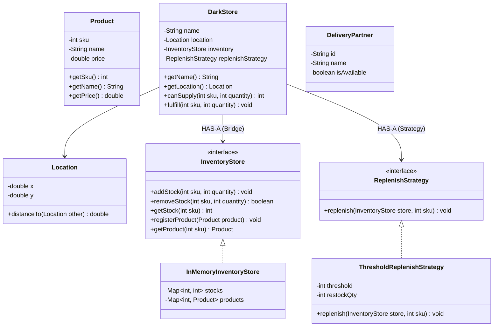

# 26. Build Zepto — Inventory Management — LLD Case Study

> 💡 **Quick Revision Anchor**
> - **Domain:** Quick-Commerce 10-Minute Delivery Engine (Zepto / Blinkit / Instamart LLD)
> - **Core Architectural Patterns:**
>   - **Bridge Pattern:** Decouples the High-Level Dark Store abstraction (`DarkStore`) from Low-Level inventory storage mechanisms (`InventoryStore` ➔ `InMemoryInventoryStore`).
>   - **Strategy Pattern:** `ReplenishStrategy` allows dynamic swapping of restocking policies (`ThresholdReplenishStrategy`, `PeriodicReplenishStrategy`).
>   - **Factory Pattern:** `ProductFactory` centralizes creation and retrieval of catalog products.
>   - **Multi-Store Greedy Fulfillment Algorithm:** Splits an order across multiple nearby Dark Stores within a 5 km delivery radius when a single dark store has partial stock.

---

## 1. Problem Statement & Requirements

Quick-commerce applications promise delivery of groceries within 10 minutes. This speed is achieved through distributed micro-warehouses located inside dense neighborhoods, known as **Dark Stores**.

### Functional Requirements:
1. **Catalog & Inventory Management:**
   - Manage products identified by Stock Keeping Units (**SKU**), names, and prices.
   - Support adding stock, removing stock, and checking real-time quantity in $O(1)$ time.
2. **Dark Store Operations:**
   - Each Dark Store has geographic coordinates (`x, y`), an inventory store, and a replenishment policy.
   - Calculate Euclidean / geographic distance between users and Dark Stores.
3. **Automated Inventory Replenishment:**
   - When an item's stock drops below a defined safety threshold, automatically trigger a replenishment strategy to re-order inventory.
4. **Multi-Store Order Splitting & Fulfillment:**
   - Discover all Dark Stores within a delivery radius (e.g., 5 km) of the customer.
   - If the closest Dark Store has insufficient quantity to fulfill an order, **split fulfillment across multiple nearby Dark Stores**, assigning dedicated delivery partners to each leg of the delivery.

---

## 2. Architecture & Design Breakdown

```
                            [Zepto Platform]
                                   │
              ┌────────────────────┴────────────────────┐
              ▼                                         ▼
       ┌──────────────┐                          ┌──────────────┐
       │     User     │                          │  Dark Store  │
       │ (Coordinates)│                          │ (Coordinates)│
       └──────────────┘                          └──────┬───────┘
                                                        │
                         ┌──────────────────────────────┴──────────────────────────────┐
                         ▼ (Bridge)                                                    ▼ (Strategy)
                 ┌────────────────┐                                            ┌──────────────────┐
                 │ InventoryStore │                                            │ReplenishStrategy │
                 └───────┬────────┘                                            └────────┬─────────┘
                         │                                                              │
                         ▼                                                              ▼
              ┌───────────────────────┐                                     ┌─────────────────────────┐
              │InMemoryInventoryStore │                                     │ThresholdReplenishStrat  │
              └───────────────────────┘                                     └─────────────────────────┘
```

---

## 3. Architecture & Class Diagram



---

## 4. Java Implementation

### Step 1: Core Domain Entities (Product, Location, DeliveryPartner)
```java
public class Product {
    private final int sku;
    private final String name;
    private final double price;

    public Product(int sku, String name, double price) {
        this.sku = sku;
        this.name = name;
        this.price = price;
    }

    public int getSku() { return sku; }
    public String getName() { return name; }
    public double getPrice() { return price; }

    @Override
    public String toString() {
        return name + " (SKU: " + sku + ", ₹" + price + ")";
    }
}

public class Location {
    private final double x;
    private final double y;

    public Location(double x, double y) {
        this.x = x;
        this.y = y;
    }

    public double distanceTo(Location other) {
        // Euclidean distance for local grid simulation
        return Math.sqrt(Math.pow(this.x - other.x, 2) + Math.pow(this.y - other.y, 2));
    }
}

public class DeliveryPartner {
    private final String id;
    private final String name;

    public DeliveryPartner(String id, String name) {
        this.id = id;
        this.name = name;
    }

    public String getName() { return name; }
}
```

---

### Step 2: Inventory Store Implementation (Bridge Implementor)
```java
import java.util.HashMap;
import java.util.Map;

public interface InventoryStore {
    void registerProduct(Product product);
    void addStock(int sku, int quantity);
    boolean removeStock(int sku, int quantity);
    int getStock(int sku);
    Product getProduct(int sku);
    Map<Integer, Integer> getAllStocks();
}

public class InMemoryInventoryStore implements InventoryStore {
    private final Map<Integer, Integer> stocks = new HashMap<>();       // SKU -> Available Quantity
    private final Map<Integer, Product> products = new HashMap<>();     // SKU -> Product Entity

    @Override
    public void registerProduct(Product product) {
        products.put(product.getSku(), product);
    }

    @Override
    public void addStock(int sku, int quantity) {
        stocks.put(sku, stocks.getOrDefault(sku, 0) + quantity);
    }

    @Override
    public boolean removeStock(int sku, int quantity) {
        int current = stocks.getOrDefault(sku, 0);
        if (current >= quantity) {
            stocks.put(sku, current - quantity);
            return true;
        }
        return false;
    }

    @Override
    public int getStock(int sku) {
        return stocks.getOrDefault(sku, 0);
    }

    @Override
    public Product getProduct(int sku) {
        return products.get(sku);
    }

    @Override
    public Map<Integer, Integer> getAllStocks() {
        return new HashMap<>(stocks);
    }
}
```

---

### Step 3: Replenishment Policy (Strategy Pattern)
```java
public interface ReplenishStrategy {
    void checkAndReplenish(InventoryStore store, int sku);
}

public class ThresholdReplenishStrategy implements ReplenishStrategy {
    private final int threshold;
    private final int restockAmount;

    public ThresholdReplenishStrategy(int threshold, int restockAmount) {
        this.threshold = threshold;
        this.restockAmount = restockAmount;
    }

    @Override
    public void checkAndReplenish(InventoryStore store, int sku) {
        int currentStock = store.getStock(sku);
        if (currentStock <= threshold) {
            store.addStock(sku, restockAmount);
            System.out.println("  [Alert] Stock for SKU " + sku + " dropped to " + currentStock + 
                               ". Auto-replenished +" + restockAmount + " units.");
        }
    }
}
```

---

### Step 4: Dark Store Entity (Bridge Abstraction)
```java
public class DarkStore {
    private final String name;
    private final Location location;
    private final InventoryStore inventory;
    private final ReplenishStrategy replenishStrategy;

    public DarkStore(String name, Location location, InventoryStore inventory, ReplenishStrategy strategy) {
        this.name = name;
        this.location = location;
        this.inventory = inventory;
        this.replenishStrategy = strategy;
    }

    public String getName() { return name; }
    public Location getLocation() { return location; }
    public InventoryStore getInventory() { return inventory; }

    // Returns how many units this dark store can actually supply (min of available, requested)
    public int canSupply(int sku, int requestedQty) {
        int available = inventory.getStock(sku);
        return Math.min(available, requestedQty);
    }

    public void fulfill(int sku, int quantity) {
        inventory.removeStock(sku, quantity);
        if (replenishStrategy != null) {
            replenishStrategy.checkAndReplenish(inventory, sku);
        }
    }
}
```

---

### Step 5: Multi-Store Order Splitting Engine
```java
import java.util.*;

public class ZeptoApp {
    private final List<DarkStore> darkStores = new ArrayList<>();
    private final double MAX_DELIVERY_RADIUS_KM = 5.0;

    public void registerDarkStore(DarkStore store) {
        darkStores.add(store);
    }

    // Finds stores within 5 km, sorted by distance
    private List<DarkStore> getNearbyDarkStores(Location userLocation) {
        List<DarkStore> nearby = new ArrayList<>();
        for (DarkStore store : darkStores) {
            if (store.getLocation().distanceTo(userLocation) <= MAX_DELIVERY_RADIUS_KM) {
                nearby.add(store);
            }
        }
        nearby.sort(Comparator.comparingDouble(s -> s.getLocation().distanceTo(userLocation)));
        return nearby;
    }

    // Greedy Multi-Dark Store fulfillment
    public void checkoutOrder(String userName, Location userLocation, Map<Integer, Integer> cart) {
        System.out.println("\n=== Processing Order for User: " + userName + " ===");
        List<DarkStore> candidateStores = getNearbyDarkStores(userLocation);

        if (candidateStores.isEmpty()) {
            System.out.println("❌ Delivery Unavailable: No Dark Stores within " + MAX_DELIVERY_RADIUS_KM + " km.");
            return;
        }

        // Map to track fulfillments: DarkStore -> (SKU -> Quantity supplied)
        Map<DarkStore, Map<Integer, Integer>> fulfillmentPlan = new LinkedHashMap<>();
        Map<Integer, Integer> pendingItems = new HashMap<>(cart);

        for (DarkStore store : candidateStores) {
            Iterator<Map.Entry<Integer, Integer>> it = pendingItems.entrySet().iterator();
            while (it.hasNext()) {
                Map.Entry<Integer, Integer> entry = it.next();
                int sku = entry.getKey();
                int needed = entry.getValue();

                int canGive = store.canSupply(sku, needed);
                if (canGive > 0) {
                    fulfillmentPlan.computeIfAbsent(store, k -> new HashMap<>()).put(sku, canGive);
                    int remaining = needed - canGive;
                    if (remaining == 0) {
                        it.remove(); // Fully satisfied
                    } else {
                        entry.setValue(remaining); // Partially satisfied, look to next store
                    }
                }
            }
            if (pendingItems.isEmpty()) break;
        }

        if (!pendingItems.isEmpty()) {
            System.out.println("❌ Cannot fulfill entire order. Out of stock for SKUs: " + pendingItems.keySet());
            return;
        }

        // Execute fulfillment and dispatch delivery partners
        int partnerCount = 1;
        for (Map.Entry<DarkStore, Map<Integer, Integer>> entry : fulfillmentPlan.entrySet()) {
            DarkStore store = entry.getKey();
            Map<Integer, Integer> items = entry.getValue();

            System.out.println("\n📦 Dispatching from [" + store.getName() + "]:");
            for (Map.Entry<Integer, Integer> item : items.entrySet()) {
                store.fulfill(item.getKey(), item.getValue());
                Product p = store.getInventory().getProduct(item.getKey());
                System.out.println("   - " + p.getName() + " x " + item.getValue());
            }

            DeliveryPartner rider = new DeliveryPartner("DP-" + partnerCount, "Rider #" + partnerCount);
            System.out.println("   🛵 Assigned Delivery Partner: " + rider.getName() + " to deliver to " + userName);
            partnerCount++;
        }

        System.out.println("\n✅ Order successfully fulfilled and out for 10-min delivery!");
    }
}
```

---

### Step 6: Client Demonstration
```java
public class Main {
    public static void main(String[] args) {
        ZeptoApp zepto = new ZeptoApp();

        // Catalog Products
        Product apple = new Product(101, "Royal Gala Apple", 20.0);
        Product banana = new Product(102, "Robusta Banana", 10.0);
        Product chocolate = new Product(103, "Dark Chocolate 85%", 50.0);

        ReplenishStrategy autoRestock = new ThresholdReplenishStrategy(2, 20);

        // Dark Store A (Coordinates: 0, 0) - Only has 2 Apples, 5 Bananas
        InventoryStore invA = new InMemoryInventoryStore();
        invA.registerProduct(apple);
        invA.registerProduct(banana);
        invA.addStock(101, 2); // 2 Apples
        invA.addStock(102, 5); // 5 Bananas
        DarkStore darkStoreA = new DarkStore("DarkStore Indiranagar", new Location(0, 0), invA, autoRestock);

        // Dark Store B (Coordinates: 1, 1) - Has remaining Apples and Chocolates
        InventoryStore invB = new InMemoryInventoryStore();
        invB.registerProduct(apple);
        invB.registerProduct(chocolate);
        invB.addStock(101, 10); // 10 Apples
        invB.addStock(103, 15); // 15 Chocolates
        DarkStore darkStoreB = new DarkStore("DarkStore Koramangala", new Location(1, 1), invB, autoRestock);

        zepto.registerDarkStore(darkStoreA);
        zepto.registerDarkStore(darkStoreB);

        // User placed order at Location (0.5, 0.5)
        // Order: 4 Apples (Needs split: 2 from A, 2 from B), 2 Bananas (from A), 1 Chocolate (from B)
        Map<Integer, Integer> cart = new HashMap<>();
        cart.put(101, 4); // 4 Apples
        cart.put(102, 2); // 2 Bananas
        cart.put(103, 1); // 1 Chocolate

        zepto.checkoutOrder("Aditya", new Location(0.5, 0.5), cart);
    }
}
```

### Execution Output:
```text
=== Processing Order for User: Aditya ===

📦 Dispatching from [DarkStore Indiranagar]:
   - Royal Gala Apple x 2
  [Alert] Stock for SKU 101 dropped to 0. Auto-replenished +20 units.
   - Robusta Banana x 2
   🛵 Assigned Delivery Partner: Rider #1 to deliver to Aditya

📦 Dispatching from [DarkStore Koramangala]:
   - Royal Gala Apple x 2
   - Dark Chocolate 85% x 1
   🛵 Assigned Delivery Partner: Rider #2 to deliver to Aditya

✅ Order successfully fulfilled and out for 10-min delivery!
```

---

## 5. Summary of Design Patterns Applied

| Pattern | Component | Benefit in Zepto Case Study |
| :--- | :--- | :--- |
| **Bridge** | `DarkStore` ➔ `InventoryStore` | Decouples warehouse routing from storage mechanisms (In-Memory, Redis, SQL). |
| **Strategy** | `ReplenishStrategy` | Enables pluggable restocking algorithms (Threshold, Demand-forecasting). |
| **Greedy Multi-Store Splitting** | `ZeptoApp.checkoutOrder()` | Maximizes fulfillment probability by pooling neighborhood dark store stocks. |

---

## 6. Interview Perspective

- **Q: How does Zepto achieve sub-10-minute order packing and dispatch?**
  *A: Geographically distributed Dark Stores (within 2-3 km radii) maintain localized fast-moving SKU caches in in-memory key-value maps ($O(1)$ lookup and deduction).*
- **Q: How do you handle race conditions when two users purchase the last apple simultaneously?**
  *A: Use database row-level pessimistic locking (`SELECT ... FOR UPDATE`) or atomic Redis decrement commands (`DECRBY`) with rollback if the counter drops below zero.*
- **Q: Why split orders across Dark Stores instead of rejecting the checkout?**
  *A: In high-density urban areas, customer retention is prioritized. If Store A is out of an item, dispatching a second rider from Store B (2 km away) preserves customer experience at the trade-off of marginal delivery cost.*
