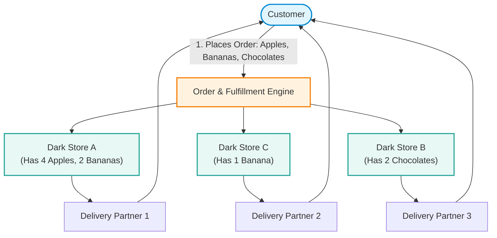
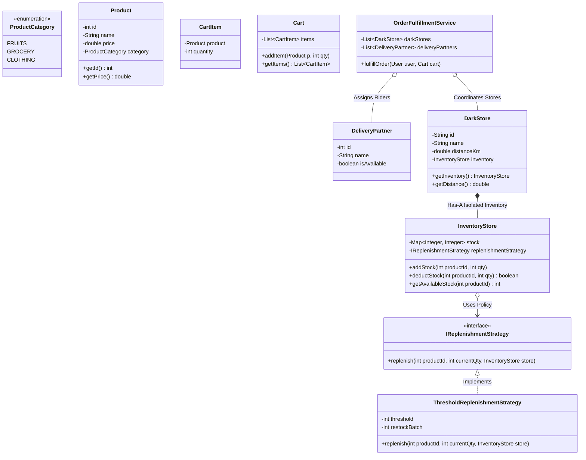

# 26. Build Zepto — Dark Store Inventory Management LLD

> 💡 **Quick Revision Anchor**: A hyper-local quick-commerce inventory and micro-fulfillment engine (Zepto/Blinkit) featuring **isolated per-store inventory managers** (avoiding the monolithic Singleton trap), **multi-store split-order fulfillment algorithms** with dynamic **Delivery Partner assignment**, and **Strategy Pattern** for automated stock replenishment (*Threshold-based* vs. *Periodic/Weekly*).

---

## 1. Problem Statement & Business Context

Quick-commerce platforms (e.g., Zepto, Blinkit, Instamart) promise 10-minute grocery delivery. Achieving this requires operating a distributed network of small, localized micro-warehouses known as **Dark Stores**:
- Unlike traditional e-commerce (where orders ship from massive centralized warehouses over 2-3 days), quick commerce maintains hundreds of localized dark stores placed within 2–3 km of residential clusters.
- When a customer builds a cart, items may be distributed across multiple nearby dark stores if a single store suffers from partial stock-outs.
- The inventory engine must locate nearby dark stores, verify real-time stock, atomically deduct inventory, split fulfillment across stores when necessary, and dispatch delivery partners per sourcing node.



---

## 2. Functional & Non-Functional Requirements

### Functional Requirements (Taught in Lecture):
1. **Catalog & Inventory Management**: Add, update, and remove products across diverse categories (Fruits/Vegetables, Grocery, Electronics, Clothing).
2. **Pluggable Replenishment Policies (Strategy Pattern)**:
   - **Threshold-Based**: Automatically triggers replenishment when quantity drops below safety threshold $K$.
   - **Time-Based / Weekly Restock**: Scheduled periodic bulk replenishment by supply trucks.
3. **Multi-Store Discovery & Visibility**: Users must view consolidated catalog availability from all dark stores within their serviceable radius.
4. **Multi-Dark Store Order Splitting & Fulfillment**:
   - If Store A has only partial quantity, source the remainder from Store B or C.
   - For every dark store participating in fulfillment, dynamically assign an available **Delivery Partner**.
5. **Atomic Stock Updates**: Prevent overselling during simultaneous checkout attempts.

### Non-Functional Requirements:
- **Thread Safety**: Isolated concurrency locking per store/SKU.
- **Low Latency**: Sub-second fulfillment path computation.

---

## 3. Core Architectural Insight: Why `InventoryManager` is NOT a Global Singleton

> [!WARNING]
> ### The Monolithic Singleton Anti-Pattern
> In many naive interview designs, candidates declare `InventoryManager` as a global `Singleton`.
> In quick-commerce, a global singleton creates a catastrophic bottleneck:
> - Lock contention across thousands of concurrent checkouts in different cities.
> - High blast radius: A crash or memory leak halts the entire nationwide platform.
>
> **The Lecture Architecture**:
> - Each `DarkStore` owns its own **autonomous, isolated `InventoryStore`**.
> - A top-level `DarkStoreManager` / `FulfillmentService` orchestrates discovery across stores.

---

## 4. Class Diagram & System Architecture



---

## 5. Complete, Compilable Java Implementation

Below is the complete Java implementation featuring the exact lecture walkthrough:
- Items: Apple (`₹20`), Banana (`₹10`), Chocolate (`₹50`), T-shirt (`₹500`).
- Cart: 4 Apples, 3 Bananas, 2 Chocolates.
- Stores: Dark Store A (4 Apples, 2 Bananas), Dark Store B (10 Chocolates), Dark Store C (5 Bananas).
- Sourcing: Store A (4 Apples, 2 Bananas) + Store C (1 Banana) + Store B (2 Chocolates).
- Riders: 3 delivery partners assigned, order settled at ₹210.

```java
package com.designpatterns.casestudy.zepto;

import java.util.*;

// ============================================================================
// 1. PRODUCT CATALOG & DOMAIN ENTITIES
// ============================================================================

enum ProductCategory {
    FRUITS,
    SNACKS,
    CLOTHING
}

class Product {
    private final int id;
    private final String name;
    private final double price;
    private final ProductCategory category;

    public Product(int id, String name, double price, ProductCategory category) {
        this.id = id;
        this.name = name;
        this.price = price;
        this.category = category;
    }

    public int getId() { return id; }
    public String getName() { return name; }
    public double getPrice() { return price; }
    public ProductCategory getCategory() { return category; }
}

class CartItem {
    private final Product product;
    private final int quantity;

    public CartItem(Product product, int quantity) {
        this.product = product;
        this.quantity = quantity;
    }

    public Product getProduct() { return product; }
    public int getQuantity() { return quantity; }
}

class Cart {
    private final List<CartItem> items = new ArrayList<>();

    public void addItem(Product product, int quantity) {
        items.add(new CartItem(product, quantity));
    }

    public List<CartItem> getItems() { return items; }
}

class User {
    private final String name;
    private final String address;

    public User(String name, String address) {
        this.name = name;
        this.address = address;
    }

    public String getName() { return name; }
}

class DeliveryPartner {
    private final int id;
    private final String name;
    private boolean isAvailable;

    public DeliveryPartner(int id, String name) {
        this.id = id;
        this.name = name;
        this.isAvailable = true;
    }

    public int getId() { return id; }
    public String getName() { return name; }
    public boolean isAvailable() { return isAvailable; }
    public void setAvailable(boolean available) { this.isAvailable = available; }

    @Override
    public String toString() {
        return "DeliveryPartner[ID=" + id + ", Name=" + name + "]";
    }
}

// ============================================================================
// 2. STRATEGY PATTERN: REPLENISHMENT POLICIES
// ============================================================================

interface IReplenishmentStrategy {
    void checkAndReplenish(int productId, int currentStock, InventoryStore store);
}

class ThresholdReplenishmentStrategy implements IReplenishmentStrategy {
    private final int threshold;
    private final int restockBatch;

    public ThresholdReplenishmentStrategy(int threshold, int restockBatch) {
        this.threshold = threshold;
        this.restockBatch = restockBatch;
    }

    @Override
    public void checkAndReplenish(int productId, int currentStock, InventoryStore store) {
        if (currentStock <= threshold) {
            System.out.println("    [Alert] Product ID " + productId + " stock dropped to " 
                               + currentStock + " (<= threshold " + threshold + "). Auto-restocking +" + restockBatch + " units...");
            store.addStock(productId, restockBatch);
        }
    }
}

// ============================================================================
// 3. ISOLATED DARK STORE INVENTORY
// ============================================================================

class InventoryStore {
    private final Map<Integer, Integer> stockMap = new HashMap<>();
    private final IReplenishmentStrategy replenishmentStrategy;

    public InventoryStore(IReplenishmentStrategy strategy) {
        this.replenishmentStrategy = strategy;
    }

    public synchronized void addStock(int productId, int quantity) {
        stockMap.put(productId, stockMap.getOrDefault(productId, 0) + quantity);
    }

    public synchronized int getStock(int productId) {
        return stockMap.getOrDefault(productId, 0);
    }

    public synchronized int deductAvailable(int productId, int neededQuantity) {
        int current = stockMap.getOrDefault(productId, 0);
        int take = Math.min(current, neededQuantity);
        if (take > 0) {
            stockMap.put(productId, current - take);
            if (replenishmentStrategy != null) {
                replenishmentStrategy.checkAndReplenish(productId, current - take, this);
            }
        }
        return take;
    }
}

class DarkStore {
    private final String id;
    private final String name;
    private final double distanceKm;
    private final InventoryStore inventory;

    public DarkStore(String id, String name, double distanceKm, IReplenishmentStrategy strategy) {
        this.id = id;
        this.name = name;
        this.distanceKm = distanceKm;
        this.inventory = new InventoryStore(strategy);
    }

    public String getId() { return id; }
    public String getName() { return name; }
    public double getDistanceKm() { return distanceKm; }
    public InventoryStore getInventory() { return inventory; }
}

// ============================================================================
// 4. MULTI-DARK STORE ORDER FULFILLMENT ENGINE
// ============================================================================

class OrderFulfillmentService {
    private final List<DarkStore> darkStores = new ArrayList<>();
    private final List<DeliveryPartner> deliveryPartners = new ArrayList<>();
    private int partnerIndex = 0;

    public void registerDarkStore(DarkStore store) { darkStores.add(store); }
    public void registerDeliveryPartner(DeliveryPartner dp) { deliveryPartners.add(dp); }

    private DeliveryPartner assignNextPartner() {
        if (deliveryPartners.isEmpty()) return null;
        DeliveryPartner dp = deliveryPartners.get(partnerIndex % deliveryPartners.size());
        partnerIndex++;
        return dp;
    }

    public void placeOrder(User user, Cart cart) {
        System.out.println("===============================================================");
        System.out.println("PROCESSING ORDER FOR USER: " + user.getName());
        System.out.println("===============================================================");

        // Step 1: Map requested quantities [ProductId -> RequiredQty]
        Map<Integer, Integer> remainingDemand = new HashMap<>();
        Map<Integer, Product> productMap = new HashMap<>();
        double totalCost = 0.0;

        for (CartItem item : cart.getItems()) {
            remainingDemand.put(item.getProduct().getId(), item.getQuantity());
            productMap.put(item.getProduct().getId(), item.getProduct());
            totalCost += item.getProduct().getPrice() * item.getQuantity();
        }

        // Sort dark stores by proximity
        List<DarkStore> sortedStores = new ArrayList<>(darkStores);
        sortedStores.sort(Comparator.comparingDouble(DarkStore::getDistanceKm));

        Map<DarkStore, Map<Product, Integer>> fulfillmentPlan = new LinkedHashMap<>();
        List<DeliveryPartner> assignedPartners = new ArrayList<>();

        // Step 2: Multi-store greedy allocation
        for (DarkStore store : sortedStores) {
            boolean storeParticipated = false;

            for (Map.Entry<Integer, Integer> entry : remainingDemand.entrySet()) {
                int productId = entry.getKey();
                int needed = entry.getValue();

                if (needed > 0) {
                    int taken = store.getInventory().deductAvailable(productId, needed);
                    if (taken > 0) {
                        storeParticipated = true;
                        remainingDemand.put(productId, needed - taken);

                        fulfillmentPlan.putIfAbsent(store, new HashMap<>());
                        fulfillmentPlan.get(store).put(productMap.get(productId), taken);

                        System.out.println("  [" + store.getName() + "] Supplied " + taken + " x " 
                                           + productMap.get(productId).getName() 
                                           + " (Remaining needed: " + (needed - taken) + ")");
                    }
                }
            }

            if (storeParticipated) {
                DeliveryPartner assigned = assignNextPartner();
                assignedPartners.add(assigned);
                System.out.println("  >>> " + assigned.getName() + " assigned for pickup at " + store.getName());
            }
        }

        // Verify all items fulfilled
        boolean fullyFulfilled = true;
        for (Map.Entry<Integer, Integer> entry : remainingDemand.entrySet()) {
            if (entry.getValue() > 0) {
                fullyFulfilled = false;
                System.err.println("  [Out of Stock] Could not fulfill " + entry.getValue() + " units of " 
                                   + productMap.get(entry.getKey()).getName());
            }
        }

        System.out.println("\n---------------------------------------------------------------");
        System.out.println("ORDER SUMMARY FOR: " + user.getName());
        System.out.println("Status: " + (fullyFulfilled ? "FULLY FULFILLED" : "PARTIALLY FULFILLED"));
        System.out.println("Total Amount: ₹" + totalCost);
        System.out.println("Assigned Delivery Partners (" + assignedPartners.size() + "):");
        for (DeliveryPartner dp : assignedPartners) {
            System.out.println("  • " + dp);
        }
        System.out.println("===============================================================\n");
    }
}

// ============================================================================
// 5. MAIN DEMONSTRATION DRIVER (MATCHING LECTURE VALUES)
// ============================================================================

public class ZeptoInventoryDemo {
    public static void main(String[] args) {
        // Setup Catalog
        Product apple = new Product(101, "Apple", 20.0, ProductCategory.FRUITS);
        Product banana = new Product(102, "Banana", 10.0, ProductCategory.FRUITS);
        Product chocolate = new Product(103, "Chocolate", 50.0, ProductCategory.SNACKS);
        Product tshirt = new Product(104, "T-Shirt", 500.0, ProductCategory.CLOTHING);

        IReplenishmentStrategy thresholdPolicy = new ThresholdReplenishmentStrategy(2, 10);

        // Setup Dark Stores
        // Store A: Has 4 Apples, 2 Bananas, 0 Chocolates
        DarkStore storeA = new DarkStore("DS_A", "Dark Store A (Indiranagar)", 1.2, thresholdPolicy);
        storeA.getInventory().addStock(apple.getId(), 4);
        storeA.getInventory().addStock(banana.getId(), 2);

        // Store B: Has 10 Chocolates
        DarkStore storeB = new DarkStore("DS_B", "Dark Store B (Koramangala)", 2.4, thresholdPolicy);
        storeB.getInventory().addStock(chocolate.getId(), 10);

        // Store C: Has 5 Bananas
        DarkStore storeC = new DarkStore("DS_C", "Dark Store C (Domlur)", 1.8, thresholdPolicy);
        storeC.getInventory().addStock(banana.getId(), 5);

        // Setup Service
        OrderFulfillmentService service = new OrderFulfillmentService();
        service.registerDarkStore(storeA);
        service.registerDarkStore(storeB);
        service.registerDarkStore(storeC);

        service.registerDeliveryPartner(new DeliveryPartner(1, "Rider Vikram"));
        service.registerDeliveryPartner(new DeliveryPartner(2, "Rider Suresh"));
        service.registerDeliveryPartner(new DeliveryPartner(3, "Rider Amit"));

        // User Cart: 4 Apples, 3 Bananas, 2 Chocolates
        // Total = (4 * 20) + (3 * 10) + (2 * 50) = 80 + 30 + 100 = ₹210
        User aditya = new User("Aditya Sharma", "Flat 402, Indiranagar");
        Cart cart = new Cart();
        cart.addItem(apple, 4);
        cart.addItem(banana, 3);
        cart.addItem(chocolate, 2);

        service.placeOrder(aditya, cart);
    }
}
```

---

## 6. Execution Output

```text
===============================================================
PROCESSING ORDER FOR USER: Aditya Sharma
===============================================================
  [Dark Store A (Indiranagar)] Supplied 4 x Apple (Remaining needed: 0)
    [Alert] Product ID 101 stock dropped to 0 (<= threshold 2). Auto-restocking +10 units...
  [Dark Store A (Indiranagar)] Supplied 2 x Banana (Remaining needed: 1)
    [Alert] Product ID 102 stock dropped to 0 (<= threshold 2). Auto-restocking +10 units...
  >>> Rider Vikram assigned for pickup at Dark Store A (Indiranagar)
  [Dark Store C (Domlur)] Supplied 1 x Banana (Remaining needed: 0)
  >>> Rider Suresh assigned for pickup at Dark Store C (Domlur)
  [Dark Store B (Koramangala)] Supplied 2 x Chocolate (Remaining needed: 0)
  >>> Rider Amit assigned for pickup at Dark Store B (Koramangala)

---------------------------------------------------------------
ORDER SUMMARY FOR: Aditya Sharma
Status: FULLY FULFILLED
Total Amount: ₹210.0
Assigned Delivery Partners (3):
  • DeliveryPartner[ID=1, Name=Rider Vikram]
  • DeliveryPartner[ID=2, Name=Rider Suresh]
  • DeliveryPartner[ID=3, Name=Rider Amit]
===============================================================
```

---

## 7. Lecture Homework & Advanced Extensions

1. **Rider Mapping Algorithm**:
   - Instead of round-robin delivery partner assignment, implement a **Strategy Pattern** for rider dispatch:
     - `NearestRiderStrategy`: Geospatial radius calculation between rider GPS and dark store location.
     - `HighestRatedRiderStrategy`: Prioritizes 4.9+ star couriers for high-value orders.
2. **Integration with Payment & Coupon Subsystems**:
   - Chain the **Coupon Engine (Topic 24)** to compute cart discounts and route the final payable total through the **Payment Gateway (Topic 23)** before stock reservation.

---

## Quick Revision

### Core Idea
A distributed quick-commerce micro-fulfillment inventory system managing **isolated dark store inventories**, **multi-store split-order routing**, and **Strategy-based automatic replenishment**.

### Remember
- **`InventoryManager` is NOT a Global Singleton**: Every `DarkStore` encapsulates its own inventory store to avoid system-wide locking bottlenecks.
- **Split Fulfillment**: When a single dark store cannot fulfill all items in requested quantities, the engine greedily queries neighboring stores by distance and dispatches separate delivery partners per pickup location.

### Java Implementation Idea
```java
class DarkStore {
    private InventoryStore inventory;
    private double distanceKm;
    public int deductStock(int productId, int needed) {
        return inventory.deductAvailable(productId, needed);
    }
}
```

### Most Important Interview Point
**How do you handle stock deductions during high-concurrency flash sales across multiple stores?**
Stock deduction methods inside `InventoryStore` must be synchronized or leverage atomic primitives (`AtomicInteger`, Redis distributed locks per SKU). Never lock the entire store when updating a single item.

### Common Trap
Assuming all cart items are fulfilled from the single closest dark store. In quick commerce, out-of-stock items frequently require order-splitting across multiple dark stores and multi-rider dispatch.
