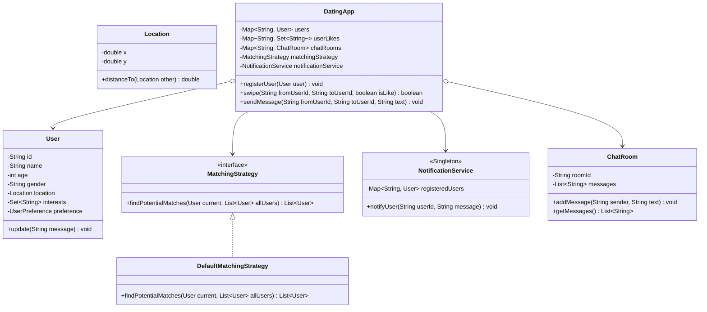

# 27. Build Tinder — Dating Site — LLD Case Study

> 💡 **Quick Revision Anchor**
> - **Domain:** Online Dating & Social Discovery Platform (Tinder / Bumble / Hinge LLD)
> - **Key Architectural Patterns:**
>   - **Observer Pattern:** `NotificationService` alerts users immediately when a mutual match occurs or a new message arrives.
>   - **Strategy Pattern:** `MatchingStrategy` encapsulates recommendation algorithms (filtering by distance, age range, gender preference, and shared interests).
>   - **Mutual Match State Machine:** Swiping right registers intent; a bilateral like triggers state transition to "Match" and unlocks a dedicated `ChatRoom`.
>   - **Facade Pattern:** `DatingApp` serves as the client-facing orchestrator for onboarding, swiping, recommendation feeds, and messaging.

---

## 1. Problem Statement & Requirements

We are designing the Low-Level Architecture for a location-based dating platform like **Tinder**.

### Functional Requirements:
1. **User Profile Management:**
   - Create profile with ID, Name, Age, Gender, Location (`x, y`), and a set of Interests.
   - Configure partner preferences (target gender, age range, max distance).
2. **Recommendation Feed (Candidate Discovery):**
   - Provide a feed of potential matches filtered by user preferences and proximity.
3. **Swipe Engine:**
   - Support `SWIPE_RIGHT` (Like) and `SWIPE_LEFT` (Pass).
   - Track like history per user.
4. **Mutual Matching:**
   - When User A likes User B, check if User B has already liked User A.
   - If bilateral like exists:
     - Flag as **"It's a Match!"**.
     - Notify both users via real-time notification alerts.
     - Automatically create and unlock a private `ChatRoom`.
5. **Gated Chat & Messaging:**
   - Users can **only** exchange messages if they have mutually matched.

---

## 2. Core Entities & Architectural Flow

```
                      [DatingApp (Facade)]
                               │
       ┌───────────────────────┼───────────────────────┐
       ▼                       ▼                       ▼
┌──────────────┐       ┌──────────────┐       ┌─────────────────┐
│ User Service │       │ Match Engine │       │ Chat & Messages │
│ & Profiles   │       │(Swipe Track) │       │ (Mutual Gated)  │
└──────────────┘       └───────┬──────┘       └─────────────────┘
                               │
             ┌─────────────────┴─────────────────┐
             ▼                                   ▼
   MatchingStrategy                     NotificationService
(Distance, Age, Interests)              (Observer Pattern)
```

### The Mutual Match Lifecycle:
```
User A swipes RIGHT on User B
            │
            ▼
Record in userLikesMap: A ➔ {B}
            │
            ▼
Does User B already like User A? (B ➔ {A}?)
         /     \
       NO       YES (Mutual Match!)
       │         │
    Wait for     ├──▶ Notify User A ("It's a Match with User B!")
    User B swipe ├──▶ Notify User B ("It's a Match with User A!")
                 └──▶ Create private ChatRoom (id: "A_B")
```

---

## 3. Architecture & Class Diagram



---

## 4. Java Implementation

### Step 1: User, Location & Preference Models
```java
import java.util.*;

public class Location {
    private final double x;
    private final double y;

    public Location(double x, double y) {
        this.x = x;
        this.y = y;
    }

    public double distanceTo(Location other) {
        return Math.sqrt(Math.pow(this.x - other.x, 2) + Math.pow(this.y - other.y, 2));
    }
}

public class UserPreference {
    private final String preferredGender;
    private final int minAge;
    private final int maxAge;
    private final double maxDistanceKm;

    public UserPreference(String preferredGender, int minAge, int maxAge, double maxDistanceKm) {
        this.preferredGender = preferredGender;
        this.minAge = minAge;
        this.maxAge = maxAge;
        this.maxDistanceKm = maxDistanceKm;
    }

    public String getPreferredGender() { return preferredGender; }
    public int getMinAge() { return minAge; }
    public int getMaxAge() { return maxAge; }
    public double getMaxDistanceKm() { return maxDistanceKm; }
}

// User class acts as an Observer for notifications
public class User {
    private final String id;
    private final String name;
    private final int age;
    private final String gender;
    private final Location location;
    private final Set<String> interests;
    private final UserPreference preference;

    public User(String id, String name, int age, String gender, Location location, 
                Set<String> interests, UserPreference preference) {
        this.id = id;
        this.name = name;
        this.age = age;
        this.gender = gender;
        this.location = location;
        this.interests = interests;
        this.preference = preference;
    }

    // Observer callback
    public void onNotification(String alertMessage) {
        System.out.println("🔔 [Push Notification to " + name + "]: " + alertMessage);
    }

    public String getId() { return id; }
    public String getName() { return name; }
    public int getAge() { return age; }
    public String getGender() { return gender; }
    public Location getLocation() { return location; }
    public Set<String> getInterests() { return interests; }
    public UserPreference getPreference() { return preference; }
}
```

---

### Step 2: Observer Notification Engine
```java
public class NotificationService {
    private static NotificationService instance;
    private final Map<String, User> userRegistry = new HashMap<>();

    private NotificationService() {}

    public static synchronized NotificationService getInstance() {
        if (instance == null) instance = new NotificationService();
        return instance;
    }

    public void registerUser(User user) {
        userRegistry.put(user.getId(), user);
    }

    public void notifyUser(String userId, String message) {
        User user = userRegistry.get(userId);
        if (user != null) {
            user.onNotification(message);
        }
    }
}
```

---

### Step 3: Recommendation Feed (Strategy Pattern)
```java
public interface MatchingStrategy {
    List<User> getCandidateFeed(User current, List<User> allUsers, Set<String> alreadySwiped);
}

public class DefaultMatchingStrategy implements MatchingStrategy {
    @Override
    public List<User> getCandidateFeed(User current, List<User> allUsers, Set<String> alreadySwiped) {
        List<User> candidates = new ArrayList<>();
        UserPreference pref = current.getPreference();

        for (User u : allUsers) {
            if (u.getId().equals(current.getId())) continue; // Skip self
            if (alreadySwiped.contains(u.getId())) continue; // Skip already swiped

            // 1. Gender preference
            if (!pref.getPreferredGender().equalsIgnoreCase("ANY") &&
                !u.getGender().equalsIgnoreCase(pref.getPreferredGender())) {
                continue;
            }

            // 2. Age filter
            if (u.getAge() < pref.getMinAge() || u.getAge() > pref.getMaxAge()) {
                continue;
            }

            // 3. Proximity / Distance filter
            if (current.getLocation().distanceTo(u.getLocation()) > pref.getMaxDistanceKm()) {
                continue;
            }

            candidates.add(u);
        }

        // Sort candidates by number of shared interests (Higher overlap first)
        candidates.sort((u1, u2) -> {
            long overlap1 = u1.getInterests().stream().filter(current.getInterests()::contains).count();
            long overlap2 = u2.getInterests().stream().filter(current.getInterests()::contains).count();
            return Long.compare(overlap2, overlap1); // Descending
        });

        return candidates;
    }
}
```

---

### Step 4: Gated Chat Room
```java
public class ChatRoom {
    private final String roomId;
    private final List<String> chatHistory = new ArrayList<>();

    public ChatRoom(String userAId, String userBId) {
        // Canonical deterministic room ID (sorted IDs)
        this.roomId = (userAId.compareTo(userBId) < 0) 
            ? userAId + "_" + userBId 
            : userBId + "_" + userAId;
    }

    public void addMessage(String senderName, String text) {
        String msg = senderName + ": " + text;
        chatHistory.add(msg);
        System.out.println("💬 [" + roomId + "] " + msg);
    }

    public String getRoomId() { return roomId; }
    public List<String> getChatHistory() { return chatHistory; }
}
```

---

### Step 5: Tinder App Orchestrator (Facade)
```java
public class DatingApp {
    private final Map<String, User> users = new HashMap<>();
    private final Map<String, Set<String>> userLikes = new HashMap<>();     // User A -> set of liked user IDs
    private final Map<String, Set<String>> allSwiped = new HashMap<>();      // User A -> all swiped IDs (left or right)
    private final Map<String, ChatRoom> chatRooms = new HashMap<>();         // "id1_id2" -> ChatRoom
    private final MatchingStrategy matchingStrategy = new DefaultMatchingStrategy();
    private final NotificationService notificationService = NotificationService.getInstance();

    public void registerUser(User user) {
        users.put(user.getId(), user);
        userLikes.put(user.getId(), new HashSet<>());
        allSwiped.put(user.getId(), new HashSet<>());
        notificationService.registerUser(user);
    }

    public List<User> getDiscoveryFeed(String userId) {
        User user = users.get(userId);
        if (user == null) return Collections.emptyList();
        return matchingStrategy.getCandidateFeed(user, new ArrayList<>(users.values()), allSwiped.get(userId));
    }

    public boolean swipe(String fromUserId, String toUserId, boolean isLike) {
        allSwiped.get(fromUserId).add(toUserId);
        User fromUser = users.get(fromUserId);
        User toUser = users.get(toUserId);

        if (!isLike) {
            System.out.println(fromUser.getName() + " passed on " + toUser.getName());
            return false;
        }

        System.out.println("❤️ " + fromUser.getName() + " swiped RIGHT on " + toUser.getName());
        userLikes.get(fromUserId).add(toUserId);

        // Check for mutual match
        if (userLikes.get(toUserId).contains(fromUserId)) {
            System.out.println("\n🎉 === IT'S A MATCH! " + fromUser.getName() + " & " + toUser.getName() + " === 🎉");

            // 1. Create and unlock ChatRoom
            ChatRoom room = new ChatRoom(fromUserId, toUserId);
            chatRooms.put(room.getRoomId(), room);

            // 2. Trigger real-time notifications via Observer Pattern
            notificationService.notifyUser(fromUserId, "You matched with " + toUser.getName() + "! Start chatting.");
            notificationService.notifyUser(toUserId, "You matched with " + fromUser.getName() + "! Start chatting.");
            return true;
        }

        return false;
    }

    public void sendMessage(String fromUserId, String toUserId, String text) {
        String roomId = (fromUserId.compareTo(toUserId) < 0) ? fromUserId + "_" + toUserId : toUserId + "_" + fromUserId;
        ChatRoom room = chatRooms.get(roomId);

        if (room == null) {
            System.out.println("❌ Cannot send message: You can only chat with mutual matches!");
            return;
        }

        User sender = users.get(fromUserId);
        room.addMessage(sender.getName(), text);
        notificationService.notifyUser(toUserId, "New message from " + sender.getName() + ": " + text);
    }
}
```

---

### Step 6: Client Demonstration
```java
public class Main {
    public static void main(String[] args) {
        DatingApp app = new DatingApp();

        // 1. Onboard Rohan
        User rohan = new User("u1", "Rohan", 25, "Male", new Location(0, 0),
                Set.of("Hiking", "Music", "Startups"),
                new UserPreference("Female", 22, 28, 15.0));

        // 2. Onboard Neha
        User neha = new User("u2", "Neha", 24, "Female", new Location(2, 3),
                Set.of("Music", "Startups", "Photography"),
                new UserPreference("Male", 23, 29, 20.0));

        app.registerUser(rohan);
        app.registerUser(neha);

        // 3. Rohan discovers feed and likes Neha
        System.out.println("=== Rohan discovers candidates ===");
        List<User> rohanFeed = app.getDiscoveryFeed("u1");
        for (User u : rohanFeed) {
            System.out.println("Found in feed: " + u.getName() + " (" + u.getAge() + ", " + u.getGender() + ")");
        }

        System.out.println("\n--- Rohan Swipes ---");
        app.swipe("u1", "u2", true); // Rohan likes Neha (No match yet)

        // 4. Rohan attempts to message before mutual match
        System.out.println("\n--- Rohan attempts to message Neha prematurely ---");
        app.sendMessage("u1", "u2", "Hey Neha!");

        // 5. Neha swiped right on Rohan -> Triggers Mutual Match!
        System.out.println("\n--- Neha Swipes ---");
        app.swipe("u2", "u1", true); // Mutual Match!

        // 6. Now they can chat
        System.out.println("\n--- Mutual Chat Unlocked ---");
        app.sendMessage("u1", "u2", "Hey Neha! Great to connect!");
        app.sendMessage("u2", "u1", "Hey Rohan! Loved your startup interest!");
    }
}
```

### Execution Output:
```text
=== Rohan discovers candidates ===
Found in feed: Neha (24, Female)

--- Rohan Swipes ---
❤️ Rohan swiped RIGHT on Neha

--- Rohan attempts to message Neha prematurely ---
❌ Cannot send message: You can only chat with mutual matches!

--- Neha Swipes ---
❤️ Neha swiped RIGHT on Rohan

🎉 === IT'S A MATCH! Neha & Rohan === 🎉
🔔 [Push Notification to Rohan]: You matched with Neha! Start chatting.
🔔 [Push Notification to Neha]: You matched with Rohan! Start chatting.

--- Mutual Chat Unlocked ---
💬 [u1_u2] Rohan: Hey Neha! Great to connect!
🔔 [Push Notification to Neha]: New message from Rohan: Hey Neha! Great to connect!
💬 [u1_u2] Neha: Hey Rohan! Loved your startup interest!
🔔 [Push Notification to Rohan]: New message from Neha: Hey Rohan! Loved your startup interest!
```

---

## 5. Summary of Design Patterns Applied

| Pattern | Component | Purpose in Tinder Case Study |
| :--- | :--- | :--- |
| **Observer Pattern** | `NotificationService` | Broadcasts real-time push alerts on matches and chat messages. |
| **Strategy Pattern** | `MatchingStrategy` | Swappable discovery algorithms (Geo-distance, Elo rating, interest overlap). |
| **State / Gated Access** | `DatingApp.swipe()` | Controls transition from single like to mutual match and unlocks `ChatRoom`. |
| **Facade Pattern** | `DatingApp` | Unified facade for onboarding, feeds, swiping, and messaging. |

---

## 6. Interview Perspective

- **Q: How to handle 10,000 swipes per second at scale?**
  *A: In production, swipes are written asynchronously into Redis Sets (`SADD user:u1:likes u2`). Checking mutual match is an instant $O(1)$ set membership check (`SISMEMBER user:u2:likes u1`). Match events are published to a Kafka topic for notification and chat creation workers.*
- **Q: How to avoid showing already swiped profiles?**
  *A: Maintain a Bloom filter or Redis Set per user tracking `seen_user_ids`. Filter candidates at query time.*
- **Q: How would you implement Super Likes?**
  *A: A Super Like flags the recommendation feed of the receiver immediately to surface the sender with a distinct border before they even swipe.*
