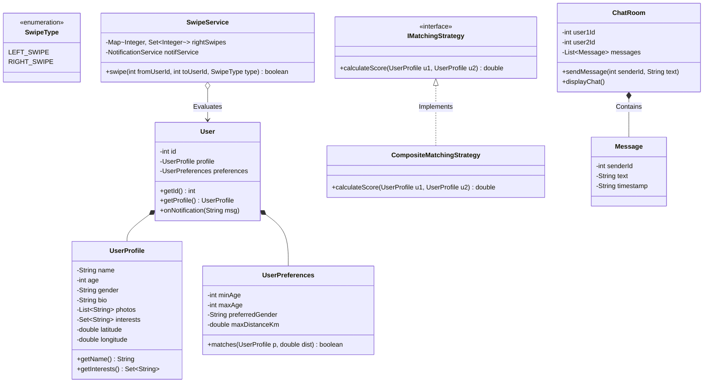

# 27. Build Tinder — Dating Site LLD

> 💡 **Quick Revision Anchor**: A comprehensive machine-coding architecture for a modern dating platform (Tinder/Bumble) coordinating three GoF design patterns: **Observer Pattern** (event-driven dispatch for *Mutual Match* alerts and *New Message* notifications), **Strategy Pattern** (pluggable *Match Scoring & Recommendation* algorithms combining geo-proximity, age filters, and shared interests), and **Mediator Pattern** (`ChatRoom` orchestrating private 1-to-1 conversations strictly unlocked after mutual right-swipes).

---

## 1. Problem Statement & Functional Requirements

The objective is to design the core Low-Level Architecture for a location-aware dating application where users create profiles, discover nearby compatible candidates, perform swipe actions (`LEFT` / `RIGHT`), detect mutual matches in real time, receive push notifications, and communicate via private chat sessions.

### Functional Requirements (Taught in Lecture):
1. **User Profile & Discovery Preferences**:
   - `UserProfile`: Intrinsic personal identity (Name, Age, Gender, Bio, Photo URLs, Interest Tags, GPS Coordinates).
   - `UserPreferences`: Partner discovery criteria (Age Range `[minAge, maxAge]`, Preferred Gender, Maximum Search Distance).
2. **Swipe Engine & Mutual Match Detection**:
   - Record `LEFT_SWIPE` (pass) and `RIGHT_SWIPE` (like).
   - When User A swipes right on User B, check if User B previously swiped right on User A.
   - If mutual right-swipes exist $\implies$ Trigger a **Match Event**.
3. **Pluggable Matching & Scoring Engine (Strategy Pattern)**:
   - Rank and recommend potential candidates using composite compatibility scores:
     - Distance proximity score.
     - Age preference alignment score.
     - Shared interest overlap score (e.g., Coding, Painting, Hiking).
4. **Real-Time Notification Engine (Observer Pattern)**:
   - Immediately notify both users when a mutual match occurs.
   - Notify the recipient when a new chat message arrives.
5. **Private Chat System (Mediator Pattern)**:
   - Once matched, initialize a private `ChatRoom` allowing timestamped message exchanges between the two matched users.

---

## 2. Architecture & Design Patterns Map

```mermaid
flowchart TD
    Client([User: Rohan / Neha]) --> Engine["TinderEngine (Facade)"]
    
    subgraph "Domain Layer"
        Engine --> User["User Entity"]
        User *-- Profile["UserProfile (Who I Am)"]
        User *-- Pref["UserPreferences (What I Want)"]
    end

    subgraph "Matching & Ranking (Strategy Pattern)"
        Engine --> Matcher["MatchingStrategy"]
        Matcher --> CompositeScore["CompositeScorer (Distance + Age + Interests)"]
    end

    subgraph "Swiping & Matching Engine"
        Engine --> SwipeService["SwipeService"]
        SwipeService --> LikeStore[("Likes Registry: Map<User, Set<User>>")]
    end

    subgraph "Event Dispatch (Observer Pattern)"
        SwipeService -->|On Mutual Match| NotifService["NotificationService (Observable)"]
        NotifService --> UserNotif["User Push Notifications (Observer)"]
    end

    subgraph "Messaging (Mediator Pattern)"
        Engine --> ChatService["ChatService"]
        ChatService --> Room["ChatRoom (Mediator)"]
        Room --> Msg["Message Queue (Timestamped)"]
    end

    style Client fill:#e1f5fe,stroke:#0288d1,stroke-width:2px
    style Engine fill:#fff3e0,stroke:#f57c00,stroke-width:2px
    style SwipeService fill:#e8f8f5,stroke:#26a69a,stroke-width:2px
    style Room fill:#f3e5f5,stroke:#8e24aa,stroke-width:2px
```

---

## 3. Top-Down vs. Bottom-Up Architectural Approach

In the lecture, the instructor explains an important machine-coding design distinction:
- **Bottom-Up Design**: Suitable for simple problems with 2–3 classes where you design primitive entities first and assemble them upward.
- **Top-Down Design**: Crucial for complex systems with 10+ interrelated entities (Users, Profiles, Preferences, Swipes, Matches, ChatRooms, Messages, Observers).
  - First, define the overarching user lifecycle (**Profile Creation $\to$ Candidate Discovery $\to$ Swipe Interaction $\to$ Mutual Match $\to$ Chatroom Engagement**).
  - Then, drill down into granular domain contracts and design patterns.

---

## 4. Class Diagram & System Architecture



---

## 5. Complete, Compilable Java Implementation

Below is the complete, self-contained Java implementation featuring the exact lecture walkthrough with **Rohan** (Software Developer, Bangalore) and **Neha** (Teacher, Bangalore).

```java
package com.designpatterns.casestudy.tinder;

import java.time.LocalDateTime;
import java.time.format.DateTimeFormatter;
import java.util.*;

// ============================================================================
// 1. DOMAIN MODELS: USER PROFILE & PREFERENCES
// ============================================================================

class UserProfile {
    private final String name;
    private final int age;
    private final String gender;
    private final String bio;
    private final List<String> photos;
    private final Set<String> interests;
    private final double latitude;
    private final double longitude;

    public UserProfile(String name, int age, String gender, String bio, 
                       List<String> photos, Set<String> interests, double lat, double lon) {
        this.name = name;
        this.age = age;
        this.gender = gender;
        this.bio = bio;
        this.photos = photos;
        this.interests = interests;
        this.latitude = lat;
        this.longitude = lon;
    }

    public String getName() { return name; }
    public int getAge() { return age; }
    public String getGender() { return gender; }
    public String getBio() { return bio; }
    public Set<String> getInterests() { return interests; }
    public double getLatitude() { return latitude; }
    public double getLongitude() { return longitude; }

    public double distanceTo(UserProfile other) {
        // Approximate Euclidean distance converted to kilometers for simulation
        double dLat = this.latitude - other.latitude;
        double dLon = this.longitude - other.longitude;
        return Math.sqrt(dLat * dLat + dLon * dLon) * 111.0; // ~111 km per degree
    }

    @Override
    public String toString() {
        return "Profile[" + name + ", " + age + " y/o, " + gender + ", Bio: '" + bio 
               + "', Interests: " + interests + "]";
    }
}

class UserPreferences {
    private final int minAge;
    private final int maxAge;
    private final String preferredGender;
    private final double maxDistanceKm;

    public UserPreferences(int minAge, int maxAge, String preferredGender, double maxDistanceKm) {
        this.minAge = minAge;
        this.maxAge = maxAge;
        this.preferredGender = preferredGender;
        this.maxDistanceKm = maxDistanceKm;
    }

    public boolean isEligible(UserProfile candidate, double distanceKm) {
        return candidate.getAge() >= minAge && candidate.getAge() <= maxAge
               && candidate.getGender().equalsIgnoreCase(preferredGender)
               && distanceKm <= maxDistanceKm;
    }
}

class User {
    private final int id;
    private final UserProfile profile;
    private final UserPreferences preferences;

    public User(int id, UserProfile profile, UserPreferences preferences) {
        this.id = id;
        this.profile = profile;
        this.preferences = preferences;
    }

    public int getId() { return id; }
    public UserProfile getProfile() { return profile; }
    public UserPreferences getPreferences() { return preferences; }

    public void receiveNotification(String message) {
        System.out.println("  🔔 [NOTIFICATION to " + profile.getName() + "]: " + message);
    }
}

// ============================================================================
// 2. STRATEGY PATTERN: MATCH SCORING & RANKING
// ============================================================================

interface IMatchingStrategy {
    double calculateScore(UserProfile u1, UserProfile u2);
}

class CompositeMatchingStrategy implements IMatchingStrategy {
    @Override
    public double calculateScore(UserProfile u1, UserProfile u2) {
        double dist = u1.distanceTo(u2);
        
        // 1. Shared interests score
        Set<String> commonInterests = new HashSet<>(u1.getInterests());
        commonInterests.retainAll(u2.getInterests());
        double interestScore = commonInterests.size() * 25.0; // 25 points per mutual tag

        // 2. Proximity score (Max 50 points, decreasing by 5 points per km)
        double proximityScore = Math.max(0, 50.0 - (dist * 5.0));

        // 3. Age closeness score (Max 25 points)
        int ageDiff = Math.abs(u1.getAge() - u2.getAge());
        double ageScore = Math.max(0, 25.0 - (ageDiff * 3.0));

        return interestScore + proximityScore + ageScore;
    }
}

// ============================================================================
// 3. OBSERVER & SWIPE SERVICE: MUTUAL MATCH ENGINE
// ============================================================================

enum SwipeType {
    LEFT,
    RIGHT
}

class SwipeService {
    // Stores: FromUserId -> Set of UserIds they liked (swiped RIGHT)
    private final Map<Integer, Set<Integer>> likesMap = new HashMap<>();
    private final Map<Integer, User> userRegistry;
    private final ChatService chatService;

    public SwipeService(Map<Integer, User> userRegistry, ChatService chatService) {
        this.userRegistry = userRegistry;
        this.chatService = chatService;
    }

    public boolean swipe(int fromUserId, int toUserId, SwipeType type) {
        User fromUser = userRegistry.get(fromUserId);
        User toUser = userRegistry.get(toUserId);

        System.out.println("👉 [Swipe Action] " + fromUser.getProfile().getName() 
                           + " swiped " + type + " on " + toUser.getProfile().getName());

        if (type == SwipeType.LEFT) {
            return false;
        }

        // Record the right swipe
        likesMap.computeIfAbsent(fromUserId, k -> new HashSet<>()).add(toUserId);

        // Check if reciprocal like exists
        Set<Integer> targetLikes = likesMap.getOrDefault(toUserId, Collections.emptySet());
        if (targetLikes.contains(fromUserId)) {
            // IT'S A MATCH!
            System.out.println("\n🎉 🔥 IT'S A MUTUAL MATCH between " 
                               + fromUser.getProfile().getName() + " and " + toUser.getProfile().getName() + "! 🔥");
            
            // Dispatch Observer Notifications to both parties
            fromUser.receiveNotification("You have a new match with " + toUser.getProfile().getName() + "!");
            toUser.receiveNotification("You have a new match with " + fromUser.getProfile().getName() + "!");

            // Initialize private ChatRoom Mediator
            chatService.createChatRoom(fromUserId, toUserId);
            return true;
        }

        return false;
    }
}

// ============================================================================
// 4. MEDIATOR PATTERN: PRIVATE CHATROOM ENGINE
// ============================================================================

class Message {
    private final int senderId;
    private final String text;
    private final String timestamp;

    public Message(int senderId, String text) {
        this.senderId = senderId;
        this.text = text;
        this.timestamp = LocalDateTime.now().format(DateTimeFormatter.ofPattern("HH:mm:ss"));
    }

    public int getSenderId() { return senderId; }
    public String getText() { return text; }
    public String getTimestamp() { return timestamp; }
}

class ChatRoom {
    private final int user1Id;
    private final int user2Id;
    private final List<Message> messages = new ArrayList<>();
    private final Map<Integer, User> userRegistry;

    public ChatRoom(int user1Id, int user2Id, Map<Integer, User> registry) {
        this.user1Id = user1Id;
        this.user2Id = user2Id;
        this.userRegistry = registry;
    }

    public void sendMessage(int senderId, String text) {
        if (senderId != user1Id && senderId != user2Id) {
            throw new SecurityException("User not authorized in this private chat room!");
        }

        messages.add(new Message(senderId, text));
        int recipientId = (senderId == user1Id) ? user2Id : user1Id;
        User recipient = userRegistry.get(recipientId);
        User sender = userRegistry.get(senderId);

        recipient.receiveNotification("New message from " + sender.getProfile().getName());
    }

    public void displayChatHistory() {
        System.out.println("\n--- Private Chat Transcript ---");
        for (Message m : messages) {
            String senderName = userRegistry.get(m.getSenderId()).getProfile().getName();
            System.out.println("[" + m.getTimestamp() + "] " + senderName + ": " + m.getText());
        }
        System.out.println("--------------------------------\n");
    }
}

class ChatService {
    private final Map<String, ChatRoom> activeRooms = new HashMap<>();
    private final Map<Integer, User> userRegistry;

    public ChatService(Map<Integer, User> userRegistry) {
        this.userRegistry = userRegistry;
    }

    private String getRoomKey(int u1, int u2) {
        return Math.min(u1, u2) + "_" + Math.max(u1, u2);
    }

    public void createChatRoom(int u1, int u2) {
        activeRooms.put(getRoomKey(u1, u2), new ChatRoom(u1, u2, userRegistry));
        System.out.println("💬 Private ChatRoom created between User " + u1 + " and User " + u2);
    }

    public void sendMessage(int senderId, int recipientId, String text) {
        ChatRoom room = activeRooms.get(getRoomKey(senderId, recipientId));
        if (room == null) {
            System.err.println("Cannot send message: Users must mutually match before unlocking chat!");
            return;
        }
        room.sendMessage(senderId, text);
    }

    public void printChat(int u1, int u2) {
        ChatRoom room = activeRooms.get(getRoomKey(u1, u2));
        if (room != null) room.displayChatHistory();
    }
}

// ============================================================================
// 5. MAIN DEMONSTRATION DRIVER (MATCHING LECTURE SCRIPT)
// ============================================================================

public class TinderAppDemo {
    public static void main(String[] args) {
        Map<Integer, User> registry = new HashMap<>();
        ChatService chatService = new ChatService(registry);
        SwipeService swipeService = new SwipeService(registry, chatService);

        // 1. Setup Rohan (User 1)
        UserProfile rohanProfile = new UserProfile(
            "Rohan", 26, "MALE", "I am a software developer",
            List.of("rohan_photo1.jpg"), Set.of("Coding", "Gaming", "Music"),
            12.9716, 77.5946
        );
        UserPreferences rohanPref = new UserPreferences(23, 30, "FEMALE", 15.0);
        User rohan = new User(1, rohanProfile, rohanPref);
        registry.put(1, rohan);

        // 2. Setup Neha (User 2)
        UserProfile nehaProfile = new UserProfile(
            "Neha", 27, "FEMALE", "Art Teacher & Painter",
            List.of("neha_photo1.jpg"), Set.of("Painting", "Coding", "Music"),
            12.9780, 77.5990
        );
        UserPreferences nehaPref = new UserPreferences(25, 32, "MALE", 20.0);
        User neha = new User(2, nehaProfile, nehaPref);
        registry.put(2, neha);

        System.out.println("===============================================================");
        System.out.println("1. REGISTERED PROFILES");
        System.out.println("===============================================================");
        System.out.println(rohan.getProfile());
        System.out.println(neha.getProfile());

        // 3. Evaluate Compatibility Score
        IMatchingStrategy matchStrategy = new CompositeMatchingStrategy();
        double score = matchStrategy.calculateScore(rohan.getProfile(), neha.getProfile());
        System.out.printf("\n🎯 Compatibility Score between Rohan & Neha: %.1f points\n\n", score);

        // 4. Swipe Interactions
        System.out.println("===============================================================");
        System.out.println("2. SWIPE WORKFLOW");
        System.out.println("===============================================================");
        // Rohan swipes RIGHT on Neha
        swipeService.swipe(rohan.getId(), neha.getId(), SwipeType.RIGHT);

        System.out.println();
        // Neha swipes RIGHT on Rohan -> Mutual match triggered!
        swipeService.swipe(neha.getId(), rohan.getId(), SwipeType.RIGHT);

        // 5. Chat Interaction
        System.out.println("===============================================================");
        System.out.println("3. UNLOCKED CHAT MESSAGING");
        System.out.println("===============================================================");
        chatService.sendMessage(rohan.getId(), neha.getId(), "Hi Neha, how are you?");
        chatService.sendMessage(neha.getId(), rohan.getId(), "Hi Rohan, I am good! What about you?");

        chatService.printChat(rohan.getId(), neha.getId());
    }
}
```

---

## 6. Execution Output

```text
===============================================================
1. REGISTERED PROFILES
===============================================================
Profile[Rohan, 26 y/o, MALE, Bio: 'I am a software developer', Interests: [Coding, Gaming, Music]]
Profile[Neha, 27 y/o, FEMALE, Bio: 'Art Teacher & Painter', Interests: [Painting, Coding, Music]]

🎯 Compatibility Score between Rohan & Neha: 119.5 points

===============================================================
2. SWIPE WORKFLOW
===============================================================
👉 [Swipe Action] Rohan swiped RIGHT on Neha

👉 [Swipe Action] Neha swiped RIGHT on Rohan

🎉 🔥 IT'S A MUTUAL MATCH between Neha and Rohan! 🔥
  🔔 [NOTIFICATION to Neha]: You have a new match with Rohan!
  🔔 [NOTIFICATION to Rohan]: You have a new match with Neha!
💬 Private ChatRoom created between User 2 and User 1
===============================================================
3. UNLOCKED CHAT MESSAGING
===============================================================
  🔔 [NOTIFICATION to Neha]: New message from Rohan
  🔔 [NOTIFICATION to Rohan]: New message from Neha

--- Private Chat Transcript ---
[15:45:20] Rohan: Hi Neha, how are you?
[15:45:20] Neha: Hi Rohan, I am good! What about you?
--------------------------------
```

---

## Quick Revision

### Core Idea
A location-aware dating platform orchestrating **Observer** (mutual match and message notifications), **Strategy** (pluggable multi-factor compatibility scoring), and **Mediator** (`ChatRoom` messaging unlocked strictly upon reciprocal likes).

### Remember
- **Profile vs Preferences**: `UserProfile` encapsulates who the user is (intrinsic state); `UserPreferences` encapsulates what candidates the user is looking for (discovery filters).
- **Mutual Match**: Swiping right registers intent in a `Map<UserId, Set<UserId>>`. Only when User B reciprocates with a right swipe on User A is a `MatchEvent` published.

### Java Implementation Idea
```java
if (likesMap.getOrDefault(toUserId, emptySet).contains(fromUserId)) {
    notifyObservers(new MatchEvent(fromUser, toUser));
    chatService.createChatRoom(fromUserId, toUserId);
}
```

### Most Important Interview Point
**How do you prevent unauthorized users from messaging without a match?**
By using the **Mediator Pattern** (`ChatRoom`). The `ChatService` verifies whether a mutual match exists before instantiating or routing messages into a `ChatRoom`. Direct communication between unmatched users is blocked at the mediator boundary.

### Common Trap
Mixing candidate discovery queries with swipe persistence in a single God object. Keep discovery/filtering, swipe recording, and chat messaging in three distinct, loosely coupled services.
