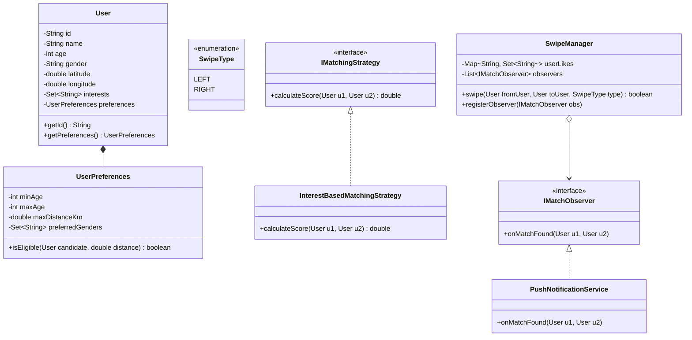

# 27. Build Tinder — Dating Site LLD

> 💡 **Quick Revision Anchor**: A comprehensive machine-coding architecture for a dating app (Tinder/Bumble) combining the **Strategy Pattern** (multi-factor candidate ranking algorithms based on interests and geo-distance), the **Observer Pattern** (real-time mutual match alerts), and **Composition/UML best practices** (UserProfile vs UserPreferences).

---

## 1. Problem Statement & Functional Requirements

Design the core Low-Level Architecture for a dating application where users discover potential partners, swipe left/right, detect mutual matches, receive notifications, and unlock private chat conversations.

### Functional Requirements:
1. **User Profile & Preferences**:
   - `UserProfile`: Intrinsic user attributes (name, gender, age, bio, interests, GPS coordinates).
   - `UserPreferences`: Discovery filters (age range `[minAge, maxAge]`, maximum distance radius, interested genders).
2. **Swipe Engine & Mutual Match Detection**:
   - Record `LEFT` (dislike) or `RIGHT` (like) swipes.
   - When User A likes User B, check if User B has previously liked User A.
   - If mutual like is verified $\rightarrow$ create a **Match**.
3. **Candidate Matching & Recommendation (Strategy Pattern)**:
   - Filter and rank candidates using pluggable algorithms (e.g., Common Interests overlap score, Distance score, or Combined Composite score).
4. **Real-Time Notification (Observer Pattern)**:
   - Notify both parties instantaneously upon a match event.
5. **Chat Unlocking**:
   - Only matched users can initiate a chat session.

---

## 2. Architecture & Design Patterns Map

```mermaid
graph TD
    Client[Mobile Client] --> TM[TinderMatchEngine]
    
    subgraph "Core Domain Layer"
        TM --> User[User Entity]
        User *-- UP[UserProfile]
        User *-- UPref[UserPreferences]
        TM --> SM[SwipeManager]
    end

    subgraph "Recommendation & Ranking (Strategy Pattern)"
        TM --> MS[IMatchingStrategy]
        MS --> InterestStrat[InterestBasedMatchingStrategy]
        MS --> DistStrat[DistanceBasedMatchingStrategy]
    end

    subgraph "Event Dispatch (Observer Pattern)"
        SM --> NotifEngine[MatchNotificationPublisher]
        NotifEngine --> PushNotif[PushNotificationObserver]
    end

    subgraph "Messaging (Mediator Pattern)"
        TM --> Chat[ChatManager]
    end
```

---

## 3. Class Diagram & Relationships



---

## 4. Production Java Implementation

### Step 1: User Domain & Preference Filters
```java
import java.util.*;

public class UserPreferences {
    private final int minAge;
    private final int maxAge;
    private final double maxDistanceKm;
    private final Set<String> preferredGenders;

    public UserPreferences(int minAge, int maxAge, double maxDistanceKm, Set<String> preferredGenders) {
        this.minAge = minAge;
        this.maxAge = maxAge;
        this.maxDistanceKm = maxDistanceKm;
        this.preferredGenders = preferredGenders;
    }

    public boolean isEligible(User candidate, double distanceKm) {
        return candidate.getAge() >= minAge &&
               candidate.getAge() <= maxAge &&
               distanceKm <= maxDistanceKm &&
               preferredGenders.contains(candidate.getGender());
    }
}

public class User {
    private final String id;
    private final String name;
    private final int age;
    private final String gender;
    private final double latitude;
    private final double longitude;
    private final Set<String> interests = new HashSet<>();
    private final UserPreferences preferences;

    public User(String id, String name, int age, String gender, double lat, double lon, 
                Collection<String> interests, UserPreferences preferences) {
        this.id = id;
        this.name = name;
        this.age = age;
        this.gender = gender;
        this.latitude = lat;
        this.longitude = lon;
        this.interests.addAll(interests);
        this.preferences = preferences;
    }

    public String getId() { return id; }
    public String getName() { return name; }
    public int getAge() { return age; }
    public String getGender() { return gender; }
    public double getLatitude() { return latitude; }
    public double getLongitude() { return longitude; }
    public Set<String> getInterests() { return Collections.unmodifiableSet(interests); }
    public UserPreferences getPreferences() { return preferences; }

    public double distanceTo(User other) {
        // Approximate distance calculation
        double dLat = Math.toRadians(other.latitude - this.latitude);
        double dLon = Math.toRadians(other.longitude - this.longitude);
        double a = Math.sin(dLat / 2) * Math.sin(dLat / 2) +
                   Math.cos(Math.toRadians(this.latitude)) * Math.cos(Math.toRadians(other.latitude)) *
                   Math.sin(dLon / 2) * Math.sin(dLon / 2);
        return 6371 * 2 * Math.atan2(Math.sqrt(a), Math.sqrt(1 - a)); // in kilometers
    }
}
```

### Step 2: Strategy Pattern (Candidate Recommendation & Scoring)
```java
public interface IMatchingStrategy {
    double calculateCompatibility(User u1, User u2);
}

// Computes Jaccard similarity coefficient based on shared hobby tags
public class InterestBasedMatchingStrategy implements IMatchingStrategy {
    @Override
    public double calculateCompatibility(User u1, User u2) {
        Set<String> intersection = new HashSet<>(u1.getInterests());
        intersection.retainAll(u2.getInterests());

        Set<String> union = new HashSet<>(u1.getInterests());
        union.addAll(u2.getInterests());

        if (union.isEmpty()) return 0.0;
        return (double) intersection.size() / union.size() * 100.0; // Score out of 100
    }
}
```

### Step 3: Observer Pattern (Match Alerts & Push Notifications)
```java
public interface IMatchObserver {
    void onMatch(User u1, User u2);
}

public class PushNotificationService implements IMatchObserver {
    @Override
    public void onMatch(User u1, User u2) {
        System.out.println("🔥 [PUSH NOTIFICATION] It's a Match! Notifying " 
                           + u1.getName() + " and " + u2.getName() + " to start chatting!");
    }
}
```

### Step 4: Swipe & Mutual Match Manager
```java
public enum SwipeType {
    LEFT,
    RIGHT
}

public class SwipeManager {
    // Stores: UserId -> Set of UserIds they liked (swiped RIGHT)
    private final Map<String, Set<String>> likesMap = new HashMap<>();
    private final List<IMatchObserver> observers = new ArrayList<>();

    public void registerObserver(IMatchObserver observer) {
        observers.add(observer);
    }

    public boolean recordSwipe(User fromUser, User toUser, SwipeType swipeType) {
        System.out.println("[Swipe] " + fromUser.getName() + " swiped " + swipeType + " on " + toUser.getName());

        if (swipeType == SwipeType.LEFT) {
            return false; // Rejection
        }

        // Record the like
        likesMap.computeIfAbsent(fromUser.getId(), k -> new HashSet<>()).add(toUser.getId());

        // Check if the other user already liked this user (Mutual Match)
        Set<String> theirLikes = likesMap.getOrDefault(toUser.getId(), Collections.emptySet());
        if (theirLikes.contains(fromUser.getId())) {
            // MATCH FOUND!
            notifyMatch(fromUser, toUser);
            return true;
        }

        return false;
    }

    private void notifyMatch(User u1, User u2) {
        System.out.println("✨ [MatchEngine] Mutual Match Detected between " + u1.getName() + " & " + u2.getName() + "!");
        for (IMatchObserver observer : observers) {
            observer.onMatch(u1, u2);
        }
    }
}
```

### Step 5: Test Driver & Verification
```java
public class Main {
    public static void main(String[] args) {
        // Setup User A: Alice
        UserPreferences prefAlice = new UserPreferences(24, 32, 25.0, Set.of("MALE"));
        User alice = new User("U1", "Alice", 26, "FEMALE", 12.9716, 77.5946, 
                              List.of("Hiking", "Coffee", "Tech", "Dogs"), prefAlice);

        // Setup User B: Bob
        UserPreferences prefBob = new UserPreferences(22, 29, 30.0, Set.of("FEMALE"));
        User bob = new User("U2", "Bob", 28, "MALE", 12.9352, 77.6245, 
                            List.of("Tech", "Coffee", "Guitar", "Dogs"), prefBob);

        // 1. Evaluate Compatibility Score using Strategy Pattern
        IMatchingStrategy matchStrategy = new InterestBasedMatchingStrategy();
        double compatibility = matchStrategy.calculateCompatibility(alice, bob);
        System.out.println("Profile Compatibility Score: " + String.format("%.1f", compatibility) + "%\n");

        // 2. Setup Swipe Engine & Register Notification Observer
        SwipeManager swipeManager = new SwipeManager();
        swipeManager.registerObserver(new PushNotificationService());

        // 3. Bob swipes RIGHT on Alice (Waiting for mutual response)
        System.out.println(">>> Bob discovers Alice's profile:");
        swipeManager.recordSwipe(bob, alice, SwipeType.RIGHT);

        System.out.println("\n>>> Later, Alice discovers Bob's profile and swipes RIGHT:");
        // 4. Alice swipes RIGHT on Bob -> Triggers Match & Push Notification
        swipeManager.recordSwipe(alice, bob, SwipeType.RIGHT);
    }
}
```

---

## 5. Execution Output Simulation

```text
Profile Compatibility Score: 60.0%

>>> Bob discovers Alice's profile:
[Swipe] Bob swiped RIGHT on Alice

>>> Later, Alice discovers Bob's profile and swipes RIGHT:
[Swipe] Alice swiped RIGHT on Bob
✨ [MatchEngine] Mutual Match Detected between Alice & Bob!
🔥 [PUSH NOTIFICATION] It's a Match! Notifying Alice and Bob to start chatting!
```

---

## 6. Real-World Applications & Interview Checklist

1. **Scalability of Mutual Likes**:
   - In-memory `Map<String, Set<String>>` works for machine-coding interviews.
   - In distributed production (HLD), this is stored in **Redis Sets** (`SADD user:U1:likes U2`, `SISMEMBER user:U2:likes U1`) or a partitioned graph database.
2. **Separation of Profile vs Preferences**:
   - Highlighting the strict difference between who the user **is** (`UserProfile`) vs what the user **wants** (`UserPreferences`) demonstrates clean domain modeling.
