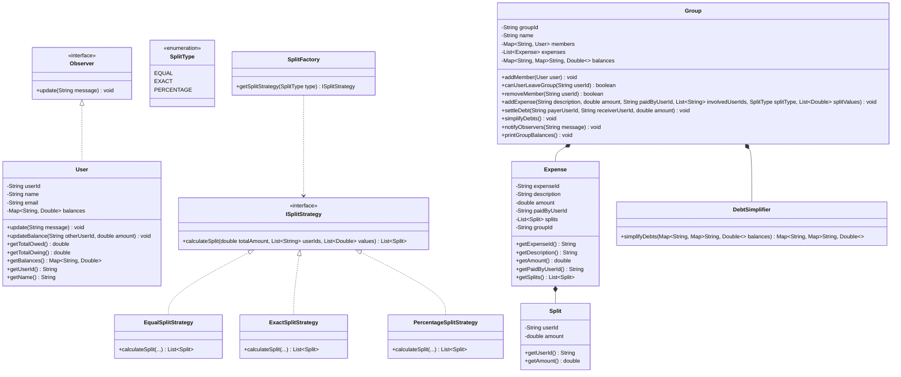

# 31. Build Splitwise Clone LLD

> 💡 **Quick Revision Anchor**: A comprehensive Low-Level Design of an expense sharing and debt settlement platform (Splitwise clone). It integrates the **Strategy Pattern** for splitting algorithms (Equal, Exact, Percentage), an **Observer Pattern** for notifying participants on expenses and settlements, a nested bilateral ledger map (`Map<String, Map<String, Double>>`), an **Invariant Guard** preventing users with non-zero balances from exiting groups, and a **Greedy Min-Cash-Flow Debt Simplification Algorithm** that minimizes the total number of inter-user settlement transactions.

---

## 1. Problem Statement & Functional Requirements

The goal of this lecture is to design a robust, scalable Low-Level Design (LLD) for a collaborative expense-sharing platform like Splitwise.

```text
               ┌──────────────────────────────────────────────────┐
               │              Splitwise Application               │
               └─────────────────────────┬────────────────────────┘
                                         │
                 ┌───────────────────────┴───────────────────────┐
                 ▼                                               ▼
     ┌───────────────────────┐                       ┌───────────────────────┐
     │     Group Expenses    │                       │  Individual Expenses  │
     │  (Hostel / Goa Trip)  │                       │   (1-on-1 Coffee/Cab) │
     └───────────┬───────────┘                       └───────────┬───────────┘
                 │                                               │
     ┌───────────┴───────────┐                       ┌───────────┴───────────┐
     │ Equal / Exact / %     │                       │ Direct Bilateral      │
     │ Split Strategies      │                       │ Balance Sheet         │
     └───────────┬───────────┘                       └───────────────────────┘
                 ▼
     ┌───────────────────────┐
     │ Debt Simplification   │
     │ (Min-Cash-Flow Greedy)│
     └───────────┬───────────┘
                 ▼
     ┌───────────────────────┐
     │ Group Exit Guard      │
     │ (Balance must be 0)   │
     └───────────────────────┘
```

### Functional Requirements
1. **User & Group Management**:
   - Users have a unique `userId`, `name`, `email`, and an internal 1-on-1 balance sheet.
   - Users can create groups (e.g., "Goa Trip", "Hostel Room"), add members, and leave groups.
2. **Expense Splitting Strategies (Strategy Pattern)**:
   - **Equal Split**: Evenly divides the total expense among all participating members.
   - **Exact Split (Unequal)**: Specific currency amounts explicitly defined per participant (validates that total sum matches the expense amount).
   - **Percentage Split**: Specific percentages assigned per participant (validates that total sum equals 100%).
3. **Split Factory**:
   - A centralized factory creates and returns the appropriate strategy based on a `SplitType` enum (`EQUAL`, `EXACT`, `PERCENTAGE`).
4. **Group-Level Balance Sheet (Ledger)**:
   - Tracks bilateral debt relationships inside the group using a nested map: `Map<String, Map<String, Double>>`.
   - Positive balance ($+X$): Member is owed money.
   - Negative balance ($-X$): Member owes money.
   - Values within precision ($< 0.01$) are pruned to clean zero balances.
5. **Group Exit Invariant**:
   - A user **cannot leave a group** if they have any pending balance (they owe money or are owed money by any member).
6. **Debt Settlement & Observer Notifications**:
   - Members can record settlements (e.g., Rohit pays Manish ₹200).
   - Group acts as an **Observable Subject**, notifying all members when an expense is added or settled.
7. **1-on-1 Individual Expenses**:
   - Users can split expenses outside of groups directly with one friend (e.g., Rohit buying a ₹40 coffee for Saurav).
8. **Greedy Debt Simplification Algorithm**:
   - Collapses cyclic and indirect debts into the minimum number of bilateral transactions using a greedy positive-creditor vs negative-debtor matching algorithm.

---

## 2. Core Architecture & Design Patterns

```mermaid
graph TD
    Client[Splitwise / Main Orchestrator] --> Group[Group (Observable Subject)]
    Client --> User[User (Observer)]
    
    subgraph "Observer Pattern"
        Group -->|Notifies| User
        User -.->|implements| Observer[Observer Interface]
    end

    subgraph "Strategy & Factory Pattern"
        Group --> SplitFactory[SplitFactory]
        SplitFactory --> ISplitStrategy[ISplitStrategy]
        ISplitStrategy <|.. EqualSplitStrategy[EqualSplitStrategy]
        ISplitStrategy <|.. ExactSplitStrategy[ExactSplitStrategy]
        ISplitStrategy <|.. PercentageSplitStrategy[PercentageSplitStrategy]
    end

    subgraph "Debt & Settlement Engine"
        Group --> Expense[Expense Entity]
        Expense --> Split[Split (userId, amount)]
        Group --> DebtSimplifier[DebtSimplifier (Greedy Min-Cash-Flow)]
    end
```

---

## 3. Detailed Class Diagram



---

## 4. The Goa Trip Walkthrough & Debt Simplification

To illustrate why debt simplification is needed, the instructor uses a real-world scenario with four friends: **Aditya, Rohit, Saurav, and Manish**.

```text
Initial Setup:
Four friends go on a trip: Aditya, Rohit, Saurav, Manish.

Transaction 1:
- Aditya pays ₹800 for snacks.
- Split EQUALLY among all 4 (₹200 each).
- Debt Ledger:
    Rohit  owes Aditya ₹200
    Saurav owes Aditya ₹200
    Manish owes Aditya ₹200

Transaction 2:
- Manish pays ₹700 for dinner.
- Split EXACTLY among 3 friends (Manish eats ₹300, Aditya eats ₹200, Saurav eats ₹200).
- Debt Ledger from this transaction:
    Aditya owes Manish ₹200
    Saurav owes Manish ₹200

Bilateral Reconciliation:
- Notice Aditya owes Manish ₹200, but Manish already owed Aditya ₹200 from Transaction 1!
- In the bilateral balance sheet, they cancel each other out ($+200 - 200 = 0$).
- Remaining bilateral debts:
    1. Rohit owes Aditya: ₹200
    2. Saurav owes Aditya: ₹200
    3. Saurav owes Manish: ₹200
    Total transactions required naively: 3 transactions.

Greedy Min-Cash-Flow Simplification:
Compute Net Balances across the entire group:
- Aditya:  (+200 from Rohit) + (+200 from Saurav) = +₹400 (Net Creditor)
- Manish:  (+200 from Saurav) = +₹200 (Net Creditor)
- Rohit:   (-200 to Aditya) = -₹200 (Net Debtor)
- Saurav:  (-200 to Aditya) + (-200 to Manish) = -₹400 (Net Debtor)

Greedy Matching:
- Match largest debtor Saurav (-₹400) with largest creditor Aditya (+₹400):
  ==> Saurav pays Aditya ₹400 directly! (Both settled: 0)
- Match remaining debtor Rohit (-₹200) with creditor Manish (+₹200):
  ==> Rohit pays Manish ₹200 directly! (Both settled: 0)

Result: 3 transactions reduced to ONLY 2 transactions!
```

---

## 5. Complete Java Implementation

### Step 1: Observer Pattern (Notification Interface & User)

```java
import java.util.*;

// Observer Interface
interface Observer {
    void update(String message);
}

// User Entity acting as Concrete Observer
class User implements Observer {
    private final String userId;
    private final String name;
    private final String email;
    // 1-on-1 Individual Balances (outside groups): otherUserId -> net amount
    private final Map<String, Double> balances;

    public User(String userId, String name, String email) {
        this.userId = userId;
        this.name = name;
        this.email = email;
        this.balances = new HashMap<>();
    }

    public String getUserId() { return userId; }
    public String getName() { return name; }
    public String getEmail() { return email; }
    public Map<String, Double> getBalances() { return balances; }

    @Override
    public void update(String message) {
        System.out.println("[Notification -> " + name + "]: " + message);
    }

    // Update 1-on-1 bilateral balance
    public void updateBalance(String otherUserId, double amount) {
        double current = balances.getOrDefault(otherUserId, 0.0) + amount;
        if (Math.abs(current) < 0.01) {
            balances.remove(otherUserId);
        } else {
            balances.put(otherUserId, current);
        }
    }

    public double getTotalOwed() {
        return balances.values().stream().filter(v -> v < 0).mapToDouble(Double::doubleValue).sum();
    }

    public double getTotalOwing() {
        return balances.values().stream().filter(v -> v > 0).mapToDouble(Double::doubleValue).sum();
    }
}
```

---

### Step 2: Split Entity, Strategy Pattern & SplitFactory

```java
// Enumeration of supported split strategies
enum SplitType {
    EQUAL,
    EXACT,
    PERCENTAGE
}

// Value object representing a member's split obligation
class Split {
    private final String userId;
    private final double amount;

    public Split(String userId, double amount) {
        this.userId = userId;
        this.amount = amount;
    }

    public String getUserId() { return userId; }
    public double getAmount() { return amount; }
}

// Strategy Interface
interface ISplitStrategy {
    List<Split> calculateSplit(double totalAmount, List<String> userIds, List<Double> values);
}

// 1. Equal Split Strategy
class EqualSplitStrategy implements ISplitStrategy {
    @Override
    public List<Split> calculateSplit(double totalAmount, List<String> userIds, List<Double> values) {
        if (userIds == null || userIds.isEmpty()) {
            throw new IllegalArgumentException("User list cannot be empty for equal split.");
        }
        int totalMembers = userIds.size();
        double splitAmount = Math.round((totalAmount / totalMembers) * 100.0) / 100.0;
        List<Split> splits = new ArrayList<>();
        double runningSum = 0.0;

        for (int i = 0; i < totalMembers - 1; i++) {
            splits.add(new Split(userIds.get(i), splitAmount));
            runningSum += splitAmount;
        }
        // Assign residual fraction to last user to prevent rounding leakage
        double lastAmount = Math.round((totalAmount - runningSum) * 100.0) / 100.0;
        splits.add(new Split(userIds.get(totalMembers - 1), lastAmount));

        return splits;
    }
}

// 2. Exact Split Strategy
class ExactSplitStrategy implements ISplitStrategy {
    @Override
    public List<Split> calculateSplit(double totalAmount, List<String> userIds, List<Double> values) {
        if (values == null || values.size() != userIds.size()) {
            throw new IllegalArgumentException("Exact values count must match users count.");
        }
        double sum = 0.0;
        for (double v : values) sum += v;

        if (Math.abs(sum - totalAmount) > 0.01) {
            throw new IllegalArgumentException("Exact split values sum (" + sum + ") does not match total (" + totalAmount + ")");
        }

        List<Split> splits = new ArrayList<>();
        for (int i = 0; i < userIds.size(); i++) {
            splits.add(new Split(userIds.get(i), values.get(i)));
        }
        return splits;
    }
}

// 3. Percentage Split Strategy
class PercentageSplitStrategy implements ISplitStrategy {
    @Override
    public List<Split> calculateSplit(double totalAmount, List<String> userIds, List<Double> values) {
        if (values == null || values.size() != userIds.size()) {
            throw new IllegalArgumentException("Percentage values count must match users count.");
        }
        double sumPercent = 0.0;
        for (double p : values) sumPercent += p;

        if (Math.abs(sumPercent - 100.0) > 0.01) {
            throw new IllegalArgumentException("Percentages must sum to 100%. Current sum: " + sumPercent);
        }

        List<Split> splits = new ArrayList<>();
        double runningSum = 0.0;
        for (int i = 0; i < userIds.size() - 1; i++) {
            double splitAmount = Math.round((totalAmount * (values.get(i) / 100.0)) * 100.0) / 100.0;
            splits.add(new Split(userIds.get(i), splitAmount));
            runningSum += splitAmount;
        }
        double lastAmount = Math.round((totalAmount - runningSum) * 100.0) / 100.0;
        splits.add(new Split(userIds.get(userIds.size() - 1), lastAmount));

        return splits;
    }
}

// Split Factory
class SplitFactory {
    public static ISplitStrategy getSplitStrategy(SplitType type) {
        switch (type) {
            case EQUAL: return new EqualSplitStrategy();
            case EXACT: return new ExactSplitStrategy();
            case PERCENTAGE: return new PercentageSplitStrategy();
            default: throw new IllegalArgumentException("Unknown split type: " + type);
        }
    }
}
```

---

### Step 3: Expense Entity & Greedy Debt Simplifier

```java
// Expense Model
class Expense {
    private final String expenseId;
    private final String description;
    private final double amount;
    private final String paidByUserId;
    private final List<Split> splits;
    private final String groupId;

    public Expense(String expenseId, String description, double amount, String paidByUserId, List<Split> splits, String groupId) {
        this.expenseId = expenseId;
        this.description = description;
        this.amount = amount;
        this.paidByUserId = paidByUserId;
        this.splits = splits;
        this.groupId = groupId;
    }

    public String getExpenseId() { return expenseId; }
    public String getDescription() { return description; }
    public double getAmount() { return amount; }
    public String getPaidByUserId() { return paidByUserId; }
    public List<Split> getSplits() { return splits; }
    public String getGroupId() { return groupId; }
}

// Greedy Min-Cash-Flow Debt Simplifier
class DebtSimplifier {
    public static Map<String, Map<String, Double>> simplifyDebts(Map<String, Map<String, Double>> balances) {
        // Step 1: Calculate Net Balance for each user across the entire group
        Map<String, Double> netBalances = new HashMap<>();

        for (Map.Entry<String, Map<String, Double>> userEntry : balances.entrySet()) {
            String u1 = userEntry.getKey();
            for (Map.Entry<String, Double> debtEntry : userEntry.getValue().entrySet()) {
                double amount = debtEntry.getValue();
                netBalances.put(u1, netBalances.getOrDefault(u1, 0.0) + amount);
            }
        }

        // Step 2: Separate into Creditors (+) and Debtors (-)
        List<Map.Entry<String, Double>> creditors = new ArrayList<>();
        List<Map.Entry<String, Double>> debtors = new ArrayList<>();

        for (Map.Entry<String, Double> entry : netBalances.entrySet()) {
            double val = Math.round(entry.getValue() * 100.0) / 100.0;
            if (val > 0.01) {
                creditors.add(new AbstractMap.SimpleEntry<>(entry.getKey(), val));
            } else if (val < -0.01) {
                debtors.add(new AbstractMap.SimpleEntry<>(entry.getKey(), -val)); // store as positive debt
            }
        }

        // Sort descending to match largest debtor with largest creditor greedily
        creditors.sort((a, b) -> Double.compare(b.getValue(), a.getValue()));
        debtors.sort((a, b) -> Double.compare(b.getValue(), a.getValue()));

        // Step 3: Greedy two-pointer settlement
        Map<String, Map<String, Double>> simplified = new HashMap<>();
        int cIdx = 0, dIdx = 0;

        while (cIdx < creditors.size() && dIdx < debtors.size()) {
            Map.Entry<String, Double> creditor = creditors.get(cIdx);
            Map.Entry<String, Double> debtor = debtors.get(dIdx);

            double settledAmount = Math.min(creditor.getValue(), debtor.getValue());
            settledAmount = Math.round(settledAmount * 100.0) / 100.0;

            String debtorId = debtor.getKey();
            String creditorId = creditor.getKey();

            // Record simplified debt: debtor owes creditor
            simplified.computeIfAbsent(debtorId, k -> new HashMap<>()).put(creditorId, -settledAmount);
            simplified.computeIfAbsent(creditorId, k -> new HashMap<>()).put(debtorId, settledAmount);

            creditor.setValue(creditor.getValue() - settledAmount);
            debtor.setValue(debtor.getValue() - settledAmount);

            if (creditor.getValue() < 0.01) cIdx++;
            if (debtor.getValue() < 0.01) dIdx++;
        }

        return simplified;
    }
}
```

---

### Step 4: Group (Observable Subject, Bilateral Ledger & Invariant Guard)

```java
class Group {
    private final String groupId;
    private final String name;
    private final Map<String, User> members;
    private final List<Expense> expenses;
    // Nested Bilateral Balance Sheet: UserA -> (UserB -> amount)
    // Positive: UserA is owed amount by UserB. Negative: UserA owes UserB.
    private Map<String, Map<String, Double>> balances;

    public Group(String groupId, String name) {
        this.groupId = groupId;
        this.name = name;
        this.members = new HashMap<>();
        this.expenses = new ArrayList<>();
        this.balances = new HashMap<>();
    }

    public void addMember(User user) {
        members.put(user.getUserId(), user);
        balances.putIfAbsent(user.getUserId(), new HashMap<>());
        notifyObservers(user.getName() + " was added to group '" + name + "'");
    }

    // Invariant Guard: A user CANNOT leave the group if they have unsettled balances
    public boolean canUserLeaveGroup(String userId) {
        Map<String, Double> userBalances = balances.get(userId);
        if (userBalances == null) return true;

        for (double amount : userBalances.values()) {
            if (Math.abs(amount) > 0.01) {
                return false; // Still owes or is owed money
            }
        }
        return true;
    }

    public boolean removeMember(String userId) {
        User user = members.get(userId);
        if (user == null) return false;

        if (!canUserLeaveGroup(userId)) {
            System.out.println("[DENIED] " + user.getName() + " cannot leave group '" + name + "'! Outstanding balance exists.");
            return false;
        }

        members.remove(userId);
        balances.remove(userId);
        // Clean references from other members' maps
        for (Map<String, Double> otherMap : balances.values()) {
            otherMap.remove(userId);
        }
        notifyObservers(user.getName() + " left group '" + name + "'. All dues settled.");
        return true;
    }

    public void addExpense(String description, double amount, String paidByUserId,
                           List<String> involvedUserIds, SplitType splitType, List<Double> splitValues) {
        if (!members.containsKey(paidByUserId)) {
            throw new IllegalArgumentException("Payer must be a group member.");
        }

        ISplitStrategy strategy = SplitFactory.getSplitStrategy(splitType);
        List<Split> splits = strategy.calculateSplit(amount, involvedUserIds, splitValues);

        Expense expense = new Expense("EXP-" + (expenses.size() + 1), description, amount, paidByUserId, splits, groupId);
        expenses.add(expense);

        // Update bilateral ledger
        for (Split split : splits) {
            String oweUserId = split.getUserId();
            double splitAmount = split.getAmount();

            if (oweUserId.equals(paidByUserId)) continue;

            // paidByUserId gets +splitAmount from oweUserId
            updateBilateralBalance(paidByUserId, oweUserId, splitAmount);
            // oweUserId owes -splitAmount to paidByUserId
            updateBilateralBalance(oweUserId, paidByUserId, -splitAmount);
        }

        User payer = members.get(paidByUserId);
        notifyObservers("New Expense added: '" + description + "' for ₹" + amount + " paid by " + payer.getName());
    }

    private void updateBilateralBalance(String u1, String u2, double delta) {
        balances.putIfAbsent(u1, new HashMap<>());
        double newBal = balances.get(u1).getOrDefault(u2, 0.0) + delta;
        if (Math.abs(newBal) < 0.01) {
            balances.get(u1).remove(u2);
        } else {
            balances.get(u1).put(u2, newBal);
        }
    }

    // Direct debt settlement between two members
    public void settleDebt(String payerUserId, String receiverUserId, double amount) {
        updateBilateralBalance(payerUserId, receiverUserId, amount);
        updateBilateralBalance(receiverUserId, payerUserId, -amount);

        User payer = members.get(payerUserId);
        User receiver = members.get(receiverUserId);
        notifyObservers("[SETTLEMENT] " + payer.getName() + " paid ₹" + amount + " to " + receiver.getName());
    }

    // Apply greedy simplification
    public void simplifyDebts() {
        this.balances = DebtSimplifier.simplifyDebts(this.balances);
        notifyObservers("Group expenses were simplified to minimize total transactions.");
    }

    public void notifyObservers(String message) {
        for (User user : members.values()) {
            user.update(message);
        }
    }

    public void printGroupBalances() {
        System.out.println("\n=== Balance Sheet for Group: " + name + " ===");
        boolean any = false;
        for (Map.Entry<String, Map<String, Double>> entry : balances.entrySet()) {
            String u1 = entry.getKey();
            String u1Name = members.containsKey(u1) ? members.get(u1).getName() : u1;
            for (Map.Entry<String, Double> debt : entry.getValue().entrySet()) {
                String u2 = debt.getKey();
                String u2Name = members.containsKey(u2) ? members.get(u2).getName() : u2;
                double val = debt.getValue();
                if (val < -0.01) {
                    System.out.printf("  • %s owes %s: ₹%.2f\n", u1Name, u2Name, -val);
                    any = true;
                }
            }
        }
        if (!any) {
            System.out.println("  • All balances settled! Nobody owes anything.");
        }
        System.out.println("===========================================");
    }
}
```

---

### Step 5: Splitwise Orchestrator Service & Test Driver

```java
class SplitwiseService {
    private final Map<String, User> users = new HashMap<>();
    private final Map<String, Group> groups = new HashMap<>();

    public void registerUser(User user) {
        users.put(user.getUserId(), user);
    }

    public Group createGroup(String groupId, String name) {
        Group group = new Group(groupId, name);
        groups.put(groupId, group);
        return group;
    }

    // 1-on-1 Individual expense outside groups
    public void addIndividualExpense(String description, double amount, String paidByUserId, String toUserId) {
        User payer = users.get(paidByUserId);
        User receiver = users.get(toUserId);

        if (payer == null || receiver == null) {
            throw new IllegalArgumentException("Invalid user IDs for individual expense.");
        }

        // Half split for 1-on-1
        double half = amount / 2.0;
        payer.updateBalance(toUserId, half);
        receiver.updateBalance(paidByUserId, -half);

        System.out.printf("[Individual Expense] %s paid ₹%.2f for '%s'. %s owes ₹%.2f\n",
                payer.getName(), amount, description, receiver.getName(), half);
    }
}

public class Main {
    public static void main(String[] args) {
        SplitwiseService splitwise = new SplitwiseService();

        // 1. Create the 4 friends from the lecture
        User aditya = new User("U1", "Aditya", "aditya@test.com");
        User rohit  = new User("U2", "Rohit",  "rohit@test.com");
        User saurav = new User("U3", "Saurav", "saurav@test.com");
        User manish = new User("U4", "Manish", "manish@test.com");

        splitwise.registerUser(aditya);
        splitwise.registerUser(rohit);
        splitwise.registerUser(saurav);
        splitwise.registerUser(manish);

        // 2. Create the "Goa Trip" group
        System.out.println("--- Setup Group ---");
        Group goaTrip = splitwise.createGroup("G1", "Goa Trip");
        goaTrip.addMember(aditya);
        goaTrip.addMember(rohit);
        goaTrip.addMember(saurav);
        goaTrip.addMember(manish);

        // 3. Expense 1: Aditya pays ₹800 Snacks (Equal split among all 4: ₹200 each)
        System.out.println("\n--- Expense 1: Aditya pays ₹800 (Equal) ---");
        goaTrip.addExpense("Snacks", 800.0, "U1",
                List.of("U1", "U2", "U3", "U4"),
                SplitType.EQUAL, null);

        // 4. Expense 2: Manish pays ₹700 Dinner (Exact: Manish ₹300, Aditya ₹200, Saurav ₹200)
        System.out.println("\n--- Expense 2: Manish pays ₹700 (Exact) ---");
        goaTrip.addExpense("Dinner", 700.0, "U4",
                List.of("U4", "U1", "U3"),
                SplitType.EXACT, List.of(300.0, 200.0, 200.0));

        // 5. Print Raw Group Balance Sheet
        goaTrip.printGroupBalances();

        // 6. Simplify Debts
        System.out.println("\n--- Simplifying Debts (Greedy Min-Cash-Flow) ---");
        goaTrip.simplifyDebts();
        goaTrip.printGroupBalances();

        // 7. 1-on-1 Individual Expense outside group: Rohit pays ₹40 Coffee for Saurav
        System.out.println("\n--- Individual 1-on-1 Expense ---");
        splitwise.addIndividualExpense("Coffee", 40.0, "U2", "U3");
        System.out.printf("Rohit's net 1-on-1 balance: ₹%.2f\n", rohit.getTotalOwing());
        System.out.printf("Saurav's net 1-on-1 balance: ₹%.2f\n", saurav.getTotalOwed());

        // 8. Invariant Check: Rohit attempts to leave the group before settling ₹200 owed to Manish
        System.out.println("\n--- Invariant Check: Rohit attempts to leave group ---");
        goaTrip.removeMember("U2");

        // 9. Settle Debt: Rohit pays Manish ₹200
        System.out.println("\n--- Settlement ---");
        goaTrip.settleDebt("U2", "U4", 200.0);
        goaTrip.printGroupBalances();

        // 10. Rohit leaves the group again (Should succeed now)
        System.out.println("\n--- Rohit attempts to leave group again ---");
        goaTrip.removeMember("U2");
    }
}
```

---

## 6. Execution Trace

```text
--- Setup Group ---
[Notification -> Aditya]: Aditya was added to group 'Goa Trip'
[Notification -> Aditya]: Rohit was added to group 'Goa Trip'
[Notification -> Rohit]: Rohit was added to group 'Goa Trip'
[Notification -> Aditya]: Saurav was added to group 'Goa Trip'
[Notification -> Rohit]: Saurav was added to group 'Goa Trip'
[Notification -> Saurav]: Saurav was added to group 'Goa Trip'
[Notification -> Aditya]: Manish was added to group 'Goa Trip'
[Notification -> Rohit]: Manish was added to group 'Goa Trip'
[Notification -> Saurav]: Manish was added to group 'Goa Trip'
[Notification -> Manish]: Manish was added to group 'Goa Trip'

--- Expense 1: Aditya pays ₹800 (Equal) ---
[Notification -> Aditya]: New Expense added: 'Snacks' for ₹800.0 paid by Aditya
[Notification -> Rohit]: New Expense added: 'Snacks' for ₹800.0 paid by Aditya
[Notification -> Saurav]: New Expense added: 'Snacks' for ₹800.0 paid by Aditya
[Notification -> Manish]: New Expense added: 'Snacks' for ₹800.0 paid by Aditya

--- Expense 2: Manish pays ₹700 (Exact) ---
[Notification -> Aditya]: New Expense added: 'Dinner' for ₹700.0 paid by Manish
[Notification -> Rohit]: New Expense added: 'Dinner' for ₹700.0 paid by Manish
[Notification -> Saurav]: New Expense added: 'Dinner' for ₹700.0 paid by Manish
[Notification -> Manish]: New Expense added: 'Dinner' for ₹700.0 paid by Manish

=== Balance Sheet for Group: Goa Trip ===
  • Rohit owes Aditya: ₹200.00
  • Saurav owes Aditya: ₹200.00
  • Saurav owes Manish: ₹200.00
===========================================

--- Simplifying Debts (Greedy Min-Cash-Flow) ---
[Notification -> Aditya]: Group expenses were simplified to minimize total transactions.
[Notification -> Rohit]: Group expenses were simplified to minimize total transactions.
[Notification -> Saurav]: Group expenses were simplified to minimize total transactions.
[Notification -> Manish]: Group expenses were simplified to minimize total transactions.

=== Balance Sheet for Group: Goa Trip ===
  • Rohit owes Manish: ₹200.00
  • Saurav owes Aditya: ₹400.00
===========================================

--- Individual 1-on-1 Expense ---
[Individual Expense] Rohit paid ₹40.00 for 'Coffee'. Saurav owes ₹20.00
Rohit's net 1-on-1 balance: ₹20.00
Saurav's net 1-on-1 balance: -₹20.00

--- Invariant Check: Rohit attempts to leave group ---
[DENIED] Rohit cannot leave group 'Goa Trip'! Outstanding balance exists.

--- Settlement ---
[Notification -> Aditya]: [SETTLEMENT] Rohit paid ₹200.0 to Manish
[Notification -> Rohit]: [SETTLEMENT] Rohit paid ₹200.0 to Manish
[Notification -> Saurav]: [SETTLEMENT] Rohit paid ₹200.0 to Manish
[Notification -> Manish]: [SETTLEMENT] Rohit paid ₹200.0 to Manish

=== Balance Sheet for Group: Goa Trip ===
  • Saurav owes Aditya: ₹400.00
===========================================

--- Rohit attempts to leave group again ---
[Notification -> Aditya]: Rohit left group 'Goa Trip'. All dues settled.
[Notification -> Saurav]: Rohit left group 'Goa Trip'. All dues settled.
[Notification -> Manish]: Rohit left group 'Goa Trip'. All dues settled.
```

---

## 7. Edge Cases & Interview Insights

1. **Floating-Point Precision & Rounding**:
   - Splitting ₹100 among 3 people equals ₹33.3333... per person. If stored naively, the sum is ₹99.99, losing 1 paisa/cent.
   - **Resolution**: Calculate for $N-1$ users with two-decimal rounding, and give the remainder ($100 - \sum \text{first } N-1$) to the last participant or the payer.
2. **Greedy Simplification vs Global Optimal (NP-Hardness)**:
   - While the greedy matching algorithm guarantees reducing $O(N^2)$ bilateral edges to at most $N-1$ transactions in $O(N \log N)$ time, the absolute minimum number of transactions is equivalent to the **Subset Sum / Partition Problem**, which is NP-Complete. For interview purposes, the greedy approach is the standard expected answer.
3. **Concurrency Control in Production**:
   - In distributed systems, balance updates and settlements must run within atomic database transactions (`SELECT ... FOR UPDATE` on group ledger rows) to prevent lost updates when two members add expenses concurrently.

---

## Quick Revision

### Core Idea
A collaborative expense sharing engine maintaining bilateral debt ledgers across groups and individual contacts. Employs the Strategy Pattern to decouple expense division algorithms (Equal, Exact, Percentage) from group management, the Observer Pattern for broadcast updates, and a greedy debt simplifier to minimize settlement transactions.

### Remember
* Nested Ledger representation: `Map<String, Map<String, Double>>` where `balances.get(A).get(B) < 0` means $A$ owes $B$.
* SplitFactory centralizes strategy instantiation based on `SplitType` enum.
* Group Exit Invariant: A user cannot leave a group if `Math.abs(balance) > 0.01` with any group member.
* 1-on-1 individual expenses live on the `User` entity itself to keep personal debts isolated from group dynamics.

### Java Implementation Idea
* `ISplitStrategy` defines `calculateSplit(double totalAmount, List<String> userIds, List<Double> values)`.
* `DebtSimplifier` computes net balances per user ($\sum \text{in} - \sum \text{out}$), partitions into sorted creditors and debtors, and greedily matches them two-pointer style.
* Residual rounding leakage is avoided by assigning the difference to the final split entry.

### Most Important Interview Point
* Explain how the **Greedy Min-Cash-Flow Debt Simplification Algorithm** reduces transaction volume from $O(N^2)$ to at most $N-1$ transactions without altering anyone's net financial balance.

### Common Trap
* Forgetting to update bilateral balances in **both directions** ($A \to B$ is $+X$, $B \to A$ is $-X$), resulting in asymmetric, corrupted balance sheets.
* Allowing users with pending debts to leave groups without an invariant guard check.
