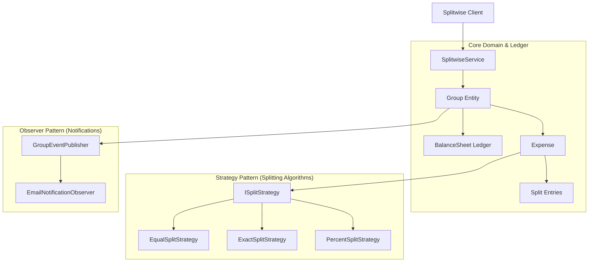
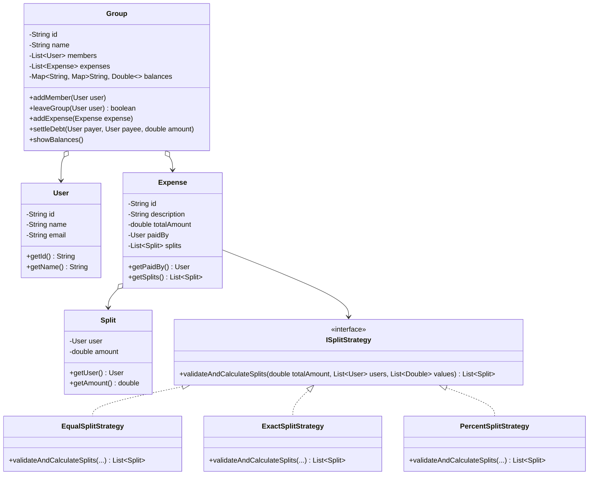

# 31. Build Splitwise Clone LLD

> 💡 **Quick Revision Anchor**: A classic machine coding interview problem designing a collaborative expense sharing engine. Combines the **Strategy Pattern** (Equal, Exact, and Percentage expense splits), a **Ledger/Balance Sheet Map** tracking bilateral debt, an **Invariant Guard** (users cannot leave groups with non-zero balances), and the **Observer Pattern** for settlement notifications.

---

## 1. Problem Statement & Functional Requirements

Design an expense sharing and debt settlement platform (Splitwise clone) capable of tracking group expenses, managing bilateral balances, and calculating individual shares.

### Functional Requirements:
1. **User & Group Hierarchy**:
   - Users can create groups and invite other users.
   - Users can participate in group expenses and individual (one-on-one) non-group expenses.
2. **Flexible Expense Splitting (Strategy Pattern)**:
   - **EQUAL**: Divide total bill equally among all participating users ($Amount / N$).
   - **EXACT**: Explicit cash amount assigned per user (validating that the sum matches total bill).
   - **PERCENT**: Percentage assigned per user (validating that percentages sum up to 100%).
3. **Bilateral Balance Sheet (Ledger)**:
   - Continuously update debt relationships: `User A owes User B ₹X`.
4. **Group Exit Invariant**:
   - A user **cannot leave a group** until all their outstanding balances with other group members are completely settled ($Net Balance = 0$).
5. **Debt Settlement**:
   - Allow user A to pay user B directly, decrementing their bilateral debt ledger.
6. **Activity Notification (Observer Pattern)**:
   - Notify group participants whenever a new expense or debt settlement is recorded.

---

## 2. Architecture & Design Patterns Map



---

## 3. Class Diagram & Relationships



---

## 4. Production Java Implementation

### Step 1: User & Split Models
```java
import java.util.*;

public class User {
    private final String id;
    private final String name;
    private final String email;

    public User(String id, String name, String email) {
        this.id = id;
        this.name = name;
        this.email = email;
    }

    public String getId() { return id; }
    public String getName() { return name; }
    public String getEmail() { return email; }

    @Override
    public boolean equals(Object o) {
        if (this == o) return true;
        if (!(o instanceof User)) return false;
        return Objects.equals(id, ((User) o).id);
    }

    @Override
    public int hashCode() {
        return Objects.hash(id);
    }
}

public class Split {
    private final User user;
    private final double amount;

    public Split(User user, double amount) {
        this.user = user;
        this.amount = amount;
    }

    public User getUser() { return user; }
    public double getAmount() { return amount; }
}
```

### Step 2: Strategy Pattern (Splitting Algorithms)
```java
public interface ISplitStrategy {
    List<Split> calculateSplits(double totalAmount, List<User> participants, List<Double> splitValues);
}

// 1. Equal Split: Splits amount equally among all participants
public class EqualSplitStrategy implements ISplitStrategy {
    @Override
    public List<Split> calculateSplits(double totalAmount, List<User> participants, List<Double> splitValues) {
        List<Split> splits = new ArrayList<>();
        int n = participants.size();
        double equalShare = Math.round((totalAmount / n) * 100.0) / 100.0;
        
        // Handle rounding difference on first participant
        double firstShare = totalAmount - (equalShare * (n - 1));

        for (int i = 0; i < n; i++) {
            double share = (i == 0) ? firstShare : equalShare;
            splits.add(new Split(participants.get(i), share));
        }
        return splits;
    }
}

// 2. Exact Split: Verifies total matches explicit amounts
public class ExactSplitStrategy implements ISplitStrategy {
    @Override
    public List<Split> calculateSplits(double totalAmount, List<User> participants, List<Double> splitValues) {
        if (participants.size() != splitValues.size()) {
            throw new IllegalArgumentException("Number of participants must match number of split values.");
        }
        double sum = splitValues.stream().mapToDouble(Double::doubleValue).sum();
        if (Math.abs(sum - totalAmount) > 0.01) {
            throw new IllegalArgumentException("Exact splits sum (" + sum + ") does not equal total amount (" + totalAmount + ").");
        }

        List<Split> splits = new ArrayList<>();
        for (int i = 0; i < participants.size(); i++) {
            splits.add(new Split(participants.get(i), splitValues.get(i)));
        }
        return splits;
    }
}

// 3. Percentage Split: Verifies percentages add up to 100%
public class PercentageSplitStrategy implements ISplitStrategy {
    @Override
    public List<Split> calculateSplits(double totalAmount, List<User> participants, List<Double> percentages) {
        double totalPercent = percentages.stream().mapToDouble(Double::doubleValue).sum();
        if (Math.abs(totalPercent - 100.0) > 0.01) {
            throw new IllegalArgumentException("Percentages must sum to 100%. Current sum: " + totalPercent);
        }

        List<Split> splits = new ArrayList<>();
        for (int i = 0; i < participants.size(); i++) {
            double share = Math.round((totalAmount * (percentages.get(i) / 100.0)) * 100.0) / 100.0;
            splits.add(new Split(participants.get(i), share));
        }
        return splits;
    }
}
```

### Step 3: Expense Domain
```java
public class Expense {
    private final String id;
    private final String description;
    private final double totalAmount;
    private final User paidBy;
    private final List<Split> splits;

    public Expense(String id, String description, double totalAmount, User paidBy, List<Split> splits) {
        this.id = id;
        this.description = description;
        this.totalAmount = totalAmount;
        this.paidBy = paidBy;
        this.splits = splits;
    }

    public User getPaidBy() { return paidBy; }
    public List<Split> getSplits() { return splits; }
    public double getTotalAmount() { return totalAmount; }
    public String getDescription() { return description; }
}
```

### Step 4: Group & Bilateral Ledger Engine
```java
public class Group {
    private final String id;
    private final String name;
    private final Map<String, User> members = new HashMap<>();
    private final List<Expense> expenses = new ArrayList<>();

    // Ledger: balances.get(A).get(B) = amount A owes B (positive)
    private final Map<String, Map<String, Double>> balances = new HashMap<>();

    public Group(String id, String name) {
        this.id = id;
        this.name = name;
    }

    public void addMember(User user) {
        members.put(user.getId(), user);
        balances.putIfAbsent(user.getId(), new HashMap<>());
        System.out.println("[Group " + name + "] Added member: " + user.getName());
    }

    // Critical Invariant: Cannot leave group if unsettled balances exist
    public boolean leaveGroup(User user) {
        Map<String, Double> userDebt = balances.getOrDefault(user.getId(), Collections.emptyMap());
        for (Map.Entry<String, Double> entry : userDebt.entrySet()) {
            if (Math.abs(entry.getValue()) > 0.01) {
                System.err.println("[DENIED] " + user.getName() + " cannot leave group! Unsettled balance: ₹" 
                                   + entry.getValue() + " with " + entry.getKey());
                return false;
            }
        }
        members.remove(user.getId());
        balances.remove(user.getId());
        System.out.println("[Group " + name + "] " + user.getName() + " left the group successfully.");
        return true;
    }

    public void addExpense(Expense expense) {
        expenses.add(expense);
        User payer = expense.getPaidBy();

        for (Split split : expense.getSplits()) {
            User borrower = split.getUser();
            if (borrower.equals(payer)) continue; // Self-share produces no debt

            double amountOwed = split.getAmount();
            updateBalance(borrower.getId(), payer.getId(), amountOwed);
        }
        System.out.println("[Group " + name + "] Recorded expense: '" + expense.getDescription() 
                           + "' (₹" + expense.getTotalAmount() + " paid by " + payer.getName() + ")");
    }

    // Settle bilateral debt
    public void settleDebt(User payer, User payee, double amount) {
        System.out.println("\n[Settlement] " + payer.getName() + " pays ₹" + amount + " to " + payee.getName());
        updateBalance(payer.getId(), payee.getId(), -amount);
    }

    private void updateBalance(String borrowerId, String payerId, double amount) {
        // borrower owes payer
        balances.get(borrowerId).merge(payerId, amount, Double::sum);
        // payer is owed by borrower (negative balance)
        balances.get(payerId).merge(borrowerId, -amount, Double::sum);
    }

    public void printBalanceSheet() {
        System.out.println("\n=== Balance Sheet for Group: " + name + " ===");
        boolean hasDebts = false;
        for (String userAId : balances.keySet()) {
            for (Map.Entry<String, Double> entry : balances.get(userAId).entrySet()) {
                String userBId = entry.getKey();
                double amount = entry.getValue();
                if (amount > 0.01) {
                    hasDebts = true;
                    User uA = members.get(userAId);
                    User uB = members.get(userBId);
                    System.out.println(" • " + uA.getName() + " owes " + uB.getName() + ": ₹" + String.format("%.2f", amount));
                }
            }
        }
        if (!hasDebts) {
            System.out.println(" • All balances settled! Nobody owes anything.");
        }
        System.out.println("==========================================");
    }
}
```

### Step 5: Test Driver & Verification
```java
public class Main {
    public static void main(String[] args) {
        // 1. Setup Users
        User u1 = new User("U1", "Alice", "alice@gmail.com");
        User u2 = new User("U2", "Bob", "bob@gmail.com");
        User u3 = new User("U3", "Charlie", "charlie@gmail.com");

        // 2. Create Group
        Group goaTrip = new Group("G1", "Goa Trip");
        goaTrip.addMember(u1);
        goaTrip.addMember(u2);
        goaTrip.addMember(u3);

        // 3. Expense 1: Alice pays ₹900 for Dinner (Equal Split: ₹300 each)
        ISplitStrategy equalStrategy = new EqualSplitStrategy();
        List<Split> splits1 = equalStrategy.calculateSplits(900.0, List.of(u1, u2, u3), null);
        Expense dinnerExpense = new Expense("E1", "Seafood Dinner", 900.0, u1, splits1);
        goaTrip.addExpense(dinnerExpense);

        // 4. Expense 2: Bob pays ₹600 for Cab (Exact Split: Charlie ₹400, Bob ₹200)
        ISplitStrategy exactStrategy = new ExactSplitStrategy();
        List<Split> splits2 = exactStrategy.calculateSplits(600.0, List.of(u2, u3), List.of(200.0, 400.0));
        Expense cabExpense = new Expense("E2", "Airport Cab", 600.0, u2, splits2);
        goaTrip.addExpense(cabExpense);

        // 5. Print Balance Sheet
        goaTrip.printBalanceSheet();

        // 6. Charlie tries to leave group without settling (Should fail invariant guard)
        System.out.println("\n>>> Charlie attempts to exit group:");
        goaTrip.leaveGroup(u3);

        // 7. Settle Debts
        goaTrip.settleDebt(u3, u1, 300.0);
        goaTrip.settleDebt(u3, u2, 400.0);
        goaTrip.settleDebt(u2, u1, 300.0);

        goaTrip.printBalanceSheet();

        // 8. Charlie leaves group now that balance is zero (Should succeed)
        System.out.println("\n>>> Charlie attempts to exit group again after settlement:");
        goaTrip.leaveGroup(u3);
    }
}
```

---

## 5. Execution Trace

```text
[Group Goa Trip] Added member: Alice
[Group Goa Trip] Added member: Bob
[Group Goa Trip] Added member: Charlie
[Group Goa Trip] Recorded expense: 'Seafood Dinner' (₹900.0 paid by Alice)
[Group Goa Trip] Recorded expense: 'Airport Cab' (₹600.0 paid by Bob)

=== Balance Sheet for Group: Goa Trip ===
 • Bob owes Alice: ₹300.00
 • Charlie owes Alice: ₹300.00
 • Charlie owes Bob: ₹400.00
==========================================

>>> Charlie attempts to exit group:
[DENIED] Charlie cannot leave group! Unsettled balance: ₹300.0 with U1

[Settlement] Charlie pays ₹300.0 to Alice
[Settlement] Charlie pays ₹400.0 to Bob
[Settlement] Bob pays ₹300.0 to Alice

=== Balance Sheet for Group: Goa Trip ===
 • All balances settled! Nobody owes anything.
==========================================

>>> Charlie attempts to exit group again after settlement:
[Group Goa Trip] Charlie left the group successfully.
```

---

## 6. Real-World Applications & Interview Checklist

1. **Debt Simplification Algorithm (Simplify Expenses feature)**:
   - If Charlie owes Bob ₹400, and Bob owes Alice ₹300 $\rightarrow$ Splitwise simplifies this using a min-cash-flow graph greedy/heap algorithm so Charlie pays Alice ₹300 and Bob ₹100 directly, minimizing the total number of transactions.
2. **Precision & Rounding**:
   - Always round fractional cents/paise systematically and assign remainder to the payer or first member to prevent lost fractions.
3. **Concurrency Control**:
   - In production, balance sheet updates must be enclosed in database transactions with serializable isolation or atomic ledger append operations.
