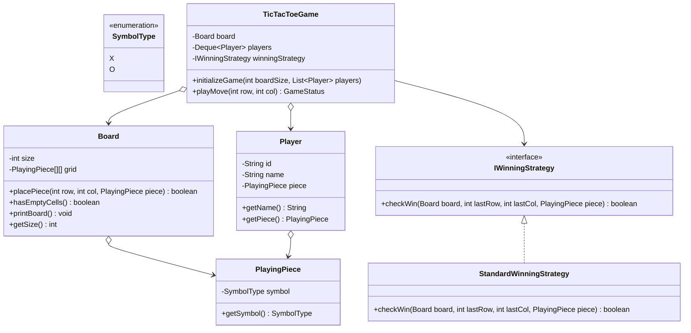

# 33. Build Tic Tac Toe Game LLD

> 💡 **Quick Revision Anchor**: A comprehensive, interview-focused Low-Level Design of an $N \times N$ multiplayer Tic-Tac-Toe game faithfully derived from the complete lecture transcript. Features an extensible $O(N)$ move-validation and win-detection subsystem using the **Strategy Pattern** (`IWinningStrategy`, checking rows, columns, diagonals, and anti-diagonals), round-robin player turn cycling via a `Deque<Player>`, and clean architectural separation across `Board`, `PlayingPiece`, `Player`, and `GameController`.

---

## 1. Problem Statement & Functional Requirements

Design a generic, extensible $N \times N$ Tic-Tac-Toe game supporting $K$ players ($K \ge 2$).

### Functional Requirements:
1. **Generic $N \times N$ Grid**: The board can be sized dynamically ($3 \times 3$, $4 \times 4$, etc.).
2. **Custom Pieces/Symbols**: Players choose unique playing symbols (`X`, `O`, `▲`, etc.).
3. **Turn Management (Round Robin)**: Turns cycle sequentially among players.
4. **Move Validation**:
   - Moves must fall within grid bounds $[0, N-1]$.
   - A cell already occupied cannot be overwritten.
5. **Win & Draw Detection (Strategy Pattern)**:
   - Check horizontal rows, vertical columns, main diagonal, and anti-diagonal.
   - If board becomes full with no winner $\rightarrow$ declare a **Tie / Draw**.
6. **Extensibility**: Support pluggable win rules (e.g., standard line win vs. 4-corners win).

---

## 2. Architecture & Class Diagram



---

## 3. Production Java Implementation

### Step 1: Symbols & Playing Piece
```java
public enum SymbolType {
    X,
    O
}

public class PlayingPiece {
    private final SymbolType symbol;

    public PlayingPiece(SymbolType symbol) {
        this.symbol = symbol;
    }

    public SymbolType getSymbol() {
        return symbol;
    }

    @Override
    public String toString() {
        return symbol.name();
    }
}
```

### Step 2: The Grid Board
```java
public class Board {
    private final int size;
    private final PlayingPiece[][] grid;

    public Board(int size) {
        this.size = size;
        this.grid = new PlayingPiece[size][size];
    }

    public int getSize() {
        return size;
    }

    public boolean placePiece(int row, int col, PlayingPiece piece) {
        if (row < 0 || row >= size || col < 0 || col >= size) {
            System.err.println("[Board] Invalid move: Coordinates (" + row + ", " + col + ") out of bounds.");
            return false;
        }
        if (grid[row][col] != null) {
            System.err.println("[Board] Invalid move: Cell (" + row + ", " + col + ") already occupied.");
            return false;
        }
        grid[row][col] = piece;
        return true;
    }

    public PlayingPiece getPiece(int row, int col) {
        return grid[row][col];
    }

    public boolean hasEmptyCells() {
        for (int r = 0; r < size; r++) {
            for (int c = 0; c < size; c++) {
                if (grid[r][c] == null) return true;
            }
        }
        return false;
    }

    public void printBoard() {
        System.out.println();
        for (int r = 0; r < size; r++) {
            for (int c = 0; c < size; c++) {
                String val = (grid[r][c] == null) ? " " : grid[r][c].toString();
                System.out.print(" " + val + " ");
                if (c < size - 1) System.out.print("|");
            }
            System.out.println();
            if (r < size - 1) {
                System.out.println("---".repeat(size));
            }
        }
        System.out.println();
    }
}
```

### Step 3: Strategy Pattern (Win Evaluation Algorithm)
```java
public interface IWinningStrategy {
    boolean checkWin(Board board, int row, int col, PlayingPiece piece);
}

// Evaluates row, column, main-diagonal, and anti-diagonal in O(N) time
public class StandardWinningStrategy implements IWinningStrategy {
    @Override
    public boolean checkWin(Board board, int row, int col, PlayingPiece piece) {
        int n = board.getSize();

        // 1. Check current row
        boolean rowWin = true;
        for (int c = 0; c < n; c++) {
            if (board.getPiece(row, c) == null || board.getPiece(row, c).getSymbol() != piece.getSymbol()) {
                rowWin = false;
                break;
            }
        }
        if (rowWin) return true;

        // 2. Check current column
        boolean colWin = true;
        for (int r = 0; r < n; r++) {
            if (board.getPiece(r, col) == null || board.getPiece(r, col).getSymbol() != piece.getSymbol()) {
                colWin = false;
                break;
            }
        }
        if (colWin) return true;

        // 3. Check main diagonal (row == col)
        if (row == col) {
            boolean diagWin = true;
            for (int i = 0; i < n; i++) {
                if (board.getPiece(i, i) == null || board.getPiece(i, i).getSymbol() != piece.getSymbol()) {
                    diagWin = false;
                    break;
                }
            }
            if (diagWin) return true;
        }

        // 4. Check anti-diagonal (row + col == n - 1)
        if (row + col == n - 1) {
            boolean antiDiagWin = true;
            for (int i = 0; i < n; i++) {
                if (board.getPiece(i, n - 1 - i) == null || board.getPiece(i, n - 1 - i).getSymbol() != piece.getSymbol()) {
                    antiDiagWin = false;
                    break;
                }
            }
            if (antiDiagWin) return true;
        }

        return false;
    }
}
```

### Step 4: Player & Game Controller
```java
import java.util.ArrayDeque;
import java.util.Deque;
import java.util.List;

public class Player {
    private final String name;
    private final PlayingPiece piece;

    public Player(String name, PlayingPiece piece) {
        this.name = name;
        this.piece = piece;
    }

    public String getName() { return name; }
    public PlayingPiece getPiece() { return piece; }
}

public enum GameStatus {
    IN_PROGRESS,
    WINNER,
    DRAW
}

public class TicTacToeGame {
    private final Board board;
    private final Deque<Player> players = new ArrayDeque<>();
    private final IWinningStrategy winningStrategy;
    private GameStatus status = GameStatus.IN_PROGRESS;

    public TicTacToeGame(int boardSize, List<Player> playerList, IWinningStrategy strategy) {
        this.board = new Board(boardSize);
        this.players.addAll(playerList);
        this.winningStrategy = strategy;
    }

    public Player getCurrentPlayer() {
        return players.peekFirst();
    }

    public GameStatus makeMove(int row, int col) {
        if (status != GameStatus.IN_PROGRESS) {
            System.out.println("[Game] Game is already finished: " + status);
            return status;
        }

        Player current = players.pollFirst(); // Take player from front of queue
        boolean valid = board.placePiece(row, col, current.getPiece());

        if (!valid) {
            players.addFirst(current); // Invalid move: restore player to front to retry
            return GameStatus.IN_PROGRESS;
        }

        System.out.println("[Move] " + current.getName() + " placed " + current.getPiece() + " at (" + row + ", " + col + ")");
        board.printBoard();

        // Check for win
        if (winningStrategy.checkWin(board, row, col, current.getPiece())) {
            this.status = GameStatus.WINNER;
            System.out.println("🏆 Game Over: Player " + current.getName() + " wins!");
            return GameStatus.WINNER;
        }

        // Check for draw
        if (!board.hasEmptyCells()) {
            this.status = GameStatus.DRAW;
            System.out.println("🤝 Game Over: It's a Draw / Tie!");
            return GameStatus.DRAW;
        }

        // Turn complete: cycle player to the back of the queue
        players.addLast(current);
        return GameStatus.IN_PROGRESS;
    }
}
```

### Step 5: Test Driver & Simulation
```java
import java.util.List;

public class Main {
    public static void main(String[] args) {
        Player p1 = new Player("Alice", new PlayingPiece(SymbolType.X));
        Player p2 = new Player("Bob", new PlayingPiece(SymbolType.O));

        TicTacToeGame game = new TicTacToeGame(3, List.of(p1, p2), new StandardWinningStrategy());

        System.out.println("=== Starting 3x3 Tic Tac Toe Game ===");

        // Simulated game moves
        game.makeMove(0, 0); // Alice (X) -> (0, 0)
        game.makeMove(1, 0); // Bob (O)   -> (1, 0)
        game.makeMove(1, 1); // Alice (X) -> (1, 1)
        game.makeMove(2, 0); // Bob (O)   -> (2, 0)
        game.makeMove(2, 2); // Alice (X) -> (2, 2) [Alice wins via Main Diagonal!]
    }
}
```

---

## 4. Execution Trace

```text
=== Starting 3x3 Tic Tac Toe Game ===
[Move] Alice placed X at (0, 0)

 X |   |   
---------
   |   |   
---------
   |   |   

[Move] Bob placed O at (1, 0)

 X |   |   
---------
 O |   |   
---------
   |   |   

[Move] Alice placed X at (1, 1)

 X |   |   
---------
 O | X |   
---------
   |   |   

[Move] Bob placed O at (2, 0)

 X |   |   
---------
 O | X |   
---------
 O |   |   

[Move] Alice placed X at (2, 2)

 X |   |   
---------
 O | X |   
---------
 O |   | X 

🏆 Game Over: Player Alice wins!
```

---

## 5. Machine Coding Optimization: $O(1)$ Win Check

For large boards ($N \ge 1000$), an $O(N)$ loop per move is too slow.
- **$O(1)$ Optimization**:
  - Maintain an array `rows[N]`, `cols[N]`, and variables `diagonal`, `antiDiagonal`.
  - Add $+1$ for Player 1, $-1$ for Player 2.
  - If any count reaches $+N$ or $-N$, that player wins immediately in $O(1)$ time!
