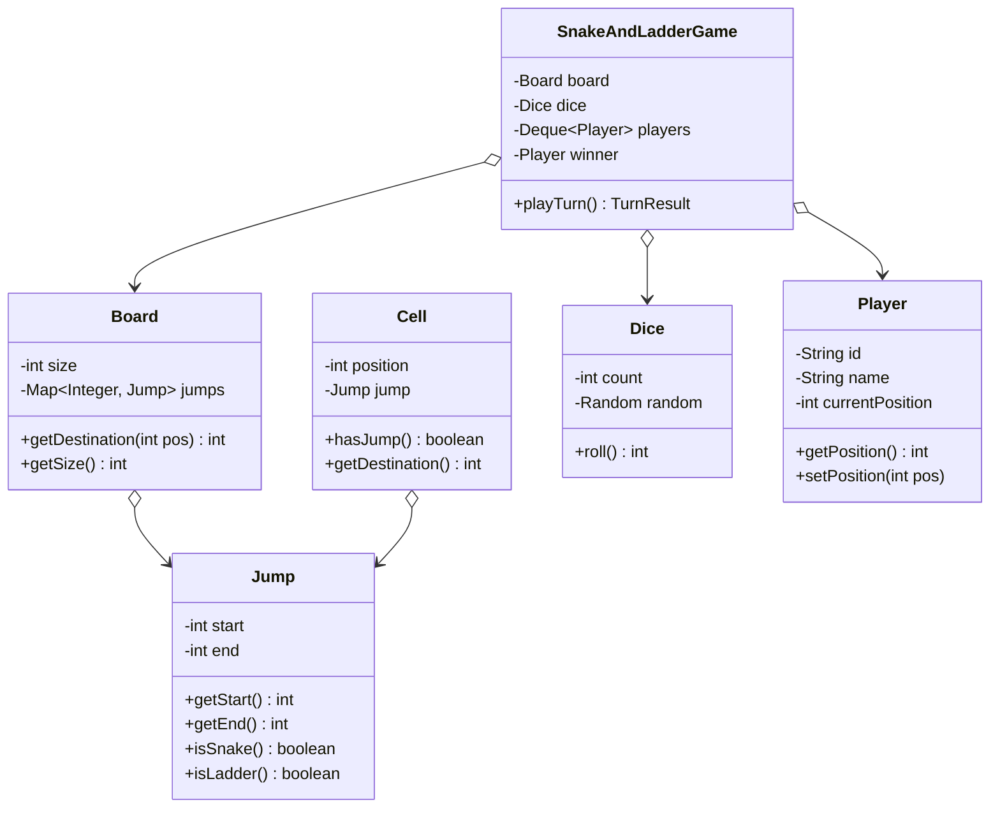

# 34. Build Snake and Ladder Game LLD

> 💡 **Quick Revision Anchor**: A classic Top-Down Machine Coding architecture for **Snake and Ladder**. Models snakes and ladders uniformly using a **`Jump` abstraction** (where `start > end` is a Snake and `start < end` is a Ladder), dynamic dice configurations, a round-robin player queue (`Deque<Player>`), and pluggable board generation (**Strategy Pattern**).

---

## 1. Problem Statement & Requirements

Design a modular, multi-player Snake and Ladder board game.

### Functional Requirements:
1. **Dynamic Board Size**: Support arbitrary board dimensions (default: $100$ cells, indexed $1$ to $N$).
2. **Unified Jump Mechanism**:
   - **Ladder**: Moves player forward (`start < end`).
   - **Snake**: Bites player, sliding them backward (`start > end`).
3. **Pluggable Dice**: Support rolling $K$ dice ($K \ge 1$) with values between $1$ and $6 \times K$.
4. **Turn Management**: Maintain player order using round-robin queuing.
5. **Exact Win Rule**: A player must land **exactly** on cell $100$ to win. If $position + roll > 100$, the move is forfeited for that turn.
6. **Board Setup Strategy (Strategy Pattern)**:
   - Configurable board layouts (Standard classic layout vs. Random difficulty setup).

---

## 2. Architecture & Class Diagram



---

## 3. Production Java Implementation

### Step 1: The Jump Abstraction (Unifying Snake & Ladder)
```java
public class Jump {
    private final int start;
    private final int end;

    public Jump(int start, int end) {
        if (start == end) {
            throw new IllegalArgumentException("Jump start and end cannot be identical.");
        }
        this.start = start;
        this.end = end;
    }

    public int getStart() { return start; }
    public int getEnd() { return end; }

    public boolean isSnake() {
        return start > end;
    }

    public boolean isLadder() {
        return start < end;
    }

    @Override
    public String toString() {
        return isSnake() ? "🐍 Snake (" + start + " -> " + end + ")" 
                         : "🪜 Ladder (" + start + " -> " + end + ")";
    }
}
```

### Step 2: The Board
```java
import java.util.HashMap;
import java.util.Map;

public class Board {
    private final int size;
    private final Map<Integer, Jump> jumps = new HashMap<>();

    public Board(int size) {
        this.size = size;
    }

    public void addJump(Jump jump) {
        // Validation: Jump cannot start from 1 or the winning cell
        if (jump.getStart() <= 1 || jump.getStart() >= size) {
            throw new IllegalArgumentException("Invalid jump position: " + jump.getStart());
        }
        jumps.put(jump.getStart(), jump);
    }

    public int getFinalDestination(int currentPosition) {
        if (jumps.containsKey(currentPosition)) {
            Jump jump = jumps.get(currentPosition);
            System.out.println("   " + jump + " activated!");
            return jump.getEnd();
        }
        return currentPosition;
    }

    public int getSize() {
        return size;
    }
}
```

### Step 3: Dice & Player
```java
import java.util.Random;

public class Dice {
    private final int numberOfDice;
    private final Random random = new Random();

    public Dice(int numberOfDice) {
        this.numberOfDice = Math.max(1, numberOfDice);
    }

    public int roll() {
        int sum = 0;
        for (int i = 0; i < numberOfDice; i++) {
            sum += random.nextInt(6) + 1; // 1 to 6
        }
        return sum;
    }
}

public class Player {
    private final String id;
    private final String name;
    private int position;

    public Player(String id, String name) {
        this.id = id;
        this.name = name;
        this.position = 0; // Starts outside board (position 0)
    }

    public String getName() { return name; }
    public int getPosition() { return position; }
    public void setPosition(int position) { this.position = position; }
}
```

### Step 4: Game Loop Controller
```java
import java.util.ArrayDeque;
import java.util.Deque;
import java.util.List;

public class SnakeAndLadderGame {
    private final Board board;
    private final Dice dice;
    private final Deque<Player> players = new ArrayDeque<>();
    private Player winner = null;

    public SnakeAndLadderGame(Board board, Dice dice, List<Player> playerList) {
        this.board = board;
        this.dice = dice;
        this.players.addAll(playerList);
    }

    public boolean isGameOver() {
        return winner != null;
    }

    public void playTurn() {
        if (isGameOver()) {
            System.out.println("Game already ended! Winner: " + winner.getName());
            return;
        }

        Player current = players.pollFirst();
        int roll = dice.roll();
        System.out.println("\n🎲 " + current.getName() + " (at " + current.getPosition() + ") rolled a " + roll);

        int targetPosition = current.getPosition() + roll;

        // Exact Landing Invariant
        if (targetPosition > board.getSize()) {
            System.out.println("   Exceeds cell " + board.getSize() + "! Turn skipped.");
            players.addLast(current);
            return;
        }

        // Apply Snakes and Ladders
        targetPosition = board.getFinalDestination(targetPosition);
        current.setPosition(targetPosition);
        System.out.println("   " + current.getName() + " moved to cell: " + targetPosition);

        // Check for Win
        if (targetPosition == board.getSize()) {
            this.winner = current;
            System.out.println("\n🎉 WINNER! " + current.getName() + " reached cell " + board.getSize() + "!");
            return;
        }

        // Cycle turn
        players.addLast(current);
    }
}
```

### Step 5: Test Driver & Simulation
```java
import java.util.List;

public class Main {
    public static void main(String[] args) {
        // 1. Create a 100-cell board with classic snakes and ladders
        Board board = new Board(100);

        // Add Ladders (start < end)
        board.addJump(new Jump(4, 25));
        board.addJump(new Jump(13, 46));
        board.addJump(new Jump(33, 70));
        board.addJump(new Jump(50, 91));

        // Add Snakes (start > end)
        board.addJump(new Jump(99, 10));
        board.addJump(new Jump(75, 30));
        board.addJump(new Jump(54, 19));
        board.addJump(new Jump(42, 17));

        // 2. Setup Single Die & Players
        Dice dice = new Dice(1);
        Player p1 = new Player("1", "Alice");
        Player p2 = new Player("2", "Bob");

        SnakeAndLadderGame game = new SnakeAndLadderGame(board, dice, List.of(p1, p2));

        System.out.println("=== Starting Snake & Ladder Match (Alice vs. Bob) ===");
        int turnCount = 0;
        while (!game.isGameOver() && turnCount < 50) {
            turnCount++;
            game.playTurn();
        }
    }
}
```

---

## 4. Output Execution Sample

```text
=== Starting Snake & Ladder Match (Alice vs. Bob) ===

🎲 Alice (at 0) rolled a 4
   🪜 Ladder (4 -> 25) activated!
   Alice moved to cell: 25

🎲 Bob (at 0) rolled a 6
   Bob moved to cell: 6

🎲 Alice (at 25) rolled a 5
   Alice moved to cell: 30

🎲 Bob (at 6) rolled a 4
   Bob moved to cell: 10

...

🎲 Alice (at 95) rolled a 5
   Alice moved to cell: 100

🎉 WINNER! Alice reached cell 100!
```

---

## 5. Machine Coding Interview Edge Cases

1. **Cycle Detection (Infinite Loop Guard)**:
   - What happens if a ladder ends at 50, and a snake starts at 50 back to 4?
   - *Design Guard*: When adding jumps during board setup, perform a cycle check using DFS or a visited set to ensure no chained jump loops exist.
2. **Consecutive Rolls on Six**:
   - In standard family rules, rolling a 6 grants another roll (up to 3 consecutive sixes before turn forfeit). This can be cleanly implemented via a hook in `Dice` or `Game`.
3. **Array vs. Map for Board**:
   - Using `Map<Integer, Jump>` is memory-efficient ($O(\text{number of snakes + ladders})$ instead of allocating an entire 2D object matrix).
