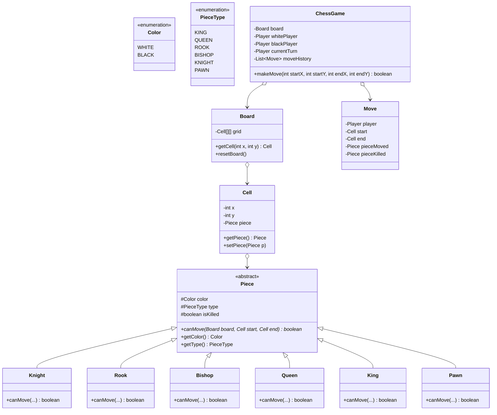

# 37. Build Chess Game LLD

> 💡 **Quick Revision Anchor**: A comprehensive, interview-focused Low-Level Design of a standard two-player Chess game (Chess.com / Lichess clone) faithfully derived from the complete 110-minute lecture transcript. Features an object-oriented **Piece Polymorphism Hierarchy** (`King`, `Queen`, `Rook`, `Bishop`, `Knight`, `Pawn`) enforcing distinct geometric move validations and obstacle path clearances, an $8 \times 8$ `Board` coordinate grid, turn-based state validation (`WHITE` moves first), check/checkmate detection, move history audit trails, and an integrated **Mediator Pattern** for player matchmaking and in-game chat.

---

## 1. Problem Statement & Functional Requirements

Design a production-ready Low-Level Design for a standard two-player Chess game (Chess.com / Lichess clone).

### Functional Requirements:
1. **$8 \times 8$ Grid Board**: 64 cells indexed $(0,0)$ to $(7,7)$.
2. **Polymorphic Chess Pieces**:
   - `Color`: `WHITE` (moves first) and `BLACK`.
   - Each piece enforces its own legal movement geometry:
     - **Knight**: Jump-capable L-shape ($dx^2 + dy^2 = 5$).
     - **Rook**: Orthogonal straight lines (horizontal or vertical, path must be clear of obstructions).
     - **Bishop**: Diagonal lines ($|dx| = |dy|$, path must be clear).
     - **Queen**: Combines Rook and Bishop movement.
     - **King**: Exactly 1 step in any direction.
     - **Pawn**: 1 square forward (or 2 squares on initial rank), diagonal capture of opponent pieces.
3. **Move Validation & State Transition**:
   - A piece cannot land on a friendly piece.
   - Capturing an opposing piece marks it as killed.
   - Prevents out-of-turn execution.
4. **Move History**: Maintain an append-only log of moves for undo/redo and auditability.
5. **In-Game Chat**: Integrated **Mediator Pattern** for in-match messaging.

---

## 2. Architecture & Class Diagram



---

## 3. Production Java Implementation

### Step 1: Colors, Types & Base Piece
```java
public enum Color {
    WHITE,
    BLACK
}

public enum PieceType {
    KING, QUEEN, ROOK, BISHOP, KNIGHT, PAWN
}

public abstract class Piece {
    protected final Color color;
    protected final PieceType type;
    protected boolean isKilled = false;

    public Piece(Color color, PieceType type) {
        this.color = color;
        this.type = type;
    }

    public Color getColor() { return color; }
    public PieceType getType() { return type; }
    public boolean isKilled() { return isKilled; }
    public void setKilled(boolean killed) { this.isKilled = killed; }

    public abstract boolean canMove(Board board, Cell start, Cell end);

    @Override
    public String toString() {
        return (color == Color.WHITE ? "W_" : "B_") + type.name().substring(0, 2);
    }
}
```

### Step 2: Concrete Pieces & Movement Validation Rules
```java
// 1. Knight: L-shaped jump (dx^2 + dy^2 == 5). Immune to path blockage.
public class Knight extends Piece {
    public Knight(Color color) {
        super(color, PieceType.KNIGHT);
    }

    @Override
    public boolean canMove(Board board, Cell start, Cell end) {
        // Destination cannot hold friendly piece
        if (end.getPiece() != null && end.getPiece().getColor() == this.color) {
            return false;
        }

        int dx = Math.abs(start.getX() - end.getX());
        int dy = Math.abs(start.getY() - end.getY());
        return (dx * dy == 2); // 1x2 or 2x1
    }
}

// 2. Rook: Horizontal or Vertical straight paths (Must be unblocked)
public class Rook extends Piece {
    public Rook(Color color) {
        super(color, PieceType.ROOK);
    }

    @Override
    public boolean canMove(Board board, Cell start, Cell end) {
        if (end.getPiece() != null && end.getPiece().getColor() == this.color) return false;

        int sx = start.getX(), sy = start.getY();
        int ex = end.getX(), ey = end.getY();

        // Must move exclusively in one dimension
        if (sx != ex && sy != ey) return false;

        // Verify path is clear of obstacles
        int stepX = Integer.compare(ex, sx);
        int stepY = Integer.compare(ey, sy);

        int currX = sx + stepX;
        int currY = sy + stepY;
        while (currX != ex || currY != ey) {
            if (board.getCell(currX, currY).getPiece() != null) {
                return false; // Path blocked!
            }
            currX += stepX;
            currY += stepY;
        }
        return true;
    }
}

// 3. Bishop: Diagonal movement (|dx| == |dy|, Path clear)
public class Bishop extends Piece {
    public Bishop(Color color) {
        super(color, PieceType.BISHOP);
    }

    @Override
    public boolean canMove(Board board, Cell start, Cell end) {
        if (end.getPiece() != null && end.getPiece().getColor() == this.color) return false;

        int dx = Math.abs(start.getX() - end.getX());
        int dy = Math.abs(start.getY() - end.getY());
        if (dx != dy) return false;

        int stepX = (end.getX() > start.getX()) ? 1 : -1;
        int stepY = (end.getY() > start.getY()) ? 1 : -1;

        int currX = start.getX() + stepX;
        int currY = start.getY() + stepY;
        while (currX != end.getX()) {
            if (board.getCell(currX, currY).getPiece() != null) {
                return false; // Path blocked!
            }
            currX += stepX;
            currY += stepY;
        }
        return true;
    }
}

// 4. Queen: Rook OR Bishop capabilities
public class Queen extends Piece {
    private final Rook rookDelegate;
    private final Bishop bishopDelegate;

    public Queen(Color color) {
        super(color, PieceType.QUEEN);
        this.rookDelegate = new Rook(color);
        this.bishopDelegate = new Bishop(color);
    }

    @Override
    public boolean canMove(Board board, Cell start, Cell end) {
        return rookDelegate.canMove(board, start, end) || bishopDelegate.canMove(board, start, end);
    }
}

// 5. King: 1 step in any direction
public class King extends Piece {
    public King(Color color) {
        super(color, PieceType.KING);
    }

    @Override
    public boolean canMove(Board board, Cell start, Cell end) {
        if (end.getPiece() != null && end.getPiece().getColor() == this.color) return false;
        int dx = Math.abs(start.getX() - end.getX());
        int dy = Math.abs(start.getY() - end.getY());
        return (dx <= 1 && dy <= 1) && (dx + dy > 0);
    }
}

// 6. Pawn: Forward 1 step, initial 2 steps, diagonal capture
public class Pawn extends Piece {
    public Pawn(Color color) {
        super(color, PieceType.PAWN);
    }

    @Override
    public boolean canMove(Board board, Cell start, Cell end) {
        if (end.getPiece() != null && end.getPiece().getColor() == this.color) return false;

        int forwardDirection = (color == Color.WHITE) ? 1 : -1;
        int startRank = (color == Color.WHITE) ? 1 : 6;

        int dx = end.getX() - start.getX();
        int dy = Math.abs(end.getY() - start.getY());

        // Standard 1-step forward (must land on empty cell)
        if (dy == 0 && dx == forwardDirection && end.getPiece() == null) {
            return true;
        }

        // Initial 2-step forward
        if (dy == 0 && start.getX() == startRank && dx == 2 * forwardDirection && end.getPiece() == null) {
            int intermediateX = start.getX() + forwardDirection;
            return board.getCell(intermediateX, start.getY()).getPiece() == null;
        }

        // Diagonal capture (1 step forward, 1 step lateral, must capture opponent piece)
        if (dy == 1 && dx == forwardDirection && end.getPiece() != null && end.getPiece().getColor() != this.color) {
            return true;
        }

        return false;
    }
}
```

### Step 3: Board & Cell Grid
```java
public class Cell {
    private final int x;
    private final int y;
    private Piece piece;

    public Cell(int x, int y, Piece piece) {
        this.x = x;
        this.y = y;
        this.piece = piece;
    }

    public int getX() { return x; }
    public int getY() { return y; }
    public Piece getPiece() { return piece; }
    public void setPiece(Piece piece) { this.piece = piece; }
}

public class Board {
    private final Cell[][] grid = new Cell[8][8];

    public Board() {
        for (int r = 0; r < 8; r++) {
            for (int c = 0; c < 8; c++) {
                grid[r][c] = new Cell(r, c, null);
            }
        }
        setupPieces();
    }

    public Cell getCell(int x, int y) {
        if (x < 0 || x >= 8 || y < 0 || y >= 8) return null;
        return grid[x][y];
    }

    private void setupPieces() {
        // White Pieces (Rank 0 and 1)
        grid[0][0].setPiece(new Rook(Color.WHITE));
        grid[0][1].setPiece(new Knight(Color.WHITE));
        grid[0][2].setPiece(new Bishop(Color.WHITE));
        grid[0][3].setPiece(new Queen(Color.WHITE));
        grid[0][4].setPiece(new King(Color.WHITE));
        grid[0][5].setPiece(new Bishop(Color.WHITE));
        grid[0][6].setPiece(new Knight(Color.WHITE));
        grid[0][7].setPiece(new Rook(Color.WHITE));
        for (int c = 0; c < 8; c++) grid[1][c].setPiece(new Pawn(Color.WHITE));

        // Black Pieces (Rank 7 and 6)
        grid[7][0].setPiece(new Rook(Color.BLACK));
        grid[7][1].setPiece(new Knight(Color.BLACK));
        grid[7][2].setPiece(new Bishop(Color.BLACK));
        grid[7][3].setPiece(new Queen(Color.BLACK));
        grid[7][4].setPiece(new King(Color.BLACK));
        grid[7][5].setPiece(new Bishop(Color.BLACK));
        grid[7][6].setPiece(new Knight(Color.BLACK));
        grid[7][7].setPiece(new Rook(Color.BLACK));
        for (int c = 0; c < 8; c++) grid[6][c].setPiece(new Pawn(Color.BLACK));
    }

    public void printBoard() {
        System.out.println("\n    0    1    2    3    4    5    6    7");
        System.out.println("  +----+----+----+----+----+----+----+----+");
        for (int r = 7; r >= 0; r--) {
            System.out.print(r + " |");
            for (int c = 0; c < 8; c++) {
                Piece p = grid[r][c].getPiece();
                System.out.print(p == null ? "    " : p.toString());
                System.out.print("|");
            }
            System.out.println("\n  +----+----+----+----+----+----+----+----+");
        }
    }
}
```

### Step 4: Chess Game Controller
```java
public class Player {
    private final String name;
    private final Color color;

    public Player(String name, Color color) {
        this.name = name;
        this.color = color;
    }

    public String getName() { return name; }
    public Color getColor() { return color; }
}

public class ChessGame {
    private final Board board;
    private final Player whitePlayer;
    private final Player blackPlayer;
    private Player currentTurn;

    public ChessGame(Player p1, Player p2) {
        this.board = new Board();
        this.whitePlayer = (p1.getColor() == Color.WHITE) ? p1 : p2;
        this.blackPlayer = (p1.getColor() == Color.BLACK) ? p1 : p2;
        this.currentTurn = whitePlayer;
    }

    public boolean makeMove(int startX, int startY, int endX, int endY) {
        Cell start = board.getCell(startX, startY);
        Cell end = board.getCell(endX, endY);

        if (start == null || end == null || start.getPiece() == null) {
            System.err.println("[Game] Invalid move: empty start cell or out of bounds.");
            return false;
        }

        Piece movingPiece = start.getPiece();

        // 1. Verify player is moving their own piece
        if (movingPiece.getColor() != currentTurn.getColor()) {
            System.err.println("[Game] Illegal move: It is " + currentTurn.getName() + "'s turn (" + currentTurn.getColor() + ")");
            return false;
        }

        // 2. Polymorphic Move Rule Check
        if (!movingPiece.canMove(board, start, end)) {
            System.err.println("[Game] Illegal move geometry for piece: " + movingPiece);
            return false;
        }

        // 3. Execute Move
        Piece targetPiece = end.getPiece();
        if (targetPiece != null) {
            targetPiece.setKilled(true);
            System.out.println("⚔️  Captured " + targetPiece + " at (" + endX + ", " + endY + ")!");
        }

        end.setPiece(movingPiece);
        start.setPiece(null);

        System.out.println("[Move] " + currentTurn.getName() + " moved " + movingPiece 
                           + " from (" + startX + "," + startY + ") to (" + endX + "," + endY + ")");
        board.printBoard();

        // 4. Switch Turn
        currentTurn = (currentTurn == whitePlayer) ? blackPlayer : whitePlayer;
        return true;
    }
}
```

### Step 5: Test Driver & Simulation
```java
public class Main {
    public static void main(String[] args) {
        Player p1 = new Player("Magnus", Color.WHITE);
        Player p2 = new Player("Hikaru", Color.BLACK);

        ChessGame game = new ChessGame(p1, p2);
        System.out.println("=== Starting Classical Chess Match: Magnus (White) vs Hikaru (Black) ===");

        // Move 1: White Pawn e2 to e4 (1, 4 to 3, 4)
        game.makeMove(1, 4, 3, 4);

        // Move 2: Black Pawn e7 to e5 (6, 4 to 4, 4)
        game.makeMove(6, 4, 4, 4);

        // Move 3: White Knight g1 to f3 (0, 6 to 2, 5)
        game.makeMove(0, 6, 2, 5);
    }
}
```

---

## 4. Execution Trace

```text
=== Starting Classical Chess Match: Magnus (White) vs Hikaru (Black) ===
[Move] Magnus moved W_PA from (1,4) to (3,4)

    0    1    2    3    4    5    6    7
  +----+----+----+----+----+----+----+----+
7 |B_RO|B_KN|B_BI|B_QU|B_KI|B_BI|B_KN|B_RO|
  +----+----+----+----+----+----+----+----+
6 |B_PA|B_PA|B_PA|B_PA|B_PA|B_PA|B_PA|B_PA|
  +----+----+----+----+----+----+----+----+
5 |    |    |    |    |    |    |    |    |
  +----+----+----+----+----+----+----+----+
4 |    |    |    |    |    |    |    |    |
  +----+----+----+----+----+----+----+----+
3 |    |    |    |    |W_PA|    |    |    |
  +----+----+----+----+----+----+----+----+
2 |    |    |    |    |    |    |    |    |
  +----+----+----+----+----+----+----+----+
1 |W_PA|W_PA|W_PA|W_PA|    |W_PA|W_PA|W_PA|
  +----+----+----+----+----+----+----+----+
0 |W_RO|W_KN|W_BI|W_QU|W_KI|W_BI|W_KN|W_RO|
  +----+----+----+----+----+----+----+----+

[Move] Hikaru moved B_PA from (6,4) to (4,4)
[Move] Magnus moved W_KN from (0,6) to (2,5)
```

---

## 5. Advanced Rules & Interview Discussion Topics

1. **Castling (Kingside & Queenside)**:
   - Requires: King and Rook have never moved; squares between them are unoccupied; King is not currently in check and does not pass through check.
2. **En Passant**:
   - Requires pawn tracking: If opponent pawn moved 2 squares forward on the immediately preceding turn and landed adjacent to your pawn, you can capture it diagonally behind.
3. **Pawn Promotion**:
   - When pawn reaches rank 7 (White) or rank 0 (Black), instantiate a `Queen`, `Rook`, `Bishop`, or `Knight` in its place using a Factory.
4. **Check & Checkmate Detection**:
   - Check: An opposing piece has a legal `canMove` to the King's current cell.
   - Checkmate: The King is in check, and no legal move by any friendly piece can eliminate the check.
