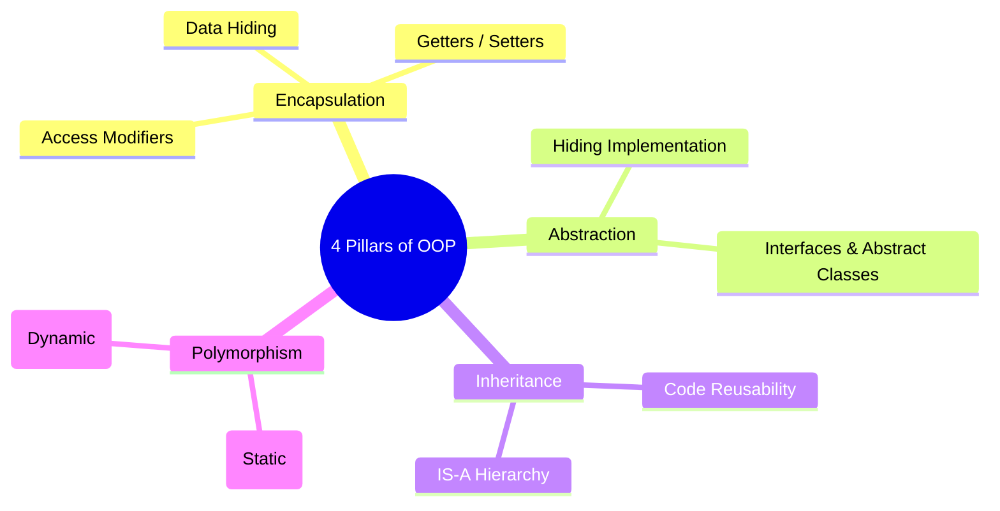
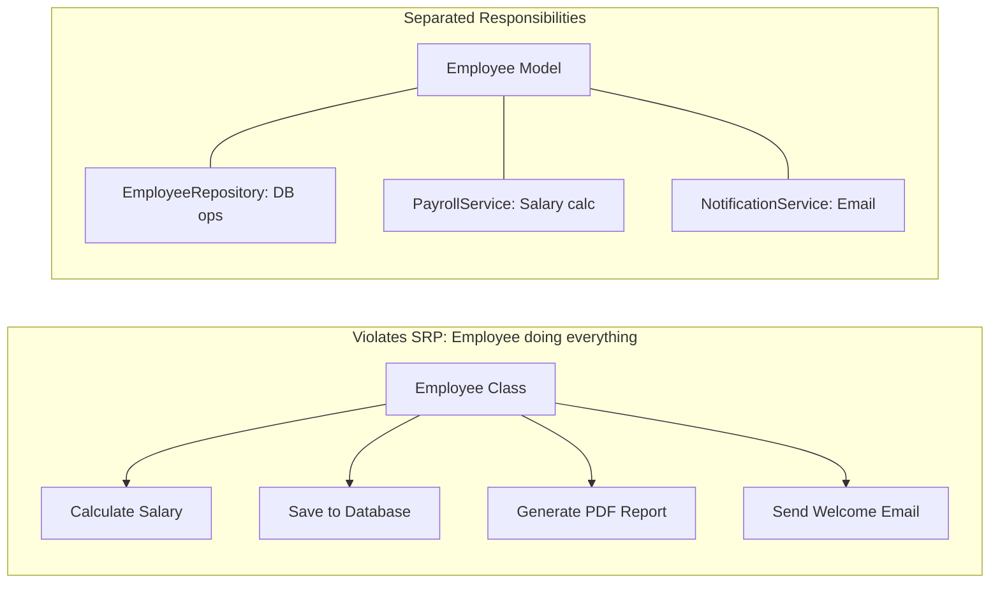
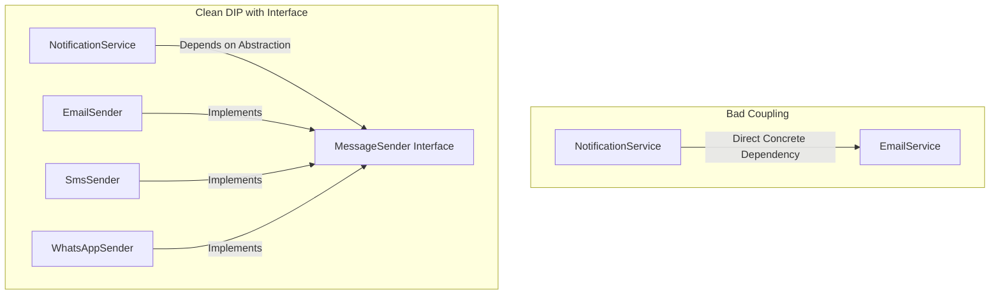

# 🧱 Object-Oriented Programming (OOP) & SOLID Principles

> **Core Philosophy**: Object-Oriented Design structures software around **data and behavior encapsulated inside objects**. 
> Writing maintainable, enterprise-scale software requires following the **4 Core OOP Pillars** and the **SOLID Principles** to ensure loose coupling, high cohesion, and seamless extensibility.

---

## 📑 Table of Contents
1. [The 4 Core Pillars of OOP](#1-the-4-core-pillars-of-oop)
   - [Encapsulation](#a-encapsulation)
   - [Abstraction](#b-abstraction)
   - [Inheritance (IS-A vs. HAS-A)](#c-inheritance-is-a-vs-has-a)
   - [Polymorphism (Compile-Time vs. Runtime)](#d-polymorphism)
2. [SOLID Principles (Deep Dive with Code)](#2-solid-principles-deep-dive)
   - [S — Single Responsibility Principle (SRP)](#1-s--single-responsibility-principle-srp)
   - [O — Open/Closed Principle (OCP)](#2-o--openclosed-principle-ocp)
   - [L — Liskov Substitution Principle (LSP)](#3-l--liskov-substitution-principle-lsp)
   - [I — Interface Segregation Principle (ISP)](#4-i--interface-segregation-principle-isp)
   - [D — Dependency Inversion Principle (DIP)](#5-d--dependency-inversion-principle-dip)
3. [Composition over Inheritance](#3-composition-over-inheritance)
4. [Placement Interview Cheat Sheet & Summary](#4-placement-interview-cheat-sheet)

---

## 1. The 4 Core Pillars of OOP



---

### A. Encapsulation
**Binding data (variables) and behavior (methods) together inside a single class, while restricting direct access from outside.**

```java
public class BankAccount {
    // 1. Private fields (Data Hiding)
    private double balance;

    // 2. Controlled access via public methods
    public void deposit(double amount) {
        if (amount > 0) {
            this.balance += amount;
        }
    }

    public double getBalance() {
        return this.balance;
    }
}
```

---

### B. Abstraction
**Hiding internal implementation details and showing only the essential feature interface to the user.**

```java
// User interacts with the abstraction without worrying about internal DB drivers
public interface PaymentGateway {
    boolean processPayment(double amount);
}
```

---

### C. Inheritance (IS-A vs. HAS-A)
- **IS-A Relationship (Inheritance)**: `Dog IS-A Animal` (`class Dog extends Animal`).
- **HAS-A Relationship (Composition)**: `Car HAS-A Engine` (`class Car { private Engine engine; }`). Always favor Composition over deep inheritance trees.

---

### D. Polymorphism
**The ability of an object to take on many forms.**

#### 1. Compile-Time (Static) Polymorphism — Method Overloading:
```java
public class Calculator {
    public int add(int a, int b) { return a + b; }
    public double add(double a, double b) { return a + b; } // Overloaded by signature
}
```

#### 2. Runtime (Dynamic) Polymorphism — Method Overriding:
```java
public class Animal {
    public void makeSound() { System.out.println("Animal sound"); }
}

public class Dog extends Animal {
    @Override
    public void makeSound() { System.out.println("Bark"); }
}
```

---

## 2. SOLID Principles Deep-Dive

---

### 1. S — Single Responsibility Principle (SRP)

> *"A class should have one, and only one, reason to change."*



---

### 2. O — Open/Closed Principle (OCP)

> *"Software entities (classes, modules, functions) should be **open for extension, but closed for modification**."*

#### ❌ Bad Design (Violates OCP):
```java
public class PaymentProcessor {
    public void process(String type) {
        if (type.equals("UPI")) { /* UPI logic */ }
        else if (type.equals("CARD")) { /* Card logic */ }
        // Adding Crypto requires modifying this class!
    }
}
```

#### ✅ Clean OCP Design (Polymorphic Extensibility):
```java
public interface PaymentMethod {
    void pay(double amount);
}

public class UpiPayment implements PaymentMethod {
    @Override public void pay(double amount) { System.out.println("UPI Pay: " + amount); }
}

public class CardPayment implements PaymentMethod {
    @Override public void pay(double amount) { System.out.println("Card Pay: " + amount); }
}

// Adding CryptoPayment requires ZERO changes to existing classes!
public class CryptoPayment implements PaymentMethod {
    @Override public void pay(double amount) { System.out.println("Crypto Pay: " + amount); }
}
```

---

### 3. L — Liskov Substitution Principle (LSP)

> *"Subtypes must be substitutable for their base types without altering the correctness of the program."*

#### ❌ The Classic Penguin / Square-Rectangle Violation:
```java
public class Bird {
    public void fly() { System.out.println("Flying"); }
}

public class Penguin extends Bird {
    @Override
    public void fly() {
        throw new UnsupportedOperationException("Penguins cannot fly!"); // Breaks LSP!
    }
}
```

#### ✅ Clean LSP Refactoring:
```java
public class Bird {
    public void eat() { System.out.println("Eating"); }
}

public interface Flyable {
    void fly();
}

public class Sparrow extends Bird implements Flyable {
    @Override public void fly() { System.out.println("Flying"); }
}

public class Penguin extends Bird {
    // Only inherits eat(), no invalid fly() method
}
```

---

### 4. I — Interface Segregation Principle (ISP)

> *"Clients should not be forced to depend upon interfaces that they do not use."*

#### ❌ Fat Interface Violation:
```java
public interface Worker {
    void work();
    void eat();
}

public class Robot implements Worker {
    @Override public void work() { /* Working */ }
    @Override public void eat() { /* Robots don't eat! Forced to write empty body */ }
}
```

#### ✅ Segregated Interfaces:
```java
public interface Workable { void work(); }
public interface Feedable { void eat(); }

public class Human implements Workable, Feedable {
    @Override public void work() { }
    @Override public void eat() { }
}

public class Robot implements Workable {
    @Override public void work() { }
}
```

---

### 5. D — Dependency Inversion Principle (DIP)

> *"1. High-level modules should not depend on low-level modules. Both should depend on abstractions.*  
> *2. Abstractions should not depend on details. Details should depend on abstractions."*



#### ✅ Clean DIP Implementation (Enables Dependency Injection):
```java
public interface MessageSender {
    void send(String message);
}

@Service
public class EmailSender implements MessageSender {
    @Override public void send(String msg) { System.out.println("Email: " + msg); }
}

@Service
public class NotificationService {
    private final MessageSender sender;

    // Dependency Injection via constructor
    public NotificationService(MessageSender sender) {
        this.sender = sender;
    }

    public void alert(String msg) {
        sender.send(msg);
    }
}
```

---

## 3. Composition over Inheritance

```java
// Favor HAS-A over IS-A to avoid fragile base class problems
public class Car {
    private final Engine engine; // Composition

    public Car(Engine engine) {
        this.engine = engine;
    }

    public void start() {
        engine.ignite();
    }
}
```

---

## 4. Placement Interview Cheat Sheet

| Principle | Core Meaning | Anti-Pattern to Detect |
| :--- | :--- | :--- |
| **S — SRP** | One single responsibility per class | God objects, classes with 30+ methods doing DB + UI + Business logic |
| **O — OCP** | Extend via polymorphism, avoid editing old code | Massive `switch-case` or `if-else` chains on object types |
| **L — LSP** | Derived classes must honor parent contracts | Subclasses throwing `UnsupportedOperationException` |
| **I — ISP** | Small, focused role-based interfaces | Fat interfaces forcing classes to provide empty dummy implementations |
| **D — DIP** | Depend on interfaces, not concrete classes | Instantiating dependencies with `new ConcreteService()` inside constructors |
