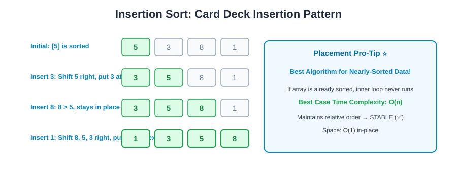
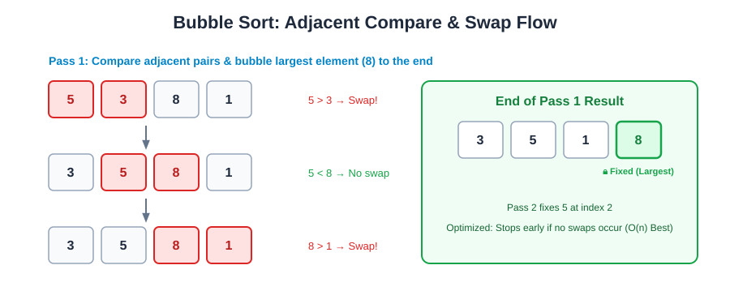
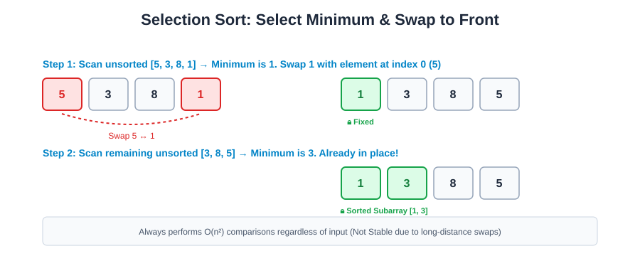
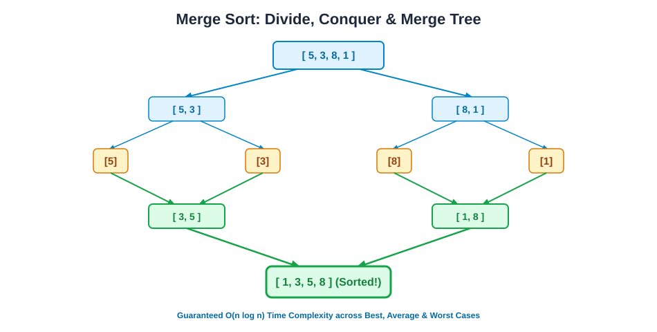
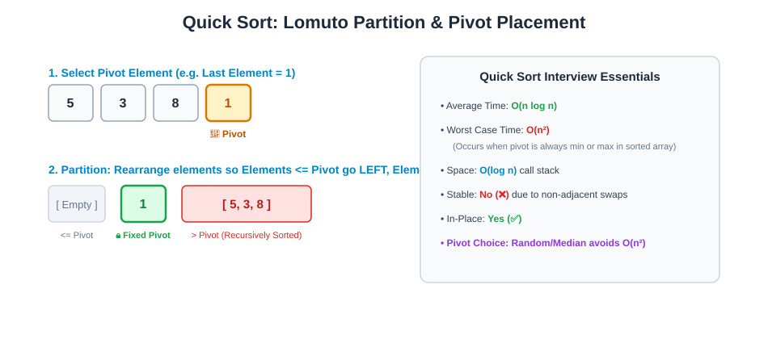

# 📊 Sorting Algorithms — Complete Placement & Interview Master Guide

> **Core Focus**: Intuitive concepts, visual execution diagrams, step-by-step trace walkthroughs, clean Java 17 code templates, edge-case optimization (early stopping in Bubble Sort, Insertion Sort on nearly-sorted data, Lomuto partition in Quick Sort, Merge Sort recursion tree), and placement revision cheat sheets.

---

## 📑 Table of Contents
- [1. Sorting Classification & Properties Overview](#1-sorting-classification--properties-overview)
- [2. Insertion Sort (Card Deck Shift & Insert)](#2-insertion-sort-card-deck-shift--insert)
- [3. Bubble Sort (Adjacent Compare & Swap)](#3-bubble-sort-adjacent-compare--swap)
- [4. Selection Sort (Find Minimum & Place at Front)](#4-selection-sort-find-minimum--place-at-front)
- [5. Merge Sort (Divide, Conquer & Merge) ⭐](#5-merge-sort-divide-conquer--merge-)
- [6. Quick Sort (Pivot Selection & Lomuto Partition) ⭐](#6-quick-sort-pivot-selection--lomuto-partition-)
- [7. Comprehensive Complexity Matrix & Mental Anchors](#7-comprehensive-complexity-matrix--mental-anchors)
- [8. Interview FAQs & Edge Case Traps](#8-interview-faqs--edge-case-traps)

---

## 1. Sorting Classification & Properties Overview

Before diving into specific algorithms, understand the **2 fundamental properties** frequently tested in technical rounds:

```
+----------------------------------------------------------------------------------------------------+
|                                      CORE SORTING PROPERTIES                                       |
+----------------------------------------------------------------------------------------------------+
| 1. Stability        | Preserves the relative order of duplicate elements with equal keys.          |
|                     | Example: [(4, 'A'), (3, 'B'), (4, 'C')] -> Sorted: [(3, 'B'), (4, 'A'), (4, 'C')]   |
|                     | Stable Algorithms  : Insertion Sort, Bubble Sort, Merge Sort                 |
|                     | Unstable Algorithms: Selection Sort, Quick Sort, Heap Sort                   |
+----------------------------------------------------------------------------------------------------+
| 2. In-Place         | Sorts elements using O(1) auxiliary memory (no extra array allocations).     |
|                     | In-Place    : Insertion Sort, Bubble Sort, Selection Sort, Quick Sort (O(log n) stack)|
|                     | Not In-Place: Merge Sort (Requires O(n) temporary array during merge phase)  |
+----------------------------------------------------------------------------------------------------+
```

---

## 2. Insertion Sort (Card Deck Shift & Insert)

### 💡 Core Idea
Build the sorted array one element at a time, exactly like sorting playing cards in your hand. Pick the next element (`key`), compare it with elements in the sorted subarray to its left, shift all larger elements one position to the right, and insert the `key` into its correct position.

### 🖼️ Visual Execution


### 🔍 Trace Walkthrough `[5, 3, 8, 1]`
- **Initial State**: `[5 | 3, 8, 1]` *(First element 5 is trivially sorted)*
- **Insert 3**: Compare with 5 $\rightarrow 5 > 3 \rightarrow$ Shift 5 right $\rightarrow$ Place 3 $\rightarrow [3, 5 \mid 8, 1]$
- **Insert 8**: Compare with 5 $\rightarrow 8 > 5 \rightarrow$ No shift $\rightarrow [3, 5, 8 \mid 1]$
- **Insert 1**: Compare with 8, 5, 3 $\rightarrow$ Shift 8, 5, 3 right $\rightarrow$ Place 1 $\rightarrow [1, 3, 5, 8]$

### ☕ Java Implementation
```java
public class InsertionSort {

    public static void insertionSort(int[] arr) {
        if (arr == null || arr.length <= 1) return;

        int n = arr.length;
        for (int i = 1; i < n; i++) {
            int key = arr[i];
            int j = i - 1;

            // Shift elements of arr[0..i-1] that are greater than key to one position ahead
            while (j >= 0 && arr[j] > key) {
                arr[j + 1] = arr[j];
                j--;
            }
            arr[j + 1] = key;
        }
    }
}
```

### ⏱️ Complexity
- **Time Complexity**:
  - **Best Case**: $\mathcal{O}(n)$ *(Array already sorted; inner while condition `arr[j] > key` fails immediately on first check)*
  - **Average Case**: $\mathcal{O}(n^2)$
  - **Worst Case**: $\mathcal{O}(n^2)$ *(Reverse sorted array)*
- **Auxiliary Space**: $\mathcal{O}(1)$ *(In-place)*
- **Stable**: **Yes** (✅)

> 🎯 **Placement High-Yield Tip**: Insertion Sort is the algorithm of choice for **nearly-sorted / small arrays ($n \le 16$)** because of minimal constant overhead and $\mathcal{O}(n)$ best-case behavior (often used as the base case in hybrid algorithms like TimSort).

---

## 3. Bubble Sort (Adjacent Compare & Swap)

### 💡 Core Idea
Repeatedly compare adjacent elements (`arr[j]`, `arr[j+1]`) and swap them if they are out of order (`arr[j] > arr[j+1]`). After each full pass, the largest unsorted element "bubbles up" to the end of the array.

### 🖼️ Visual Execution


### 🔍 Trace Walkthrough `[5, 3, 8, 1]`
- **Pass 1**:
  - Compare (5, 3) $\rightarrow 5 > 3 \rightarrow$ Swap $\rightarrow [3, 5, 8, 1]$
  - Compare (5, 8) $\rightarrow 5 < 8 \rightarrow$ No swap $\rightarrow [3, 5, 8, 1]$
  - Compare (8, 1) $\rightarrow 8 > 1 \rightarrow$ Swap $\rightarrow [3, 5, 1, 8]$ *(8 is locked at index 3)*
- **Pass 2**:
  - Compare (3, 5) $\rightarrow$ No swap $\rightarrow [3, 5, 1, 8]$
  - Compare (5, 1) $\rightarrow 5 > 1 \rightarrow$ Swap $\rightarrow [3, 1, 5, 8]$ *(5 is locked at index 2)*
- **Pass 3**:
  - Compare (3, 1) $\rightarrow 3 > 1 \rightarrow$ Swap $\rightarrow [1, 3, 5, 8]$ *(Array is sorted!)*

### ☕ Optimized Java Implementation (Early Stopping with `swap()`)
```java
public class BubbleSort {

    public static void bubbleSort(int[] arr) {
        if (arr == null || arr.length <= 1) return;

        int n = arr.length;
        for (int i = 0; i < n - 1; i++) {
            boolean swapped = false;

            // Last i elements are already in place
            for (int j = 0; j < n - i - 1; j++) {
                if (arr[j] > arr[j + 1]) {
                    swap(arr, j, j + 1);
                    swapped = true;
                }
            }

            // If no elements were swapped in inner loop, array is already sorted!
            if (!swapped) break;
        }
    }

    private static void swap(int[] arr, int i, int j) {
        int temp = arr[i];
        arr[i] = arr[j];
        arr[j] = temp;
    }
}
```

### ⏱️ Complexity
- **Time Complexity**:
  - **Best Case**: $\mathcal{O}(n)$ *(Array already sorted, breaks out on 1st pass)*
  - **Average Case**: $\mathcal{O}(n^2)$
  - **Worst Case**: $\mathcal{O}(n^2)$ *(Reverse sorted array)*
- **Auxiliary Space**: $\mathcal{O}(1)$ *(In-place)*
- **Stable**: **Yes** (✅)

---

## 4. Selection Sort (Find Minimum & Place at Front)

### 💡 Core Idea
Divide the array into a sorted prefix and an unsorted suffix. In each pass, scan the unsorted suffix to find the absolute minimum element, then swap it with the first unsorted element.

### 🖼️ Visual Execution


### 🔍 Trace Walkthrough `[5, 3, 8, 1]`
- **Pass 1**: Scan `[5, 3, 8, 1]` $\rightarrow$ Min is 1 at index 3. Swap `arr[0]` (5) with `arr[3]` (1) $\rightarrow [1, 3, 8, 5]$ *(1 is locked at index 0)*
- **Pass 2**: Scan `[3, 8, 5]` $\rightarrow$ Min is 3 at index 1. Swap `arr[1]` with `arr[1]` $\rightarrow [1, 3, 8, 5]$ *(3 is locked at index 1)*
- **Pass 3**: Scan `[8, 5]` $\rightarrow$ Min is 5 at index 3. Swap `arr[2]` (8) with `arr[3]` (5) $\rightarrow [1, 3, 5, 8]$ *(Sorted!)*

### ☕ Java Implementation (with `swap()`)
```java
public class SelectionSort {

    public static void selectionSort(int[] arr) {
        if (arr == null || arr.length <= 1) return;

        int n = arr.length;
        for (int i = 0; i < n - 1; i++) {
            int minIndex = i;

            // Find index of minimum element in unsorted subarray
            for (int j = i + 1; j < n; j++) {
                if (arr[j] < arr[minIndex]) {
                    minIndex = j;
                }
            }

            // Swap the found minimum element with element at index i
            if (minIndex != i) {
                swap(arr, i, minIndex);
            }
        }
    }

    private static void swap(int[] arr, int i, int j) {
        int temp = arr[i];
        arr[i] = arr[j];
        arr[j] = temp;
    }
}
```

### ⏱️ Complexity
- **Time Complexity**:
  - **Best Case**: $\mathcal{O}(n^2)$ *(Always scans entire unsorted suffix)*
  - **Average Case**: $\mathcal{O}(n^2)$
  - **Worst Case**: $\mathcal{O}(n^2)$
- **Auxiliary Space**: $\mathcal{O}(1)$ *(In-place)*
- **Stable**: **No** (❌) *(Long-distance swaps jump over equal elements, e.g. `[4a, 4b, 1]` $\rightarrow$ 1 swaps with 4a, putting 4a behind 4b)*

---

## 5. Merge Sort (Divide, Conquer & Merge) ⭐

### 💡 Core Idea
Follow the classic **Divide and Conquer** paradigm:
1. **Divide**: Split the array into two equal halves until each subarray contains only 1 element.
2. **Conquer**: Recursively sort both halves.
3. **Combine (Merge)**: Merge the two sorted subarrays into a single sorted array.

### 🖼️ Visual Execution (Recursion Tree)


### ☕ Java Implementation
```java
public class MergeSort {

    public static void sort(int[] arr) {
        if (arr == null || arr.length <= 1) return;
        mergeSort(arr, 0, arr.length - 1);
    }

    private static void mergeSort(int[] arr, int left, int right) {
        if (left >= right) return;

        int mid = left + (right - left) / 2; // Prevents integer overflow
        mergeSort(arr, left, mid);
        mergeSort(arr, mid + 1, right);
        merge(arr, left, mid, right);
    }

    private static void merge(int[] arr, int left, int mid, int right) {
        int[] temp = new int[right - left + 1];
        int i = left;      // Pointer for left sorted subarray [left..mid]
        int j = mid + 1;   // Pointer for right sorted subarray [mid+1..right]
        int k = 0;         // Pointer for temp array

        while (i <= mid && j <= right) {
            if (arr[i] <= arr[j]) { // '<=' guarantees stability
                temp[k++] = arr[i++];
            } else {
                temp[k++] = arr[j++];
            }
        }

        // Copy remaining elements of left subarray
        while (i <= mid) {
            temp[k++] = arr[i++];
        }

        // Copy remaining elements of right subarray
        while (j <= right) {
            temp[k++] = arr[j++];
        }

        // Copy back from temp into original array
        for (int x = 0; x < temp.length; x++) {
            arr[left + x] = temp[x];
        }
    }
}
```

### ⏱️ Complexity
- **Time Complexity**:
  - **Best Case**: $\mathcal{O}(n \log n)$
  - **Average Case**: $\mathcal{O}(n \log n)$
  - **Worst Case**: $\mathcal{O}(n \log n)$ *(Guaranteed $\mathcal{O}(n \log n)$ in all cases!)*
- **Auxiliary Space**: $\mathcal{O}(n)$ *(Requires temp array during merge phase)*
- **Stable**: **Yes** (✅)

---

## 6. Quick Sort (Pivot Selection & Lomuto Partition) ⭐

### 💡 Core Idea
1. **Choose a Pivot**: Pick an element from the array (e.g. last element, first element, or random).
2. **Partition**: Rearrange the array such that all elements smaller than or equal to the pivot are placed to its left, and all larger elements are placed to its right. The pivot is now at its final sorted position.
3. **Recurse**: Recursively apply Quick Sort on the left and right subarrays.

### 🖼️ Visual Execution (Lomuto Partition Scheme)


### ☕ Java Implementation (Lomuto Partition with `swap()`)
```java
public class QuickSort {

    public static void sort(int[] arr) {
        if (arr == null || arr.length <= 1) return;
        quickSort(arr, 0, arr.length - 1);
    }

    private static void quickSort(int[] arr, int low, int high) {
        if (low >= high) return;

        // partition returns index of pivot in its correct sorted position
        int pivotIndex = partition(arr, low, high);
        quickSort(arr, low, pivotIndex - 1);
        quickSort(arr, pivotIndex + 1, high);
    }

    private static int partition(int[] arr, int low, int high) {
        int pivot = arr[high]; // Choosing last element as pivot
        int i = low - 1;       // Index of smaller element

        for (int j = low; j < high; j++) {
            if (arr[j] <= pivot) {
                i++;
                swap(arr, i, j);
            }
        }

        // Place pivot in its correct position by swapping with arr[i + 1]
        swap(arr, i + 1, high);
        return i + 1;
    }

    private static void swap(int[] arr, int i, int j) {
        int temp = arr[i];
        arr[i] = arr[j];
        arr[j] = temp;
    }
}
```

### ⏱️ Complexity
- **Time Complexity**:
  - **Best Case**: $\mathcal{O}(n \log n)$ *(Pivot divides array into 2 equal halves)*
  - **Average Case**: $\mathcal{O}(n \log n)$
  - **Worst Case**: $\mathcal{O}(n^2)$ *(When pivot is repeatedly the extreme smallest or largest element, e.g. already sorted array with naive last-element pivot)*
- **Auxiliary Space**: $\mathcal{O}(\log n)$ average recursion stack space ($\mathcal{O}(n)$ worst-case stack)
- **Stable**: **No** (❌) *(Non-adjacent swaps across pivot break order of duplicate elements)*

---

## 7. Comprehensive Complexity Matrix & Mental Anchors

| Algorithm | Best Time | Average Time | Worst Time | Auxiliary Space | Stable? | In-Place? | Key Mechanism |
| :--- | :---: | :---: | :---: | :---: | :---: | :---: | :--- |
| **Insertion Sort** | $\mathcal{O}(n)$ | $\mathcal{O}(n^2)$ | $\mathcal{O}(n^2)$ | $\mathcal{O}(1)$ | ✅ Yes | ✅ Yes | Shift & insert into sorted prefix |
| **Bubble Sort** | $\mathcal{O}(n)$ | $\mathcal{O}(n^2)$ | $\mathcal{O}(n^2)$ | $\mathcal{O}(1)$ | ✅ Yes | ✅ Yes | Adjacent compare & swap |
| **Selection Sort** | $\mathcal{O}(n^2)$ | $\mathcal{O}(n^2)$ | $\mathcal{O}(n^2)$ | $\mathcal{O}(1)$ | ❌ No | ✅ Yes | Find min & swap to front |
| **Merge Sort** | $\mathcal{O}(n \log n)$ | $\mathcal{O}(n \log n)$ | $\mathcal{O}(n \log n)$ | $\mathcal{O}(n)$ | ✅ Yes | ❌ No | Divide, Conquer & Merge |
| **Quick Sort** | $\mathcal{O}(n \log n)$ | $\mathcal{O}(n \log n)$ | $\mathcal{O}(n^2)$ | $\mathcal{O}(\log n)^*$ | ❌ No | ✅ Yes | Pivot selection & Partitioning |

*\*Recursion call stack memory.*

### 🧠 1-Sentence Mental Anchors for Coding Rounds:
- **Insertion Sort**: *"Card deck sort — best for nearly sorted data ($\mathcal{O}(n)$) and small subsets."*
- **Bubble Sort**: *"Compare neighbours, bubble biggest to the right with early exit check."*
- **Selection Sort**: *"Select minimum from unsorted suffix, swap with current index."*
- **Merge Sort**: *"Guaranteed $\mathcal{O}(n \log n)$ always and stable, but requires $\mathcal{O}(n)$ extra buffer."*
- **Quick Sort**: *"Fastest in practice with cache locality and $\mathcal{O}(1)$ heap space, but $\mathcal{O}(n^2)$ worst case without randomized pivot."*

---

## 8. Interview FAQs & Edge Case Traps

### Q1: Why is Merge Sort preferred for Linked Lists, but Quick Sort for Arrays?
**Answer**:
- **Linked Lists**: Inserting and merging nodes requires $\mathcal{O}(1)$ pointer changes (no extra $\mathcal{O}(n)$ temporary buffer needed!). Linked lists have slow $\mathcal{O}(n)$ random access, which hurts Quick Sort's partitioning.
- **Arrays**: Arrays have $\mathcal{O}(1)$ random indexing and excellent CPU cache locality, making Quick Sort significantly faster in practice with zero extra allocation.

### Q2: How do you prevent Quick Sort from degrading to $\mathcal{O}(n^2)$?
**Answer**:
1. **Randomized Pivot Selection**: Swap `arr[high]` with a random index `low + rand() % (high - low)`.
2. **Median-of-Three**: Choose the median of `arr[low]`, `arr[mid]`, and `arr[high]` as the pivot.
3. **Dual-Pivot / Introsort**: Switch to HeapSort if recursion depth exceeds $2 \log n$ (used in Java's `Arrays.sort()` for primitives).

### Q3: What is the recurrence relation for Merge Sort and Quick Sort?
**Answer**:
- **Merge Sort**: $T(n) = 2T(n/2) + \mathcal{O}(n) \implies \mathcal{O}(n \log n)$ (by Master Theorem).
- **Quick Sort (Average)**: $T(n) = 2T(n/2) + \mathcal{O}(n) \implies \mathcal{O}(n \log n)$.
- **Quick Sort (Worst)**: $T(n) = T(n-1) + \mathcal{O}(n) \implies \mathcal{O}(n^2)$.
