# 🍃 Spring Framework & Core IoC — Complete Master Guide

> **Foundation**: Based on EazyBytes *Spring, SpringBoot, JPA, Hibernate: Zero to Master* (Slides 1–62).  
> **Core Philosophy**: Enterprise applications require managing hundreds of collaborating objects. Rather than manually instantiating and wiring them with `new`, the **Spring IoC Container** manages the creation, configuration, lifecycle, and injection of dependencies, delivering loose coupling and testability.

---

## 📑 Table of Contents
- [1. Introduction to Spring & Historical Evolution](#1-introduction-to-spring--historical-evolution)
- [2. Why Use Frameworks? (The Chef & Developer Analogy)](#2-why-use-frameworks-the-chef--developer-analogy)
- [3. Inversion of Control (IoC) & Dependency Injection (DI)](#3-inversion-of-control-ioc--dependency-injection-di)
- [4. Spring Beans & ApplicationContext (SpEL: Optional)](#4-spring-beans--applicationcontext-spel-optional)
- [5. Spring IoC Container: BeanFactory vs. ApplicationContext](#5-spring-ioc-container-beanfactory-vs-applicationcontext)
- [6. Defining Beans: `@Component` vs. `@Bean`](#6-defining-beans-component-vs-bean)
- [7. Bean Lifecycle: `@PostConstruct` and `@PreDestroy`](#7-bean-lifecycle-postconstruct-and-predestroy)
- [8. Programmatic & Dynamic Bean Registration (Optional)](#8-programmatic--dynamic-bean-registration-optional)
- [9. Dependency Wiring: Method Calls, Parameters & `@Autowired`](#9-dependency-wiring-method-calls-parameters--autowired)
- [10. Bean Disambiguation: Parameter Name, `@Primary` & `@Qualifier`](#10-bean-disambiguation-parameter-name-primary--qualifier)
- [11. Circular Dependencies & Resolution](#11-circular-dependencies--resolution)
- [12. Spring Bean Scopes & Race Conditions](#12-spring-bean-scopes--race-conditions)
- [13. Eager vs. Lazy Instantiation (`@Lazy`)](#13-eager-vs-lazy-instantiation-lazy)
- [14. Aspect-Oriented Programming (AOP) Deep Dive](#14-aspect-oriented-programming-aop-deep-dive)
- [15. 1-Page Master Revision Cheat Sheet](#15-1-page-master-revision-cheat-sheet)

---

## 1. Introduction to Spring & Historical Evolution

> 💡 **Quick Revision Anchor (2-3 Words)**: `Enterprise Java Evolution`

### What is Spring?
The **Spring Framework** is a lightweight, open-source enterprise framework created to simplify Java application development. It provides comprehensive infrastructure support through dependency injection, declarative transactions, messaging, and web routing.

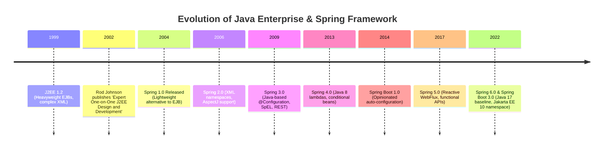


### Key Historical Milestones:
1. **The EJB Complexity Problem (Early 2000s)**:
   - Early J2EE applications relied on **Enterprise JavaBeans (EJBs)** for transactions and persistence.
   - EJBs were notoriously intrusive: developers had to implement complex home and remote interfaces, configure hundreds of lines of XML deployment descriptors, and run heavy application servers (WebLogic, WebSphere).
2. **Rod Johnson's Breakthrough (2002)**:
   - Rod Johnson authored *Expert One-on-One J2EE Design and Development*, introducing a simple 30,000-line framework based on plain Java classes (POJOs) and dependency injection. This code formed the foundation of Spring 1.0 in 2004.
3. **The Java EE to Jakarta EE Namespace Shift**:
   - In 2017, Oracle transferred Java EE to the Eclipse Foundation. Due to trademark restrictions on the "Java" name, the platform was rebranded as **Jakarta EE**.
   - Package namespaces transitioned from `javax.*` ➔ `jakarta.*` (e.g., `javax.persistence.*` ➔ `jakarta.persistence.*`, `javax.validation.*` ➔ `jakarta.validation.*`).

---

## 2. Why Use Frameworks? (The Chef & Developer Analogy)

> 💡 **Quick Revision Anchor (2-3 Words)**: `Focus On Business`

Building applications from scratch without frameworks is like cooking every ingredient from the ground up:

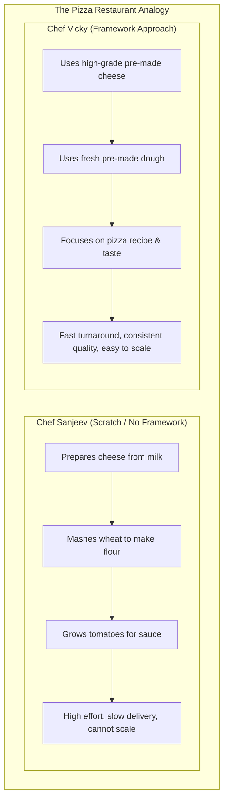


### The Software Developer Equivalent:
- **Dev Vicky (No Framework)**: Spends 80% of time writing low-level infrastructure: thread pool handlers, raw JDBC connection pools, socket parsers, security filters, and transaction rollback logic.
- **Dev Sanjeev (Using Spring Framework)**: Leverages production-grade, pre-built modules (Spring Security, Spring Data, Transaction Manager) and dedicates 100% of effort to **business domain logic**.

---

### Key Spring Ecosystem Projects:

| Project | Purpose |
| :--- | :--- |
| **Spring Core / IoC** | Dependency injection, lifecycle management, SpEL. |
| **Spring MVC / Web** | DispatcherServlet-based MVC and RESTful APIs. |
| **Spring Boot** | Auto-configuration, opinionated starter dependencies, embedded servers. |
| **Spring Data** | Unified data access layer (JPA, JDBC, MongoDB, Cassandra). |
| **Spring Security** | Authentication, authorization, OAuth2/OIDC, CSRF, and CORS defense. |
| **Spring Cloud** | Distributed system patterns (Service discovery, API Gateway, Circuit Breakers). |
| **Spring Batch** | Robust bulk data processing and job orchestration. |

---

## 3. Inversion of Control (IoC) & Dependency Injection (DI)

> 💡 **Quick Revision Anchor (2-3 Words)**: `Container Inverts Control`

### High-Level Spring IoC Architecture


> **Source:** Spring Framework Documentation

### Tight Coupling vs. Loose Coupling

```mermaid
flowchart LR
    subgraph TightCoupling ["Tight Coupling (Standard Java)"]
        Car1["Car"] -->|new PetrolEngine()| PE["PetrolEngine (Hardcoded)"]
    end
    subgraph LooseCoupling ["Loose Coupling (Spring IoC)"]
        Car2["Car"] --> Inter["<< Engine >> (Interface)"]
        Inter -.-> PE2["PetrolEngine"]
        Inter -.-> EE["ElectricEngine"]
        IoC["Spring IoC Container"] -->|Injects Implementation| Car2
    end
```


- **Tight Coupling**: A class instantiates its concrete collaborators internally using `new`. If `PetrolEngine` changes or needs to be swapped with `ElectricEngine`, the `Car` class must be modified and recompiled.
- **Loose Coupling**: A class defines dependencies as interfaces. An external entity—the **Spring IoC Container**—instantiates the appropriate implementation and injects it at runtime.

### Definition of Terms:
- **Inversion of Control (IoC)**: The high-level **architectural design principle** where the flow of control is inverted: instead of the developer's code controlling object creation and calling the framework, the framework controls object creation and calls your code (the *"Hollywood Principle: Don't call us, we'll call you"*).
- **Dependency Injection (DI)**: The concrete **design pattern and mechanism** used to implement IoC. The container provides dependencies to an object via constructors, setters, or fields.

---

## 4. Spring Beans & ApplicationContext (SpEL: Optional)

> 💡 **Quick Revision Anchor (2-3 Words)**: `Managed Object Graph`

### 1. What is a Spring Bean?
A **Bean** is any normal Java object (POJO) that is **instantiated, assembled, and managed** by the Spring IoC container. Objects created with `new MyClass()` outside the Spring context are plain Java objects, not beans.

### 2. What is the Spring Context?
The **ApplicationContext** is the in-memory registry where Spring maintains managed bean instances. It acts as the central coordinator that links objects together based on configuration metadata.

### 3. Spring Expression Language (SpEL)
SpEL is a powerful expression language that supports querying and manipulating an object graph at runtime:
```java
@Component
public class ServerConfig {
    @Value("#{systemProperties['user.home']}")
    private String userHome;

    @Value("#{T(java.lang.Math).random() * 100.0}")
    private double randomPort;

    @Value("#{serverProps.defaultTimeout ?: 5000}")
    private int timeout;
}
```

---

## 5. Spring IoC Container: BeanFactory vs. ApplicationContext

> 💡 **Quick Revision Anchor (2-3 Words)**: `Container Hierarchy`

Spring provides two container implementations:

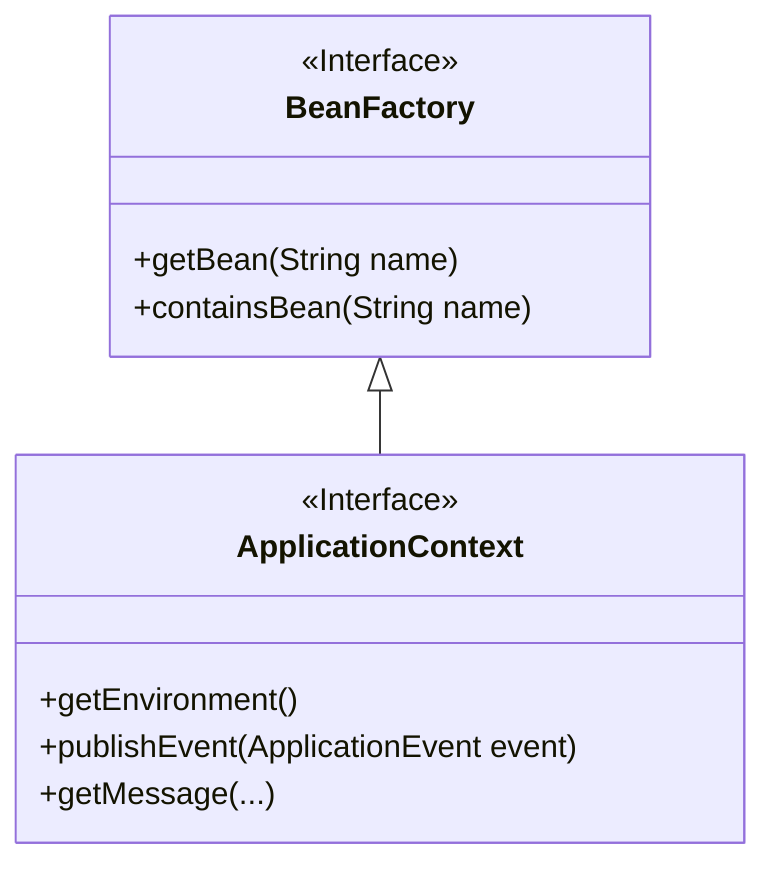


| Feature | `BeanFactory` (`org.springframework.beans`) | `ApplicationContext` (`org.springframework.context`) |
| :--- | :--- | :--- |
| **Target Use Case** | Legacy, resource-constrained environments (Mobile/embedded devices). | **Standard enterprise applications** (Always use this). |
| **Bean Instantiation** | **Lazy** (Beans are created only when `getBean()` is called). | **Eager** by default (Singletons are instantiated during startup). |
| **Enterprise Features** | Basic DI and bean lifecycle only. | AOP support, i18n Internationalization, Event Publishing, Profiles. |
| **Common Implementations**| `XmlBeanFactory` (Deprecated). | `AnnotationConfigApplicationContext`, `ClassPathXmlApplicationContext`. |

---

## 6. Defining Beans: `@Component` vs. `@Bean`

> 💡 **Quick Revision Anchor (2-3 Words)**: `Stereotype vs Config`

There are two primary approaches for registering beans in the Spring Context:

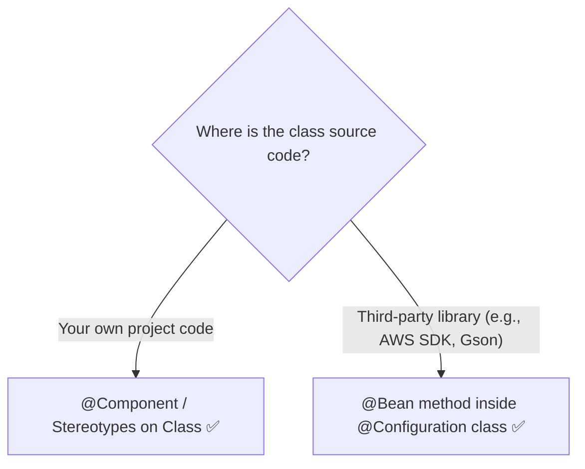


---

### Approach 1: `@Component` (Automatic Scanning)
Annotate your own class with `@Component`. Spring automatically detects and registers it using `@ComponentScan`:

```java
@Component
public class Vehicle {
    private String name = "Honda";

    public String getName() { return name; }
    public void setName(String name) { this.name = name; }
}
```

---

### Approach 2: `@Bean` (Explicit Method Configuration)
Used when configuring classes from external JARs where you cannot add `@Component` to the source code:

```java
@Configuration
public class ProjectConfig {

    // Method name becomes the default Bean Name ("audiVehicle")
    @Bean
    public Vehicle audiVehicle() {
        Vehicle v = new Vehicle();
        v.setName("Audi 8");
        return v;
    }

    // Custom Bean Name declaration
    @Bean(name = "ferrariVehicle")
    public Vehicle vehicle3() {
        Vehicle v = new Vehicle();
        v.setName("Ferrari");
        return v;
    }
}
```

---

### Comparison Matrix:

| Dimension | `@Component` | `@Bean` |
| :--- | :--- | :--- |
| **Placement** | Class-level annotation. | Method-level annotation inside `@Configuration`. |
| **Source Control** | Requires access to source code. | Can instantiate any class (including third-party libraries). |
| **Number of Instances**| Creates **one** bean definition per class. | Can create **multiple** beans of the same type with different settings. |
| **Configuration Logic**| Relies on default/parameterized constructors. | Full programmatic control to execute custom setup logic before return. |

---

## 7. Bean Lifecycle: `@PostConstruct` and `@PreDestroy`

> 💡 **Quick Revision Anchor (2-3 Words)**: `Init And Teardown`

Spring beans have managed lifecycles. Java standard annotations (from `jakarta.annotation`) allow executing code right after initialization and right before destruction:

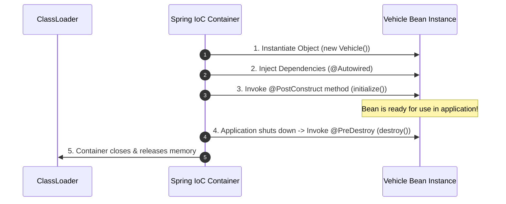


### Production Example:
```java
@Component
public class DatabaseConnectionManager {

    @PostConstruct
    public void init() {
        // Runs immediately after constructor and dependency injection finish
        System.out.println("Connection pool warmed up and validated.");
    }

    @PreDestroy
    public void cleanup() {
        // Runs when the ApplicationContext is closing
        System.out.println("Closing active sockets and flushing transaction buffers.");
    }
}
```

---

## 8. Programmatic & Dynamic Bean Registration (Optional)

> 💡 **Quick Revision Anchor (2-3 Words)**: `Runtime Bean Registration`

Since **Spring 5**, you can dynamically register beans into the context based on runtime conditions (e.g., random numbers, environment flags, or external input) using `context.registerBean()`:

```java
AnnotationConfigApplicationContext context = new AnnotationConfigApplicationContext(ProjectConfig.class);

Supplier<Vehicle> volkswagenSupplier = () -> {
    Vehicle v = new Vehicle();
    v.setName("Volkswagen");
    return v;
};

// Dynamic conditional registration
if (System.currentTimeMillis() % 2 == 0) {
    context.registerBean("volkswagen", Vehicle.class, volkswagenSupplier);
}
```

---

## 9. Dependency Wiring: Method Calls, Parameters & `@Autowired`

> 💡 **Quick Revision Anchor (2-3 Words)**: `Wiring Collaborating Beans`

Consider two classes from the EazyBytes course: `Person` (Lucy) and `Vehicle`. `Person` requires a `Vehicle` dependency:

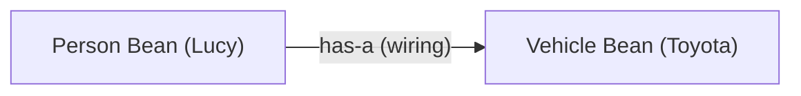


### 1. Wiring inside `@Configuration` via Method Call
```java
@Configuration
public class ProjectConfig {
    @Bean
    public Vehicle vehicle() {
        Vehicle v = new Vehicle();
        v.setName("Toyota");
        return v;
    }

    @Bean
    public Person person() {
        Person p = new Person();
        p.setName("Lucy");
        p.setVehicle(vehicle()); // Intercepted by CGLIB: Returns the singleton instance!
        return p;
    }
}
```
> [!NOTE]
> Spring intercepts `vehicle()` using CGLIB proxies. It does **not** create a second Vehicle object; it fetches the existing singleton bean from the context!

---

### 2. Wiring inside `@Configuration` via Method Parameters
```java
@Configuration
public class ProjectConfig {
    @Bean
    public Vehicle vehicle() {
        Vehicle v = new Vehicle();
        v.setName("Toyota");
        return v;
    }

    @Bean
    public Person person(Vehicle vehicle) { // Spring automatically resolves and passes the bean
        Person p = new Person();
        p.setName("Lucy");
        p.setVehicle(vehicle);
        return p;
    }
}
```

---

### 3. Autowiring Stereotype Components (`@Autowired`)
In regular `@Component` classes, use constructor injection:

```java
@Component
public class Person {
    private String name = "Lucy";
    private final Vehicle vehicle;

    // Best practice: Constructor injection (Spring 4.3+ omits @Autowired for single constructor)
    public Person(Vehicle vehicle) {
        this.vehicle = vehicle;
    }
}
```

---

## 10. Bean Disambiguation: Parameter Name, `@Primary` & `@Qualifier`

> 💡 **Quick Revision Anchor (2-3 Words)**: `3-Step Disambiguation`

When multiple beans of the same type exist in the context, Spring cannot resolve which one to inject and throws **`NoUniqueBeanDefinitionException`**.

Spring resolves ambiguity through a strict **3-Step Resolution Order**:

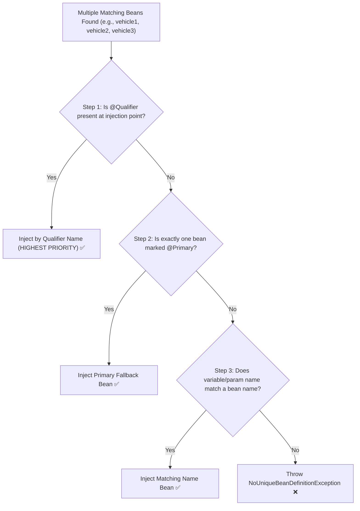


---

### Code Walkthrough (The 3 Cars & Lucy Example):

```java
@Configuration
public class ProjectConfig {
    @Bean
    public Vehicle vehicle1() { Vehicle v = new Vehicle(); v.setName("Audi"); return v; }

    @Bean
    public Vehicle vehicle2() { Vehicle v = new Vehicle(); v.setName("Honda"); return v; }

    @Bean
    @Primary // Step 2 Default Fallback
    public Vehicle vehicle3() { Vehicle v = new Vehicle(); v.setName("Ferrari"); return v; }
}
```

#### Step 1: Matching by `@Qualifier` (Wins over everything)
```java
@Component
public class Person {
    private final Vehicle vehicle;

    public Person(@Qualifier("vehicle2") Vehicle vehicle) {
        this.vehicle = vehicle; // Injects 'vehicle2' (Honda)
    }
}
```

#### Step 2: Matching by `@Primary`
```java
@Component
public class Person {
    private final Vehicle vehicle;

    public Person(Vehicle vehicle) { // No qualifier -> picks @Primary
        this.vehicle = vehicle; // Injects 'vehicle3' (Ferrari)
    }
}
```

#### Step 3: Matching by Parameter Name (Fallback)
```java
@Component
public class Person {
    private final Vehicle vehicle;

    public Person(Vehicle vehicle1) { // Parameter name matches bean 'vehicle1'
        this.vehicle = vehicle1; // Injects 'vehicle1' (Audi)
    }
}
```

---

## 11. Circular Dependencies & Resolution

> 💡 **Quick Revision Anchor (2-3 Words)**: `Circular Dependency Fixes`

A circular dependency occurs when Bean A requires Bean B, and Bean B requires Bean A (`A ⇄ B`):

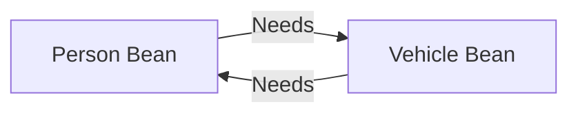


At startup, Spring fails fast and throws **`UnsatisfiedDependencyException`** / **`BeanCurrentlyInCreationException`**.

### How to Fix Circular Dependencies:
1. **Redesign Architecture (Best Practice)**: Extract common logic into a third service (`C`), breaking the direct cycle.
2. **Use `@Lazy`**: Tells Spring to inject a CGLIB dynamic proxy upon startup and resolve the actual target bean only when first called:
   ```java
   @Component
   public class Person {
       private final Vehicle vehicle;
       public Person(@Lazy Vehicle vehicle) {
           this.vehicle = vehicle;
       }
   }
   ```
3. **Use Setter / Field Injection**: Setter injection allows the container to instantiate both beans first before populating dependencies. (Starting with Spring Boot 2.6+, circular references are **blocked by default**; enable via `spring.main.allow-circular-references=true` only as a legacy workaround).

---

## 12. Spring Bean Scopes & Race Conditions

> 💡 **Quick Revision Anchor (2-3 Words)**: `Singleton vs Prototype`

Bean scope defines **how many instances** Spring creates and **when** they are created:

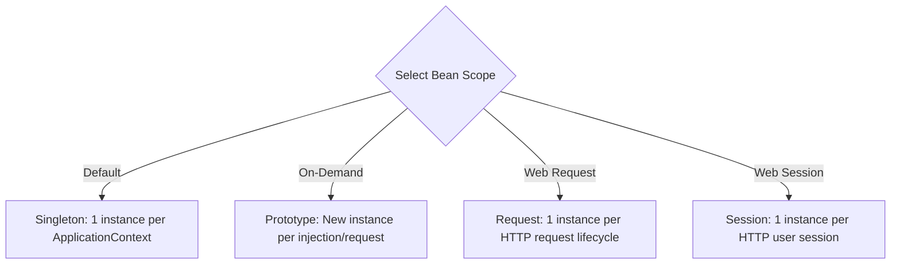


---

### The Singleton Scope & The Multi-Threaded Race Condition Danger

> [!WARNING]
> **Singletons MUST be Stateless or Immutable!**  
> In a web application, hundreds of HTTP worker threads concurrently execute methods on the same singleton bean instance.

#### The Restaurant Table Reservation Race Condition:
```java
@Service
public class TableReservationService { // Singleton

    // DANGEROUS: Mutable shared state across threads!
    private Map<String, String> reservedTables = new HashMap<>();

    public void reserveTable(String tableId, String userId) {
        // Thread 1 and Thread 2 both check at the same time
        if (!reservedTables.containsKey(tableId)) {
            // Both threads race to write -> one overwrites the other!
            reservedTables.put(tableId, userId);
        }
    }
}
```
- **Rule**: Never store user-specific mutable state in singleton instance fields. Store state in databases, thread-safe caches, or use prototype/request scoped beans.

---

### Singleton vs. Prototype Comparison:

| Feature | Singleton Scope | Prototype Scope |
| :--- | :--- | :--- |
| **Declaration** | `@Scope("singleton")` (Default) | `@Scope("prototype")` |
| **Instance Count** | Exactly **1 instance** per context. | **New instance** created on every request. |
| **Instantiation Timing**| Eager (Startup) by default. | Lazy (Created only on `getBean()` / injection). |
| **Lifecycle Management**| Spring manages both creation & destruction (`@PreDestroy` runs). | Spring creates and wires the bean, then **abandons it** (Garbage Collector handles destruction; `@PreDestroy` does NOT run). |
| **Ideal For** | Stateless services, repositories, controllers. | Stateful objects, mutable task executions. |

---

## 13. Eager vs. Lazy Instantiation (`@Lazy`)

> 💡 **Quick Revision Anchor (2-3 Words)**: `Startup vs On-Demand`

By default, Spring instantiates all singleton beans **eagerly** during application startup.

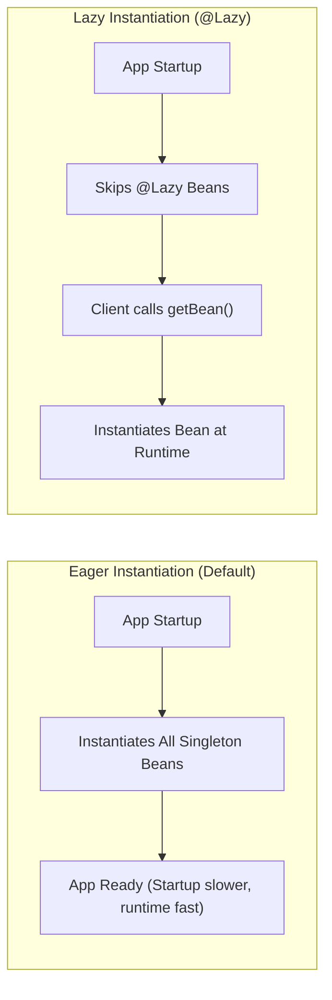


| Dimension | Eager Instantiation (Default) | Lazy Instantiation (`@Lazy`) |
| :--- | :--- | :--- |
| **When Created** | Application startup. | First time the bean is accessed. |
| **Startup Speed** | Slower (Instantiates full object graph). | Faster (Defers instantiation). |
| **Error Discovery**| **Fail-Fast**: Configuration & DI errors detected immediately on launch. | Errors (missing beans, NPEs) surface at runtime during user requests. |
| **Memory Footprint**| Holds all beans in memory from the start. | Allocates memory on-demand. |

```java
@Component
@Lazy // Instantiated only when first referenced
public class HeavyReportGenerator {
    public HeavyReportGenerator() {
        System.out.println("HeavyReportGenerator initialized.");
    }
}
```

---

## 14. Aspect-Oriented Programming (AOP) Deep Dive

> 💡 **Quick Revision Anchor (2-3 Words)**: `Cross-Cutting Concerns`

### The Problem: Tangled Non-Business Code
In enterprise apps, non-business logic (logging, transaction management, performance auditing, security checks) gets duplicated across every business method:

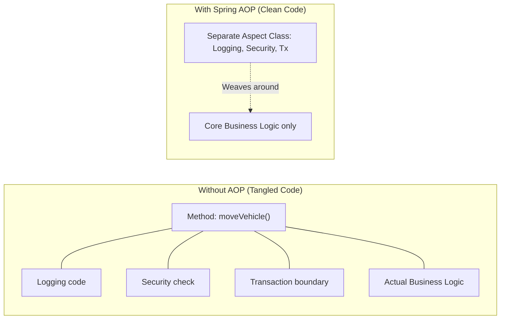


---

### Core AOP Terminology:

| Term | Question It Answers | Definition & Example |
| :--- | :---: | :--- |
| **Aspect** | **What** | A modular class encapsulating a cross-cutting concern (e.g., `LoggingAspect`). |
| **Advice** | **When** | The action taken by an aspect at a join point (`@Before`, `@After`, `@Around`). |
| **Pointcut** | **Which** | A predicate expression matching which target methods should be intercepted. |
| **Join Point** | **Where** | A point during program execution (in Spring AOP, always a **method execution**). |
| **Target Object** | **Who** | The business bean instance being intercepted (e.g., `VehicleServices`). |
| **Weaving** | **How** | The process of linking aspects with target objects using dynamic CGLIB / JDK proxies. |

---

### The 5 Advice Types:

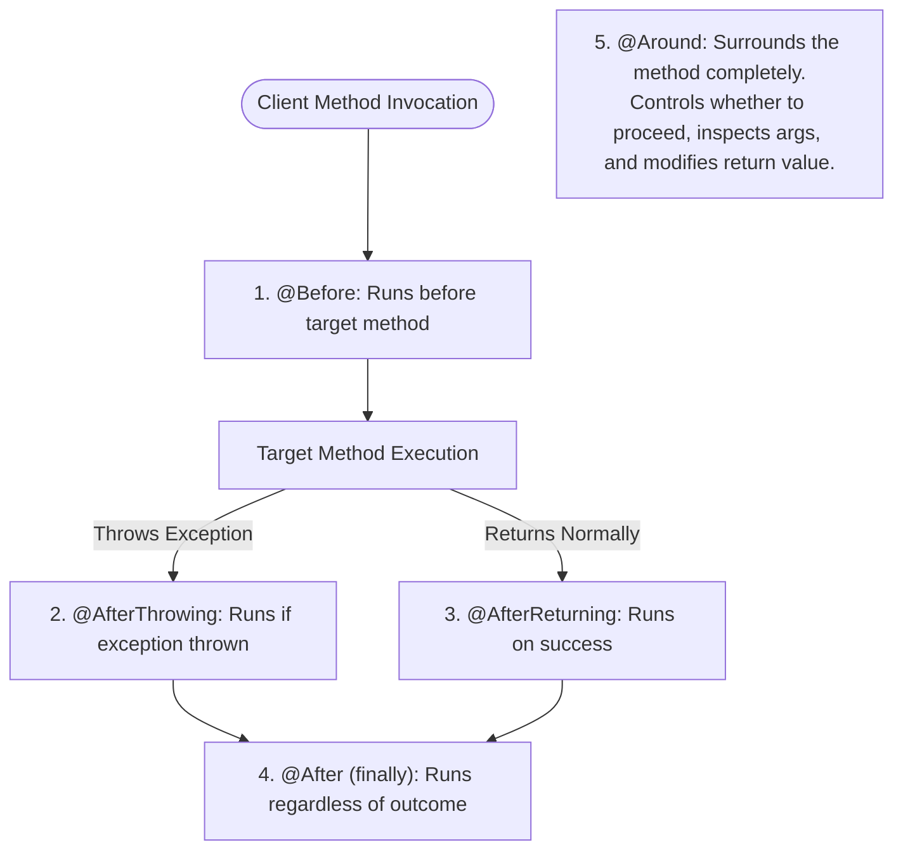


---

### Production Implementation: Custom Annotation-Based AOP

#### Step 1: Create Custom Annotation
```java
@Target(ElementType.METHOD)
@Retention(RetentionPolicy.RUNTIME)
public @interface LogAspect {}
```

#### Step 2: Annotate Business Method
```java
@Service
public class VehicleServices {
    @LogAspect
    public String playMusic(boolean started) {
        return "Playing music tracks...";
    }
}
```

#### Step 3: Implement Aspect Class
```java
@Aspect
@Component
public class LoggerAspect {

    // Intercepts any method marked with @LogAspect
    @Around("@annotation(com.example.LogAspect)")
    public Object logExecutionTime(ProceedingJoinPoint joinPoint) throws Throwable {
        long start = System.currentTimeMillis();

        // 1. Logic before method execution
        System.out.println("Starting execution of: " + joinPoint.getSignature().getName());

        // 2. Execute target method
        Object result = joinPoint.proceed();

        // 3. Logic after execution
        long elapsed = System.currentTimeMillis() - start;
        System.out.println("Finished in " + elapsed + " ms with result: " + result);

        return result; // Return result back to caller
    }
}
```

---

## 15. 1-Page Master Revision Cheat Sheet

> 💡 **Quick Revision Anchor (2-3 Words)**: `Core IoC Cheat Sheet`

| Topic | Key Concept | Production Rule |
| :--- | :--- | :--- |
| **IoC vs. DI** | IoC is the architectural principle; DI is the implementation mechanism. | Depend on interfaces, let Spring inject beans. |
| **`@Component` vs `@Bean`**| `@Component` for custom project code; `@Bean` inside `@Configuration` for third-party libraries. | Prefer constructor injection with `@Component`. |
| **Lifecycle** | `@PostConstruct` runs post-DI; `@PreDestroy` runs before context close. | Use for socket opening/closing and connection pools. |
| **Disambiguation** | `@Qualifier` (Priority 1) > `@Primary` (Priority 2) > Param Name (Priority 3). | Use `@Qualifier` for explicit, deterministic injection. |
| **Circular Dependencies**| Bean A $\leftrightarrow$ Bean B cycle causes `UnsatisfiedDependencyException`. | Break with `@Lazy` or redesign components. |
| **Singleton Scope** | Default. Exactly 1 instance per context. | **Must be stateless** to avoid thread race conditions. |
| **Prototype Scope** | New instance per request/injection. | Container does NOT execute `@PreDestroy`. |
| **AOP** | Separates cross-cutting concerns (logging, security). | Use `@Around` with custom annotations for clean pointcuts. |

[⬆ Back to Top](#📑-table-of-contents)
