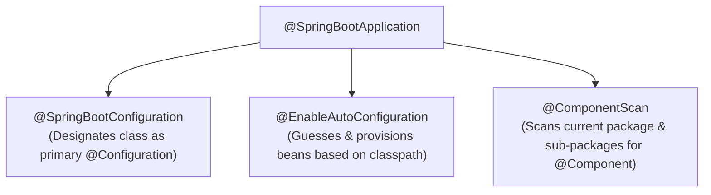
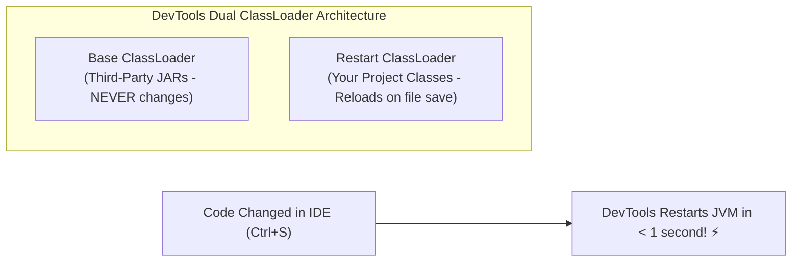
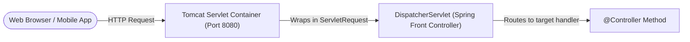
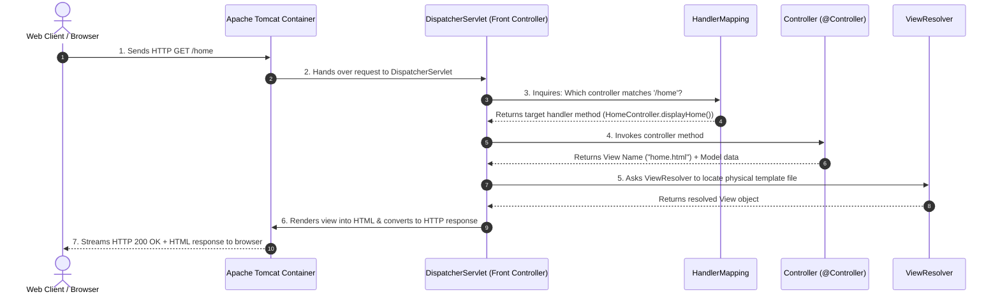
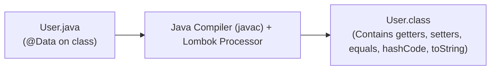
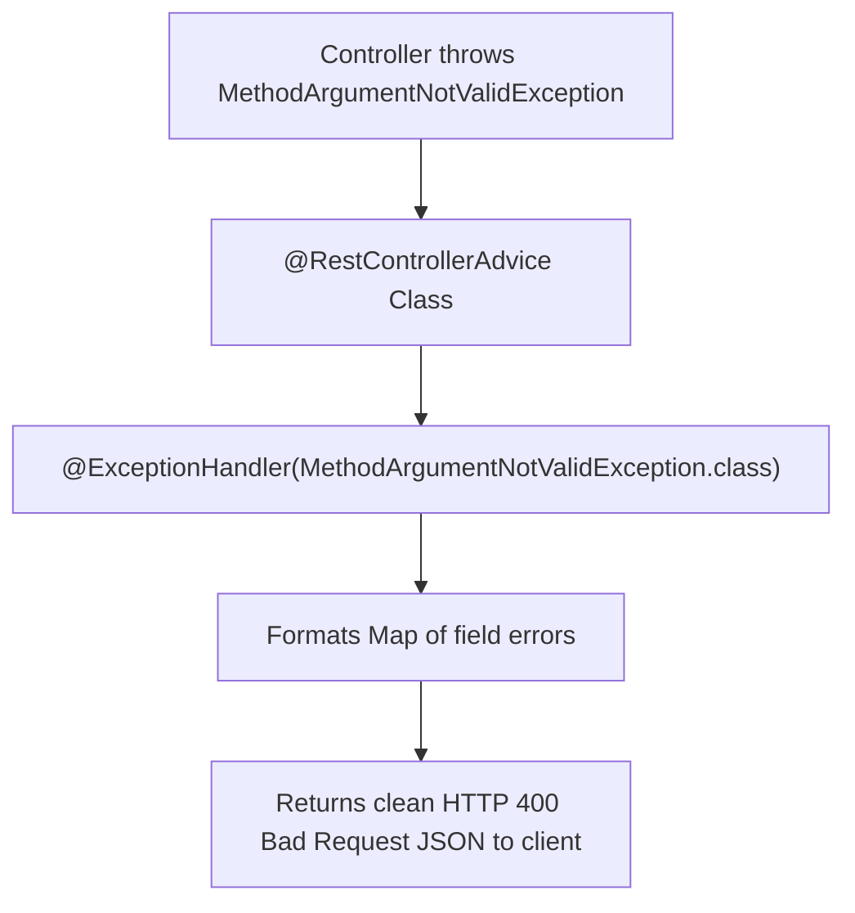

# 🌐 Spring Boot & Web MVC — Complete Master Guide

> **Foundation**: Based on EazyBytes *Spring, SpringBoot, JPA, Hibernate: Zero to Master* (Slides 63–85, 99–100, 136–137).  
> **Core Philosophy**: Spring Boot eliminates the configuration friction of classical Spring. Coupled with **Spring MVC** and **embedded Tomcat**, it powers modern Java web architectures through the **Front Controller pattern (`DispatcherServlet`)**, declarative validation, and centralized exception handling.

---

## 📑 Table of Contents
- [1. Spring Boot: The Hero of Spring Framework](#1-spring-boot-the-hero-of-spring-framework)
- [2. `@SpringBootApplication` & Auto-Configuration](#2-springbootapplication--auto-configuration)
- [3. Spring Boot DevTools (Fast Restart & LiveReload)](#3-spring-boot-devtools-fast-restart--livereload)
- [4. Web Architecture & Role of Servlets](#4-web-architecture--role-of-servlets)
- [5. Spring MVC 7-Step Request Lifecycle](#5-spring-mvc-7-step-request-lifecycle)
- [6. Request Mapping & Parameters (`@RequestParam` vs. `@PathVariable`)](#6-request-mapping--parameters-requestparam-vs-pathvariable)
- [7. View Controllers & Thymeleaf Integration](#7-view-controllers--thymeleaf-integration)
- [8. Boilerplate Reduction with Project Lombok](#8-boilerplate-reduction-with-project-lombok)
- [9. Declarative Bean Validation with `@Valid`](#9-declarative-bean-validation-with-valid)
- [10. Creating Custom Validation Annotations](#10-creating-custom-validation-annotations)
- [11. Centralized Global Exception Handling](#11-centralized-global-exception-handling)
- [12. 1-Page Master Revision Cheat Sheet](#12-1-page-master-revision-cheat-sheet)

---

## 1. Spring Boot: The Hero of Spring Framework

> 💡 **Quick Revision Anchor (2-3 Words)**: `Opinionated Zero-Config`

Introduced in **April 2014**, Spring Boot revolutionized Java enterprise development by removing the burdensome configuration overhead of traditional Spring.

```mermaid
flowchart TD
    subgraph ClassicalSpring ["Classical Spring Development (Before 2014)"]
        C1["Write complex pom.xml with version mismatches"] --> C2["Configure web.xml & DispatcherServlet"]
        C2 --> C3["Build WAR archive"]
        C3 --> C4["Install, configure & deploy to external Tomcat server"]
        C4 --> C5["Spend hours debugging ClassLoader conflicts"]
    end
    subgraph SpringBoot ["Spring Boot Approach (Modern)"]
        B1["Select Starters (spring-boot-starter-web)"] --> B2["Run public static void main(String[] args)"]
        B2 --> B3["Embedded Tomcat starts in 2 seconds ✅"]
    end
```



### Before vs. After Spring Boot Comparison:

| Feature | Classical Spring Framework | Spring Boot |
| :--- | :--- | :--- |
| **Configuration** | Heavy manual XML or verbose `@Configuration` classes. | **Auto-Configuration** (Sensible defaults based on classpath JARs). |
| **Server Deployment** | Packaged as **WAR** file $
ightarrow$ deployed to standalone external Tomcat/Jetty. | Packaged as self-contained executable **JAR** with **Embedded Tomcat**. |
| **Dependency Management**| Manually track individual library versions and handle incompatibilities. | **Starter POMs** (e.g., `spring-boot-starter-web`) with curated BOM versioning. |
| **Production Readiness**| Required writing custom health-check and metrics servlets from scratch. | Out-of-the-box **Actuator** endpoints (`/health`, `/metrics`). |

[⬆ Back to Top](#📑-table-of-contents)

---

## 2. `@SpringBootApplication` & Auto-Configuration

> 💡 **Quick Revision Anchor (2-3 Words)**: `Three Meta Annotations`

Every Spring Boot application begins with a main class annotated with **`@SpringBootApplication`**.

```java
@SpringBootApplication
public class EazySchoolApplication {
    public static void main(String[] args) {
        SpringApplication.run(EazySchoolApplication.class, args);
    }
}
```



### 1. `@SpringBootConfiguration`
An enhanced specialization of Spring's standard `@Configuration`. Marks the class as a source of bean definitions.

### 2. `@EnableAutoConfiguration`
The core engine of Spring Boot. Inspects classpath libraries (via `META-INF/spring/org.springframework.boot.autoconfigure.AutoConfiguration.imports`).  
- *Example*: If `h2.jar` is on the classpath, it automatically creates an in-memory `DataSource` bean!
- **Excluding specific auto-configurations**:
  ```java
  @SpringBootApplication(exclude = { DataSourceAutoConfiguration.class })
  ```

### 3. `@ComponentScan`
Directs Spring to scan the package containing the main class and all its sub-packages for stereotype components (`@Component`, `@Service`, `@Repository`, `@Controller`).

[⬆ Back to Top](#📑-table-of-contents)

---

## 3. Spring Boot DevTools (Fast Restart & LiveReload)

> 💡 **Quick Revision Anchor (2-3 Words)**: `Dual ClassLoader Restart`

Spring Boot DevTools dramatically enhances developer productivity during local coding cycles:

```xml
<dependency>
    <groupId>org.springframework.boot</groupId>
    <artifactId>spring-boot-devtools</artifactId>
    <scope>runtime</scope>
    <optional>true</optional>
</dependency>
```



### Core Features of DevTools:
1. **Dual ClassLoader Architecture**:
   - **Base ClassLoader**: Loads unchanging third-party libraries (Spring, Hibernate, Jackson).
   - **Restart ClassLoader**: Loads active project classes. Upon code edit, DevTools discards only the restart classloader and recreates it in milliseconds!
2. **Embedded LiveReload Server**:
   - Includes a built-in LiveReload server. When paired with the free browser extension, saving HTML/CSS files instantly refreshes the browser page.
3. **Automatic Cache Disabling**:
   - Automatically disables template caching (e.g., `spring.thymeleaf.cache=false`) so UI changes appear without restarting the app.
4. **Safety in Production**:
   - DevTools is automatically excluded when creating production fat JARs via `mvn package`.

[⬆ Back to Top](#📑-table-of-contents)

---

## 4. Web Architecture & Role of Servlets

> 💡 **Quick Revision Anchor (2-3 Words)**: `Tomcat And Servlets`

In Java web applications, the **Servlet Container (e.g., Apache Tomcat)** is the web server that accepts raw HTTP network packets and translates them into Java objects (`HttpServletRequest` and `HttpServletResponse`).



### Before Spring vs. With Spring:
- **Before Spring (Classical Servlets)**:
  - Developers had to manually write individual servlet classes (`HomeServlet`, `LoginServlet`, `DashboardServlet`), configure URL mappings inside `web.xml`, and manually parse request parameters from strings.
- **With Spring (`DispatcherServlet`)**:
  - Spring provides a single **Front Controller** called **`DispatcherServlet`**.
  - Tomcat forwards **all incoming HTTP requests** to `DispatcherServlet`, which manages routing, data binding, validation, view resolution, and response generation automatically.

[⬆ Back to Top](#📑-table-of-contents)

---

## 5. Spring MVC 7-Step Request Lifecycle

> 💡 **Quick Revision Anchor (2-3 Words)**: `DispatcherServlet 7 Steps`

The core internal flow of every web request entering a Spring MVC application follows 7 distinct steps:



### The 5 Key Spring MVC Components:
1. **`DispatcherServlet`**: The central orchestrator that coordinates all incoming web requests.
2. **`HandlerMapping`**: Maps incoming URL paths, HTTP methods, and headers to the correct controller method.
3. **Controller**: Contains application business logic, processes input data, and returns a view name.
4. **Model**: A map of key-value data attributes passed from the controller to the view template.
5. **`ViewResolver`**: Resolves logical view names (e.g., `"home"`) to actual physical template files (e.g., `/templates/home.html`).

[⬆ Back to Top](#📑-table-of-contents)

---

## 6. Request Mapping & Parameters (`@RequestParam` vs. `@PathVariable`)

> 💡 **Quick Revision Anchor (2-3 Words)**: `Query vs Path Param`

### 1. Multi-Path `@RequestMapping`
You can map multiple URL patterns to a single handler method:
```java
@Controller
public class HomeController {

    // Maps root, /home, and /index to the same page
    @RequestMapping(value = {"", "/", "/home", "/index"})
    public String displayHomePage(Model model) {
        model.addAttribute("username", "Lucy");
        return "home.html";
    }
}
```

---

### 2. `@RequestParam` (Query Parameters & Form Data)
Extracts values from HTTP query strings (`?festival=true&federal=true`) or form POST data:

```java
// URL: /holidays?festival=true&federal=false
@GetMapping("/holidays")
public String displayHolidays(
    @RequestParam(name = "festival", required = false, defaultValue = "true") boolean festival,
    @RequestParam(name = "federal", required = false, defaultValue = "false") boolean federal,
    Model model
) {
    model.addAttribute("festival", festival);
    return "holidays.html";
}
```
- **Attributes**: `name` / `value` (parameter name), `required` (default: `true`), `defaultValue`.

---

### 3. `@PathVariable` (RESTful URI Path Segments)
Extracts dynamic variables directly from the URI path:

```java
// URL: /holidays/festival OR /holidays/federal
@GetMapping("/holidays/{display}")
public String displayHolidays(@PathVariable(name = "display") String display, Model model) {
    model.addAttribute("displayFilter", display);
    return "holidays.html";
}
```

---

### Comparison Matrix:

| Feature | `@RequestParam` | `@PathVariable` |
| :--- | :--- | :--- |
| **URL Structure** | `/users?id=101&status=active` (Query string). | `/users/101/active` (Path segment). |
| **Primary Use Case** | Optional filtering, sorting, pagination, search queries. | Identifying specific resources in RESTful designs. |
| **Missing Values** | Easily made optional via `defaultValue = "..."` or `required = false`. | Part of the fixed URI path; missing segment leads to HTTP 404. |

[⬆ Back to Top](#📑-table-of-contents)

---

## 7. View Controllers & Thymeleaf Integration

> 💡 **Quick Revision Anchor (2-3 Words)**: `View Routing & Thymeleaf`

### 1. Direct View Controllers with `ViewControllerRegistry`
When an endpoint has **no business logic** and simply serves a static HTML template, avoid creating an empty `@Controller` class. Register it directly in a `WebMvcConfigurer`:

```java
@Configuration
public class WebConfig implements WebMvcConfigurer {

    @Override
    public void addViewControllers(ViewControllerRegistry registry) {
        // Direct route-to-view mapping without writing controller methods!
        registry.addViewController("/courses").setViewName("courses");
        registry.addViewController("/about").setViewName("about");
    }
}
```

---

### 2. Thymeleaf Template Engine
Thymeleaf is a modern server-side Java template engine that natively integrates with Spring MVC and Spring Security:

```html
<!DOCTYPE html>
<html xmlns:th="http://www.thymeleaf.org">
<head><title>Course Catalog</title></head>
<body>
    <!-- Outputting dynamic text -->
    <h1 th:text="'Welcome, ' + ${username} + '!'">Welcome!</h1>

    <!-- Iterating over collection -->
    <table>
        <thead>
            <tr><th>Course Name</th><th>Price</th></tr>
        </thead>
        <tbody>
            <tr th:each="course : ${courses}">
                <td th:text="${course.name}">Java Masterclass</td>
                <td th:text="${#numbers.formatDecimal(course.price, 1, 2)}">$99.00</td>
            </tr>
        </tbody>
    </table>
</body>
</html>
```

[⬆ Back to Top](#📑-table-of-contents)

---

## 8. Boilerplate Reduction with Project Lombok

> 💡 **Quick Revision Anchor (2-3 Words)**: `Compile-Time Bytecode Gen`

**Project Lombok** is a compile-time annotation processor that plugs into the Java compiler to automatically generate repetitive boilerplate bytecode into `.class` files.

```xml
<dependency>
    <groupId>org.projectlombok</groupId>
    <artifactId>lombok</artifactId>
    <optional>true</optional>
</dependency>
```



### Core Lombok Annotations:

| Annotation | Generated Bytecode |
| :--- | :--- |
| **`@Getter` / `@Setter`** | Generates standard getter and setter methods for all fields. |
| **`@ToString`** | Generates human-readable `toString()` with all field values. |
| **`@EqualsAndHashCode`** | Generates `equals()` and `hashCode()` methods adhering to the contract. |
| **`@NoArgsConstructor`** | Generates default public zero-argument constructor (required by Hibernate). |
| **`@AllArgsConstructor`** | Generates constructor accepting all declared fields. |
| **`@RequiredArgsConstructor`**| Generates constructor for all **`final`** and `@NonNull` fields (Best for Spring DI!). |
| **`@Data`** | Shortcut bundling `@Getter`, `@Setter`, `@ToString`, `@EqualsAndHashCode`, and `@RequiredArgsConstructor`. |

[⬆ Back to Top](#📑-table-of-contents)

---

## 9. Declarative Bean Validation with `@Valid`

> 💡 **Quick Revision Anchor (2-3 Words)**: `Declarative Validation Rules`

Instead of cluttering controllers with endless manual `if (field == null)` checks, add the standard **Bean Validation starter**:

```xml
<dependency>
    <groupId>org.springframework.boot</groupId>
    <artifactId>spring-boot-starter-validation</artifactId>
</dependency>
```

> [!IMPORTANT]
> **Triggering Validation**: You **must** annotate the incoming parameter with **`@Valid`** (e.g., `public String save(@Valid @RequestBody UserDTO user)`). Without `@Valid`, Spring skips all DTO constraint annotations!

---

### Core Validation Annotations:

| Annotation | Description | Example Target |
| :--- | :--- | :--- |
| **`@NotNull`** | Value must not be `null`. (Allows empty string `""` or whitespace `" "`). | Objects, IDs. |
| **`@NotEmpty`** | Value must not be `null` and length/size $> 0$. (Allows whitespace `" "`). | Collections, Lists. |
| **`@NotBlank`** | Value must not be `null` and trimmed length $> 0$. (Strictest string check). | Names, Passwords. |
| **`@Size(min, max)`** | String character length or Collection element count must be within bounds. | `password` (6–20 chars). |
| **`@Min(v)`, `@Max(v)`**| Numeric value must be $\ge$ min or $\le$ max. | `age` (18–60). |
| **`@Positive`** | Numeric value must be strictly $> 0$. | `salary`, `price`. |
| **`@Digits(i, f)`** | Number must not exceed integer digits `i` and fraction digits `f`. | `accountBalance` (6, 2). |
| **`@Email`** | Validates email syntax (`local@domain`). | `email`. |
| **`@Pattern(regexp)`** | Validates input against a strict Regular Expression. | Corporate emails, Phone. |
| **`@Past` / `@Future`**| Date must be in the past or future relative to current time. | `dateOfBirth`, `cardExpiry`. |

#### Example Validated DTO:
```java
@Data
public class ContactRequest {

    @NotBlank(message = "Name must not be blank")
    @Size(min = 3, message = "Name must be at least 3 characters long")
    private String name;

    @NotBlank(message = "Email must not be blank")
    @Email(message = "Please provide a valid email address")
    private String email;

    @NotBlank(message = "Subject must not be blank")
    @Size(min = 5, message = "Subject must be at least 5 characters long")
    private String subject;

    @Min(value = 18, message = "Age must be 18 or older")
    private int age;
}
```

---

### Handling Errors in Spring MVC Form Submissions
In traditional MVC apps, Spring populates errors into an **`Errors`** or **`BindingResult`** object placed immediately after the `@Valid` model:

```java
@PostMapping("/saveMsg")
public String saveMessage(@Valid @ModelAttribute("contact") ContactRequest contact, Errors errors) {
    if (errors.hasErrors()) {
        return "contact.html"; // Return back to form page showing validation error messages
    }
    contactService.saveMessageDetails(contact);
    return "redirect:/contact";
}
```

[⬆ Back to Top](#📑-table-of-contents)

---

## 10. Creating Custom Validation Annotations

> 💡 **Quick Revision Anchor (2-3 Words)**: `Custom Constraint Validator`

When built-in annotations are insufficient (e.g., rejecting weak passwords like `"12345"` or `"password"`), build a custom constraint in **3 steps**:

### Step 1: Define the Annotation
```java
@Target({ElementType.METHOD, ElementType.FIELD})
@Retention(RetentionPolicy.RUNTIME)
@Constraint(validatedBy = PasswordStrengthValidator.class) // Links to implementation
public @interface PasswordValidator {
    String message() default "Please choose a strong password";
    Class<?>[] groups() default {};
    Class<? extends Payload>[] payload() default {};
}
```

### Step 2: Implement `ConstraintValidator`
```java
public class PasswordStrengthValidator implements ConstraintValidator<PasswordValidator, String> {

    private final List<String> weakPasswords = Arrays.asList("12345", "password", "qwerty", "admin123");

    @Override
    public boolean isValid(String passwordField, ConstraintValidatorContext context) {
        if (passwordField == null || passwordField.isBlank()) {
            return false; // Null or empty is invalid
        }
        return !weakPasswords.contains(passwordField.toLowerCase());
    }
}
```

### Step 3: Apply Annotation on DTO Field
```java
public class UserRegistrationDto {
    @NotBlank(message = "Password must not be blank")
    @Size(min = 6, message = "Password must be at least 6 characters")
    @PasswordValidator // Custom validation rule applied!
    private String password;
}
```

[⬆ Back to Top](#📑-table-of-contents)

---

## 11. Centralized Global Exception Handling

> 💡 **Quick Revision Anchor (2-3 Words)**: `Controller Advice Interceptor`

Never let uncaught exceptions return raw stack traces or default 500 error pages. Use **`@RestControllerAdvice`** (or `@ControllerAdvice`) to intercept exceptions application-wide:



### Production Validation Exception Handler:
```java
@RestControllerAdvice
public class GlobalExceptionHandler {

    @ExceptionHandler(MethodArgumentNotValidException.class)
    @ResponseStatus(HttpStatus.BAD_REQUEST)
    public Map<String, String> handleValidationExceptions(MethodArgumentNotValidException ex) {
        Map<String, String> errorMap = new HashMap<>();

        ex.getBindingResult().getFieldErrors().forEach(error -> 
            errorMap.put(error.getField(), error.getDefaultMessage())
        );

        return errorMap; // Returns JSON: { "name": "Name must not be blank", ... }
    }

    @ExceptionHandler(Exception.class)
    public ResponseEntity<String> handleGenericException(Exception ex) {
        return ResponseEntity.status(HttpStatus.INTERNAL_SERVER_ERROR)
                             .body("An unexpected error occurred: " + ex.getMessage());
    }
}
```

[⬆ Back to Top](#📑-table-of-contents)

---

## 12. 1-Page Master Revision Cheat Sheet

> 💡 **Quick Revision Anchor (2-3 Words)**: `Web MVC Cheat Sheet`

| Topic | Key Concept | Production Rule |
| :--- | :--- | :--- |
| **Spring Boot** | Auto-configures sensible defaults; embeds Tomcat. | Use Starters (`spring-boot-starter-web`) for clean BOM management. |
| **DevTools** | Dual ClassLoader: Base (JARs) + Restart (Code). | Great for rapid local reloads; automatically excluded from prod JARs. |
| **`DispatcherServlet`**| Single Front Controller coordinating all web requests. | Dispatches requests to `HandlerMapping` and returns rendered views. |
| **Params** | `@RequestParam` for query strings; `@PathVariable` for URI segments. | Use `@PathVariable` for REST IDs; `@RequestParam` for filters. |
| **Lombok** | Compile-time bytecode generation. | Use `@RequiredArgsConstructor` for clean constructor DI with `final` fields. |
| **Validation** | Declarative constraints via `jakarta.validation`. | Always annotate `@Valid` on controller `@RequestBody`. |
| **Custom Validator** | `@Constraint(validatedBy = ...)` + `ConstraintValidator`. | Implement `isValid()` returning boolean. |
| **Exception Handling**| `@RestControllerAdvice` + `@ExceptionHandler`. | Intercept `MethodArgumentNotValidException` and return HTTP 400 maps. |

[⬆ Back to Top](#📑-table-of-contents)
