# 🌐 Spring Boot & Web MVC — Complete Master Guide

> **Foundation**: Based on EazyBytes *Spring, SpringBoot, JPA, Hibernate: Zero to Master* (Slides 63–85, 99–100, 136–137) updated for **Spring Boot 3+ / Spring Framework 6+ (Jakarta EE)**.  
> **Core Philosophy**: Spring Boot eliminates the configuration friction of classical Spring. Coupled with **Spring MVC** and **embedded Tomcat**, it powers modern Java web architectures through the **Front Controller pattern (`DispatcherServlet`)**, declarative validation, DTO contracts, and centralized exception handling.

---

## 📑 Table of Contents
- [1. Spring Boot: The Hero of Spring Framework](#1-spring-boot-the-hero-of-spring-framework)
- [2. `@SpringBootApplication` & Auto-Configuration](#2-springbootapplication--auto-configuration)
- [3. Configuration Basics: `application.properties` vs. `application.yml`](#3-configuration-basics-applicationproperties-vs-applicationyml)
- [4. Spring Boot DevTools (Fast Restart & LiveReload)](#4-spring-boot-devtools-fast-restart--livereload)
- [5. Web Architecture, Servlets & Filter-Interceptor Pipeline](#5-web-architecture-servlets--filter-interceptor-pipeline)
- [6. Spring MVC 7-Step Request Lifecycle (`DispatcherServlet`)](#6-spring-mvc-7-step-request-lifecycle-dispatcherservlet)
- [7. HTTP Methods, Status Codes & Idempotency](#7-http-methods-status-codes--idempotency)
- [8. Request Mapping & Parameter Annotations](#8-request-mapping--parameter-annotations)
- [9. Data Transfer Objects (DTOs) vs. JPA Entities](#9-data-transfer-objects-dtos-vs-jpa-entities)
- [10. Declarative Bean Validation (`@Valid` vs. `@Validated`)](#10-declarative-bean-validation-valid-vs-validated)
- [11. Centralized Global Exception Handling](#11-centralized-global-exception-handling)
- [12. View Controllers & Thymeleaf Integration (Optional)](#12-view-controllers--thymeleaf-integration-optional)
- [13. Boilerplate Reduction with Project Lombok](#13-boilerplate-reduction-with-project-lombok)
- [14. 1-Page Master Revision Cheat Sheet](#14-1-page-master-revision-cheat-sheet)

---

## 1. Spring Boot: The Hero of Spring Framework

> 💡 **Quick Revision Anchor (2-3 Words)**: `Opinionated Zero-Config`

Introduced to revolutionize Java enterprise development, Spring Boot removes the burdensome XML and manual plumbing of traditional Spring by providing **opinionated starters**, **auto-configuration**, and an **embedded web server**.

```mermaid
flowchart TD
    subgraph ClassicalSpring ["Classical Spring Development (Before Spring Boot)"]
        C1["Write complex pom.xml with version mismatches"] --> C2["Configure web.xml & DispatcherServlet"]
        C2 --> C3["Build WAR archive"]
        C3 --> C4["Install, configure & deploy to external Tomcat server"]
        C4 --> C5["Spend hours debugging ClassLoader conflicts"]
    end
    subgraph SpringBoot ["Spring Boot Approach (Modern)"]
        B1["Select Starters (spring-boot-starter-web)"] --> B2["Run public static void main(String(array) args)"]
        B2 --> B3["Embedded Tomcat starts in 2 seconds ✅"]
    end
```


### Spring Framework vs. Spring Boot:

| Feature | Classical Spring Framework | Spring Boot |
| :--- | :--- | :--- |
| **Core Goal** | Provides core IoC, DI, AOP, and enterprise abstractions. | Accelerates development by eliminating configuration friction. |
| **Configuration** | Heavy manual XML or verbose `@Configuration` classes. | **Auto-Configuration** (Sensible defaults based on classpath JARs). |
| **Server Deployment** | Packaged as **WAR** file ➔ deployed to standalone external Tomcat/Jetty. | Packaged as self-contained executable **JAR** with **Embedded Tomcat**. |
| **Dependency Management**| Manually track individual library versions and handle incompatibilities. | **Starter POMs** (e.g., `spring-boot-starter-web`) with curated BOM versioning. |
| **Production Readiness**| Required writing custom health-check and metrics servlets from scratch. | Out-of-the-box **Actuator** endpoints (`/health`, `/metrics`). |

---

## 2. `@SpringBootApplication` & Auto-Configuration

> 💡 **Quick Revision Anchor (2-3 Words)**: `Three Meta Annotations`

Every Spring Boot application starts with a bootstrap class annotated with **`@SpringBootApplication`**:

```java
@SpringBootApplication
public class EazySchoolApplication {
    public static void main(String[] args) {
        SpringApplication.run(EazySchoolApplication.class, args);
    }
}
```

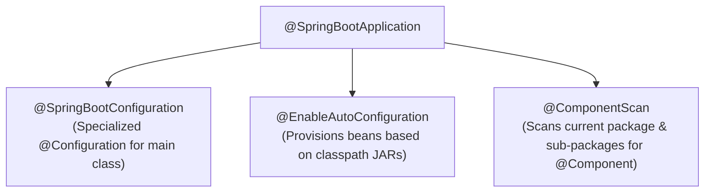


### 1. `@SpringBootConfiguration`
An enhanced specialization of Spring's standard `@Configuration`. Marks the class as a source of bean definitions for the Spring IoC container.

### 2. `@EnableAutoConfiguration`
The core engine of Spring Boot. It scans classpath libraries (via `META-INF/spring/org.springframework.boot.autoconfigure.AutoConfiguration.imports`).  
- *Example*: If `h2.jar` is on the classpath, it automatically configures an in-memory `DataSource` bean and `JdbcTemplate`!
- **Excluding specific auto-configurations**:
  ```java
  @SpringBootApplication(exclude = { DataSourceAutoConfiguration.class })
  ```

### 3. `@ComponentScan`
Directs Spring to scan the package containing the main class and all its sub-packages for stereotype components (`@Component`, `@Service`, `@Repository`, `@Controller`, `@RestController`).

---

## 3. Configuration Basics: `application.properties` vs. `application.yml`

> 💡 **Quick Revision Anchor (2-3 Words)**: `Properties vs YAML`

Spring Boot reads default configurations from `src/main/resources/application.properties` or `application.yml`.

### Comparison:

```properties
# application.properties (Flat key-value syntax)
server.port=8080
spring.datasource.url=jdbc:mysql://localhost:3306/school_db
spring.datasource.username=root
spring.datasource.password=secret123
app.cors.allowed-origins[0]=http://localhost:3000
app.cors.allowed-origins[1]=https://myapp.com
```

```yaml
# application.yml (Hierarchical indent-based syntax)
server:
  port: 8080

spring:
  datasource:
    url: jdbc:mysql://localhost:3306/school_db
    username: root
    password: secret123

app:
  cors:
    allowed-origins:
      - http://localhost:3000
      - https://myapp.com
```

| Feature | `application.properties` | `application.yml` |
| :--- | :--- | :--- |
| **Format** | Flat dot-separated key-value pairs. | Hierarchical structure with strict 2-space indentation. |
| **Readability** | Verbose with repeated prefixes (`spring.datasource.*`). | Highly readable, eliminates redundant prefix repetition. |
| **List / Map Support** | Uses array indices (`branches[0]=NYC`). | Uses natural bullet lists (`- NYC`). |
| **`@PropertySource`** | Supported directly by Spring `@PropertySource`. | Requires custom `YamlPropertySourceFactory` for `@PropertySource`. |

---

## 4. Spring Boot DevTools (Fast Restart & LiveReload)

> 💡 **Quick Revision Anchor (2-3 Words)**: `Dual ClassLoader Restart`

Spring Boot DevTools speeds up local inner-loop development:

```xml
<dependency>
    <groupId>org.springframework.boot</groupId>
    <artifactId>spring-boot-devtools</artifactId>
    <scope>runtime</scope>
    <optional>true</optional>
</dependency>
```

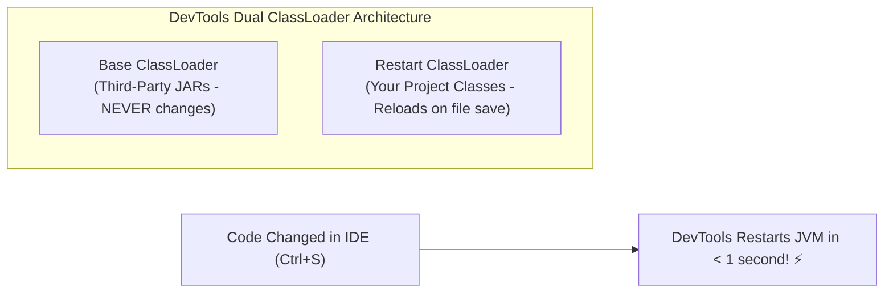


### Key Benefits:
1. **Dual ClassLoader Restart**: Discards and rebuilds only the project classes (`Restart ClassLoader`), restarting the JVM in milliseconds without reloading heavy third-party JARs.
2. **Automatic Cache Disabling**: Disables template caching (`spring.thymeleaf.cache=false`) so UI changes render instantly.
3. **LiveReload Server**: Auto-refreshes connected browser tabs on HTML/CSS file saves.
4. **Safety in Production**: Automatically omitted from production fat JAR packages created via `mvn package`.

---

## 5. Web Architecture, Servlets & Filter-Interceptor Pipeline

> 💡 **Quick Revision Anchor (2-3 Words)**: `Tomcat Servlets Pipeline`

In Java web applications, the **Servlet Container (e.g., Embedded Apache Tomcat)** accepts raw HTTP TCP connections and converts them into Java objects (`HttpServletRequest` and `HttpServletResponse`).

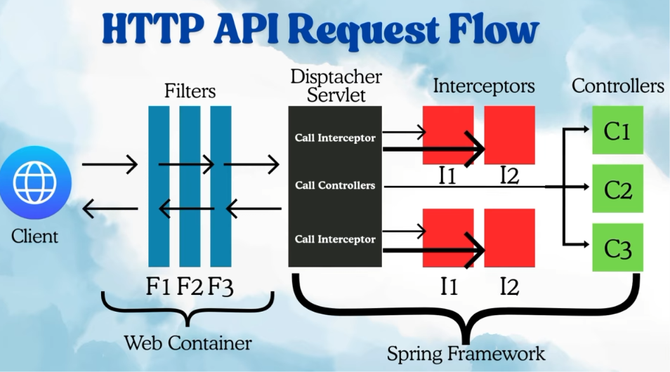

```mermaid
flowchart LR
    Client(["Client Request"]) --> Tomcat["Servlet Container (Tomcat)"]
    Tomcat --> Filter["Servlet Filters (Security, CORS, Logging)"]
    Filter --> DS["DispatcherServlet (Front Controller)"]
    DS --> Interceptor["HandlerInterceptor (preHandle / postHandle)"]
    Interceptor --> Controller["@Controller / @RestController"]
    Controller --> Service["@Service Layer"]
    Service --> Response["HTTP Response"]
```


### Differences Between Servlet Filters and Spring Interceptors:

| Dimension | Servlet Filter (`jakarta.servlet.Filter`) | HandlerInterceptor (`org.springframework.web`) |
| :--- | :--- | :--- |
| **Layer** | Low-level **Servlet Container** level (Tomcat). | **Spring MVC Framework** level (Inside DispatcherServlet). |
| **Execution Point**| Before request reaches `DispatcherServlet`. | Between `DispatcherServlet` and target `@Controller`. |
| **Spring Context Awareness**| Container-managed; difficult to access controller metadata. | Fully Spring-aware; can inspect handler method annotations. |
| **Best Used For** | Request-level security, raw request wrapping, CORS, GZIP compression. | Controller execution metrics, audit logging, user permission checks. |

---

## 6. Spring MVC 7-Step Request Lifecycle (`DispatcherServlet`)

> 💡 **Quick Revision Anchor (2-3 Words)**: `DispatcherServlet 7 Steps`

The core internal flow of every incoming web request follows **7 distinct steps**:

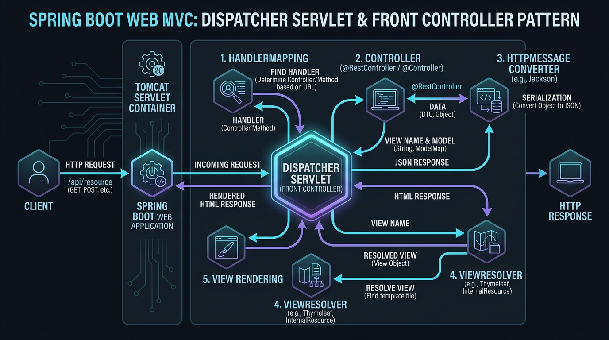

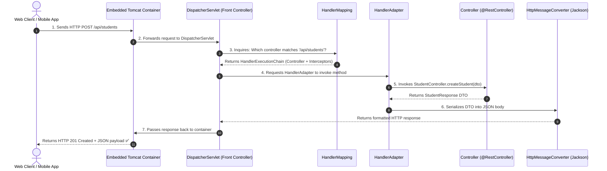


### The 5 Core Spring MVC Components:
1. **`DispatcherServlet`**: The central **Front Controller** orchestrating all requests.
2. **`HandlerMapping`**: Maps incoming URL paths, HTTP methods, and headers to the matching controller method.
3. **`HandlerAdapter`**: Adapts and invokes the underlying controller method with parameter binding.
4. **`Controller` / `@RestController`**: Executes business logic and returns data models or view names.
5. **`HttpMessageConverter`**: Serializes/deserializes Java objects into JSON/XML payloads (e.g., `MappingJackson2HttpMessageConverter`).

---

## 7. HTTP Methods, Status Codes & Idempotency

> 💡 **Quick Revision Anchor (2-3 Words)**: `HTTP Verbs & Status Codes`

### 1. HTTP Verbs & Characteristics:

| HTTP Verb | Primary Purpose | Safe? | Idempotent? | Success Status |
| :--- | :--- | :---: | :---: | :---: |
| **`GET`** | Retrieve a resource without modifying server state. | ✅ Yes | ✅ Yes | `200 OK` |
| **`POST`** | Create a new subordinate resource. | ❌ No | ❌ No | `201 Created` |
| **`PUT`** | Completely replace an existing resource (or create if absent). | ❌ No | ✅ Yes | `200 OK` / `204 No Content` |
| **`PATCH`** | Partially update specific fields of an existing resource. | ❌ No | ⚠️ Context Dependent | `200 OK` |
| **`DELETE`**| Delete an existing resource. | ❌ No | ✅ Yes | `204 No Content` / `200 OK` |

- **Safe Method**: Calling the endpoint does **not change server state** (read-only operations).
- **Idempotent Method**: Making $N$ identical requests has the **exact same side-effect** on the server state as making 1 request (e.g., deleting ID 42 five times leaves the database in the same state).

---

### 2. Essential HTTP Status Codes:

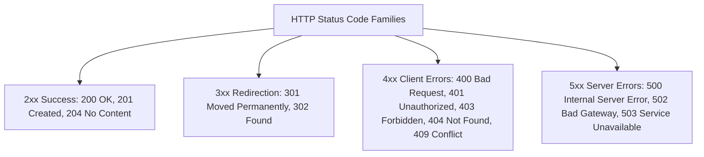


- **`200 OK`**: Standard success response for `GET`, `PUT`, or `PATCH`.
- **`201 Created`**: Resource successfully created via `POST`. Should include `Location` header.
- **`204 No Content`**: Action succeeded, but no body returned (standard for `DELETE`).
- **`400 Bad Request`**: Validation failure or malformed JSON payload.
- **`401 Unauthorized`**: Authentication missing or invalid (client identity unknown).
- **`403 Forbidden`**: Authenticated user lacks required permissions/roles.
- **`404 Not Found`**: Target URI or entity ID does not exist.
- **`409 Conflict`**: State conflict (e.g., trying to register an email that already exists).
- **`500 Internal Server Error`**: Uncaught backend server exception.

---

## 8. Request Mapping & Parameter Annotations

> 💡 **Quick Revision Anchor (2-3 Words)**: `REST Mapping Annotations`

### 1. `@Controller` vs. `@RestController`
$$\mathbf{@RestController} = \mathbf{@Controller} + \mathbf{@ResponseBody}$$
- **`@Controller`**: Standard MVC controller where return values represent logical **view names** (`"home.html"`), processed by a `ViewResolver`.
- **`@RestController`**: RESTful controller where return values are written directly to the **HTTP response body** as JSON/XML via `HttpMessageConverter`.

---

### 2. Parameter Extraction Annotations:

```java
@RestController
@RequestMapping("/api/v1/students")
public class StudentRestController {

    @Autowired
    private StudentService studentService;

    // 1. @GetMapping with @PathVariable and @RequestParam
    // URL: /api/v1/students/search?course=Java&page=0
    @GetMapping("/search")
    public ResponseEntity<List<StudentResponse>> searchStudents(
            @RequestParam(name = "course", required = false, defaultValue = "All") String course,
            @RequestParam(name = "page", defaultValue = "0") int page) {
        return ResponseEntity.ok(studentService.search(course, page));
    }

    // 2. @GetMapping with @PathVariable
    // URL: /api/v1/students/42
    @GetMapping("/{id}")
    public ResponseEntity<StudentResponse> getStudentById(@PathVariable("id") Long studentId) {
        return ResponseEntity.ok(studentService.findById(studentId));
    }

    // 3. @PostMapping with @RequestBody & @Valid
    @PostMapping
    public ResponseEntity<StudentResponse> createStudent(
            @Valid @RequestBody StudentCreateRequest request,
            @RequestHeader(name = "X-Client-Id", required = false) String clientId) {
        StudentResponse response = studentService.create(request);
        return ResponseEntity.status(HttpStatus.CREATED).body(response);
    }

    // 4. @PutMapping: Complete Replacement
    @PutMapping("/{id}")
    public ResponseEntity<StudentResponse> updateStudent(
            @PathVariable Long id,
            @Valid @RequestBody StudentUpdateRequest request) {
        return ResponseEntity.ok(studentService.update(id, request));
    }

    // 5. @DeleteMapping: Deletion
    @DeleteMapping("/{id}")
    public ResponseEntity<Void> deleteStudent(@PathVariable Long id) {
        studentService.delete(id);
        return ResponseEntity.noContent().build(); // HTTP 204
    }
}
```

---

## 9. Data Transfer Objects (DTOs) vs. JPA Entities

> 💡 **Quick Revision Anchor (2-3 Words)**: `Entity DTO Separation`

A **Data Transfer Object (DTO)** is an object carrying data between processes (Client $\leftrightarrow$ Server) without containing any database persistence behavior.

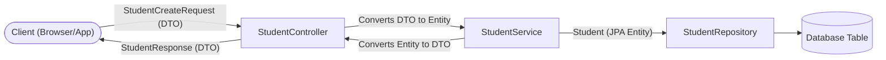


### Why APIs Must NOT Expose JPA Entities Directly:

1. **Security & Mass Assignment (Over-Posting)**: Malicious clients can send hidden fields (e.g., `role: "ADMIN"` or `accountBalance: 999999`) that get automatically bound to entity fields.
2. **Tight Architectural Coupling**: Renaming a database column or altering table schema immediately breaks existing mobile/frontend client contracts.
3. **Infinite JSON Recursion**: Bidirectional JPA relationships (`@OneToMany` $\leftrightarrow$ `@ManyToOne`) cause Jackson serialization infinite loops and `StackOverflowError`.
4. **`LazyInitializationException`**: Accessing uninitialized lazy collections during Jackson serialization outside a transaction throws runtime exceptions.
5. **Performance / Network Overhead**: Prevents transmitting large unnecessary internal database columns over the wire.

---

### DTO Implementation Pattern:

```java
// 1. Request DTO (Validation applied on incoming fields)
public record StudentCreateRequest(
    @NotBlank(message = "Name is required")
    @Size(min = 2, max = 50, message = "Name must be 2 to 50 characters")
    String name,

    @NotBlank(message = "Email is required")
    @Email(message = "Invalid email format")
    String email,

    @Min(value = 18, message = "Age must be at least 18")
    int age
) {}

// 2. Response DTO (Clean view returned to client, hides internal DB details)
public record StudentResponse(
    Long id,
    String name,
    String email,
    String enrollmentStatus,
    LocalDateTime registeredAt
) {}
```

---

## 10. Declarative Bean Validation (`@Valid` vs. `@Validated`)

> 💡 **Quick Revision Anchor (2-3 Words)**: `Declarative Validation Rules`

Spring Boot leverages the **Jakarta Bean Validation** API (Hibernate Validator implementation):

```xml
<dependency>
    <groupId>org.springframework.boot</groupId>
    <artifactId>spring-boot-starter-validation</artifactId>
</dependency>
```

### Core Validation Annotations:

| Annotation | Description | Example Target |
| :--- | :--- | :--- |
| **`@NotNull`** | Value must not be `null`. (Allows empty string `""` or whitespace `" "`). | Objects, IDs. |
| **`@NotEmpty`** | Value must not be `null` and length/size $> 0$. (Allows whitespace `" "`). | Collections, Lists. |
| **`@NotBlank`** | Value must not be `null` and trimmed length $> 0$. (Strictest string check). | Names, Passwords. |
| **`@Size(min, max)`** | String character length or Collection element count must be within bounds. | `password` (6–20 chars). |
| **`@Min(v)`, `@Max(v)`**| Numeric value must be $\ge$ min or $\le$ max. | `age` (18–60). |
| **`@Positive`** | Numeric value must be strictly $> 0$. | `salary`, `price`. |
| **`@Email`** | Validates standard email address syntax (`local@domain`). | `email`. |
| **`@Pattern(regexp)`** | Validates input against a strict Regular Expression. | Phone number, Zip code. |
| **`@Past` / `@Future`**| Date must be in the past or future relative to current time. | `dateOfBirth`, `cardExpiry`. |

---

### `@Valid` vs. `@Validated`:

| Dimension | `@Valid` (`jakarta.validation.Valid`) | `@Validated` (`org.springframework.validation.annotation.Validated`) |
| :--- | :--- | :--- |
| **Source** | Standard **Jakarta EE / JSR-380** specification. | **Spring Framework** specialized annotation. |
| **Target Level** | Controller method parameters, nested DTO fields. | Class-level (e.g., `@Validated` on `@Service` classes) & controller parameters. |
| **Validation Groups**| ❌ Does not support validation groups. | ✅ Supports **Validation Groups** (e.g., different rules on Create vs Update). |
| **Method Validation**| Validates `@RequestBody` in controllers. | Enables method-level validation on Spring Beans (triggers `ConstraintViolationException`). |

---

## 11. Centralized Global Exception Handling

> 💡 **Quick Revision Anchor (2-3 Words)**: `ControllerAdvice Exception Interception`

Instead of scattering messy `try-catch` blocks throughout controllers, centralize error processing using **`@RestControllerAdvice`** and **`@ExceptionHandler`**:

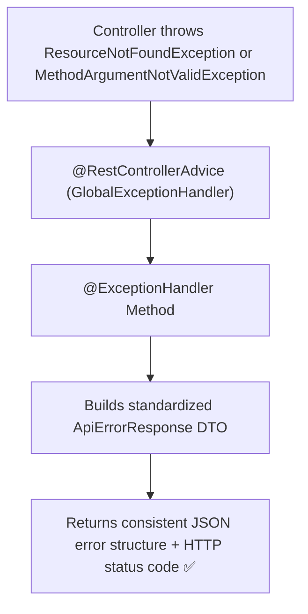


---

### 1. Standard API Error Response DTO:
```java
public record ApiErrorResponse(
    LocalDateTime timestamp,
    int status,
    String error,
    String message,
    String path,
    Map<String, String> validationErrors // Optional: populated on validation failure
) {
    public static ApiErrorResponse of(HttpStatus status, String message, String path) {
        return new ApiErrorResponse(LocalDateTime.now(), status.value(), status.getReasonPhrase(), message, path, null);
    }
}
```

---

### 2. Custom Business Exception:
```java
public class ResourceNotFoundException extends RuntimeException {
    public ResourceNotFoundException(String message) {
        super(message);
    }
}
```

---

### 3. Global Exception Handler Implementation:
```java
@RestControllerAdvice
public class GlobalExceptionHandler {

    // 1. Handle Validation Failures (HTTP 400)
    @ExceptionHandler(MethodArgumentNotValidException.class)
    public ResponseEntity<ApiErrorResponse> handleValidationExceptions(
            MethodArgumentNotValidException ex, HttpServletRequest request) {

        Map<String, String> errors = new HashMap<>();
        ex.getBindingResult().getFieldErrors().forEach(error -> 
            errors.put(error.getField(), error.getDefaultMessage())
        );

        ApiErrorResponse response = new ApiErrorResponse(
            LocalDateTime.now(),
            HttpStatus.BAD_REQUEST.value(),
            "Validation Failed",
            "Invalid request payload parameters",
            request.getRequestURI(),
            errors
        );

        return ResponseEntity.status(HttpStatus.BAD_REQUEST).body(response);
    }

    // 2. Handle Custom Business Not Found (HTTP 404)
    @ExceptionHandler(ResourceNotFoundException.class)
    public ResponseEntity<ApiErrorResponse> handleResourceNotFound(
            ResourceNotFoundException ex, HttpServletRequest request) {

        ApiErrorResponse response = ApiErrorResponse.of(
            HttpStatus.NOT_FOUND, ex.getMessage(), request.getRequestURI()
        );
        return ResponseEntity.status(HttpStatus.NOT_FOUND).body(response);
    }

    // 3. Fallback Global Catch-All Handler (HTTP 500)
    @ExceptionHandler(Exception.class)
    public ResponseEntity<ApiErrorResponse> handleGenericException(
            Exception ex, HttpServletRequest request) {

        ApiErrorResponse response = ApiErrorResponse.of(
            HttpStatus.INTERNAL_SERVER_ERROR, "An unexpected internal server error occurred", request.getRequestURI()
        );
        return ResponseEntity.status(HttpStatus.INTERNAL_SERVER_ERROR).body(response);
    }
}
```

---

## 12. View Controllers & Thymeleaf Integration (Optional)

> 💡 **Quick Revision Anchor (2-3 Words)**: `View Routing & Thymeleaf`

### 1. Direct View Controllers with `ViewControllerRegistry`
When an endpoint has **no business logic** and simply serves a static HTML template, register it directly in a `WebMvcConfigurer`:

```java
@Configuration
public class WebConfig implements WebMvcConfigurer {

    @Override
    public void addViewControllers(ViewControllerRegistry registry) {
        // Direct route-to-view mapping without writing controller methods!
        registry.addViewController("/courses").setViewName("courses");
        registry.addViewController("/about").setViewName("about");
    }
}
```

---

### 2. Thymeleaf Template Engine
Thymeleaf is a modern server-side Java template engine that natively integrates with Spring MVC:

```html
<!DOCTYPE html>
<html xmlns:th="http://www.thymeleaf.org">
<head><title>Course Catalog</title></head>
<body>
    <h1 th:text="'Welcome, ' + ${username} + '!'">Welcome!</h1>

    <table>
        <thead>
            <tr><th>Course Name</th><th>Price</th></tr>
        </thead>
        <tbody>
            <tr th:each="course : ${courses}">
                <td th:text="${course.name}">Java Masterclass</td>
                <td th:text="${#numbers.formatDecimal(course.price, 1, 2)}">$99.00</td>
            </tr>
        </tbody>
    </table>
</body>
</html>
```

---

## 13. Boilerplate Reduction with Project Lombok

> 💡 **Quick Revision Anchor (2-3 Words)**: `Compile-Time Bytecode Gen`

**Project Lombok** is a compile-time annotation processor that generates repetitive boilerplate bytecode into `.class` files.

```xml
<dependency>
    <groupId>org.projectlombok</groupId>
    <artifactId>lombok</artifactId>
    <optional>true</optional>
</dependency>
```

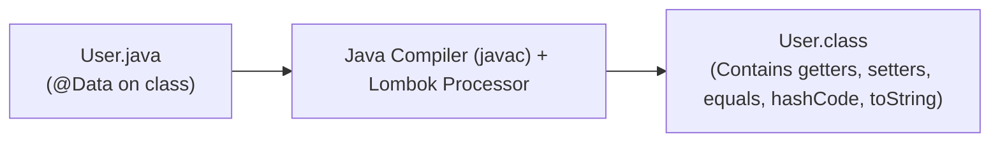


### Core Lombok Annotations:

| Annotation | Generated Bytecode |
| :--- | :--- |
| **`@Getter` / `@Setter`** | Generates standard getter and setter methods for all fields. |
| **`@ToString`** | Generates human-readable `toString()` with all field values. |
| **`@EqualsAndHashCode`** | Generates `equals()` and `hashCode()` methods adhering to the contract. |
| **`@NoArgsConstructor`** | Generates default public zero-argument constructor (required by Hibernate). |
| **`@AllArgsConstructor`** | Generates constructor accepting all declared fields. |
| **`@RequiredArgsConstructor`**| Generates constructor for all **`final`** and `@NonNull` fields (Best for Spring DI!). |
| **`@Data`** | Shortcut bundling `@Getter`, `@Setter`, `@ToString`, `@EqualsAndHashCode`, and `@RequiredArgsConstructor`. |

---

## 14. 1-Page Master Revision Cheat Sheet

> 💡 **Quick Revision Anchor (2-3 Words)**: `Web MVC Cheat Sheet`

| Topic | Key Concept | Production Rule |
| :--- | :--- | :--- |
| **Spring Boot** | Auto-configures sensible defaults; embeds Tomcat. | Use Starters (`spring-boot-starter-web`) for clean BOM management. |
| **Properties vs YAML** | Properties is flat key-value; YAML is hierarchical. | Use YAML for complex nested configurations; properties for simple setups. |
| **DevTools** | Dual ClassLoader: Base (JARs) + Restart (Code). | Great for rapid local reloads; automatically excluded from prod JARs. |
| **`DispatcherServlet`**| Single Front Controller coordinating all web requests. | Dispatches requests to `HandlerMapping` and converts objects via `HttpMessageConverter`. |
| **HTTP Verbs** | GET/PUT/DELETE are idempotent; POST is non-idempotent. | Use `PUT` for complete replacements and `PATCH` for partial updates. |
| **Params** | `@PathVariable` for IDs; `@RequestParam` for filters; `@RequestBody` for payloads. | Return `ResponseEntity<T>` with accurate HTTP status codes (200, 201, 204). |
| **DTO Separation** | Decouples API contract from database entities. | **Never expose JPA Entities directly**; prevents mass-assignment and serialization loops. |
| **Validation** | Declarative constraints via `jakarta.validation`. | Always annotate `@Valid` on controller `@RequestBody`. |
| **Exception Handling**| `@RestControllerAdvice` + `@ExceptionHandler`. | Intercept `MethodArgumentNotValidException` and return standardized `ApiErrorResponse` maps. |

[⬆ Back to Top](#📑-table-of-contents)
