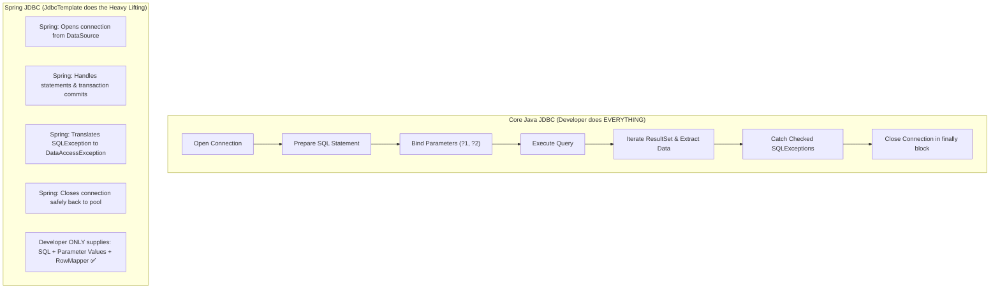
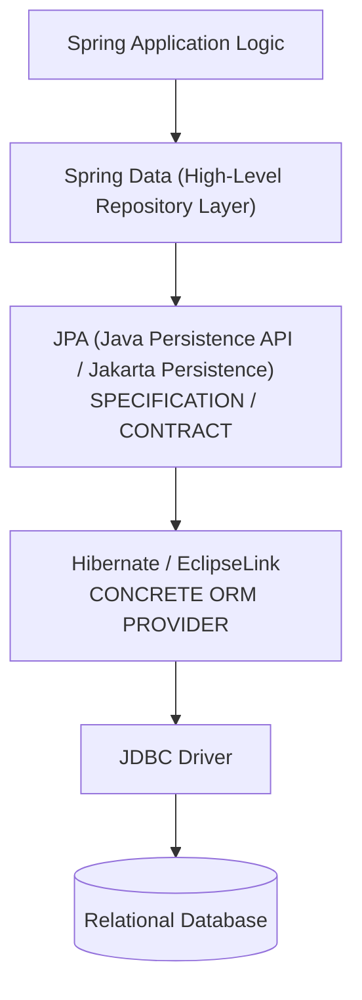
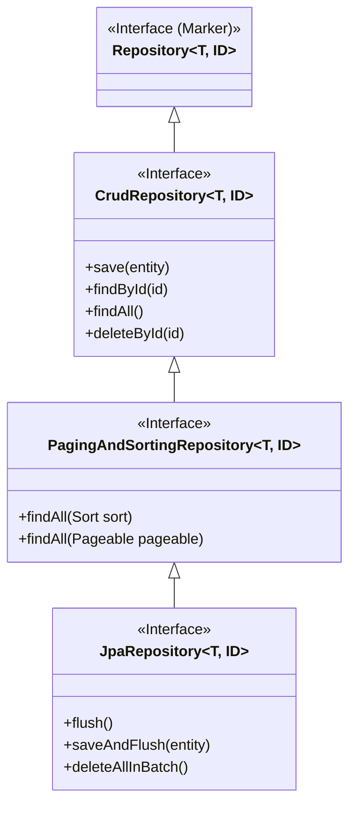
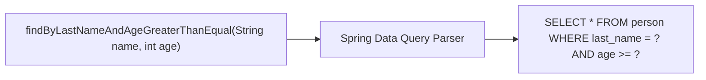
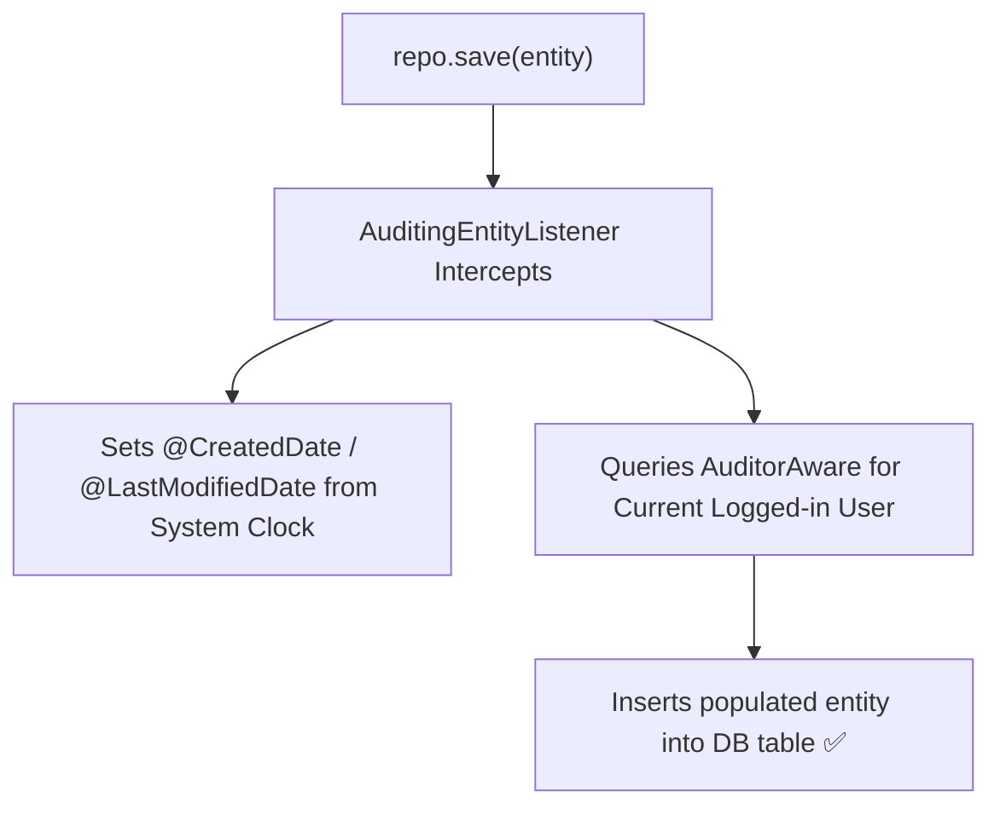
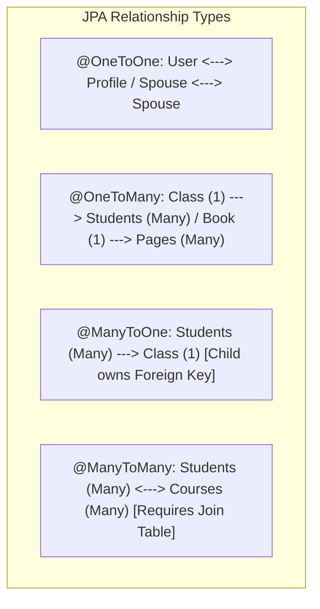
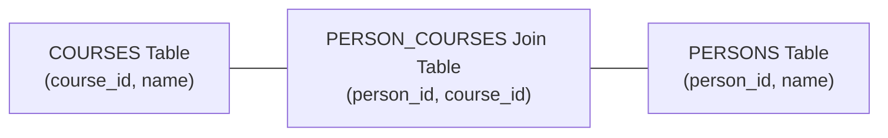
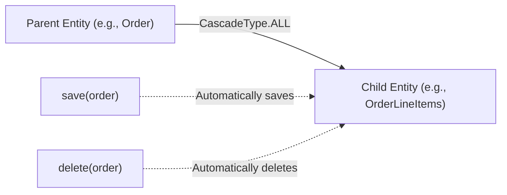
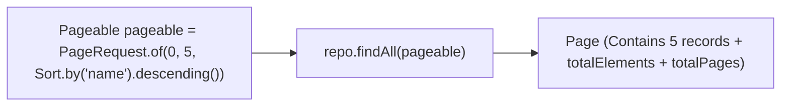

# 💾 Data Persistence & Spring Data JPA — Complete Master Guide

> **Foundation**: Based on EazyBytes *Spring, SpringBoot, JPA, Hibernate: Zero to Master* (Slides 106–135, 138–142, 150–165).  
> **Core Philosophy**: Database persistence evolved from manual JDBC boilerplate to **Spring JDBC (`JdbcTemplate`)**, and ultimately to **Spring Data JPA**. By combining the **Repository abstraction** with Hibernate ORM, developers can perform CRUD, complex table joins, pagination, and derived querying through simple interface declarations.

---

## 📑 Table of Contents
- [1. Core Java JDBC vs. Spring JDBC (`JdbcTemplate`)](#1-core-java-jdbc-vs-spring-jdbc-jdbctemplate)
- [2. Embedded H2 Database & Initial Scripts](#2-embedded-h2-database--initial-scripts)
- [3. `RowMapper` vs. `BeanPropertyRowMapper`](#3-rowmapper-vs-beanpropertyrowmapper)
- [4. `NamedParameterJdbcTemplate`](#4-namedparameterjdbctemplate)
- [5. ORM & JPA Foundations: Specification vs. Implementation](#5-orm--jpa-foundations-specification-vs-implementation)
- [6. Spring Data Repository Hierarchy](#6-spring-data-repository-hierarchy)
- [7. Entity Modeling (`@Entity`, `@Table`, `@Id`)](#7-entity-modeling-entity-table-id)
- [8. Derived Query Methods (Keywords & Parsing)](#8-derived-query-methods-keywords--parsing)
- [9. JPA Auditing (`AuditorAware` & `@EntityListeners`)](#9-jpa-auditing-auditoraware--entitylisteners)
- [10. Entity Relationships (`@OneToOne`, `@OneToMany`, `@ManyToOne`, `@ManyToMany`)](#10-entity-relationships-onetoone-onetomany-manytoone-manytomany)
- [11. Fetch Strategies: `EAGER` vs. `LAZY`](#11-fetch-strategies-eager-vs-lazy)
- [12. Cascade Types (`PERSIST`, `MERGE`, `REMOVE`, `ALL`)](#12-cascade-types-persist-merge-remove-all)
- [13. Custom Queries (`@Query`, `@Modifying`, `@NamedQuery`)](#13-custom-queries-query-modifying-namedquery)
- [14. Pagination & Dynamic Sorting (`Pageable` & `Sort`)](#14-pagination--dynamic-sorting-pageable--sort)
- [15. 1-Page Master Revision Cheat Sheet](#15-1-page-master-revision-cheat-sheet)

---

## 1. Core Java JDBC vs. Spring JDBC (`JdbcTemplate`)

> 💡 **Quick Revision Anchor (2-3 Words)**: `Eliminating JDBC Boilerplate`

### The Problem with Core Java JDBC:
In traditional JDBC, executing a single SQL query requires writing over 20 lines of repetitive boilerplate:
1. Manually loading database driver classes (`Class.forName()`).
2. Acquiring physical database connections (`DriverManager.getConnection()`).
3. Creating statement objects (`PreparedStatement`).
4. Binding parameters by 1-based numerical index (`stmt.setInt(1, id)`).
5. Catching checked `SQLException` and deciding what to do.
6. Ensuring `ResultSet`, `Statement`, and `Connection` are safely closed inside messy nested `finally` blocks.



---

### Spring JDBC Division of Responsibilities:

| Action | Core Java JDBC | Spring JDBC (`JdbcTemplate`) |
| :--- | :---: | :---: |
| Define Connection Parameters & URL | Developer | Developer (`application.properties`) |
| Open Database Connection | Developer | **Spring JDBC** |
| Specify SQL Statement | Developer | Developer |
| Declare & Bind Parameters | Developer | Developer |
| Prepare & Execute Statement | Developer | **Spring JDBC** |
| Iterate through ResultSet | Developer | **Spring JDBC** |
| Extract Data into Domain Objects | Developer | Developer (`RowMapper`) |
| Translate & Process Exceptions | Developer | **Spring JDBC** (Unchecked hierarchy) |
| Commit / Rollback Transactions | Developer | **Spring JDBC** |
| Close Connection & Resources | Developer | **Spring JDBC** |

[⬆ Back to Top](#📑-table-of-contents)

---

## 2. Embedded H2 Database & Initial Scripts

> 💡 **Quick Revision Anchor (2-3 Words)**: `In-Memory H2 Database`

For rapid development, prototyping, and automated unit testing, Spring Boot seamlessly integrates with the in-memory **H2 Database**:

```xml
<dependency>
    <groupId>com.h2database</groupId>
    <artifactId>h2</artifactId>
    <scope>runtime</scope>
</dependency>
```

### Configuration (`application.properties`):
```properties
# Enable H2 Web Console
spring.h2.console.enabled=true
spring.h2.console.path=/h2-console

# In-Memory DB Connection
spring.datasource.url=jdbc:h2:mem:testdb
spring.datasource.driverClassName=org.h2.Driver
spring.datasource.username=sa
spring.datasource.password=
```

### Automatic Schema & Data Loading:
When Spring Boot starts with an embedded database, it automatically looks for two files in `src/main/resources/`:
1. **`schema.sql`**: DDL scripts (`CREATE TABLE`, `CREATE INDEX`). Executed first.
2. **`data.sql`**: DML scripts (`INSERT INTO ...`). Executed after the schema is created to seed initial rows.

[⬆ Back to Top](#📑-table-of-contents)

---

## 3. `RowMapper` vs. `BeanPropertyRowMapper`

> 💡 **Quick Revision Anchor (2-3 Words)**: `ResultSet Object Mapping`

`RowMapper<T>` is an interface that maps a single row from a database `ResultSet` into a domain Java POJO:

```mermaid
flowchart LR
    RS["ResultSet Row: [id: 101, name: 'Lucy']"] --> RM{"RowMapper Implementation"}
    RM -->|Custom Manual Extraction| POJO1["Person(id=101, name='Lucy')"]
    RM -->|BeanPropertyRowMapper (Reflection)| POJO2["Person(id=101, name='Lucy')"]
```

---

### Option A: Custom Lambda `RowMapper` (Full Control)
Use when database column names do not match Java field names:
```java
@Repository
public class PersonDaoImpl {

    @Autowired
    private JdbcTemplate jdbcTemplate;

    private final RowMapper<Person> personRowMapper = (rs, rowNum) -> {
        Person person = new Person();
        person.setPersonId(rs.getInt("person_id"));
        person.setName(rs.getString("first_name"));
        person.setEmail(rs.getString("contact_email"));
        return person;
    };

    public List<Person> findAll() {
        return jdbcTemplate.query("SELECT person_id, first_name, contact_email FROM person", personRowMapper);
    }
}
```

---

### Option B: `BeanPropertyRowMapper` (Automatic Reflection)
If database table column names match Java POJO property names (or match camelCase to snake_case conversions, e.g., `first_name` $\leftrightarrow$ `firstName`), use **`BeanPropertyRowMapper`**:

```java
public List<Person> findAll() {
    String sql = "SELECT * FROM person";
    return jdbcTemplate.query(sql, BeanPropertyRowMapper.newInstance(Person.class));
}
```
> [!TIP]
> `BeanPropertyRowMapper` saves tremendous boilerplate code by automatically mapping matching column names using Java reflection.

[⬆ Back to Top](#📑-table-of-contents)

---

## 4. `NamedParameterJdbcTemplate`

> 💡 **Quick Revision Anchor (2-3 Words)**: `Named SQL Parameters`

In classical `JdbcTemplate`, queries rely on indexed question-mark placeholders (`?`):
```sql
SELECT count(*) FROM person WHERE first_name = ? AND last_name = ? AND age > ?
```
If you change parameter ordering, your entire application breaks with subtle type bugs!

**`NamedParameterJdbcTemplate`** replaces `?` placeholders with named variables (e.g., `:firstName`):

```java
@Repository
public class PersonNamedDao {

    @Autowired
    private NamedParameterJdbcTemplate namedParameterJdbcTemplate;

    public int countPersonsByName(String firstName, String status) {
        String sql = "SELECT count(*) FROM person WHERE first_name = :firstName AND status = :status";

        SqlParameterSource params = new MapSqlParameterSource()
                .addValue("firstName", firstName)
                .addValue("status", status);

        return namedParameterJdbcTemplate.queryForObject(sql, params, Integer.class);
    }
}
```

[⬆ Back to Top](#📑-table-of-contents)

---

## 5. ORM & JPA Foundations: Specification vs. Implementation

> 💡 **Quick Revision Anchor (2-3 Words)**: `JPA Spec Hibernate`



### Key Distinctions:
1. **Object-Relational Mapping (ORM)**: The technique of mapping Java object models directly to relational database tables, eliminating SQL boilerplate.
2. **JPA (Jakarta Persistence API)**: A **standard specification** (a collection of interfaces, annotations, and rules) that defines how ORM should work in Java. JPA contains **no implementation code**.
3. **Hibernate**: The most popular open-source **implementation / provider** of the JPA specification.
4. **Spring Data JPA**: An abstraction layer built on top of JPA providers that eliminates writing DAO implementation classes entirely.

[⬆ Back to Top](#📑-table-of-contents)

---

## 6. Spring Data Repository Hierarchy

> 💡 **Quick Revision Anchor (2-3 Words)**: `Repository Contract Tree`

Spring Data provides a structured hierarchy of generic repository interfaces. By extending them, Spring automatically generates concrete proxy implementations at runtime:



### Interface Responsibilities:
1. **`Repository<T, ID>`**: A pure **marker interface** with zero methods. Registers your interface as a Spring Data bean.
2. **`CrudRepository<T, ID>`**: Provides basic CRUD operations (`save`, `findById`, `existsById`, `delete`).
3. **`PagingAndSortingRepository<T, ID>`**: Extends CRUD with operations for pagination (`Pageable`) and sorting (`Sort`).
4. **`JpaRepository<T, ID>`**: The full-featured JPA interface. Extends paging/sorting with JPA-specific persistence batching (`flush()`, `saveAllAndFlush()`, batch deletions).

[⬆ Back to Top](#📑-table-of-contents)

---

## 7. Entity Modeling (`@Entity`, `@Table`, `@Id`)

> 💡 **Quick Revision Anchor (2-3 Words)**: `JPA Entity Mapping`

To map a Java class to a relational table, annotate it with core JPA annotations:

```java
@Entity
@Table(name = "contact_msg")
@Data
public class Contact extends BaseEntity {

    @Id
    @GeneratedValue(strategy = GenerationType.IDENTITY)
    @Column(name = "contact_id")
    private int contactId;

    @Column(name = "name", nullable = false, length = 100)
    private String name;

    @Column(name = "email", nullable = false)
    private String email;

    @Column(name = "subject")
    private String subject;
}
```

- **`@Entity`**: Marks the POJO as a persistent domain entity.
- **`@Table(name = "...")`**: Specifies the database table name (defaults to class name if omitted).
- **`@Id`**: Designates the primary key field.
- **`@GeneratedValue`**: Primary key generation strategy (`IDENTITY`, `SEQUENCE`, `TABLE`, `AUTO`).
- **`@Column`**: Maps field to column name, length, nullable constraints.

[⬆ Back to Top](#📑-table-of-contents)

---

## 8. Derived Query Methods (Keywords & Parsing)

> 💡 **Quick Revision Anchor (2-3 Words)**: `Method Name Queries`

With Spring Data JPA, you do not need to write SQL queries manually. Spring parses repository method names and automatically constructs the corresponding SQL queries:



### Structure of a Derived Query Method:
A method name consists of two parts separated by the **`By`** keyword:
1. **Introducer Clause**: `find...By`, `read...By`, `get...By`, `query...By`, `count...By`. (Can include `Distinct`).
2. **Criteria Clause**: Entity property names joined with boolean and comparison keywords.

---

### Supported Query Keywords:

| Keyword | Repository Method Signature | Generated SQL Where Clause |
| :--- | :--- | :--- |
| **`And`** | `findByLastNameAndFirstName(...)` | `WHERE last_name = ? AND first_name = ?` |
| **`Or`** | `findByLastNameOrFirstName(...)` | `WHERE last_name = ? OR first_name = ?` |
| **`Between`** | `findByStartDateBetween(d1, d2)` | `WHERE start_date BETWEEN ? AND ?` |
| **`LessThan`** | `findByAgeLessThan(18)` | `WHERE age < 18` |
| **`GreaterThanEqual`** | `findByAgeGreaterThanEqual(60)` | `WHERE age >= 60` |
| **`IsNull`** | `findByEmailIsNull()` | `WHERE email IS NULL` |
| **`Like`** | `findByFirstNameLike("%John%")` | `WHERE first_name LIKE ?` |
| **`StartingWith`** | `findByFirstNameStartingWith("Jo")`| `WHERE first_name LIKE 'Jo%'` |
| **`Containing`** | `findBySubjectContaining("query")` | `WHERE subject LIKE '%query%'` |
| **`OrderBy`** | `findByAgeOrderByNameDesc(25)` | `WHERE age = ? ORDER BY name DESC` |
| **`True / False`** | `findByActiveTrue()` | `WHERE active = TRUE` |
| **`IgnoreCase`** | `findByFirstNameIgnoreCase("LUCY")`| `WHERE UPPER(first_name) = UPPER(?)` |

[⬆ Back to Top](#📑-table-of-contents)

---

## 9. JPA Auditing (`AuditorAware` & `@EntityListeners`)

> 💡 **Quick Revision Anchor (2-3 Words)**: `Automated Audit Fields`

JPA Auditing transparently tracks **who** created/modified a record and **when** it occurred without writing manual timestamp code.



---

### Step 1: Create an Abstract Mapped Superclass
```java
@MappedSuperclass
@EntityListeners(AuditingEntityListener.class)
@Data
public abstract class BaseEntity {

    @CreatedDate
    @Column(updatable = false)
    private LocalDateTime createdAt;

    @CreatedBy
    @Column(updatable = false)
    private String createdBy;

    @LastModifiedDate
    @Column(insertable = false)
    private LocalDateTime updatedAt;

    @LastModifiedBy
    @Column(insertable = false)
    private String updatedBy;
}
```

---

### Step 2: Implement `AuditorAware` (Pull Current User)
```java
@Component("auditAwareImpl")
public class AuditAwareImpl implements AuditorAware<String> {

    @Override
    public Optional<String> getCurrentAuditor() {
        // Reads authenticated username from Spring Security context
        return Optional.ofNullable(SecurityContextHolder.getContext())
                       .map(SecurityContext::getAuthentication)
                       .map(Authentication::getName)
                       .or(() -> Optional.of("ANONYMOUS_USER"));
    }
}
```

---

### Step 3: Enable Auditing on Main Configuration
```java
@SpringBootApplication
@EnableJpaAuditing(auditorAwareRef = "auditAwareImpl")
public class EazySchoolApplication {
    public static void main(String[] args) {
        SpringApplication.run(EazySchoolApplication.class, args);
    }
}
```

[⬆ Back to Top](#📑-table-of-contents)

---

## 10. Entity Relationships (`@OneToOne`, `@OneToMany`, `@ManyToOne`, `@ManyToMany`)

> 💡 **Quick Revision Anchor (2-3 Words)**: `Table Relationship Mapping`

Relational database tables connect via foreign keys. JPA maps these associations using 4 primary relationship annotations:



---

### 1. `@OneToOne` Relationship
```java
@Entity
public class Person {
    @Id @GeneratedValue(strategy = GenerationType.IDENTITY)
    private int personId;

    @OneToOne(fetch = FetchType.EAGER, cascade = CascadeType.ALL)
    @JoinColumn(name = "address_id", referencedColumnName = "addressId")
    private Address address; // Person owns the foreign key column 'address_id'
}
```

---

### 2. `@ManyToOne` and `@OneToMany` (Bidirectional)
> [!IMPORTANT]
> **Golden Rule**: In a One-to-Many relationship, the **`@ManyToOne` child entity** (e.g., `Person`) always **owns the relationship** and contains the `@JoinColumn`. The parent entity uses `mappedBy` to indicate inverse ownership.

```java
// Parent Entity (One)
@Entity
public class EazyClass {
    @Id @GeneratedValue(strategy = GenerationType.IDENTITY)
    private int classId;

    @OneToMany(mappedBy = "eazyClass", fetch = FetchType.LAZY, cascade = CascadeType.PERSIST)
    private List<Person> persons;
}

// Child Entity (Many - Owning Side)
@Entity
public class Person {
    @Id @GeneratedValue(strategy = GenerationType.IDENTITY)
    private int personId;

    @ManyToOne(fetch = FetchType.LAZY)
    @JoinColumn(name = "class_id", referencedColumnName = "classId")
    private EazyClass eazyClass; // Holds foreign key 'class_id'
}
```

---

### 3. `@ManyToMany` (Requires Join Table)
Because relational databases cannot directly store multiple IDs in a single cell, Many-to-Many relationships **require an intermediate Join Table**:



```java
@Entity
public class Person {
    @Id @GeneratedValue(strategy = GenerationType.IDENTITY)
    private int personId;

    @ManyToMany(fetch = FetchType.EAGER, cascade = CascadeType.PERSIST)
    @JoinTable(
        name = "person_courses",
        joinColumns = @JoinColumn(name = "person_id"),
        inverseJoinColumns = @JoinColumn(name = "course_id")
    )
    private Set<Course> courses = new HashSet<>();
}
```

[⬆ Back to Top](#📑-table-of-contents)

---

## 11. Fetch Strategies: `EAGER` vs. `LAZY`

> 💡 **Quick Revision Anchor (2-3 Words)**: `Eager vs Lazy Fetching`

Fetch type dictates **when** associated entities are loaded into memory from the database:

| Dimension | `FetchType.EAGER` | `FetchType.LAZY` |
| :--- | :--- | :--- |
| **How it Works** | Loaded **immediately** in the initial database query (via SQL `JOIN`). | Loaded **on-demand** only when the getter method is first invoked. |
| **Default In JPA** | **`@OneToOne`**, **`@ManyToOne`** (To-One associations). | **`@OneToMany`**, **`@ManyToMany`** (To-Many collections). |
| **Risk / Pitfall** | Performance bottleneck: Fetches massive unnecessary object graphs. | Throws `LazyInitializationException` if getter is called after Hibernate session closes! |
| **Best Practice** | Avoid in enterprise code. | **Use `LAZY` by default** for all relationships; fetch explicitly via `JOIN FETCH` when needed. |

[⬆ Back to Top](#📑-table-of-contents)

---

## 12. Cascade Types (`PERSIST`, `MERGE`, `REMOVE`, `ALL`)

> 💡 **Quick Revision Anchor (2-3 Words)**: `State Propagation`

Cascading allows state transitions on a parent entity to **propagate automatically** to its associated child entities:



### Cascade Types Supported by JPA:
- **`CascadeType.PERSIST`**: When parent is saved (`persist()`), child entities are also saved.
- **`CascadeType.MERGE`**: When parent is merged (`merge()`), child entities are also updated.
- **`CascadeType.REMOVE`**: When parent is deleted (`remove()`), child entities are deleted.
- **`CascadeType.REFRESH`**: When parent is refreshed from DB, child entities are reloaded.
- **`CascadeType.DETACH`**: When parent is detached from Hibernate persistence context, child entities are detached.
- **`CascadeType.ALL`**: Shorthand for all of the above.

> [!WARNING]
> **Best Practice**: Cascading makes sense **only from Parent $
ightarrow$ Child**. Never cascade operations from Child to Parent!

[⬆ Back to Top](#📑-table-of-contents)

---

## 13. Custom Queries (`@Query`, `@Modifying`, `@NamedQuery`)

> 💡 **Quick Revision Anchor (2-3 Words)**: `JPQL and Native Queries`

When derived queries become too complex (e.g., joining 4 tables), write custom queries using **`@Query`**:

### 1. JPQL (Java Persistence Query Language)
Operates on **Java Entity names and fields**, NOT database table and column names:
```java
public interface ContactRepository extends JpaRepository<Contact, Integer> {

    // Positional parameters (?1, ?2)
    @Query("SELECT c FROM Contact c WHERE c.status = ?1 AND c.subject = ?2")
    List<Contact> findByStatusAndSubject(String status, String subject);

    // Named parameters (:status) - PREFERRED
    @Query("SELECT c FROM Contact c WHERE c.status = :status ORDER BY c.createdAt DESC")
    List<Contact> findByStatusOrderByDate(@Param("status") String status);
}
```

---

### 2. Native SQL Queries
Operates on physical database tables:
```java
@Query(value = "SELECT * FROM contact_msg WHERE status = :status", nativeQuery = true)
List<Contact> findByStatusNative(@Param("status") String status);
```

---

### 3. DML Queries (`@Modifying` + `@Transactional`)
For `UPDATE`, `DELETE`, or `INSERT` queries, you **must** include both `@Modifying` and `@Transactional`:

```java
@Repository
public interface ContactRepository extends JpaRepository<Contact, Integer> {

    @Transactional
    @Modifying
    @Query("UPDATE Contact c SET c.status = :status WHERE c.contactId = :id")
    int updateStatusById(@Param("status") String status, @Param("id") int id);
}
```
> [!IMPORTANT]
> Without `@Modifying`, Spring Data JPA attempts to execute the query using `executeQuery()` (which expects a `ResultSet`) and throws an `InvalidDataAccessApiUsageException`!

[⬆ Back to Top](#📑-table-of-contents)

---

## 14. Pagination & Dynamic Sorting (`Pageable` & `Sort`)

> 💡 **Quick Revision Anchor (2-3 Words)**: `PageRequest and Sort`

Loading millions of database rows at once exhausts heap memory. Pagination breaks large query result sets into discrete, manageable chunks:



### 1. Dynamic Sorting
```java
// Sort by name descending, then by age ascending
Sort sort = Sort.by("name").descending().and(Sort.by("age").ascending());
List<Person> sortedPersons = personRepository.findAll(sort);
```

---

### 2. Combined Pagination and Sorting in Controller
```java
@RestController
@RequestMapping("/contacts")
public class ContactController {

    @Autowired
    private ContactRepository contactRepository;

    @GetMapping
    public ResponseEntity<Page<Contact>> getOpenContacts(
        @RequestParam(defaultValue = "0") int pageNumber,
        @RequestParam(defaultValue = "10") int pageSize,
        @RequestParam(defaultValue = "name") String sortField,
        @RequestParam(defaultValue = "asc") String sortDirection
    ) {
        Sort sort = sortDirection.equalsIgnoreCase("asc") 
                    ? Sort.by(sortField).ascending() 
                    : Sort.by(sortField).descending();

        Pageable pageable = PageRequest.of(pageNumber, pageSize, sort);
        Page<Contact> contactPage = contactRepository.findByStatus("OPEN", pageable);

        return ResponseEntity.ok(contactPage);
    }
}
```

[⬆ Back to Top](#📑-table-of-contents)

---

## 15. 1-Page Master Revision Cheat Sheet

> 💡 **Quick Revision Anchor (2-3 Words)**: `Persistence Cheat Sheet`

| Topic | Core Concept | Production Rule |
| :--- | :--- | :--- |
| **JdbcTemplate** | Manages connections, resource cleanup, exception translation. | Use `NamedParameterJdbcTemplate` for queries with $>2$ parameters. |
| **RowMapper** | Converts `ResultSet` rows into POJOs. | Use `BeanPropertyRowMapper` when column names match POJO fields. |
| **Repository Tree** | `Repository` $
ightarrow$ `CrudRepository` $
ightarrow$ `PagingAndSortingRepository` $
ightarrow$ `JpaRepository`. | Extend `JpaRepository` for modern full-featured persistence. |
| **Auditing** | Automatically records created/updated timestamp and username. | Enable with `@EnableJpaAuditing` and implement `AuditorAware<String>`. |
| **Relationships** | `@OneToOne`, `@OneToMany`, `@ManyToOne`, `@ManyToMany`. | **`@ManyToOne` child entity** always owns the foreign key (`@JoinColumn`). |
| **Fetch Types** | `EAGER` (Immediate load) vs `LAZY` (On-demand load). | Use `LAZY` for all collections to prevent severe latency bottlenecks. |
| **Cascading** | Propagates entity lifecycle changes. | Cascade only from Parent $
ightarrow$ Child; never Child $
ightarrow$ Parent. |
| **Custom Queries** | `@Query` with JPQL (Entities) or Native SQL (Tables). | Must add `@Modifying` and `@Transactional` on `UPDATE`/`DELETE`. |
| **Pagination** | `PageRequest.of(page, size, sort)`. | Return `Page<T>` to expose total element and page counts to UI. |

[⬆ Back to Top](#📑-table-of-contents)
