# 💾 Data Persistence & Spring Data JPA — Complete Master Guide

> **Foundation**: Based on EazyBytes *Spring, SpringBoot, JPA, Hibernate: Zero to Master* (Slides 106–135, 138–142, 150–165) updated for **Spring Boot 3+ / Spring Framework 6+ (Jakarta Persistence)**.  
> **Core Philosophy**: Persistence evolved from raw JDBC boilerplate to **Spring JDBC (`JdbcTemplate`)**, and ultimately to **Spring Data JPA**. By combining the **Repository abstraction** with Hibernate ORM, developers execute CRUD, relationship navigation, dynamic derived queries, and pagination while letting the **Persistence Context** manage dirty checking and transaction boundaries.

---

## 📑 Table of Contents
- [1. JDBC Foundations vs. Spring JDBC (`JdbcTemplate`)](#1-jdbc-foundations-vs-spring-jdbc-jdbctemplate)
- [2. `NamedParameterJdbcTemplate` & `RowMapper`](#2-namedparameterjdbctemplate--rowmapper)
- [3. When is JDBC / `JdbcTemplate` Preferable to JPA?](#3-when-is-jdbc--jdbctemplate-preferable-to-jpa)
- [4. ORM & JPA Architecture: Spec vs. Implementation](#4-orm--jpa-architecture-spec-vs-implementation)
- [5. EntityManager, Persistence Context & Entity Lifecycle](#5-entitymanager-persistence-context--entity-lifecycle)
- [6. Entity Modeling Annotations (`@Entity`, `@Table`, `@Id`)](#6-entity-modeling-annotations-entity-table-id)
- [7. Spring Data Repository Hierarchy](#7-spring-data-repository-hierarchy)
- [8. Derived Query Methods (Keywords & Parsing)](#8-derived-query-methods-keywords--parsing)
- [9. Custom Queries: JPQL, Native SQL & `@Modifying`](#9-custom-queries-jpql-native-sql--modifying)
- [10. Entity Relationships (`@OneToOne`, `@OneToMany`, `@ManyToOne`, `@ManyToMany`)](#10-entity-relationships-onetoone-onetomany-manytoone-manytomany)
- [11. Fetch Strategies (`LAZY` vs. `EAGER`), N+1 Problem & Solutions](#11-fetch-strategies-lazy-vs-eager-n1-problem--solutions)
- [12. Cascade Types & JPA Cascade vs. DB Cascade](#12-cascade-types--jpa-cascade-vs-db-cascade)
- [13. Transaction Management (`@Transactional`, Propagation & Isolation)](#13-transaction-management-transactional-propagation--isolation)
- [14. Pagination & Sorting (`Pageable`, `Page`, `Slice` & `Sort`)](#14-pagination--sorting-pageable-page-slice--sort)
- [15. JPA Auditing (`AuditorAware` & `@EntityListeners`)](#15-jpa-auditing-auditoraware--entitylisteners)
- [16. Top 7 JPA Traps, Gotchas & Anti-Patterns](#16-top-7-jpa-traps-gotchas--anti-patterns)
- [17. 1-Page Master Revision Cheat Sheet](#17-1-page-master-revision-cheat-sheet)

---

## 1. JDBC Foundations vs. Spring JDBC (`JdbcTemplate`)

> 💡 **Quick Revision Anchor (2-3 Words)**: `Eliminating JDBC Boilerplate`

### The Problem with Traditional Core Java JDBC:
In raw JDBC, executing a simple SQL query requires over 20 lines of error-prone, repetitive boilerplate:
1. Manually loading database driver classes (`Class.forName()`).
2. Acquiring physical database connections (`DriverManager.getConnection()`).
3. Creating statement objects (`PreparedStatement`).
4. Binding parameters by 1-based numerical index (`stmt.setInt(1, id)`).
5. Catching checked `SQLException` instances.
6. Ensuring `ResultSet`, `Statement`, and `Connection` are safely closed in nested `finally` blocks.

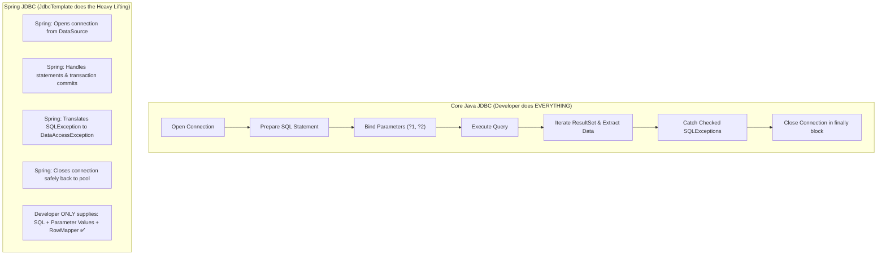

> **Visual:** Mermaid — boilerplate elimination comparison.

---

### Division of Responsibilities:

| Action | Core Java JDBC | Spring JDBC (`JdbcTemplate`) |
| :--- | :--- | :--- |
| Define Connection URL / Credentials | Developer | Developer (`application.properties`) |
| Open Database Connection | Developer | **Spring JDBC** (from `DataSource` pool) |
| Specify SQL Statement | Developer | Developer |
| Declare & Bind Parameters | Developer | Developer |
| Prepare & Execute Statement | Developer | **Spring JDBC** |
| Iterate through `ResultSet` | Developer | **Spring JDBC** |
| Extract Data into Domain Objects | Developer | Developer (`RowMapper`) |
| Translate & Process Exceptions | Developer | **Spring JDBC** (Unchecked `DataAccessException`) |
| Commit / Rollback Transactions | Developer | **Spring JDBC** |
| Close Connection & Resources | Developer | **Spring JDBC** |

---

## 2. `NamedParameterJdbcTemplate` & `RowMapper`

> 💡 **Quick Revision Anchor (2-3 Words)**: `Named SQL Parameters`

### 1. The Power of `NamedParameterJdbcTemplate`:
Instead of fragile positional `?` placeholders, use named variables (`:studentName`, `:courseId`):

```java
@Repository
public class StudentJdbcDao {

    @Autowired
    private NamedParameterJdbcTemplate namedParameterJdbcTemplate;

    public int countStudentsByCourse(String courseName, String status) {
        String sql = "SELECT count(*) FROM students WHERE course_name = :courseName AND status = :status";

        SqlParameterSource params = new MapSqlParameterSource()
                .addValue("courseName", courseName)
                .addValue("status", status);

        return namedParameterJdbcTemplate.queryForObject(sql, params, Integer.class);
    }
}
```

---

### 2. `RowMapper<T>` vs. `BeanPropertyRowMapper<T>`:

```mermaid
flowchart LR
    RS["ResultSet Row: [student_id: 101, full_name: 'Lucy']"] --> RM{"RowMapper Implementation"}
    RM -->|Custom Manual Extraction| POJO1["Student(id=101, name='Lucy')"]
    RM -->|BeanPropertyRowMapper (Reflection)| POJO2["Student(id=101, name='Lucy')"]
```

> **Visual:** Mermaid — ResultSet object mapping strategies.

- **Custom `RowMapper<T>`**: Full control when database column names do not match Java fields:
  ```java
  private final RowMapper<Student> studentRowMapper = (rs, rowNum) -> {
      Student s = new Student();
      s.setId(rs.getLong("student_id"));
      s.setName(rs.getString("full_name"));
      return s;
  };
  ```
- **`BeanPropertyRowMapper.newInstance(Student.class)`**: Automatically converts snake_case column names (`student_id`) to camelCase Java fields (`studentId`) using reflection.

---

## 3. When is JDBC / `JdbcTemplate` Preferable to JPA?

> 💡 **Quick Revision Anchor (2-3 Words)**: `When to Pick JDBC`

While JPA is standard for OLTP CRUD, `JdbcTemplate` is superior in specific scenarios:

| Use Case | Why `JdbcTemplate` is Better than JPA |
| :--- | :--- |
| **Bulk Batch Inserts / Updates** | JPA dirty-checks and tracks every single entity in the Persistence Context, causing high heap memory and slower speeds. `JdbcTemplate.batchUpdate()` writes raw batch SQL at maximum speed. |
| **Complex Analytical / Reporting Queries** | Complex SQL queries with window functions (`OVER PARTITION BY`), hierarchical queries (`CONNECT BY`), and multi-table joins are awkward to write in JPQL. |
| **Lightweight Microservices** | Extreme low-latency microservices with minimal heap budgets avoid Hibernate reflection overhead. |
| **Legacy Databases** | Databases lacking primary keys, composite keys without relations, or non-relational table schemas that do not fit clean ORM models. |

---

## 4. ORM & JPA Architecture: Spec vs. Implementation

> 💡 **Quick Revision Anchor (2-3 Words)**: `JPA Spec Hibernate`

### JPA & Hibernate Architecture Layers

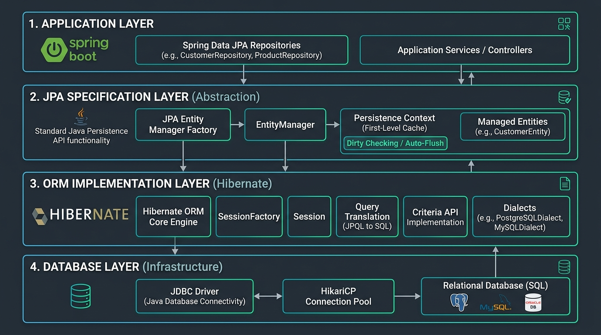

> **Visual:** Technical Diagram — Spring Data JPA, Jakarta Persistence API, Hibernate ORM, and JDBC Driver layered architecture.

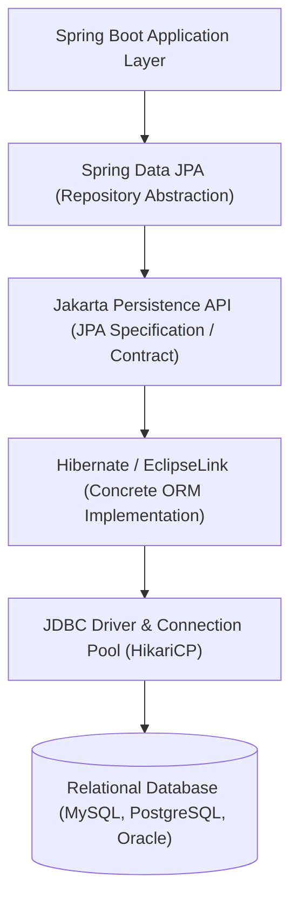

> **Visual:** Mermaid — Spring Data JPA layered architecture.

### Key Conceptual Distinctions:
1. **Object-Relational Mapping (ORM)**: The technique of mapping Java object models directly to relational database tables, eliminating manual SQL.
2. **JPA (`jakarta.persistence.*`)**: A **standard specification** (a collection of interfaces, annotations, and rules). JPA contains **no implementation code**.
3. **Hibernate**: The industry standard open-source **implementation provider** of the JPA specification.
4. **Spring Data JPA**: A high-level data access framework built on top of JPA providers that generates repository implementation proxies at runtime.

---

## 5. EntityManager, Persistence Context & Entity Lifecycle

> 💡 **Quick Revision Anchor (2-3 Words)**: `1st Level Cache & States`

The **`EntityManager`** is the JPA interface used to interact with the **Persistence Context** (the 1st-level in-memory cache of managed entities).

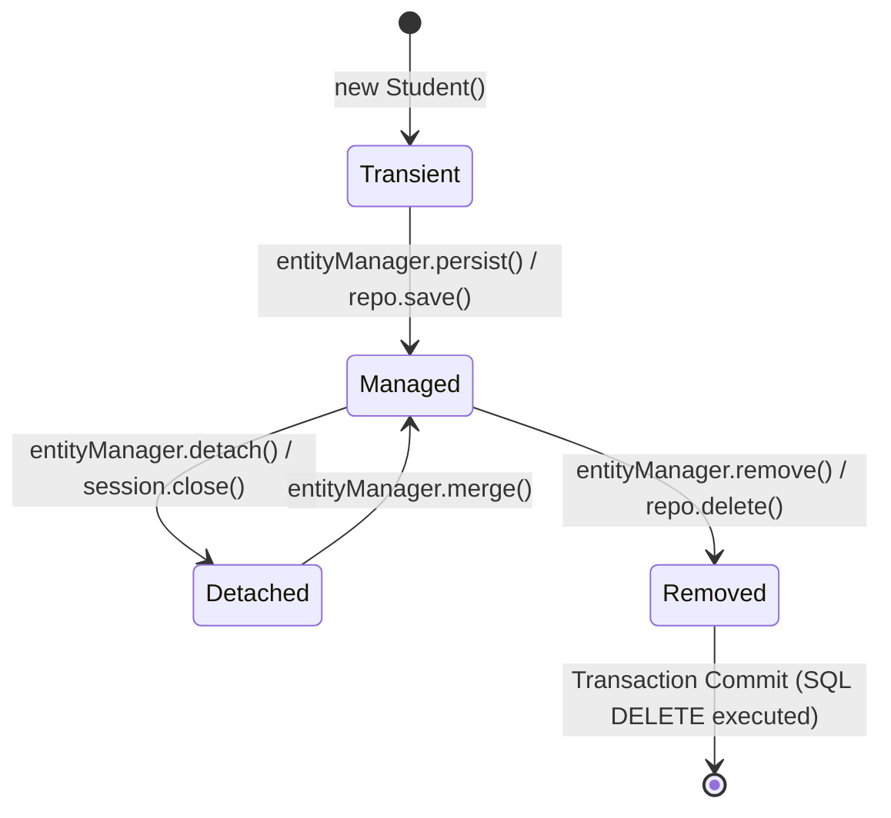

> **Visual:** Mermaid — JPA entity lifecycle state transitions.

### Entity States & Behavior:

| State | In Memory? | In Database? | Tracked by Persistence Context? | Explanation |
| :--- | :---: | :---: | :---: | :--- |
| **Transient (New)** | ✅ | ❌ | ❌ | Instantiated with `new`. No primary key, unknown to JPA. |
| **Managed** | ✅ | ✅ (or queued) | ✅ | Tracked by Persistence Context. **Dirty checking active**. |
| **Detached** | ✅ | ✅ | ❌ | Session closed or entity explicitly detached. Changes are NOT tracked. |
| **Removed** | ✅ | ❌ (Deleted on commit) | ✅ | Scheduled for deletion upon transaction commit. |

---

### Dirty Checking & `flush()` vs. `commit()`:
- **Dirty Checking**: When a transaction commits, Hibernate compares all managed entities against their initial snapshots. Any modified field triggers an automatic SQL `UPDATE` statement **without calling `repo.save()`**!
- **`flush()`**: Synchronizes in-memory persistence context changes to the database by executing pending SQL statements (`INSERT`, `UPDATE`, `DELETE`). The transaction is **still open** and can be rolled back.
- **`commit()`**: Permanently saves the transaction to the database engine. Executes a `flush()` first, then finalizes the transaction.

---

## 6. Entity Modeling Annotations (`@Entity`, `@Table`, `@Id`)

> 💡 **Quick Revision Anchor (2-3 Words)**: `JPA Entity Mapping`

```java
@Entity
@Table(name = "students", uniqueConstraints = {
    @UniqueConstraint(name = "uk_student_email", columnNames = "email")
})
@Data
public class Student {

    @Id
    @GeneratedValue(strategy = GenerationType.IDENTITY)
    @Column(name = "student_id")
    private Long id;

    @Column(name = "full_name", nullable = false, length = 100)
    private String name;

    @Column(name = "email", nullable = false, unique = true)
    private String email;

    @Enumerated(EnumType.STRING)
    @Column(name = "status", length = 20)
    private EnrollmentStatus status;

    @Transient // Not persisted to database table
    private String temporaryToken;
}
```

### Primary Key Generation Strategies (`@GeneratedValue`):
1. **`GenerationType.IDENTITY`**: Relies on database auto-increment column (e.g., MySQL `AUTO_INCREMENT`, Postgres `SERIAL`).
2. **`GenerationType.SEQUENCE`**: Uses dedicated database sequences (e.g., Oracle, PostgreSQL `CREATE SEQUENCE`). Best for batch inserts.
3. **`GenerationType.TABLE`**: Uses a separate underlying table to generate IDs (rarely used; slow).
4. **`GenerationType.AUTO`**: Lets Hibernate choose the strategy based on the database dialect.

---

## 7. Spring Data Repository Hierarchy

> 💡 **Quick Revision Anchor (2-3 Words)**: `Repository Contract Tree`

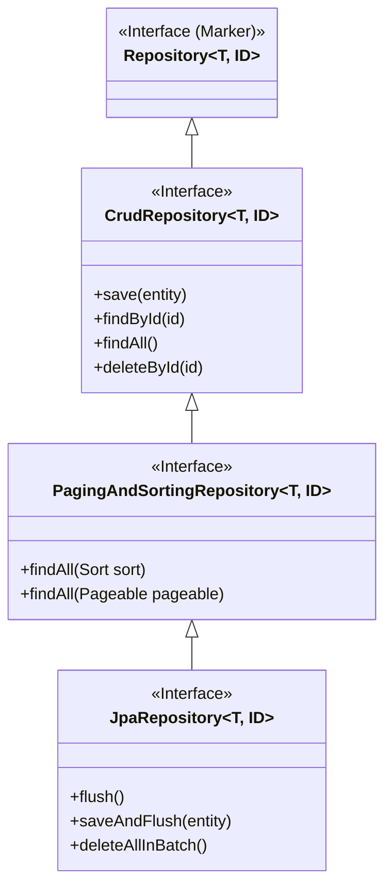

> **Visual:** Mermaid — Spring Data repository contract hierarchy.

### Interface Responsibilities:
1. **`Repository<T, ID>`**: Top-level marker interface with zero methods.
2. **`CrudRepository<T, ID>`**: Standard CRUD operations (`save`, `findById`, `existsById`, `delete`).
3. **`PagingAndSortingRepository<T, ID>`**: Adds methods for pagination (`Pageable`) and sorting (`Sort`).
4. **`JpaRepository<T, ID>`**: Full JPA interface with batch deletions (`deleteAllInBatch()`), immediate flushing (`saveAndFlush()`), and `List`-returning methods.

---

## 8. Derived Query Methods (Keywords & Parsing)

> 💡 **Quick Revision Anchor (2-3 Words)**: `Method Name Queries`

Spring Data JPA parses repository method names and automatically constructs SQL queries at startup:


> **Visual:** Mermaid — derived query method parsing pipeline.

### Common Derived Query Keywords:

| Keyword | Method Signature Example | Generated SQL WHERE Clause |
| :--- | :--- | :--- |
| **`And`** | `findByNameAndEmail(n, e)` | `WHERE name = ? AND email = ?` |
| **`Or`** | `findByNameOrEmail(n, e)` | `WHERE name = ? OR email = ?` |
| **`Between`** | `findByAgeBetween(18, 30)` | `WHERE age BETWEEN ? AND ?` |
| **`LessThan` / `GreaterThan`**| `findByAgeLessThan(21)` | `WHERE age < 21` |
| **`IsNull` / `IsNotNull`** | `findByEmailIsNull()` | `WHERE email IS NULL` |
| **`Like` / `Containing`** | `findByNameContaining("Lucy")` | `WHERE name LIKE '%Lucy%'` |
| **`StartingWith`** | `findByNameStartingWith("Lu")` | `WHERE name LIKE 'Lu%'` |
| **`OrderBy`** | `findByStatusOrderByNameAsc(s)`| `WHERE status = ? ORDER BY name ASC` |
| **`IgnoreCase`** | `findByEmailIgnoreCase(e)` | `WHERE UPPER(email) = UPPER(?)` |

---

## 9. Custom Queries: JPQL, Native SQL & `@Modifying`

> 💡 **Quick Revision Anchor (2-3 Words)**: `JPQL and Native Queries`

When queries require complex joins or aggregations, write custom queries using **`@Query`**:

### 1. JPQL (Java Persistence Query Language - Preferred)
Operates on **Entity names and Java field names**, NOT physical table/column names:

```java
public interface StudentRepository extends JpaRepository<Student, Long> {

    // Named Parameters (:email, :status)
    @Query("SELECT s FROM Student s WHERE s.email = :email AND s.status = :status")
    Optional<Student> findByEmailAndStatus(@Param("email") String email, @Param("status") EnrollmentStatus status);

    // Projection query returning custom DTO
    @Query("SELECT new com.example.dto.StudentSummary(s.id, s.name) FROM Student s WHERE s.status = 'ACTIVE'")
    List<StudentSummary> findActiveStudentSummaries();
}
```

---

### 2. Native SQL Queries
Operates on raw physical database tables:

```java
@Query(value = "SELECT * FROM students WHERE status = :status ORDER BY created_at DESC", nativeQuery = true)
List<Student> findByStatusNative(@Param("status") String status);
```

---

### 3. Modifying Queries (`@Modifying` + `@Transactional`)
For `UPDATE` or `DELETE` queries, both annotations are strictly required:

```java
@Repository
public interface StudentRepository extends JpaRepository<Student, Long> {

    @Transactional
    @Modifying
    @Query("UPDATE Student s SET s.status = :status WHERE s.id = :id")
    int updateStudentStatus(@Param("status") EnrollmentStatus status, @Param("id") Long id);
}
```
> [!IMPORTANT]
> Without `@Modifying`, Spring Data JPA attempts to execute the query via `executeQuery()` (expecting a `ResultSet`) and throws `InvalidDataAccessApiUsageException`.

---

## 10. Entity Relationships (`@OneToOne`, `@OneToMany`, `@ManyToOne`, `@ManyToMany`)

> 💡 **Quick Revision Anchor (2-3 Words)**: `Table Relationship Mapping`

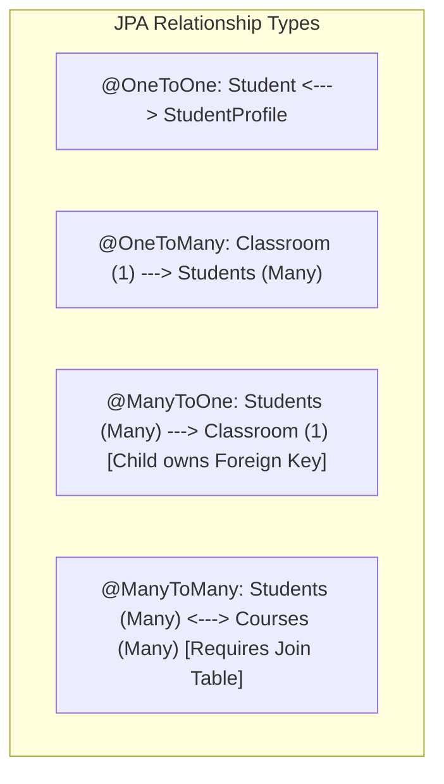

> **Visual:** Mermaid — JPA relationship taxonomy.

---

### 1. The Owning Side & `mappedBy` Rule:
> [!IMPORTANT]
> **Golden Rule**: The entity table that contains the physical **Foreign Key column** is ALWAYS the **Owning Side** and MUST have `@JoinColumn`.  
> The inverse (non-owning) side MUST use **`mappedBy`** pointing to the Java field name on the owning side.

```java
// Parent Entity (Inverse Side)
@Entity
public class Classroom {
    @Id @GeneratedValue(strategy = GenerationType.IDENTITY)
    private Long id;

    @OneToMany(mappedBy = "classroom", fetch = FetchType.LAZY, cascade = CascadeType.ALL)
    private List<Student> students = new ArrayList<>();
}

// Child Entity (Owning Side - Contains Foreign Key column 'classroom_id')
@Entity
public class Student {
    @Id @GeneratedValue(strategy = GenerationType.IDENTITY)
    private Long id;

    @ManyToOne(fetch = FetchType.LAZY)
    @JoinColumn(name = "classroom_id", nullable = false)
    private Classroom classroom;
}
```

---

### 2. `@ManyToMany` with Join Table:

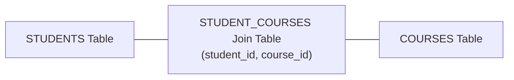

> **Visual:** Mermaid — relational join table mapping.

```java
@Entity
public class Student {
    @Id @GeneratedValue(strategy = GenerationType.IDENTITY)
    private Long id;

    @ManyToMany(fetch = FetchType.LAZY, cascade = {CascadeType.PERSIST, CascadeType.MERGE})
    @JoinTable(
        name = "student_courses",
        joinColumns = @JoinColumn(name = "student_id"),
        inverseJoinColumns = @JoinColumn(name = "course_id")
    )
    private Set<Course> courses = new HashSet<>();
}
```

---

## 11. Fetch Strategies (`LAZY` vs. `EAGER`), N+1 Problem & Solutions

> 💡 **Quick Revision Anchor (2-3 Words)**: `Lazy Fetching & N+1 Fix`

### `FetchType.LAZY` vs. `FetchType.EAGER`:

| Dimension | `FetchType.LAZY` (Default for Collections) | `FetchType.EAGER` (Default for To-One) |
| :--- | :--- | :--- |
| **Loading Mechanism** | Generates a proxy object; loads from DB **only when accessed**. | Loads associated entity **immediately** in initial query. |
| **JPA Defaults** | `@OneToMany`, `@ManyToMany` | `@ManyToOne`, `@OneToOne` (Best practice: change to `LAZY`!) |
| **Risk** | Throws `LazyInitializationException` if accessed outside active transaction. | Causes massive memory overhead and hidden N+1 queries. |

---

### The N+1 Query Problem Explained:
When fetching 100 students having a lazy relationship to `Classroom`, calling `student.getClassroom().getName()` inside a loop fires **1 initial query** for students + **100 individual queries** for each classroom ($1 + N = 101$ total SQL queries)!

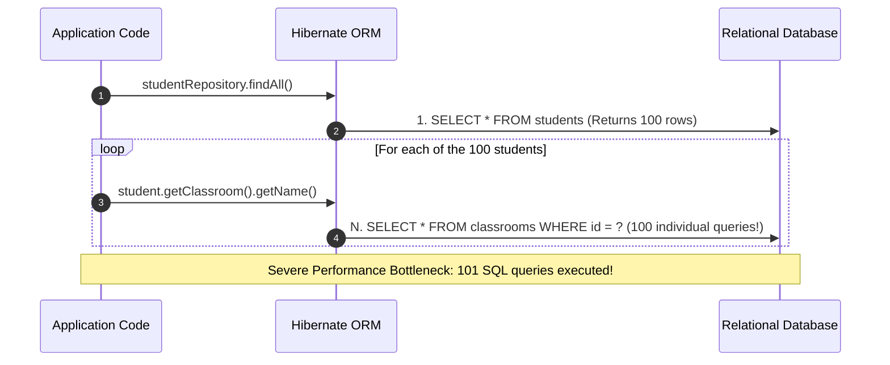

> **Visual:** Mermaid — N+1 query explosion sequence.

---

### Solutions for N+1 Queries:

#### 1. JPQL `JOIN FETCH` (Most Common):
Forces Hibernate to fetch associated entities in a single SQL `JOIN`:
```java
@Query("SELECT s FROM Student s JOIN FETCH s.classroom WHERE s.status = 'ACTIVE'")
List<Student> findAllActiveStudentsWithClassroom();
```

#### 2. `@EntityGraph` (Clean & Declarative):
```java
@EntityGraph(attributePaths = {"classroom", "courses"})
List<Student> findAll();
```

#### 3. Batch Fetching (`@BatchSize` / `default_batch_fetch_size`):
In `application.properties`:
```properties
spring.jpa.properties.hibernate.default_batch_fetch_size=25
```
Converts 100 individual queries into 4 SQL queries using `WHERE id IN (?, ?, ..., ?)`.

---

## 12. Cascade Types & JPA Cascade vs. DB Cascade

> 💡 **Quick Revision Anchor (2-3 Words)**: `State Propagation vs DB FK`

Cascading propagates entity state transitions from **Parent $\to$ Child**:

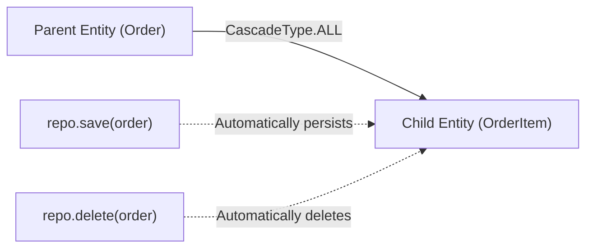

> **Visual:** Mermaid — entity state cascading propagation.

### Cascade Types:
- **`CascadeType.PERSIST`**: `save(parent)` automatically saves unsaved children.
- **`CascadeType.MERGE`**: `save(parent)` updates children.
- **`CascadeType.REMOVE`**: `delete(parent)` deletes children.
- **`CascadeType.ALL`**: Combines `PERSIST`, `MERGE`, `REMOVE`, `REFRESH`, `DETACH`.

> [!IMPORTANT]
> **JPA Cascade $\ne$ Database Cascade (`ON DELETE CASCADE`)**:
> - **JPA Cascade**: Hibernate executes Java lifecycle hooks and generates individual `DELETE` SQL queries in memory.
> - **Database Cascade (`ON DELETE CASCADE`)**: Handled directly by the database engine at foreign-key constraint level without Hibernate knowing.

---

## 13. Transaction Management (`@Transactional`, Propagation & Isolation)

> 💡 **Quick Revision Anchor (2-3 Words)**: `Transaction Boundaries & ACID`

A **Transaction** guarantees ACID compliance (Atomicity, Consistency, Isolation, Durability) across multiple database operations.

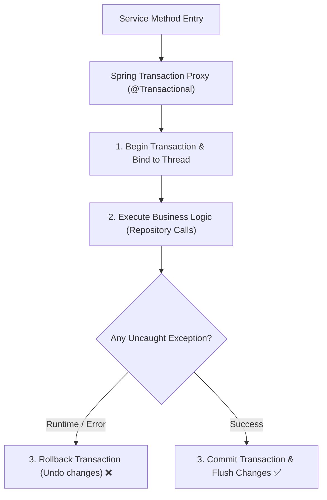

> **Visual:** Mermaid — Spring transactional interceptor lifecycle.

---

### 1. Rollback Rules:
- By default, Spring rolls back **only on unchecked exceptions** (`RuntimeException` and `Error`).
- For checked exceptions, explicitly define:
  ```java
  @Transactional(rollbackFor = Exception.class)
  ```

---

### 2. Transaction Propagation:
Defines transaction boundaries when one `@Transactional` method calls another:

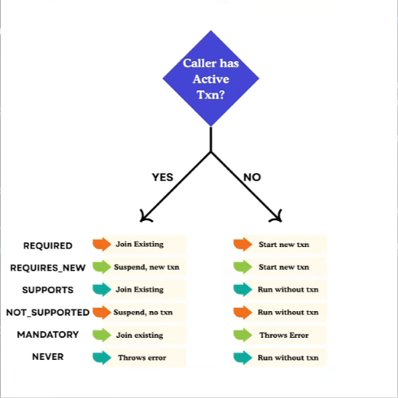

> **Visual:** Technical Diagram — Spring Transaction Propagation boundaries (`REQUIRED`, `REQUIRES_NEW`, `NESTED`).

| Propagation | Behavior |
| :--- | :--- |
| **`REQUIRED` (Default)**| Joins the existing transaction if one exists; creates a new one if none exists. |
| **`REQUIRES_NEW`** | **Suspends** existing transaction and creates an independent new transaction. |
| **`SUPPORTS`** | Executes within transaction if present; executes non-transactionally if absent. |
| **`NOT_SUPPORTED`** | **Suspends** existing transaction and runs non-transactionally. |
| **`MANDATORY`** | Requires an existing transaction; throws `TransactionRequiredException` if absent. |
| **`NEVER`** | Throws exception if an active transaction is present. |

---

### 3. Read-Only Optimization:
```java
@Transactional(readOnly = true)
public List<StudentResponse> getAllStudents() { ... }
```
- Sets Hibernate session flush mode to `FlushMode.MANUAL`.
- Disables dirty-checking snapshot creation, **saving memory and CPU time** for read queries.

---

### 4. Why Place `@Transactional` at the Service Layer?
A single business operation often involves multiple repository calls (e.g., `accountRepo.debit()`, `accountRepo.credit()`, `auditRepo.log()`). The Service layer defines the single **unit of work** that must succeed or fail atomically.

---

## 14. Pagination & Sorting (`Pageable`, `Page`, `Slice` & `Sort`)

> 💡 **Quick Revision Anchor (2-3 Words)**: `Page vs Slice Pagination`

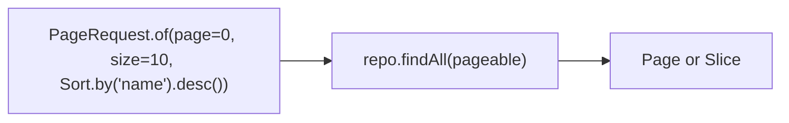

> **Visual:** Mermaid — pagination and chunking workflow.

### `Page<T>` vs. `Slice<T>`:

| Feature | `Page<T>` | `Slice<T>` |
| :--- | :--- | :--- |
| **Count Query** | Executes an extra `SELECT COUNT(*)` query to calculate total pages. | **No count query**. Only checks if next slice exists via `LIMIT + 1`. |
| **Total Elements** | Exposes `getTotalElements()` and `getTotalPages()`. | Does not know total elements (`hasNext()` only). |
| **Best Used For** | Numbered pagination UI (e.g., `Page 1, 2, 3 ... 50`). | **Infinite scrolling** / Mobile feeds (High performance!). |

```java
// Service Implementation
public Page<StudentResponse> getStudents(int page, int size, String sortField, String direction) {
    Sort sort = direction.equalsIgnoreCase("desc") ? Sort.by(sortField).descending() : Sort.by(sortField).ascending();
    Pageable pageable = PageRequest.of(page, size, sort);

    return studentRepository.findByStatus(EnrollmentStatus.ACTIVE, pageable)
                            .map(studentMapper::toResponse);
}
```

---

## 15. JPA Auditing (`AuditorAware` & `@EntityListeners`)

> 💡 **Quick Revision Anchor (2-3 Words)**: `Automated Audit Fields`

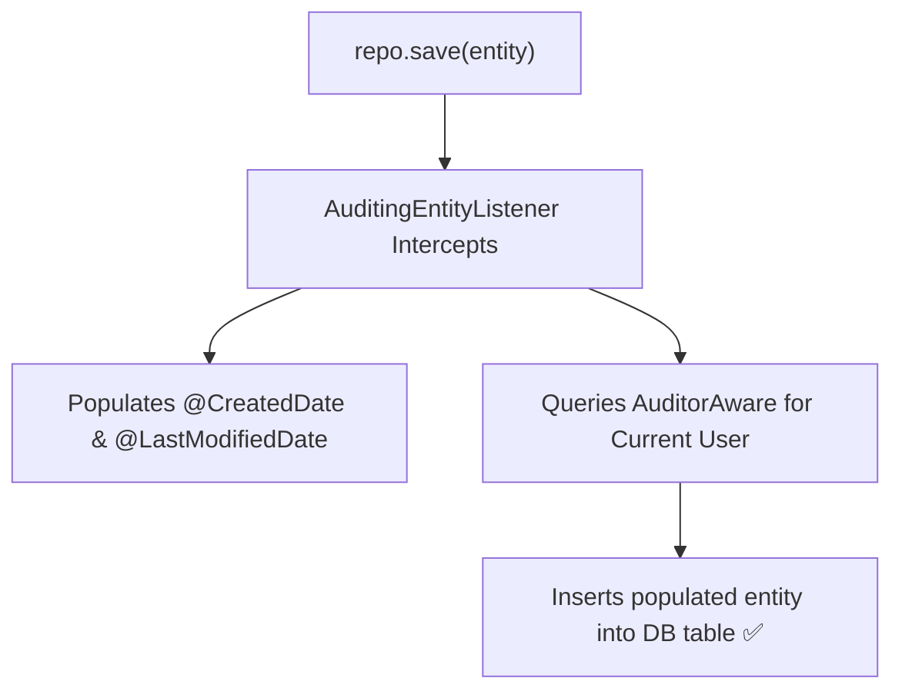

> **Visual:** Mermaid — JPA auditing interception pipeline.

```java
// 1. Base Auditable Class
@MappedSuperclass
@EntityListeners(AuditingEntityListener.class)
@Data
public abstract class BaseEntity {
    @CreatedDate
    @Column(updatable = false)
    private LocalDateTime createdAt;

    @CreatedBy
    @Column(updatable = false)
    private String createdBy;

    @LastModifiedDate
    @Column(insertable = false)
    private LocalDateTime updatedAt;

    @LastModifiedBy
    @Column(insertable = false)
    private String updatedBy;
}

// 2. Enable in Config
@SpringBootApplication
@EnableJpaAuditing(auditorAwareRef = "auditAwareImpl")
public class Application {}
```

---

## 16. Top 7 JPA Traps, Gotchas & Anti-Patterns

> 💡 **Quick Revision Anchor (2-3 Words)**: `JPA Anti-Patterns`

| # | Trap / Gotcha | Why It Happens | How to Prevent It |
| :-: | :--- | :--- | :--- |
| **1** | **N+1 Query Explosion** | Fetching lazy relations in loops. | Use `JOIN FETCH`, `@EntityGraph`, or batch fetching. |
| **2** | **`LazyInitializationException`** | Accessing uninitialized lazy proxy after transaction/session closes. | Initialize data within `@Transactional` service layer or use DTO projections. |
| **3** | **Unnecessary `EAGER` Fetching** | Leaving `@ManyToOne` default eager fetching active. | Explicitly set `fetch = FetchType.LAZY` on all relationships. |
| **4** | **Incorrect Cascade Direction** | Applying `CascadeType.ALL` from Child $\to$ Parent. | Cascade only from Parent (Aggregate Root) to Child. |
| **5** | **Bidirectional JSON Recursion** | Serializing circular JPA relationships into JSON. | Use DTOs instead of entities (or `@JsonIgnore` / `@JsonBackReference`). |
| **6** | **Unpaged Queries (`findAll()`)** | Fetching entire multi-million row table into memory. | Always use `Pageable` parameters for unbounded queries. |
| **7** | **Exposing Entities in REST APIs** | Returning `@Entity` directly from `@RestController`. | Convert entities to DTO records in the service/controller layer. |

---

## 17. 1-Page Master Revision Cheat Sheet

> 💡 **Quick Revision Anchor (2-3 Words)**: `JPA Master Sheet`

| Persistence Topic | Key Concept | Production Best Practice |
| :--- | :--- | :--- |
| **ORM Stack** | Spring Data JPA $\to$ Jakarta Persistence (JPA) $\to$ Hibernate $\to$ JDBC. | Depend on Spring Data interfaces; avoid provider-specific APIs. |
| **Entity States** | Transient $\to$ Managed $\to$ Detached $\to$ Removed. | Managed entities automatically update in DB via dirty checking. |
| **Repositories** | `JpaRepository` extends CRUD and Paging. | Use derived query methods for simple lookups; JPQL for complex queries. |
| **`@Modifying`** | Required for DML updates/deletes. | Always pair with `@Transactional` on repository modifying methods. |
| **Owning Side** | Table with Foreign Key column owns relationship. | Child entity has `@JoinColumn`; parent has `mappedBy`. |
| **Fetch Types** | `LAZY` by default everywhere. | Eliminate N+1 queries with `JOIN FETCH` or `@EntityGraph`. |
| **`@Transactional`** | Service-level atomicity boundary. | Mark read-only queries with `@Transactional(readOnly = true)`. |
| **Pagination** | `Page<T>` (count query) vs `Slice<T>` (no count). | Use `Slice<T>` for high-throughput infinite scrolling feeds. |

[⬆ Back to Top](#📑-table-of-contents)
