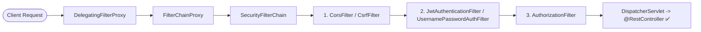
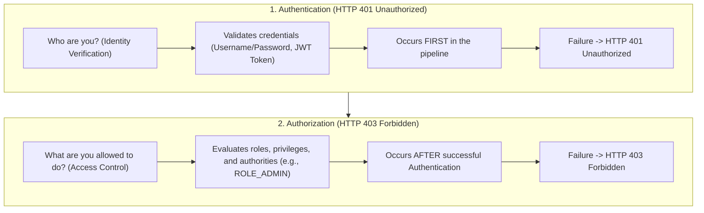
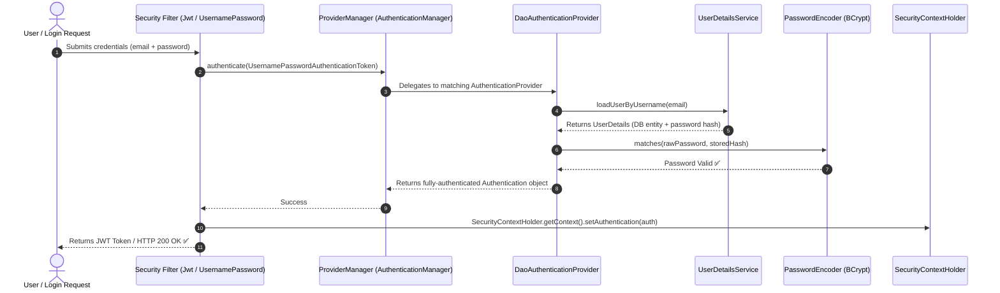
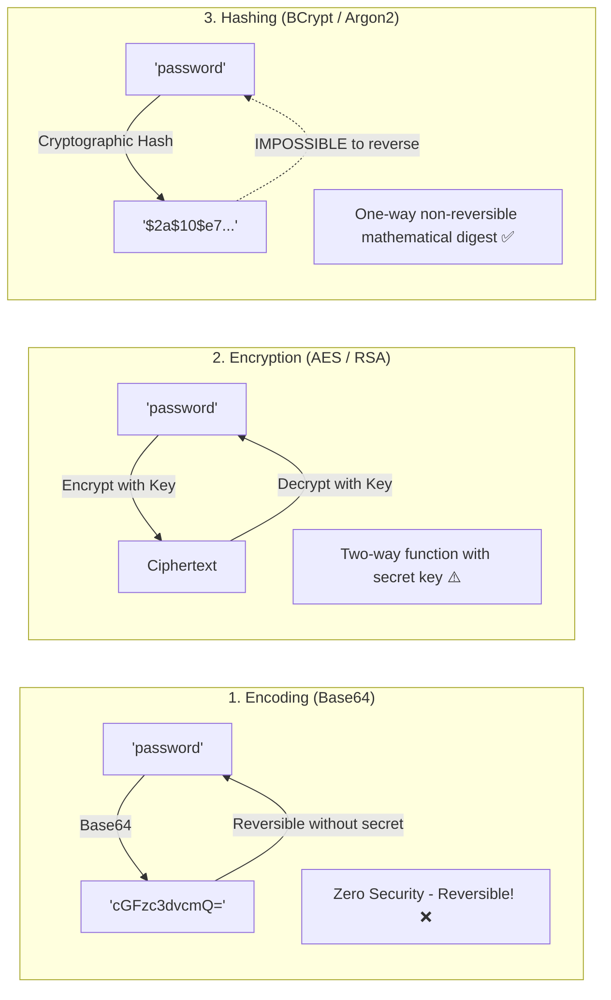
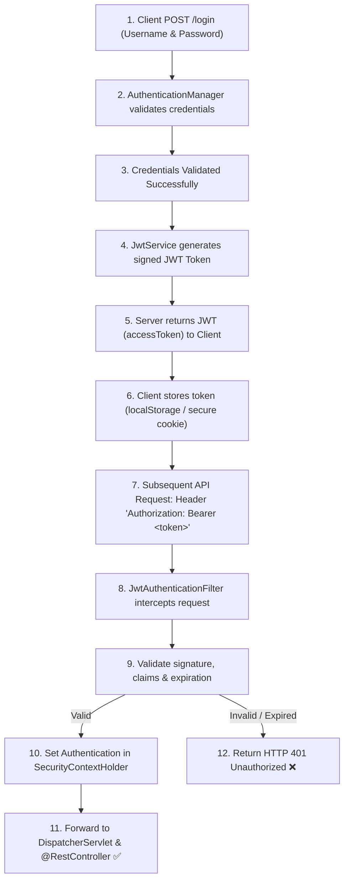
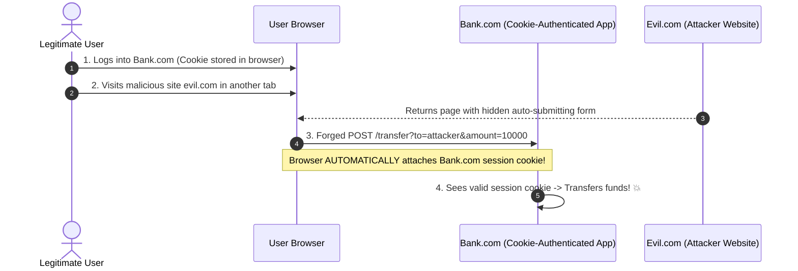
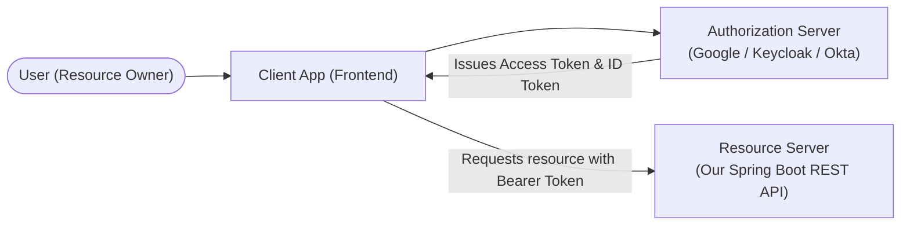

# 🔒 Spring Security & Authentication — Complete Master Guide

> **Foundation**: Based on EazyBytes *Spring, SpringBoot, JPA, Hibernate: Zero to Master* (Slides 89–105, 143–148) updated for **Spring Boot 3+ / Spring Security 6+ (Jakarta EE)**.  
> **Core Philosophy**: Applications must be secure by default. Modern Spring Security provides a robust, component-driven security framework handling **Authentication (Who are you?)**, **Authorization (What can you do?)**, **BCrypt Password Hashing**, **Stateless JWT Security**, method-level access control, and defenses against **CSRF** and **CORS** vulnerabilities.

---

## 📑 Table of Contents
- [1. Spring Security Architecture & Filter Chain](#1-spring-security-architecture--filter-chain)
- [2. Core Concepts: Authentication vs. Authorization (401 vs. 403)](#2-core-concepts-authentication-vs-authorization-401-vs-403)
- [3. Principal, Authorities & Roles](#3-principal-authorities--roles)
- [4. Modern `SecurityFilterChain` Configuration (Spring Security 6+)](#4-modern-securityfilterchain-configuration-spring-security-6)
- [5. The Authentication Architecture Deep Dive](#5-the-authentication-architecture-deep-dive)
- [6. Password Security: Encoding vs. Encryption vs. Hashing & BCrypt](#6-password-security-encoding-vs-encryption-vs-hashing--bcrypt)
- [7. JWT (JSON Web Token) Stateless Authentication](#7-jwt-json-web-token-stateless-authentication)
- [8. Method-Level Security (`@PreAuthorize`)](#8-method-level-security-preauthorize)
- [9. Cross-Site Request Forgery (CSRF): Threat & Defense](#9-cross-site-request-forgery-csrf-threat--defense)
- [10. Cross-Origin Resource Sharing (CORS) Configuration](#10-cross-origin-resource-sharing-cors-configuration)
- [11. OAuth2 & OpenID Connect (OIDC) Fundamentals](#11-oauth2--openid-connect-oidc-fundamentals)
- [12. 1-Page Master Revision Cheat Sheet](#12-1-page-master-revision-cheat-sheet)

---

## 1. Spring Security Architecture & Filter Chain

> 💡 **Quick Revision Anchor (2-3 Words)**: `Security Filter Chain`

Spring Security intercepts web requests through a series of ordered servlet filters known as the **`SecurityFilterChain`**:


```xml
<dependency>
    <groupId>org.springframework.boot</groupId>
    <artifactId>spring-boot-starter-security</artifactId>
</dependency>



### Filter Chain Mechanics:
1. **`DelegatingFilterProxy`**: A standard Servlet filter registered with the servlet container (Tomcat) that delegates all filtering logic to Spring-managed beans.
2. **`FilterChainProxy`**: The Spring-managed bean that wraps one or more `SecurityFilterChain` instances and routes requests to the matching chain.
3. **`SecurityFilterChain`**: An ordered list of security filters that execute in sequence to authenticate the caller and evaluate authorization rules before reaching your controllers.

---

## 2. Core Concepts: Authentication vs. Authorization (401 vs. 403)

> 💡 **Quick Revision Anchor (2-3 Words)**: `Identity vs Permission`




- **HTTP 401 Unauthorized**: The caller has **not provided valid authentication credentials** (or token is expired/missing). The system does not know who they are.
- **HTTP 403 Forbidden**: The caller is **successfully authenticated**, but their account **lacks permission/role** to access the requested resource.

---

## 3. Principal, Authorities & Roles

> 💡 **Quick Revision Anchor (2-3 Words)**: `Principal Roles Authorities`

- **Principal**: The currently authenticated user representation in the system (e.g., `UserDetails` instance or username).
- **Granted Authority**: A fine-grained permission string granting access to a specific action (e.g., `student:read`, `student:write`, `payment:refund`).
- **Role**: A coarse-grained grouping of authorities. In Spring Security, a **Role is just a GrantedAuthority prefixed with `ROLE_`** (e.g., `ROLE_ADMIN`, `ROLE_STUDENT`).

```java
// Under the hood in Spring Security:
hasRole("ADMIN")           ==> checks for authority: "ROLE_ADMIN"
hasAuthority("ROLE_ADMIN") ==> checks for exact string: "ROLE_ADMIN"
hasAuthority("student:read") ==> checks for fine-grained permission
```

---

## 4. Modern `SecurityFilterChain` Configuration (Spring Security 6+)

> 💡 **Quick Revision Anchor (2-3 Words)**: `requestMatchers DSL`

In **Spring Security 6+ (Spring Boot 3+)**, `WebSecurityConfigurerAdapter` and old matchers (`antMatchers`, `mvcMatchers`) are completely replaced by declarative lambda DSL with **`requestMatchers`**:

```java
@Configuration
@EnableWebSecurity
@EnableMethodSecurity // Enables @PreAuthorize on service/controller methods
public class SecurityConfig {

    @Bean
    public SecurityFilterChain securityFilterChain(HttpSecurity http, JwtAuthenticationFilter jwtAuthFilter) throws Exception {
        http
            .csrf(csrf -> csrf.disable()) // Disabled for stateless REST APIs
            .cors(Customizer.withDefaults())
            .sessionManagement(session -> session.sessionCreationPolicy(SessionCreationPolicy.STATELESS))
            .authorizeHttpRequests(auth -> auth
                // 1. Public Endpoints
                .requestMatchers("/api/v1/auth/**", "/api/v1/public/**", "/v3/api-docs/**", "/swagger-ui/**").permitAll()
                // 2. Role-Restricted Endpoints
                .requestMatchers("/api/v1/admin/**").hasRole("ADMIN")
                .requestMatchers("/api/v1/students/**").hasAnyRole("STUDENT", "ADMIN")
                // 3. Fine-Grained Authority Endpoint
                .requestMatchers(HttpMethod.DELETE, "/api/v1/courses/**").hasAuthority("course:delete")
                // 4. Any other request must be authenticated
                .anyRequest().authenticated()
            )
            .addFilterBefore(jwtAuthFilter, UsernamePasswordAuthenticationFilter.class);

        return http.build();
    }
}
```

---

## 5. The Authentication Architecture Deep Dive

> 💡 **Quick Revision Anchor (2-3 Words)**: `AuthenticationManager Flow`




### Core Components:
1. **`SecurityContextHolder`**: ThreadLocal storage storing details of the current security context.
2. **`SecurityContext`**: Holds the `Authentication` object representing the current user.
3. **`AuthenticationManager`**: The main API interface for authentication (default implementation is `ProviderManager`).
4. **`AuthenticationProvider`**: Executes specific authentication types (e.g., `DaoAuthenticationProvider` for username/password, `JwtAuthenticationProvider`).
5. **`UserDetailsService`**: Core interface to retrieve user data (`UserDetails`) from databases or LDAP.
6. **`UserDetails`**: Provides core user information (username, password hash, authorities, account locked/expired flags).

---

## 6. Password Security: Encoding vs. Encryption vs. Hashing & BCrypt

> 💡 **Quick Revision Anchor (2-3 Words)**: `BCrypt Adaptive Hashing`

Storing passwords in plaintext or using reversible algorithms is a critical security vulnerability:




### Key Rules:
- **Passwords are NEVER decrypted during login**: The server hashes the raw password provided in the login attempt using the stored salt and compares the two hashes.
- **`BCryptPasswordEncoder`**: Generates a **random 16-byte salt** for every password and embeds it into the output string (`$2a$10$...`). It features an **adaptive cost factor** to defend against hardware brute-force attacks.

```java
@Configuration
public class SecurityBeansConfig {

    @Bean
    public PasswordEncoder passwordEncoder() {
        return new BCryptPasswordEncoder();
    }
}
```

---

## 7. JWT (JSON Web Token) Stateless Authentication

> 💡 **Quick Revision Anchor (2-3 Words)**: `Stateless JWT Token`

### 1. Complete JWT Authentication Workflow:





---

### 2. Anatomy of a JWT:
$$\mathbf{JWT} = \underbrace{\text{Header}}_{\text{Base64Url}} \mathbf{.} \underbrace{\text{Payload}}_{\text{Base64Url}} \mathbf{.} \underbrace{\text{Signature}}_{\text{HMAC-SHA256}}$$

1. **Header**: Declares the token type (`JWT`) and hashing algorithm (`HS256` or `RS256`).
2. **Payload (Claims)**: Contains statements about the entity (e.g., `sub: "user@example.com"`, `roles: ["ROLE_STUDENT"]`, `exp: 1719823000`).
   > [!CAUTION]
   > The payload is **Base64 encoded, NOT encrypted**. Anyone can decode it. **Never put passwords, API keys, or SSNs in JWT claims!**
3. **Signature**: Cryptographic hash created using the secret key to ensure the token has not been tampered with:
   $$\text{Signature} = \text{HMACSHA256}(\text{base64UrlEncode}(\text{Header}) + \text{"."} + \text{base64UrlEncode}(\text{Payload}),\ \text{SecretKey})$$

---

### 3. Implementing the `JwtAuthenticationFilter`:

```java
@Component
public class JwtAuthenticationFilter extends OncePerRequestFilter {

    @Autowired
    private JwtService jwtService;

    @Autowired
    private UserDetailsService userDetailsService;

    @Override
    protected void doFilterInternal(
            HttpServletRequest request,
            HttpServletResponse response,
            FilterChain filterChain
    ) throws ServletException, IOException {

        final String authHeader = request.getHeader("Authorization");

        // 1. Check if Authorization header is present and starts with 'Bearer '
        if (authHeader == null || !authHeader.startsWith("Bearer ")) {
            filterChain.doFilter(request, response);
            return;
        }

        final String jwt = authHeader.substring(7);
        final String userEmail = jwtService.extractUsername(jwt);

        // 2. Validate and set authentication if not already authenticated
        if (userEmail != null && SecurityContextHolder.getContext().getAuthentication() == null) {
            UserDetails userDetails = this.userDetailsService.loadUserByUsername(userEmail);

            if (jwtService.isTokenValid(jwt, userDetails)) {
                UsernamePasswordAuthenticationToken authToken = new UsernamePasswordAuthenticationToken(
                        userDetails,
                        null,
                        userDetails.getAuthorities()
                );
                authToken.setDetails(new WebAuthenticationDetailsSource().buildDetails(request));

                // 3. Update SecurityContext
                SecurityContextHolder.getContext().setAuthentication(authToken);
            }
        }
        filterChain.doFilter(request, response);
    }
}
```

---

## 8. Method-Level Security (`@PreAuthorize`)

> 💡 **Quick Revision Anchor (2-3 Words)**: `Method Access Control`

While URL security protects endpoints at the HTTP level, **Method Security** enforces access rules directly on service methods or controllers:

```java
// Enable on Configuration
@Configuration
@EnableMethodSecurity(prePostEnabled = true)
public class SecurityConfig {}
```

```java
@Service
public class StudentService {

    // Only users with ROLE_ADMIN can execute
    @PreAuthorize("hasRole('ADMIN')")
    public void deleteStudent(Long studentId) { ... }

    // Users can access only their own records (SpEL expression evaluation)
    @PreAuthorize("hasRole('ADMIN') or #username == authentication.principal.username")
    public StudentResponse getStudentProfile(String username) { ... }

    // Evaluates return object after method execution
    @PostAuthorize("returnObject.email == authentication.name")
    public StudentResponse findById(Long id) { ... }
}
```

---

## 9. Cross-Site Request Forgery (CSRF): Threat & Defense

> 💡 **Quick Revision Anchor (2-3 Words)**: `CSRF Token Defense`

### The Attack Walkthrough:




---

### When to Enable vs. Disable CSRF:
- **Server-Rendered MVC (Thymeleaf / JSP)**: **ENABLE CSRF**. Browsers automatically attach session cookies to form posts, making CSRF defense mandatory via the Synchronizer Token Pattern.
- **Stateless REST APIs (JWT in Authorization Header)**: **DISABLE CSRF** (`csrf.disable()`). Because REST clients send tokens manually in `Authorization: Bearer <token>` headers, third-party sites cannot forge this header!
  > [!WARNING]
  > If your frontend stores JWT in an **`HttpOnly` Cookie**, the browser will attach it automatically, meaning **CSRF protection is STILL required**!

---

## 10. Cross-Origin Resource Sharing (CORS) Configuration

> 💡 **Quick Revision Anchor (2-3 Words)**: `Browser Origin Security`

The browser's **Same-Origin Policy (SOP)** blocks web pages from making AJAX requests to a different domain/port unless the server explicitly permits it via CORS headers:

```java
@Configuration
public class WebCorsConfig {

    @Bean
    public CorsConfigurationSource corsConfigurationSource() {
        CorsConfiguration configuration = new CorsConfiguration();
        configuration.setAllowedOrigins(List.of("http://localhost:3000", "https://myschool.com"));
        configuration.setAllowedMethods(List.of("GET", "POST", "PUT", "DELETE", "OPTIONS"));
        configuration.setAllowedHeaders(List.of("Authorization", "Content-Type", "X-Requested-With"));
        configuration.setAllowCredentials(true);
        configuration.setMaxAge(3600L); // Cache preflight OPTIONS response for 1 hour

        UrlBasedCorsConfigurationSource source = new UrlBasedCorsConfigurationSource();
        source.registerCorsConfiguration("/**", configuration);
        return source;
    }
}
```

---

## 11. OAuth2 & OpenID Connect (OIDC) Fundamentals

> 💡 **Quick Revision Anchor (2-3 Words)**: `Third-Party Delegated Auth`




### Core Concepts:
1. **OAuth 2.0**: An **authorization framework** enabling third-party apps to obtain limited access to an HTTP service on behalf of a user (Delegated Authorization).
2. **OpenID Connect (OIDC)**: A simple **identity authentication layer** built on top of OAuth 2.0. While OAuth2 issues an *Access Token* (for API calls), OIDC issues an *ID Token* (JWT containing user profile info).
3. **Roles**:
   - **Resource Server**: Our Spring Boot REST API protecting data.
   - **Authorization Server**: The identity provider (e.g., Keycloak, Auth0, Google) issuing signed tokens.
   - **Client**: The React/Mobile application requesting access.

---

## 12. 1-Page Master Revision Cheat Sheet

> 💡 **Quick Revision Anchor (2-3 Words)**: `Security Master Sheet`

| Topic | Key Concept | Production Best Practice |
| :--- | :--- | :--- |
| **AuthN vs AuthZ** | AuthN = Identity (401); AuthZ = Permissions (403). | Authenticate first, then enforce role and authority rules. |
| **Modern DSL** | Spring Security 6 replaces `antMatchers` with `requestMatchers`. | Use lambda syntax: `.authorizeHttpRequests(auth -> auth.requestMatchers(...))`. |
| **Password Hashing**| One-way mathematical digest with salt. | Always use `BCryptPasswordEncoder`; never store plaintext or reversible encryption. |
| **JWT Tokens** | Stateless token with Header, Claims payload, and Signature. | Validate signature and expiration in a custom `OncePerRequestFilter`. |
| **Method Security** | Fine-grained access control with `@PreAuthorize`. | Enable `@EnableMethodSecurity` and use SpEL expressions: `@PreAuthorize("hasRole('ADMIN')")`. |
| **CSRF** | Cross-Site Request Forgery via browser auto-attached cookies. | Disable for stateless Bearer header REST APIs; enable if using session/cookies. |
| **CORS** | Browser restriction across different schemes/hosts/ports. | Configure `CorsConfigurationSource` with explicit allowed origins and methods. |

[⬆ Back to Top](#📑-table-of-contents)
