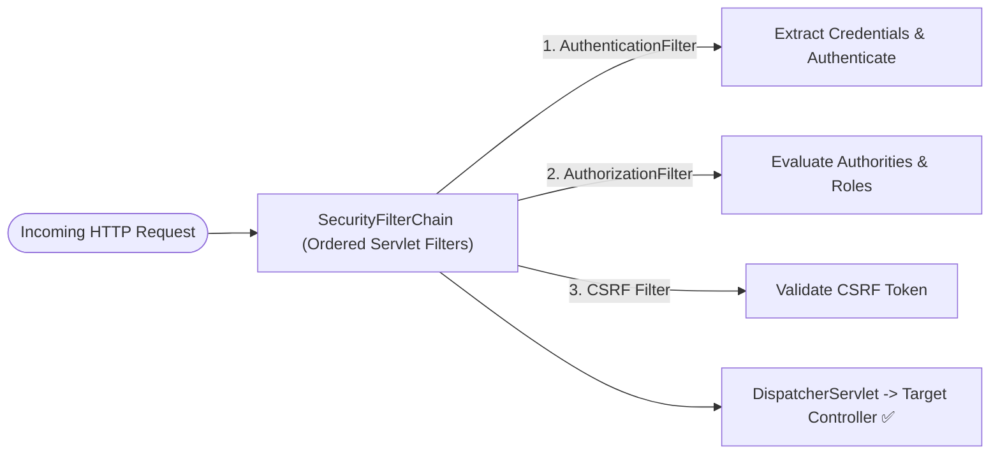
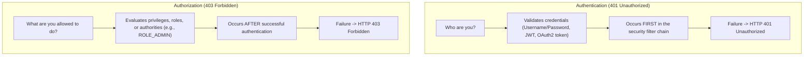
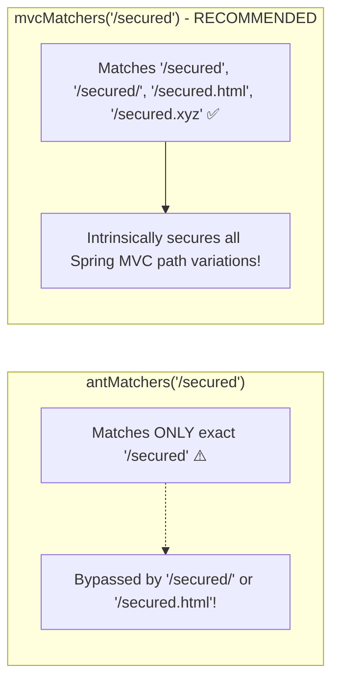
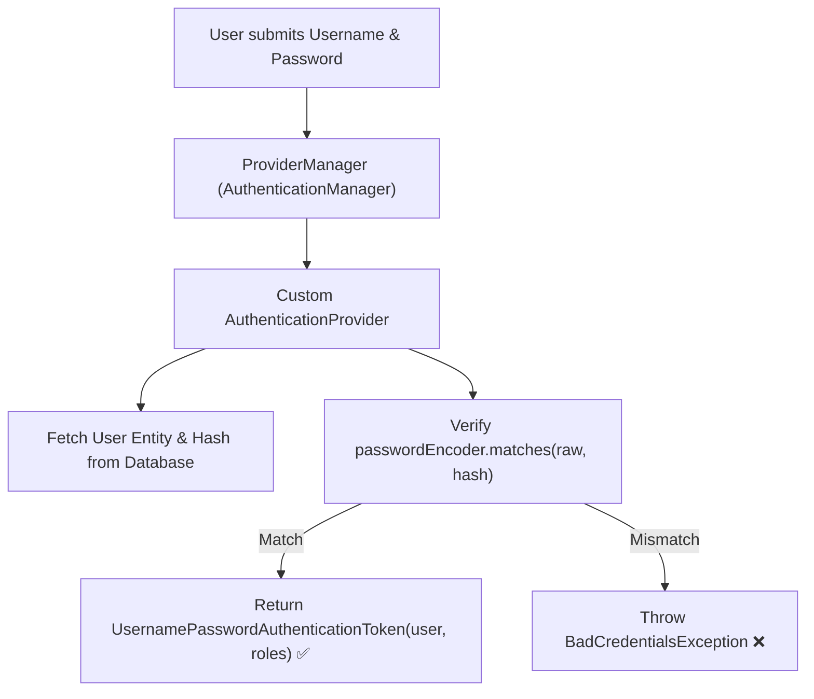
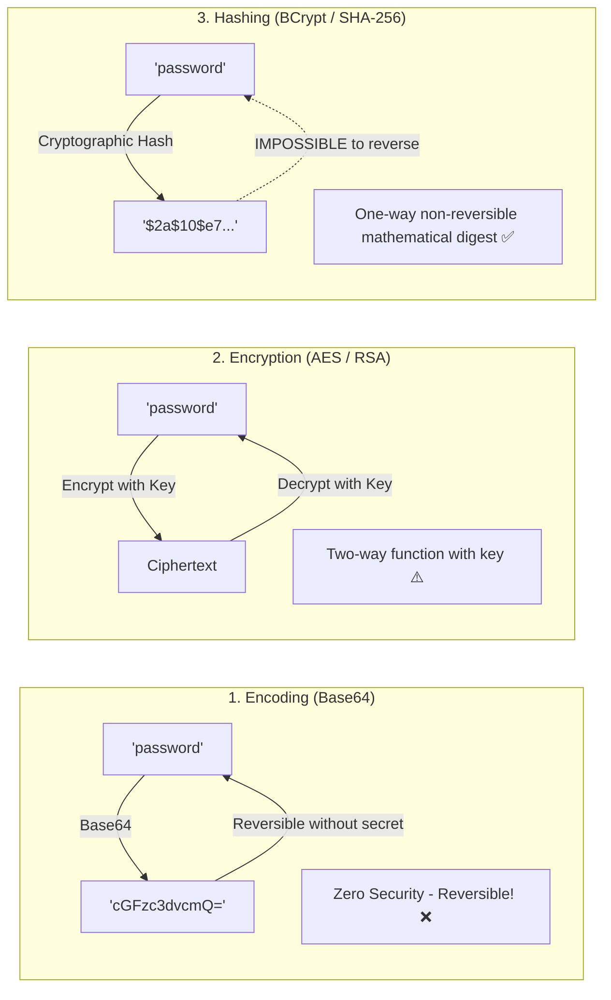
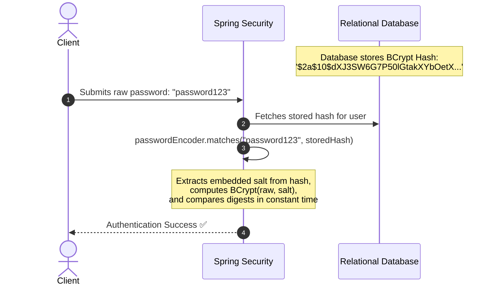

# 🔒 Spring Security & Authentication — Complete Master Guide

> **Foundation**: Based on EazyBytes *Spring, SpringBoot, JPA, Hibernate: Zero to Master* (Slides 89–105, 143–148).  
> **Core Philosophy**: Applications must be secure by default. Spring Security provides a robust, customizable security framework handling **Authentication (Who are you?)**, **Authorization (What can you do?)**, **Password Hashing (`BCrypt`)**, and defensive protections against **CSRF** and **CORS** vulnerabilities.

---

## 📑 Table of Contents
- [1. Spring Security Architecture & Starters](#1-spring-security-architecture--starters)
- [2. Authentication vs. Authorization (401 vs. 403)](#2-authentication-vs-authorization-401-vs-403)
- [3. Default Security Behavior & Configuration](#3-default-security-behavior--configuration)
- [4. Custom `SecurityFilterChain` Configuration](#4-custom-securityfilterchain-configuration)
- [5. Endpoint Matchers: `mvcMatchers` vs. `antMatchers` vs. `regexMatchers`](#5-endpoint-matchers-mvcmatchers-vs-antmatchers-vs-regexmatchers)
- [6. In-Memory User Authentication](#6-in-memory-user-authentication)
- [7. Custom `AuthenticationProvider` (Database & External Auth)](#7-custom-authenticationprovider-database--external-auth)
- [8. Password Management: Encoding vs. Encryption vs. Hashing](#8-password-management-encoding-vs-encryption-vs-hashing)
- [9. `PasswordEncoder` Implementations & BCrypt](#9-passwordencoder-implementations--bcrypt)
- [10. Cross-Site Request Forgery (CSRF): Attack Anatomy & Defense](#10-cross-site-request-forgery-csrf-attack-anatomy--defense)
- [11. Cross-Origin Resource Sharing (CORS) Configuration](#11-cross-origin-resource-sharing-cors-configuration)
- [12. 1-Page Master Revision Cheat Sheet](#12-1-page-master-revision-cheat-sheet)

---

## 1. Spring Security Architecture & Starters

> 💡 **Quick Revision Anchor (2-3 Words)**: `Security Filter Chain`

Adding the Spring Security starter immediately secures all application endpoints:

```xml
<dependency>
    <groupId>org.springframework.boot</groupId>
    <artifactId>spring-boot-starter-security</artifactId>
</dependency>
```



### What Happens Out-of-the-Box:
1. Intercepts **every HTTP request** before it reaches your controllers.
2. Redirects unauthenticated browser requests to a built-in login form (`/login`).
3. Generates a default username (`user`) and prints a random security password to the startup console.
4. Activates default CSRF protection for state-changing HTTP methods (`POST`, `PUT`, `DELETE`).

[⬆ Back to Top](#📑-table-of-contents)

---

## 2. Authentication vs. Authorization (401 vs. 403)

> 💡 **Quick Revision Anchor (2-3 Words)**: `Identity vs Permission`



### Real-World Analogy (Bank Customer):
- **Authentication**: Proving your identity at the bank counter by showing your government ID and entering your PIN. (If verification fails $
ightarrow$ **401 Unauthorized**).
- **Authorization**: Once inside, the teller checks whether your account type allows wire transfers of $1,000,000. If your role does not permit this action $
ightarrow$ **403 Forbidden**.

[⬆ Back to Top](#📑-table-of-contents)

---

## 3. Default Security Behavior & Configuration

> 💡 **Quick Revision Anchor (2-3 Words)**: `Default Properties Configuration`

For rapid local testing and POCs, override the default username and console password via `application.properties`:

```properties
# Custom default credentials for POC testing
spring.security.user.name=eazybytes
spring.security.user.password=12345
```

> [!CAUTION]
> Hardcoding plaintext credentials in properties files is strictly for local prototyping. **Never** use in-memory plaintext credentials in production systems!

[⬆ Back to Top](#📑-table-of-contents)

---

## 4. Custom `SecurityFilterChain` Configuration

> 💡 **Quick Revision Anchor (2-3 Words)**: `Modern SecurityFilterChain`

In modern Spring Boot 3+ (Spring Security 6+), `WebSecurityConfigurerAdapter` is completely removed. Configure security declaratively by registering a **`SecurityFilterChain`** bean:

```java
@Configuration
@EnableWebSecurity
public class ProjectSecurityConfig {

    @Bean
    public SecurityFilterChain defaultSecurityFilterChain(HttpSecurity http) throws Exception {
        http
            .csrf(csrf -> csrf.disable()) // Disabled for stateless REST APIs
            .authorizeHttpRequests(requests -> requests
                // Protected Endpoints
                .requestMatchers("/myAccount", "/myBalance", "/myLoans").authenticated()
                // Public Endpoints
                .requestMatchers("/notices", "/contact", "/register").permitAll()
                // Administrative Endpoints
                .requestMatchers("/admin/**").hasRole("ADMIN")
            )
            .formLogin(Customizer.withDefaults())
            .httpBasic(Customizer.withDefaults());

        return http.build();
    }
}
```

### Special Authorization Directives:
- **`permitAll()`**: Allows open public access to a path without requiring authentication (e.g., landing page, static assets, registration).
- **`denyAll()`**: Completely blocks all access to an endpoint, regardless of authentication. (Useful for temporarily retiring an endpoint in production without deleting the underlying code).
- **`authenticated()`**: Requires a valid authenticated user session.
- **`hasRole("ADMIN")`**: Enforces specific authority checks (expects `ROLE_ADMIN` in user authorities).

[⬆ Back to Top](#📑-table-of-contents)

---

## 5. Endpoint Matchers: `mvcMatchers` vs. `antMatchers` vs. `regexMatchers`

> 💡 **Quick Revision Anchor (2-3 Words)**: `Matcher Security Differences`

When defining URL security patterns, choosing the right matcher is critical to prevent security bypass bugs:



| Matcher Type | How it Resolves Paths | Security Implications |
| :--- | :--- | :--- |
| **`mvcMatchers`**<br>(Spring Boot 3: `requestMatchers`) | Uses Spring MVC's `HandlerMappingIntrospector` to align with the exact way controllers parse paths. | **Most Secure (Industry Standard)**. Protects against trailing slashes (`/secured/`) and suffix extensions (`/secured.html`). |
| **`antMatchers`** | Uses basic Ant-style glob patterns (`/app/**`, `/public/*`). | **Vulnerable to path variations** if the servlet container normalizes paths differently from Spring MVC. |
| **`regexMatchers`** | Uses complex regular expressions for matching. | Highly flexible for complex pattern constraints; computationally slower. |

[⬆ Back to Top](#📑-table-of-contents)

---

## 6. In-Memory User Authentication

> 💡 **Quick Revision Anchor (2-3 Words)**: `InMemoryUserDetailsManager`

To configure multiple test users with distinct roles in local development:

```java
@Configuration
public class ProjectSecurityConfig {

    @Bean
    public InMemoryUserDetailsManager userDetailsService(PasswordEncoder passwordEncoder) {
        UserDetails admin = User.builder()
                .username("admin")
                .password(passwordEncoder.encode("54321"))
                .roles("ADMIN", "USER")
                .build();

        UserDetails user = User.builder()
                .username("user")
                .password(passwordEncoder.encode("12345"))
                .roles("USER")
                .build();

        return new InMemoryUserDetailsManager(admin, user);
    }
}
```

[⬆ Back to Top](#📑-table-of-contents)

---

## 7. Custom `AuthenticationProvider` (Database & External Auth)

> 💡 **Quick Revision Anchor (2-3 Words)**: `Custom AuthProvider`

When authenticating users against a relational database, LDAP, or an external corporate identity system, implement the **`AuthenticationProvider`** interface:



### Production Implementation:
```java
@Component
public class EazySchoolUsernamePwdAuthenticationProvider implements AuthenticationProvider {

    @Autowired
    private PersonRepository personRepository;

    @Autowired
    private PasswordEncoder passwordEncoder;

    @Override
    public Authentication authenticate(Authentication authentication) throws AuthenticationException {
        String username = authentication.getName();
        String rawPassword = authentication.getCredentials().toString();

        Person person = personRepository.findByEmail(username)
                .orElseThrow(() -> new BadCredentialsException("No user registered with this email!"));

        // Compare raw submitted password with BCrypt hash from DB
        if (passwordEncoder.matches(rawPassword, person.getPwd())) {
            List<GrantedAuthority> authorities = new ArrayList<>();
            authorities.add(new SimpleGrantedAuthority(person.getRole()));
            return new UsernamePasswordAuthenticationToken(username, rawPassword, authorities);
        } else {
            throw new BadCredentialsException("Invalid password!");
        }
    }

    @Override
    public boolean supports(Class<?> authentication) {
        // Declares that this provider handles standard username/password tokens
        return UsernamePasswordAuthenticationToken.class.isAssignableFrom(authentication);
    }
}
```

[⬆ Back to Top](#📑-table-of-contents)

---

## 8. Password Management: Encoding vs. Encryption vs. Hashing

> 💡 **Quick Revision Anchor (2-3 Words)**: `Encoding Encryption Hashing`

Storing passwords in plaintext inside a database is an immediate security failure. Understanding the three cryptographic transformations is mandatory for backend engineers:



### Comparison Matrix:

| Dimension | Encoding (e.g., Base64, ASCII) | Encryption (e.g., AES-256, RSA) | Hashing (e.g., BCrypt, SCrypt) |
| :--- | :--- | :--- | :--- |
| **Reversibility** | **100% Reversible** without any secret key. | **Reversible** using decryption key. | **Irreversible** (One-way mathematical digest). |
| **Primary Purpose** | Data transmission compatibility (e.g., binary over HTTP). | Confidentiality of sensitive data in transit or storage. | **Password storage & integrity verification**. |
| **Verification Method**| Decode string directly. | Decrypt with private/symmetric key. | Hash input again and compare resulting digests. |
| **Suitable for Passwords?**| ❌ **NEVER** | ❌ **NO** (Compromised keys leak all passwords). | ✅ **MANDATORY** |

[⬆ Back to Top](#📑-table-of-contents)

---

## 9. `PasswordEncoder` Implementations & BCrypt

> 💡 **Quick Revision Anchor (2-3 Words)**: `BCrypt Adaptive Hashing`

Spring Security provides the `PasswordEncoder` interface to safely hash and verify passwords:

```java
@Configuration
public class SecurityBeansConfig {

    @Bean
    public PasswordEncoder passwordEncoder() {
        return new BCryptPasswordEncoder(); // Recommended standard
    }
}
```

---

### How Passwords Are Validated with Hashing:



### Common `PasswordEncoder` Implementations:
1. **`BCryptPasswordEncoder` (Industry Standard)**:
   - Incorporates a **random 16-byte salt** directly into the output string to defend against Rainbow Table attacks.
   - Includes an **adaptive work factor (cost parameter)** that can be increased as hardware speeds up, defending against brute-force GPU attacks.
2. **`SCryptPasswordEncoder`**: Memory-hard hashing algorithm designed to resist custom hardware (ASIC) attacks.
3. **`Pbkdf2PasswordEncoder`**: Federal standard key derivation function.
4. **`NoOpPasswordEncoder` (Deprecated)**: Compares plaintext passwords. Useful **only for toy legacy demos**; dangerous in production.

[⬆ Back to Top](#📑-table-of-contents)

---

## 10. Cross-Site Request Forgery (CSRF): Attack Anatomy & Defense

> 💡 **Quick Revision Anchor (2-3 Words)**: `CSRF Token Defense`

### The Attack Walkthrough (The "90% OFF on iPhone" Trap):

```mermaid
sequenceDiagram
    autonumber
    actor User as Legitimate User
    participant Browser as User Browser
    participant Netflix as Netflix.com (Legitimate App)
    participant Evil as Evil.com (Attacker Server)

    User->>Browser: 1. Logs into Netflix.com
    Netflix-->>Browser: Returns Session Cookie (Stored in browser)
    User->>Browser: 2. Opens new tab and visits evil.com
    Evil-->>Browser: Serves page with bait: "90% OFF on iPhone!"
    Note over Browser: Hidden form inside evil.com executes automatically:<br><form action="https://netflix.com/changeEmail" method="POST"><br><input type="hidden" name="email" value="attacker@evil.com">
    Browser->>Netflix: 3. Forged POST /changeEmail sent to Netflix!
    Note over Browser,Netflix: Browser AUTOMATICALLY attaches the Netflix session cookie!
    Netflix->>Netflix: 4. Sees valid session cookie -> Changes user email to attacker@evil.com! 💥
```



---

### The Solution: Synchronizer CSRF Token Pattern
To defeat CSRF attacks, the server requires a **secret, unpredictable cryptographic token** on all state-changing HTTP requests:
1. When the user loads a form, the server generates a unique CSRF token and embeds it as a hidden field in the HTML:
   ```html
   <input type="hidden" name="_csrf" value="4bf3b267-27b9-4f76-8889-873b22cfc1b4" />
   ```
2. When the user submits the form, Spring Security's `CsrfFilter` checks whether the submitted token matches the server's session token.
3. If an attacker's website (`evil.com`) tricks the browser into sending a request, **it cannot read or guess the secret CSRF token** due to the browser's Same-Origin Policy. The request is immediately rejected with **HTTP 403 Forbidden**!

---

### When to Disable CSRF (`http.csrf().disable()`):
> [!IMPORTANT]
> - **Server-Rendered MVC Apps (Thymeleaf/JSP)**: **Enable CSRF**. Browser cookies automatically authorize form posts, making CSRF protection mandatory.
> - **Stateless REST APIs (JWT / Bearer Tokens)**: **Disable CSRF**. Since REST APIs store authentication tokens in `Authorization: Bearer <jwt>` headers (which browsers never attach automatically), CSRF attacks are impossible!

[⬆ Back to Top](#📑-table-of-contents)

---

## 11. Cross-Origin Resource Sharing (CORS) Configuration

> 💡 **Quick Revision Anchor (2-3 Words)**: `Browser Origin Security`

### What is CORS?
The browser enforces the **Same-Origin Policy (SOP)**: a script executing on `https://myfrontend.com` is forbidden from reading data from `https://api.mybackend.com` unless the backend explicitly grants permission.

An "Origin" is defined by the **Scheme + Domain + Port**:
- `http://localhost:3000` $
e$ `http://localhost:8080` (Different Port).
- `http://example.com` $
e$ `https://example.com` (Different Scheme).

---

### Enabling CORS in Spring Boot:

#### Approach 1: Controller-Level `@CrossOrigin`
```java
@RestController
@RequestMapping("/api/contacts")
@CrossOrigin(origins = "http://localhost:3000") // Allows React frontend
public class ContactRestController {

    @GetMapping
    public List<Contact> getContacts() {
        return contactRepository.findAll();
    }
}
```

#### Approach 2: Global Configuration via `WebMvcConfigurer` (Production Standard)
```java
@Configuration
public class WebCorsConfig implements WebMvcConfigurer {

    @Override
    public void addCorsMappings(CorsRegistry registry) {
        registry.addMapping("/api/**")
                .allowedOrigins("http://localhost:3000", "https://eazyschool.com")
                .allowedMethods("GET", "POST", "PUT", "DELETE")
                .allowedHeaders("*")
                .allowCredentials(true)
                .maxAge(3600); // Cache pre-flight OPTIONS response for 1 hour
    }
}
```

[⬆ Back to Top](#📑-table-of-contents)

---

## 12. 1-Page Master Revision Cheat Sheet

> 💡 **Quick Revision Anchor (2-3 Words)**: `Security Master Sheet`

| Security Topic | Key Concept | Production Best Practice |
| :--- | :--- | :--- |
| **AuthN vs. AuthZ** | AuthN = Who you are (401); AuthZ = What you can do (403). | Check identity first, then authorize against roles/privileges. |
| **Matchers** | `mvcMatchers()` vs `antMatchers()`. | Always use `mvcMatchers()` / `requestMatchers()` to prevent URL bypasses. |
| **Custom Auth** | Implement `AuthenticationProvider`. | Override `authenticate()` and delegate password matching to BCrypt. |
| **Password Hashing**| One-way cryptographic transformation. | Always use `BCryptPasswordEncoder` with built-in salting. |
| **CSRF Defense** | Secret random token required on state-modifying requests. | Enable for MVC/Thymeleaf; disable for stateless REST with JWT. |
| **CORS** | Browser security restriction across different origins. | Configure globally via `WebMvcConfigurer` specifying trusted origins. |

[⬆ Back to Top](#📑-table-of-contents)
