# 🚀 Spring REST, Microservices & Production Features — Complete Master Guide

> **Foundation**: Enterprise Spring Boot 3+ & Spring Framework 6+ Architecture.  
> **Core Philosophy**: Modern backend architectures rely on **REST APIs** for client-server decoupling and service-to-service communication. Enterprise readiness demands mastering **RESTful API design (DTOs, validation, error formats)**, **REST consumers (OpenFeign, WebClient, RestTemplate)**, **microservices architectural patterns (API Gateway, Service Discovery, Circuit Breakers)**, robust **production logging (SLF4J/Logback)**, **multi-environment configuration & profiles**, telemetry monitoring with **Spring Boot Actuator**, and **testing strategies (JUnit 5, Mockito, MockMvc, Slices)**.

---

## 📑 Table of Contents
- [1. REST API Fundamentals & Request Handling](#1-rest-api-fundamentals--request-handling)
- [2. Production REST API Design Best Practices](#2-production-rest-api-design-best-practices)
- [3. JSON Serialization with Jackson Annotations](#3-json-serialization-with-jackson-annotations)
- [4. Consuming External REST Services: OpenFeign vs. RestTemplate vs. WebClient](#4-consuming-external-rest-services-openfeign-vs-resttemplate-vs-webclient)
- [5. Microservices Architecture Fundamentals](#5-microservices-architecture-fundamentals)
- [6. Production Configuration & Hierarchy](#6-production-configuration--hierarchy)
- [7. Type-Safe Configuration with `@ConfigurationProperties`](#7-type-safe-configuration-with-configurationproperties)
- [8. Multi-Environment Spring Profiles (`@Profile`)](#8-multi-environment-spring-profiles-profile)
- [9. Production Logging: SLF4J, Logback & Parameterized Best Practices](#9-production-logging-slf4j-logback--parameterized-best-practices)
- [10. Spring Boot Actuator & Production Telemetry](#10-spring-boot-actuator--production-telemetry)
- [11. Spring Boot Testing Fundamentals (JUnit 5, Mockito, Test Slices)](#11-spring-boot-testing-fundamentals-junit-5-mockito-test-slices)
- [12. 1-Page Master Revision Cheat Sheet](#12-1-page-master-revision-cheat-sheet)

---

## 1. REST API Fundamentals & Request Handling

> 💡 **Quick Revision Anchor (2-3 Words)**: `RESTful Resource Operations`

**REST (Representational State Transfer)** is an architectural style for designing networked applications. It treats data elements as **Resources**, identified by unique URIs, and manipulated using standard **HTTP verbs**.

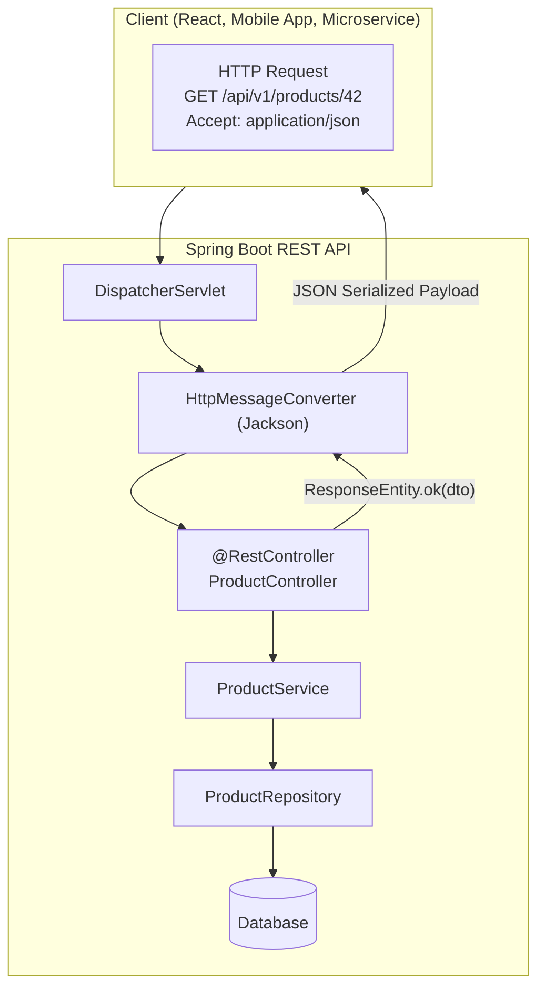


---

### Key HTTP Methods & Idempotency

| HTTP Method | CRUD Operation | Purpose | Idempotent? | Safe? (Read-only) | Typical Response Code |
| :--- | :--- | :--- | :---: | :---: | :--- |
| **GET** | Read | Retrieve resource representation | **Yes** | **Yes** | `200 OK`, `404 Not Found` |
| **POST** | Create | Create a new subordinate resource / trigger action | **No** | **No** | `201 Created` (+ `Location` header) |
| **PUT** | Update / Replace | Complete replacement of target resource | **Yes** | **No** | `200 OK`, `204 No Content` |
| **PATCH** | Partial Update | Modify specific fields of an existing resource | **No** (Standard) | **No** | `200 OK`, `204 No Content` |
| **DELETE** | Delete | Remove the designated resource | **Yes** | **No** | `200 OK`, `204 No Content` |

> 📌 **What is Idempotency?**  
> An HTTP method is **idempotent** if making multiple identical requests has the same intended effect on server state as making a single request.  
> - `GET /users/5` 10 times $\rightarrow$ Same server state.  
> - `DELETE /users/5` 10 times $\rightarrow$ User is deleted once; subsequent calls still leave the user deleted.  
> - `POST /orders` 10 times $\rightarrow$ Creates 10 different orders (**Not idempotent**).

---

### Essential HTTP Status Codes

| Category | Status Code | Meaning & Production Use Case |
| :--- | :--- | :--- |
| **2xx Success** | `200 OK` | Request succeeded; payload returned in body. |
| | `201 Created` | Resource successfully created (used with POST); include `Location` header. |
| | `204 No Content` | Request succeeded, but response intentionally has no body (DELETE/PUT). |
| **4xx Client Error** | `400 Bad Request` | Malformed JSON syntax, invalid query param, or validation failure. |
| | `401 Unauthorized` | Missing, invalid, or expired authentication token (Unauthenticated). |
| | `403 Forbidden` | Authenticated client lacks sufficient permission/role (Unauthorized). |
| | `404 Not Found` | Resource URI does not exist or target entity ID not found. |
| | `409 Conflict` | Request conflicts with current server state (e.g., duplicate email address). |
| **5xx Server Error** | `500 Internal Error`| Unhandled backend exception or infrastructure failure. |
| | `503 Unavailable` | Downstream dependency or database connection pool exhausted. |

---

### Request Annotations: Extracting Input Data

```java
@RestController
@RequestMapping("/api/v1/products")
public class ProductRestController {

    private final ProductService productService;

    public ProductRestController(ProductService productService) {
        this.productService = productService;
    }

    // 1. Path Variable: /api/v1/products/42
    @GetMapping("/{id}")
    public ResponseEntity<ProductResponse> getById(@PathVariable("id") Long id) {
        return ResponseEntity.ok(productService.getProductById(id));
    }

    // 2. Query Parameters: /api/v1/products?category=ELEC&page=0&size=10
    @GetMapping
    public ResponseEntity<Page<ProductResponse>> searchProducts(
            @RequestParam(name = "category", required = false) String category,
            @RequestParam(name = "page", defaultValue = "0") int page,
            @RequestParam(name = "size", defaultValue = "10") int size) {
        return ResponseEntity.ok(productService.search(category, page, size));
    }

    // 3. Request Body with Validation: JSON payload -> DTO
    @PostMapping
    public ResponseEntity<ProductResponse> createProduct(
            @Valid @RequestBody CreateProductRequest request,
            @RequestHeader(name = "X-Correlation-ID", required = false) String correlationId) {
        ProductResponse created = productService.createProduct(request);
        URI location = URI.create("/api/v1/products/" + created.getId());
        return ResponseEntity.created(location).body(created);
    }
}
```

---

## 2. Production REST API Design Best Practices

> 💡 **Quick Revision Anchor (2-3 Words)**: `API Design Standards`

### 1. Entity vs. DTO Separation
Never expose JPA Entities directly through `@RestController` endpoints:
* **Security**: Entities contain sensitive internal attributes (password hashes, audit trails, tenant IDs).
* **Decoupling**: Prevents client contracts from breaking when the database schema changes.
* **Performance**: Avoids Jackson triggering unintended `LazyInitializationException` or circular JSON recursion.

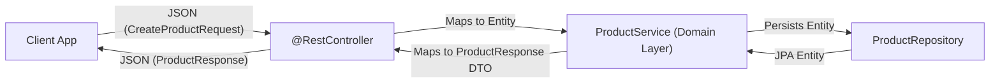


---

### 2. PUT vs. PATCH
* **`PUT` (Complete Replacement)**: The client sends the *entire* resource representation. Fields omitted in the request body are typically set to `null` or default values.
* **`PATCH` (Partial Update)**: The client sends *only* the specific fields to modify (e.g., `{"price": 49.99}`). All other fields remain unchanged.

---

### 3. API Versioning Strategies

| Strategy | Example | Pros & Cons |
| :--- | :--- | :--- |
| **URI Path (Recommended)** | `/api/v1/users`, `/api/v2/users` | **Most common, clear, easy to cache & route at Gateway.** |
| **Request Header** | `X-API-Version: 2` | Clean URIs, but harder to test via standard browser links. |
| **Query Parameter** | `/api/users?version=2` | Simple, but pollutes query string logic. |
| **Content Negotiation** | `Accept: application/vnd.company.app-v2+json` | Pure RESTful standard, but complex client setup. |

---

### 4. Standardized API Error Response
In production, every REST error (whether 400, 404, or 500) must return a consistent, machine-readable JSON structure:

```json
{
  "timestamp": "2026-09-19T14:30:00Z",
  "status": 404,
  "error": "Not Found",
  "message": "Product with ID 999 not found",
  "path": "/api/v1/products/999"
}
```

---

## 3. JSON Serialization with Jackson Annotations

> 💡 **Quick Revision Anchor (2-3 Words)**: `Jackson Payload Control`

Spring Boot uses **Jackson** (`ObjectMapper`) to serialize Java POJOs into JSON strings and deserialize incoming JSON payloads into Java objects.

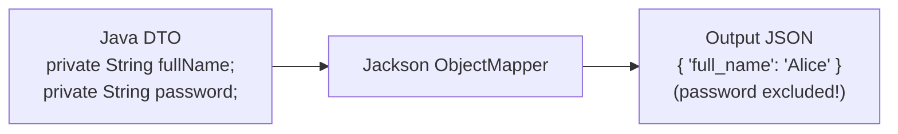


---

### Core Jackson Annotations:

| Annotation | Placement | Purpose | Production Example |
| :--- | :--- | :--- | :--- |
| **`@JsonProperty`** | Field / Getter | Renames JSON key or defines read/write access. | `@JsonProperty("user_name")` |
| **`@JsonIgnore`** | Field / Method | Completely excludes field from serialization and deserialization. | `@JsonIgnore private String password;` |
| **`@JsonIgnoreProperties`** | Class | Ignores unknown fields or lists multiple exclusions. | `@JsonIgnoreProperties(ignoreUnknown = true)` |
| **`@JsonFormat`** | Field | Formats dates, times, and numbers during serialization. | `@JsonFormat(pattern = "yyyy-MM-dd'T'HH:mm:ss")` |
| **`@JsonInclude`** | Class / Field | Omits fields conditionally (e.g., exclude null values). | `@JsonInclude(JsonInclude.Include.NON_NULL)` |

```java
@Data
@JsonIgnoreProperties(ignoreUnknown = true)
@JsonInclude(JsonInclude.Include.NON_NULL)
public class UserResponseDto {

    @JsonProperty("user_id")
    private Long id;

    @JsonProperty("full_name")
    private String fullName;

    @JsonIgnore // NEVER exposed in response JSON!
    private String internalPasswordHash;

    @JsonFormat(pattern = "yyyy-MM-dd HH:mm:ss", timezone = "UTC")
    private LocalDateTime createdAt;
}
```

---

## 4. Consuming External REST Services: OpenFeign vs. RestTemplate vs. WebClient

> 💡 **Quick Revision Anchor (2-3 Words)**: `REST Client Comparison`

When a Spring Boot application needs to call external third-party APIs or downstream microservices, Spring offers three main HTTP client approaches:

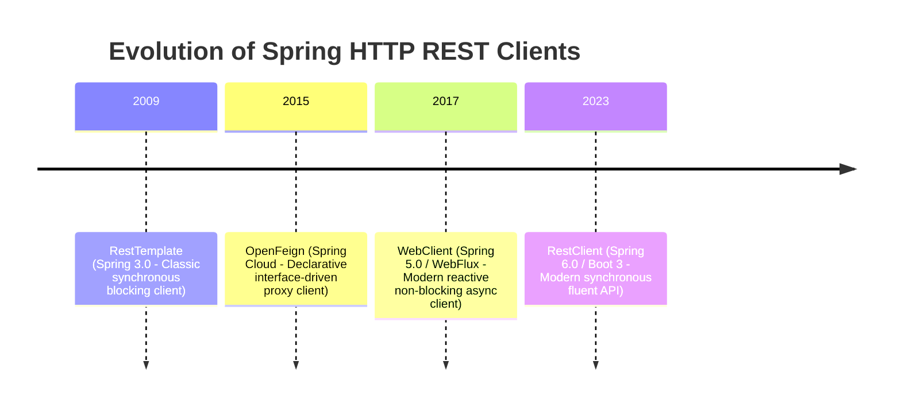


---

### Comparison of Spring REST Clients:

| Dimension | OpenFeign | `RestTemplate` | `WebClient` |
| :--- | :--- | :--- | :--- |
| **Programming Model** | **Declarative Interface Proxy** | Imperative / Object-oriented | Functional / Fluent API |
| **Execution Model** | Synchronous / Blocking (1 thread/req) | Synchronous / Blocking (1 thread/req) | **Asynchronous / Non-blocking** (Event Loop) |
| **Module / Dependency** | `spring-cloud-starter-openfeign` | `spring-boot-starter-web` | `spring-boot-starter-webflux` |
| **Status in Spring 6+** | Industry Standard for Spring Cloud | **Maintenance Mode** (Use `RestClient` or `WebClient`) | **Active Modern Standard** |
| **Best Used When** | Calling internal microservices with defined contracts | Legacy codebases maintaining existing calls | High-concurrency async streaming or reactive stacks |

> 📌 **Note on Reactive Programming**: Not every application needs WebClient or reactive programming. For standard CRUD business backends, synchronous blocking calls (or OpenFeign / RestClient) are simple, debuggable, and sufficient.

---

### Implementation Examples:

#### 1. OpenFeign (Declarative Interface Proxy)
```java
// 1. Declare the Feign Client Interface
@FeignClient(name = "payment-service", url = "${payment.service.url}")
public interface PaymentClient {

    @GetMapping("/api/v1/payments/{id}")
    PaymentDto getPaymentStatus(@PathVariable("id") String paymentId);

    @PostMapping("/api/v1/payments")
    PaymentDto processPayment(@RequestBody PaymentRequest request);
}

// 2. Inject and call like a local Java Spring bean!
@Service
public class OrderService {
    private final PaymentClient paymentClient;

    public OrderService(PaymentClient paymentClient) {
        this.paymentClient = paymentClient;
    }

    public void checkout(PaymentRequest request) {
        PaymentDto result = paymentClient.processPayment(request);
    }
}
```

#### 2. `RestTemplate` (Classic Synchronous Client)
```java
@Service
public class LegacyWeatherService {
    private final RestTemplate restTemplate;

    public LegacyWeatherService(RestTemplateBuilder builder) {
        this.restTemplate = builder.build();
    }

    public WeatherDto fetchWeather(String city) {
        String url = "https://api.weather.com/v1/{city}";
        return restTemplate.getForObject(url, WeatherDto.class, city);
    }
}
```

#### 3. `WebClient` (Modern Reactive & Non-Blocking)
```java
@Service
public class ReactiveDataService {
    private final WebClient webClient;

    public ReactiveDataService(WebClient.Builder builder) {
        this.webClient = builder.baseUrl("https://api.external.com").build();
    }

    public Mono<ExternalDto> fetchAsync(String id) {
        return webClient.get()
                        .uri("/items/{id}", id)
                        .retrieve()
                        .bodyToMono(ExternalDto.class); // Non-blocking reactive stream
    }
}
```

---

## 5. Microservices Architecture Fundamentals

> 💡 **Quick Revision Anchor (2-3 Words)**: `Distributed Architecture Pillars`

### Microservices Ecosystem Architecture

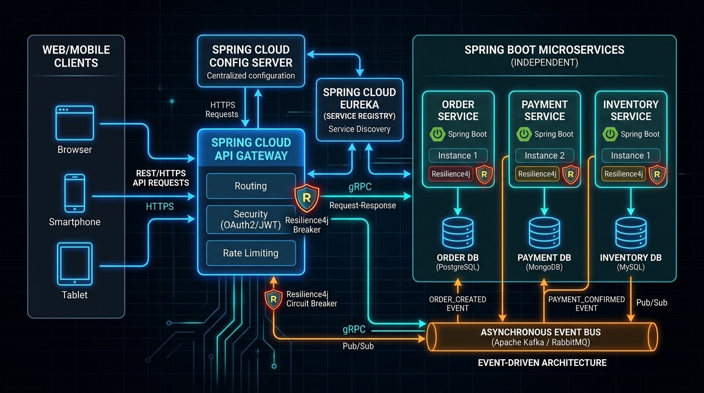


### Monolith vs. Microservices

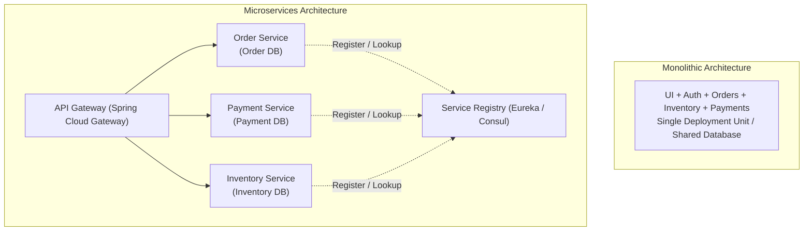


---

### Core Microservice Architectural Building Blocks:

1. **API Gateway (e.g., Spring Cloud Gateway)**:
   - **Single Entry Point**: All client requests route through the Gateway.
   - **Cross-Cutting Concerns**: Handles authentication, SSL termination, global rate-limiting, CORS, and request logging in one central location.

2. **Service Discovery (e.g., Netflix Eureka / HashiCorp Consul)**:
   - Microservice instances start dynamically with variable IP addresses (especially in containerized/Kubernetes environments).
   - Each service registers with Eureka on boot. The Gateway and other services discover target service network locations dynamically.

3. **Centralized Configuration (e.g., Spring Cloud Config / Vault)**:
   - Centralizes `application.yml` files for all microservices in a single Git repository or secrets vault.
   - Allows updating configurations across 100+ services without redeploying code.

4. **Synchronous vs. Asynchronous Communication**:
   - **Synchronous (HTTP/REST, gRPC)**: Client waits for immediate response. Simple, but creates tight runtime coupling (cascading latency).
   - **Asynchronous (Message Brokers: Apache Kafka, RabbitMQ)**: Services emit events (e.g., `OrderPlacedEvent`). Downstream services consume events independently. Enables high throughput and fault decoupling.

---

### Resilience & Circuit Breakers (Resilience4j)

When a downstream service slows down or fails, calling it repeatedly can exhaust thread pools and bring down the entire system (**cascading failure**). A **Circuit Breaker** monitors call failures:

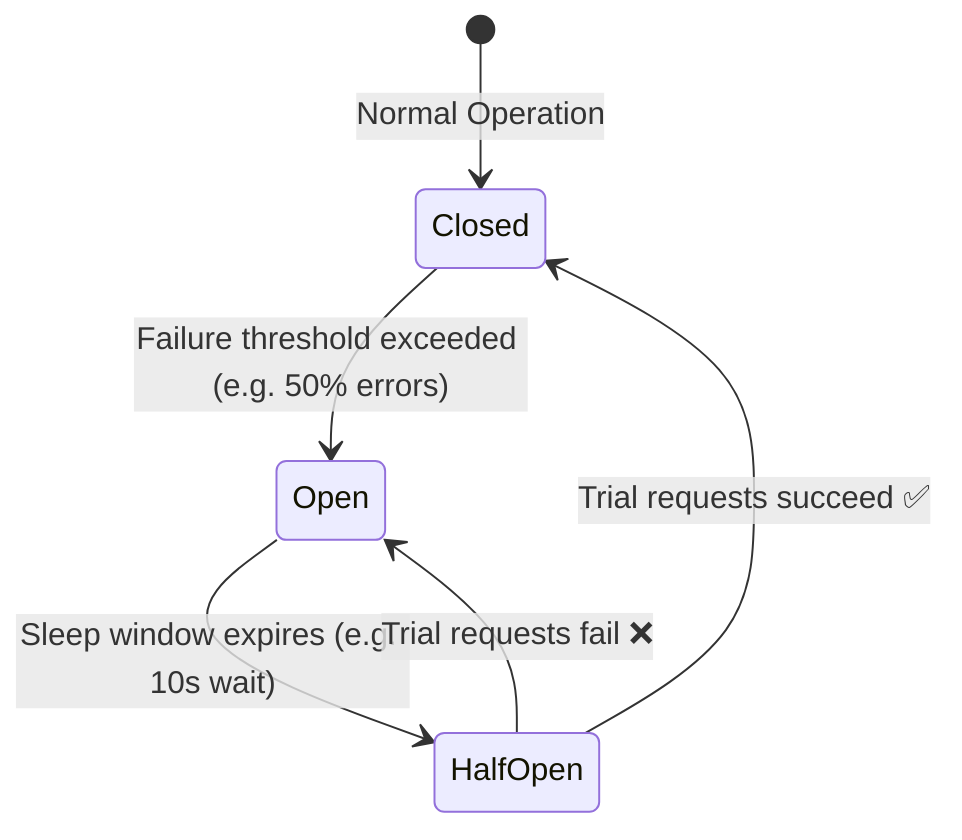


* **Closed**: Requests flow normally to the downstream service.
* **Open**: Requests fail fast immediately without calling the failing downstream service. A fallback response is returned.
* **Half-Open**: Allows a limited trial number of requests through to check if the downstream service has recovered.

---

## 6. Production Configuration & Hierarchy

> 💡 **Quick Revision Anchor (2-3 Words)**: `Config Precedence Hierarchy`

Spring Boot uses an **Externalized Configuration Hierarchy** that allows the exact same JAR artifact to run seamlessly across Development, Staging, and Production without rebuilding.

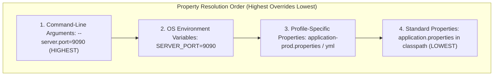


---

### Secrets Management in Production:
> ⚠️ **Critical Production Rule**: **Never hardcode secrets** (database passwords, API keys, JWT secret keys) in `application.properties` or commit them to Git.
* In Kubernetes/Cloud: Inject secrets via **Environment Variables** (`SPRING_DATASOURCE_PASSWORD`).
* In Enterprise Cloud: Use dedicated secret managers (AWS Secrets Manager, HashiCorp Vault).

---

## 7. Type-Safe Configuration with `@ConfigurationProperties`

> 💡 **Quick Revision Anchor (2-3 Words)**: `Type-Safe Bean Binding`

Instead of scattering dozens of loose `@Value` annotations across multiple classes, group related configurations into a strongly-typed, validated Java class using **`@ConfigurationProperties`**:

### In `application.yml`:
```yaml
app:
  security:
    jwt:
      secret-key: "my-super-secret-production-signing-key-32-chars-long"
      expiration-ms: 86400000
  email:
    smtp-host: "smtp.mailgun.org"
    port: 587
    whitelisted-domains:
      - "company.com"
      - "partner.org"
```

### The Configuration Class:
```java
@Component
@ConfigurationProperties(prefix = "app")
@Validated // Supports Bean Validation during startup!
@Data
public class AppProperties {

    private final Security security = new Security();
    private final Email email = new Email();

    @Data
    public static class Security {
        private final Jwt jwt = new Jwt();

        @Data
        public static class Jwt {
            @NotBlank(message = "JWT Secret key cannot be blank")
            @Size(min = 32, message = "JWT Secret must be at least 32 characters")
            private String secretKey;
            private long expirationMs = 3600000; // 1 hour default
        }
    }

    @Data
    public static class Email {
        @NotBlank
        private String smtpHost;
        private int port;
        private List<String> whitelistedDomains = new ArrayList<>();
    }
}
```

### `@Value` vs. `@ConfigurationProperties`:

| Dimension | `@Value` | `@ConfigurationProperties` |
| :--- | :--- | :--- |
| **Binding Scope** | Single field per annotation | Groups entire hierarchical structures |
| **Type Safety & Validation** | No validation support | Supports `@Validated` (`@NotNull`, `@Min`) |
| **Collections / Maps** | Clunky SpEL syntax | Native nested lists and key-value maps |
| **Relaxed Binding** | Strict matching | Supports kebab-case, camelCase, snake_case |
| **Best Used For** | Simple one-off property injection | Structured enterprise application settings |

---

## 8. Multi-Environment Spring Profiles (`@Profile`)

> 💡 **Quick Revision Anchor (2-3 Words)**: `Multi-Environment Profiles`

Spring Profiles segregate parts of the application configuration and enable specific beans only in designated environments (`dev`, `uat`, `prod`).

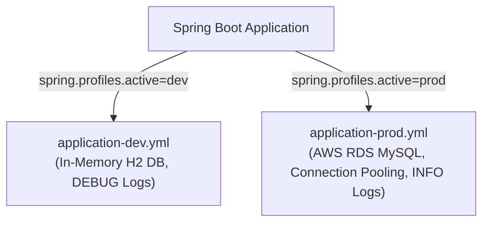


---

### Profile Activation Methods:
1. In `application.properties`: `spring.profiles.active=prod`
2. Via Command-Line Argument: `java -jar app.jar --spring.profiles.active=prod`
3. Via OS Environment Variable: `export SPRING_PROFILES_ACTIVE=prod`

### Conditional Bean Activation with `@Profile`:
```java
// Registered ONLY in production
@Service
@Profile("prod")
public class S3DocumentStorageService implements StorageService {
    public void store(byte[] content, String filename) {
        // Uploads file to AWS S3 bucket
    }
}

// Registered in ALL environments EXCEPT production (e.g. dev, test)
@Service
@Profile("!prod")
public class LocalDiskStorageService implements StorageService {
    public void store(byte[] content, String filename) {
        // Writes file to local /tmp directory
    }
}
```

---

## 9. Production Logging: SLF4J, Logback & Parameterized Best Practices

> 💡 **Quick Revision Anchor (2-3 Words)**: `SLF4J Parameterized Logging`

Spring Boot uses **SLF4J (Simple Logging Facade for Java)** as an abstraction layer backed by **Logback** as the default logging engine.

---

### Anatomy of a Spring Boot Console Log Line:
```text
2026-09-19 14:02:46.035  INFO 15084 --- [main] c.e.order.service.OrderService          : Processing payment for order ID: 1045
```

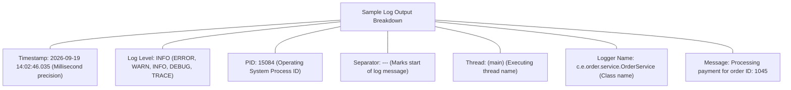


---

### Log Severity Hierarchy:
$$\mathbf{TRACE} < \mathbf{DEBUG} < \mathbf{INFO} < \mathbf{WARN} < \mathbf{ERROR}$$

* Enabling a level enables that level and **all levels to its right** (higher severity).
* Setting level to `INFO` logs `INFO`, `WARN`, and `ERROR`, while suppressing `DEBUG` and `TRACE`.

---

### Parameterized Logging in Code (Correct SLF4J Syntax)

> ⚠️ **Critical Syntax Rule**: Always use `{}` placeholders in SLF4J. **Never** use string concatenation `+` (which wastes CPU and memory creating String objects even when the log level is disabled) or `${}` (which is for property resolution).

```java
@Service
@Slf4j // Injects: private static final Logger log = LoggerFactory.getLogger(OrderService.class);
public class OrderService {

    public void processOrder(Long orderId, BigDecimal amount) {
        // Correct parameterized logging:
        log.info("Processing order with ID: {} and amount: {}", orderId, amount);

        try {
            // Business logic
        } catch (PaymentException ex) {
            // Log exception stack trace as the last argument without a placeholder:
            log.error("Failed to process order ID: {} due to error: {}", orderId, ex.getMessage(), ex);
            throw ex;
        }
    }
}
```

### Production Logging Best Practices:
1. **Never log sensitive data**: Mask credit card numbers, passwords, SSNs, and JWT tokens.
2. **Correlation / Trace IDs (MDC)**: Use Mapped Diagnostic Context (`MDC.put("traceId", traceId)`) so every log line across microservices carries the same trace identifier for distributed debugging.

---

## 10. Spring Boot Actuator & Production Telemetry

> 💡 **Quick Revision Anchor (2-3 Words)**: `Production Health Telemetry`

**Spring Boot Actuator** provides production-ready features to monitor, gather metrics, and inspect the operational health of running applications.

```xml
<dependency>
    <groupId>org.springframework.boot</groupId>
    <artifactId>spring-boot-starter-actuator</artifactId>
</dependency>
```

---

### Essential Actuator Endpoints:

| Endpoint | HTTP Method | What It Exposes |
| :--- | :---: | :--- |
| **`/actuator/health`** | GET | Overall system health (`UP`/`DOWN`), database connectivity, disk space. |
| **`/actuator/metrics`** | GET | JVM memory, GC pauses, CPU utilization, active HTTP request rates. |
| **`/actuator/info`** | GET | Arbitrary build/application metadata (git commit, app version). |
| **`/actuator/beans`** | GET | Complete catalog of all registered Spring beans in `ApplicationContext`. |
| **`/actuator/env`** | GET | Active property sources, environment variables, active profiles. |
| **`/actuator/loggers`** | GET, POST | Inspect and **dynamically change log levels at runtime** without restarting! |
| **`/actuator/mappings`** | GET | Catalog of all mapped `@RequestMapping` URLs and handler methods. |
| **`/actuator/threaddump`**| GET | Generates JVM thread dump to diagnose thread deadlocks or CPU spikes. |

---

### Production Actuator Security Configuration:
> ⚠️ **Security Warning**: Exposing all actuator endpoints publicly (`include: "*"`) leaks internal environment variables, database credentials, and system architecture.

```properties
# Expose only health and info publicly
management.endpoints.web.exposure.include=health,info

# Show full health details (database, disk) only to authenticated users
management.endpoint.health.show-details=when_authorized
```

In Spring Security configuration:
```java
.authorizeHttpRequests(auth -> auth
    .requestMatchers("/actuator/health", "/actuator/info").permitAll()
    .requestMatchers("/actuator/**").hasRole("ADMIN") // Protect sensitive telemetry
    .anyRequest().authenticated()
)
```

---

## 11. Spring Boot Testing Fundamentals (JUnit 5, Mockito, Test Slices)

> 💡 **Quick Revision Anchor (2-3 Words)**: `Unit vs Slice Testing`

A robust Spring Boot testing strategy combines **Unit Tests** (fast, isolated with mocks) and **Integration/Slice Tests** (verifying Spring context components).

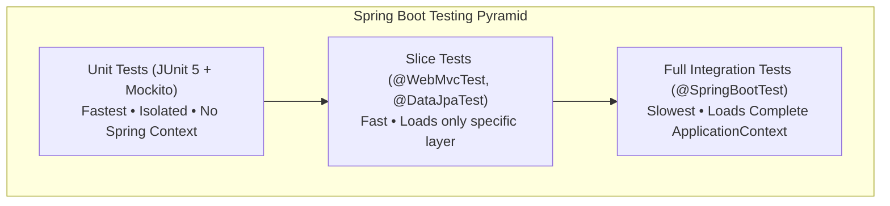


---

### Testing Tools & Annotations Summary:

| Annotation / Tool | Test Type | Purpose | Loads Full Spring Context? |
| :--- | :--- | :--- | :---: |
| **JUnit 5 (`@Test`)** | Unit | Standard Java test execution framework and assertions. | ❌ No |
| **Mockito (`@Mock`, `@InjectMocks`)** | Unit | Creates mock objects and stubs return values (`when().thenReturn()`). | ❌ No |
| **`@SpringBootTest`** | Full Integration | Bootstraps the entire `ApplicationContext` (with real beans, DB, etc.). | ✅ **Yes** |
| **`@WebMvcTest`** | Web Layer Slice | Tests only Controller layer; mocks services with `@MockBean`. | ❌ Controller slice only |
| **`@DataJpaTest`** | JPA Layer Slice | Tests only JPA Repositories with an embedded in-memory database. | ❌ Repository slice only |
| **`MockMvc`** | Controller Testing | Simulates HTTP requests and verifies status codes/JSON responses. | N/A (Used with `@WebMvcTest`) |

---

### Code Examples:

#### 1. Unit Test (JUnit 5 + Mockito)
```java
@ExtendWith(MockitoExtension.class)
class ProductServiceTest {

    @Mock
    private ProductRepository productRepository;

    @InjectMocks
    private ProductService productService;

    @Test
    void whenValidId_thenProductShouldBeFound() {
        Product mockProduct = new Product(1L, "Laptop", new BigDecimal("1200.00"));
        Mockito.when(productRepository.findById(1L)).thenReturn(Optional.of(mockProduct));

        ProductResponse response = productService.getProductById(1L);

        Assertions.assertNotNull(response);
        Assertions.assertEquals("Laptop", response.getName());
        Mockito.verify(productRepository, Mockito.times(1)).findById(1L);
    }
}
```

#### 2. Controller Slice Test (`@WebMvcTest` + `MockMvc`)
```java
@WebMvcTest(ProductRestController.class)
class ProductRestControllerTest {

    @Autowired
    private MockMvc mockMvc;

    @MockBean
    private ProductService productService;

    @Test
    void getProductById_shouldReturnOkAndJson() throws Exception {
        ProductResponse dto = new ProductResponse(1L, "Laptop", new BigDecimal("1200.00"));
        Mockito.when(productService.getProductById(1L)).thenReturn(dto);

        mockMvc.perform(get("/api/v1/products/1")
                .contentType(MediaType.APPLICATION_JSON))
                .andExpect(status().isOk())
                .andExpect(jsonPath("$.full_name").value("Laptop"))
                .andExpect(jsonPath("$.price").value(1200.00));
    }
}
```

---

## 12. 1-Page Master Revision Cheat Sheet

> 💡 **Quick Revision Anchor (2-3 Words)**: `Production REST Cheat Sheet`

| Topic | Key Concept | Production Rule / Best Practice |
| :--- | :--- | :--- |
| **`@RestController`** | `@Controller` + `@ResponseBody`. Bypasses ViewResolver. | Returns DTOs serialized into JSON via Jackson. Never expose Entities directly. |
| **HTTP Methods** | GET/PUT/DELETE are idempotent; POST/PATCH are not. | Use `201 Created` for POST with `Location` header; `204` for bodyless DELETE. |
| **REST Clients** | OpenFeign (Declarative) vs. WebClient (Async) vs. RestTemplate (Legacy). | Use OpenFeign for microservices contracts; WebClient for reactive async streams. |
| **Microservices** | Distributed system with API Gateway, Eureka Discovery, Config Server. | Implement Circuit Breakers (Resilience4j) to prevent cascading downstream outages. |
| **Property Precedence**| CLI Args > Env Vars > Profile YAML > Default YAML. | Inject database credentials and JWT secrets via OS environment variables. |
| **`@ConfigurationProperties`**| Type-safe, validated object binding. | Group related properties with `@Validated` and `@Min`/`@NotBlank` annotations. |
| **Logging** | SLF4J abstraction + Logback implementation. | Use `{}` placeholders: `log.info("User {} logged in", id)`. Mask sensitive PII. |
| **Actuator** | Production telemetry, health, metrics, and log level control. | Expose only `/health` and `/info` publicly; secure `/actuator/**` behind `ROLE_ADMIN`. |
| **Testing** | Unit (JUnit 5/Mockito), Slice (`@WebMvcTest`), Integration (`@SpringBootTest`). | Prefer lightweight Slice tests (`@WebMvcTest`, `@DataJpaTest`) over slow full context tests. |

---

[⬆ Back to Top](#📑-table-of-contents)
