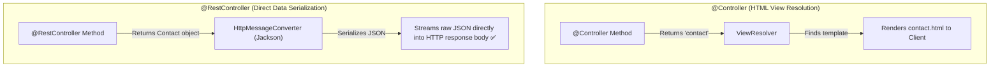
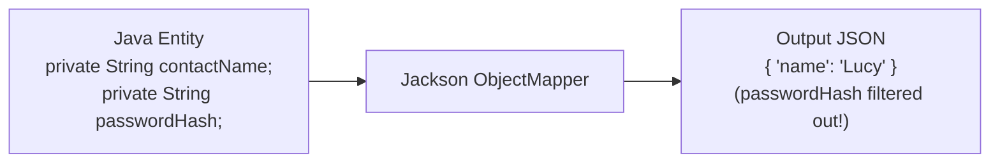
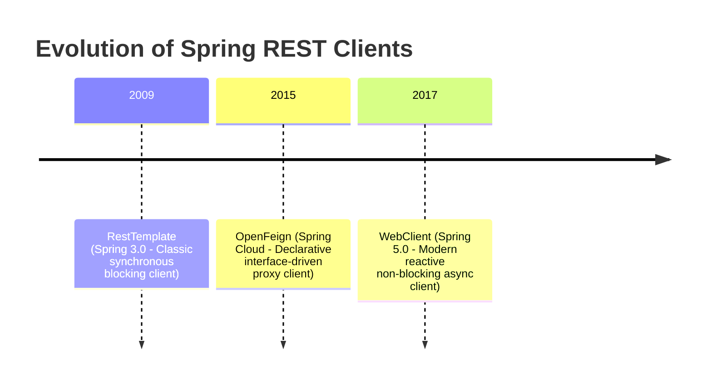
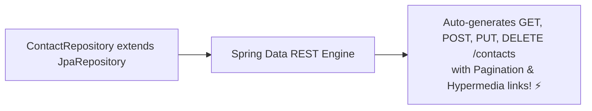
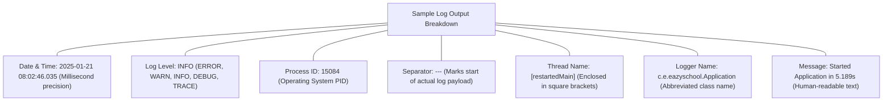
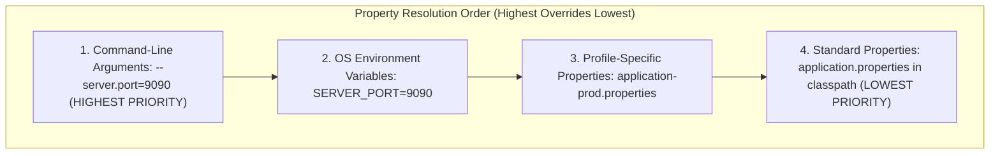
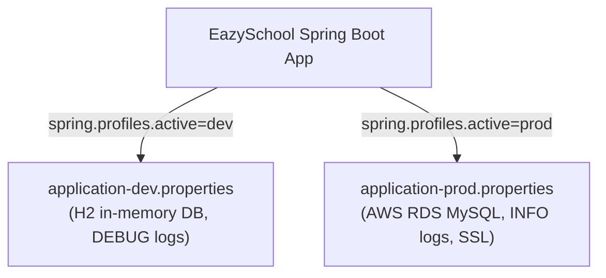

# 🚀 Spring REST, Microservices & Production Features — Complete Master Guide

> **Foundation**: Based on EazyBytes *Spring, SpringBoot, JPA, Hibernate: Zero to Master* (Slides 166–201).  
> **Core Philosophy**: Modern backend architectures rely on **REST APIs** for client-server decoupling and service-to-service communication. Enterprise readiness demands mastering **REST consumers (OpenFeign, WebClient)**, **HAL hypermedia**, robust **production logging (SLF4J/Logback)**, **multi-environment profiles**, and telemetry monitoring with **Spring Boot Actuator**.

---

## 📑 Table of Contents
- [1. Building REST APIs: `@RestController` vs. `@Controller`](#1-building-rest-apis-restcontroller-vs-controller)
- [2. JSON Serialization with Jackson Annotations](#2-json-serialization-with-jackson-annotations)
- [3. Consuming REST Services: OpenFeign vs. RestTemplate vs. WebClient](#3-consuming-rest-services-openfeign-vs-resttemplate-vs-webclient)
- [4. Spring Data REST & HAL Explorer](#4-spring-data-rest--hal-explorer)
- [5. Production Logging: SLF4J, Logback & Format Anatomy](#5-production-logging-slf4j-logback--format-anatomy)
- [6. Externalized Configuration & Property Hierarchy](#6-externalized-configuration--property-hierarchy)
- [7. Type-Safe Configuration with `@ConfigurationProperties`](#7-type-safe-configuration-with-configurationproperties)
- [8. Multi-Environment Spring Profiles (`@Profile`)](#8-multi-environment-spring-profiles-profile)
- [9. Spring Boot Actuator & Production Telemetry](#9-spring-boot-actuator--production-telemetry)
- [10. 1-Page Master Revision Cheat Sheet](#10-1-page-master-revision-cheat-sheet)

---

## 1. Building REST APIs: `@RestController` vs. `@Controller`

> 💡 **Quick Revision Anchor (2-3 Words)**: `ResponseBody Auto Bypasses View`

In standard Spring MVC web apps, controller methods return view names (`"home.html"`), which `DispatcherServlet` routes through a `ViewResolver`. In **REST APIs**, the server bypasses view rendering and streams raw data (JSON / XML) directly to the client:



### The Formula:
$$\mathbf{@RestController} = \mathbf{@Controller} + \mathbf{@ResponseBody}$$

```java
@RestController
@RequestMapping("/api/contacts")
public class ContactRestController {

    @Autowired
    private ContactRepository contactRepository;

    @GetMapping("/by-status")
    public ResponseEntity<List<Contact>> getContactsByStatus(
            @RequestParam(name = "status") String status,
            @RequestHeader(name = "User-Agent") String userAgent) {

        List<Contact> contacts = contactRepository.findByStatus(status);
        return ResponseEntity.ok()
                             .header("X-Custom-Header", "EazySchoolAPI")
                             .body(contacts);
    }
}
```

[⬆ Back to Top](#📑-table-of-contents)

---

## 2. JSON Serialization with Jackson Annotations

> 💡 **Quick Revision Anchor (2-3 Words)**: `Jackson Payload Control`

Spring Boot uses **Jackson** by default to serialize Java POJOs into JSON strings (and vice-versa). Use Jackson annotations to customize external payload representations:



### Core Jackson Annotations:
1. **`@JsonProperty("custom_name")`**: Maps a Java field name to a different JSON property key.
2. **`@JsonIgnore`**: Completely excludes a sensitive field (e.g., password hash) from serialization and deserialization.
3. **`@JsonIgnoreProperties({"createdAt", "updatedAt"})`**: Class-level annotation that filters out multiple fields at once.

```java
@Data
@JsonIgnoreProperties(ignoreUnknown = true)
public class UserDto {

    @JsonProperty("user_id")
    private int userId;

    @JsonProperty("full_name")
    private String fullName;

    @JsonIgnore // NEVER exposed in JSON response!
    private String password;

    @JsonProperty("contact_email")
    private String email;
}
```

[⬆ Back to Top](#📑-table-of-contents)

---

## 3. Consuming REST Services: OpenFeign vs. RestTemplate vs. WebClient

> 💡 **Quick Revision Anchor (2-3 Words)**: `REST Client Evolution`

When microservices or backend applications need to call external third-party APIs, Spring provides three primary client tools:



---

### Comparison of the 3 REST Clients:

| Dimension | OpenFeign | RestTemplate | WebClient |
| :--- | :--- | :--- | :--- |
| **Paradigm** | **Declarative Interface** | Imperative / Synchronous | Functional / Reactive / Non-Blocking |
| **Underlying Module** | `spring-cloud-starter-openfeign` | `spring-boot-starter-web` | `spring-boot-starter-webflux` |
| **Status in Spring** | Active & widely used in Spring Cloud. | **Maintenance Mode** (Deprecated in favor of WebClient / RestClient). | **Modern Standard** (Supports both Sync & Async). |
| **Thread Model** | 1 thread per request (Blocks). | 1 thread per request (Blocks). | Event-Loop non-blocking (Handles thousands of concurrent calls per thread). |

---

### Option 1: OpenFeign (Declarative Interface Proxy)
You write **only an interface** with Spring MVC annotations; OpenFeign generates the implementation proxy automatically:

```java
// 1. Declare the Feign Client Interface
@FeignClient(name = "contact-service", url = "http://localhost:8080/api/contact", configuration = FeignConfig.class)
public interface ContactProxy {

    @GetMapping("/messages")
    List<Contact> getMessagesByStatus(@RequestParam("status") String status);
}

// 2. Inject and call like a local Java bean!
@Service
public class DashboardService {
    @Autowired
    private ContactProxy contactProxy;

    public void loadDashboard() {
        List<Contact> openMsgs = contactProxy.getMessagesByStatus("OPEN");
    }
}
```

---

### Option 2: `RestTemplate` (Classic Synchronous Client)
```java
@Service
public class LegacyRestClient {

    @Autowired
    private RestTemplate restTemplate;

    public Contact fetchContact(int id) {
        String url = "http://localhost:8080/api/contact/{id}";
        return restTemplate.getForObject(url, Contact.class, id);
    }
}
```

---

### Option 3: `WebClient` (Modern Reactive & Non-Blocking)
```java
@Service
public class ModernRestClient {

    private final WebClient webClient;

    public ModernRestClient(WebClient.Builder builder) {
        this.webClient = builder.baseUrl("http://localhost:8080/api").build();
    }

    public Mono<Contact> fetchContactAsync(int id) {
        return webClient.get()
                        .uri("/contact/{id}", id)
                        .retrieve()
                        .bodyToMono(Contact.class); // Non-blocking reactive stream!
    }
}
```

[⬆ Back to Top](#📑-table-of-contents)

---

## 4. Spring Data REST & HAL Explorer

> 💡 **Quick Revision Anchor (2-3 Words)**: `Hypermedia REST AutoGen`

**Spring Data REST** automatically analyzes your Spring Data repositories and generates production-ready, HATEOAS-compliant REST endpoints **without writing a single Controller class**!

```xml
<dependency>
    <groupId>org.springframework.boot</groupId>
    <artifactId>spring-boot-starter-data-rest</artifactId>
</dependency>
<dependency>
    <groupId>org.springframework.data</groupId>
    <artifactId>spring-data-rest-hal-explorer</artifactId>
</dependency>
```



### 1. The HAL Explorer UI
Navigate to `http://localhost:8080/` in a browser. The **HAL (Hypertext Application Language) Explorer** provides an interactive web GUI to inspect, query, and test your repositories.

### 2. Customizing Paths:
In `application.properties`:
```properties
spring.data.rest.base-path=/data-api
```
On specific repositories:
```java
@RepositoryRestResource(path = "courses", collectionResourceRel = "courses")
public interface CourseRepository extends JpaRepository<Course, Integer> {}
```

[⬆ Back to Top](#📑-table-of-contents)

---

## 5. Production Logging: SLF4J, Logback & Format Anatomy

> 💡 **Quick Revision Anchor (2-3 Words)**: `Logback Severity Anatomy`

Spring Boot uses **SLF4J (Simple Logging Facade for Java)** as an abstraction layer backed by **Logback** as the default logging implementation.

---

### Anatomy of a Spring Boot Console Log Line:

```text
2025-01-21 08:02:46.035  INFO 15084 --- [restartedMain] c.e.eazyschool.EazyschoolApplication    : Started EazyschoolApplication in 5.189 seconds
```



---

### Log Severity Hierarchy:
$$\mathbf{TRACE} < \mathbf{DEBUG} < \mathbf{INFO} < \mathbf{WARN} < \mathbf{ERROR}$$
- Setting a level enables that level and **all higher severities**. (e.g., setting `INFO` logs `INFO`, `WARN`, and `ERROR`, but suppresses `DEBUG` and `TRACE`).

### Useful Logging Configurations (`application.properties`):
```properties
# Global log level
logging.level.root=INFO

# Package-specific log level
logging.level.com.eazyschool=DEBUG

# Enable ANSI colors in terminal
spring.output.ansi.enabled=ALWAYS

# Write logs to a persistent file
logging.file.name=logs/application.log
```

---

### Logging in Code via Lombok `@Slf4j`:
```java
@Service
@Slf4j // Injects: private static final org.slf4j.Logger log = LoggerFactory.getLogger(...)
public class PaymentService {

    public void processPayment(double amount) {
        log.info("Processing payment for amount: ${}", amount);
        try {
            // execute payment
        } catch (Exception ex) {
            log.error("Payment failed for amount: ${}, error: {}", amount, ex.getMessage(), ex);
        }
    }
}
```

[⬆ Back to Top](#📑-table-of-contents)

---

## 6. Externalized Configuration & Property Hierarchy

> 💡 **Quick Revision Anchor (2-3 Words)**: `Property Order Precedence`

Spring Boot allows externalizing configurations so the same packaged JAR can run seamlessly across Development, Staging, and Production environments without recompilation.



### Reading Properties in Code:

#### 1. `@Value` (Single Field Injection)
```java
@Component
public class DashboardController {
    @Value("${eazyschool.pageSize:10}") // 10 is default fallback if property is missing
    private int pageSize;

    @Value("${eazyschool.contact.successMsg}")
    private String successMessage;
}
```

#### 2. `Environment` Bean
```java
@Autowired
private Environment env;

public void printEnv() {
    String javaHome = env.getProperty("JAVA_HOME");
    String activeProfile = env.getProperty("spring.profiles.active");
}
```

[⬆ Back to Top](#📑-table-of-contents)

---

## 7. Type-Safe Configuration with `@ConfigurationProperties`

> 💡 **Quick Revision Anchor (2-3 Words)**: `Type-Safe Bean Binding`

Instead of littering dozens of individual `@Value` annotations across multiple classes, group related configurations into a single strongly-typed Java bean with **`@ConfigurationProperties`**:

### In `application.properties`:
```properties
eazyschool.page-size=10
eazyschool.contact.success-msg=Your message was submitted successfully!
eazyschool.branches[0]=NewYork
eazyschool.branches[1]=Delhi
eazyschool.branches[2]=Singapore
```

### The Configuration Bean:
```java
@Component
@ConfigurationProperties(prefix = "eazyschool")
@Validated // Supports Bean Validation!
@Data
public class EazySchoolProps {

    @Min(value = 5, message = "Page size must be at least 5")
    @Max(value = 50, message = "Page size cannot exceed 50")
    private int pageSize;

    private Map<String, String> contact;
    private List<String> branches;
}
```

### Advantages over `@Value`:
1. **Type-Safety & Autocompletion**: Full IDE autocomplete and validation for property keys.
2. **Supports Collections & Maps**: Effortlessly binds nested YAML/properties arrays and key-value maps.
3. **Supports Validation**: Can be annotated with `@Validated` and `@Min`, `@NotNull` to fail fast on invalid properties during startup!

[⬆ Back to Top](#📑-table-of-contents)

---

## 8. Multi-Environment Spring Profiles (`@Profile`)

> 💡 **Quick Revision Anchor (2-3 Words)**: `Multi-Environment Profiles`

Profiles provide a mechanism to segregate parts of your application configuration and make it available only in specific environments (`dev`, `uat`, `prod`).



---

### Activating Profiles:
1. In `application.properties`:
   ```properties
   spring.profiles.active=prod
   ```
2. Via Command-Line Argument:
   ```bash
   java -jar myApp.jar --spring.profiles.active=prod
   ```
3. Via OS Environment Variable:
   ```bash
   export SPRING_PROFILES_ACTIVE=prod
   ```

---

### Conditional Bean Creation with `@Profile`:
```java
// Registered ONLY in production
@Component
@Profile("prod")
public class AwsS3StorageService implements StorageService {
    // Stores files in cloud S3
}

// Registered in all environments EXCEPT production
@Component
@Profile("!prod")
public class LocalDiskStorageService implements StorageService {
    // Stores files on local /tmp directory
}
```

[⬆ Back to Top](#📑-table-of-contents)

---

## 9. Spring Boot Actuator & Production Telemetry

> 💡 **Quick Revision Anchor (2-3 Words)**: `Production Health Monitoring`

In a physical machine, an "actuator" controls mechanical parts. In Spring Boot, **Actuator** inspects and controls the inner workings of a running application in production:

```xml
<dependency>
    <groupId>org.springframework.boot</groupId>
    <artifactId>spring-boot-starter-actuator</artifactId>
</dependency>
```

### Exposing Endpoints (`application.properties`):
By default, only `/health` is exposed via web. To expose all endpoints in non-production environments:
```properties
management.endpoints.web.exposure.include=*
```

---

### Key Actuator Endpoints:

| Endpoint | HTTP Method | What It Exposes |
| :--- | :---: | :--- |
| **`/actuator/health`** | GET | Aggregate health status (`UP`, `DOWN`) of database, disk space, and message brokers. |
| **`/actuator/metrics`** | GET | JVM memory usage, garbage collection pauses, CPU load, active HTTP request rates. |
| **`/actuator/beans`** | GET | Complete list of all registered Spring beans in the `ApplicationContext`. |
| **`/actuator/env`** | GET | All active property sources, system environment variables, and active profiles. |
| **`/actuator/loggers`** | GET, POST | Inspect and **change logging levels dynamically at runtime** without restarting! |
| **`/actuator/mappings`** | GET | Complete catalog of all `@RequestMapping` paths and their handler methods. |
| **`/actuator/threaddump`** | GET | Generates thread dump to diagnose thread deadlocks or CPU spikes. |
| **`/actuator/heapdump`** | GET | Downloads gzip compressed JVM heap dump for OutOfMemoryError analysis. |

[⬆ Back to Top](#📑-table-of-contents)

---

## 10. 1-Page Master Revision Cheat Sheet

> 💡 **Quick Revision Anchor (2-3 Words)**: `Production REST Cheat Sheet`

| Feature | Key Concept | Production Rule |
| :--- | :--- | :--- |
| **`@RestController`** | `@Controller` + `@ResponseBody`. Bypasses ViewResolver. | Returns domain objects serialized into JSON via Jackson. |
| **REST Clients** | OpenFeign (Declarative) vs. WebClient (Reactive). | Use OpenFeign for microservice proxies; WebClient for async calls. |
| **Logging** | SLF4J facade with Logback implementation. | Use parameterized logging: `log.info("id: {}", id)`. |
| **Property Order** | CLI args > Environment variables > Properties file. | Never hardcode passwords in properties; pass via environment variables. |
| **`@ConfigurationProperties`**| Strongly-typed, validated object binding. | Prefer over `@Value` for hierarchical, multi-property configurations. |
| **Profiles** | Multi-environment config isolation. | Use `@Profile("prod")` to swap mocks for real infrastructure. |
| **Actuator** | Production-ready telemetry and health checks. | Secure endpoints with Spring Security; expose only `/health` publicly. |

[⬆ Back to Top](#📑-table-of-contents)
