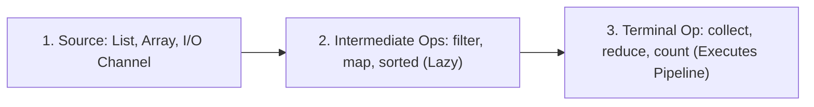

# 🌊 Java 8+ Stream API — Master Placement Guide

> **Core Philosophy**: A **Stream** is a sequence of elements supporting sequential and parallel aggregate operations. 
> Streams do **not store data** (unlike Collections)—they provide a functional, declarative pipeline to process, transform, and filter data with **lazy evaluation** and **short-circuit optimization**.

---

## 📑 Table of Contents
1. [Collections vs. Streams](#1-collections-vs-streams)
2. [Functional Interfaces Primer (`Predicate`, `Function`, `Consumer`, `Supplier`)](#2-functional-interfaces-primer)
3. [The Stream Pipeline Architecture](#3-the-stream-pipeline-architecture)
4. [Intermediate Operations (Lazy)](#4-intermediate-operations-lazy)
5. [Terminal Operations (Eager Execution)](#5-terminal-operations-eager-execution)
6. [Advanced Collectors (`groupingBy`, `partitioningBy`, `toMap`, `joining`)](#6-advanced-collectors)
7. [Parallel Streams & The ForkJoinPool](#7-parallel-streams--the-forkjoinpool)
8. [High-Frequency Placement Coding Patterns with Streams](#8-high-frequency-placement-coding-patterns)

---

## 1. Collections vs. Streams

| Feature | Java Collection (List, Set, Map) | Java 8+ Stream |
| :--- | :--- | :--- |
| **Data Storage** | Stores physical data elements in memory | **Does not store data**; operates on a source |
| **Modification** | Can add/remove elements | Does not modify the underlying data source |
| **Iteration** | **External Iteration** (for-each loops) | **Internal Iteration** (JVM optimizes traversal) |
| **Execution** | Eagerly evaluated | **Lazily evaluated** (Computed only when terminal op called) |
| **Reusability** | Traversed multiple times | **Single-use only** (Throws `IllegalStateException` if reused) |

---

## 2. Functional Interfaces Primer

Streams rely on standard `@FunctionalInterface` contracts from `java.util.function`:

| Functional Interface | Signature | Lambda Example | Stream Method Usage |
| :--- | :--- | :--- | :--- |
| **`Predicate<T>`** | `T -> boolean` | `x -> x > 10` | `.filter(Predicate)` |
| **`Function<T, R>`** | `T -> R` | `user -> user.getName()` | `.map(Function)` |
| **`Consumer<T>`** | `T -> void` | `x -> System.out.println(x)` | `.forEach(Consumer)` |
| **`Supplier<T>`** | `() -> T` | `() -> new ArrayList<>()` | `Stream.generate(Supplier)` |
| **`BinaryOperator<T>`** | `(T, T) -> T` | `(a, b) -> a + b` | `.reduce(BinaryOperator)` |

---

## 3. The Stream Pipeline Architecture

A stream pipeline consists of three distinct phases:



> [!IMPORTANT]
> **Lazy Evaluation**: Intermediate operations are **never executed** until a terminal operation is invoked. If no terminal operation is present, zero iterations occur!

---

## 4. Intermediate Operations (Lazy)

Intermediate operations return a new `Stream<T>` and can be chained:

### Core Methods:
- `.filter(Predicate<T>)`: Keeps only elements matching condition.
- `.map(Function<T, R>)`: Transforms element $T \rightarrow R$ (1-to-1 mapping).
- `.flatMap(Function<T, Stream<R>>)`: Flattens nested streams/lists (1-to-N mapping into single stream).
- `.distinct()`: Filters duplicates using `equals()` and `hashCode()`.
- `.sorted()` / `.sorted(Comparator<T>)`: Sorts elements in natural or custom order.
- `.limit(long n)`: Short-circuit truncation to first $n$ elements.
- `.skip(long n)`: Discards first $n$ elements.
- `.peek(Consumer<T>)`: Non-intrusive debug inspection.

### `map` vs `flatMap` Example:
```java
List<List<String>> nested = List.of(List.of("A", "B"), List.of("C", "D"));

// map returns Stream<List<String>>
// flatMap flattens into Stream<String>
List<String> flatList = nested.stream()
    .flatMap(Collection::stream)
    .toList(); // ["A", "B", "C", "D"]
```

---

## 5. Terminal Operations (Eager)

Terminal operations trigger the stream computation and produce a non-stream result (List, int, Object, or void).

### A. Reductions & Aggregations:
```java
// Reduce: Sum of elements
int sum = numbers.stream().reduce(0, (a, b) -> a + b);

// Min / Max with Comparator
Optional<Employee> maxSalaryEmp = employees.stream()
    .max(Comparator.comparingDouble(Employee::getSalary));
```

### B. Short-Circuit Matching:
- `.anyMatch(Predicate)`: Returns `true` if **at least 1** matches (Stops evaluating immediately).
- `.allMatch(Predicate)`: Returns `true` if **all** match.
- `.noneMatch(Predicate)`: Returns `true` if **none** match.
- `.findFirst()`: Returns `Optional<T>` containing first element.
- `.findAny()`: Returns `Optional<T>` (optimized for parallel streams).

---

## 6. Advanced Collectors

The `.collect(Collectors.xxx)` method is the most versatile terminal operation.

### A. Grouping By (Simulating SQL `GROUP BY`):
```java
// Group employees by department
Map<String, List<Employee>> byDept = employees.stream()
    .collect(Collectors.groupingBy(Employee::getDepartment));

// Count employees per department (GROUP BY dept, COUNT(*))
Map<String, Long> countByDept = employees.stream()
    .collect(Collectors.groupingBy(Employee::getDepartment, Collectors.counting()));

// Average salary per department
Map<String, Double> avgSalaryByDept = employees.stream()
    .collect(Collectors.groupingBy(
        Employee::getDepartment, 
        Collectors.averagingDouble(Employee::getSalary)
    ));
```

### B. Partitioning By (Splitting into 2 Boolean Groups):
```java
// Partition students into Passed (>= 40) vs Failed (< 40)
Map<Boolean, List<Student>> passedVsFailed = students.stream()
    .collect(Collectors.partitioningBy(s -> s.getMarks() >= 40));
```

### C. String Joining:
```java
String names = employees.stream()
    .map(Employee::getName)
    .collect(Collectors.joining(", ", "[", "]")); // "[Alice, Bob, Charlie]"
```

---

## 7. Parallel Streams & The ForkJoinPool

Parallel streams split data across multiple threads using the common `ForkJoinPool.commonPool()`:

```java
list.parallelStream()
    .filter(expensivePredicate)
    .collect(Collectors.toList());
```

> [!WARNING]
> **When NOT to use Parallel Streams**:
> - Small datasets (thread coordination overhead > sequential processing).
> - Operations with shared mutable state or blocking I/O calls (can exhaust common ForkJoinPool).
> - Operations sensitive to element order.

---

## 8. High-Frequency Placement Coding Patterns

### Pattern 1: Find 2nd Highest Number in an Array
```java
List<Integer> numbers = List.of(10, 50, 30, 90, 90, 70);

Integer secondHighest = numbers.stream()
    .distinct()
    .sorted(Comparator.reverseOrder())
    .skip(1)
    .findFirst()
    .orElseThrow(); // 70
```

### Pattern 2: Count Frequency of Each Character in a String
```java
String input = "banana";

Map<Character, Long> charCount = input.chars()
    .mapToObj(c -> (char) c)
    .collect(Collectors.groupingBy(Function.identity(), Collectors.counting()));
// {b=1, a=3, n=2}
```

### Pattern 3: Find First Non-Repeating Character
```java
String str = "swiss";

Character firstNonRepeat = str.chars()
    .mapToObj(c -> (char) c)
    .collect(Collectors.groupingBy(Function.identity(), LinkedHashMap::new, Collectors.counting()))
    .entrySet().stream()
    .filter(entry -> entry.getValue() == 1L)
    .map(Map.Entry::getKey)
    .findFirst()
    .orElse(null); // 'w'
```
