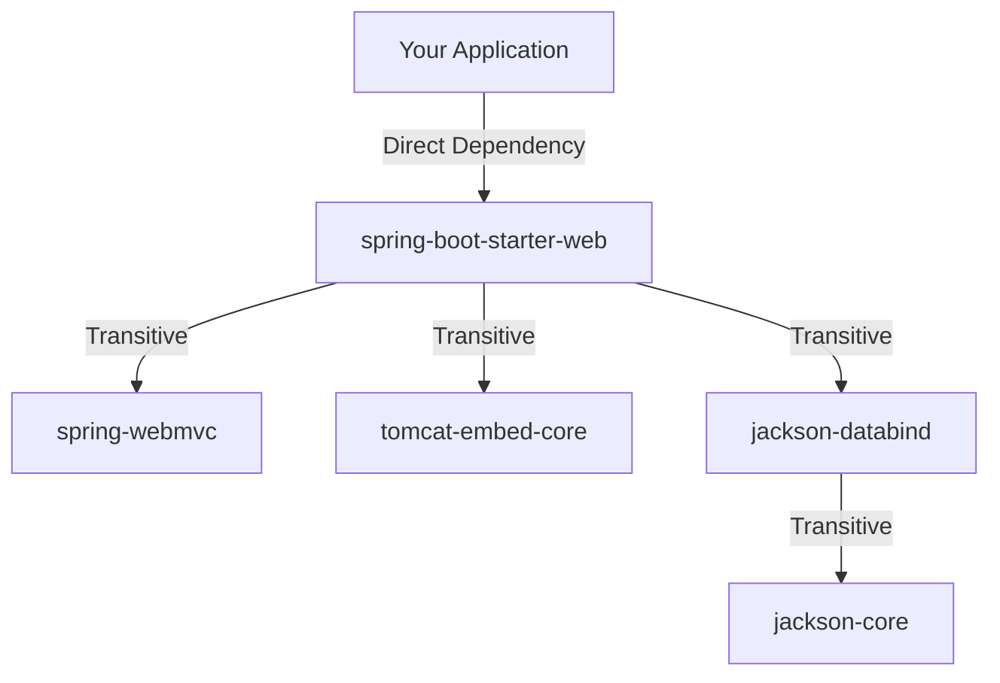
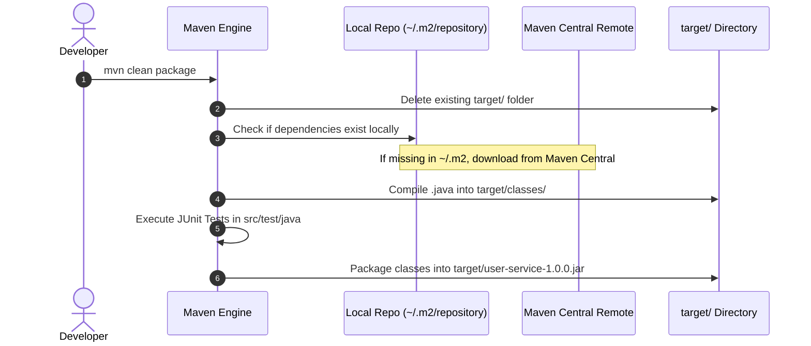

# 📦 Maven — Build Automation & Dependency Management

> **Core Philosophy**: **Maven** is a project management and build automation tool for Java applications. It standardizes the project folder layout, automatically resolves direct and transitive dependencies from central repositories, manages build lifecycles (`compile → test → package → install`), and packages runnable artifacts (`JAR` / `WAR`).

---

## 📑 Table of Contents
1. [Why Maven? (Problems with Manual JAR Management)](#1-why-maven)
2. [What is a JAR File? (Library vs. Application)](#2-what-is-a-jar-file)
3. [Direct & Transitive Dependency Resolution](#3-direct--transitive-dependency-resolution)
4. [Standard Maven Project Directory Layout](#4-standard-maven-project-directory-layout)
5. [The Project Object Model (`pom.xml`)](#5-the-project-object-model-pomxml)
6. [Compilation & Packaging Flow (The `target/` Directory)](#6-compilation--packaging-flow)
7. [The Standard Maven Build Lifecycle](#7-the-standard-maven-build-lifecycle)
8. [Placement Interview Questions & Quick Revision](#8-placement-interview-questions--quick-revision)

---

## 1. Why Maven?

### ❌ The Old Manual Way (Before Build Tools):
- Developers manually searched the web to download 25+ loose `.jar` files.
- Version conflicts between libraries (e.g., Spring 6 needing a newer Jackson version) caused runtime `ClassNotFoundException` / `NoSuchMethodError`.
- Sharing projects required emailing 500MB ZIP archives of JAR files.
- Manual compilation via command line (`javac -cp ...`).

### ✅ The Maven Solution:
```
Git Clone Repo  ──▶  Maven reads pom.xml  ──▶  Auto-downloads exact compatible JARs  ──▶  Compiles & Tests
```

---

## 2. What is a JAR File?

**JAR = Java Archive** (Compressed ZIP format with a `.jar` extension).

```
Project Source Files (.java) ──[javac]──▶ Bytecode (.class) ──[jar cvf]──▶ app.jar
```

A JAR file packages:
- Compiled `.class` bytecode
- Metadata (`META-INF/MANIFEST.MF`)
- Resource files (`application.properties`, `.xml`, `.json`)

### Library vs. Executable Application:

| Characteristic | Java Library (e.g., Jackson, Lombok) | Java Application (e.g., Spring Boot Service) |
| :--- | :--- | :--- |
| **Purpose** | Reusable utility code for other developers | Standalone runnable program |
| **`main()` Method** | ❌ No `public static void main` | ✅ Contains `main()` entrypoint |
| **Execution** | Cannot run on its own | Runs directly via `java -jar app.jar` |
| **Distribution** | Published to Maven Central as dependency | Deployed to servers / Docker containers |

---

## 3. Direct & Transitive Dependency Resolution

- **Direct Dependency**: A library explicitly declared in your `pom.xml` (e.g., `spring-boot-starter-web`).
- **Transitive Dependency**: A library that *your dependency* depends on.



> [!TIP]
> **Maven Dependency Mediation Rule**:  
> If two dependencies pull conflicting versions of the same library, Maven picks the **nearest definition in the dependency tree** (Dependency Tree Depth Rule).

---

## 4. Standard Maven Project Directory Layout

Maven enforces a strict **Convention over Configuration** directory structure:

```
my-app/
├── pom.xml                     # Master Project Object Model configuration
├── src/
│   ├── main/
│   │   ├── java/               # Production Java source code (.java)
│   │   │   └── com/app/
│   │   │       ├── Application.java
│   │   │       └── controller/
│   │   └── resources/          # Configuration & static assets
│   │       ├── application.properties
│   │       └── schema.sql
│   └── test/
│       └── java/               # Unit & integration tests (JUnit / Mockito)
│           └── com/app/
│               └── ApplicationTests.java
└── target/                     # Auto-generated build output (git-ignored)
    ├── classes/                # Compiled .class files
    └── my-app-1.0.0.jar        # Final deployable artifact
```

---

## 5. The Project Object Model (`pom.xml`)

The `pom.xml` file is the central blueprint of every Maven project:

```xml
<project xmlns="http://maven.apache.org/POM/4.0.0"
         xmlns:xsi="http://www.w3.org/2001/XMLSchema-instance"
         xsi:schemaLocation="http://maven.apache.org/POM/4.0.0 
         http://maven.apache.org/xsd/maven-4.0.0.xsd">
    <modelVersion>4.0.0</modelVersion>

    <!-- 1. GAV Coordinates (Unique Identifier) -->
    <groupId>com.company.project</groupId>
    <artifactId>user-service</artifactId>
    <version>1.0.0-SNAPSHOT</version>
    <packaging>jar</packaging>

    <properties>
        <java.version>17</java.version>
        <spring.boot.version>3.2.0</spring.boot.version>
    </properties>

    <!-- 2. Dependencies Block -->
    <dependencies>
        <dependency>
            <groupId>org.springframework.boot</groupId>
            <artifactId>spring-boot-starter-web</artifactId>
            <version>${spring.boot.version}</version>
        </dependency>
        
        <!-- Test Scope Dependency -->
        <dependency>
            <groupId>org.junit.jupiter</groupId>
            <artifactId>junit-jupiter-api</artifactId>
            <version>5.10.0</version>
            <scope>test</scope>
        </dependency>
    </dependencies>
</project>
```

### Dependency Scopes:
- `compile` (Default): Available in classpath for compilation, testing, and packaging.
- `provided`: Needed for compile/test, but runtime container provides it (e.g., `servlet-api`, `lombok`).
- `runtime`: Not needed for compilation, but required at runtime (e.g., JDBC drivers).
- `test`: Only available during test compilation and execution (e.g., `junit`, `mockito`).

---

## 6. Compilation & Packaging Flow



---

## 7. The Standard Maven Build Lifecycle

Maven operates through 3 built-in lifecycles: **Clean**, **Default (Build)**, and **Site**.

### The Default Build Lifecycle Phases (Executed in Strict Order):

```
validate ──▶ compile ──▶ test ──▶ package ──▶ verify ──▶ install ──▶ deploy
```

| Phase | Description |
| :--- | :--- |
| `validate` | Validates that project structure is correct and all `pom.xml` information is available. |
| `compile` | Compiles source code from `src/main/java` into `target/classes`. |
| `test` | Runs unit tests in `src/test/java` using test framework without packaging. |
| `package` | Packages compiled bytecode into distributeable format (`JAR` / `WAR`). |
| `verify` | Runs integration tests and checks quality metrics. |
| `install` | Copies the packaged JAR into **local repository** (`~/.m2/repository/`). |
| `deploy` | Uploads final JAR artifact to **remote repository** (Nexus / Artifactory). |

> [!NOTE]
> Running `mvn package` automatically triggers `validate → compile → test` before packaging.

---

## 8. Placement Interview Questions & Quick Revision

### Common Interview Q&A:

#### Q1: What is the difference between `mvn install` and `mvn package`?
- `mvn package`: Creates the `.jar` inside the local project's `target/` directory.
- `mvn install`: Creates the `.jar` AND copies it into the local machine's `~/.m2/repository/` cache so other local projects can reference it as a dependency.

#### Q2: What is the purpose of `<scope>provided</scope>`?
It tells Maven that this library is needed for compiling code, but should **NOT be bundled into the final packaged JAR** because the target deployment environment (e.g., Tomcat server or JDK) already provides it.

#### Q3: What is a Transitive Dependency and how do you exclude one?
A dependency of your dependency. It is excluded in `pom.xml` using the `<exclusions>` tag:
```xml
<dependency>
    <groupId>org.example</groupId>
    <artifactId>parent-lib</artifactId>
    <exclusions>
        <exclusion>
            <groupId>org.unwanted</groupId>
            <artifactId>vulnerable-lib</artifactId>
        </exclusion>
    </exclusions>
</dependency>
```

---

### 💡 1-Sentence Mental Anchors:
- **Maven**: *"Build automation & dependency management tool enforcing standard conventions."*
- **`pom.xml`**: *"Project blueprint defining GAV coordinates, dependencies, and plugins."*
- **`target/`**: *"Ephemeral output directory containing compiled `.class` and final `.jar` artifacts."*
- **Transitive Dependency**: *"Automatic recursive resolution of libraries required by dependencies."*
