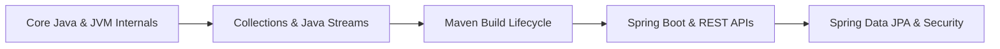

# ☕ Java & Spring Boot Ecosystem — Placement Hub

This directory contains full revision notes for the Java ecosystem, modern Java 8+ functional features, build systems, and Spring Boot enterprise development.

---

## 📑 Contents

| File | Type | Description |
|---|---|---|
| 📄 [java Programming.pdf](./java%20Programming.pdf) | Core Java PDF | Complete Core Java guide covering syntax, JVM architecture (Class Loader, Metaspace, Heap, Stack, PC Register), Garbage Collection algorithms, Multithreading & Synchronization, and Java Collections Framework. |
| 📝 [Java Streams.md](./Java%20Streams.md) | Markdown Notes | Deep dive into Java 8+ Streams API, Functional Interfaces (`Predicate`, `Consumer`, `Supplier`, `Function`), intermediate (`map`, `filter`, `flatMap`) and terminal (`collect`, `reduce`) operations, and parallel streams. |
| 📝 [Maven.md](./Maven.md) | Markdown Notes | Maven build lifecycles (`clean`, `default`, `site`), dependency management, scopes (`compile`, `provided`, `runtime`, `test`), plugins, and transitive dependency conflict resolution. |
| 📄 [Spring Boot Complete Notes.pdf](./Spring%20Boot%20Complete%20Notes.pdf) | Spring Boot PDF | Complete guide to Spring Core & Spring Boot: IoC & DI, Bean Scopes/Lifecycles, Annotations (`@Component`, `@RestController`, `@Autowired`), Spring Data JPA, Hibernate, `@Transactional`, Spring Security with JWT, and Actuator. |

---

## 🎯 Recommended Learning Path

