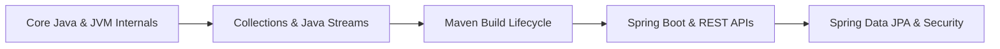

# ☕ Java & Spring Boot Ecosystem — Placement Hub

This directory contains full revision notes for the Java ecosystem, modern Java 8+ features, build systems, and Spring Boot enterprise development.

---

## 📂 Modules

### 1. ☕ [01-Core-Java/](./01-Core-Java/)
- 📄 **[java Programming.pdf](./01-Core-Java/java%20Programming.pdf)**: Comprehensive Core Java guide covering syntax, JVM architecture, Memory areas (Heap vs Stack vs Metaspace), ClassLoaders, Garbage Collection (GC algorithms), Multithreading, and Collections Framework.
- 📝 **[Java Streams.md](./01-Core-Java/Java%20Streams.md)**: Deep dive into the Java Stream API, Functional Interfaces (`Predicate`, `Function`, `Consumer`, `Supplier`), Lambda Expressions, Intermediate vs Terminal operations, `map()`, `flatMap()`, `filter()`, `reduce()`, and parallel streams.

### 2. 🛠️ [02-Build-Tools/](./02-Build-Tools/)
- 📝 **[Maven.md](./02-Build-Tools/Maven.md)**: Maven build lifecycles (`clean`, `default`, `site`), dependency management, scopes (`compile`, `provided`, `runtime`, `test`), plugins, transitive dependencies, and conflict resolution rules.

### 3. 🍃 [03-Spring-Boot/](./03-Spring-Boot/)
- 📄 **[Spring Boot Complete Notes.pdf](./03-Spring-Boot/Spring%20Boot%20Complete%20Notes.pdf)**: Complete guide to Spring Core & Spring Boot:
  - Inversion of Control (IoC) & Dependency Injection (DI)
  - Bean Lifecycles & Scopes (`Singleton`, `Prototype`, `Request`, `Session`)
  - Spring Annotations (`@Component`, `@Service`, `@Repository`, `@RestController`, `@Autowired`, `@Configuration`, `@Bean`)
  - Spring Data JPA, Hibernate, Entity Relationships (`@OneToMany`, `@ManyToOne`), Transaction Management (`@Transactional`)
  - Spring Security, JWT authentication, and Actuator monitoring.

---

## 🎯 Recommended Learning Path

