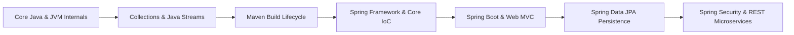

# ☕ Java & Spring Boot Ecosystem — Placement Hub

This directory contains comprehensive technical notes for the Java ecosystem, modern Java functional features, build systems, and complete Spring Boot enterprise engineering.

---

## 📑 Contents

### 🍃 Complete Modular Spring Boot Suite (EazyBytes Zero-to-Master Series)

| Module | Core Architecture & Topics |
| :--- | :--- |
| 1. [01-Spring-Framework-and-Core-IoC.md](./01-Spring-Framework-and-Core-IoC.md) | J2EE evolution, IoC & DI principles, Bean creation (`@Component` vs. `@Bean`), lifecycle (`@PostConstruct`, `@PreDestroy`), bean wiring, disambiguation (`@Primary`, `@Qualifier`), circular dependencies, bean scopes & race conditions, and Aspect-Oriented Programming (AOP). |
| 2. [02-Spring-Boot-and-Web-MVC.md](./02-Spring-Boot-and-Web-MVC.md) | Spring Boot internals, Auto-configuration, DevTools, Servlets & Tomcat, DispatcherServlet 7-step request lifecycle, `@RequestParam` vs `@PathVariable`, Thymeleaf, Project Lombok, declarative validation with `@Valid`, and custom constraint validators. |
| 3. [03-Data-Persistence-Spring-Data-JPA.md](./03-Data-Persistence-Spring-Data-JPA.md) | Core JDBC limitations, Spring `JdbcTemplate` & `NamedParameterJdbcTemplate`, H2 database, ORM/JPA foundations, Spring Data repository hierarchy, derived queries, JPA auditing, relationships (`@OneToOne`, `@OneToMany`, `@ManyToOne`, `@ManyToMany`), fetch types (`LAZY` vs `EAGER`), cascades, and pagination. |
| 4. [04-Spring-Security-and-Authentication.md](./04-Spring-Security-and-Authentication.md) | Authentication vs. Authorization (401 vs 403), `SecurityFilterChain`, `permitAll()` vs `denyAll()`, endpoint matchers, custom `AuthenticationProvider`, password hashing (BCrypt), CSRF attack mechanics & synchronizer tokens, and CORS configuration. |
| 5. [05-Spring-REST-Microservices-and-Production.md](./05-Spring-REST-Microservices-and-Production.md) | Building REST services (`@RestController`), Jackson annotations, consuming REST APIs (**OpenFeign**, **RestTemplate**, **WebClient**), Spring Data REST & HAL Explorer, production logging (SLF4J/Logback), externalized properties, Spring Profiles, and Spring Boot Actuator. |

---

### 📚 Placement Interview Guides & Ecosystem Notes

| File | Type | Description |
| :--- | :--- | :--- |
| 🍃 [Spring Boot Interview Guide.md](./Spring%20Boot%20Interview%20Guide.md) | Placement Master Guide | Comprehensive 33-section placement guide curated from The Curious Coder series and high-yield interview deep dives. |
| ⚡ [Java Streams.md](./Java%20Streams.md) | Markdown Notes | Deep dive into Java 8+ Streams API, Functional Interfaces (Predicate, Consumer, Supplier, Function), intermediate (`map`, `filter`, `flatMap`) and terminal (`collect`, `reduce`) operations, and parallel streams. |
| 🛠️ [Maven.md](./Maven.md) | Markdown Notes | Maven build lifecycles (`clean`, `default`, `site`), dependency management, scopes (`compile`, `provided`, `runtime`, `test`), plugins, and transitive dependency conflict resolution. |
| 📄 [Spring Boot Complete Notes.pdf](./Spring%20Boot%20Complete%20Notes.pdf) | Slide Deck PDF | 202-slide visual reference from EazyBytes: Zero to Master. |
| 📄 [java Programming.pdf](./java%20Programming.pdf) | Core Java PDF | Core Java reference covering JVM architecture, memory model, GC, and Collections. |

---

## 🚀 Recommended Learning Path

