# 🍃 Spring Boot — Complete Placement & Technical Interview Master Guide

> **Target Audience**: Fresher / Entry-Level Java Backend Engineers, SWE / SDE Candidates.  
> **Source Foundation**: Curated from *The Curious Coder* Java Spring Boot Interview Series + High-Yield Placement Deep Dives.  
> **Core Focus**: High-yield concepts, clean visual execution diagrams (Mermaid), intuitive Java 17 / Spring Boot 3 code, 2-3 word memory hooks, and equal coverage across all 31 core playlist topics and beyond-the-playlist essentials.

---

## 📑 Table of Contents

- [1. Inversion of Control (IoC), Dependency Injection (DI) & Bean Lifecycle](#1-inversion-of-control-ioc-dependency-injection-di--bean-lifecycle)
- [2. `@RestController` vs. `@Controller` (Content Negotiation & ResponseBody)](#2-restcontroller-vs-controller-content-negotiation--responsebody)
- [3. Stereotype Annotations: `@RestController` vs. `@Service` vs. `@Repository` vs. `@Component`](#3-stereotype-annotations-restcontroller-vs-service-vs-repository-vs-component)
- [4. Spring Boot & Starters (Auto-Configuration Internals)](#4-spring-boot--starters-auto-configuration-internals)
- [5. Spring Framework vs. Spring Boot](#5-spring-framework-vs-spring-boot)
- [6. `@SpringBootApplication` Internals & Condition Evaluation](#6-springbootapplication-internals--condition-evaluation)
- [7. Spring Boot Actuator (Custom Health Indicators & Metrics)](#7-spring-boot-actuator-custom-health-indicators--metrics)
- [8. Global Exception Handling (`@RestControllerAdvice`)](#8-global-exception-handling-restcontrolleradvice)
- [9. Project Lombok in Spring Boot (Best Practices & JPA Traps)](#9-project-lombok-in-spring-boot-best-practices--jpa-traps)
- [10. Spring Bean Scopes & Thread-Safety](#10-spring-bean-scopes--thread-safety)
- [11. Request Scope vs. Session Scope (Scoped Proxies)](#11-request-scope-vs-session-scope-scoped-proxies)
- [12. Spring Profiles (Multi-Environment Setup)](#12-spring-profiles-multi-environment-setup)
- [13. `application.properties` vs. `application.yaml` & Configuration Precedence](#13-applicationproperties-vs-applicationyaml--configuration-precedence)
- [14. Property Injection: `@Value` vs. `@ConfigurationProperties` vs. `Environment`](#14-property-injection-value-vs-configurationproperties-vs-environment)
- [15. Persistence Stack: JDBC vs. Hibernate vs. JPA vs. Spring Data JPA](#15-persistence-stack-jdbc-vs-hibernate-vs-jpa-vs-spring-data-jpa)
- [16. `@Transactional` Mechanics (AOP Proxies & Self-Invocation Trap)](#16-transactional-mechanics-aop-proxies--self-invocation-trap)
- [17. Transaction Propagation (All 7 Levels Explained)](#17-transaction-propagation-all-7-levels-explained)
- [18. Bean Disambiguation: `@Primary` vs. `@Qualifier`](#18-bean-disambiguation-primary-vs-qualifier)
- [19. Injection Types: Constructor vs. Setter vs. Field Injection](#19-injection-types-constructor-vs-setter-vs-field-injection)
- [20. `@Lookup` Annotation (Singleton with Prototype Dependency)](#20-lookup-annotation-singleton-with-prototype-dependency)
- [21. Servlet Filters vs. Spring MVC Interceptors](#21-servlet-filters-vs-spring-mvc-interceptors)
- [22. Cyclic Dependencies, `@Lazy` & Architectural Decoupling](#22-cyclic-dependencies-lazy--architectural-decoupling)
- [23. `@PathVariable` vs. `@RequestParam`](#23-pathvariable-vs-requestparam)
- [24. `ResponseEntity<T>` & HTTP Response Customization](#24-responseentityt--http-response-customization)
- [25. `DispatcherServlet` & Spring MVC Request Flow](#25-dispatcherservlet--spring-mvc-request-flow)
- [26. Pagination & Sorting in Spring Data JPA](#26-pagination--sorting-in-spring-data-jpa)
- [27. Object Mapping with MapStruct & DTO Pattern](#27-object-mapping-with-mapstruct--dto-pattern)
- [28. Core Spring Boot Annotations Quick Reference](#28-core-spring-boot-annotations-quick-reference)
- [29. Input Validation (`@Valid`)](#29-input-validation-valid)
- [30. Rapid-Fire Interview Questions & Answers](#30-rapid-fire-interview-questions--answers)
- [31. End-to-End Project Explanation Framework](#31-end-to-end-project-explanation-framework)
- [32. High-Yield Topics Beyond the Playlist](#32-high-yield-topics-beyond-the-playlist)
  - [A. Spring Security & Stateless JWT Authentication](#a-spring-security--stateless-jwt-authentication)
  - [B. JPA Relationships (`@OneToMany`, `@ManyToOne`) & Cascade Rules](#b-jpa-relationships-onetomany-manytoone--cascade-rules)
  - [C. Fetch Types: LAZY vs. EAGER & The N+1 Query Problem](#c-fetch-types-lazy-vs-eager--the-n1-query-problem)
  - [D. REST API Design & HTTP Idempotency](#d-rest-api-design--http-idempotency)
  - [E. SQL & DBMS Essentials for Java Backend Interviews](#e-sql--dbms-essentials-for-java-backend-interviews)
  - [F. Automated Testing with JUnit 5 & Mockito](#f-automated-testing-with-junit-5--mockito)
  - [G. Maven Build Lifecycle & Dependency Scopes](#g-maven-build-lifecycle--dependency-scopes)
- [33. 1-Page Master Revision Cheat Sheet](#33-1-page-master-revision-cheat-sheet)

---

## 1. Inversion of Control (IoC), Dependency Injection (DI) & Bean Lifecycle

> 💡 **Quick Revision Anchor (2-3 Words)**: `Spring Controls Objects`

### What is IoC (Inversion of Control)?
In traditional Java programming, if class `OrderService` needs `PaymentService`, it creates it directly using `new`:
```java
// Traditional Java: Tight coupling (OrderService controls creation)
class OrderService {
    private PaymentService paymentService = new PaymentService(); 
}
```
**Inversion of Control (IoC)** is an architectural principle where control over object creation, configuration, and lifecycle management is transferred from application code to an external container—the **Spring IoC Container**.

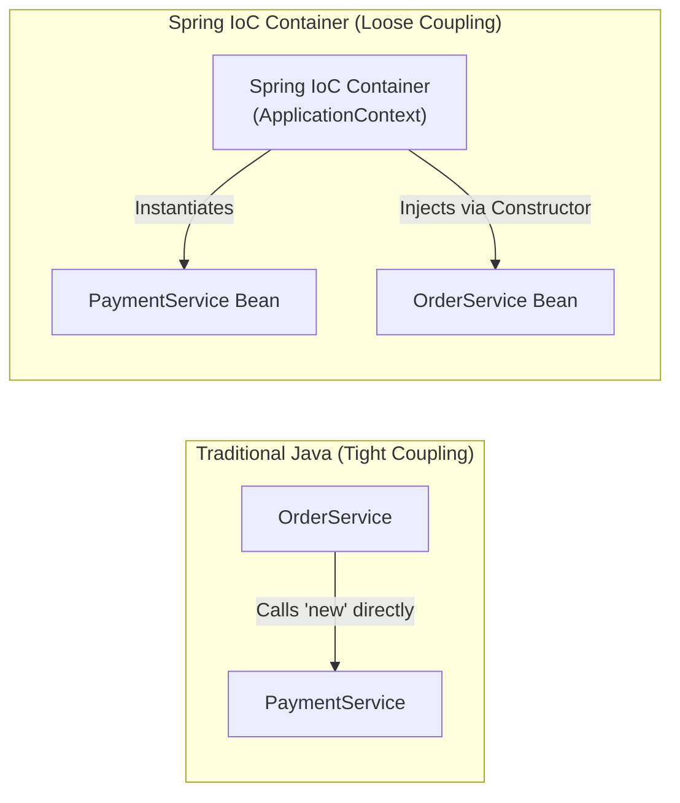

### What is Dependency Injection (DI)?
**Dependency Injection** is the design pattern used to implement IoC. Instead of an object searching for or instantiating its dependencies, Spring **injects** them at runtime.

```java
// Spring IoC: Loose coupling via Constructor Injection
@Service
public class OrderService {
    private final PaymentService paymentService;

    public OrderService(PaymentService paymentService) {
        this.paymentService = paymentService; // Injected by Spring automatically
    }
}
```

### `BeanFactory` vs. `ApplicationContext`

| Feature | `BeanFactory` | `ApplicationContext` |
|---|---|---|
| **Instantiation** | **Lazy** (Creates beans only when `getBean()` is called). | **Eager** (Singletons pre-instantiated at startup). |
| **Enterprise Features** | Basic dependency injection only. | Events, AOP, i18n messages, Profiles, Web context. |
| **Usage** | Memory-constrained legacy devices. | **Standard in all modern Spring Boot apps.** |

---

### Spring Bean Lifecycle
Understanding what happens from bean discovery to destruction:

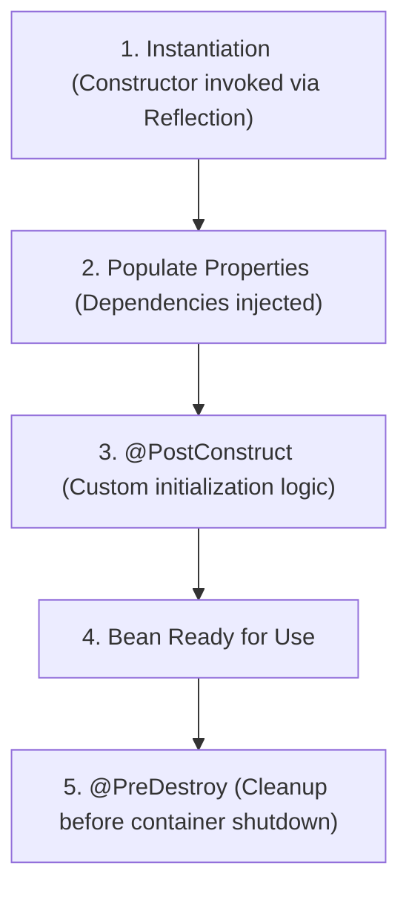

```java
@Component
public class DatabaseConnector {

    public DatabaseConnector() {
        System.out.println("1. Bean constructor called");
    }

    @PostConstruct
    public void init() {
        System.out.println("2. @PostConstruct: Connection pool initialized");
    }

    @PreDestroy
    public void cleanup() {
        System.out.println("3. @PreDestroy: Database connections closed");
    }
}
```

[⬆ Back to Top](#📑-table-of-contents)

---

## 2. `@RestController` vs. `@Controller` (Content Negotiation & ResponseBody)

> 💡 **Quick Revision Anchor (2-3 Words)**: `JSON vs HTML-Views`

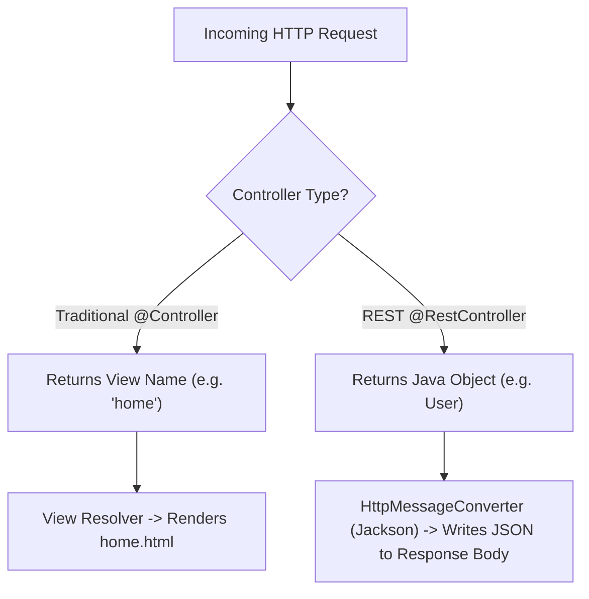

### Comparison Matrix

| Dimension | `@Controller` | `@RestController` |
|---|---|---|
| **Primary Purpose** | Traditional MVC apps returning HTML web pages. | RESTful APIs returning raw data (JSON / XML). |
| **Return Value** | Resolved by `ViewResolver` to a view template. | Written directly to the **HTTP response body**. |
| **Formula** | Base stereotype. | `@RestController = @Controller + @ResponseBody` |
| **Returning JSON?** | Requires explicit `@ResponseBody` on each method. | Automatically enabled for **all** methods. |

[⬆ Back to Top](#📑-table-of-contents)

---

## 3. Stereotype Annotations: `@RestController` vs. `@Service` vs. `@Repository` vs. `@Component`

> 💡 **Quick Revision Anchor (2-3 Words)**: `Layered Component Roles`

All four annotations tell Spring: *"Manage this class as a Spring Bean."* Using specific stereotypes provides architectural clarity and enables specialized framework features:

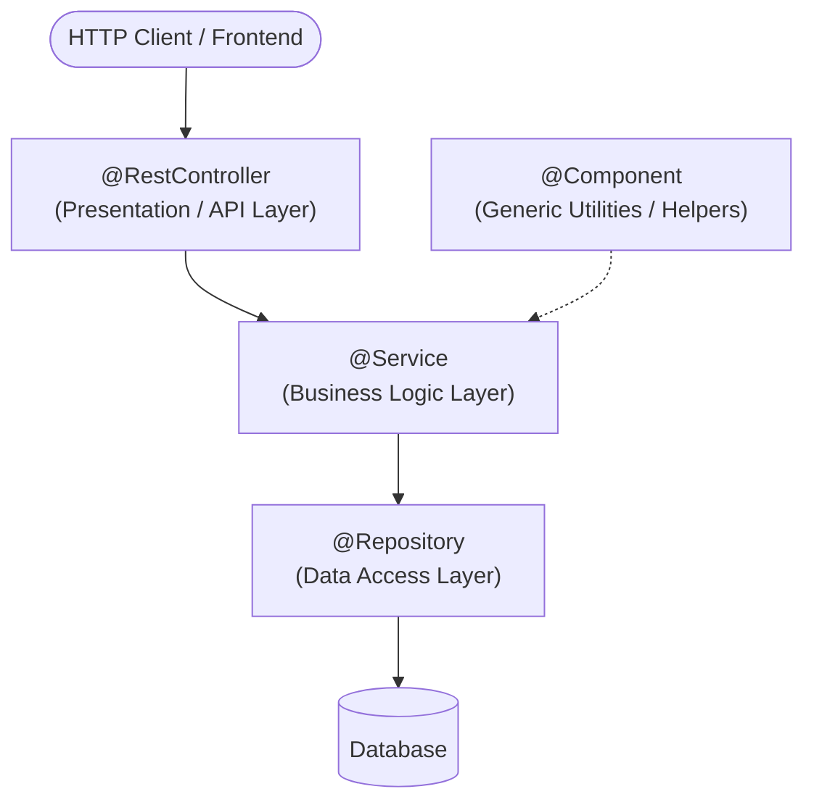

| Annotation | Layer | Special Framework Behavior |
|---|---|---|
| **`@RestController`** | Presentation / API Layer | Combines `@Controller` and `@ResponseBody`. Converts return objects to JSON. |
| **`@Service`** | Business Logic Layer | Communicates business intent; common target for `@Transactional` boundaries. |
| **`@Repository`** | Data Access Layer | Automatically translates low-level SQL exceptions into Spring's unified `DataAccessException`. |
| **`@Component`** | Generic Utility Layer | Generic stereotype for helper utilities, background tasks, or custom security filters. |

> [!TIP]
> **Placement Question**: *"Why not just use `@Component` everywhere?"*  
> **Answer**: *"Using specific stereotypes clarifies architecture and enables layer-specific features, such as automatic exception translation with `@Repository`."*

[⬆ Back to Top](#📑-table-of-contents)

---

## 4. Spring Boot & Starters (Auto-Configuration Internals)

> 💡 **Quick Revision Anchor (2-3 Words)**: `Curated Dependency Bundles`

### What is Spring Boot?
Spring Boot simplifies Spring development through four key features:
1. **Auto-Configuration**: Guesses configuration based on JAR dependencies found on the classpath.
2. **Starter Dependencies**: Curated dependency aggregators that eliminate version mismatches.
3. **Embedded Web Servers**: Tomcat, Jetty, or Undertow built directly inside the JAR.
4. **Production Actuator**: Built-in endpoints for health monitoring and metrics.

### What is a Starter?
A **Starter** is a convenient dependency descriptor (`pom.xml`) bundling all compatible libraries needed for a specific capability:

```xml
<!-- Brings in Spring MVC, Jackson JSON, and Embedded Tomcat -->
<dependency>
    <groupId>org.springframework.boot</groupId>
    <artifactId>spring-boot-starter-web</artifactId>
</dependency>

<!-- Brings in Hibernate, Spring Data JPA, and HikariCP Connection Pool -->
<dependency>
    <groupId>org.springframework.boot</groupId>
    <artifactId>spring-boot-starter-data-jpa</artifactId>
</dependency>
```

[⬆ Back to Top](#📑-table-of-contents)

---

## 5. Spring Framework vs. Spring Boot

> 💡 **Quick Revision Anchor (2-3 Words)**: `Core vs Automated`

| Dimension | Spring Framework | Spring Boot |
|---|---|---|
| **Configuration** | Heavy boilerplate (XML files or extensive `@Configuration` classes). | Opinionated auto-configuration ("convention over configuration"). |
| **Deployment** | Packaged as `.war` and deployed to an external application server (Tomcat/JBoss). | Standalone executable `.jar` with an **embedded server** (`java -jar app.jar`). |
| **Dependencies** | Manual artifact version specification and conflict resolution. | **Starters** manage coordinated, tested dependency versions automatically. |
| **Production Tools** | Manual integration required for health checks and metrics. | **Actuator** provides production health endpoints out-of-the-box. |

[⬆ Back to Top](#📑-table-of-contents)

---

## 6. `@SpringBootApplication` Internals & Condition Evaluation

> 💡 **Quick Revision Anchor (2-3 Words)**: `Three-in-One Bootstrap`

The entry point of every Spring Boot app is annotated with `@SpringBootApplication`:
```java
@SpringBootApplication
public class Application {
    public static void main(String[] args) {
        SpringApplication.run(Application.class, args);
    }
}
```

`@SpringBootApplication` is a meta-annotation that bundles **three essential annotations**:

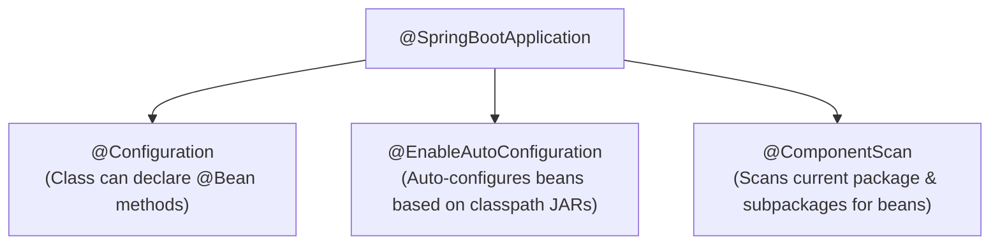

- **`@Configuration`**: Allows defining `@Bean` factory methods.
- **`@EnableAutoConfiguration`**: Configures beans based on classpath libraries.
- **`@ComponentScan`**: Scans the current package and its subpackages for `@Component`, `@Service`, `@Repository`, and `@RestController`.

[⬆ Back to Top](#📑-table-of-contents)

---

## 7. Spring Boot Actuator (Custom Health Indicators & Metrics)

> 💡 **Quick Revision Anchor (2-3 Words)**: `Production Health Monitoring`

Spring Boot Actuator provides built-in HTTP endpoints to monitor and manage application health and metrics in production:

```xml
<dependency>
    <groupId>org.springframework.boot</groupId>
    <artifactId>spring-boot-starter-actuator</artifactId>
</dependency>
```

- **`/actuator/health`**: Shows application status (`{"status": "UP"}`).
- **`/actuator/metrics`**: Displays JVM memory, threads, and garbage collection stats.
- **`/actuator/info`**: Exposes application build/version details.

```properties
# Expose endpoints in application.properties
management.endpoints.web.exposure.include=health,info,metrics
management.endpoint.health.show-details=always
```

### Writing a Custom Health Indicator
```java
@Component
public class DatabaseHealthIndicator implements HealthIndicator {
    @Override
    public Health health() {
        boolean isDbUp = checkDatabaseConnection();
        if (isDbUp) {
            return Health.up().withDetail("database", "PostgreSQL is reachable").build();
        }
        return Health.down().withDetail("database", "Database connection failed").build();
    }

    private boolean checkDatabaseConnection() {
        return true; // database ping logic
    }
}
```

[⬆ Back to Top](#📑-table-of-contents)

---

## 8. Global Exception Handling (`@RestControllerAdvice`)

> 💡 **Quick Revision Anchor (2-3 Words)**: `Centralized Error Interceptor`

Without centralized exception handling, controllers end up cluttered with repetitive `try-catch` blocks. Spring provides `@RestControllerAdvice` and `@ExceptionHandler` to intercept exceptions across all controllers cleanly.

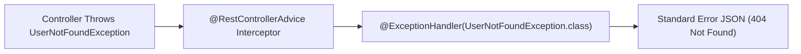

### Production Implementation
```java
// 1. Custom Business Exception
public class UserNotFoundException extends RuntimeException {
    public UserNotFoundException(String message) {
        super(message);
    }
}

// 2. Structured Error Response DTO
public record ErrorResponse(
    LocalDateTime timestamp,
    int status,
    String error,
    String message,
    String path
) {}

// 3. Centralized Controller Advice
@RestControllerAdvice
public class GlobalExceptionHandler {

    @ExceptionHandler(UserNotFoundException.class)
    public ResponseEntity<ErrorResponse> handleUserNotFound(UserNotFoundException ex, HttpServletRequest request) {
        ErrorResponse error = new ErrorResponse(
            LocalDateTime.now(),
            HttpStatus.NOT_FOUND.value(),
            "Not Found",
            ex.getMessage(),
            request.getRequestURI()
        );
        return new ResponseEntity<>(error, HttpStatus.NOT_FOUND);
    }

    @ExceptionHandler(Exception.class)
    public ResponseEntity<ErrorResponse> handleGenericException(Exception ex, HttpServletRequest request) {
        ErrorResponse error = new ErrorResponse(
            LocalDateTime.now(),
            HttpStatus.INTERNAL_SERVER_ERROR.value(),
            "Internal Server Error",
            "An unexpected error occurred",
            request.getRequestURI()
        );
        return new ResponseEntity<>(error, HttpStatus.INTERNAL_SERVER_ERROR);
    }
}
```

[⬆ Back to Top](#📑-table-of-contents)

---

## 9. Project Lombok in Spring Boot (Best Practices & JPA Traps)

> 💡 **Quick Revision Anchor (2-3 Words)**: `Boilerplate Code Reducer`

Lombok uses compile-time annotations to automatically generate getters, setters, constructors, builders, and `toString` methods:

- **`@Getter` / `@Setter`**: Generates getters and setters for fields.
- **`@NoArgsConstructor`**: Generates a no-args constructor (required by Hibernate/JPA).
- **`@AllArgsConstructor`**: Generates a constructor with all fields.
- **`@RequiredArgsConstructor`**: Generates a constructor for `final` fields (ideal for Constructor Injection).
- **`@Slf4j`**: Injects a thread-safe `log` instance (`LoggerFactory.getLogger(...)`).

```java
@Service
@RequiredArgsConstructor // Automatically creates constructor for final fields!
public class UserService {
    private final UserRepository userRepository; // Injected without manual constructor!
}
```

> [!WARNING]
> **Placement Trap: Avoid `@Data` on JPA Entities!**  
> 1. `@Data` generates `equals()` and `hashCode()` on all fields, which breaks entity identity in sets (`HashSet`) before primary keys are generated.
> 2. `@Data` generates `toString()` which accesses bidirectional relationships (e.g., `User -> Order -> User`), causing an immediate **`StackOverflowError`**.  
> **Solution**: Use `@Getter`, `@Setter`, and `@NoArgsConstructor` on JPA entities instead.

[⬆ Back to Top](#📑-table-of-contents)

---

## 10. Spring Bean Scopes & Thread-Safety

> 💡 **Quick Revision Anchor (2-3 Words)**: `Bean Lifecycle Duration`

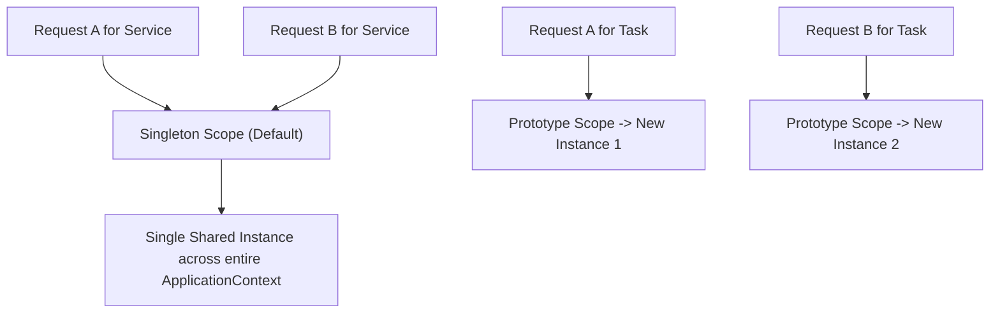

| Scope | Description | Common Use Case |
|---|---|---|
| **`singleton`** *(Default)* | Exactly **one** instance created per Spring container. Shared across all callers. | Stateless services (`@Service`), controllers, repositories. |
| **`prototype`** | A **new** instance is created each time the bean is requested. | Stateful objects or batch tasks. |
| **`request`** | One instance per HTTP request lifecycle. | User request tracing, audit logging. |
| **`session`** | One instance per HTTP session. | User login session, shopping carts. |

### Is a Singleton Bean Thread-Safe?
**NO!** Spring provides a single shared instance, but does **not** ensure thread safety. Multiple Tomcat worker threads execute bean methods concurrently.  
**Golden Rule**: Spring singleton beans must be **stateless**. Never store mutable state in class variables!

[⬆ Back to Top](#📑-table-of-contents)

---

## 11. Request Scope vs. Session Scope (Scoped Proxies)

> 💡 **Quick Revision Anchor (2-3 Words)**: `Per-Request vs Per-User`

Both scopes exist strictly inside web-aware Spring contexts:

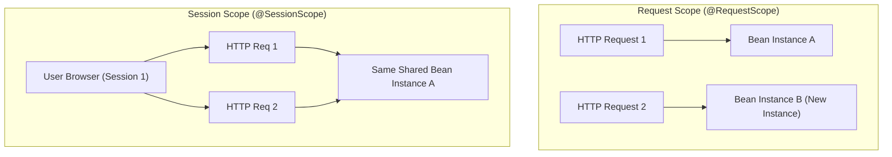

### The Scoped Proxy
*"If a Singleton Service starts at boot time, how can it inject a Request-Scoped bean that doesn't exist yet?"*  
**Answer**: Spring injects a **Scoped Proxy** (`proxyMode = ScopedProxyMode.TARGET_CLASS`). At runtime, when the singleton calls the proxy, the proxy delegates to the active HTTP request bean.

```java
@Component
@Scope(value = WebApplicationContext.SCOPE_REQUEST, proxyMode = ScopedProxyMode.TARGET_CLASS)
public class UserRequestContext {
    private String tenantId;
    // getters and setters
}
```

[⬆ Back to Top](#📑-table-of-contents)

---

## 12. Spring Profiles (Multi-Environment Setup)

> 💡 **Quick Revision Anchor (2-3 Words)**: `Environment-Specific Config`

Profiles let you segregate configuration across environments (e.g., `dev`, `test`, `prod`) without modifying code:

- `application.properties`: Common default configuration.
- `application-dev.properties`: Development settings (H2 in-memory DB, debug logs).
- `application-prod.properties`: Production settings (PostgreSQL, production credentials).

### Activating Profiles:
1. In `application.properties`: `spring.profiles.active=dev`
2. Via CLI argument: `java -jar app.jar --spring.profiles.active=prod`
3. Via OS Environment Variable: `export SPRING_PROFILES_ACTIVE=prod`

[⬆ Back to Top](#📑-table-of-contents)

---

## 13. `application.properties` vs. `application.yaml` & Configuration Precedence

> 💡 **Quick Revision Anchor (2-3 Words)**: `Hierarchy & Precedence`

### Format Comparison:
- **`application.properties`**: Flat key-value format (`server.port=8080`).
- **`application.yaml`**: Hierarchical tree structure. Clean and readable for nested configuration.

### Configuration Precedence (Highest to Lowest):
1. **Command line arguments** (`--server.port=9090`)
2. **Java System Properties** (`-Dserver.port=9090`)
3. **OS Environment Variables** (`SERVER_PORT=9090`)
4. **Profile-specific properties outside packaged jar**
5. **Profile-specific properties inside jar** (`application-prod.properties`)
6. **Default application properties inside jar** (`application.properties`)

[⬆ Back to Top](#📑-table-of-contents)

---

## 14. Property Injection: `@Value` vs. `@ConfigurationProperties` vs. `Environment`

> 💡 **Quick Revision Anchor (2-3 Words)**: `Injecting Config Values`

| Approach | Best Use Case | Type Safety | Relaxed Binding |
|---|---|---|---|
| **`@Value`** | Injecting 1 or 2 isolated properties. | ❌ No (String-based) | ❌ No |
| **`@ConfigurationProperties`** | Grouping a related tree of properties into a POJO. | ✅ Full Type Safety | ✅ Yes (camelCase, kebab-case) |
| **`Environment`** | Programmatically querying properties dynamically. | ❌ Manual casting | ❌ No |

### Code Comparison:
```java
// 1. @Value for simple single properties
@Component
public class AppConfig {
    @Value("${app.timeout:5000}") // 5000 is default fallback
    private int timeout;
}

// 2. @ConfigurationProperties for structured configuration
@ConfigurationProperties(prefix = "app.mail")
@Component
public record MailProperties(String host, int port, String username) {}
```

[⬆ Back to Top](#📑-table-of-contents)

---

## 15. Persistence Stack: JDBC vs. Hibernate vs. JPA vs. Spring Data JPA

> 💡 **Quick Revision Anchor (2-3 Words)**: `Database Abstraction Layers`

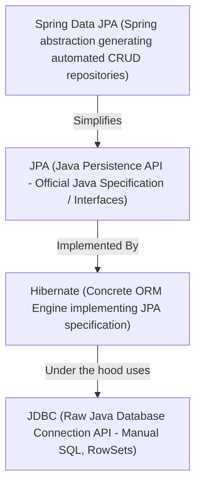

### First-Level Cache & Dirty Checking
1. **First-Level Cache**: Every Hibernate `Session` acts as a cache. Querying `userRepository.findById(1L)` twice within the same `@Transactional` method executes the SQL `SELECT` **only once**!
2. **Dirty Checking**: When an entity is modified inside a transaction (e.g. `user.setEmail("new@test.com")`), at commit time Hibernate compares the entity with its initial snapshot and **automatically issues SQL `UPDATE`** without calling `repository.save()`!

[⬆ Back to Top](#📑-table-of-contents)

---

## 16. `@Transactional` Mechanics (AOP Proxies & Self-Invocation Trap)

> 💡 **Quick Revision Anchor (2-3 Words)**: `All-or-Nothing ACID`

### What is `@Transactional`?
`@Transactional` guarantees that database operations execute within an atomic transaction: **either all operations commit together, or if any error occurs, all changes roll back**.

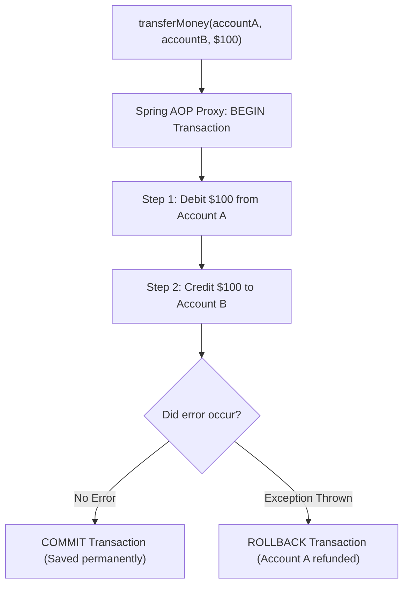

### ⚠️ The Self-Invocation Trap (Classic Interview Question)
```java
@Service
public class OrderService {

    public void processOrder() {
        this.saveToDatabase(); // ❌ @Transactional WILL NOT WORK!
    }

    @Transactional
    public void saveToDatabase() {
        // database changes
    }
}
```
**Why it fails**: Spring wraps `OrderService` with a dynamic AOP proxy. When calling `this.saveToDatabase()`, the method is called directly on the raw instance, **completely bypassing the Spring AOP proxy**.  
**Solution**: Move `saveToDatabase()` to a separate service class.

### Rollback Rules:
- **Default**: Rolls back only on unchecked exceptions (`RuntimeException` and `Error`).
- **Checked Exceptions**: Does **not** roll back on checked exceptions unless specified:  
  `@Transactional(rollbackFor = Exception.class)`
- **`readOnly = true`**: Optimizes performance by skipping Hibernate snapshot dirty checking.

[⬆ Back to Top](#📑-table-of-contents)

---

## 17. Transaction Propagation (All 7 Levels Explained)

> 💡 **Quick Revision Anchor (2-3 Words)**: `Transaction Boundary Rules`

Transaction propagation determines what happens when a transactional method calls another transactional method:

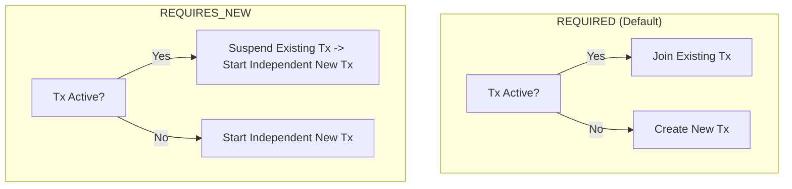

| Propagation Level | Behavior | Practical Example |
|---|---|---|
| **`REQUIRED`** *(Default)* | Joins existing transaction or creates a new one. | Standard business operations (order + payment). |
| **`REQUIRES_NEW`** | Always creates an independent transaction; suspends active transaction. | Writing security audit logs (must persist even if parent business transaction fails). |
| **`SUPPORTS`** | Uses transaction if present; runs non-transactionally if none exists. | Read-only lookup methods. |
| **`MANDATORY`** | Must run in an existing transaction; throws exception if none exists. | Dependent sub-operations. |
| **`NOT_SUPPORTED`** | Suspends active transaction and runs non-transactionally. | External network calls (sending email/SMS) to avoid holding database locks. |
| **`NEVER`** | Throws an exception if a transaction exists. | Operations forbidden from holding locks. |
| **`NESTED`** | Creates a database **Savepoint** inside the active transaction. | Allows rolling back only a child sub-step without failing the parent transaction. |

[⬆ Back to Top](#📑-table-of-contents)

---

## 18. Bean Disambiguation: `@Primary` vs. `@Qualifier`

> 💡 **Quick Revision Anchor (2-3 Words)**: `Default vs Explicit Bean`

When multiple beans implement the same interface, Spring throws `NoUniqueBeanDefinitionException` unless disambiguated:

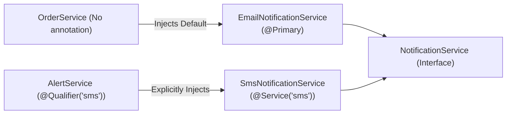

- **`@Primary`**: Sets the default bean to inject when no qualifier is specified.
- **`@Qualifier("beanName")`**: Explicitly specifies which bean to inject by name.

[⬆ Back to Top](#📑-table-of-contents)

---

## 19. Injection Types: Constructor vs. Setter vs. Field Injection

> 💡 **Quick Revision Anchor (2-3 Words)**: `Always Prefer Constructor`

```java
// ✅ Recommended: Constructor Injection
@Service
public class UserService {
    private final UserRepository userRepository; // Can be marked final!

    public UserService(UserRepository userRepository) {
        this.userRepository = userRepository;
    }
}
```

### Why Field Injection (`@Autowired private Repo repo;`) is an Anti-Pattern:
1. **Breaks Immutability**: Fields cannot be marked `final`.
2. **Hidden Dependencies**: Allows instantiating with `new UserService()`, causing `NullPointerException` at runtime.
3. **Hard to Unit Test**: Requires starting a Spring context or using reflection to inject mocks.

[⬆ Back to Top](#📑-table-of-contents)

---

## 20. `@Lookup` Annotation (Singleton with Prototype Dependency)

> 💡 **Quick Revision Anchor (2-3 Words)**: `Prototype Inside Singleton`

### The Problem:
When a Singleton bean depends on a Prototype bean, the prototype is injected **only once** at boot time, effectively turning the prototype into a singleton!

### The Solution with `@Lookup`:
Annotating a getter method with `@Lookup` tells Spring to override the method at runtime and return a **fresh prototype instance** on every call:

```java
@Component
public abstract class ReportService {

    public void generateReport() {
        ReportTask task = getReportTask(); // Returns a fresh prototype instance!
        task.execute();
    }

    @Lookup
    protected abstract ReportTask getReportTask();
}
```

[⬆ Back to Top](#📑-table-of-contents)

---

## 21. Servlet Filters vs. Spring MVC Interceptors

> 💡 **Quick Revision Anchor (2-3 Words)**: `Servlet vs MVC Layer`

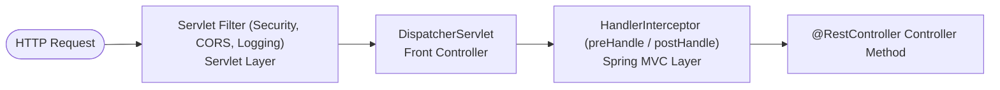

| Feature | Servlet Filter (`OncePerRequestFilter`) | Handler Interceptor (`HandlerInterceptor`) |
|---|---|---|
| **Layer** | Low-level Servlet container level. | Spring MVC framework level. |
| **Execution** | Runs **before** reaching `DispatcherServlet`. | Runs **after** `DispatcherServlet`, before Controller. |
| **Typical Tasks** | Security authentication (JWT filter), CORS headers, GZIP compression. | Logging execution time, attaching user context to model, authorization checks. |

[⬆ Back to Top](#📑-table-of-contents)

---

## 22. Cyclic Dependencies, `@Lazy` & Architectural Decoupling

> 💡 **Quick Revision Anchor (2-3 Words)**: `Circular Reference Workaround`

A circular dependency occurs when `Bean A` requires `Bean B`, and `Bean B` requires `Bean A` (`A ⇄ B`). In Spring Boot 2.6+, this fails at startup by default.

### Quick Fix with `@Lazy`:
Placing `@Lazy` injects a dynamic proxy instead of the real bean, breaking the startup deadlock:
```java
@Service
public class ServiceB {
    private final ServiceA serviceA;

    public ServiceB(@Lazy ServiceA serviceA) {
        this.serviceA = serviceA;
    }
}
```

### Proper Architectural Solutions:
1. **Extract Common Logic**: Move the shared method to a new `ServiceC`.
2. **Event Decoupling**: Publish Spring application events (`ApplicationEventPublisher`) instead of direct calls.

[⬆ Back to Top](#📑-table-of-contents)

---

## 23. `@PathVariable` vs. `@RequestParam`

> 💡 **Quick Revision Anchor (2-3 Words)**: `URI Path vs Query Param`

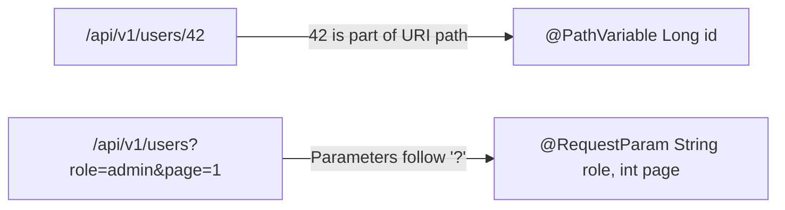

```java
@RestController
@RequestMapping("/api/v1/users")
public class UserController {

    // Identifies a specific resource
    @GetMapping("/{id}")
    public ResponseEntity<User> getUserById(@PathVariable Long id) {
        return ResponseEntity.ok(userService.findById(id));
    }

    // Queries or filters resources
    @GetMapping
    public ResponseEntity<List<User>> searchUsers(
            @RequestParam(defaultValue = "USER") String role,
            @RequestParam(defaultValue = "0") int page) {
        return ResponseEntity.ok(userService.findByRole(role, page));
    }
}
```

[⬆ Back to Top](#📑-table-of-contents)

---

## 24. `ResponseEntity<T>` & HTTP Response Customization

> 💡 **Quick Revision Anchor (2-3 Words)**: `Full HTTP Control`

`ResponseEntity<T>` represents the complete HTTP response: status code, headers, and body.

```java
@RestController
@RequestMapping("/api/v1/users")
public class UserController {

    @GetMapping("/{id}")
    public ResponseEntity<User> getUser(@PathVariable Long id) {
        User user = userService.findById(id);
        return ResponseEntity.ok(user); // 200 OK with body
    }

    @PostMapping
    public ResponseEntity<User> createUser(@Valid @RequestBody User user) {
        User saved = userService.save(user);
        return ResponseEntity.status(HttpStatus.CREATED).body(saved); // 201 Created
    }

    @DeleteMapping("/{id}")
    public ResponseEntity<Void> deleteUser(@PathVariable Long id) {
        userService.delete(id);
        return ResponseEntity.noContent().build(); // 204 No Content
    }
}
```

[⬆ Back to Top](#📑-table-of-contents)

---

## 25. `DispatcherServlet` & Spring MVC Request Flow

> 💡 **Quick Revision Anchor (2-3 Words)**: `Front Controller Hub`

`DispatcherServlet` coordinates all incoming HTTP requests via the **Front Controller Pattern**:

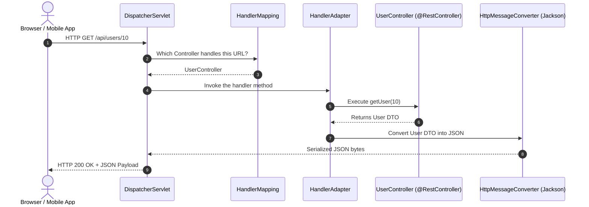

### Core Roles:
1. **`HandlerMapping`**: Finds which controller method maps to the incoming URL.
2. **`HandlerAdapter`**: Executes the controller method.
3. **`HttpMessageConverter`**: Serializes Java objects to JSON bytes (Jackson).

[⬆ Back to Top](#📑-table-of-contents)

---

## 26. Pagination & Sorting in Spring Data JPA

> 💡 **Quick Revision Anchor (2-3 Words)**: `Database-Side Chunking`

Loading thousands of database rows at once exhausts JVM memory. Spring Data JPA handles chunking at the SQL database level via `Pageable`:

```java
@GetMapping
public ResponseEntity<Page<Product>> getProducts(
        @RequestParam(defaultValue = "0") int page,
        @RequestParam(defaultValue = "10") int size,
        @RequestParam(defaultValue = "price") String sortBy) {

    Pageable pageable = PageRequest.of(page, size, Sort.by(sortBy).descending());
    return ResponseEntity.ok(productRepository.findAll(pageable));
}
```

### `Page<T>` vs. `Slice<T>`:
- **`Page<T>`**: Fetches the data slice AND runs an extra `SELECT COUNT(*)` to calculate total pages.
- **`Slice<T>`**: Fetches `limit + 1` rows without a count query. Ideal for infinite scrolling on mobile apps.

[⬆ Back to Top](#📑-table-of-contents)

---

## 27. Object Mapping with MapStruct & DTO Pattern

> 💡 **Quick Revision Anchor (2-3 Words)**: `Compile-Time DTO Mapper`

### Why DTOs?
Never expose database JPA entities directly to API responses: it leaks internal database schemas and causes lazy loading serialization errors.

### Why MapStruct?
Unlike reflection-based tools (ModelMapper), **MapStruct generates plain Java code at compile time**, offering maximum execution speed and compile-time type safety.

```java
@Mapper(componentModel = "spring")
public interface UserMapper {
    UserResponse toResponse(User user);
    User toEntity(UserCreateRequest request);
}
```

[⬆ Back to Top](#📑-table-of-contents)

---

## 28. Core Spring Boot Annotations Quick Reference

> 💡 **Quick Revision Anchor (2-3 Words)**: `Essential Annotation Cheat Sheet`

| Annotation | Category | What It Does |
|---|---|---|
| **`@SpringBootApplication`** | Core Boot | Combines `@Configuration`, `@EnableAutoConfiguration`, and `@ComponentScan`. |
| **`@RestController`** | Web | Marks class as REST controller; combines `@Controller` and `@ResponseBody`. |
| **`@Transactional`** | Persistence | Wraps method inside a database transaction with commit/rollback. |
| **`@Version`** | JPA | Enables Optimistic Locking to detect concurrent updates. |
| **`@Transient`** | JPA | Prevents a field from being saved to the database table. |
| **`@CreatedDate`** | JPA Auditing | Automatically sets creation timestamp on entity insert. |

[⬆ Back to Top](#📑-table-of-contents)

---

## 29. Input Validation (`@Valid`)

> 💡 **Quick Revision Anchor (2-3 Words)**: `Declarative Bean Validation`

Spring Boot integrates with Jakarta Validation (`spring-boot-starter-validation`):

```java
// DTO with validation rules
public record UserRegisterRequest(
    @NotBlank(message = "Username cannot be blank")
    String username,

    @Email(message = "Invalid email format")
    String email,

    @Size(min = 8, message = "Password must have at least 8 characters")
    String password
) {}

// Controller enforcing validation
@PostMapping("/register")
public ResponseEntity<String> register(@Valid @RequestBody UserRegisterRequest request) {
    userService.register(request);
    return ResponseEntity.ok("User registered successfully");
}
```

[⬆ Back to Top](#📑-table-of-contents)

---

## 30. Rapid-Fire Interview Questions & Answers

> 💡 **Quick Revision Anchor (2-3 Words)**: `10-Second Recall Answers`

1. **What is Spring Boot Auto-Configuration?**  
   *Answer*: Automatically configures beans based on classpath dependencies using conditional annotations.
2. **What is the default Spring bean scope?**  
   *Answer*: `singleton`.
3. **Is Spring's singleton bean thread-safe?**  
   *Answer*: No. Singleton beans must be stateless to be thread-safe.
4. **`@NotNull` vs `@NotEmpty` vs `@NotBlank`?**  
   *Answer*: `@NotNull` checks != null; `@NotEmpty` checks != null and size > 0; `@NotBlank` checks != null, size > 0, and non-whitespace.
5. **Does `@Transactional` roll back checked exceptions by default?**  
   *Answer*: No, only unchecked (`RuntimeException`). Use `@Transactional(rollbackFor = Exception.class)`.
6. **What embedded servers does Spring Boot support?**  
   *Answer*: Tomcat, Jetty, Undertow.
7. **What is the N+1 problem?**  
   *Answer*: 1 query for parents + N queries for children. Solved using `JOIN FETCH`.
8. **What does `@SpringBootApplication` combine?**  
   *Answer*: `@Configuration`, `@EnableAutoConfiguration`, and `@ComponentScan`.
9. **How to fix circular dependencies?**  
   *Answer*: Refactor architecture to extract common logic, use events, or `@Lazy` as a quick fix.
10. **Why use constructor injection?**  
    *Answer*: Immutability with `final` fields, no hidden dependencies, easy unit testing with `new`.

[⬆ Back to Top](#📑-table-of-contents)

---

## 31. End-to-End Project Explanation Framework

> 💡 **Quick Revision Anchor (2-3 Words)**: `Resume Architecture Defense`

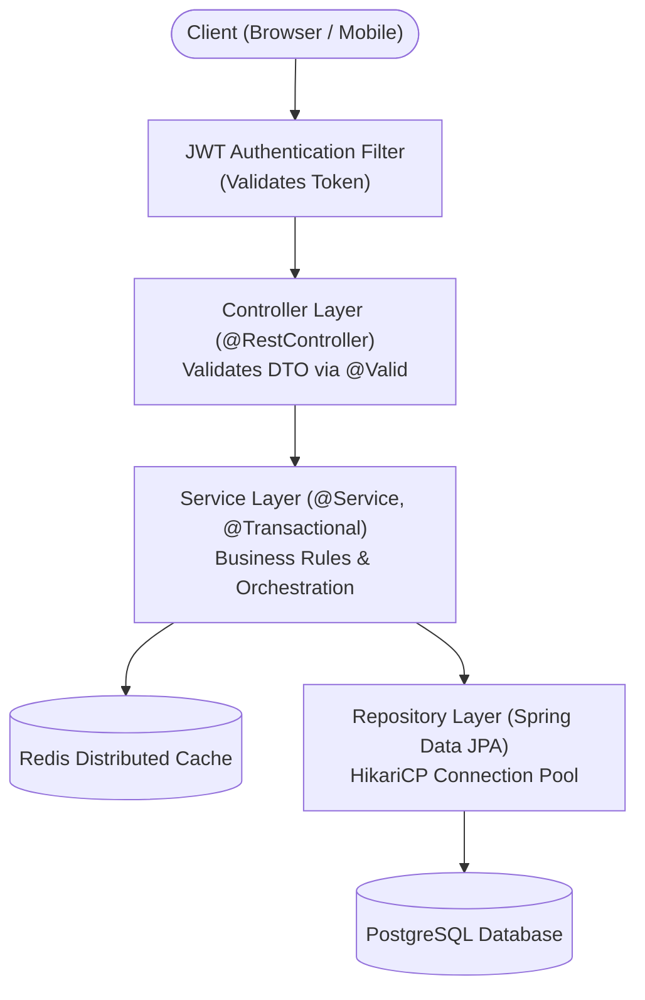

### Verbal Script Template:
> *"In my project, I built a RESTful backend using Spring Boot 3 and Java 17:*
> 1. *Requests pass through a `JwtAuthenticationFilter` that validates tokens and sets the `SecurityContextHolder`.*
> 2. *The **Controller Layer** validates request DTOs using `@Valid` and returns responses with `ResponseEntity<T>`.*
> 3. *The **Service Layer** encapsulates business logic and guarantees transaction atomicity with `@Transactional`.*
> 4. *The **Repository Layer** uses Spring Data JPA on PostgreSQL, optimizing queries with `JOIN FETCH` to prevent N+1 issues.*
> 5. *Cross-cutting exceptions are handled globally with `@RestControllerAdvice` returning structured error DTOs."*

[⬆ Back to Top](#📑-table-of-contents)

---

## 32. High-Yield Topics Beyond the Playlist

---

### A. Spring Security & Stateless JWT Authentication

> 💡 **Quick Revision Anchor (2-3 Words)**: `Stateless Token Security`

In modern microservices and REST APIs, stateful HTTP sessions are replaced with stateless JSON Web Tokens (JWT).

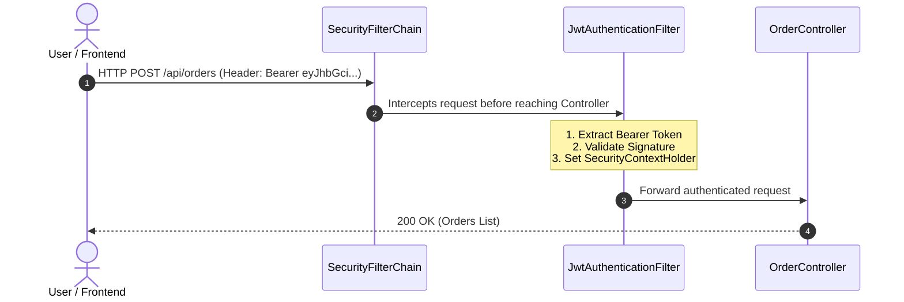

#### Spring Security 6 / Spring Boot 3 Configuration:
```java
@Configuration
@EnableWebSecurity
@RequiredArgsConstructor
public class SecurityConfig {

    private final JwtAuthenticationFilter jwtAuthFilter;

    @Bean
    public SecurityFilterChain securityFilterChain(HttpSecurity http) throws Exception {
        return http
            .csrf(csrf -> csrf.disable()) // Disabled for stateless APIs
            .sessionManagement(session -> session.sessionCreationPolicy(SessionCreationPolicy.STATELESS))
            .authorizeHttpRequests(auth -> auth
                .requestMatchers("/api/auth/**").permitAll() // Public endpoints
                .requestMatchers("/api/admin/**").hasRole("ADMIN")
                .anyRequest().authenticated()
            )
            .addFilterBefore(jwtAuthFilter, UsernamePasswordAuthenticationFilter.class)
            .build();
    }
}
```

[⬆ Back to Top](#📑-table-of-contents)

---

### B. JPA Relationships (`@OneToMany`, `@ManyToOne`) & Cascade Rules

> 💡 **Quick Revision Anchor (2-3 Words)**: `Entity Mapping & Ownership`

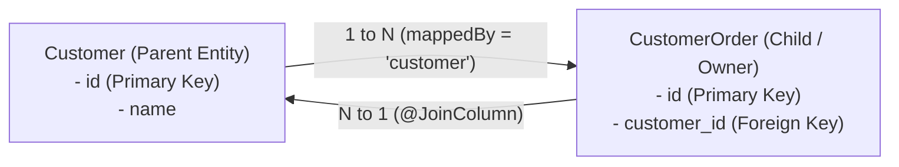

- **Ownership Rule**: The table with the foreign key column is **always the owner of the relationship**.
- **`mappedBy` Rule**: Placed on the inverse (parent) side. It points to the field name in the child entity.
- **`CascadeType.ALL`**: Cascades operations (persist, remove) from parent to child.
- **`orphanRemoval = true`**: Deletes child rows automatically when removed from the parent's collection.

[⬆ Back to Top](#📑-table-of-contents)

---

### C. Fetch Types: LAZY vs. EAGER & The N+1 Query Problem

> 💡 **Quick Revision Anchor (2-3 Words)**: `Solve With Join-Fetch`

### Default Fetch Types:
- **`@ManyToOne` / `@OneToOne`**: Defaults to **`EAGER`** (Best practice: change to `LAZY`).
- **`@OneToMany` / `@ManyToMany`**: Defaults to **`LAZY`**.

### What is the N+1 Query Problem?
Fetching 100 Customers leads to 1 initial query for customers, followed by 100 separate queries to fetch orders for each customer:
- Total: **1 + 100 = 101 database queries executed!**

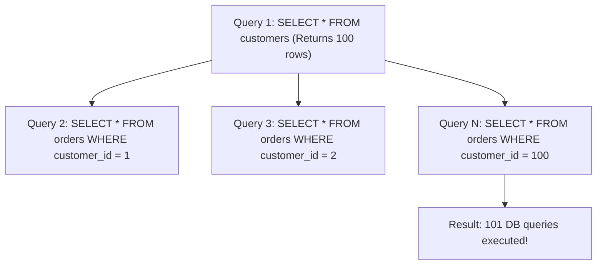

### The Solution: `JOIN FETCH`
```java
// Solves N+1 in a single SQL JOIN query!
@Query("SELECT c FROM Customer c JOIN FETCH c.orders")
List<Customer> findAllWithOrders();
```

[⬆ Back to Top](#📑-table-of-contents)

---

### D. REST API Design & HTTP Idempotency

> 💡 **Quick Revision Anchor (2-3 Words)**: `Standard Verbs & Statuses`

| HTTP Verb | Action | Safe? | Idempotent? |
|---|---|---|---|
| **`GET`** | Read | ✅ Yes | ✅ Yes |
| **`POST`** | Create | ❌ No | ❌ No |
| **`PUT`** | Full Replace | ❌ No | ✅ Yes |
| **`PATCH`** | Partial Update | ❌ No | ❌ No |
| **`DELETE`** | Delete | ❌ No | ✅ Yes |

### Common Status Codes:
- **`200 OK`**: Successful request with body.
- **`201 Created`**: Resource created successfully (`POST`).
- **`204 No Content`**: Succeeded, no response body (`DELETE`).
- **`400 Bad Request`**: Validation or syntax error.
- **`401 Unauthorized`**: Authentication missing or invalid.
- **`403 Forbidden`**: Authenticated, but lacking required role.
- **`404 Not Found`**: Resource does not exist.
- **`500 Internal Server Error`**: Unhandled exception in application.

[⬆ Back to Top](#📑-table-of-contents)

---

### E. SQL & DBMS Essentials for Java Backend Interviews

> 💡 **Quick Revision Anchor (2-3 Words)**: `Joins, Indexing, ACID`

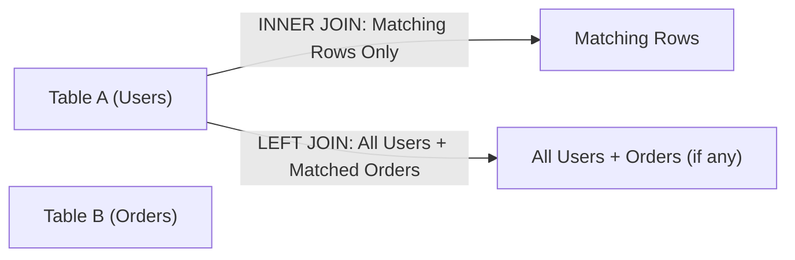

### Transaction Isolation Levels:
1. **`READ UNCOMMITTED`**: Allows **Dirty Reads** (reading uncommitted data).
2. **`READ COMMITTED`** *(Default in PostgreSQL/Oracle)*: Prevents dirty reads; allows non-repeatable reads.
3. **`REPEATABLE READ`** *(Default in MySQL InnoDB)*: Prevents non-repeatable reads; can permit phantom reads.
4. **`SERIALIZABLE`**: Highest isolation level. Full lock/MVCC protection, highest latency.

[⬆ Back to Top](#📑-table-of-contents)

---

### F. Automated Testing with JUnit 5 & Mockito

> 💡 **Quick Revision Anchor (2-3 Words)**: `Unit Mocking vs Integration`

```java
// Unit Testing with Mockito (fast, no Spring context needed)
@ExtendWith(MockitoExtension.class)
class UserServiceTest {

    @Mock
    private UserRepository userRepository;

    @InjectMocks
    private UserService userService;

    @Test
    void shouldReturnUserWhenFound() {
        when(userRepository.findById(1L)).thenReturn(Optional.of(new User(1L, "Alice")));

        User result = userService.getUser(1L);

        assertNotNull(result);
        assertEquals("Alice", result.getName());
    }
}
```

[⬆ Back to Top](#📑-table-of-contents)

---

### G. Maven Build Lifecycle & Dependency Scopes

> 💡 **Quick Revision Anchor (2-3 Words)**: `Build Lifecycle Phases`

```mermaid
flowchart LR
    Clean["mvn clean<br/>(Deletes target/)"]
    Compile["compile<br/>(Compiles src/)"]
    Test["test<br/>(Runs JUnit)"]
    Package["package<br/>(Builds JAR)"]
    Install["install<br/>(Copies to ~/.m2)"]

    Compile --> Test --> Package --> Install
```

### Dependency Scopes:
- **`compile`** *(Default)*: Available everywhere (compile, test, runtime).
- **`provided`**: Needed to compile, but provided by runtime/JDK (e.g. `lombok`).
- **`runtime`**: Only needed at execution (e.g. `postgresql` driver).
- **`test`**: Only used for tests (e.g. `spring-boot-starter-test`). Never bundled in production JAR.

[⬆ Back to Top](#📑-table-of-contents)

---

## 33. 1-Page Master Revision Cheat Sheet

```text
==================================================================================================
                            SPRING BOOT MASTER INTERVIEW CHEAT SHEET
==================================================================================================

1. CORE INVERSION OF CONTROL (IoC) & DI:
   - IoC: Spring manages object creation and lifecycles.
   - DI: Dependencies injected at runtime. Always prefer Constructor Injection for immutability.

2. STEREOTYPES:
   - @RestController = @Controller + @ResponseBody (Writes JSON directly to response).
   - @Service        = Business logic and transaction boundary.
   - @Repository     = Database DAO; translates SQL exceptions to DataAccessException.
   - @Component      = Generic Spring-managed bean.

3. SPRING BOOT MAGIC:
   - @SpringBootApplication = @Configuration + @EnableAutoConfiguration + @ComponentScan.
   - Starters = Curated POM dependency aggregators.
   - Actuator = Production health & metrics (/actuator/health).

4. TRANSACTION MANAGEMENT:
   - @Transactional: Starts DB transaction, commits on success, rollbacks on RuntimeException.
   - REQUIRED (Default): Join existing transaction or create new one.
   - REQUIRES_NEW: Suspend existing transaction and start an independent new one.
   - Self-Invocation Trap: Calling this.method() bypasses AOP proxy; transactions will not start.

5. DATABASE & PERSISTENCE:
   - Hierarchy: JDBC -> JPA (Specification) -> Hibernate (ORM Engine) -> Spring Data JPA.
   - N+1 Query Bug: 1 query for parent + N queries for children. Solved using `JOIN FETCH`.
   - Relationships: Child table with FK is the owner; parent table declares `mappedBy`.

6. MVC FLOW & HTTP:
   - Client -> Servlet Filter -> DispatcherServlet (Front Controller) -> Interceptor -> @RestController.
   - @PathVariable = /users/{id} (URI resource).
   - @RequestParam = /users?page=1 (Query param).
   - ResponseEntity<T> = Complete HTTP response control (status, headers, body).

7. SECURITY & ERROR HANDLING:
   - JWT: Stateless token authentication verified in a OncePerRequestFilter before Controller.
   - @RestControllerAdvice + @ExceptionHandler: Centralized application exception handling.
==================================================================================================
```

[⬆ Back to Top](#📑-table-of-contents)
