# 🍃 Spring Boot — Complete Placement & Technical Interview Master Guide

> **Target Audience**: Fresher / Entry-Level Java Backend Engineers, SWE / SDE Candidates.  
> **Source Foundation**: Curated from The Curious Coder Java Spring Boot Interview Series + High-Yield Placement Deep Dives.  
> **Core Focus**: Exhaustive technical depth, internal architectural mechanisms, clear visual execution diagrams (Mermaid), real-world Java 17 / Spring Boot 3 code implementations, 2-3 word memory hooks, and equal, in-depth coverage across all 31 core topics and beyond-the-playlist essentials (Spring Security, JPA Relationships, N+1 Query Problem, Testing, Maven, and SQL).

---

## 📑 Table of Contents

- [1. Inversion of Control (IoC), Dependency Injection (DI) & Bean Lifecycle](#1-inversion-of-control-ioc-dependency-injection-di--bean-lifecycle)
- [2. `@RestController` vs. `@Controller` (Content Negotiation & ResponseBody)](#2-restcontroller-vs-controller-content-negotiation--responsebody)
- [3. Stereotype Annotations: `@RestController` vs. `@Service` vs. `@Repository` vs. `@Component`](#3-stereotype-annotations-restcontroller-vs-service-vs-repository-vs-component)
- [4. Spring Boot & Starters (Auto-Configuration Internals)](#4-spring-boot--starters-auto-configuration-internals)
- [5. Spring Framework vs. Spring Boot](#5-spring-framework-vs-spring-boot)
- [6. `@SpringBootApplication` Internals & Condition Evaluation](#6-springbootapplication-internals--condition-evaluation)
- [7. Spring Boot Actuator (Custom Health Indicators & Metrics)](#7-spring-boot-actuator-custom-health-indicators--metrics)
- [8. Global Exception Handling (`@RestControllerAdvice` & ProblemDetail)](#8-global-exception-handling-restcontrolleradvice--problemdetail)
- [9. Project Lombok in Spring Boot (Best Practices & JPA Traps)](#9-project-lombok-in-spring-boot-best-practices--jpa-traps)
- [10. Spring Bean Scopes & Thread-Safety](#10-spring-bean-scopes--thread-safety)
- [11. Request Scope vs. Session Scope (Scoped Proxies)](#11-request-scope-vs-session-scope-scoped-proxies)
- [12. Spring Profiles (Multi-Environment Setup)](#12-spring-profiles-multi-environment-setup)
- [13. `application.properties` vs. `application.yaml` & Configuration Precedence](#13-applicationproperties-vs-applicationyaml--configuration-precedence)
- [14. Property Injection: `@Value` vs. `@ConfigurationProperties` vs. `Environment`](#14-property-injection-value-vs-configurationproperties-vs-environment)
- [15. Persistence Stack: JDBC vs. Hibernate vs. JPA vs. Spring Data JPA](#15-persistence-stack-jdbc-vs-hibernate-vs-jpa-vs-spring-data-jpa)
- [16. `@Transactional` Mechanics (AOP Proxies & Self-Invocation Trap)](#16-transactional-mechanics-aop-proxies--self-invocation-trap)
- [17. Transaction Propagation (All 7 Levels Explained)](#17-transaction-propagation-all-7-levels-explained)
- [18. Bean Disambiguation: `@Primary` vs. `@Qualifier` & Strategy Pattern](#18-bean-disambiguation-primary-vs-qualifier--strategy-pattern)
- [19. Injection Types: Constructor vs. Setter vs. Field Injection](#19-injection-types-constructor-vs-setter-vs-field-injection)
- [20. `@Lookup` Annotation & Dynamic Prototype Injection](#20-lookup-annotation--dynamic-prototype-injection)
- [21. Servlet Filters vs. Spring MVC Interceptors](#21-servlet-filters-vs-spring-mvc-interceptors)
- [22. Cyclic Dependencies, `@Lazy` & Architectural Decoupling](#22-cyclic-dependencies-lazy--architectural-decoupling)
- [23. `@PathVariable` vs. `@RequestParam`](#23-pathvariable-vs-requestparam)
- [24. `ResponseEntity<T>` & HTTP Response Customization](#24-responseentityt--http-response-customization)
- [25. `DispatcherServlet` & Spring MVC Request Flow](#25-dispatcherservlet--spring-mvc-request-flow)
- [26. Pagination, Sorting & Dynamic Filtering (JPA Criteria / Specifications)](#26-pagination-sorting--dynamic-filtering-jpa-criteria--specifications)
- [27. Object Mapping with MapStruct & DTO Pattern](#27-object-mapping-with-mapstruct--dto-pattern)
- [28. Core Spring Boot Annotations Quick Reference](#28-core-spring-boot-annotations-quick-reference)
- [29. Input Validation & Custom Validators (`@Valid`)](#29-input-validation--custom-validators-valid)
- [30. Rapid-Fire Interview Questions & Answers](#30-rapid-fire-interview-questions--answers)
- [31. End-to-End Project Explanation Framework](#31-end-to-end-project-explanation-framework)
- [32. High-Yield Topics Beyond the Playlist](#32-high-yield-topics-beyond-the-playlist)
  - [A. Spring Security & Stateless JWT Authentication](#a-spring-security--stateless-jwt-authentication)
  - [B. JPA Relationships (`@OneToMany`, `@ManyToOne`) & Cascade Rules](#b-jpa-relationships-onetomany-manytoone--cascade-rules)
  - [C. Fetch Types: LAZY vs. EAGER & The N+1 Query Problem](#c-fetch-types-lazy-vs-eager--the-n1-query-problem)
  - [D. REST API Design & HTTP Idempotency](#d-rest-api-design--http-idempotency)
  - [E. SQL & DBMS Essentials for Java Backend Interviews](#e-sql--dbms-essentials-for-java-backend-interviews)
  - [F. Automated Testing with JUnit 5 & Mockito](#f-automated-testing-with-junit-5--mockito)
  - [G. Maven Build Lifecycle & Dependency Scopes](#g-maven-build-lifecycle--dependency-scopes)
- [33. 1-Page Master Revision Cheat Sheet](#33-1-page-master-revision-cheat-sheet)

---
## 1. Inversion of Control (IoC), Dependency Injection (DI) & Bean Lifecycle

> 💡 **Quick Revision Anchor (2-3 Words)**: `Spring Controls Objects`

### What is IoC (Inversion of Control)?
In traditional Java programming, if class `OrderService` needs `PaymentService`, it creates it directly using the `new` keyword:
```java
// Traditional Java (Tight Coupling)
class OrderService {
    private PaymentService paymentService = new PaymentService(); // OrderService controls creation
}
```
**Inversion of Control (IoC)** is an architectural principle where the control of object creation, configuration, and lifecycle management is transferred from manual application code to an external container—the **Spring IoC Container**.

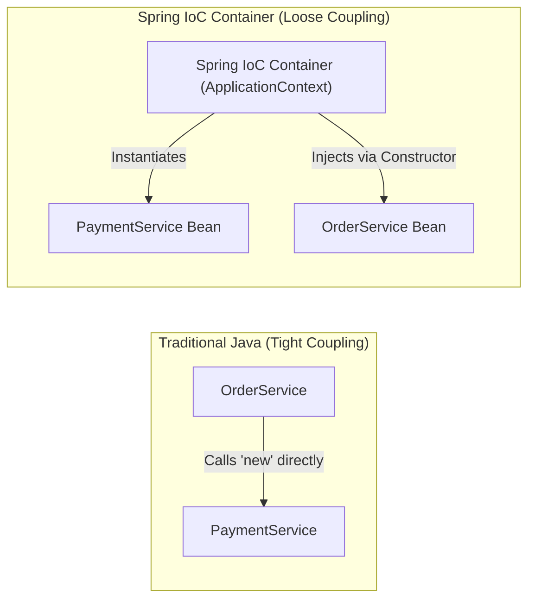

### What is Dependency Injection (DI)?
**Dependency Injection** is the concrete design pattern used to implement IoC. Instead of an object searching for its dependencies, the Spring container **injects** the required dependencies into the object at runtime.

```java
// Spring IoC (Loose Coupling via Dependency Injection)
@Service
public class OrderService {
    private final PaymentService paymentService;

    // Spring automatically supplies PaymentService here
    public OrderService(PaymentService paymentService) {
        this.paymentService = paymentService;
    }
}
```

### `BeanFactory` vs. `ApplicationContext`
Spring provides two primary container abstractions:

| Feature | `BeanFactory` | `ApplicationContext` |
|---|---|---|
| **Instantiation Type** | **Lazy** (Beans created only when `getBean()` is called). | **Eager** (Singletons pre-instantiated at container startup). |
| **Enterprise Features**| Basic dependency injection only. | Event publishing (`ApplicationEvent`), AOP integration, i18n messages, environment profiles. |
| **Resource Usage** | Extremely lightweight (used in memory-constrained IoT devices). | Standard in all enterprise web and Spring Boot applications. |

---

### Spring Bean Lifecycle (High-Yield Interview Topic)
Understanding what happens from the moment Spring discovers a class until it is destroyed is tested frequently in placement interviews:

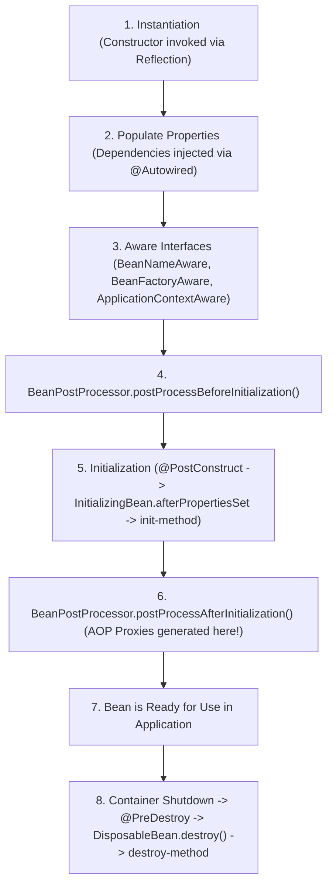

1. **Instantiation**: Spring reads bean definitions and invokes the class constructor using Java Reflection.
2. **Populate Properties**: Spring resolves and injects dependencies (`@Autowired`) and configuration values (`@Value`).
3. **Aware Interfaces**: If the bean implements Spring Aware interfaces, Spring passes internal references:
   - `BeanNameAware`: Provides the bean's registered name.
   - `ApplicationContextAware`: Gives access to the underlying `ApplicationContext`.
4. **`BeanPostProcessor (Before)`**: Custom processors modify bean instances before initialization callbacks run.
5. **Initialization Callbacks** (Executed in this exact order):
   - **`@PostConstruct`**: Standard JSR-250 annotation method.
   - **`InitializingBean.afterPropertiesSet()`**: Spring interface method.
   - **Custom `init-method`**: Configured via `@Bean(initMethod = "customInit")`.
6. **`BeanPostProcessor (After)`**: Spring wraps beans with dynamic **AOP proxies** (e.g., for `@Transactional`, `@Async`, security checks).
7. **Destruction Phase**: Triggered when `ApplicationContext.close()` is invoked:
   - **`@PreDestroy`** annotated method runs.
   - **`DisposableBean.destroy()`** interface method runs.
   - Custom **`destroy-method`** executes.

#### Code Demonstration: Lifecycle Callbacks & BeanPostProcessor
```java
@Component
public class CustomLifecycleBean implements InitializingBean, DisposableBean, BeanNameAware {

    public CustomLifecycleBean() {
        System.out.println("1. Constructor called");
    }

    @Override
    public void setBeanName(String name) {
        System.out.println("2. BeanNameAware: Bean registered as " + name);
    }

    @PostConstruct
    public void postConstruct() {
        System.out.println("3. @PostConstruct: Executed before InitializingBean");
    }

    @Override
    public void afterPropertiesSet() {
        System.out.println("4. InitializingBean: Properties populated");
    }

    @PreDestroy
    public void preDestroy() {
        System.out.println("5. @PreDestroy: Cleanup before shutdown");
    }

    @Override
    public void destroy() {
        System.out.println("6. DisposableBean: Final destruction");
    }
}
```

---
## 2. `@RestController` vs. `@Controller` (Content Negotiation & ResponseBody)

> 💡 **Quick Revision Anchor (2-3 Words)**: `JSON vs HTML-Views`

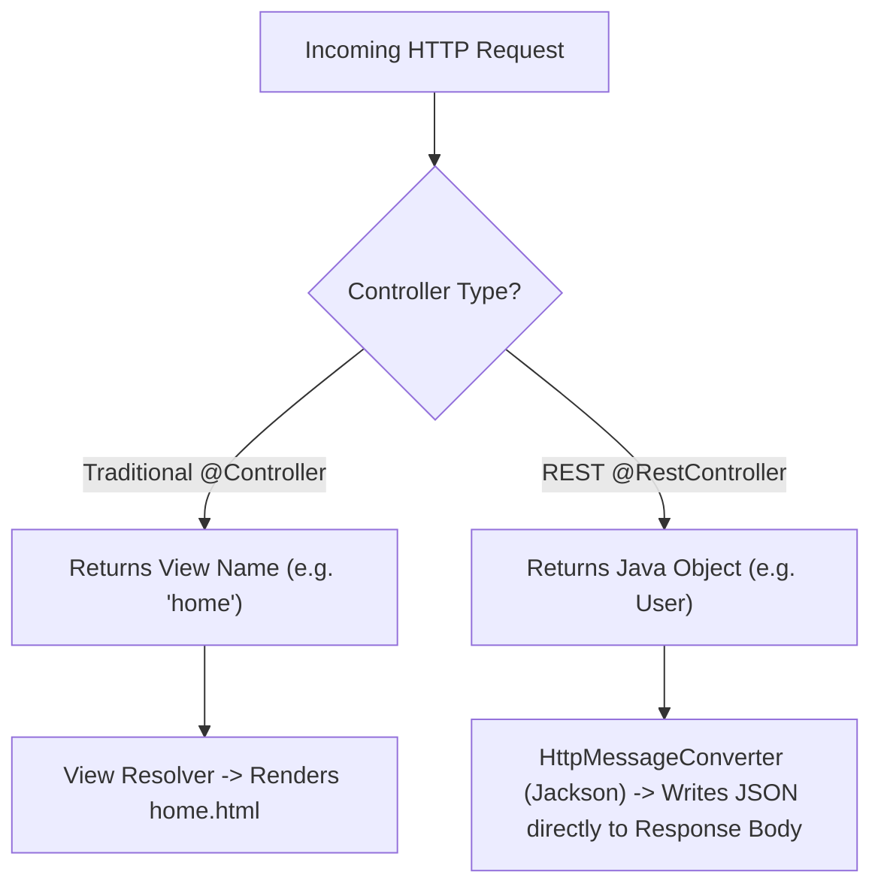

### Comparison Matrix

| Dimension | `@Controller` | `@RestController` |
|---|---|---|
| **Primary Purpose** | Traditional MVC web apps rendering HTML web pages. | Modern RESTful APIs serving raw data (JSON / XML). |
| **Return Value** | Treated as a **view name** (resolved by a `ViewResolver` to a JSP/Thymeleaf template). | Written directly to the **HTTP response body** as JSON. |
| **Composition** | Base stereotype annotation. | `@RestController = @Controller + @ResponseBody` |
| **Returning JSON?** | Requires explicit `@ResponseBody` on each method. | Automatically enabled for **all** handler methods. |

### How `HttpMessageConverter` Operates Under the Hood
When a `@RestController` returns an object:
1. Spring inspects the incoming request's **`Accept` header** (e.g., `Accept: application/json` or `application/xml`).
2. Spring queries its registered list of `HttpMessageConverter` beans.
3. For JSON, `MappingJackson2HttpMessageConverter` uses Jackson's **`ObjectMapper`** to serialize the Java POJO into JSON byte streams and writes it directly to `HttpServletResponse.getOutputStream()`.
4. If the client requests XML (`Accept: application/xml`) and `jackson-dataformat-xml` is on the classpath, Spring serializes XML instead—this is called **Content Negotiation**.

---
## 3. Stereotype Annotations: `@RestController` vs. `@Service` vs. `@Repository` vs. `@Component`

> 💡 **Quick Revision Anchor (2-3 Words)**: `Layered Component Roles`

All four annotations tell Spring: *"This class is a Spring Bean—manage its lifecycle."* However, using specific stereotypes provides architectural clarity and enables specialized framework features.


| Annotation | Layer | Special Framework Behavior |
|---|---|---|
| **`@RestController`** | Presentation / API Layer | Handles HTTP requests, parses JSON, and binds responses. Combines `@Controller` and `@ResponseBody`. |
| **`@Service`** | Business Logic Layer | Communicates business intent; common target for `@Transactional` boundaries. Contains validation and business rules. |
| **`@Repository`** | Data Access / DAO Layer | Interacts with databases. **Crucial**: Automatically translates low-level database exceptions (e.g., `SQLException`, `HibernateException`) into Spring's unified, unchecked `DataAccessException` hierarchy via `PersistenceExceptionTranslationPostProcessor`. |
| **`@Component`** | Generic Utility Layer | Generic stereotype for any Spring-managed component that does not fit into the other three layers (e.g., mail senders, background processors, custom encoders). |

> [!IMPORTANT]
> **Interview Question**: *"Why not annotate every class with `@Component`?"*  
> **Answer**: *"While technically valid, using specialized stereotypes communicates the architectural intent of the class, allows team members to navigate layers easily, and enables framework-specific behavior—such as automatic persistence exception translation with `@Repository`."*

---
## 4. Spring Boot & Starters (Auto-Configuration Internals)

> 💡 **Quick Revision Anchor (2-3 Words)**: `Curated Dependency Bundles`

### What is Spring Boot?
Spring Boot is an extension of the Spring Framework designed to eliminate boilerplate configuration and streamline production-ready application development through:
1. **Auto-Configuration**: Guesses configuration based on JAR dependencies found on the classpath.
2. **Starter Dependencies**: Curated dependency aggregators that prevent version mismatches.
3. **Embedded Web Servers**: Tomcat, Jetty, or Undertow packaged directly inside the executable JAR.
4. **Production Metrics**: Ready-to-use health checks and metrics via Actuator.

### What is a Spring Boot Starter?
A **Starter** is a convenient dependency descriptor (`pom.xml`) that bundles all compatible, version-aligned libraries needed for a specific capability.

```xml
<!-- Brings in Spring MVC, REST support, Jackson JSON, and Embedded Tomcat -->
<dependency>
    <groupId>org.springframework.boot</groupId>
    <artifactId>spring-boot-starter-web</artifactId>
</dependency>

<!-- Brings in Hibernate, Spring Data JPA, HikariCP Connection Pool, and JDBC -->
<dependency>
    <groupId>org.springframework.boot</groupId>
    <artifactId>spring-boot-starter-data-jpa</artifactId>
</dependency>
```

### How Auto-Configuration Works Internally
1. When the application starts, `@EnableAutoConfiguration` reads `META-INF/spring/org.springframework.boot.autoconfigure.AutoConfiguration.imports` (in Spring Boot 3) or `spring.factories` (in Spring Boot 2.x).
2. It evaluates dozens of auto-configuration classes (e.g., `DataSourceAutoConfiguration`, `JacksonAutoConfiguration`).
3. Each class uses **Conditional Annotations** to determine whether it should activate:
   - **`@ConditionalOnClass(DataSource.class)`**: Only runs if the database driver is present on the classpath.
   - **`@ConditionalOnMissingBean(DataSource.class)`**: Only creates a default DataSource bean if the developer hasn't created their own custom one.
   - **`@ConditionalOnProperty(name = "feature.enabled", havingValue = "true")`**: Only activates if an explicit property flag is set in configuration.
   - **`@ConditionalOnWebApplication`**: Only executes inside web application environments.

---
## 5. Spring Framework vs. Spring Boot

> 💡 **Quick Revision Anchor (2-3 Words)**: `Core vs Automated`

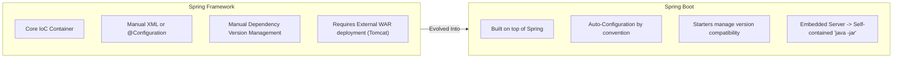

| Dimension | Spring Framework | Spring Boot |
|---|---|---|
| **Goal** | Provides the core dependency injection and enterprise features. | Eliminates configuration overhead and speeds up development. |
| **Configuration** | Heavy boilerplate (XML files or extensive Java `@Configuration` classes). | Opinionated auto-configuration ("convention over configuration"). |
| **Server Deployment** | Packaged as `.war` and deployed to an external application server (Tomcat/JBoss). | Generates standalone `.jar` with an **embedded server** (Tomcat runs via `java -jar app.jar`). |
| **Dependency Management** | Developer manually specifies individual artifact versions and resolves version conflicts. | **Starters** manage coordinated, tested dependency versions automatically via `spring-boot-dependencies` BOM. |
| **Production Features** | Requires manual integration for health endpoints, metrics, and monitoring. | **Spring Boot Actuator** provides out-of-the-box production health and metrics endpoints. |

---
## 6. `@SpringBootApplication` Internals & Condition Evaluation

> 💡 **Quick Revision Anchor (2-3 Words)**: `Three-in-One Bootstrap`

The entry point of every Spring Boot app is annotated with `@SpringBootApplication`:
```java
@SpringBootApplication
public class Application {
    public static void main(String[] args) {
        SpringApplication.run(Application.class, args);
    }
}
```

`@SpringBootApplication` is a meta-annotation that bundles **three essential annotations**:

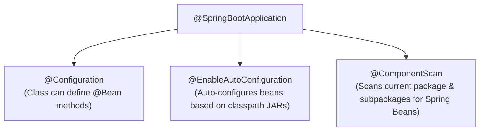

1. **`@Configuration`**: Marks the class as a configuration class capable of declaring `@Bean` factory methods.
2. **`@EnableAutoConfiguration`**: Instructs Spring Boot to examine classpath libraries and intelligently configure beans.
3. **`@ComponentScan`**: Recursively scans the package of the main class and all its subpackages to discover and register `@Component`, `@Service`, `@Repository`, and `@RestController` beans.

### Condition Evaluation Report (`--debug`)
If an interviewer asks: *"How do you know why Spring Boot created a particular bean or skipped another?"*  
**Answer**: Run the application with `--debug` (e.g. `java -jar app.jar --debug`). Spring Boot prints the **Condition Evaluation Report** showing:
- **Positive matches**: Beans created because conditions matched.
- **Negative matches**: Beans omitted because conditions failed (e.g. missing classes or existing custom beans).

---
## 7. Spring Boot Actuator (Custom Health Indicators & Metrics)

> 💡 **Quick Revision Anchor (2-3 Words)**: `Production Health Monitoring`

Spring Boot Actuator provides built-in HTTP endpoints to monitor and inspect application health, runtime metrics, and environment details in production.

```xml
<dependency>
    <groupId>org.springframework.boot</groupId>
    <artifactId>spring-boot-starter-actuator</artifactId>
</dependency>
```

### Key Actuator Endpoints:
- **`/actuator/health`**: Returns basic application status (`{"status": "UP"}`), database connectivity, and disk space.
- **`/actuator/info`**: Exposes arbitrary application metadata (build version, git commit details).
- **`/actuator/metrics`**: Displays JVM memory usage, active thread counts, and garbage collection stats.
- **`/actuator/loggers`**: Allows viewing and **dynamically altering log levels** at runtime without restarting the server!

```properties
# Exposing endpoints in application.properties
management.endpoints.web.exposure.include=health,info,metrics,loggers
# Showing full component health details
management.endpoint.health.show-details=always
# Isolating Actuator on a private internal port
management.server.port=8081
```

### Writing a Custom Health Indicator
```java
@Component
public class CustomDatabaseHealthIndicator implements HealthIndicator {
    @Override
    public Health health() {
        boolean databaseReachable = checkDbConnection();
        if (databaseReachable) {
            return Health.up().withDetail("database", "PostgreSQL 15 is reachable").build();
        }
        return Health.down().withDetail("database", "Connection timed out").build();
    }

    private boolean checkDbConnection() {
        // ping database
        return true;
    }
}
```

---
## 8. Global Exception Handling (`@RestControllerAdvice` & ProblemDetail)

> 💡 **Quick Revision Anchor (2-3 Words)**: `Centralized Error Interceptor`

Without centralized exception handling, controllers end up cluttered with repetitive `try-catch` blocks. Spring provides `@RestControllerAdvice` and `@ExceptionHandler` to intercept exceptions across all controllers in a clean, decoupled manner.

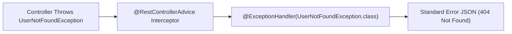

### Modern Spring Boot 3 Approach: RFC 7807 `ProblemDetail`
In Spring Boot 3 / Spring 6, the industry-standard way to return errors is using **`ProblemDetail`**:
```java
@RestControllerAdvice
public class GlobalExceptionHandler {

    @ExceptionHandler(UserNotFoundException.class)
    public ProblemDetail handleUserNotFound(UserNotFoundException ex, HttpServletRequest request) {
        ProblemDetail problem = ProblemDetail.forStatusAndDetail(HttpStatus.NOT_FOUND, ex.getMessage());
        problem.setTitle("User Not Found");
        problem.setType(URI.create("https://api.example.com/errors/not-found"));
        problem.setProperty("timestamp", Instant.now());
        problem.setProperty("path", request.getRequestURI());
        return problem;
    }

    @ExceptionHandler(MethodArgumentNotValidException.class)
    public ProblemDetail handleValidation(MethodArgumentNotValidException ex) {
        ProblemDetail problem = ProblemDetail.forStatusAndDetail(HttpStatus.BAD_REQUEST, "Validation failed");
        Map<String, String> fieldErrors = new HashMap<>();
        ex.getBindingResult().getFieldErrors().forEach(err -> 
            fieldErrors.put(err.getField(), err.getDefaultMessage())
        );
        problem.setProperty("invalidFields", fieldErrors);
        return problem;
    }

    @ExceptionHandler(Exception.class)
    public ProblemDetail handleGenericException(Exception ex) {
        ProblemDetail problem = ProblemDetail.forStatusAndDetail(HttpStatus.INTERNAL_SERVER_ERROR, "An unexpected server error occurred");
        problem.setTitle("Internal Server Error");
        return problem;
    }
}

#### ⚠️ Elite Placement Gotcha: Why `@RestControllerAdvice` cannot catch Spring Security 401/403 Exceptions!
Interviewers love asking: *"If a user sends an invalid JWT or accesses an unauthorized route, why doesn't `@RestControllerAdvice` catch the `AuthenticationException` or `AccessDeniedException`?"*  
**The Reason**: Spring Security filters execute in the **Servlet Filter Chain**, which runs **BEFORE** the `DispatcherServlet` and the MVC Controller layer. By the time an exception happens in the filter chain, `@RestControllerAdvice` hasn't even been reached!  
**The Solution**: Implement custom `AuthenticationEntryPoint` (for 401 Unauthorized) and `AccessDeniedHandler` (for 403 Forbidden) and register them in your `SecurityFilterChain`:
```java
@Component
public class CustomAuthenticationEntryPoint implements AuthenticationEntryPoint {
    @Override
    public void commence(HttpServletRequest request, HttpServletResponse response, AuthenticationException ex) throws IOException {
        response.setContentType("application/json");
        response.setStatus(HttpServletResponse.SC_UNAUTHORIZED);
        response.getWriter().write("{"error": "UNAUTHORIZED", "message": "" + ex.getMessage() + ""}");
    }
}
```
```

---
## 9. Project Lombok in Spring Boot (Best Practices & JPA Traps)

> 💡 **Quick Revision Anchor (2-3 Words)**: `Boilerplate Code Reducer`

Lombok uses compile-time annotation processing to automatically generate getters, setters, constructors, builders, and `toString` methods into bytecode, keeping Java source files compact.

### Most Common Lombok Annotations:
- **`@Getter` / `@Setter`**: Generates getters and setters for all fields.
- **`@NoArgsConstructor`**: Generates a default parameterless constructor (required by Hibernate/JPA).
- **`@AllArgsConstructor`**: Generates a constructor with one parameter for each field.
- **`@RequiredArgsConstructor`**: Generates a constructor specifically for all `final` fields (ideal for constructor-based dependency injection).
- **`@Builder`**: Implements the clean GoF Builder pattern for object creation.
- **`@Slf4j`**: Injects a thread-safe `Logger log = LoggerFactory.getLogger(...)` instance.

```java
@Service
@RequiredArgsConstructor // Automatically generates constructor for all final fields!
public class UserService {
    private final UserRepository userRepository; // Injected without manual constructor!
}
```

> [!WARNING]
> **JPA Entity Warning**: Avoid using `@Data` on JPA `@Entity` classes!
> 1. `@Data` generates `equals()` and `hashCode()` based on all fields. When entities are managed by Hibernate, surrogate primary keys (`id`) are null before persisting, breaking Set collections (`HashSet<Entity>`).
> 2. `@Data` generates `toString()` which accesses bidirectional relationships (e.g. `User -> Order -> User`), causing an immediate **`StackOverflowError`**.
> **Solution**: Use `@Getter`, `@Setter`, and `@ToString.Exclude` on relational fields.

---
## 10. Spring Bean Scopes & Thread-Safety

> 💡 **Quick Revision Anchor (2-3 Words)**: `Bean Lifecycle Duration`

A bean's scope defines its lifecycle and how instances are shared across the application.

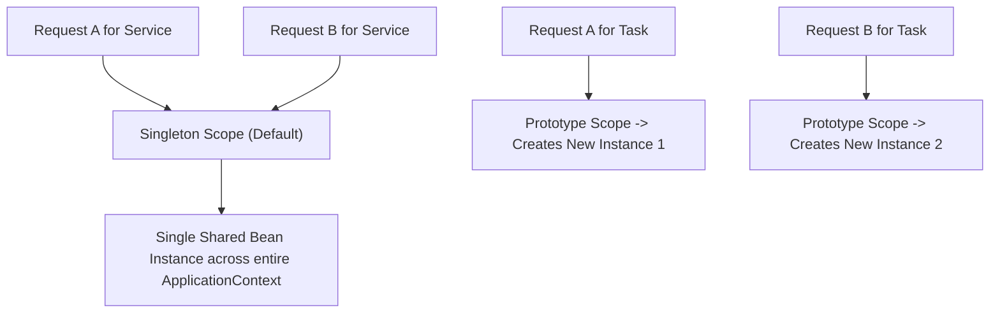

| Scope | Description | Use Case |
|---|---|---|
| **`singleton`** *(Default)* | Exactly **one** instance created per Spring IoC Container. Shared across all callers. | Stateless services (`@Service`), controllers, repositories. |
| **`prototype`** | A **new** instance is created every time the bean is requested from the container. | Stateful objects or non-thread-safe task runners. |
| **`request`** | One instance per HTTP request (Web applications). | User audit logging, request tracing tokens. |
| **`session`** | One instance per HTTP session. | E-commerce shopping cart, user session state. |
| **`application`** | One instance per `ServletContext`. | Application-wide global web cache. |

### Is a Singleton Bean Thread-Safe?
**NO!** Spring provides a single shared instance, but it does **not** make it thread-safe. Multiple worker threads in Tomcat can invoke a singleton method concurrently. If the singleton holds mutable class variables:
```java
@Service
public class OrderService {
    private int orderCount = 0; // ❌ DANGEROUS! Shared mutable state causes race conditions!
}
```
**Golden Rule**: Spring singleton beans must be **completely stateless**. Pass state through method parameters or local variables.

---
## 11. Request Scope vs. Session Scope (Scoped Proxies)

> 💡 **Quick Revision Anchor (2-3 Words)**: `Per-Request vs Per-User`

Both scopes exist strictly within web-aware Spring application contexts:

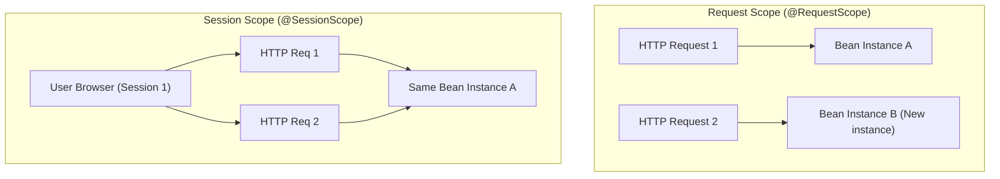

### The Scoped Proxy Mystery (Interview Deep Dive)
*"If a Singleton Service starts at boot time, how can it inject a Request-Scoped bean that doesn't exist until a user sends an HTTP request?"*  
**Answer**: Spring uses a **Scoped Proxy** (`proxyMode = ScopedProxyMode.TARGET_CLASS`). At startup, Spring injects a CGLIB proxy placeholder. When the singleton invokes a method on the proxy, the proxy looks up the current HTTP thread's request context and delegates to the active request bean.

```java
@Component
@Scope(value = WebApplicationContext.SCOPE_REQUEST, proxyMode = ScopedProxyMode.TARGET_CLASS)
public class UserRequestContext {
    private String tenantId;
    private String traceId;
    // getters and setters
}
```

---
## 12. Spring Profiles (Multi-Environment Setup)

> 💡 **Quick Revision Anchor (2-3 Words)**: `Environment-Specific Config`

Profiles let you segregate configuration across environments (e.g., `dev`, `test`, `prod`) without touching source code.

### Configuration Files:
- `application.properties` (Common base configuration)
- `application-dev.properties` (Local development: H2 or local Postgres)
- `application-prod.properties` (Production: AWS RDS, real credentials)

### Multi-Document YAML Format (Single File):
```yaml
server:
  port: 8080
---
spring:
  config:
    activate:
      on-profile: dev
  datasource:
    url: jdbc:h2:mem:devdb
---
spring:
  config:
    activate:
      on-profile: prod
  datasource:
    url: jdbc:postgresql://prod-db:5432/app
```

### Activating Profiles:
1. In `application.properties`: `spring.profiles.active=dev`
2. Via CLI argument: `java -jar app.jar --spring.profiles.active=prod`
3. Via OS Environment: `export SPRING_PROFILES_ACTIVE=prod`

---
## 13. `application.properties` vs. `application.yaml` & Configuration Precedence

> 💡 **Quick Revision Anchor (2-3 Words)**: `Hierarchy & Precedence`

### Configuration Precedence (Highest to Lowest):
1. **Command line arguments** (`--server.port=9090`).
2. **Java System Properties** (`-Dserver.port=9090`).
3. **OS Environment Variables** (`SERVER_PORT=9090`).
4. **Profile-specific application properties outside packaged jar** (`/config/application-prod.yaml`).
5. **Profile-specific application properties inside jar** (`application-prod.yaml`).
6. **Default application properties outside packaged jar**.
7. **Default application properties inside jar** (`application.yaml`).

---
## 14. Property Injection: `@Value` vs. `@ConfigurationProperties` vs. `Environment`

> 💡 **Quick Revision Anchor (2-3 Words)**: `Injecting Config Values`

| Approach | Best Use Case | Type Safety | Relaxed Binding |
|---|---|---|---|
| **`@Value`** | Injecting 1 or 2 isolated primitive properties. | ❌ No (String based) | ❌ No |
| **`@ConfigurationProperties`** | Grouping a related tree of structured properties. | ✅ Full Type-Safety | ✅ Yes (handles camelCase, kebab-case) |
| **`Environment`** | Programmatically querying properties dynamically at runtime. | ❌ Manual cast | ❌ No |

### SpEL (Spring Expression Language) in `@Value`:
```java
// Default fallback value if property is missing
@Value("${app.timeout:5000}")
private int timeout;

// Evaluating SpEL expression
@Value("#{24 * 60 * 60}")
private int secondsInDay;

// Injecting list from comma-separated property
@Value("#{'${app.allowed.origins}'.split(',')}")
private List<String> allowedOrigins;
```

---
## 15. Persistence Stack: JDBC vs. Hibernate vs. JPA vs. Spring Data JPA

> 💡 **Quick Revision Anchor (2-3 Words)**: `Database Abstraction Layers`

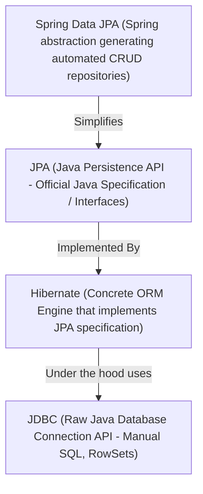

### First-Level Cache & Dirty Checking
1. **First-Level Cache**: Every Hibernate `Session` (JPA `EntityManager`) acts as an in-memory cache. If you fetch `userRepository.findById(1L)` twice within the same `@Transactional` method, Hibernate executes the SQL query **only once**!
2. **Dirty Checking**: When an entity is loaded inside a transaction, Hibernate keeps an internal snapshot. If you modify entity fields (e.g. `user.setEmail("new@example.com")`), at transaction commit time, Hibernate compares the entity with the snapshot and **automatically issues SQL `UPDATE` queries** without calling `save()`!

---
## 16. `@Transactional` Mechanics (AOP Proxies & Self-Invocation Trap)

> 💡 **Quick Revision Anchor (2-3 Words)**: `All-or-Nothing ACID`

### What is `@Transactional`?
`@Transactional` guarantees that a series of database operations execute within a single transactional boundary following ACID rules: **either all operations succeed (COMMIT) or if any error occurs, all changes are undone (ROLLBACK)**.

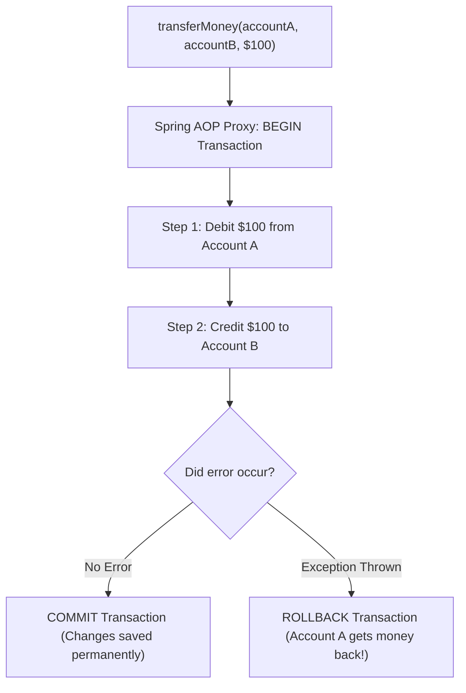

### The Self-Invocation Trap (Classic Interview Question)
```java
@Service
public class OrderService {

    public void processOrder() {
        // Calling method in same class via 'this'
        this.saveToDatabase(); // ❌ @Transactional WILL NOT WORK!
    }

    @Transactional
    public void saveToDatabase() {
        // database changes
    }
}
```
**Why it fails**: Spring creates a dynamic proxy around `OrderService`. When an external class calls `processOrder()`, the proxy delegates to the target. But inside `processOrder()`, calling `this.saveToDatabase()` is an internal direct method call on the raw object—**the AOP Proxy is completely bypassed**, so no transaction is ever started!  
**Solution**: Move `saveToDatabase()` to a separate service or inject self via `@Autowired private OrderService self;`.

### Rollback Rules:
- **Default**: Rolls back only on unchecked exceptions (`RuntimeException` and `Error`).
- **Checked Exceptions**: Does **not** roll back on `SQLException` or `IOException` unless specified:  
  `@Transactional(rollbackFor = Exception.class)`.
- **`readOnly = true`**: Informs Hibernate that the transaction is read-only. Hibernate skips snapshot dirty checking, saving memory and CPU. In multi-datasource setups, it also routes queries directly to read-only database replicas.
- **`timeout = 5`**: Enforces a maximum execution time (in seconds). If the transaction takes longer than 5 seconds (e.g. slow database query or locked rows), Spring automatically rolls it back with a `TransactionTimedOutException`.
- **`isolation = Isolation.READ_COMMITTED`**: Defines the database locking behavior and concurrency isolation level for this specific transaction.

---
## 17. Transaction Propagation (All 7 Levels Explained)

> 💡 **Quick Revision Anchor (2-3 Words)**: `Transaction Boundary Rules`

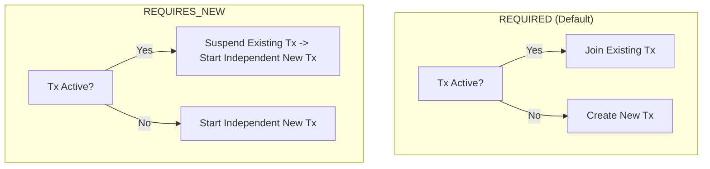

| Propagation Level | Behavior | Practical Placement Example |
|---|---|---|
| **`REQUIRED`** *(Default)* | Joins existing transaction or creates a new one. | Updating inventory and placing order in one combined transaction. |
| **`REQUIRES_NEW`** | Always creates an independent transaction; suspends active transaction. | Writing security audit logs or payment logs (must persist even if parent business transaction rolls back). |
| **`SUPPORTS`** | Uses transaction if present; otherwise runs non-transactionally. | Read-only lookup methods. |
| **`MANDATORY`** | Must run in an existing transaction; throws `IllegalTransactionStateException` if none exists. | Sub-calculations that require transactional locks. |
| **`NOT_SUPPORTED`** | Suspends any active transaction and executes non-transactionally. | Sending third-party network emails / SMS (avoid holding DB locks). |
| **`NEVER`** | Throws an exception if a transaction exists. | Operations forbidden from holding locks. |
| **`NESTED`** | Creates a database **Savepoint** inside the active transaction. | Allows rolling back only a child sub-step to the savepoint without rolling back the entire parent transaction. |

---
## 18. Bean Disambiguation: `@Primary` vs. `@Qualifier` & Strategy Pattern

> 💡 **Quick Revision Anchor (2-3 Words)**: `Default vs Explicit Bean`

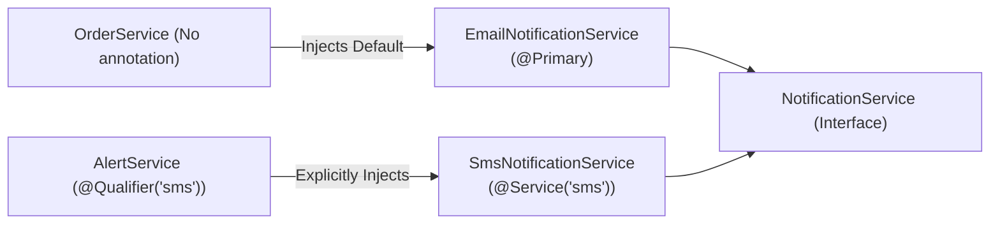

### Dynamic Strategy Pattern (Advanced Placement Question)
*"How can you select and inject a bean dynamically based on a runtime parameter?"*  
**Answer**: Inject a `Map<String, NotificationService>`:
```java
@Service
public class NotificationManager {
    private final Map<String, NotificationService> notificationStrategies;

    public NotificationManager(Map<String, NotificationService> strategies) {
        this.notificationStrategies = strategies; // Spring populates beanName -> bean instance!
    }

    public void send(String type, String message) {
        NotificationService service = notificationStrategies.get(type);
        if (service == null) {
            throw new IllegalArgumentException("Unknown notification type: " + type);
        }
        service.sendNotification(message);
    }
}
```

---
## 19. Injection Types: Constructor vs. Setter vs. Field Injection

> 💡 **Quick Revision Anchor (2-3 Words)**: `Always Prefer Constructor`

### Why Field Injection (`@Autowired private Repo repo;`) is an Anti-Pattern:
1. **Breaks Immutability**: Fields cannot be marked `final`.
2. **Hidden Dependencies**: Class can be instantiated with `new UserService()` without compile-time errors, leading to `NullPointerException` at runtime.
3. **Hard to Unit Test**: Forces you to use Spring Test Contexts or reflection (`ReflectionTestUtils`) just to inject mock objects.
4. **Circular Dependency Blindness**: Hides circular references until runtime.

---
## 20. `@Lookup` Annotation & Dynamic Prototype Injection

> 💡 **Quick Revision Anchor (2-3 Words)**: `Prototype Inside Singleton`

When a Singleton bean depends on a Prototype bean:
```java
@Component
public abstract class ReportGenerator { // Singleton

    public void generateReport() {
        ReportTask task = getTask(); // Fetches brand new prototype instance!
        task.execute();
    }

    @Lookup
    protected abstract ReportTask getTask();
}
```
**Alternative Modern Approach**: Inject `ObjectProvider<ReportTask>`:
```java
@Service
public class ReportGenerator {
    private final ObjectProvider<ReportTask> taskProvider;

    public void generateReport() {
        ReportTask task = taskProvider.getObject(); // Fresh prototype instance
        task.execute();
    }
}
```

---
## 21. Servlet Filters vs. Spring MVC Interceptors

> 💡 **Quick Revision Anchor (2-3 Words)**: `Servlet vs MVC Layer`

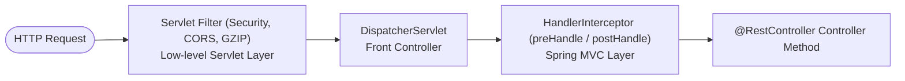

| Lifecycle Method | Servlet Filter (`OncePerRequestFilter`) | Handler Interceptor (`HandlerInterceptor`) |
|---|---|---|
| **Before Execution** | `doFilter(request, response, chain)` before `chain.doFilter()` | `preHandle(request, response, handler)` (Return false to abort!) |
| **After Execution** | Code after `chain.doFilter()` | `postHandle(...)` (Can modify `ModelAndView`) |
| **After Completion**| `destroy()` on server stop | `afterCompletion(...)` (Executed even if exception occurs; ideal for cleanup) |

---
## 22. Cyclic Dependencies, `@Lazy` & Architectural Decoupling

> 💡 **Quick Revision Anchor (2-3 Words)**: `Circular Reference Workaround`

A **circular dependency** occurs when Bean A requires Bean B, and Bean B requires Bean A (`A ⇄ B`). Starting with **Spring Boot 2.6**, circular dependencies are **disabled by default** (`BeanCurrentlyInCreationException`).

### How `@Lazy` Works:
Placing `@Lazy` on one constructor parameter causes Spring to inject a dynamic CGLIB proxy instead of the real bean. The real bean is resolved only when its method is called for the first time:
```java
@Service
public class ServiceB {
    private final ServiceA serviceA;

    public ServiceB(@Lazy ServiceA serviceA) {
        this.serviceA = serviceA;
    }
}
```

### Proper Architectural Fixes:
1. **Extract Shared Logic**: Move the overlapping method to a new `ServiceC`.
2. **Event-Driven Decoupling**: Instead of direct method calls, publish an event via `ApplicationEventPublisher`.

---
## 23. `@PathVariable` vs. `@RequestParam`

> 💡 **Quick Revision Anchor (2-3 Words)**: `URI Path vs Query Param`


- **`@PathVariable`**: Identifies a specific resource. Supports regex: `@GetMapping("/{id:[0-9]+}")`.
- **`@RequestParam`**: Supports optional inputs: `@RequestParam(required = false, defaultValue = "10") int limit`.

---
## 24. `ResponseEntity<T>` & HTTP Response Customization

> 💡 **Quick Revision Anchor (2-3 Words)**: `Full HTTP Control`

`ResponseEntity<T>` represents the complete HTTP response:

```java
@GetMapping("/{id}")
public ResponseEntity<UserResponse> getUser(@PathVariable Long id) {
    UserResponse user = userService.findById(id);
    return ResponseEntity.ok()
        .eTag(String.valueOf(user.version()))
        .cacheControl(CacheControl.maxAge(60, TimeUnit.SECONDS))
        .body(user);
}

@PostMapping
public ResponseEntity<UserResponse> createUser(@Valid @RequestBody UserRequest request) {
    UserResponse created = userService.create(request);
    URI location = ServletUriComponentsBuilder.fromCurrentRequest()
        .path("/{id}")
        .buildAndExpand(created.id())
        .toUri();
    return ResponseEntity.created(location).body(created); // 201 Created with Location Header
}
```

---
## 25. `DispatcherServlet` & Spring MVC Request Flow

> 💡 **Quick Revision Anchor (2-3 Words)**: `Front Controller Hub`

`DispatcherServlet` coordinates all incoming HTTP requests via the **Front Controller Pattern**.

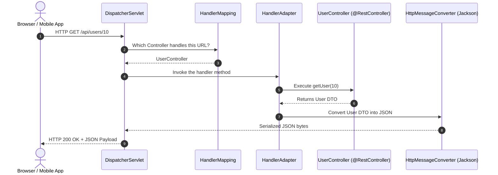

### Six Core Collaborators:
1. **`HandlerMapping`**: Maps URL to a specific handler method.
2. **`HandlerAdapter`**: Executes the handler method dynamically.
3. **`HandlerExceptionResolver`**: Maps exceptions to HTTP status codes / `@ExceptionHandler`.
4. **`HttpMessageConverter`**: Serializes/deserializes request and response bodies.
5. **`ViewResolver`**: Resolves view names to HTML templates (for MVC).
6. **`MultipartResolver`**: Handles file uploads.

---
## 26. Pagination, Sorting & Dynamic Filtering (JPA Criteria / Specifications)

> 💡 **Quick Revision Anchor (2-3 Words)**: `Database-Side Chunking`

Loading an entire table containing 500,000 rows into JVM memory will cause an `OutOfMemoryError`. Spring Data JPA supports database-level chunking using `Pageable`.

```java
// Controller
@GetMapping
public ResponseEntity<Page<ProductResponse>> getProducts(
        @RequestParam(defaultValue = "0") int page,
        @RequestParam(defaultValue = "20") int size,
        @RequestParam(defaultValue = "price,desc") String sort) {

    Pageable pageable = PageRequest.of(page, size, Sort.by("price").descending());
    return ResponseEntity.ok(productService.findAll(pageable));
}
```

### `Page<T>` vs. `Slice<T>`
- **`Page<T>`**: Executes **two SQL queries**: one to fetch the slice data (`LIMIT/OFFSET`), and a secondary `SELECT COUNT(*)` query to calculate total pages.
- **`Slice<T>`**: Fetches `LIMIT + 1` elements. Does **not** execute a count query. Ideal for mobile app infinite scrolling where total count is unnecessary.

### Dynamic Multi-Field Filtering via `Specification<T>`:
```java
public class ProductSpecifications {
    public static Specification<Product> hasCategory(String category) {
        return (root, query, cb) -> category == null ? null : cb.equal(root.get("category"), category);
    }

    public static Specification<Product> priceBetween(BigDecimal min, BigDecimal max) {
        return (root, query, cb) -> cb.between(root.get("price"), min, max);
    }
}

// In Service
Specification<Product> spec = Specification.where(ProductSpecifications.hasCategory("Electronics"))
                                           .and(ProductSpecifications.priceBetween(min, max));
Page<Product> results = productRepository.findAll(spec, pageable);
```

---
## 27. Object Mapping with MapStruct & DTO Pattern

> 💡 **Quick Revision Anchor (2-3 Words)**: `Compile-Time DTO Mapper`

### Why MapStruct?
Traditional reflection-based mappers (like ModelMapper) are slow at runtime. **MapStruct generates type-safe, plain Java code at compile time** with zero reflection overhead.

```java
@Mapper(componentModel = "spring")
public interface UserMapper {
    @Mapping(source = "user.contact.emailAddress", target = "email")
    UserResponse toResponse(User user);

    User toEntity(UserCreateRequest request);

    @AfterMapping
    default void setAuditFields(@MappingTarget User user) {
        user.setCreatedAt(Instant.now());
    }
}
```

---
## 28. Core Spring Boot Annotations Quick Reference

> 💡 **Quick Revision Anchor (2-3 Words)**: `Essential Annotation Cheat Sheet`

| Annotation | Category | What it does |
|---|---|---|
| `@Version` | JPA Concurrency | Enables **Optimistic Locking** to detect concurrent record updates. |
| `@CreatedDate` | JPA Auditing | Automatically populates row insertion timestamp. |
| `@Transient` | JPA Mapping | Ignores field; never persists it to the database table. |
| `@Transactional` | Spring Tx | Defines database transaction boundary. |
| `@CreationTimestamp` | Hibernate | Automatically sets creation timestamp. |
| `@UpdateTimestamp` | Hibernate | Automatically sets update timestamp on row update. |

---
## 29. Input Validation & Custom Validators (`@Valid`)

> 💡 **Quick Revision Anchor (2-3 Words)**: `Declarative Bean Validation`

### Creating a Custom Constraint Validator:
```java
@Target({ElementType.FIELD})
@Retention(RetentionPolicy.RUNTIME)
@Constraint(validatedBy = PhoneNumberValidator.class)
public @interface ValidPhoneNumber {
    String message() default "Invalid international phone number";
    Class<?>[] groups() default {};
    Class<? extends Payload>[] payload() default {};
}

public class PhoneNumberValidator implements ConstraintValidator<ValidPhoneNumber, String> {
    @Override
    public boolean isValid(String value, ConstraintValidatorContext context) {
        return value != null && value.matches("^\+[1-9]\d{1,14}$");
    }
}
```

---
## 30. Rapid-Fire Interview Questions & Answers

> 💡 **Quick Revision Anchor (2-3 Words)**: `10-Second Recall Answers`

1. **What is Spring Boot Auto-Configuration?** Automatically registers beans based on classpath dependencies.
2. **What is the default Spring bean scope?** `singleton`.
3. **Is Spring's singleton scope thread-safe?** No. Beans must be stateless.
4. **`@NotNull` vs `@NotBlank`?** `@NotNull` checks non-null; `@NotBlank` checks non-null, non-empty, and non-whitespace.
5. **Does `@Transactional` rollback checked exceptions?** No, only unchecked (`RuntimeException`). Use `rollbackFor = Exception.class`.
6. **What embedded servers does Spring Boot support?** Tomcat, Jetty, and Undertow.
7. **What is the N+1 problem?** 1 query for parent + N queries for children. Solved using `JOIN FETCH`.
8. **What does `@SpringBootApplication` combine?** `@Configuration`, `@EnableAutoConfiguration`, and `@ComponentScan`.
9. **How to solve circular dependencies?** Refactor architecture, use events, or `@Lazy` as a temporary fix.
10. **Why use constructor injection?** Immutability with `final`, explicit dependencies, and easy unit testing without reflection.

---
## 31. End-to-End Project Explanation Framework

> 💡 **Quick Revision Anchor (2-3 Words)**: `Resume Architecture Defense`

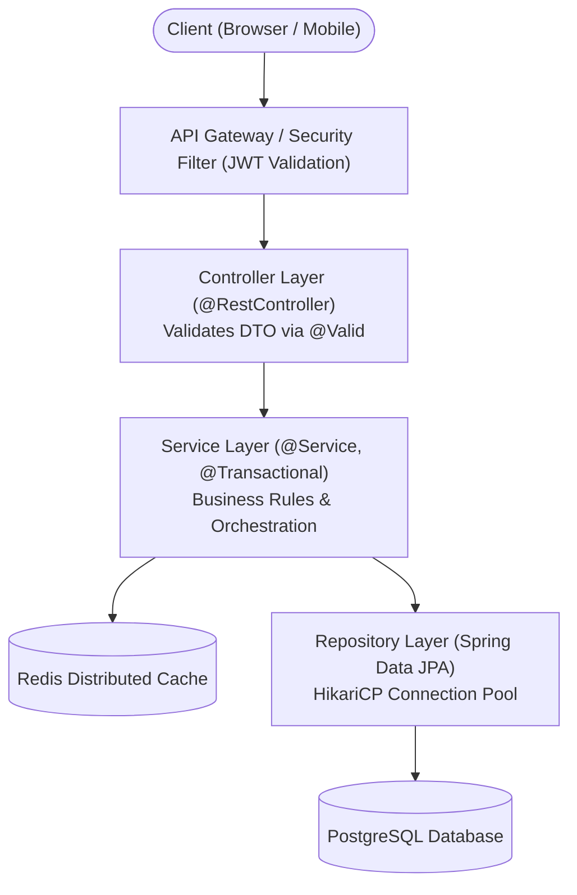

### Verbal Script Template for Placement Interviews:
> *"In my project, I engineered a scalable RESTful backend using Spring Boot 3 and Java 17. The architecture strictly follows industry best practices:*
> 1. *Incoming requests are intercepted by a custom `JwtAuthenticationFilter` that validates tokens and populates the `SecurityContextHolder`.*
> 2. *The **Controller Layer** exposes REST endpoints, enforces input validation via Bean Validation (`@Valid`), and returns structured responses using `ResponseEntity<T>`.*
> 3. *The **Service Layer** encapsulates core business logic and guarantees ACID transaction integrity using `@Transactional`.*
> 4. *The **Data Access Layer** leverages Spring Data JPA on top of PostgreSQL, utilizing `JOIN FETCH` queries to eliminate N+1 latency bottlenecks and HikariCP for high-throughput connection pooling.*
> 5. *Cross-cutting exceptions are intercepted centrally with `@RestControllerAdvice` returning RFC 7807 `ProblemDetail` payloads."*

---
## 32. High-Yield Topics Beyond the Playlist

---

### A. Spring Security & Stateless JWT Authentication

> 💡 **Quick Revision Anchor (2-3 Words)**: `Stateless Token Security`

In modern microservices and REST APIs, stateful HTTP sessions are replaced with stateless JSON Web Tokens (JWT).

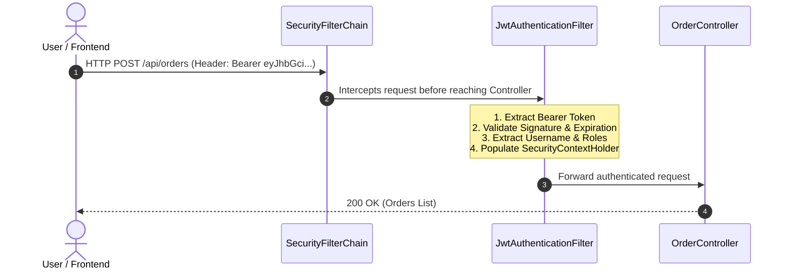

#### JWT Token Structure:
A JWT consists of 3 Base64URL-encoded parts separated by dots (`header.payload.signature`):
1. **Header**: Algorithm and token type (`{"alg": "HS256", "typ": "JWT"}`).
2. **Payload (Claims)**: Registered and custom claims (e.g. `sub` (username), `roles`, `iat`, `exp`).
3. **Signature**: Cryptographic hash created using secret key: `HMACSHA256(base64UrlEncode(header) + "." + base64UrlEncode(payload), secretKey)`.

#### JWT Generation & Validation Service:
```java
@Service
public class JwtService {
    private final String SECRET_KEY = "mySuperSecretSigningKeyThatIsAtLeast256BitsLongForHMACSHA256";

    public String generateToken(UserDetails userDetails) {
        Map<String, Object> claims = new HashMap<>();
        claims.put("roles", userDetails.getAuthorities().stream().map(GrantedAuthority::getAuthority).toList());
        return Jwts.builder()
            .setClaims(claims)
            .setSubject(userDetails.getUsername())
            .setIssuedAt(new Date(System.currentTimeMillis()))
            .setExpiration(new Date(System.currentTimeMillis() + 1000 * 60 * 60 * 2)) // 2 Hours
            .signWith(Keys.hmacShaKeyFor(SECRET_KEY.getBytes(StandardCharsets.UTF_8)), SignatureAlgorithm.HS256)
            .compact();
    }

    public String extractUsername(String token) {
        return extractAllClaims(token).getSubject();
    }

    public boolean isTokenValid(String token, UserDetails userDetails) {
        final String username = extractUsername(token);
        return (username.equals(userDetails.getUsername()) && !isTokenExpired(token));
    }

    private boolean isTokenExpired(String token) {
        return extractAllClaims(token).getExpiration().before(new Date());
    }

    private Claims extractAllClaims(String token) {
        return Jwts.parserBuilder()
            .setSigningKey(Keys.hmacShaKeyFor(SECRET_KEY.getBytes(StandardCharsets.UTF_8)))
            .build()
            .parseClaimsJws(token)
            .getBody();
    }
}
```

#### Spring Security 6 / Spring Boot 3 Configuration:
```java
@Configuration
@EnableWebSecurity
@RequiredArgsConstructor
public class SecurityConfig {

    private final JwtAuthenticationFilter jwtAuthFilter;

    @Bean
    public SecurityFilterChain securityFilterChain(HttpSecurity http) throws Exception {
        return http
            .csrf(csrf -> csrf.disable()) // Disabled for stateless APIs
            .sessionManagement(session -> session.sessionCreationPolicy(SessionCreationPolicy.STATELESS))
            .authorizeHttpRequests(auth -> auth
                .requestMatchers("/api/auth/**").permitAll()
                .requestMatchers("/api/admin/**").hasRole("ADMIN")
                .anyRequest().authenticated()
            )
            .addFilterBefore(jwtAuthFilter, UsernamePasswordAuthenticationFilter.class)
            .build();
    }
}
```

---

### B. JPA Relationships (`@OneToMany`, `@ManyToOne`) & Cascade Rules

> 💡 **Quick Revision Anchor (2-3 Words)**: `Entity Mapping & Ownership`

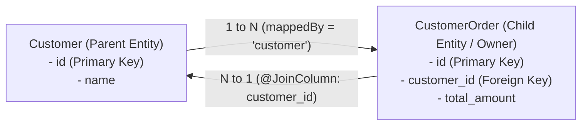

- **Ownership Rule**: The table with the foreign key column is **always the owner of the relationship**.
- **`mappedBy` Rule**: Belongs strictly on the inverse (parent) side. Points to the property name in the child entity. Forgetting `mappedBy` creates an unnecessary third join table!
- **`orphanRemoval = true`**: If a child entity is removed from the parent's collection, JPA automatically issues an SQL `DELETE` for the child row.
- **`CascadeType.ALL`**: Cascades all lifecycle events (`PERSIST`, `MERGE`, `REMOVE`, `REFRESH`, `DETACH`) from parent to child.

---

### C. Fetch Types: LAZY vs. EAGER & The N+1 Query Problem

> 💡 **Quick Revision Anchor (2-3 Words)**: `Solve With Join-Fetch`

### Default Fetch Types in JPA:
- **`@ManyToOne` / `@OneToOne`**: Defaults to **`EAGER`** (Loads associated entity immediately).  
  *Best Practice*: Always change to `FetchType.LAZY`!
- **`@OneToMany` / `@ManyToMany`**: Defaults to **`LAZY`** (Loads associated collection on demand).

### What is the N+1 Query Problem?
Suppose you fetch 10 Customers, and for each Customer, Hibernate executes an extra query to load their Orders:
- 1 Query to fetch 10 customers: `SELECT * FROM customers;`
- N Queries (10 queries) to fetch orders for each customer: `SELECT * FROM orders WHERE customer_id = ?;`
- **Total: 1 + 10 = 11 queries instead of 1 single query!**

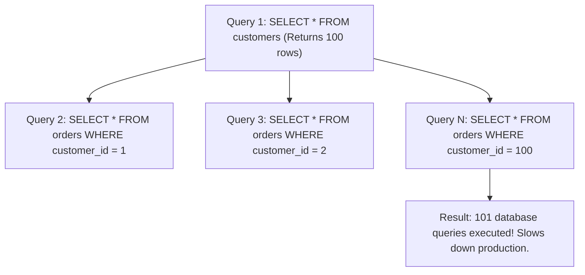

### The Three Solutions:
1. **`JOIN FETCH` in JPQL** (Most Popular):
   ```java
   @Query("SELECT c FROM Customer c JOIN FETCH c.orders")
   List<Customer> findAllWithOrders();
   ```
2. **`@EntityGraph`**:
   ```java
   @EntityGraph(attributePaths = {"orders"})
   List<Customer> findAll();
   ```
3. **`@BatchSize`**:
   ```java
   @BatchSize(size = 20)
   @OneToMany(mappedBy = "customer")
   private List<Order> orders;
   // Replaces N queries with IN query: SELECT * FROM orders WHERE customer_id IN (?, ?, ...)
   ```

#### ⚠️ The MultipleBagFetchException Trap (Common Interview Trap)
*"Can you solve the N+1 problem by `JOIN FETCH`ing two `@OneToMany` list collections simultaneously (e.g. `JOIN FETCH u.orders JOIN FETCH u.addresses`)?"*  
**Answer**: **NO!** Hibernate will throw `org.hibernate.loader.MultipleBagFetchException: cannot simultaneously fetch multiple bags`.  
**Why**: A `List` in Java represents a bag (an unordered collection that allows duplicates). Joining two bags creates a cartesian product of rows ($N 	imes M$), causing Hibernate to be unable to reconstruct the lists accurately.  
**Solutions**:
1. Change one or both collections from `List<T>` to `Set<T>`.
2. Fetch the first collection with `JOIN FETCH`, and configure `@BatchSize(size = 20)` on the second collection to fetch it efficiently in a separate second query without cartesian explosion.

---

### D. REST API Design & HTTP Idempotency

> 💡 **Quick Revision Anchor (2-3 Words)**: `Standard Verbs & Statuses`

| HTTP Verb | CRUD Action | Safe? | Idempotent? |
|---|---|---|---|
| **GET** | Read | ✅ Yes | ✅ Yes |
| **POST** | Create | ❌ No | ❌ No |
| **PUT** | Full Replace | ❌ No | ✅ Yes |
| **PATCH**| Partial Update| ❌ No | ❌ No |
| **DELETE**| Delete | ❌ No | ✅ Yes |

### Key Status Codes:
- **`200 OK`**: Request succeeded with body.
- **`201 Created`**: Resource created successfully (`POST`).
- **`204 No Content`**: Succeeded, but no response body (`DELETE`).
- **`400 Bad Request`**: Validation or syntax error.
- **`401 Unauthorized`**: Authentication missing or token invalid.
- **`403 Forbidden`**: Authenticated, but user lacks permissions (Role check failed).
- **`404 Not Found`**: Resource does not exist.
- **`409 Conflict`**: State conflict (e.g. duplicate email registration).
- **`500 Internal Server Error`**: Unhandled exception in server code.

---

### E. SQL & DBMS Essentials for Java Backend Interviews

> 💡 **Quick Revision Anchor (2-3 Words)**: `Joins, Indexing, ACID`

```mermaid
flowchart LR
    A["Table A (Users)"]
    B["Table B (Orders)"]

    A -->|"INNER JOIN: Matching Rows"| IJ["Matching Rows"]
    A -->|"LEFT JOIN: All Users + Matched Orders"| LJ["All Users + Orders (if any)"]
```

### Transaction Isolation Levels & Read Phenomena:
1. **READ UNCOMMITTED**: Allows **Dirty Reads** (reading uncommitted data).
2. **READ COMMITTED** *(Default in PostgreSQL/Oracle)*: Solves dirty reads; allows **Non-Repeatable Reads**.
3. **REPEATABLE READ** *(Default in MySQL InnoDB)*: Solves non-repeatable reads; can permit **Phantom Reads**.
4. **SERIALIZABLE**: Complete isolation via locking/MVCC. No anomalies, highest latency.

---

### F. Automated Testing with JUnit 5 & Mockito

> 💡 **Quick Revision Anchor (2-3 Words)**: `Unit Mocking vs Integration`

#### 1. Unit Testing with Mockito (`@Mock`, `@InjectMocks`):
Tests isolated business logic without starting a Spring application context (runs in milliseconds):
```java
@ExtendWith(MockitoExtension.class)
class UserServiceTest {
    @Mock private UserRepository userRepository;
    @InjectMocks private UserService userService;

    @Test
    void shouldReturnUserWhenIdExists() {
        when(userRepository.findById(1L)).thenReturn(Optional.of(new User(1L, "Alice")));
        User user = userService.getUser(1L);
        assertNotNull(user);
        assertEquals("Alice", user.getName());
        verify(userRepository, times(1)).findById(1L);
    }
}
```

#### 2. Repository Slice Testing with `@DataJpaTest`:
Tests only JPA entities, repository interfaces, and Hibernate queries with an in-memory embedded H2 database:
```java
@DataJpaTest
class UserRepositoryTest {

    @Autowired
    private UserRepository userRepository;

    @Test
    void shouldSaveAndFindUserByEmail() {
        User user = new User("Alice", "alice@example.com");
        userRepository.save(user);

        Optional<User> found = userRepository.findByEmail("alice@example.com");

        assertTrue(found.isPresent());
        assertEquals("Alice", found.get().getName());
    }
}
```

#### 3. Controller Slice Testing with `@WebMvcTest` and `MockMvc`:
Tests only the web layer (HTTP routing, JSON serialization, security, and `@Valid` validations) while mocking out the service layer:
```java
@WebMvcTest(UserController.class)
class UserControllerTest {

    @Autowired
    private MockMvc mockMvc;

    @MockBean
    private UserService userService;

    @Test
    void shouldReturn200AndUserJson() throws Exception {
        when(userService.getUser(1L)).thenReturn(new User(1L, "Alice"));

        mockMvc.perform(get("/api/users/1")
                .contentType(MediaType.APPLICATION_JSON))
            .andExpect(status().isOk())
            .andExpect(jsonPath("$.name").value("Alice"));
    }
}
```

---

### G. Maven Build Lifecycle & Dependency Scopes

> 💡 **Quick Revision Anchor (2-3 Words)**: `Build Lifecycle Phases`

```mermaid
flowchart LR
    Clean["mvn clean
(Deletes target/)"]
    Compile["compile
(Compiles src/)"]
    Test["test
(Runs JUnit)"]
    Package["package
(Builds JAR)"]
    Install["install
(Copies to ~/.m2)"]

    Compile --> Test --> Package --> Install
```

### Maven Dependency Scopes:
- **`compile`** *(Default)*: Available in compilation, test, and runtime.
- **`provided`**: Required to compile, but provided by JDK/container at runtime (e.g., `lombok`).
- **`runtime`**: Not needed for compile; needed at runtime (e.g., `postgresql` driver).
- **`test`**: Only used for tests (e.g., `spring-boot-starter-test`). Never packaged into the production JAR.

---

## 33. 1-Page Master Revision Cheat Sheet

```
==================================================================================================
                            SPRING BOOT MASTER INTERVIEW CHEAT SHEET
==================================================================================================

1. CORE INVERSION OF CONTROL (IoC) & DI:
   - IoC: Spring manages object creation, configuration, and destruction.
   - DI: Spring injects required objects into classes. Prefer Constructor Injection for immutability.

2. STEREOTYPES:
   - @RestController = @Controller + @ResponseBody (Writes JSON directly to response).
   - @Service        = Business logic boundary.
   - @Repository     = Database DAO; automatically translates SQL exceptions to DataAccessException.
   - @Component      = Generic Spring-managed bean.

3. SPRING BOOT MAGIC:
   - @SpringBootApplication = @Configuration + @EnableAutoConfiguration + @ComponentScan.
   - Starters = Curated POM dependency aggregators.
   - Actuator = Production health & metrics (/actuator/health).

4. TRANSACTION MANAGEMENT:
   - @Transactional: Opens proxy, starts DB transaction, commits on success, rollbacks on RuntimeException.
   - REQUIRED (Default): Join existing transaction or create new one.
   - REQUIRES_NEW: Suspend existing transaction and always start an independent new one.

5. DATABASE & PERSISTENCE:
   - Hierarchy: JDBC (Raw SQL API) -> JPA (Specification) -> Hibernate (ORM Engine) -> Spring Data JPA.
   - N+1 Query Bug: 1 query for parent + N queries for children. Solved using `JOIN FETCH`.
   - Relationships: Child table with FK is the owner; parent table must declare `mappedBy`.

6. MVC FLOW & HTTP:
   - Client -> Servlet Filter -> DispatcherServlet (Front Controller) -> Interceptor -> @RestController.
   - @PathVariable = /users/{id} (Part of URI resource).
   - @RequestParam = /users?page=1 (Query parameters).
   - ResponseEntity<T> = Complete HTTP control (status, headers, body).

7. SECURITY & ERROR HANDLING:
   - JWT: Stateless token authentication verified by a custom OncePerRequestFilter before Controller.
   - @RestControllerAdvice + @ExceptionHandler: Centralized application exception interception.
==================================================================================================
```
