# 🍃 Spring Boot — Complete Placement & Technical Interview Master Guide

> **Target Audience**: Fresher / Entry-Level Java Backend Engineers, SWE / SDE Candidates.  
> **Source Foundation**: Curated from The Curious Coder Java Spring Boot Interview Series + High-Yield Placement Deep Dives.  
> **Core Focus**: Intuitive explanations, clear architectural diagrams (Mermaid), real-world Java 17 / Spring Boot 3 code snippets, 2-3 word memory hooks, and equal, in-depth coverage of all core topics and beyond-the-playlist essentials (Spring Security, JPA Relationships, N+1 Query Problem, Testing, Maven, and SQL).

---

## 📑 Table of Contents

- [1. Inversion of Control (IoC) & Dependency Injection (DI)](#1-inversion-of-control-ioc--dependency-injection-di)
- [2. `@RestController` vs. `@Controller`](#2-restcontroller-vs-controller)
- [3. Stereotype Annotations: `@RestController` vs. `@Service` vs. `@Repository` vs. `@Component`](#3-stereotype-annotations-restcontroller-vs-service-vs-repository-vs-component)
- [4. Spring Boot & Starters](#4-spring-boot--starters)
- [5. Spring Framework vs. Spring Boot](#5-spring-framework-vs-spring-boot)
- [6. `@SpringBootApplication` Internals](#6-springbootapplication-internals)
- [7. Spring Boot Actuator](#7-spring-boot-actuator)
- [8. Global Exception Handling (`@RestControllerAdvice`)](#8-global-exception-handling-restcontrolleradvice)
- [9. Project Lombok in Spring Boot](#9-project-lombok-in-spring-boot)
- [10. Spring Bean Scopes](#10-spring-bean-scopes)
- [11. Request Scope vs. Session Scope](#11-request-scope-vs-session-scope)
- [12. Spring Profiles (Multi-Environment Setup)](#12-spring-profiles-multi-environment-setup)
- [13. `application.properties` vs. `application.yaml`](#13-applicationproperties-vs-applicationyaml)
- [14. Property Injection: `@Value` vs. `@ConfigurationProperties` vs. `Environment`](#14-property-injection-value-vs-configurationproperties-vs-environment)
- [15. Persistence Stack: JDBC vs. Hibernate vs. JPA vs. Spring Data JPA](#15-persistence-stack-jdbc-vs-hibernate-vs-jpa-vs-spring-data-jpa)
- [16. `@Transactional` Mechanics](#16-transactional-mechanics)
- [17. Transaction Propagation](#17-transaction-propagation)
- [18. Bean Disambiguation: `@Primary` vs. `@Qualifier`](#18-bean-disambiguation-primary-vs-qualifier)
- [19. Injection Types: Constructor vs. Setter vs. Field Injection](#19-injection-types-constructor-vs-setter-vs-field-injection)
- [20. `@Lookup` Annotation (Singleton with Prototype Dependency)](#20-lookup-annotation-singleton-with-prototype-dependency)
- [21. Servlet Filters vs. Spring MVC Interceptors](#21-servlet-filters-vs-spring-mvc-interceptors)
- [22. Cyclic Dependencies & `@Lazy`](#22-cyclic-dependencies--lazy)
- [23. `@PathVariable` vs. `@RequestParam`](#23-pathvariable-vs-requestparam)
- [24. `ResponseEntity<T>`](#24-responseentityt)
- [25. `DispatcherServlet` & Spring MVC Request Flow](#25-dispatcherservlet--spring-mvc-request-flow)
- [26. Pagination, Sorting & Filtering](#26-pagination-sorting--filtering)
- [27. Object Mapping with MapStruct & DTO Pattern](#27-object-mapping-with-mapstruct--dto-pattern)
- [28. Core Spring Boot Annotations Quick Reference](#28-core-spring-boot-annotations-quick-reference)
- [29. Input Validation & `@Valid`](#29-input-validation--valid)
- [30. Rapid-Fire Interview Questions & Answers](#30-rapid-fire-interview-questions--answers)
- [31. End-to-End Project Explanation Framework](#31-end-to-end-project-explanation-framework)
- [32. High-Yield Topics Beyond the Playlist](#32-high-yield-topics-beyond-the-playlist)
  - [A. Spring Security & Stateless JWT Authentication](#a-spring-security--stateless-jwt-authentication)
  - [B. JPA Relationships (`@OneToMany`, `@ManyToOne`) & Cascade Rules](#b-jpa-relationships-onetomany-manytoone--cascade-rules)
  - [C. Fetch Types: LAZY vs. EAGER & The N+1 Query Problem](#c-fetch-types-lazy-vs-eager--the-n1-query-problem)
  - [D. REST API Design & HTTP Idempotency](#d-rest-api-design--http-idempotency)
  - [E. SQL & DBMS Essentials for Java Backend Interviews](#e-sql--dbms-essentials-for-java-backend-interviews)
  - [F. Automated Testing with JUnit 5 & Mockito](#f-automated-testing-with-junit-5--mockito)
  - [G. Maven Build Lifecycle & Dependency Scopes](#g-maven-build-lifecycle--dependency-scopes)
- [33. 1-Page Master Revision Cheat Sheet](#33-1-page-master-revision-cheat-sheet)

---

## 1. Inversion of Control (IoC) & Dependency Injection (DI)

> 💡 **Quick Revision Anchor (2-3 Words)**: `Spring Controls Objects`

### What is IoC (Inversion of Control)?
In standard Java programming, if class `OrderService` needs `PaymentService`, it creates it directly using the `new` keyword:
```java
// Traditional Java (Tight Coupling)
class OrderService {
    private PaymentService paymentService = new PaymentService(); // OrderService controls creation
}
```
**Inversion of Control (IoC)** is an architectural principle where the control of object creation, configuration, and lifecycle management is transferred from the application code to an external container—the **Spring IoC Container**.

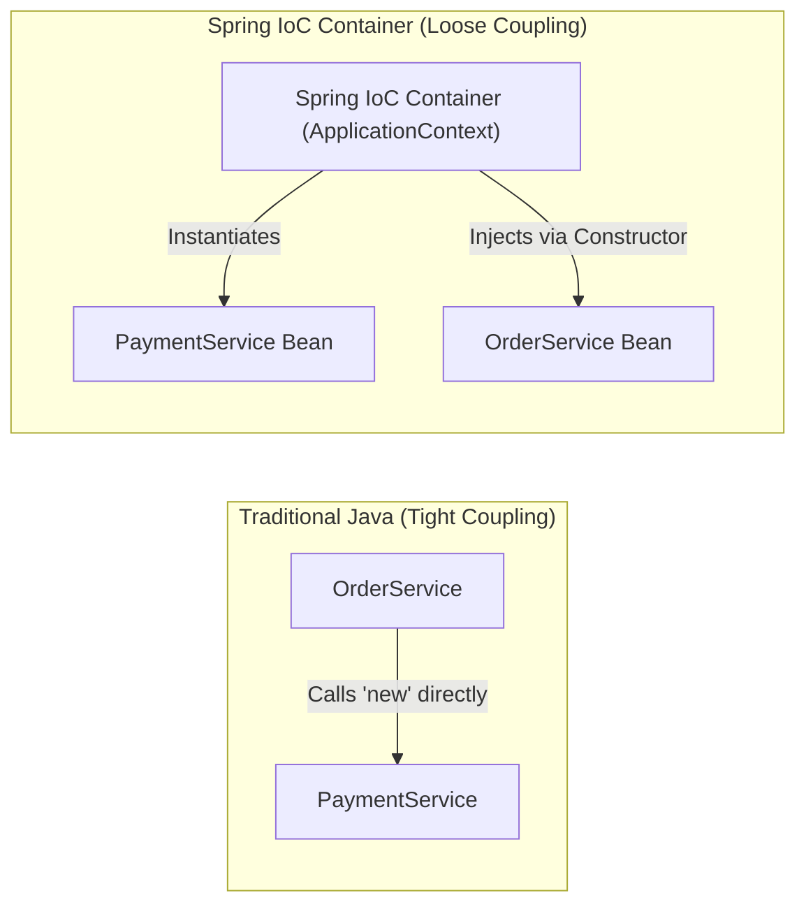

### What is Dependency Injection (DI)?
**Dependency Injection** is the concrete design pattern used to implement IoC. Instead of an object searching for its dependencies, the Spring container **injects** the required dependencies into the object at runtime.

```java
// Spring IoC (Loose Coupling via Dependency Injection)
@Service
public class OrderService {
    private final PaymentService paymentService;

    // Spring automatically supplies PaymentService here
    public OrderService(PaymentService paymentService) {
        this.paymentService = paymentService;
    }
}
```

### The Spring IoC Container (`ApplicationContext`)
The Spring container is the runtime engine that:
1. Scans your codebase for bean definitions (`@Component`, `@Service`, `@Bean`).
2. Instantiates objects (called **Spring Beans**).
3. Resolves and wires dependencies between beans.
4. Manages the complete lifecycle (initialization to destruction).

The primary interface representing the container is **`ApplicationContext`**.

> [!TIP]
> **1-Sentence Interview Answer**:  
> *"IoC is the principle of transferring object lifecycle management from manual application code to the Spring container; Dependency Injection is the mechanism Spring uses to inject those managed objects into dependent classes."*

---

## 2. `@RestController` vs. `@Controller`

> 💡 **Quick Revision Anchor (2-3 Words)**: `JSON vs HTML-Views`

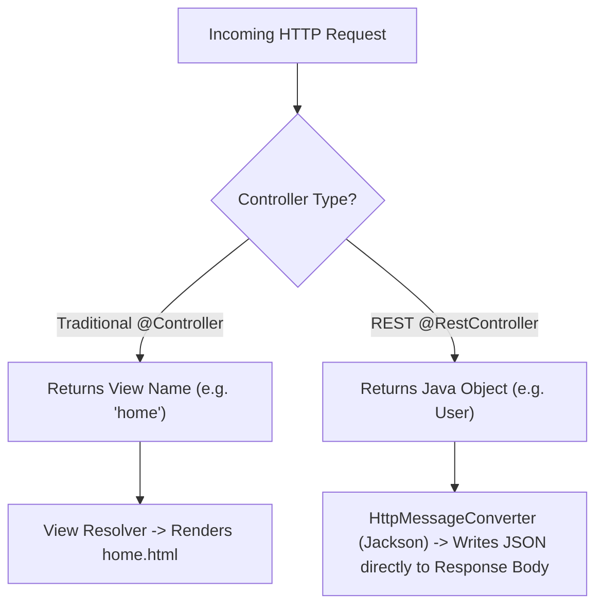

### Comparison Matrix

| Dimension | `@Controller` | `@RestController` |
|---|---|---|
| **Primary Purpose** | Traditional MVC web apps rendering HTML web pages. | Modern RESTful APIs serving raw data (JSON / XML). |
| **Return Value** | Treated as a **view name** (resolved by a `ViewResolver` to a JSP/Thymeleaf template). | Written directly to the **HTTP response body** as JSON. |
| **Composition** | Base stereotype annotation. | `@RestController = @Controller + @ResponseBody` |
| **Returning JSON?** | Requires explicit `@ResponseBody` on each method. | Automatically enabled for **all** handler methods. |

### Code Comparison
```java
// 1. Traditional MVC Controller
@Controller
public class WebPageController {
    @GetMapping("/home")
    public String renderHomePage() {
        return "home"; // Renders home.html or home.jsp
    }
}

// 2. REST API Controller
@RestController
@RequestMapping("/api/users")
public class UserApiController {
    @GetMapping("/{id}")
    public User getUser(@PathVariable Long id) {
        return userService.findById(id); // Jackson serializes User object directly into JSON
    }
}
```

---

## 3. Stereotype Annotations: `@RestController` vs. `@Service` vs. `@Repository` vs. `@Component`

> 💡 **Quick Revision Anchor (2-3 Words)**: `Layered Component Roles`

All four annotations tell Spring: *"This class is a Spring Bean—manage its lifecycle."* However, using specific stereotypes provides architectural clarity and enables specialized framework features.

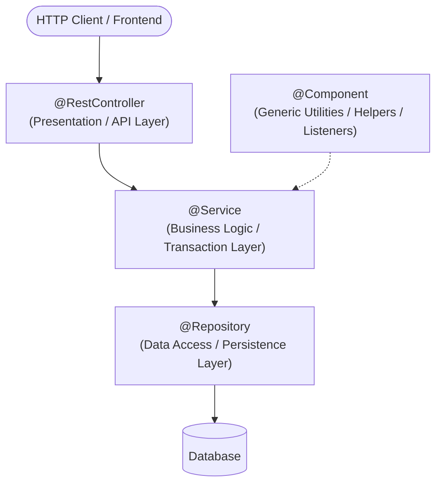

| Annotation | Layer | Special Framework Behavior |
|---|---|---|
| **`@RestController`** | Presentation / API Layer | Handles HTTP requests, parses JSON, and binds responses. |
| **`@Service`** | Business Logic Layer | Communicates business intent; common target for `@Transactional` boundaries. |
| **`@Repository`** | Data Access / DAO Layer | Interacts with databases. **Crucial**: Automatically translates low-level database exceptions (e.g., `SQLException`) into Spring's unified `DataAccessException` hierarchy. |
| **`@Component`** | Generic Utility Layer | Generic stereotype for any Spring-managed component that does not fit into the other three layers (e.g., mail senders, background processors). |

> [!IMPORTANT]
> **Interview Question**: *"Why not annotate every class with `@Component`?"*  
> **Answer**: *"While technically valid, using specialized stereotypes communicates the architectural intent of the class, allows team members to navigate layers easily, and enables framework-specific behavior—such as automatic persistence exception translation with `@Repository`."*

---

## 4. Spring Boot & Starters

> 💡 **Quick Revision Anchor (2-3 Words)**: `Curated Dependency Bundles`

### What is Spring Boot?
Spring Boot is an extension of the Spring Framework designed to eliminate boilerplate configuration and streamline production-ready application development through:
1. **Auto-Configuration**: Guesses configuration based on jar dependencies on the classpath.
2. **Starter Dependencies**: Curated dependency aggregators.
3. **Embedded Web Servers**: Tomcat, Jetty, or Undertow packaged directly inside the executable JAR.
4. **Production Metrics**: Ready-to-use health checks and metrics via Actuator.

### What is a Spring Boot Starter?
A **Starter** is a convenient dependency descriptor (`pom.xml`) that bundles all compatible, version-aligned libraries needed for a specific capability. You add one starter rather than hunting down 10 individual Maven coordinates.

```xml
<!-- Brings in Spring MVC, REST support, Jackson JSON, and Embedded Tomcat -->
<dependency>
    <groupId>org.springframework.boot</groupId>
    <artifactId>spring-boot-starter-web</artifactId>
</dependency>

<!-- Brings in Hibernate, Spring Data JPA, HikariCP Connection Pool, and JDBC -->
<dependency>
    <groupId>org.springframework.boot</groupId>
    <artifactId>spring-boot-starter-data-jpa</artifactId>
</dependency>
```

---

## 5. Spring Framework vs. Spring Boot

> 💡 **Quick Revision Anchor (2-3 Words)**: `Core vs Automated`

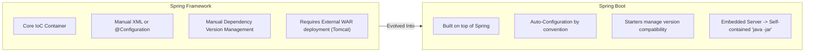

| Dimension | Spring Framework | Spring Boot |
|---|---|---|
| **Goal** | Provides the core dependency injection and enterprise features. | Eliminates configuration overhead and speeds up development. |
| **Configuration** | Heavy boilerplate (XML files or extensive Java `@Configuration` classes). | Opinionated auto-configuration ("convention over configuration"). |
| **Server Deployment** | Packaged as `.war` and deployed to an external application server (Tomcat/JBoss). | Generates standalone `.jar` with an **embedded server** (Tomcat runs via `java -jar app.jar`). |
| **Dependency Management** | Developer manually specifies individual artifact versions and resolves version conflicts. | **Starters** manage coordinated, tested dependency versions automatically. |

---

## 6. `@SpringBootApplication` Internals

> 💡 **Quick Revision Anchor (2-3 Words)**: `Three-in-One Bootstrap`

The entry point of every Spring Boot app is annotated with `@SpringBootApplication`:
```java
@SpringBootApplication
public class Application {
    public static void main(String[] args) {
        SpringApplication.run(Application.class, args);
    }
}
```

`@SpringBootApplication` is a meta-annotation that bundles **three essential annotations**:

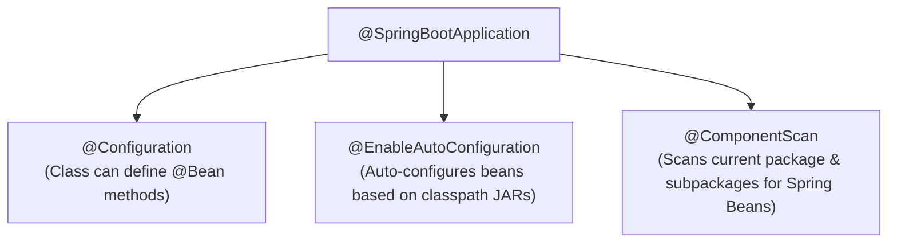

1. **`@Configuration`**: Marks the class as a configuration class capable of declaring `@Bean` factory methods.
2. **`@EnableAutoConfiguration`**: Instructs Spring Boot to examine classpath libraries and intelligently configure beans (e.g., if `h2.jar` is found, it automatically provisions an in-memory database).
3. **`@ComponentScan`**: Recursively scans the package of the main class and all its subpackages to discover and register `@Component`, `@Service`, `@Repository`, and `@RestController` beans.

> [!WARNING]
> **Placement Gotcha**: If you create a service in package `com.example.service` while your `@SpringBootApplication` class is in `com.example.app`, Spring will **never find your service** unless you explicitly adjust `@ComponentScan`. Always place your main class in the root parent package!

---

## 7. Spring Boot Actuator

> 💡 **Quick Revision Anchor (2-3 Words)**: `Production Health Monitoring`

Spring Boot Actuator provides built-in HTTP endpoints to monitor and inspect application health, runtime metrics, and environment details in production.

```xml
<dependency>
    <groupId>org.springframework.boot</groupId>
    <artifactId>spring-boot-starter-actuator</artifactId>
</dependency>
```

### Key Actuator Endpoints:
- **`/actuator/health`**: Returns basic application status (`{"status": "UP"}`), database connectivity, and disk space.
- **`/actuator/info`**: Exposes arbitrary application metadata (build version, git commit details).
- **`/actuator/metrics`**: Displays JVM memory usage, active thread counts, and garbage collection stats.

```properties
# Exposing endpoints in application.properties
management.endpoints.web.exposure.include=health,info,metrics
# Showing full component health details
management.endpoint.health.show-details=always
```

> [!CAUTION]
> **Security Rule**: In production, never expose sensitive endpoints like `/actuator/env` or `/actuator/beans` publicly without securing them behind Spring Security or internal firewalls.

---

## 8. Global Exception Handling (`@RestControllerAdvice`)

> 💡 **Quick Revision Anchor (2-3 Words)**: `Centralized Error Interceptor`

Without centralized exception handling, controllers end up cluttered with repetitive `try-catch` blocks. Spring provides `@RestControllerAdvice` and `@ExceptionHandler` to intercept exceptions across all controllers in a clean, decoupled manner.

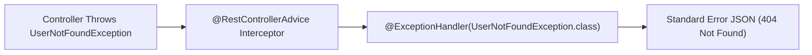

### Production Implementation
```java
// 1. Custom Business Exception
public class UserNotFoundException extends RuntimeException {
    public UserNotFoundException(String message) {
        super(message);
    }
}

// 2. Structured Error Response DTO
public record ErrorResponse(
    LocalDateTime timestamp,
    int status,
    String error,
    String message,
    String path
) {}

// 3. Centralized Controller Advice
@RestControllerAdvice
public class GlobalExceptionHandler {

    @ExceptionHandler(UserNotFoundException.class)
    public ResponseEntity<ErrorResponse> handleUserNotFound(UserNotFoundException ex, HttpServletRequest request) {
        ErrorResponse error = new ErrorResponse(
            LocalDateTime.now(),
            HttpStatus.NOT_FOUND.value(),
            "USER_NOT_FOUND",
            ex.getMessage(),
            request.getRequestURI()
        );
        return new ResponseEntity<>(error, HttpStatus.NOT_FOUND);
    }
}
```

---

## 9. Project Lombok in Spring Boot

> 💡 **Quick Revision Anchor (2-3 Words)**: `Boilerplate Code Reducer`

Lombok uses compile-time annotation processing to automatically generate getters, setters, constructors, builders, and `toString` methods into bytecode, keeping Java source files compact.

### Most Common Lombok Annotations:
- **`@Getter` / `@Setter`**: Generates getters and setters for all fields.
- **`@NoArgsConstructor`**: Generates a default parameterless constructor (required by Hibernate/JPA).
- **`@AllArgsConstructor`**: Generates a constructor with one parameter for each field.
- **`@RequiredArgsConstructor`**: Generates a constructor specifically for all `final` fields (ideal for constructor-based dependency injection).
- **`@Builder`**: Implements the clean GoF Builder pattern for object creation.

```java
@Service
@RequiredArgsConstructor // Automatically generates constructor for all final fields!
public class UserService {
    private final UserRepository userRepository; // Injected without manual constructor!
}
```

> [!WARNING]
> **JPA Entity Warning**: Avoid using `@Data` on JPA `@Entity` classes. `@Data` generates `equals()`, `hashCode()`, and `toString()`, which can trigger circular references, break Hibernate proxy equality, and inadvertently trigger lazy-loading queries. Use `@Getter` and `@Setter` on entities instead.

---

## 10. Spring Bean Scopes

> 💡 **Quick Revision Anchor (2-3 Words)**: `Bean Lifecycle Duration`

A bean's scope defines its lifecycle and how instances are shared across the application.

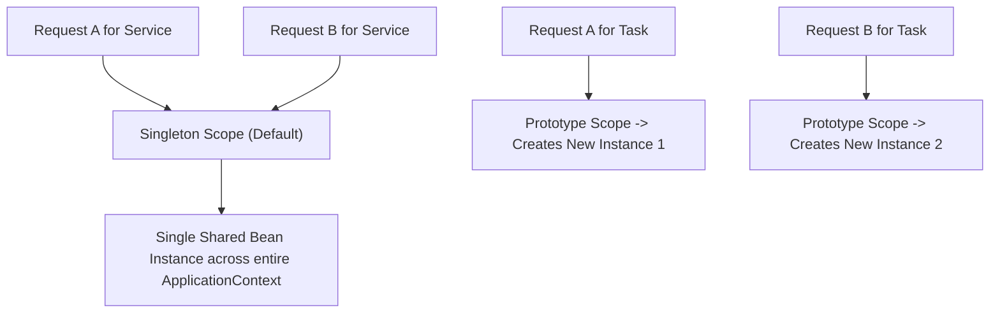

| Scope | Description | Use Case |
|---|---|---|
| **`singleton`** *(Default)* | Exactly **one** instance created per Spring IoC Container. Shared across all callers. | Stateless services (`@Service`), controllers, repositories. |
| **`prototype`** | A **new** instance is created every time the bean is requested from the container. | Stateful objects or non-thread-safe task runners. |
| **`request`** | One instance per HTTP request (Web applications). | User audit logging, request tracing tokens. |
| **`session`** | One instance per HTTP session. | E-commerce shopping cart, user session state. |
| **`application`** | One instance per `ServletContext`. | Application-wide global web cache. |

---

## 11. Request Scope vs. Session Scope

> 💡 **Quick Revision Anchor (2-3 Words)**: `Per-Request vs Per-User`

Both scopes exist strictly within web-aware Spring application contexts:

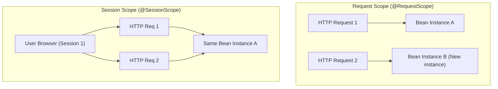

- **`@RequestScope`**: Created when an HTTP request arrives, destroyed when the HTTP response completes. Ideal for tracking unique request IDs or multi-tenant customer IDs.
- **`@SessionScope`**: Persists across multiple HTTP requests originating from the same client session (tracked via `JSESSIONID` cookie). Ideal for shopping carts or login state in stateful applications.

---

## 12. Spring Profiles (Multi-Environment Setup)

> 💡 **Quick Revision Anchor (2-3 Words)**: `Environment-Specific Config`

Profiles let you segregate configuration across environments (e.g., `dev`, `test`, `prod`) without touching source code.

### Configuration Files:
- `application.properties` (Common base configuration)
- `application-dev.properties` (Local development: H2 or local Postgres)
- `application-prod.properties` (Production: AWS RDS, real credentials)

### Activating a Profile:
```properties
# In application.properties:
spring.profiles.active=dev
```
Or via CLI argument at launch:
```bash
java -jar app.jar --spring.profiles.active=prod
```

### Conditional Bean Loading with `@Profile`:
```java
@Service
@Profile("dev")
public class MockEmailService implements EmailService {
    public void sendEmail(String to) { System.out.println("Dev: Simulated email to " + to); }
}

@Service
@Profile("prod")
public class SmtpEmailService implements EmailService {
    public void sendEmail(String to) { /* Connects to real AWS SES / SendGrid */ }
}
```

---

## 13. `application.properties` vs. `application.yaml`

> 💡 **Quick Revision Anchor (2-3 Words)**: `Flat vs Hierarchical`

Both formats store external application configuration. Neither provides superior runtime performance, but YAML is preferred for hierarchical clarity.

### Side-by-Side Comparison:

#### `application.properties` (Flat keys)
```properties
server.port=8080
spring.datasource.url=jdbc:postgresql://localhost:5432/career_os
spring.datasource.username=postgres
spring.datasource.password=secret
```

#### `application.yaml` (Hierarchical structure)
```yaml
server:
  port: 8080

spring:
  datasource:
    url: jdbc:postgresql://localhost:5432/career_os
    username: postgres
    password: secret
```

---

## 14. Property Injection: `@Value` vs. `@ConfigurationProperties` vs. `Environment`

> 💡 **Quick Revision Anchor (2-3 Words)**: `Injecting Config Values`

| Approach | Best Use Case | Type Safety | Relaxed Binding |
|---|---|---|---|
| **`@Value`** | Injecting 1 or 2 isolated primitive properties. | ❌ No (String based) | ❌ No |
| **`@ConfigurationProperties`** | Grouping a related tree of structured properties (e.g., mail server or payment gateway settings). | ✅ Full Type-Safety | ✅ Yes (handles camelCase, kebab-case) |
| **`Environment`** | Programmatically querying properties dynamically at runtime. | ❌ Manual cast | ❌ No |

### Code Demonstration
```java
// Approach 1: @Value
@Value("${app.jwt.secret}")
private String jwtSecret;

// Approach 2: @ConfigurationProperties (Enterprise Standard)
@Component
@ConfigurationProperties(prefix = "app.payment")
@Getter @Setter
public class PaymentProperties {
    private String apiKey;
    private String secretKey;
    private int timeoutMs;
}
```

---

## 15. Persistence Stack: JDBC vs. Hibernate vs. JPA vs. Spring Data JPA

> 💡 **Quick Revision Anchor (2-3 Words)**: `Database Abstraction Layers`

Candidates often confuse these four terms. Understand the exact hierarchy:

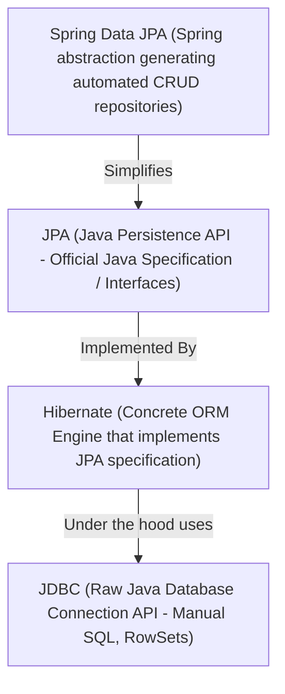

1. **JDBC (Java Database Connectivity)**: The lowest-level Java standard library for talking to databases. You write raw SQL strings, manually open connections, and loop through `ResultSet` cursors. Lots of boilerplate.
2. **JPA (Java Persistence API / Jakarta Persistence)**: A **standard specification** (a collection of interfaces like `EntityManager`, annotations like `@Entity`, `@Table`) defining how ORMs should behave. It contains *no actual implementation code*.
3. **Hibernate**: The popular **Object-Relational Mapping (ORM) framework** that provides a complete, battle-tested implementation of the JPA specification. It maps Java objects to database rows.
4. **Spring Data JPA**: A high-level library from Spring that sits on top of JPA/Hibernate. It eliminates boilerplate DAO implementations by allowing you to define simple interfaces (`UserRepository extends JpaRepository<User, Long>`) where Spring automatically generates standard CRUD queries and dynamic finders (`findByNameContaining`) at runtime.

---

## 16. `@Transactional` Mechanics

> 💡 **Quick Revision Anchor (2-3 Words)**: `All-or-Nothing ACID`

### What is `@Transactional`?
`@Transactional` guarantees that a series of database operations execute within a single transactional boundary following ACID rules: **either all operations succeed (COMMIT) or if any error occurs, all changes are undone (ROLLBACK)**.

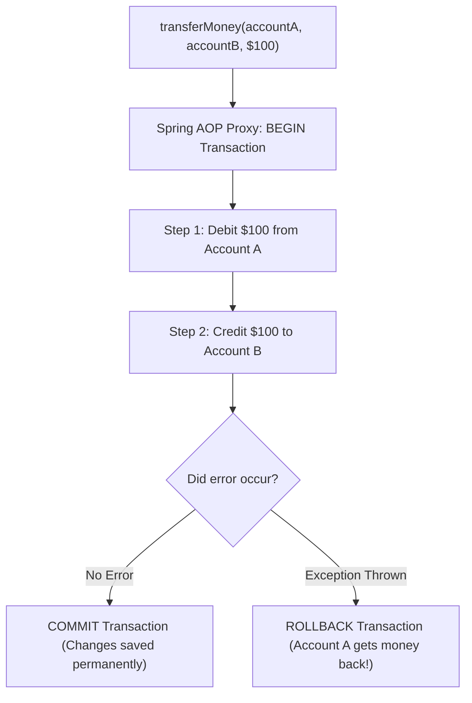

### Under the Hood: Spring AOP Proxies
`@Transactional` is powered by **Spring AOP (Aspect-Oriented Programming)**. When Spring discovers `@Transactional` on a class or method:
1. Spring creates a dynamic **Proxy wrapper** around your bean.
2. When an external caller invokes the method, the proxy intercepts the call.
3. The proxy opens a database connection transaction.
4. The proxy executes your target business method.
5. If the method finishes cleanly, the proxy commits the transaction.
6. If an unchecked exception (`RuntimeException` or `Error`) is thrown, the proxy commands a rollback.

> [!CAUTION]
> **Placement Interview Trap**:  
> *"If method A calls method B within the same service class, and method B has `@Transactional`, will the transaction work?"*  
> **Answer**: **NO!** Because the call is an internal `this.methodB()` invocation, it bypasses the Spring AOP Proxy wrapper completely! The proxy never gets the chance to start a transaction.

---

## 17. Transaction Propagation

> 💡 **Quick Revision Anchor (2-3 Words)**: `Transaction Boundary Rules`

Transaction propagation determines what happens when a transactional method is called by another method that already has an active transaction.

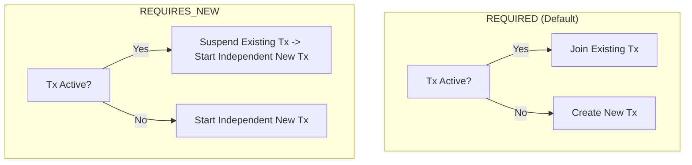

| Propagation Level | Meaning & Behavior | Common Interview Use Case |
|---|---|---|
| **`REQUIRED`** *(Default)* | If a transaction exists, **joins it**; otherwise, creates a new one. | Standard business operations where steps should commit or rollback together. |
| **`REQUIRES_NEW`** | **Always starts a brand-new transaction**. If one is currently running, suspends it until the new one finishes. | **Audit logging** or payment attempts: you want the audit record saved even if the outer business transaction fails and rolls back! |
| **`SUPPORTS`** | If a transaction exists, runs within it; otherwise executes non-transactionally. | Read-only operations. |
| **`MANDATORY`** | Must be called within an existing transaction; otherwise throws an exception. | Sub-methods that cannot safely execute without an established transaction. |
| **`NOT_SUPPORTED`** | Always executes non-transactionally; suspends any active transaction. | Long-running I/O or network API calls that should not hold open database locks. |
| **`NEVER`** | Must never run inside a transaction; throws an exception if one exists. | Tasks forbidden from running in transactions. |

---

## 18. Bean Disambiguation: `@Primary` vs. `@Qualifier`

> 💡 **Quick Revision Anchor (2-3 Words)**: `Default vs Explicit Bean`

When two or more beans implement the exact same interface, Spring cannot guess which one to inject and throws a `NoUniqueBeanDefinitionException`.

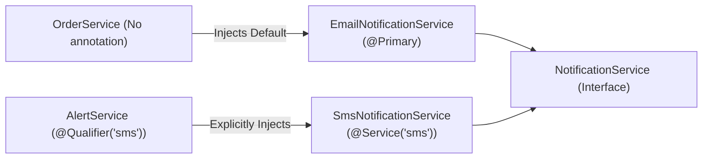

- **`@Primary`**: Marks one implementation as the **default choice** when no specific bean name is requested.
- **`@Qualifier("beanName")`**: Provides **explicit selection** at the injection point by specifying the exact bean identifier.

> [!NOTE]
> **Precedence Rule**: If a class uses `@Qualifier("smsService")`, it **overrides** any bean marked with `@Primary`.

---

## 19. Injection Types: Constructor vs. Setter vs. Field Injection

> 💡 **Quick Revision Anchor (2-3 Words)**: `Always Prefer Constructor`

### Comparison of the 3 Injection Styles:

#### 1. Constructor Injection (✅ Industry Best Practice)
```java
@Service
public class OrderService {
    private final PaymentService paymentService;

    public OrderService(PaymentService paymentService) {
        this.paymentService = paymentService;
    }
}
```
- **Why it wins**:
  - Allows fields to be declared **`final`** (ensuring true object immutability and thread safety).
  - Prevents `NullPointerException` because the object cannot be instantiated without its mandatory dependencies.
  - Trivial to test in pure JUnit tests without needing Spring test contexts or reflection hacks.

#### 2. Setter Injection (Use only for optional dependencies)
```java
@Service
public class NotificationService {
    private EmailGateway emailGateway;

    @Autowired
    public void setEmailGateway(EmailGateway emailGateway) {
        this.emailGateway = emailGateway;
    }
}
```
- Useful if a dependency can be reconfigured or changed at runtime.

#### 3. Field Injection (❌ Avoid in Production)
```java
@Service
public class UserService {
    @Autowired
    private UserRepository userRepository; // Injected via reflection
}
```
- **Flaws**: Hides dependencies, makes pure unit testing difficult (requires reflection to inject mocks), and fields cannot be made `final`.

---

## 20. `@Lookup` Annotation (Singleton with Prototype Dependency)

> 💡 **Quick Revision Anchor (2-3 Words)**: `Prototype Inside Singleton`

### The Problem:
Spring creates a **Singleton bean once**. If that Singleton holds a reference to a **Prototype bean**, the Prototype bean is also created only once during initialization. Calling a method on the Singleton will **never generate a new Prototype instance**!

### The Solution:
`@Lookup` tells Spring to override a getter method using dynamic CGLIB byte-buddy proxies to fetch a fresh instance from the `ApplicationContext` on every invocation.

```java
@Component
@Scope("prototype")
public class HeavyTask {
    // Unique state per execution
}

@Component
public abstract class TaskProcessor { // Singleton

    public void runJob() {
        HeavyTask task = getFreshTask(); // Fresh prototype instance every time!
        // execute task
    }

    @Lookup
    protected abstract HeavyTask getFreshTask();
}
```

---

## 21. Servlet Filters vs. Spring MVC Interceptors

> 💡 **Quick Revision Anchor (2-3 Words)**: `Servlet vs MVC Layer`

Both intercept HTTP requests, but they operate in completely different lifecycle stages:


| Dimension | Servlet Filter | Handler Interceptor |
|---|---|---|
| **Ecosystem** | Java Servlet Standard (`jakarta.servlet.Filter`). | Spring MVC Framework (`HandlerInterceptor`). |
| **Position in Flow** | Executes **before** `DispatcherServlet`. | Executes **after** `DispatcherServlet`, right before the Controller. |
| **Spring Awareness** | Low-level; does not know which controller will handle the request. | Rich Spring context; has direct access to the target `handler` method object. |
| **Common Use Cases** | CORS headers, request/response body logging, raw JWT token validation, compression. | Route authorization checks, locale changes, execution timing metrics. |

---

## 22. Cyclic Dependencies & `@Lazy`

> 💡 **Quick Revision Anchor (2-3 Words)**: `Circular Reference Workaround`

A **circular dependency** occurs when Bean A requires Bean B, and Bean B requires Bean A (`A ⇄ B`). Spring fails to start and throws `BeanCurrentlyInCreationException`.

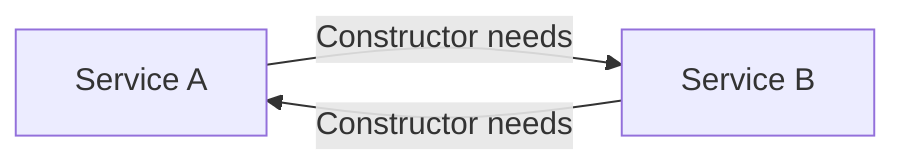

### How `@Lazy` Works:
Placing `@Lazy` on one constructor parameter causes Spring to inject a dynamic proxy instead of the real bean. The real bean is resolved only when its method is called for the first time:
```java
@Service
public class ServiceB {
    private final ServiceA serviceA;

    public ServiceB(@Lazy ServiceA serviceA) {
        this.serviceA = serviceA;
    }
}
```

> [!WARNING]
> **Architectural Wisdom**: `@Lazy` is a temporary bandage. A circular dependency almost always indicates poor design. The proper fix is to extract shared logic into a separate `ServiceC` or decouple via Spring Events.

---

## 23. `@PathVariable` vs. `@RequestParam`

> 💡 **Quick Revision Anchor (2-3 Words)**: `URI Path vs Query Param`


- **`@PathVariable`**: Extracts values directly embedded inside the URI path (identifies a specific resource).  
  Example: `GET /orders/{orderId}` $\rightarrow$ `@PathVariable Long orderId`
- **`@RequestParam`**: Extracts query parameters appended after the `?` in the URL (used for filtering, sorting, pagination).  
  Example: `GET /orders?status=PENDING&page=2` $\rightarrow$ `@RequestParam String status`

---

## 24. `ResponseEntity<T>`

> 💡 **Quick Revision Anchor (2-3 Words)**: `Full HTTP Control`

In REST controllers, returning raw objects defaults to HTTP `200 OK`. `ResponseEntity<T>` represents the entire HTTP response, letting you customize the **Status Code**, **Headers**, and **Body**:

```java
@GetMapping("/{id}")
public ResponseEntity<UserResponse> getUser(@PathVariable Long id) {
    UserResponse user = userService.findById(id);
    return ResponseEntity.ok(user); // 200 OK with body
}

@PostMapping
public ResponseEntity<UserResponse> createUser(@RequestBody UserRequest request) {
    UserResponse created = userService.create(request);
    return ResponseEntity
        .status(HttpStatus.CREATED) // 201 Created
        .header("Location", "/api/users/" + created.id())
        .body(created);
}

@DeleteMapping("/{id}")
public ResponseEntity<Void> deleteUser(@PathVariable Long id) {
    userService.delete(id);
    return ResponseEntity.noContent().build(); // 204 No Content
}
```

---

## 25. `DispatcherServlet` & Spring MVC Request Flow

> 💡 **Quick Revision Anchor (2-3 Words)**: `Front Controller Hub`

`DispatcherServlet` is the core architectural engine of Spring MVC, implementing the classic **Front Controller Pattern**.

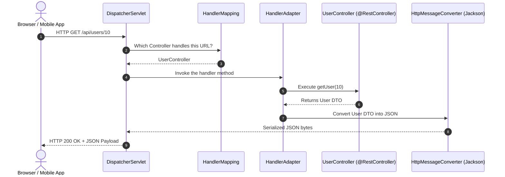

1. **`DispatcherServlet`** receives the incoming HTTP request.
2. Calls **`HandlerMapping`** to identify the matched controller method.
3. Delegates invocation to **`HandlerAdapter`**.
4. Controller invokes service/repository layers and returns raw DTO.
5. **`HttpMessageConverter`** (Jackson) serializes the DTO into JSON and writes it to the response stream.

---

## 26. Pagination, Sorting & Filtering

> 💡 **Quick Revision Anchor (2-3 Words)**: `Database-Side Chunking`

Loading an entire table containing 500,000 rows into JVM memory will cause an `OutOfMemoryError`. Spring Data JPA supports database-level chunking using `Pageable`.

```java
// Controller
@GetMapping
public ResponseEntity<Page<ProductResponse>> getProducts(
        @RequestParam(defaultValue = "0") int page,
        @RequestParam(defaultValue = "20") int size,
        @RequestParam(defaultValue = "price,desc") String sort) {

    Pageable pageable = PageRequest.of(page, size, Sort.by("price").descending());
    return ResponseEntity.ok(productService.findAll(pageable));
}

// Repository
public interface ProductRepository extends JpaRepository<Product, Long> {
    // Generates: SELECT * FROM products ORDER BY price DESC LIMIT 20 OFFSET 0;
    Page<Product> findAll(Pageable pageable);
}
```

### `Page<T>` vs. `Slice<T>`
- **`Page<T>`**: Executes **two SQL queries**: one to fetch the slice data (`LIMIT/OFFSET`), and a secondary `SELECT COUNT(*)` query to calculate total pages.
- **`Slice<T>`**: Fetches `LIMIT + 1` elements. Does **not** execute a count query. Ideal for mobile app infinite scrolling where total count is unnecessary.

---

## 27. Object Mapping with MapStruct & DTO Pattern

> 💡 **Quick Revision Anchor (2-3 Words)**: `Compile-Time DTO Mapper`

### Why use DTOs (Data Transfer Objects)?
1. Never expose your raw database `@Entity` to external callers.
2. Prevents exposing sensitive fields (passwords, social security numbers).
3. Eliminates circular reference serialization bugs in bidirectional JPA relationships.

### Why MapStruct?
Traditional reflection-based mappers (like ModelMapper) are slow at runtime. **MapStruct generates type-safe, plain Java code at compile time** with zero reflection overhead.

```java
@Mapper(componentModel = "spring")
public interface UserMapper {
    UserResponse toResponse(User entity);
    User toEntity(UserCreateRequest request);
}
```

---

## 28. Core Spring Boot Annotations Quick Reference

> 💡 **Quick Revision Anchor (2-3 Words)**: `Essential Annotation Cheat Sheet`

| Category | Annotations | Purpose |
|---|---|---|
| **Core Stereotypes** | `@Component`, `@Service`, `@Repository`, `@RestController` | Registers managed beans in the IoC container. |
| **Dependency Injection** | `@Autowired`, `@Qualifier`, `@Primary`, `@Lazy` | Directs how dependencies are wired. |
| **HTTP Web Mapping** | `@GetMapping`, `@PostMapping`, `@PutMapping`, `@DeleteMapping`, `@PatchMapping` | Maps HTTP verbs to handler methods. |
| **HTTP Parameters** | `@PathVariable`, `@RequestParam`, `@RequestBody`, `@RequestHeader` | Extracts data from URL paths, query parameters, bodies, and headers. |
| **Database & JPA** | `@Entity`, `@Table`, `@Id`, `@GeneratedValue`, `@Column`, `@Transient` | Defines ORM entity mappings. |
| **Transactions** | `@Transactional` | Manages database transaction commit and rollback boundaries. |
| **Error Handling** | `@RestControllerAdvice`, `@ExceptionHandler` | Intercepts and formats application-wide exceptions. |

---

## 29. Input Validation & `@Valid`

> 💡 **Quick Revision Anchor (2-3 Words)**: `Declarative Bean Validation`

```xml
<dependency>
    <groupId>org.springframework.boot</groupId>
    <artifactId>spring-boot-starter-validation</artifactId>
</dependency>
```

### Annotating Request DTOs
```java
public record UserCreateRequest(
    @NotBlank(message = "Username cannot be empty")
    @Size(min = 3, max = 20, message = "Username must be 3-20 characters")
    String username,

    @NotBlank(message = "Email is required")
    @Email(message = "Must be a valid email address")
    String email,

    @Min(value = 18, message = "Must be at least 18 years old")
    int age
) {}
```

### Triggering Validation in Controller
```java
@PostMapping("/users")
public ResponseEntity<UserResponse> createUser(@Valid @RequestBody UserCreateRequest request) {
    return ResponseEntity.status(HttpStatus.CREATED).body(userService.create(request));
}
```

### Centralized Validation Exception Handler
When validation fails, Spring throws `MethodArgumentNotValidException`. Intercept it cleanly:
```java
@ExceptionHandler(MethodArgumentNotValidException.class)
public ResponseEntity<Map<String, String>> handleValidationExceptions(MethodArgumentNotValidException ex) {
    Map<String, String> errors = new HashMap<>();
    ex.getBindingResult().getFieldErrors().forEach(error ->
        errors.put(error.getField(), error.getDefaultMessage())
    );
    return ResponseEntity.badRequest().body(errors);
}
```

---

## 30. Rapid-Fire Interview Questions & Answers

> 💡 **Quick Revision Anchor (2-3 Words)**: `10-Second Recall Answers`

1. **What is Spring Boot Auto-Configuration?**  
   It automatically provisions Spring beans based on the libraries found on your classpath and predefined conditions.
2. **What embedded servers does Spring Boot support?**  
   Tomcat (default), Jetty, and Undertow.
3. **What is the default Spring bean scope?**  
   `singleton` (one instance per Spring IoC Container).
4. **Is Spring's singleton scope thread-safe?**  
   No. If a singleton bean has mutable instance variables, it is not thread-safe. Spring beans should be stateless.
5. **What is the difference between `@NotNull`, `@NotEmpty`, and `@NotBlank`?**  
   `@NotNull` checks non-null; `@NotEmpty` checks non-null and size > 0; `@NotBlank` checks non-null, size > 0, and not pure whitespace.
6. **Can `@Transactional` rollback on checked exceptions?**  
   By default, it only rolls back on `RuntimeException` and `Error`. To rollback on checked exceptions, use `@Transactional(rollbackFor = Exception.class)`.
7. **What is Spring Boot Actuator used for?**  
   Production health checks, metrics, and application runtime monitoring.

---

## 31. End-to-End Project Explanation Framework

> 💡 **Quick Revision Anchor (2-3 Words)**: `Resume Architecture Defense`

When asked *"Explain your Spring Boot project architecture"*, use this structured 4-layer response:

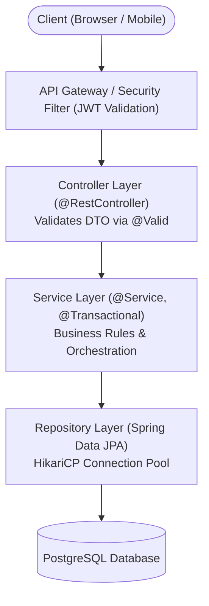

### Verbal Script Template:
> *"In my project, I built a RESTful backend using Spring Boot 3 and Java 17. The system follows a layered architecture:*
> 1. *The **Controller Layer** exposes versioned REST endpoints, consumes and returns DTOs, and validates input payloads via Bean Validation (`@Valid`).*
> 2. *The **Service Layer** encapsulates core business logic and manages transactional integrity with `@Transactional`.*
> 3. *The **Data Layer** uses Spring Data JPA with PostgreSQL to perform type-safe database queries.*
> 4. *Cross-cutting concerns like JWT authorization are handled via a custom `OncePerRequestFilter`, and exceptions are handled globally with `@RestControllerAdvice`."*

---

## 32. High-Yield Topics Beyond the Playlist

Candidates are frequently evaluated on the following 7 production-critical topics in SDE / Backend interviews:

---

### A. Spring Security & Stateless JWT Authentication

> 💡 **Quick Revision Anchor (2-3 Words)**: `Stateless Token Security`

In modern microservices and REST APIs, stateful HTTP sessions are replaced with **stateless JSON Web Tokens (JWT)**.

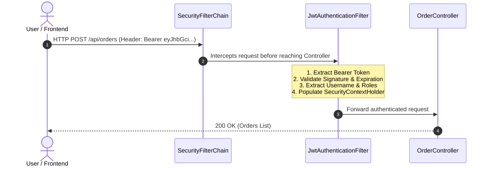

#### 1. How Spring Security Works:
- Incoming HTTP requests pass through a chain of filters called the **`SecurityFilterChain`**.
- A custom **`JwtAuthenticationFilter`** intercepts the request, validates the signature using an HMAC secret key, extracts user claims, and sets the authenticated principal in the **`SecurityContextHolder`**.

#### 2. Spring Security 6 / Spring Boot 3 Configuration:
```java
@Configuration
@EnableWebSecurity
@RequiredArgsConstructor
public class SecurityConfig {

    private final JwtAuthenticationFilter jwtAuthFilter;

    @Bean
    public SecurityFilterChain securityFilterChain(HttpSecurity http) throws Exception {
        return http
            .csrf(csrf -> csrf.disable()) // Disabled for stateless APIs
            .sessionManagement(session -> session.sessionCreationPolicy(SessionCreationPolicy.STATELESS))
            .authorizeHttpRequests(auth -> auth
                .requestMatchers("/api/auth/**").permitAll() // Public login/register endpoints
                .requestMatchers("/api/admin/**").hasRole("ADMIN")
                .anyRequest().authenticated()
            )
            .addFilterBefore(jwtAuthFilter, UsernamePasswordAuthenticationFilter.class)
            .build();
    }
}
```

---

### B. JPA Relationships (`@OneToMany`, `@ManyToOne`) & Cascade Rules

> 💡 **Quick Revision Anchor (2-3 Words)**: `Entity Mapping & Ownership`

Relational database foreign keys are represented in JPA using relationship annotations.

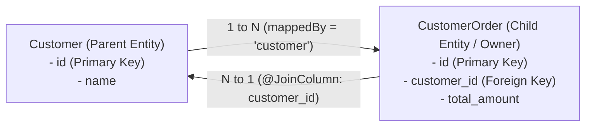

#### 1. The `@ManyToOne` Side (Owner of the Relationship):
The table with the foreign key column is **always the owner of the relationship**. It uses `@JoinColumn`:
```java
@Entity
@Table(name = "orders")
public class Order {
    @Id @GeneratedValue(strategy = GenerationType.IDENTITY)
    private Long id;

    @ManyToOne(fetch = FetchType.LAZY)
    @JoinColumn(name = "customer_id", nullable = false) // Foreign key in 'orders' table
    private Customer customer;
}
```

#### 2. The `@OneToMany` Side (Inverse Side):
Must declare **`mappedBy`** pointing to the field name in the child entity. If you forget `mappedBy`, JPA will create an unwanted third join table!
```java
@Entity
@Table(name = "customers")
public class Customer {
    @Id @GeneratedValue(strategy = GenerationType.IDENTITY)
    private Long id;

    @OneToMany(mappedBy = "customer", cascade = CascadeType.ALL, orphanRemoval = true)
    private List<Order> orders = new ArrayList<>();
}
```

- **`CascadeType.ALL`**: Operations (persist, remove, merge) performed on `Customer` automatically cascade to its `orders`.
- **`orphanRemoval = true`**: If an order is removed from the `orders` list, JPA deletes the corresponding row from the database table.

---

### C. Fetch Types: LAZY vs. EAGER & The N+1 Query Problem

> 💡 **Quick Revision Anchor (2-3 Words)**: `Solve With Join-Fetch`

### Default Fetch Types in JPA:
- **`@ManyToOne` / `@OneToOne`**: Defaults to **`EAGER`** (Loads associated entity immediately).  
  *Best Practice*: Always change this to `FetchType.LAZY`!
- **`@OneToMany` / `@ManyToMany`**: Defaults to **`LAZY`** (Loads associated collection on demand).

### What is the N+1 Query Problem?
Suppose you fetch 10 Customers, and for each Customer, Hibernate executes an extra query to load their Orders:
- 1 Query to fetch 10 customers: `SELECT * FROM customers;`
- N Queries (10 queries) to fetch orders for each customer: `SELECT * FROM orders WHERE customer_id = ?;`
- **Total: 1 + 10 = 11 queries instead of 1 single query!**

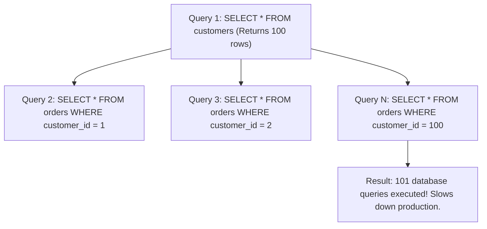

### The Solution: `JOIN FETCH`
Use a `JOIN FETCH` query in your repository to retrieve both parent and children in a single SQL join:
```java
public interface CustomerRepository extends JpaRepository<Customer, Long> {
    // Solves N+1 Problem: Executes 1 single SQL JOIN query!
    @Query("SELECT c FROM Customer c JOIN FETCH c.orders")
    List<Customer> findAllWithOrders();
}
```

---

### D. REST API Design & HTTP Idempotency

> 💡 **Quick Revision Anchor (2-3 Words)**: `Standard Verbs & Statuses`

### HTTP Verb Characteristics:

| HTTP Verb | CRUD Action | Is Safe? (Does not alter state) | Is Idempotent? (Multiple identical requests = same result) |
|---|---|---|---|
| **GET** | Read | ✅ Yes | ✅ Yes |
| **POST** | Create | ❌ No | ❌ **No** (Calling POST 5 times creates 5 records) |
| **PUT** | Replace / Overwrite | ❌ No | ✅ Yes (Overwriting with the same data 5 times yields same state) |
| **PATCH** | Partial Update | ❌ No | ❌ No (Can be non-idempotent depending on operation) |
| **DELETE** | Remove | ❌ No | ✅ Yes (Deleting resource ID 5 multiple times leaves it deleted) |

### Standard HTTP Status Codes:
- **`200 OK`**: Request succeeded with body.
- **`201 Created`**: Resource created successfully (`POST`).
- **`204 No Content`**: Succeeded, but no response body (`DELETE`).
- **`400 Bad Request`**: Malformed syntax or validation failure.
- **`401 Unauthorized`**: Authentication missing or token invalid.
- **`403 Forbidden`**: Authenticated, but user lacks permissions (Role check failed).
- **`404 Not Found`**: Resource does not exist.
- **`409 Conflict`**: State conflict (e.g. duplicate email registration).
- **`500 Internal Server Error`**: Unhandled exception in server code.

---

### E. SQL & DBMS Essentials for Java Backend Interviews

> 💡 **Quick Revision Anchor (2-3 Words)**: `Joins, Indexing, ACID`

Spring Boot developers are evaluated directly on database fundamentals:

```mermaid
flowchart LR
    A["Table A (Users)"]
    B["Table B (Orders)"]

    A -->|INNER JOIN: Rows matching in both| IJ["Matching Rows"]
    A -->|LEFT JOIN: All rows from A + matches from B| LJ["All Users + Orders (if any)"]
```

1. **INNER JOIN vs. LEFT JOIN**:
   - `INNER JOIN`: Returns records that have matching values in both tables.
   - `LEFT JOIN`: Returns all records from the left table, and matched records from the right table (NULL if no match).
2. **`WHERE` vs. `HAVING`**:
   - `WHERE` filters individual rows **before** aggregation.
   - `HAVING` filters aggregated groups **after** `GROUP BY`.
3. **Database Indexing**:
   - Speeds up `SELECT` queries by maintaining an ordered **B-Tree** pointer index.
   - *Trade-off*: Slows down `INSERT`, `UPDATE`, and `DELETE` operations because the database must update index trees on every write.
4. **ACID Properties**:
   - **Atomicity**: All operations succeed, or all rollback.
   - **Consistency**: Database transitions from one valid state to another.
   - **Isolation**: Concurrent transactions do not interfere with one another.
   - **Durability**: Committed data is never lost, even across hardware power outages.

---

### F. Automated Testing with JUnit 5 & Mockito

> 💡 **Quick Revision Anchor (2-3 Words)**: `Unit Mocking vs Integration`

```mermaid
flowchart TD
    subgraph UnitTest ["Unit Test (@ExtendWith(MockitoExtension.class))"]
        UT["Fast, in-memory test. Mocks Repository; tests isolated Service logic."]
    end

    subgraph IntegrationTest ["Integration Test (@SpringBootTest + MockMvc)"]
        IT["Loads Spring Context, verifies HTTP Routing, Security, and Database."]
    end
```

### 1. Unit Test with Mockito:
```java
@ExtendWith(MockitoExtension.class)
class UserServiceTest {

    @Mock
    private UserRepository userRepository;

    @InjectMocks
    private UserService userService;

    @Test
    void shouldReturnUserWhenIdExists() {
        User mockUser = new User(1L, "Alice");
        when(userRepository.findById(1L)).thenReturn(Optional.of(mockUser));

        User result = userService.getUser(1L);

        assertNotNull(result);
        assertEquals("Alice", result.getName());
        verify(userRepository, times(1)).findById(1L);
    }
}
```

### 2. Controller Integration Test with `MockMvc`:
```java
@WebMvcTest(UserController.class)
class UserControllerTest {

    @Autowired
    private MockMvc mockMvc;

    @MockBean
    private UserService userService;

    @Test
    void shouldReturn200Ok() throws Exception {
        when(userService.getUser(1L)).thenReturn(new User(1L, "Alice"));

        mockMvc.perform(get("/api/users/1"))
            .andExpect(status().isOk())
            .andExpect(jsonPath("$.name").value("Alice"));
    }
}
```

---

### G. Maven Build Lifecycle & Dependency Scopes

> 💡 **Quick Revision Anchor (2-3 Words)**: `Build Lifecycle Phases`

```mermaid
flowchart LR
    Clean["mvn clean\n(Deletes target/ folder)"]
    Compile["compile\n(Compiles src/ to .class)"]
    Test["test\n(Executes JUnit tests)"]
    Package["package\n(Packs into executable JAR)"]
    Install["install\n(Copies JAR to local ~/.m2)"]

    Compile --> Test --> Package --> Install
```

### Maven Dependency Scopes:
- **`compile`** *(Default)*: Dependency is available during compilation, testing, and runtime. Bundled into final JAR.
- **`provided`**: Required for compilation, but provided at runtime by the container/JDK (e.g., `lombok`).
- **`runtime`**: Not needed for compilation, but required for runtime execution (e.g., database drivers like `postgresql`).
- **`test`**: Only used for compiling and executing tests (e.g., `spring-boot-starter-test`, Mockito). Never included in the production JAR.

---

## 33. 1-Page Master Revision Cheat Sheet

```
==================================================================================================
                            SPRING BOOT MASTER INTERVIEW CHEAT SHEET
==================================================================================================

1. CORE INVERSION OF CONTROL (IoC) & DI:
   - IoC: Spring manages object creation, configuration, and destruction.
   - DI: Spring injects required objects into classes. Prefer Constructor Injection for immutability.

2. STEREOTYPES:
   - @RestController = @Controller + @ResponseBody (Writes JSON directly to response).
   - @Service        = Business logic boundary.
   - @Repository     = Database DAO; automatically translates SQL exceptions to DataAccessException.
   - @Component      = Generic Spring-managed bean.

3. SPRING BOOT MAGIC:
   - @SpringBootApplication = @Configuration + @EnableAutoConfiguration + @ComponentScan.
   - Starters = Curated POM dependency aggregators.
   - Actuator = Production health & metrics (/actuator/health).

4. TRANSACTION MANAGEMENT:
   - @Transactional: Opens proxy, starts DB transaction, commits on success, rollbacks on RuntimeException.
   - REQUIRED (Default): Join existing transaction or create new one.
   - REQUIRES_NEW: Suspend existing transaction and always start an independent new one.

5. DATABASE & PERSISTENCE:
   - Hierarchy: JDBC (Raw SQL API) -> JPA (Specification) -> Hibernate (ORM Engine) -> Spring Data JPA.
   - N+1 Query Bug: 1 query for parent + N queries for children. Solved using `JOIN FETCH`.
   - Relationships: Child table with FK is the owner; parent table must declare `mappedBy`.

6. MVC FLOW & HTTP:
   - Client -> Servlet Filter -> DispatcherServlet (Front Controller) -> Interceptor -> @RestController.
   - @PathVariable = /users/{id} (Part of URI resource).
   - @RequestParam = /users?page=1 (Query parameters).
   - ResponseEntity<T> = Complete HTTP control (status, headers, body).

7. SECURITY & ERROR HANDLING:
   - JWT: Stateless token authentication verified by a custom OncePerRequestFilter before Controller.
   - @RestControllerAdvice + @ExceptionHandler: Centralized application exception interception.
==================================================================================================
```
