# 🍃 Spring Boot — Complete Placement & Technical Interview Master Guide

> **Target Audience**: Fresher / Entry-Level Java Backend Engineers, SWE / SDE Candidates.  
> **Source Foundation**: Curated from *The Curious Coder* Java Spring Boot Interview Series + High-Yield Placement Deep Dives.  
> **Core Focus**: Exhaustive technical depth, internal architectural mechanisms, clear visual execution diagrams (Mermaid), real-world Java 17 / Spring Boot 3 code implementations, 2-3 word memory hooks, and equal, in-depth coverage across all 31 core topics and beyond-the-playlist essentials (Spring Security, JPA Relationships, N+1 Query Problem, Testing, Maven, and SQL).

---

## 📑 Table of Contents

- [1. Inversion of Control (IoC), Dependency Injection (DI) & Bean Lifecycle](#1-inversion-of-control-ioc-dependency-injection-di--bean-lifecycle)
- [2. `@RestController` vs. `@Controller` (Content Negotiation & ResponseBody)](#2-restcontroller-vs-controller-content-negotiation--responsebody)
- [3. Stereotype Annotations: `@RestController` vs. `@Service` vs. `@Repository` vs. `@Component`](#3-stereotype-annotations-restcontroller-vs-service-vs-repository-vs-component)
- [4. Spring Boot & Starters (Auto-Configuration Internals)](#4-spring-boot--starters-auto-configuration-internals)
- [5. Spring Framework vs. Spring Boot](#5-spring-framework-vs-spring-boot)
- [6. `@SpringBootApplication` Internals & Condition Evaluation](#6-springbootapplication-internals--condition-evaluation)
- [7. Spring Boot Actuator (Custom Health Indicators & Metrics)](#7-spring-boot-actuator-custom-health-indicators--metrics)
- [8. Global Exception Handling (`@RestControllerAdvice` & ProblemDetail)](#8-global-exception-handling-restcontrolleradvice--problemdetail)
- [9. Project Lombok in Spring Boot (Best Practices & JPA Traps)](#9-project-lombok-in-spring-boot-best-practices--jpa-traps)
- [10. Spring Bean Scopes & Thread-Safety](#10-spring-bean-scopes--thread-safety)
- [11. Request Scope vs. Session Scope (Scoped Proxies)](#11-request-scope-vs-session-scope-scoped-proxies)
- [12. Spring Profiles (Multi-Environment Setup)](#12-spring-profiles-multi-environment-setup)
- [13. `application.properties` vs. `application.yaml` & Configuration Precedence](#13-applicationproperties-vs-applicationyaml--configuration-precedence)
- [14. Property Injection: `@Value` vs. `@ConfigurationProperties` vs. `Environment`](#14-property-injection-value-vs-configurationproperties-vs-environment)
- [15. Persistence Stack: JDBC vs. Hibernate vs. JPA vs. Spring Data JPA](#15-persistence-stack-jdbc-vs-hibernate-vs-jpa-vs-spring-data-jpa)
- [16. `@Transactional` Mechanics (AOP Proxies & Self-Invocation Trap)](#16-transactional-mechanics-aop-proxies--self-invocation-trap)
- [17. Transaction Propagation (All 7 Levels Explained)](#17-transaction-propagation-all-7-levels-explained)
- [18. Bean Disambiguation: `@Primary` vs. `@Qualifier` & Strategy Pattern](#18-bean-disambiguation-primary-vs-qualifier--strategy-pattern)
- [19. Injection Types: Constructor vs. Setter vs. Field Injection](#19-injection-types-constructor-vs-setter-vs-field-injection)
- [20. `@Lookup` Annotation & Dynamic Prototype Injection](#20-lookup-annotation--dynamic-prototype-injection)
- [21. Servlet Filters vs. Spring MVC Interceptors](#21-servlet-filters-vs-spring-mvc-interceptors)
- [22. Cyclic Dependencies, `@Lazy` & Architectural Decoupling](#22-cyclic-dependencies-lazy--architectural-decoupling)
- [23. `@PathVariable` vs. `@RequestParam`](#23-pathvariable-vs-requestparam)
- [24. `ResponseEntity<T>` & HTTP Response Customization](#24-responseentityt--http-response-customization)
- [25. `DispatcherServlet` & Spring MVC Request Flow](#25-dispatcherservlet--spring-mvc-request-flow)
- [26. Pagination, Sorting & Dynamic Filtering (JPA Criteria / Specifications)](#26-pagination-sorting--dynamic-filtering-jpa-criteria--specifications)
- [27. Object Mapping with MapStruct & DTO Pattern](#27-object-mapping-with-mapstruct--dto-pattern)
- [28. Core Spring Boot Annotations Quick Reference](#28-core-spring-boot-annotations-quick-reference)
- [29. Input Validation & Custom Validators (`@Valid`)](#29-input-validation--custom-validators-valid)
- [30. Rapid-Fire Interview Questions & Answers](#30-rapid-fire-interview-questions--answers)
- [31. End-to-End Project Explanation Framework](#31-end-to-end-project-explanation-framework)
- [32. High-Yield Topics Beyond the Playlist](#32-high-yield-topics-beyond-the-playlist)
  - [A. Spring Security & Stateless JWT Authentication](#a-spring-security--stateless-jwt-authentication)
  - [B. JPA Relationships (`@OneToMany`, `@ManyToOne`) & Cascade Rules](#b-jpa-relationships-onetomany-manytoone--cascade-rules)
  - [C. Fetch Types: LAZY vs. EAGER & The N+1 Query Problem](#c-fetch-types-lazy-vs-eager--the-n1-query-problem)
  - [D. REST API Design & HTTP Idempotency](#d-rest-api-design--http-idempotency)
  - [E. SQL & DBMS Essentials for Java Backend Interviews](#e-sql--dbms-essentials-for-java-backend-interviews)
  - [F. Automated Testing with JUnit 5 & Mockito](#f-automated-testing-with-junit-5--mockito)
  - [G. Maven Build Lifecycle & Dependency Scopes](#g-maven-build-lifecycle--dependency-scopes)
- [33. 1-Page Master Revision Cheat Sheet](#33-1-page-master-revision-cheat-sheet)

---

## 1. Inversion of Control (IoC), Dependency Injection (DI) & Bean Lifecycle

> 💡 **Quick Revision Anchor (2-3 Words)**: `Spring Controls Objects`

### 🎯 Core Concept & Why It Matters
In traditional Java programming, if a class needs a collaborator, it instantiates it directly using the `new` keyword:
```java
// ❌ Traditional Java: Tight coupling (OrderService controls PaymentService's creation)
class OrderService {
    private PaymentService paymentService = new PaymentService(); 
}
```
**Inversion of Control (IoC)** is the architectural principle where object creation, configuration, and lifecycle management are inverted—delegated away from application code to an external container: the **Spring IoC Container**.

**Dependency Injection (DI)** is the concrete design pattern used to achieve IoC. Instead of an object searching for or instantiating its dependencies, the Spring container **injects** them at runtime via constructors, setters, or fields.

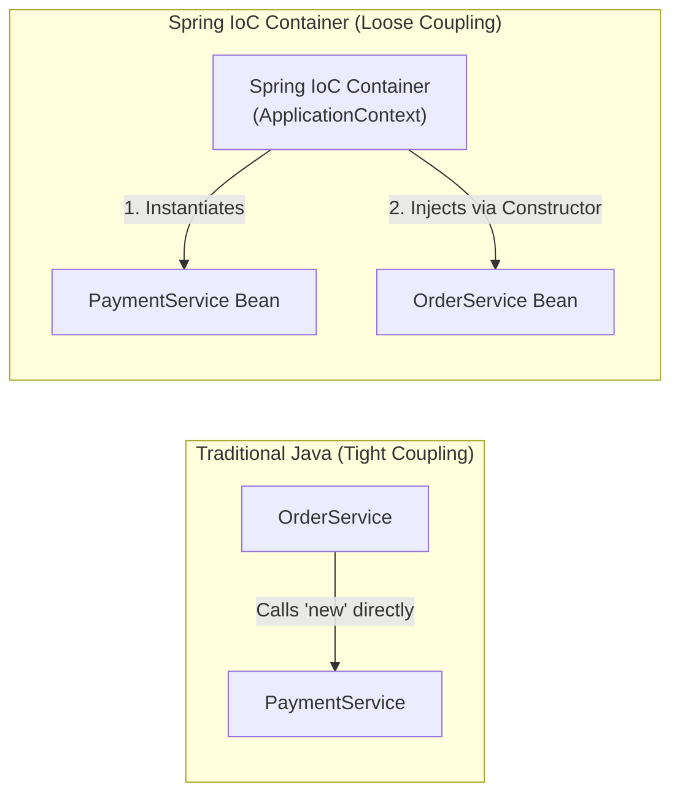

```java
// ✅ Spring IoC: Loose coupling via Constructor Dependency Injection
@Service
public class OrderService {
    private final PaymentService paymentService;

    // Spring automatically supplies PaymentService bean here at startup
    public OrderService(PaymentService paymentService) {
        this.paymentService = paymentService;
    }
}
```

### ⚡ Key Comparison: `BeanFactory` vs. `ApplicationContext`

| Feature | `BeanFactory` | `ApplicationContext` |
|---|---|---|
| **Instantiation Strategy** | **Lazy** (Beans created on-demand only when `getBean()` is called). | **Eager** (Singletons pre-instantiated at container startup). |
| **Enterprise Features** | Minimal (Basic DI and bean lifecycle only). | Complete (Events, AOP, i18n messages, Profiles, Web context). |
| **Primary Use Case** | Legacy memory-constrained embedded/IoT devices. | **Standard in all modern Spring Boot & Enterprise apps.** |

---

### 🏗️ Spring Bean Lifecycle (Step-by-Step Internal Execution)
Understanding what happens from bean discovery to destruction is a premier placement interview topic:

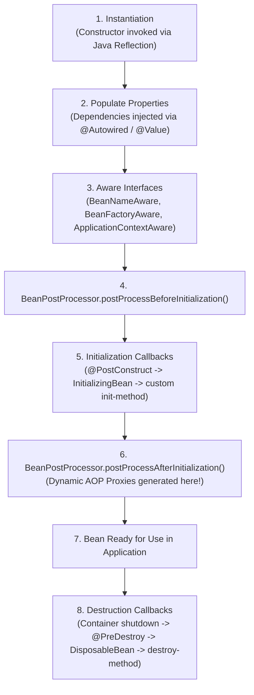

1. **Instantiation**: Spring reads bean definitions and invokes the class constructor using Java Reflection.
2. **Populate Properties**: Spring resolves and injects dependencies (`@Autowired`) and values (`@Value`).
3. **Aware Interfaces**: If the bean implements Spring Aware interfaces, Spring passes internal container references:
   - `BeanNameAware`: Passes the bean's registered ID/name.
   - `ApplicationContextAware`: Gives access to the underlying `ApplicationContext`.
4. **`BeanPostProcessor (Before)`**: Custom processors modify bean instances before initialization callbacks run.
5. **Initialization Callbacks** (Executed in this exact sequence):
   - **`@PostConstruct`**: Standard JSR-250 annotation method.
   - **`InitializingBean.afterPropertiesSet()`**: Spring interface callback.
   - **Custom `initMethod`**: Declared via `@Bean(initMethod = "customInit")`.
6. **`BeanPostProcessor (After)`**: Spring wraps beans with dynamic **AOP proxies** (e.g., for `@Transactional`, `@Async`, `@Secured`).
7. **Destruction Callbacks** (Executed on container shutdown):
   - **`@PreDestroy`** annotated method runs first.
   - **`DisposableBean.destroy()`** interface callback runs second.
   - Custom **`destroyMethod`** runs last.

#### 💻 Lifecycle Demonstration Code
```java
@Component
public class CustomLifecycleBean implements InitializingBean, DisposableBean, BeanNameAware {

    public CustomLifecycleBean() {
        System.out.println("1. Constructor: Bean instantiated via reflection");
    }

    @Override
    public void setBeanName(String name) {
        System.out.println("2. BeanNameAware: Bean registered under name: " + name);
    }

    @PostConstruct
    public void postConstruct() {
        System.out.println("3. @PostConstruct: JSR-250 callback executed");
    }

    @Override
    public void afterPropertiesSet() {
        System.out.println("4. InitializingBean: Spring callback executed");
    }

    @PreDestroy
    public void preDestroy() {
        System.out.println("5. @PreDestroy: Cleanup before shutdown initiated");
    }

    @Override
    public void destroy() {
        System.out.println("6. DisposableBean: Final container cleanup completed");
    }
}
```

[⬆ Back to Top](#📑-table-of-contents)

---

## 2. `@RestController` vs. `@Controller` (Content Negotiation & ResponseBody)

> 💡 **Quick Revision Anchor (2-3 Words)**: `JSON vs HTML-Views`

### 🎯 Core Concept & Request Routing Flow
In Spring Web, both annotations register a class as an incoming HTTP request handler, but they target completely different application architectures:

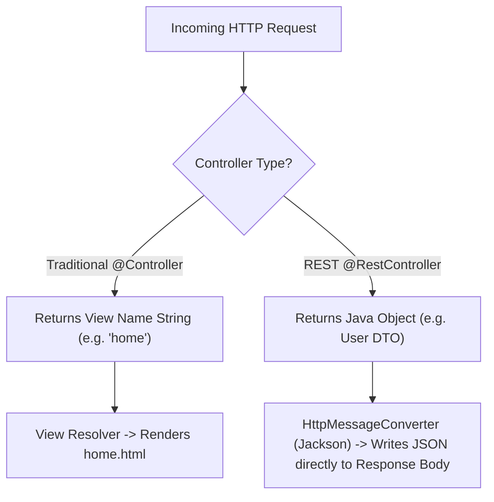

### ⚡ Comparison Matrix

| Dimension | `@Controller` | `@RestController` |
|---|---|---|
| **Primary Purpose** | Traditional MVC web applications rendering HTML views. | Modern RESTful APIs serving raw data (JSON / XML). |
| **Return Value** | Treated as a **view name** (resolved by `ViewResolver` to a template). | Written directly to the **HTTP response body**. |
| **Composition** | Base stereotype annotation. | `@RestController = @Controller + @ResponseBody` |
| **Returning JSON?** | Requires explicit `@ResponseBody` on each method. | Automatically enabled for **all** handler methods. |

### 🏗️ How `HttpMessageConverter` Operates Under the Hood
When a `@RestController` handler returns a Java object:
1. Spring inspects the incoming request's **`Accept` header** (e.g., `Accept: application/json` or `application/xml`).
2. Spring iterates through its registered list of `HttpMessageConverter` beans.
3. For JSON, `MappingJackson2HttpMessageConverter` uses Jackson's **`ObjectMapper`** to serialize the Java POJO into JSON byte streams and writes it directly to `HttpServletResponse.getOutputStream()`.
4. If the client requests XML (`Accept: application/xml`) and `jackson-dataformat-xml` is on the classpath, Spring serializes XML instead—this mechanism is called **Content Negotiation**.

[⬆ Back to Top](#📑-table-of-contents)

---

## 3. Stereotype Annotations: `@RestController` vs. `@Service` vs. `@Repository` vs. `@Component`

> 💡 **Quick Revision Anchor (2-3 Words)**: `Layered Component Roles`

### 🎯 Core Concept & Architectural Separation
All four annotations mark a Java class as a Spring-managed Bean discovered during classpath component scanning. However, using specific stereotypes provides architectural clarity and unlocks specialized framework capabilities:

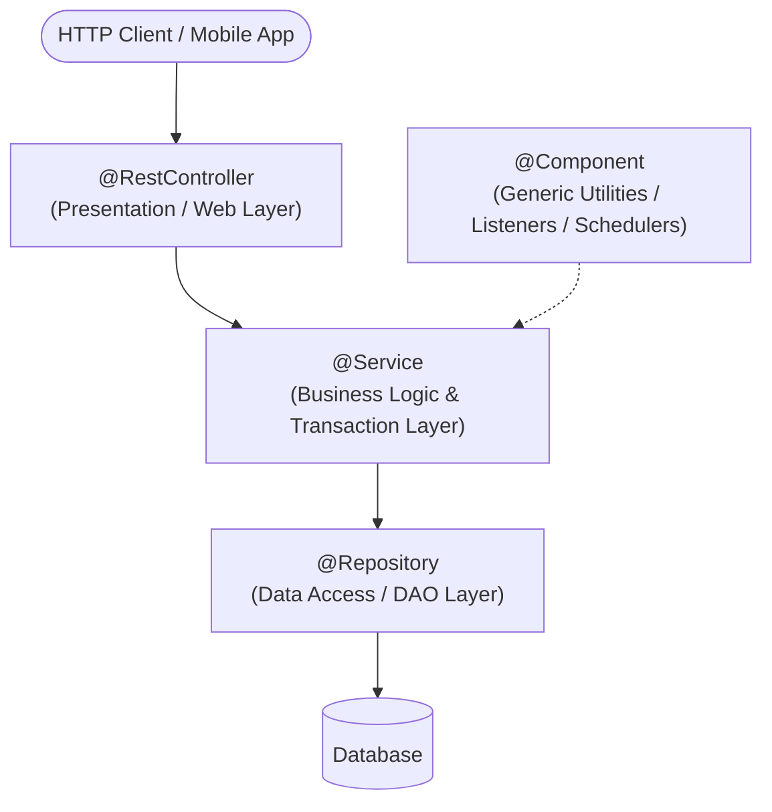

### ⚡ Stereotype Comparison Matrix

| Annotation | Architectural Layer | Special Framework Behavior |
|---|---|---|
| **`@RestController`** | Presentation / API Layer | Handles HTTP requests, parses JSON payloads, binds responses. Combines `@Controller` and `@ResponseBody`. |
| **`@Service`** | Business Logic Layer | Communicates business intent; primary target for `@Transactional` boundaries. Contains validation and domain rules. |
| **`@Repository`** | Data Access / Persistence Layer | Interacts with databases. **Crucial**: Automatically translates low-level database exceptions (e.g., `SQLException`, `HibernateException`) into Spring's unified, unchecked `DataAccessException` hierarchy via `PersistenceExceptionTranslationPostProcessor`. |
| **`@Component`** | Generic Utility Layer | Generic root stereotype for any Spring-managed component that does not belong to the other three layers (e.g., mail senders, scheduled jobs, token encoders). |

> [!IMPORTANT]
> **Placement Interview Question**: *"Why not annotate every single class with `@Component`?"*  
> **Answer**: *"While technically valid, using specialized stereotypes communicates architectural intent to developers and enables framework-specific behavior—such as automatic persistence exception translation with `@Repository`."*

[⬆ Back to Top](#📑-table-of-contents)

---

## 4. Spring Boot & Starters (Auto-Configuration Internals)

> 💡 **Quick Revision Anchor (2-3 Words)**: `Curated Dependency Bundles`

### 🎯 Core Concept & Key Pillars
Spring Boot is an opinionated extension of the Spring Framework designed to eliminate boilerplate configuration and streamline production-ready application development through four pillars:
1. **Auto-Configuration**: Guesses configuration automatically based on JAR dependencies found on the classpath.
2. **Starter Dependencies**: Curated dependency aggregators that eliminate version mismatches.
3. **Embedded Web Servers**: Tomcat, Jetty, or Undertow packaged directly inside the executable JAR.
4. **Production Metrics**: Ready-to-use health checks and operational metrics via Actuator.

### 📦 What is a Spring Boot Starter?
A **Starter** is a convenient dependency descriptor (`pom.xml`) that bundles all compatible, pre-tested libraries needed for a specific capability:

```xml
<!-- Brings in Spring MVC, Jackson JSON, REST support, and Embedded Tomcat -->
<dependency>
    <groupId>org.springframework.boot</groupId>
    <artifactId>spring-boot-starter-web</artifactId>
</dependency>

<!-- Brings in Hibernate ORM, Spring Data JPA, HikariCP Connection Pool, and JDBC -->
<dependency>
    <groupId>org.springframework.boot</groupId>
    <artifactId>spring-boot-starter-data-jpa</artifactId>
</dependency>
```

### 🏗️ How Auto-Configuration Works Internally
1. When the application starts, `@EnableAutoConfiguration` reads `META-INF/spring/org.springframework.boot.autoconfigure.AutoConfiguration.imports` (in Spring Boot 3) or `spring.factories` (in Spring Boot 2.x).
2. It evaluates dozens of auto-configuration classes (e.g., `DataSourceAutoConfiguration`, `JacksonAutoConfiguration`).
3. Each class uses **Conditional Annotations** to determine whether it should activate:
   - **`@ConditionalOnClass(DataSource.class)`**: Activates only if the database driver is present on the classpath.
   - **`@ConditionalOnMissingBean(DataSource.class)`**: Only creates a default DataSource bean if the developer hasn't defined a custom one.
   - **`@ConditionalOnProperty(name = "feature.enabled", havingValue = "true")`**: Only activates if an explicit configuration flag is set.
   - **`@ConditionalOnWebApplication`**: Only executes inside web application environments.

[⬆ Back to Top](#📑-table-of-contents)

---

## 5. Spring Framework vs. Spring Boot

> 💡 **Quick Revision Anchor (2-3 Words)**: `Core vs Automated`

### 🎯 Structural Evolution

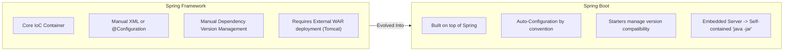

### ⚡ Comparison Matrix

| Dimension | Spring Framework | Spring Boot |
|---|---|---|
| **Goal** | Provides the core dependency injection and enterprise abstractions. | Eliminates configuration boilerplate and accelerates time-to-market. |
| **Configuration** | Heavy boilerplate (XML files or extensive Java `@Configuration` classes). | Opinionated auto-configuration ("convention over configuration"). |
| **Server Deployment** | Packaged as `.war` and deployed to an external application server (Tomcat/JBoss). | Standalone executable `.jar` with an **embedded server** (`java -jar app.jar`). |
| **Dependency Management** | Developer manually specifies individual artifact versions and resolves version conflicts. | **Starters** manage coordinated, tested dependency versions automatically via BOM. |
| **Production Features** | Requires manual integration for health endpoints, metrics, and monitoring. | **Spring Boot Actuator** provides out-of-the-box production health and metrics endpoints. |

[⬆ Back to Top](#📑-table-of-contents)

---

## 6. `@SpringBootApplication` Internals & Condition Evaluation

> 💡 **Quick Revision Anchor (2-3 Words)**: `Three-in-One Bootstrap`

### 🎯 Core Concept & Meta-Annotation Breakdown
The entry point of every Spring Boot app is annotated with `@SpringBootApplication`:
```java
@SpringBootApplication
public class Application {
    public static void main(String[] args) {
        SpringApplication.run(Application.class, args);
    }
}
```

`@SpringBootApplication` is a meta-annotation that bundles **three essential annotations**:

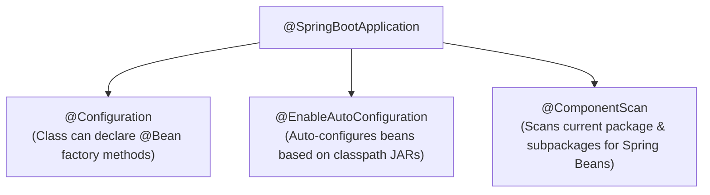

1. **`@Configuration`**: Marks the class as a source of bean definitions via `@Bean` methods.
2. **`@EnableAutoConfiguration`**: Instructs Spring Boot to examine classpath libraries and intelligently configure beans.
3. **`@ComponentScan`**: Recursively scans the package of the main class and all its subpackages to discover and register `@Component`, `@Service`, `@Repository`, and `@RestController` beans.

### 🔍 Condition Evaluation Report (`--debug`)
> [!TIP]
> **Placement Interview Question**: *"How do you know why Spring Boot created a particular bean or skipped another?"*  
> **Answer**: Run the application with `--debug` (e.g. `java -jar app.jar --debug`). Spring Boot prints the **Condition Evaluation Report** showing:
> - **Positive matches**: Beans created because conditions matched.
> - **Negative matches**: Beans omitted because conditions failed (e.g., missing classes on classpath or existing custom developer beans).

[⬆ Back to Top](#📑-table-of-contents)

---

## 7. Spring Boot Actuator (Custom Health Indicators & Metrics)

> 💡 **Quick Revision Anchor (2-3 Words)**: `Production Health Monitoring`

### 🎯 Core Concept & Key Endpoints
Spring Boot Actuator provides built-in HTTP endpoints to monitor and inspect application health, runtime metrics, and environment details in production.

```xml
<dependency>
    <groupId>org.springframework.boot</groupId>
    <artifactId>spring-boot-starter-actuator</artifactId>
</dependency>
```

- **`/actuator/health`**: Returns basic application status (`{"status": "UP"}`), database connectivity, and disk space.
- **`/actuator/info`**: Exposes arbitrary application metadata (build version, git commit details).
- **`/actuator/metrics`**: Displays JVM memory usage, active thread counts, and garbage collection stats.
- **`/actuator/loggers`**: Allows viewing and **dynamically altering log levels** at runtime without restarting the server!

```properties
# Exposing endpoints in application.properties
management.endpoints.web.exposure.include=health,info,metrics,loggers
# Showing full component health details
management.endpoint.health.show-details=always
# Isolating Actuator on a private internal port
management.server.port=8081
```

### 💻 Writing a Custom Health Indicator
```java
@Component
public class CustomDatabaseHealthIndicator implements HealthIndicator {

    @Override
    public Health health() {
        boolean databaseReachable = checkDbConnection();
        if (databaseReachable) {
            return Health.up()
                .withDetail("database", "PostgreSQL 15 is reachable")
                .withDetail("latency", "4ms")
                .build();
        }
        return Health.down()
            .withDetail("database", "Connection timed out")
            .build();
    }

    private boolean checkDbConnection() {
        // ping database or connection pool
        return true;
    }
}
```

[⬆ Back to Top](#📑-table-of-contents)

---

## 8. Global Exception Handling (`@RestControllerAdvice` & ProblemDetail)

> 💡 **Quick Revision Anchor (2-3 Words)**: `Centralized Error Interceptor`

### 🎯 Core Concept & Interception Flow
Without centralized exception handling, controllers end up cluttered with repetitive `try-catch` blocks. Spring provides `@RestControllerAdvice` and `@ExceptionHandler` to intercept exceptions thrown by any controller method in a clean, decoupled manner.

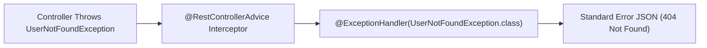

### 💻 Modern Spring Boot 3 Approach: RFC 7807 `ProblemDetail`
In Spring Boot 3 / Spring 6, the industry-standard way to return errors is using **`ProblemDetail`**:

```java
@RestControllerAdvice
public class GlobalExceptionHandler {

    @ExceptionHandler(UserNotFoundException.class)
    public ProblemDetail handleUserNotFound(UserNotFoundException ex, HttpServletRequest request) {
        ProblemDetail problem = ProblemDetail.forStatusAndDetail(HttpStatus.NOT_FOUND, ex.getMessage());
        problem.setTitle("User Not Found");
        problem.setType(URI.create("https://api.example.com/errors/not-found"));
        problem.setProperty("timestamp", Instant.now());
        problem.setProperty("path", request.getRequestURI());
        return problem;
    }

    @ExceptionHandler(MethodArgumentNotValidException.class)
    public ProblemDetail handleValidation(MethodArgumentNotValidException ex) {
        ProblemDetail problem = ProblemDetail.forStatusAndDetail(HttpStatus.BAD_REQUEST, "Validation failed");
        Map<String, String> fieldErrors = new HashMap<>();
        ex.getBindingResult().getFieldErrors().forEach(err -> 
            fieldErrors.put(err.getField(), err.getDefaultMessage())
        );
        problem.setProperty("invalidFields", fieldErrors);
        return problem;
    }

    @ExceptionHandler(Exception.class)
    public ProblemDetail handleGenericException(Exception ex) {
        ProblemDetail problem = ProblemDetail.forStatusAndDetail(HttpStatus.INTERNAL_SERVER_ERROR, "An unexpected server error occurred");
        problem.setTitle("Internal Server Error");
        return problem;
    }
}
```

> [!WARNING]
> **Elite Placement Gotcha: Why `@RestControllerAdvice` cannot catch Spring Security 401/403 Exceptions!**  
> Interviewers love asking: *"If a user sends an invalid JWT or accesses an unauthorized route, why doesn't `@RestControllerAdvice` catch the `AuthenticationException` or `AccessDeniedException`?"*  
> **The Reason**: Spring Security filters execute in the **Servlet Filter Chain**, which runs **BEFORE** the `DispatcherServlet` and the MVC Controller layer. By the time an exception happens in the filter chain, `@RestControllerAdvice` hasn't even been reached!  
> **The Solution**: Implement custom `AuthenticationEntryPoint` (for 401 Unauthorized) and `AccessDeniedHandler` (for 403 Forbidden) and register them in your `SecurityFilterChain`:

```java
@Component
public class CustomAuthenticationEntryPoint implements AuthenticationEntryPoint {

    @Override
    public void commence(HttpServletRequest request, HttpServletResponse response, 
                         AuthenticationException ex) throws IOException {
        response.setContentType("application/json");
        response.setStatus(HttpServletResponse.SC_UNAUTHORIZED);
        response.getWriter().write("{\"error\": \"UNAUTHORIZED\", \"message\": \"" + ex.getMessage() + "\"}");
    }
}
```

[⬆ Back to Top](#📑-table-of-contents)

---

## 9. Project Lombok in Spring Boot (Best Practices & JPA Traps)

> 💡 **Quick Revision Anchor (2-3 Words)**: `Boilerplate Code Reducer`

### 🎯 Core Concept & High-Yield Annotations
Lombok uses compile-time annotation processing to generate getters, setters, constructors, builders, and `toString` methods into bytecode, keeping Java source files clean and readable.

- **`@Getter` / `@Setter`**: Generates getters and setters for all fields.
- **`@NoArgsConstructor`**: Generates a default parameterless constructor (mandatory for Hibernate/JPA entity reflection).
- **`@AllArgsConstructor`**: Generates a constructor with one parameter for each field.
- **`@RequiredArgsConstructor`**: Generates a constructor specifically for all `final` fields (ideal for clean constructor injection).
- **`@Builder`**: Implements the GoF Builder pattern for fluent, readable object instantiation.
- **`@Slf4j`**: Injects a thread-safe `Logger log = LoggerFactory.getLogger(...)` instance.

```java
@Service
@RequiredArgsConstructor // Automatically creates constructor for all final fields!
public class UserService {
    private final UserRepository userRepository; // Injected without manual constructor boilerplate!
}
```

> [!WARNING]
> **Severe Placement JPA Trap: Avoid `@Data` on JPA `@Entity` Classes!**  
> 1. **Broken Collections**: `@Data` generates `equals()` and `hashCode()` using all fields. When entities are managed by Hibernate, auto-generated IDs are `null` prior to persisting, breaking `Set` collections (`HashSet<Entity>`).
> 2. **StackOverflowError**: `@Data` generates a `toString()` method that navigates bidirectional relationships (e.g., `User -> Order -> User`), triggering an infinite loop and crashing the JVM!  
> **Golden Rule**: On JPA entities, use only `@Getter`, `@Setter`, `@NoArgsConstructor`, and explicit `@ToString.Exclude` on relational navigation fields!

[⬆ Back to Top](#📑-table-of-contents)

---

## 10. Spring Bean Scopes & Thread-Safety

> 💡 **Quick Revision Anchor (2-3 Words)**: `Bean Lifecycle Duration`

### 🎯 Core Concept & Scope Overview
A bean's scope defines its lifecycle, instantiation timing, and how instances are shared across the application:

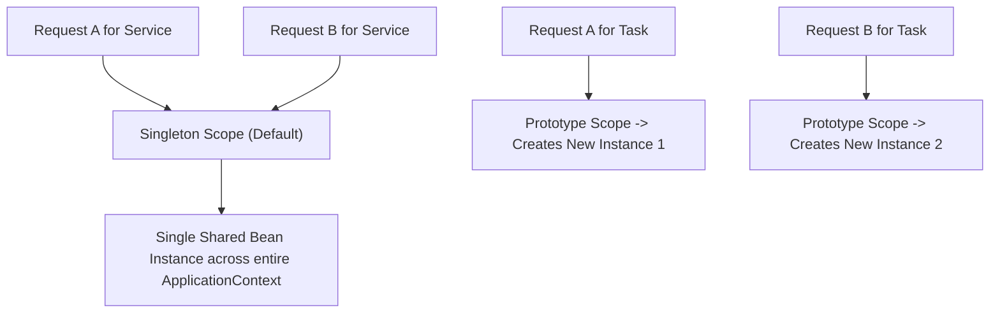

### ⚡ Scope Comparison Matrix

| Scope | Instances Created | Common Use Case |
|---|---|---|
| **`singleton`** *(Default)* | Exactly **one** instance per Spring container (`ApplicationContext`). Shared globally. | Stateless business services (`@Service`), controllers, repositories. |
| **`prototype`** | A **new** instance is created every time the bean is requested (`getBean()`). | Stateful objects, batch task handlers, non-thread-safe formatters. |
| **`request`** | One instance per HTTP request lifecycle. | User audit loggers, per-request tracing tokens. |
| **`session`** | One instance per HTTP session. | E-commerce shopping carts, user authentication session states. |
| **`application`** | One instance per `ServletContext`. | Global web caches, application-wide configuration counters. |

### ⚠️ Is a Spring Singleton Bean Thread-Safe?
> [!IMPORTANT]
> **Answer: NO!** Spring manages only the creation and sharing of the single instance; it does **not** protect against concurrent access.  
> Tomcat worker threads execute controller and service methods concurrently. If a singleton bean holds mutable class-level state, race conditions occur:
> ```java
> @Service
> public class OrderService {
>     private int orderCounter = 0; // ❌ DANGEROUS! Shared mutable state causes race conditions!
> }
> ```
> **Golden Rule**: Spring singleton beans must be **completely stateless**. Pass state through local variables or method parameters.

[⬆ Back to Top](#📑-table-of-contents)

---

## 11. Request Scope vs. Session Scope (Scoped Proxies)

> 💡 **Quick Revision Anchor (2-3 Words)**: `Per-Request vs Per-User`

### 🎯 Core Concept & Scope Boundaries
Both scopes exist exclusively inside web-aware Spring application contexts:

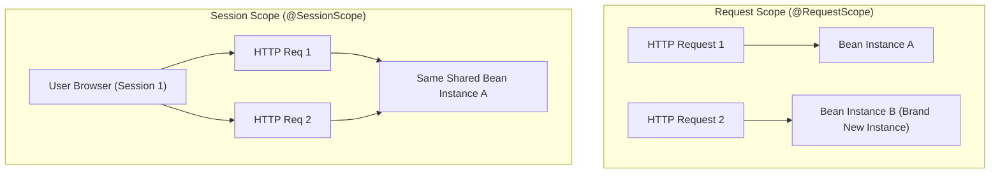

### 🏗️ The Scoped Proxy Mystery (Interview Deep Dive)
> [!TIP]
> **Placement Interview Question**: *"If a Singleton Service starts at boot time, how can it inject a Request-Scoped bean that does not exist until a user sends an HTTP request?"*  
> **Answer**: Spring injects a **Scoped Proxy** (`proxyMode = ScopedProxyMode.TARGET_CLASS`). At startup, Spring creates a dynamic CGLIB proxy placeholder. When the singleton calls a method on the proxy, the proxy intercepts the call, inspects the current thread's HTTP request context, and delegates to the real request-scoped instance!

```java
@Component
@Scope(value = WebApplicationContext.SCOPE_REQUEST, proxyMode = ScopedProxyMode.TARGET_CLASS)
public class UserRequestContext {
    private String tenantId;
    private String traceId;

    public String getTenantId() { return tenantId; }
    public void setTenantId(String tenantId) { this.tenantId = tenantId; }
    public String getTraceId() { return traceId; }
    public void setTraceId(String traceId) { this.traceId = traceId; }
}
```

[⬆ Back to Top](#📑-table-of-contents)

---

## 12. Spring Profiles (Multi-Environment Setup)

> 💡 **Quick Revision Anchor (2-3 Words)**: `Environment-Specific Config`

### 🎯 Core Concept & Configuration Files
Profiles allow developers to segregate configuration properties across environments (e.g., `dev`, `test`, `prod`) without modifying application code:

- `application.properties`: Common base configuration shared across all profiles.
- `application-dev.properties`: Local development (H2 in-memory or local PostgreSQL, debug logs).
- `application-prod.properties`: Production (Cloud AWS RDS, strict connection pools, error logs only).

### 📄 Multi-Document YAML Format (Single File Setup)
```yaml
server:
  port: 8080
---
spring:
  config:
    activate:
      on-profile: dev
  datasource:
    url: jdbc:h2:mem:devdb
---
spring:
  config:
    activate:
      on-profile: prod
  datasource:
    url: jdbc:postgresql://prod-db.internal:5432/appdb
```

### 🚀 Activating Profiles:
1. In `application.properties`: `spring.profiles.active=dev`
2. Via CLI argument: `java -jar app.jar --spring.profiles.active=prod`
3. Via OS Environment Variable: `export SPRING_PROFILES_ACTIVE=prod`

[⬆ Back to Top](#📑-table-of-contents)

---

## 13. `application.properties` vs. `application.yaml` & Configuration Precedence

> 💡 **Quick Revision Anchor (2-3 Words)**: `Hierarchy & Precedence`

### ⚡ Format Differences
- **`application.properties`**: Flat key-value format. Supports `@PropertySource` for loading custom properties files.
- **`application.yaml`**: Hierarchical tree format with clear indentation. Highly readable for complex nested configurations, but **does not** support `@PropertySource`.

### 🏆 Configuration Precedence (Highest to Lowest)
When identical keys exist in multiple locations, Spring Boot overrides them in this strict order:
1. **Command line arguments** (`--server.port=9090`)
2. **Java System Properties** (`-Dserver.port=9090`)
3. **OS Environment Variables** (`SERVER_PORT=9090`)
4. **Profile-specific application properties outside packaged jar** (`/config/application-prod.yaml`)
5. **Profile-specific application properties inside jar** (`application-prod.yaml`)
6. **Default application properties outside packaged jar** (`/config/application.yaml`)
7. **Default application properties inside jar** (`application.yaml`)

[⬆ Back to Top](#📑-table-of-contents)

---

## 14. Property Injection: `@Value` vs. `@ConfigurationProperties` vs. `Environment`

> 💡 **Quick Revision Anchor (2-3 Words)**: `Injecting Config Values`

### ⚡ Comparison Matrix

| Approach | Best Use Case | Type Safety | Relaxed Binding |
|---|---|---|---|
| **`@Value`** | Injecting 1 or 2 isolated primitive properties. | ❌ No (String-based) | ❌ No |
| **`@ConfigurationProperties`** | Grouping a related tree of structured properties into a POJO. | ✅ Full Type-Safety | ✅ Yes (camelCase, kebab-case) |
| **`Environment`** | Programmatically querying properties dynamically at runtime. | ❌ Manual casting | ❌ No |

### 💻 SpEL (Spring Expression Language) with `@Value`:
```java
@Component
public class AppConfigProperties {

    // Default fallback value if property is missing
    @Value("${app.timeout:5000}")
    private int timeout;

    // Evaluating mathematical expressions with SpEL
    @Value("#{24 * 60 * 60}")
    private int secondsInDay;

    // Injecting split array/list from comma-separated property
    @Value("#{'${app.allowed.origins}'.split(',')}")
    private List<String> allowedOrigins;
}
```

[⬆ Back to Top](#📑-table-of-contents)

---

## 15. Persistence Stack: JDBC vs. Hibernate vs. JPA vs. Spring Data JPA

> 💡 **Quick Revision Anchor (2-3 Words)**: `Database Abstraction Layers`

### 🎯 Architectural Hierarchy

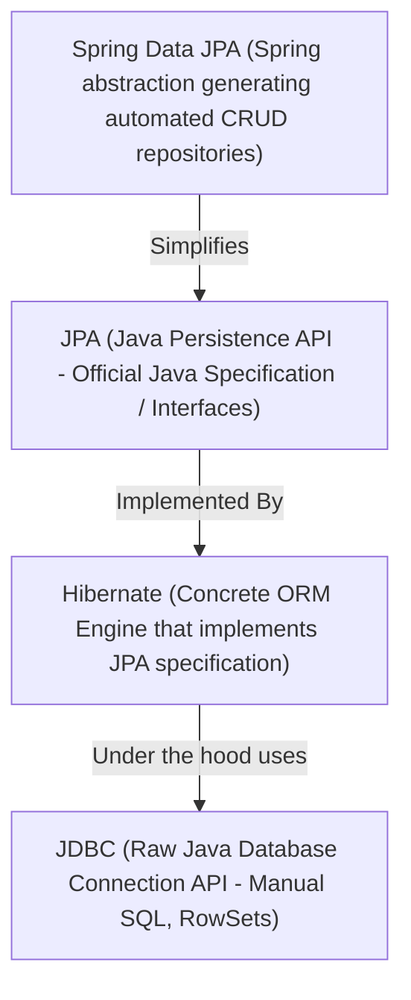

### ⚡ First-Level Cache & Automatic Dirty Checking
1. **First-Level Cache (Session/EntityManager)**: Every Hibernate `Session` acts as an in-memory cache. If you invoke `userRepository.findById(1L)` multiple times within the same `@Transactional` method, Hibernate executes the SQL `SELECT` query **only once**!
2. **Automatic Dirty Checking**: When an entity is loaded inside a transaction, Hibernate retains an internal snapshot. If you modify entity fields (e.g., `user.setEmail("new@example.com")`), at transaction commit time Hibernate detects the deviation and **automatically issues SQL `UPDATE` queries** without needing to call `repository.save()`!

[⬆ Back to Top](#📑-table-of-contents)

---

## 16. `@Transactional` Mechanics (AOP Proxies & Self-Invocation Trap)

> 💡 **Quick Revision Anchor (2-3 Words)**: `All-or-Nothing ACID`

### 🎯 Core Concept & Execution Flow
`@Transactional` guarantees that a series of database operations execute within an atomic transaction boundary following ACID rules: **either all operations succeed (COMMIT) or if any failure occurs, all operations are undone (ROLLBACK)**.

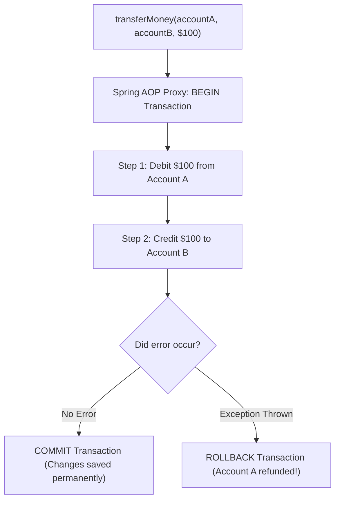

### ⚠️ The Self-Invocation Trap (Premier Interview Trap)
```java
@Service
public class OrderService {

    public void processOrder() {
        // Internal method call via 'this'
        this.saveToDatabase(); // ❌ @Transactional WILL NOT TRIGGER!
    }

    @Transactional
    public void saveToDatabase() {
        // database changes
    }
}
```
**Why it fails**: Spring creates a dynamic proxy around `OrderService`. When an external class calls `processOrder()`, the proxy delegates to the target. But inside `processOrder()`, calling `this.saveToDatabase()` is an internal direct method call on the raw object—**the AOP Proxy is completely bypassed**, so no transaction is ever started!  
**Solution**: Move `saveToDatabase()` to a separate service class or inject self via `@Autowired private OrderService self;`.

### 🛡️ Rollback & Configuration Rules:
- **Default**: Rolls back only on unchecked exceptions (`RuntimeException` and `Error`).
- **Checked Exceptions**: Does **not** roll back on checked exceptions (e.g., `SQLException`, `IOException`) unless explicitly configured:  
  `@Transactional(rollbackFor = Exception.class)`.
- **`readOnly = true`**: Optimizes performance. Hibernate skips dirty checking snapshots and routes queries to read-only DB replicas.
- **`timeout = 5`**: Automatically rolls back if transaction execution exceeds 5 seconds.
- **`isolation = Isolation.READ_COMMITTED`**: Specifies the concurrency isolation level for this transaction.

[⬆ Back to Top](#📑-table-of-contents)

---

## 17. Transaction Propagation (All 7 Levels Explained)

> 💡 **Quick Revision Anchor (2-3 Words)**: `Transaction Boundary Rules`

### 🎯 Core Concept & Boundary Decisions
Transaction propagation determines what happens when a transactional method invokes another transactional method:

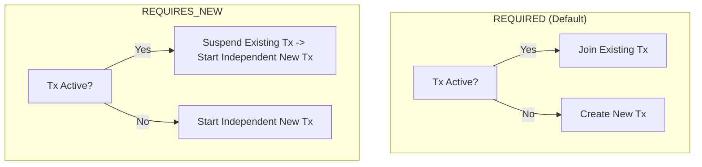

### ⚡ All 7 Propagation Levels Explained

| Propagation Level | Internal Behavior | Placement Scenario / Use Case |
|---|---|---|
| **`REQUIRED`** *(Default)* | Joins existing transaction if present; creates a new one if none exists. | Standard CRUD (e.g., updating user balance and deducting cart items together). |
| **`REQUIRES_NEW`** | Always creates an independent transaction; suspends active transaction until it finishes. | Security audit logging, payment transaction history (must commit even if main business action fails). |
| **`SUPPORTS`** | Executes in existing transaction if present; runs non-transactionally if none exists. | Read-only lookup methods. |
| **`MANDATORY`** | Must run within an existing transaction; throws `IllegalTransactionStateException` if none exists. | Dependent sub-operations that cannot execute safely on their own. |
| **`NOT_SUPPORTED`** | Suspends active transaction and executes non-transactionally. | Expensive I/O or external network calls (email/SMS) to avoid holding database connection locks. |
| **`NEVER`** | Throws an exception if an active transaction exists. | Strict read operations forbidden from transactional locking. |
| **`NESTED`** | Creates a database **Savepoint** inside the active transaction. | Sub-steps that can fail and roll back individually without rolling back the parent transaction. |

[⬆ Back to Top](#📑-table-of-contents)

---

## 18. Bean Disambiguation: `@Primary` vs. `@Qualifier` & Strategy Pattern

> 💡 **Quick Revision Anchor (2-3 Words)**: `Default vs Explicit Bean`

### 🎯 Core Concept & Ambiguity Resolution
When multiple beans implement the same interface, Spring throws `NoUniqueBeanDefinitionException` unless disambiguation is provided:

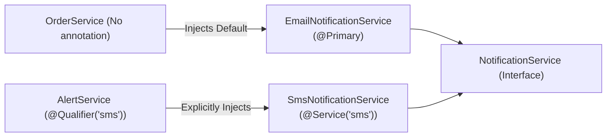

- **`@Primary`**: Designates a default bean when no specific bean name is requested.
- **`@Qualifier("beanName")`**: Explicitly selects a specific bean implementation by name at the injection point.

### 💻 Dynamic Strategy Pattern (Advanced Placement Question)
> [!TIP]
> **Placement Interview Question**: *"How can you select and inject a bean dynamically based on a runtime parameter (e.g. payment type 'PAYPAL' or 'STRIPE') without if-else chains?"*  
> **Answer**: Inject a `Map<String, StrategyInterface>` directly! Spring automatically populates the map with `beanName -> beanInstance`:

```java
@Service
public class PaymentProcessingManager {

    private final Map<String, PaymentStrategy> paymentStrategies;

    // Spring auto-injects all PaymentStrategy beans into the map keyed by their bean names!
    public PaymentProcessingManager(Map<String, PaymentStrategy> paymentStrategies) {
        this.paymentStrategies = paymentStrategies;
    }

    public void processPayment(String paymentType, BigDecimal amount) {
        PaymentStrategy strategy = paymentStrategies.get(paymentType.toLowerCase() + "Strategy");
        if (strategy == null) {
            throw new IllegalArgumentException("Unsupported payment provider: " + paymentType);
        }
        strategy.pay(amount);
    }
}
```

[⬆ Back to Top](#📑-table-of-contents)

---

## 19. Injection Types: Constructor vs. Setter vs. Field Injection

> 💡 **Quick Revision Anchor (2-3 Words)**: `Always Prefer Constructor`

### ⚡ Comparison Matrix

| Criteria | Constructor Injection | Setter Injection | Field Injection (`@Autowired`) |
|---|---|---|---|
| **Immutability** | ✅ Yes (`final` fields) | ❌ No | ❌ No |
| **Unit Testability** | ✅ Effortless (Pass mocks via `new`) | ⚠️ Requires calling setters | ❌ Hard (Requires Reflection / Spring context) |
| **Circular Dependency** | 🛡️ Fails fast at startup | ⚠️ Masked at runtime | ⚠️ Masked at runtime |
| **Industry Recommendation**| **Strongly Recommended** | Optional dependencies only | **Strongly Discouraged (Anti-Pattern)** |

### ⚠️ Why Field Injection is an Anti-Pattern:
1. **Breaks Immutability**: Fields cannot be marked `final`.
2. **Hidden Dependencies**: Classes can be instantiated with `new UserService()` without compile errors, producing unexpected `NullPointerException`s at runtime.
3. **Coupled to Spring Container**: Cannot be tested in unit tests without starting a heavyweight Spring context or using intrusive reflection utilities (`ReflectionTestUtils`).

[⬆ Back to Top](#📑-table-of-contents)

---

## 20. `@Lookup` Annotation & Dynamic Prototype Injection

> 💡 **Quick Revision Anchor (2-3 Words)**: `Prototype Inside Singleton`

### 🎯 Core Problem
Because a Singleton bean is instantiated only once at startup, any Prototype bean injected into it via constructor/field will be **injected only once**—causing the prototype to behave like a singleton!

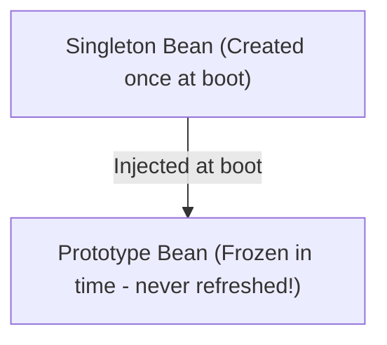

### 💡 Solutions:
#### 1. Method Injection via `@Lookup`:
Spring uses CGLIB byte-code enhancement to override the abstract method and fetch a fresh prototype instance from the container every time it is called:

```java
@Component
public abstract class ReportService {

    public void generateReport() {
        ReportTask task = getReportTask(); // Always returns a fresh prototype instance!
        task.execute();
    }

    @Lookup
    protected abstract ReportTask getReportTask();
}
```

#### 2. Modern Spring Idiom: `ObjectProvider<T>`:
```java
@Service
public class ReportService {

    private final ObjectProvider<ReportTask> taskProvider;

    public ReportService(ObjectProvider<ReportTask> taskProvider) {
        this.taskProvider = taskProvider;
    }

    public void generateReport() {
        ReportTask task = taskProvider.getObject(); // Fresh prototype instance on demand
        task.execute();
    }
}
```

[⬆ Back to Top](#📑-table-of-contents)

---

## 21. Servlet Filters vs. Spring MVC Interceptors

> 💡 **Quick Revision Anchor (2-3 Words)**: `Servlet vs MVC Layer`

### 🎯 Architectural Position & Execution Flow


### ⚡ Comparison Matrix

| Feature | Servlet Filter (`OncePerRequestFilter`) | Handler Interceptor (`HandlerInterceptor`) |
|---|---|---|
| **Specification** | Java Servlet Standard (`jakarta.servlet`). | Spring Framework MVC abstraction. |
| **Execution Point** | Before `DispatcherServlet`. | Between `DispatcherServlet` and Controller. |
| **Access to Controller?**| ❌ No (Only raw `HttpServletRequest/Response`). | ✅ Yes (Receives `Object handler` representing controller method). |
| **Typical Use Cases** | Security authentication (JWT filter), CORS headers, GZIP compression, Request character encoding. | Authorization checks, execution timing metrics, attaching global model attributes. |

[⬆ Back to Top](#📑-table-of-contents)

---

## 22. Cyclic Dependencies, `@Lazy` & Architectural Decoupling

> 💡 **Quick Revision Anchor (2-3 Words)**: `Circular Reference Workaround`

### 🎯 What is a Circular Dependency?
A circular dependency occurs when `Bean A` requires `Bean B`, and `Bean B` requires `Bean A` (`A ⇄ B`). Starting with **Spring Boot 2.6**, circular dependencies are **forbidden by default**, throwing `BeanCurrentlyInCreationException`.

### 🛠️ How `@Lazy` Resolves It:
Placing `@Lazy` on one constructor tells Spring to inject a dynamic CGLIB proxy placeholder during context startup instead of the real bean. The actual bean is lazily loaded only when its method is called for the first time:

```java
@Service
public class ServiceB {
    private final ServiceA serviceA;

    public ServiceB(@Lazy ServiceA serviceA) {
        this.serviceA = serviceA;
    }
}
```

### 🏗️ Proper Architectural Fixes (Placement Best Practices):
1. **Extract Shared Logic**: Extract the shared method into a third collaborator (`ServiceC`) that both `ServiceA` and `ServiceB` depend on.
2. **Event-Driven Decoupling**: Instead of direct method invocation, publish an event via `ApplicationEventPublisher` to break the direct dependency link.

[⬆ Back to Top](#📑-table-of-contents)

---

## 23. `@PathVariable` vs. `@RequestParam`

> 💡 **Quick Revision Anchor (2-3 Words)**: `URI Path vs Query Param`

### 🎯 Visual Differentiation

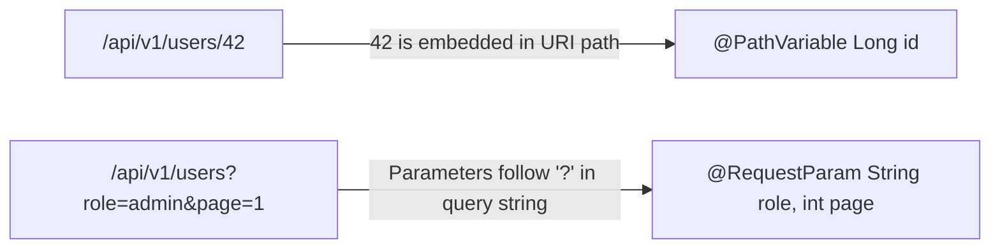

### 💻 Code Implementation & Best Practices:
```java
@RestController
@RequestMapping("/api/v1/users")
public class UserController {

    // @PathVariable identifies a specific resource by ID
    @GetMapping("/{id:[0-9]+}")
    public ResponseEntity<UserResponse> getUserById(@PathVariable("id") Long id) {
        return ResponseEntity.ok(userService.findById(id));
    }

    // @RequestParam filters, paginates, or queries resources
    @GetMapping
    public ResponseEntity<Page<UserResponse>> searchUsers(
            @RequestParam(name = "role", defaultValue = "USER") String role,
            @RequestParam(name = "page", defaultValue = "0") int page,
            @RequestParam(name = "size", defaultValue = "20") int size) {
        return ResponseEntity.ok(userService.findByRole(role, PageRequest.of(page, size)));
    }
}
```

[⬆ Back to Top](#📑-table-of-contents)

---

## 24. `ResponseEntity<T>` & HTTP Response Customization

> 💡 **Quick Revision Anchor (2-3 Words)**: `Full HTTP Control`

### 🎯 Core Concept & Capabilities
`ResponseEntity<T>` represents the complete HTTP response: status code, headers, and body. It gives developers programmatic control over HTTP response semantics.

```java
@RestController
@RequestMapping("/api/v1/users")
public class UserController {

    private final UserService userService;

    public UserController(UserService userService) {
        this.userService = userService;
    }

    @GetMapping("/{id}")
    public ResponseEntity<UserResponse> getUser(@PathVariable Long id) {
        UserResponse user = userService.findById(id);
        return ResponseEntity.ok()
            .eTag(String.valueOf(user.version()))
            .cacheControl(CacheControl.maxAge(60, TimeUnit.SECONDS))
            .body(user);
    }

    @PostMapping
    public ResponseEntity<UserResponse> createUser(@Valid @RequestBody UserCreateRequest request) {
        UserResponse created = userService.create(request);
        URI location = ServletUriComponentsBuilder.fromCurrentRequest()
            .path("/{id}")
            .buildAndExpand(created.id())
            .toUri();
        // Returns HTTP 201 Created with Location header pointing to new resource
        return ResponseEntity.created(location).body(created);
    }
}
```

[⬆ Back to Top](#📑-table-of-contents)

---

## 25. `DispatcherServlet` & Spring MVC Request Flow

> 💡 **Quick Revision Anchor (2-3 Words)**: `Front Controller Hub`

### 🎯 Core Concept & Step-by-Step Sequence
`DispatcherServlet` is the central coordinator for all incoming HTTP requests in Spring MVC, implementing the classic **Front Controller Pattern**.

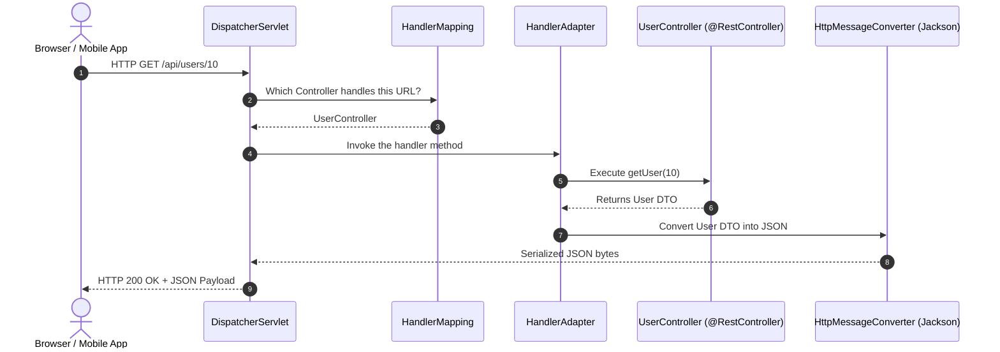

### ⚙️ Six Core Collaborators
1. **`HandlerMapping`**: Maps the incoming URL to the target controller method.
2. **`HandlerAdapter`**: Dynamically executes the target handler method with parsed arguments.
3. **`HandlerExceptionResolver`**: Catches exceptions and delegates them to `@ExceptionHandler` methods.
4. **`HttpMessageConverter`**: Serializes Java POJOs into JSON/XML payloads (and deserializes request bodies).
5. **`ViewResolver`**: Resolves view template names into HTML (in MVC apps).
6. **`MultipartResolver`**: Parses file upload requests.

[⬆ Back to Top](#📑-table-of-contents)

---

## 26. Pagination, Sorting & Dynamic Filtering (JPA Criteria / Specifications)

> 💡 **Quick Revision Anchor (2-3 Words)**: `Database-Side Chunking`

### 🎯 Core Concept & Why Memory Loading is Dangerous
Loading an entire table containing 500,000 rows into JVM memory causes an immediate `OutOfMemoryError`. Spring Data JPA supports database-level chunking using `Pageable` (`LIMIT` and `OFFSET` in SQL).

```java
@RestController
@RequestMapping("/api/v1/products")
public class ProductController {

    private final ProductService productService;

    public ProductController(ProductService productService) {
        this.productService = productService;
    }

    @GetMapping
    public ResponseEntity<Page<ProductResponse>> getProducts(
            @RequestParam(defaultValue = "0") int page,
            @RequestParam(defaultValue = "20") int size,
            @RequestParam(defaultValue = "price,desc") String sort) {

        Pageable pageable = PageRequest.of(page, size, Sort.by("price").descending());
        return ResponseEntity.ok(productService.findAll(pageable));
    }
}
```

### ⚡ `Page<T>` vs. `Slice<T>`
- **`Page<T>`**: Executes **two queries**: one for the slice data (`LIMIT/OFFSET`), and a secondary `SELECT COUNT(*)` query to calculate total elements and pages.
- **`Slice<T>`**: Fetches `LIMIT + 1` elements. Does **not** execute a count query. Ideal for mobile infinite-scrolling feeds where total counts are unnecessary, saving significant database CPU!

### 🔍 Dynamic Multi-Field Filtering via `Specification<T>`:
```java
public class ProductSpecifications {

    public static Specification<Product> hasCategory(String category) {
        return (root, query, cb) -> category == null ? null : cb.equal(root.get("category"), category);
    }

    public static Specification<Product> priceBetween(BigDecimal min, BigDecimal max) {
        return (root, query, cb) -> cb.between(root.get("price"), min, max);
    }
}

// In Service Layer: Combine predicates dynamically
Specification<Product> spec = Specification.where(ProductSpecifications.hasCategory("Electronics"))
                                           .and(ProductSpecifications.priceBetween(min, max));
Page<Product> results = productRepository.findAll(spec, pageable);
```

[⬆ Back to Top](#📑-table-of-contents)

---

## 27. Object Mapping with MapStruct & DTO Pattern

> 💡 **Quick Revision Anchor (2-3 Words)**: `Compile-Time DTO Mapper`

### 🎯 Why MapStruct Over Reflection Mappers?
Traditional reflection-based mappers (such as ModelMapper) inspect class definitions dynamically at runtime, creating substantial CPU overhead and failing silently if field names change. **MapStruct generates plain, type-safe Java code at compile time** with zero reflection overhead.

```java
@Mapper(componentModel = "spring")
public interface UserMapper {

    // Resolves nested navigation: user.contact.emailAddress -> email
    @Mapping(source = "contact.emailAddress", target = "email")
    UserResponse toResponse(User user);

    User toEntity(UserCreateRequest request);

    @AfterMapping
    default void setAuditTimestamps(@MappingTarget User user) {
        user.setCreatedAt(Instant.now());
    }
}
```

[⬆ Back to Top](#📑-table-of-contents)

---

## 28. Core Spring Boot Annotations Quick Reference

> 💡 **Quick Revision Anchor (2-3 Words)**: `Essential Annotation Cheat Sheet`

### ⚡ Annotation Quick Reference Matrix

| Annotation | Category | What It Does |
|---|---|---|
| **`@Version`** | JPA Concurrency | Enables **Optimistic Locking** to detect concurrent record updates via version comparison. |
| **`@CreatedDate`** | JPA Auditing | Automatically populates entity creation timestamp on record insertion. |
| **`@Transient`** | JPA Mapping | Ignores field; never persists or maps it to a database column. |
| **`@Transactional`** | Spring Tx | Declares an atomic database transaction boundary around methods. |
| **`@CreationTimestamp`** | Hibernate | Automatically sets creation timestamp on INSERT. |
| **`@UpdateTimestamp`** | Hibernate | Automatically sets update timestamp on UPDATE. |
| **`@Modifying`** | Spring Data JPA | Informs Spring that a `@Query` executes an `INSERT`, `UPDATE`, or `DELETE` rather than a `SELECT`. |

[⬆ Back to Top](#📑-table-of-contents)

---

## 29. Input Validation & Custom Validators (`@Valid`)

> 💡 **Quick Revision Anchor (2-3 Words)**: `Declarative Bean Validation`

### 🎯 Core Concept & Built-in Annotations
Spring Boot provides seamless integration with Jakarta Bean Validation (`spring-boot-starter-validation`). Annotating controller request bodies with `@Valid` triggers validation before the method executes.

- **`@NotNull`**: Ensures value is not `null`.
- **`@NotEmpty`**: Ensures value is not `null` and length/size > 0.
- **`@NotBlank`**: Ensures value is not `null`, not empty, and contains at least one non-whitespace character (best for Strings).
- **`@Size(min = 2, max = 50)`**: Enforces length constraints.
- **`@Email`**: Enforces valid email pattern.

### 💻 Creating a Custom Constraint Validator:
```java
@Target({ElementType.FIELD, ElementType.PARAMETER})
@Retention(RetentionPolicy.RUNTIME)
@Constraint(validatedBy = PhoneNumberValidator.class)
public @interface ValidPhoneNumber {
    String message() default "Invalid international phone number";
    Class<?>[] groups() default {};
    Class<? extends Payload>[] payload() default {};
}

public class PhoneNumberValidator implements ConstraintValidator<ValidPhoneNumber, String> {

    @Override
    public boolean isValid(String value, ConstraintValidatorContext context) {
        // Must follow international E.164 phone format: +[countryCode][number]
        return value != null && value.matches("^\\+[1-9]\\d{1,14}$");
    }
}
```

[⬆ Back to Top](#📑-table-of-contents)

---

## 30. Rapid-Fire Interview Questions & Answers

> 💡 **Quick Revision Anchor (2-3 Words)**: `10-Second Recall Answers`

1. **What is Spring Boot Auto-Configuration?**  
   *Answer*: Automatically registers beans based on dependencies present on the classpath using conditional evaluations (`@ConditionalOnClass`, `@ConditionalOnMissingBean`).
2. **What is the default bean scope in Spring?**  
   *Answer*: `singleton`.
3. **Is Spring's singleton bean thread-safe?**  
   *Answer*: No. Singleton defines only one instance; developers must keep it stateless to prevent race conditions.
4. **What is the difference between `@NotNull`, `@NotEmpty`, and `@NotBlank`?**  
   *Answer*: `@NotNull` checks != null; `@NotEmpty` checks != null and size > 0; `@NotBlank` checks != null, size > 0, and non-whitespace characters.
5. **Does `@Transactional` roll back checked exceptions by default?**  
   *Answer*: No, only unchecked exceptions (`RuntimeException` and `Error`). Use `@Transactional(rollbackFor = Exception.class)` for checked exceptions.
6. **What embedded servlet containers does Spring Boot support?**  
   *Answer*: Apache Tomcat (default), Jetty, and Undertow.
7. **What is the N+1 Query Problem in Hibernate?**  
   *Answer*: 1 query to fetch parents followed by N individual queries to fetch children. Solved using `JOIN FETCH` or `@EntityGraph`.
8. **What three annotations does `@SpringBootApplication` combine?**  
   *Answer*: `@Configuration`, `@EnableAutoConfiguration`, and `@ComponentScan`.
9. **How do you resolve a circular dependency?**  
   *Answer*: Redesign architecture (extract common logic), decouple via Spring Application Events, or use `@Lazy` injection as a temporary workaround.
10. **Why is Constructor Injection preferred over Field Injection?**  
    *Answer*: Enforces immutability with `final` fields, eliminates hidden dependencies, and allows effortless unit testing with standard `new` calls without Spring contexts.

[⬆ Back to Top](#📑-table-of-contents)

---

## 31. End-to-End Project Explanation Framework

> 💡 **Quick Revision Anchor (2-3 Words)**: `Resume Architecture Defense`

### 🏗️ Complete Backend Architectural Flow

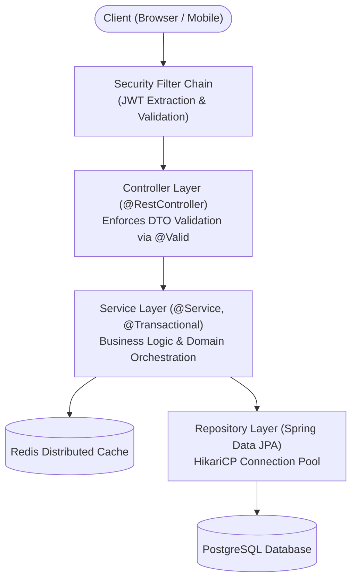

### 🗣️ Verbal Script Template for Placement Interviews:
> *"In my project, I engineered a scalable RESTful backend using Spring Boot 3 and Java 17. The architecture strictly follows enterprise clean layering:*
> 1. *Incoming requests are intercepted by a custom `JwtAuthenticationFilter` that validates tokens and populates the `SecurityContextHolder`.*
> 2. *The **Controller Layer** exposes REST endpoints, enforces input validation via Bean Validation (`@Valid`), and returns structured responses using `ResponseEntity<T>`.*
> 3. *The **Service Layer** encapsulates core business logic and guarantees ACID transaction integrity using `@Transactional`.*
> 4. *The **Data Access Layer** leverages Spring Data JPA on top of PostgreSQL, utilizing `JOIN FETCH` queries to eliminate N+1 latency bottlenecks and HikariCP for high-throughput connection pooling.*
> 5. *Cross-cutting exceptions are intercepted centrally with `@RestControllerAdvice` returning RFC 7807 `ProblemDetail` payloads."*

[⬆ Back to Top](#📑-table-of-contents)

---

## 32. High-Yield Topics Beyond the Playlist

---

### A. Spring Security & Stateless JWT Authentication

> 💡 **Quick Revision Anchor (2-3 Words)**: `Stateless Token Security`

In modern distributed microservices and REST APIs, stateful HTTP sessions are replaced with stateless JSON Web Tokens (JWT).

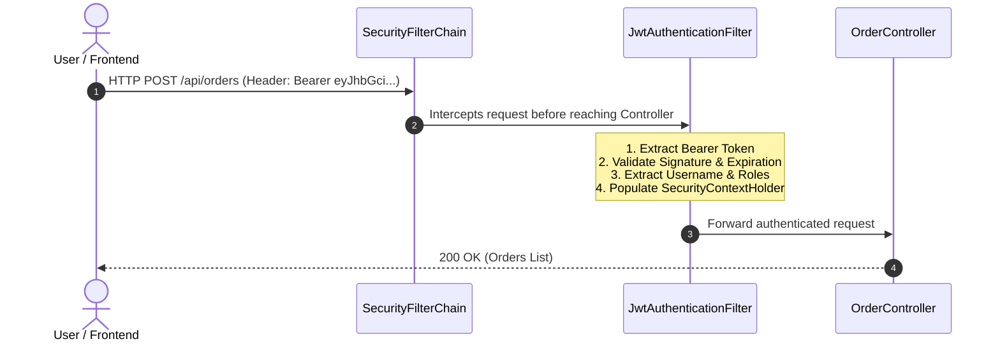

#### 🔑 JWT Token Structure:
A JWT consists of 3 Base64URL-encoded parts separated by periods (`header.payload.signature`):
1. **Header**: Algorithm and token type (`{"alg": "HS256", "typ": "JWT"}`).
2. **Payload (Claims)**: Registered and custom claims (e.g. `sub` (username), `roles`, `iat`, `exp`).
3. **Signature**: Cryptographic hash created using secret key: `HMACSHA256(base64UrlEncode(header) + "." + base64UrlEncode(payload), secretKey)`.

#### 💻 JWT Generation & Validation Utility:
```java
@Service
public class JwtService {

    private final String SECRET_KEY = "mySuperSecretSigningKeyThatIsAtLeast256BitsLongForHMACSHA256";

    public String generateToken(UserDetails userDetails) {
        Map<String, Object> claims = new HashMap<>();
        claims.put("roles", userDetails.getAuthorities().stream().map(GrantedAuthority::getAuthority).toList());
        return Jwts.builder()
            .setClaims(claims)
            .setSubject(userDetails.getUsername())
            .setIssuedAt(new Date(System.currentTimeMillis()))
            .setExpiration(new Date(System.currentTimeMillis() + 1000 * 60 * 60 * 2)) // 2 Hours
            .signWith(Keys.hmacShaKeyFor(SECRET_KEY.getBytes(StandardCharsets.UTF_8)), SignatureAlgorithm.HS256)
            .compact();
    }

    public String extractUsername(String token) {
        return extractAllClaims(token).getSubject();
    }

    public boolean isTokenValid(String token, UserDetails userDetails) {
        final String username = extractUsername(token);
        return (username.equals(userDetails.getUsername()) && !isTokenExpired(token));
    }

    private boolean isTokenExpired(String token) {
        return extractAllClaims(token).getExpiration().before(new Date());
    }

    private Claims extractAllClaims(String token) {
        return Jwts.parserBuilder()
            .setSigningKey(Keys.hmacShaKeyFor(SECRET_KEY.getBytes(StandardCharsets.UTF_8)))
            .build()
            .parseClaimsJws(token)
            .getBody();
    }
}
```

#### 🛡️ Modern Spring Security 6 / Spring Boot 3 Configuration:
```java
@Configuration
@EnableWebSecurity
@RequiredArgsConstructor
public class SecurityConfig {

    private final JwtAuthenticationFilter jwtAuthFilter;

    @Bean
    public SecurityFilterChain securityFilterChain(HttpSecurity http) throws Exception {
        return http
            .csrf(csrf -> csrf.disable()) // Disabled for stateless REST APIs
            .sessionManagement(session -> session.sessionCreationPolicy(SessionCreationPolicy.STATELESS))
            .authorizeHttpRequests(auth -> auth
                .requestMatchers("/api/auth/**").permitAll()
                .requestMatchers("/api/admin/**").hasRole("ADMIN")
                .anyRequest().authenticated()
            )
            .addFilterBefore(jwtAuthFilter, UsernamePasswordAuthenticationFilter.class)
            .build();
    }
}
```

[⬆ Back to Top](#📑-table-of-contents)

---

### B. JPA Relationships (`@OneToMany`, `@ManyToOne`) & Cascade Rules

> 💡 **Quick Revision Anchor (2-3 Words)**: `Entity Mapping & Ownership`

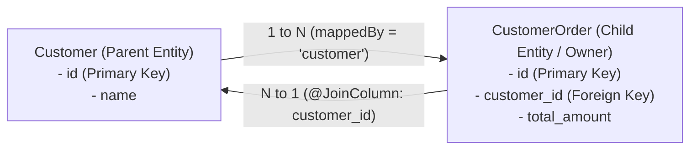

- **Ownership Rule**: The table with the foreign key column is **always the owner of the relationship**.
- **`mappedBy` Rule**: Belongs strictly on the inverse (parent) side. Points to the property name in the child entity. Forgetting `mappedBy` causes JPA to create an unnecessary third join table!
- **`orphanRemoval = true`**: If a child entity is removed from the parent's collection, JPA automatically issues an SQL `DELETE` for the child row.
- **`CascadeType.ALL`**: Cascades all lifecycle events (`PERSIST`, `MERGE`, `REMOVE`, `REFRESH`, `DETACH`) from parent to child.

[⬆ Back to Top](#📑-table-of-contents)

---

### C. Fetch Types: LAZY vs. EAGER & The N+1 Query Problem

> 💡 **Quick Revision Anchor (2-3 Words)**: `Solve With Join-Fetch`

### ⚡ Default Fetch Types in JPA:
- **`@ManyToOne` / `@OneToOne`**: Defaults to **`EAGER`** (Loads associated entity immediately).  
  *Best Practice*: Always change to `FetchType.LAZY`!
- **`@OneToMany` / `@ManyToMany`**: Defaults to **`LAZY`** (Loads associated collection on demand).

### ⚠️ What is the N+1 Query Problem?
Suppose you fetch 10 Customers, and for each Customer, Hibernate executes an extra query to load their Orders:
- 1 Query to fetch 10 customers: `SELECT * FROM customers;`
- N Queries (10 queries) to fetch orders for each customer: `SELECT * FROM orders WHERE customer_id = ?;`
- **Total: 1 + 10 = 11 queries instead of 1 single query!**

```mermaid
flowchart TD
    Q1["Query 1: SELECT * FROM customers (Returns 100 rows)"]
    Q1 --> Q2["Query 2: SELECT * FROM orders WHERE customer_id = 1"]
    Q1 --> Q3["Query 3: SELECT * FROM orders WHERE customer_id = 2"]
    Q1 --> QN["Query N: SELECT * FROM orders WHERE customer_id = 100"]
    QN --> Disaster["Result: 101 database queries executed! Massive production latency."]
```

### 💡 The Three Production Solutions:
1. **`JOIN FETCH` in JPQL** (Most Popular):
   ```java
   @Query("SELECT c FROM Customer c JOIN FETCH c.orders")
   List<Customer> findAllWithOrders();
   ```
2. **`@EntityGraph`**:
   ```java
   @EntityGraph(attributePaths = {"orders"})
   List<Customer> findAll();
   ```
3. **`@BatchSize`**:
   ```java
   @BatchSize(size = 20)
   @OneToMany(mappedBy = "customer")
   private List<Order> orders;
   // Replaces N queries with a single IN query: SELECT * FROM orders WHERE customer_id IN (?, ?, ...)
   ```

> [!WARNING]
> **The MultipleBagFetchException Trap (Common Interview Trap)**  
> *"Can you solve the N+1 problem by `JOIN FETCH`ing two `@OneToMany` list collections simultaneously (e.g. `JOIN FETCH u.orders JOIN FETCH u.addresses`)?"*  
> **Answer**: **NO!** Hibernate throws `org.hibernate.loader.MultipleBagFetchException: cannot simultaneously fetch multiple bags`.  
> **Why**: A `List` in Java represents a bag (an unordered collection that allows duplicates). Joining two bags creates a cartesian product of rows (N × M), causing Hibernate to be unable to reconstruct the lists accurately.  
> **Solutions**:
> 1. Change one or both collections from `List<T>` to `Set<T>`.
> 2. Fetch the first collection with `JOIN FETCH`, and configure `@BatchSize(size = 20)` on the second collection to fetch it efficiently in a separate second query without cartesian explosion.

[⬆ Back to Top](#📑-table-of-contents)

---

### D. REST API Design & HTTP Idempotency

> 💡 **Quick Revision Anchor (2-3 Words)**: `Standard Verbs & Statuses`

### ⚡ HTTP Verbs & Idempotency Matrix

| HTTP Verb | CRUD Action | Safe? | Idempotent? |
|---|---|---|---|
| **`GET`** | Read | ✅ Yes | ✅ Yes |
| **`POST`** | Create | ❌ No | ❌ No |
| **`PUT`** | Full Replace | ❌ No | ✅ Yes |
| **`PATCH`** | Partial Update | ❌ No | ❌ No |
| **`DELETE`** | Delete | ❌ No | ✅ Yes |

### 📋 Essential HTTP Status Codes:
- **`200 OK`**: Request succeeded with body.
- **`201 Created`**: Resource created successfully (`POST`).
- **`204 No Content`**: Succeeded, but no response body (`DELETE`).
- **`400 Bad Request`**: Validation or syntax error.
- **`401 Unauthorized`**: Authentication missing or token invalid.
- **`403 Forbidden`**: Authenticated, but user lacks permissions (Role check failed).
- **`404 Not Found`**: Resource does not exist.
- **`409 Conflict`**: State conflict (e.g. duplicate email registration).
- **`500 Internal Server Error`**: Unhandled exception in server code.

[⬆ Back to Top](#📑-table-of-contents)

---

### E. SQL & DBMS Essentials for Java Backend Interviews

> 💡 **Quick Revision Anchor (2-3 Words)**: `Joins, Indexing, ACID`

```mermaid
flowchart LR
    A["Table A (Users)"]
    B["Table B (Orders)"]

    A -->|"INNER JOIN: Only Matching Rows"| IJ["Matching Rows"]
    A -->|"LEFT JOIN: All Users + Matched Orders"| LJ["All Users + Orders (if any)"]
```

### ⚡ Transaction Isolation Levels & Concurrency Phenomena:
1. **`READ UNCOMMITTED`**: Lowest isolation; allows **Dirty Reads** (reading uncommitted data).
2. **`READ COMMITTED`** *(Default in PostgreSQL/Oracle)*: Solves dirty reads; allows **Non-Repeatable Reads** (re-reading a row gets updated data).
3. **`REPEATABLE READ`** *(Default in MySQL InnoDB)*: Solves non-repeatable reads; can permit **Phantom Reads** (new rows inserted by concurrent transaction appear).
4. **`SERIALIZABLE`**: Complete isolation via locking/MVCC. Eliminates all anomalies, highest latency.

[⬆ Back to Top](#📑-table-of-contents)

---

### F. Automated Testing with JUnit 5 & Mockito

> 💡 **Quick Revision Anchor (2-3 Words)**: `Unit Mocking vs Integration`

#### 1. Unit Testing with Mockito (`@Mock`, `@InjectMocks`):
Tests isolated business logic without starting a Spring application context (runs in milliseconds):
```java
@ExtendWith(MockitoExtension.class)
class UserServiceTest {

    @Mock
    private UserRepository userRepository;

    @InjectMocks
    private UserService userService;

    @Test
    void shouldReturnUserWhenIdExists() {
        when(userRepository.findById(1L)).thenReturn(Optional.of(new User(1L, "Alice")));

        User user = userService.getUser(1L);

        assertNotNull(user);
        assertEquals("Alice", user.getName());
        verify(userRepository, times(1)).findById(1L);
    }
}
```

#### 2. Repository Slice Testing with `@DataJpaTest`:
Tests only JPA entities, repository interfaces, and Hibernate queries with an in-memory embedded H2 database:
```java
@DataJpaTest
class UserRepositoryTest {

    @Autowired
    private UserRepository userRepository;

    @Test
    void shouldSaveAndFindUserByEmail() {
        User user = new User("Alice", "alice@example.com");
        userRepository.save(user);

        Optional<User> found = userRepository.findByEmail("alice@example.com");

        assertTrue(found.isPresent());
        assertEquals("Alice", found.get().getName());
    }
}
```

#### 3. Controller Slice Testing with `@WebMvcTest` and `MockMvc`:
Tests only the web layer (HTTP routing, JSON serialization, security, and `@Valid` validations) while mocking out the service layer:
```java
@WebMvcTest(UserController.class)
class UserControllerTest {

    @Autowired
    private MockMvc mockMvc;

    @MockBean
    private UserService userService;

    @Test
    void shouldReturn200AndUserJson() throws Exception {
        when(userService.getUser(1L)).thenReturn(new User(1L, "Alice"));

        mockMvc.perform(get("/api/users/1")
                .contentType(MediaType.APPLICATION_JSON))
            .andExpect(status().isOk())
            .andExpect(jsonPath("$.name").value("Alice"));
    }
}
```

[⬆ Back to Top](#📑-table-of-contents)

---

### G. Maven Build Lifecycle & Dependency Scopes

> 💡 **Quick Revision Anchor (2-3 Words)**: `Build Lifecycle Phases`

```mermaid
flowchart LR
    Clean["mvn clean<br/>(Deletes target/)"]
    Compile["compile<br/>(Compiles src/)"]
    Test["test<br/>(Runs JUnit)"]
    Package["package<br/>(Builds JAR)"]
    Install["install<br/>(Copies to ~/.m2)"]

    Compile --> Test --> Package --> Install
```

### ⚡ Maven Dependency Scopes:
- **`compile`** *(Default)*: Available in compilation, test, and runtime classpath.
- **`provided`**: Required for compilation, but provided by JDK or container at runtime (e.g., `lombok`).
- **`runtime`**: Not needed for compilation; needed at runtime (e.g., `postgresql` JDBC driver).
- **`test`**: Only used for tests (e.g., `spring-boot-starter-test`). Never packaged into production JAR.

[⬆ Back to Top](#📑-table-of-contents)

---

## 33. 1-Page Master Revision Cheat Sheet

```text
==================================================================================================
                            SPRING BOOT MASTER INTERVIEW CHEAT SHEET
==================================================================================================

1. CORE INVERSION OF CONTROL (IoC) & DI:
   - IoC: Spring container manages object creation, configuration, and destruction.
   - DI: Spring injects dependencies at runtime. Always prefer Constructor Injection for immutability.

2. STEREOTYPES:
   - @RestController = @Controller + @ResponseBody (Writes JSON directly to response body).
   - @Service        = Business logic boundary and transaction demarcation.
   - @Repository     = Database DAO; automatically translates SQL exceptions to DataAccessException.
   - @Component      = Generic Spring-managed bean.

3. SPRING BOOT MAGIC:
   - @SpringBootApplication = @Configuration + @EnableAutoConfiguration + @ComponentScan.
   - Starters = Curated POM dependency aggregators.
   - Actuator = Production health & metrics (/actuator/health).

4. TRANSACTION MANAGEMENT:
   - @Transactional: Opens proxy, starts DB transaction, commits on success, rollbacks on RuntimeException.
   - REQUIRED (Default): Join existing transaction or create new one.
   - REQUIRES_NEW: Suspend existing transaction and always start an independent new one.
   - Self-Invocation Trap: Calling this.method() bypasses Spring AOP proxy; transactions will not start.

5. DATABASE & PERSISTENCE:
   - Hierarchy: JDBC (Raw SQL API) -> JPA (Specification) -> Hibernate (ORM Engine) -> Spring Data JPA.
   - N+1 Query Bug: 1 query for parent + N queries for children. Solved using `JOIN FETCH` or @EntityGraph.
   - Relationships: Child table with FK is the owner; parent table must declare `mappedBy`.

6. MVC FLOW & HTTP:
   - Client -> Servlet Filter -> DispatcherServlet (Front Controller) -> Interceptor -> @RestController.
   - @PathVariable = /users/{id} (Part of URI resource).
   - @RequestParam = /users?page=1 (Query parameters).
   - ResponseEntity<T> = Complete HTTP control (status, headers, body).

7. SECURITY & ERROR HANDLING:
   - JWT: Stateless token authentication verified by a custom OncePerRequestFilter before Controller.
   - @RestControllerAdvice + @ExceptionHandler: Centralized application exception interception.
==================================================================================================
```

[⬆ Back to Top](#📑-table-of-contents)
