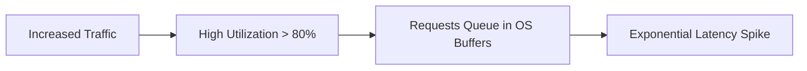
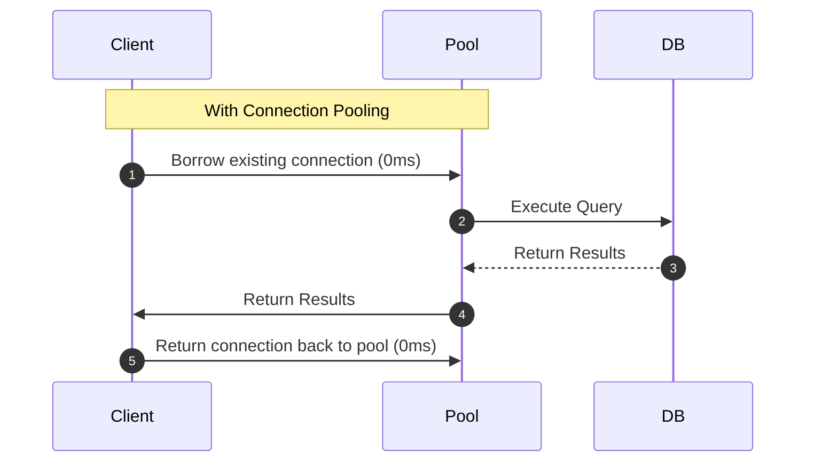

# 📈 Backend Scaling & Performance — Part 1

> **Core Philosophy**: Performance engineering starts with **measurement, not guesswork**. Identify the real bottleneck before writing code or adding hardware. Scaling strategies evolve from **code/query optimization → indexing & connection pooling → caching tiers → vertical/horizontal scaling**.

---

## 📑 Table of Contents
1. [Latency & Response Time (P50, P90, P99)](#1-latency--response-time)
2. [Throughput, Capacity & Utilization Curve](#2-throughput-capacity--utilization-curve)
3. [Finding Bottlenecks: Measure, Don't Guess](#3-finding-bottlenecks)
4. [Profiling vs. Distributed Tracing](#4-profiling-vs-distributed-tracing)
5. [The N+1 Query Problem](#5-the-n1-query-problem)
6. [Database Indexing Principles](#6-database-indexing-principles)
7. [Database Connection Pooling](#7-database-connection-pooling)
8. [Caching Fundamentals & Hit Ratios](#8-caching-fundamentals--hit-ratios)
9. [Cache Invalidation Strategies](#9-cache-invalidation-strategies)
10. [Local vs. Distributed vs. Tiered Caching](#10-local-vs-distributed-vs-tiered-caching)
11. [Caching Design Patterns (Cache-Aside, Write-Through, Write-Back)](#11-caching-design-patterns)
12. [Vertical vs. Horizontal Scaling](#12-vertical-vs-horizontal-scaling)
13. [Interview Must-Know Questions & Cheat Sheet](#13-interview-must-know-questions--cheat-sheet)

---

## 1. Latency & Response Time

**Latency** is the time elapsed between sending a request and receiving the response.

### Why Averages Lie (The Trap of Mean Latency)
If 99 users experience a 10ms latency and 1 user experiences a 10,000ms (10s) delay:
$$\text{Average Latency} = \frac{99 \times 10 + 10,000}{100} = 109.9\text{ms}$$
The average hides the fact that $1\%$ of your customer base had an unusable experience.

### Percentiles Distribution:
- **P50 (Median)**: $50\%$ of requests are faster than this value (typical user experience).
- **P90 / P95**: Identifies performance for users on slower devices/networks.
- **P99 / P99.9 (Tail Latency)**: The slowest $1\%$ of requests. Critical for high-traffic platforms where a single user action triggers 100 backend sub-requests.

---

## 2. Throughput, Capacity & Utilization Curve

- **Latency**: How long *one* request takes (measured in ms).
- **Throughput**: How many requests the system completes per unit time (measured in RPS / QPS).

### The Utilization-Latency Hockey Stick Curve:
As server CPU/Memory utilization passes $\approx 75\%-80\%$, requests begin queuing up in network/OS buffers:



$$\text{Queueing Delay} \propto \frac{\text{Utilization}}{1 - \text{Utilization}}$$

> [!WARNING]
> Near $100\%$ utilization, even a $2\%$ increase in incoming traffic causes request queues to grow infinitely, causing timeouts. **Always maintain 20–30% capacity headroom in production.**

---

## 3. Finding Bottlenecks

> **Golden Rule**: *Measure, don't guess.* Optimizing non-bottlenecks wastes engineering time.

```
1. Measure System Baseline (Metrics/Traces)
        ↓
2. Identify Actual Bottleneck (DB, CPU, Lock contention, Network)
        ↓
3. Apply Targeted Optimization
        ↓
4. Benchmark & Measure Again
        ↓
5. Scale Infrastructure (Only if code/queries are already optimized)
```

---

## 4. Profiling vs. Distributed Tracing

| Dimension | Profiling | Distributed Tracing |
| :--- | :--- | :--- |
| **Question Answered** | *"Which line of code / function is consuming CPU or RAM?"* | *"Which service, database, or external API made this request slow?"* |
| **Scope** | Single application process / runtime stack | End-to-end flow across multiple microservices |
| **Output** | Flame graphs, CPU sampling, memory allocation maps | Span timelines, DAG dependency graphs, latency breakdown |
| **Tools** | pprof (Go), async-profiler (Java), Py-Spy (Python) | Jaeger, OpenTelemetry, Zipkin, AWS X-Ray |

---

## 5. The N+1 Query Problem

### The Pattern:
Occurs when the application executes 1 primary query to fetch $N$ parent records, followed by $N$ separate queries to fetch related child entities.

```
-- Query 1: Fetch 100 Posts
SELECT * FROM posts LIMIT 100;

-- Queries 2 to 101: 100 separate queries to fetch author for each post
SELECT * FROM users WHERE id = 1;
SELECT * FROM users WHERE id = 2;
...
SELECT * FROM users WHERE id = 100;
-- Total: 101 Database Round-trips!
```

### The Fix:
```sql
-- Solution 1: SQL Join
SELECT p.*, u.name, u.email 
FROM posts p 
JOIN users u ON p.author_id = u.id 
LIMIT 100;

-- Solution 2: Batch `IN (...)` Loading
SELECT * FROM users WHERE id IN (1, 2, 3, ..., 100);
```

---

## 6. Database Indexing Principles

An **index** creates an auxiliary B-Tree or Hash data structure to find records in $O(\log N)$ time instead of scanning the full table in $O(N)$ time.

```sql
CREATE INDEX idx_users_email ON users(email);
```

### The Index Trade-Off:
- ✅ **Faster Reads**: Dramatically accelerates `WHERE`, `JOIN`, and `ORDER BY` lookups.
- ⚠️ **Slower Writes**: Every `INSERT`, `UPDATE`, and `DELETE` must rebalance the index tree.
- ⚠️ **Storage Overhead**: Indexes reside in RAM/Disk.

> [!TIP]
> **Use `EXPLAIN ANALYZE`**: Always check execution plans for `Seq Scan` (Table Scan) vs `Index Scan`.

---

## 7. Database Connection Pooling

Establishing a new TCP and TLS database connection requires an authentication handshake, process spawning, and memory allocation ($\approx 50\text{ms} - 150\text{ms}$).



- **Application Pool (Internal)**: Each service instance manages a pool (e.g., HikariCP in Java).
- **External Proxy Pooler**: A centralized gateway (e.g., PgBouncer, AWS RDS Proxy) sitting between hundreds of server instances and the database to prevent database connection starvation.

---

## 8. Caching Fundamentals & Hit Ratios

A **Cache** stores precomputed or frequently retrieved data in high-speed RAM (e.g., Redis, Memcached).

$$\text{Cache Hit Ratio} = \frac{\text{Cache Hits}}{\text{Cache Hits} + \text{Cache Misses}} \times 100$$

- **High Hit Ratio ($> 90\%$)**: Ideal. Most requests avoid touching the primary database.
- **Low Hit Ratio ($< 50\%$)**: Cache churn. Check TTL configuration, key eviction policies, and access skew.

---

## 9. Cache Invalidation Strategies

> *"There are only two hard things in Computer Science: cache invalidation and naming things."* — Phil Karlton

### 1. TTL (Time-To-Live / Time-Based)
Cache automatically expires after duration $T$ (e.g., 5 minutes).
- **Pros**: Automatic memory recovery, simple implementation.
- **Cons**: Stale data risk during the TTL window.

### 2. Event-Driven Invalidation (Active Purge)
Whenever a record is updated/deleted in the database, the backend actively deletes the corresponding cache key:
```
Update DB ──▶ Invalidate / Delete Cache Key
```
- **Pros**: Strong consistency, zero stale data window.
- **Cons**: Every code path that modifies data must reliably trigger cache purges.

---

## 10. Local vs. Distributed vs. Tiered Caching

```mermaid
flowchart TD
    Client --> Local[L1: In-Memory Local Cache (Caffeine/Guava, < 1ms)]
    Local -- Miss --> Dist[L2: Distributed Shared Cache (Redis Cluster, 1-3ms)]
    Dist -- Miss --> DB[(Primary Database, 10-50ms)]
```

| Strategy | Speed | Shared Across Instances? | Inconsistency Risk |
| :--- | :--- | :--- | :--- |
| **Local Cache** | Nanoseconds | ❌ No | High (Instance A has stale data, Instance B updated) |
| **Distributed Cache** | $1-3\text{ms}$ (Network) | ✅ Yes | Low (Single source of truth in Redis) |
| **Tiered (L1 + L2)** | Sub-millisecond | ✅ Yes (L1 acts as hot cache, L2 as shared) | Moderate (Requires short L1 TTL or pub/sub sync) |

---

## 11. Caching Design Patterns

### 1. Cache-Aside (Lazy Loading) — Most Popular
- **Read**: Check Cache $\rightarrow$ If Miss, read DB $\rightarrow$ Populate Cache $\rightarrow$ Return.
- **Write**: Write directly to DB $\rightarrow$ Invalidate Cache key.

### 2. Write-Through
- **Write**: Application writes to Cache; Cache synchronously updates Database before confirming success.
- **Pros**: Cache is never stale.
- **Cons**: Higher write latency.

### 3. Write-Behind (Write-Back)
- **Write**: Application writes to Cache and returns immediately; Cache asynchronously batches updates to the DB.
- **Pros**: Ultra-fast write throughput.
- **Cons**: High risk of data loss if cache node crashes before flushing to disk.

---

## 12. Vertical vs. Horizontal Scaling

```
       Vertical Scaling (Scale UP)                  Horizontal Scaling (Scale OUT)
       ┌─────────────────────────┐               Load Balancer
       │    16 CPU / 64 GB RAM   │              /      |      \
       │    (Single Big Server)  │             ↓       ↓       ↓
       └─────────────────────────┘          [Node 1] [Node 2] [Node 3]
```

| Dimension | Vertical Scaling (Scale Up) | Horizontal Scaling (Scale Out) |
| :--- | :--- | :--- |
| **Approach** | Upgrade existing hardware (CPU/RAM) | Add more commodity instances |
| **Architectural Complexity** | Zero (Monolith remains simple) | High (Statelessness, distributed load, consensus) |
| **Downtime Requirement** | Usually requires downtime to upgrade | Zero downtime rolling deployments |
| **Cost Curve** | Exponential (Specialized hardware) | Linear (Commodity cloud VMs) |
| **Hardware Upper Limit** | Hard ceiling exists | Virtually unlimited |

---

## 13. Interview Must-Know Questions & Cheat Sheet

### 🎯 5 Core Principles to Memorize:
1. **P99 tail latency** determines the experience of high-volume transactions.
2. **N+1 queries** are fixed by Joins, batch fetching (`IN`), or eager loading.
3. **Database connection pooling** eliminates per-request TCP/TLS handshake latency.
4. **Cache-Aside** is the default production pattern: *Cache on demand, invalidate on write*.
5. **Horizontal scaling** requires stateless application servers.
